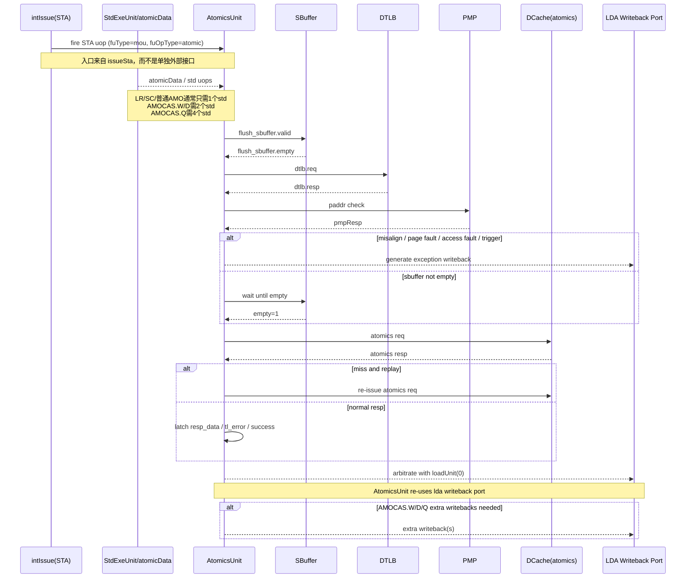

# AtomicsUnit 执行流程分析

## 文档目的
本文档单独总结 `MemBlock` 中 `AtomicsUnit` 的完整执行流程，说明：

- 原子指令如何从后端进入 `MemBlock`
- `AtomicsUnit` 的入口来自哪组接口
- 与 `TLB / DCache / SBuffer / writeback` 的关系
- 状态机如何推进
- 对 UVM 激励和约束建模意味着什么

主要真值来源：

- [MemBlock.scala](/nfs/home/lixiangrui/work/memblock_ut/XiangShan/src/main/scala/xiangshan/mem/MemBlock.scala)
- [AtomicsUnit.scala](/nfs/home/lixiangrui/work/memblock_ut/XiangShan/src/main/scala/xiangshan/mem/pipeline/AtomicsUnit.scala)
- [package.scala](/nfs/home/lixiangrui/work/memblock_ut/XiangShan/src/main/scala/xiangshan/package.scala)

---

## 1. AtomicsUnit 在 MemBlock 中的位置

`AtomicsUnit` 是 `MemBlock` 内部一个专门处理：

- `LR`
- `SC`
- `AMO*`
- `AMOCAS*`

的执行单元。

它并不是从外部独立接一套接口，而是复用了 `MemBlock` 原有的：

- `intIssue`
- `storeDataIn`
- `dtlb`
- `dcache`
- `writeback`

这些路径。

---

## 2. 原子指令入口来源

### 2.1 入口来自 intIssue 的 STA 路径

在 [MemBlock.scala](/nfs/home/lixiangrui/work/memblock_ut/XiangShan/src/main/scala/xiangshan/mem/MemBlock.scala) 中：

- `val intIssue = io.ooo_to_mem.intIssue.flatten`
- `val issueSta = intIssue.filter(_.bits.params.hasStoreAddrFu)`

然后用下面逻辑识别哪些 `STA` 是原子操作：

- `st_atomics = issueSta.map(x => x.valid && FuType.storeIsAMO(x.bits.fuType))`

也就是说：

- `AtomicsUnit` 入口来自 `issueSta`
- 判断条件是 `fuType = mou`

### 2.2 ready 重定向

一旦某一路 `issueSta` 被识别成原子操作：

- `issueSta(i).ready := atomicsUnit.io.in.ready`
- 普通 `storeUnits(i).io.stin.valid := false.B`

含义：

- 这一路不再进普通 `StoreUnit`
- 直接改由 `AtomicsUnit` 消费

### 2.3 输入内容

最终送给 `AtomicsUnit` 的输入是：

- `atomicsUnit.io.in.valid := st_atomics.reduce(_ || _)`
- `atomicsUnit.io.in.bits := Mux1H(st_atomics, issueSta.map(_.bits))`

因此原子指令的“地址侧 uop”来自：

- `intIssue` 的 `STA` 路径

---

## 3. store data 如何进入 AtomicsUnit

原子指令不仅需要地址侧信息，还需要数据侧输入。

在 [MemBlock.scala](/nfs/home/lixiangrui/work/memblock_ut/XiangShan/src/main/scala/xiangshan/mem/MemBlock.scala) 中：

- `lsq.io.std.storeDataIn(i) := stdExeUnits(i).io.sqData`
- `atomicsUnit.io.storeDataIn.zipWithIndex.foreach { case (stdin, i) => stdin := stdExeUnits(i).io.atomicData }`

说明：

- `STD` 路径依然有效
- `stdExeUnits(i)` 会把适用于原子操作的数据送给 `AtomicsUnit`
- 所以完整原子事务不是只打一笔 `STA`
- 还需要与 `STD` 数据路径配合

---

## 4. uopIdx 在原子流程中的作用

`AtomicsUnit.scala` 里明确说明了原子指令需要多少个 `sta/std uop`。

### 4.1 std uop 数量

源码定义：

- 普通 `AMO / LR / SC`
  - 只需要 `1` 个 std uop
  - `uopIdx = 0`
- `AMOCAS.W / D`
  - 需要 `2` 个 std uop
  - `uopIdx = 0, 1`
- `AMOCAS.Q`
  - 需要 `4` 个 std uop
  - `uopIdx = 0, 1, 2, 3`

### 4.2 sta uop 数量

源码定义：

- 普通 `AMO / LR / SC`
  - `1` 个 sta uop
  - `uopIdx = 0`
- `AMOCAS.Q`
  - `2` 个 sta uop
  - `uopIdx = 0, 2`

### 4.3 fuOpType 高位复用

源码中还有一个关键点：

- `stdUopIdxs = io.storeDataIn.map(x => LSUOpType.getAmocasUopIdx(x.bits.fuOpType))`
- `staUopIdx = LSUOpType.getAmocasUopIdx(io.in.bits.fuOpType)`

说明：

- 对 AMOCAS，`fuOpType` 的高位会复用来编码 `uopIdx`
- 也就是说原子类 `fuOpType` 不能只看低 6 bit 操作类型
- 对 `AMOCAS.[W/D/Q]`，高位还携带了子 uop 序号

这也是原子路径建模最容易出错的地方之一。

---

## 5. AtomicsUnit 状态机流程

`AtomicsUnit` 内部采用状态机推进。

虽然这里不逐个展开所有状态定义名，但从执行逻辑可以归纳出以下主流程。

### 阶段 1：接收 STA uop

当 `io.in.fire`：

- 锁存 `uop`
- 锁存 `rs1`
- 根据 `staUopIdx` 记录 `pdest1/pdest2`
- 状态进入：
  - `s_tlb_and_flush_sbuffer_req`

这个阶段说明：

- 原子指令一开始先拿到地址侧信息
- 还未真正发 cache 请求

### 阶段 2：收集 STD 数据

并行地，`io.storeDataIn` 会不断被收集：

- 根据 `stdUopIdxs` 识别是哪一个 data piece
- 写入：
  - `rd_l / rd_h`
  - `rs2_l / rs2_h`

然后通过 `stdCnt` 统计是否收齐。

只有收齐所需 std uop 后：

- `data_valid` 才会置位

这意味着：

- 原子操作可能在地址 uop 到达后，还要等待数据 uop 补齐
- 对 `AMOCAS` 更明显，因为它可能需要多笔 std

### 阶段 3：TLB 查询 + Flush SBuffer 请求

状态 `s_tlb_and_flush_sbuffer_req` 下：

- 发送 DTLB 请求
- 同时请求 flush sbuffer

在 `MemBlock.scala` 中：

- `atomicsUnit.io.flush_sbuffer.empty := stIsEmpty`

在 `AtomicsUnit.scala` 中：

- `io.flush_sbuffer.valid` 会在该阶段拉高

意义：

- 原子操作在真正访问 cache 前，需要确保 store buffer 环境满足原子性要求

### 阶段 4：TLB 响应 / 对齐检查 / 异常检查

当 `dtlb.resp.fire`：

- 锁存 `paddr/gpaddr/vaddr`
- 检查地址对齐
- 检查 page fault / access fault / guest page fault
- 检查 trigger

若有异常：

- 直接进入 `s_finish`
- 不再继续 cache 访问

若无异常：

- 进入 `s_pm`

### 阶段 5：PMP / MMIO / NC / sbuffer empty 检查

在 `s_pm`：

- 检查 PMP 响应
- 判断是否 MMIO / NC / IO
- 更新对应异常位

若仍有异常：

- 进入 `s_finish`

若无异常：

- 如果 `sbuffer` 已空，进入 `s_cache_req`
- 否则进入 `s_wait_flush_sbuffer_resp`

### 阶段 6：等待 sbuffer flush 完成

在 `s_wait_flush_sbuffer_resp`：

- 一直等 `sbuffer_empty`

当 `sbuffer_empty` 为真：

- 进入 `s_cache_req`

### 阶段 7：发 DCache 请求

在 `s_cache_req`：

- 向 `io.dcache.req` 发原子请求

一旦 `dcache.req.fire`：

- 状态进入 `s_cache_resp`

### 阶段 8：等待 DCache 响应

在 `s_cache_resp`：

- 若 miss 且要求 replay
  - 回到 `s_cache_req`
- 若不 miss
  - 锁存响应数据/ID/tl_error
  - 进入 `s_cache_resp_latch`

### 阶段 9：组装结果 / 处理异常

在 `s_cache_resp_latch`：

- 根据访存大小从 dcache 返回数据中选取结果
- 对 `SC` 特殊处理
- 若有 TL denied/corrupt 且 cache error 使能
  - 更新异常位
- 锁存 `resp_data`
- 进入 `s_finish`
- `out_valid := true.B`

### 阶段 10：写回与结束

在 `s_finish`：

- 等 `io.out.toRob.fire`

然后分三种情况：

1. 普通 `AMO / LR / SC`
   - 完成后结束
2. `AMOCAS.W / D`
   - 进入额外写回阶段
3. `AMOCAS.Q`
   - 进入第二阶段写回，再继续额外写回

这说明：

- 原子操作不一定只写回一次
- `AMOCAS` 会带来多次写回/多子 uop 收尾

---

## 6. AtomicsUnit 与其它模块的关系

### 6.1 与 StoreUnit 的关系

原子地址侧 `STA`：
- 不再进入普通 `StoreUnit`

普通 store：
- 仍然进入 `StoreUnit`

### 6.2 与 StdExeUnit 的关系

原子数据侧仍依赖 `StdExeUnit` 生成 `atomicData`。

因此：
- `STA` 和 `STD` 都要建模
- 不能只打一边

### 6.3 与 DTLB 的关系

原子单元复用了：
- loadUnit(0) 的 TLB 端口

在 `MemBlock.scala` 中：

- `when (state =/= s_normal) { atomicsUnit.io.dtlb <> amoTlb }`

### 6.4 与 DCache 的关系

原子单元走：

- `dcache.io.lsu.atomics`

这是一条专门的原子 cache 访问路径，不是普通 load/store 请求口。

### 6.5 与 SBuffer 的关系

原子执行前需要：

- 发 `flush_sbuffer.valid`
- 等 `flush_sbuffer.empty`

这是为了保证原子操作执行时的内存顺序/可见性要求。

### 6.6 与 writeback 的关系

在 `MemBlock.scala` 中：

- `AtomicWBPort = 0`
- `AtomicsUnit` 和 `loadUnit(0)` 共用 `writebackLda(0)` 端口

即：

- 原子单元写回复用 load writeback 口
- 原子和 load0 在该端口上有仲裁

---

## 7. 对 UVM 建模的直接影响

### 7.1 入口 transaction 不是单一一笔

原子操作至少涉及：

- `lintsissue` 的 `STA`
- `STD` 路径对应的数据输入

而不是一笔单独的“atomic transaction”。

### 7.2 `fuType/fuOpType/uopIdx` 必须成组合法

必须保证：

- `fuType = mou`
- `fuOpType` 是原子类 `LSUOpType`
- `uopIdx` 与 `AMOCAS` 子 uop 规则匹配

### 7.3 如果要验证完整原子流程，至少还需要

- sbuffer flush 环境
- dtlb 响应
- dcache 原子响应

否则只能做到“入口激励合法”，不能真正走完整执行链。

### 7.4 首版最容易错的点

- 只打一笔 `STA`，没配 `STD`
- 把 `AMOCAS` 当成单写回
- 没有处理 `fuOpType` 高位复用 `uopIdx`
- 忽略 sbuffer flush 等待阶段
- 把原子请求错误地走普通 `dcache load/store` 通道，而不是 `dcache.io.lsu.atomics`

---

## 8. 总结

`AtomicsUnit` 的完整执行流程可以概括为：

1. 从 `intIssue` 的 `STA` 路径识别 `fuType = mou`
2. 收集 `STD` 路径提供的数据片段
3. 发 DTLB 请求并请求 flush sbuffer
4. 等待 TLB/PMP/flush 条件满足
5. 通过 `dcache.io.lsu.atomics` 发原子 cache 请求
6. 解析返回数据和异常
7. 通过 load writeback 端口仲裁写回
8. 对 `AMOCAS` 额外处理多子 uop 写回

所以：

- 它本质上是复用现有 memblock 访存基础设施的一个特殊执行单元
- 不是“独立插在外面”的一条简单接口
- UVM 侧如果要做原子测试，必须从 `STA + STD + sbuffer + tlb + dcache + writeback` 这整条链一起建模

---

## 9. Mermaid 时序图

下面的时序图用于把源码流程压缩成可读的执行步骤。

### 图中几个关键点

- `intIssue(STA)` 是原子入口，普通 `StoreUnit` 会被旁路掉。
- `StdExeUnit/atomicData` 代表原子操作的数据侧输入，不可省略。
- `flush_sbuffer` 与 `dtlb/pmp` 都发生在真正 `dcache atomics req` 之前。
- `DCache(atomics)` 是专用原子通道，不是普通 load/store 通道。
- `Writeback` 复用 `loadUnit(0)` 的端口，所以需要仲裁。
