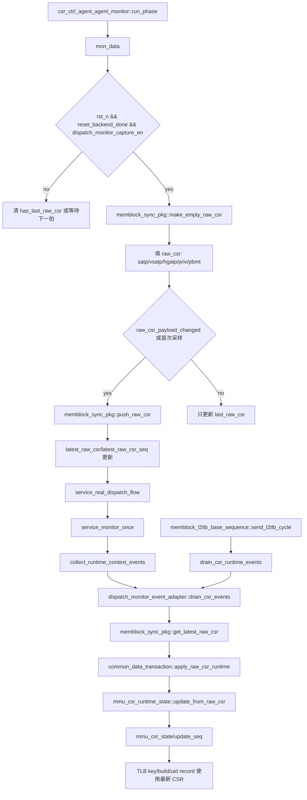

# CSR Runtime Sync Flow

本文档说明 mem_ut 测试框架中 MMU CSR runtime mirror 的真实同步链路。CSR runtime 是 latest snapshot，不是 FIFO 事件：monitor 每拍采样 DUT CSR 输出，只有 payload 变化时更新 `memblock_sync_pkg::latest_raw_csr`；service loop 或 L2TLB responder 通过 `drain_csr_events()` 把最新 snapshot 同步到 `common_data_transaction.mmu_csr_state`。

## 1. 函数调用 Flow 图



### 1.1 函数调用 Flow 图整体文字伪代码

```text
CSR runtime sync 主流程：

1. CSR monitor 采样阶段：
   csr_ctrl_agent_agent_monitor::run_phase 调用 mon_data。
   mon_data 每拍从 csr_ctrl interface 采样 satp/vsatp/hgatp/priv/pbmt 等字段。
   如果 reset 未完成或 dispatch_monitor_capture_en 关闭：
     清空本地 last_raw_csr 有效标记，避免下一次 capture 误认为旧 snapshot 仍连续。
   如果 reset 完成且 capture 打开：
     创建 raw_csr。
     把当前 DUT CSR 信号写入 raw_csr。
     如果是首次采样，或 raw_csr_payload_changed 判断 payload 发生变化：
       调用 push_raw_csr 更新 latest_raw_csr 和 latest_raw_csr_seq。
     最后更新 monitor 本地 last_raw_csr。

2. service loop 同步阶段：
   service_real_dispatch_flow 每拍调用 service_monitor_once。
   service_monitor_once 先调用 collect_runtime_context_events。
   collect_runtime_context_events 先 drain_csr_events，再 drain_sfence_events。
   drain_csr_events 从 memblock_sync_pkg 读取 latest raw CSR snapshot。
   如果 snapshot 有效且 seq 未重复：
     common_data_transaction::apply_raw_csr_runtime 更新 mmu_csr_state。
     mmu_csr_runtime_state::update_from_raw_csr 根据字段变化更新 satp/vsatp/hgatp/priv/pbmt，并在变化时递增 update_seq。

3. L2TLB responder 同步阶段：
   L2TLB responder 收到 DTLB request 后，在建 TLB key 前调用 drain_csr_runtime_events。
   该路径只同步 CSR latest snapshot，不消费 sfence FIFO。
   后续 make_tlb_key_by_req / build_tlb_entry_for_key 使用最新 mmu_csr_state 选择 asid/vmid/s2xlate 相关 key。
```

## 2. `csr_ctrl_agent_agent_monitor::mon_data()`

源码位置：`mem_ut/ver/ut/memblock/agent/csr_ctrl_agent_agent/src/csr_ctrl_agent_agent_monitor.sv`

真实逻辑摘要：

```systemverilog
if (memblock_sync_pkg::dispatch_monitor_capture_en != last_capture_en) begin
    has_last_raw_csr = 1'b0;
    last_capture_en = memblock_sync_pkg::dispatch_monitor_capture_en;
end
if (this.vif.rst_n!=1'b1 || memblock_sync_pkg::reset_backend_done!=1'b1) begin
    has_last_raw_csr = 1'b0;
end
if(this.vif.rst_n==1'b1 && memblock_sync_pkg::reset_backend_done==1'b1 &&
   memblock_sync_pkg::dispatch_monitor_capture_en==1'b1) begin
    raw_csr = memblock_sync_pkg::make_empty_raw_csr();
    raw_csr.valid             = 1'b1;
    raw_csr.satp_mode         = io_ooo_to_mem_tlbCsr_satp_mode;
    raw_csr.satp_asid         = io_ooo_to_mem_tlbCsr_satp_asid;
    raw_csr.vsatp_mode        = io_ooo_to_mem_tlbCsr_vsatp_mode;
    raw_csr.hgatp_mode        = io_ooo_to_mem_tlbCsr_hgatp_mode;
    raw_csr.hgatp_vmid        = io_ooo_to_mem_tlbCsr_hgatp_vmid;
    raw_csr.priv_virt         = io_ooo_to_mem_tlbCsr_priv_virt;
    raw_csr.priv_dmode        = io_ooo_to_mem_tlbCsr_priv_dmode;
    raw_csr.m_pbmt_en         = io_ooo_to_mem_tlbCsr_mPBMTE;
    raw_csr.h_pbmt_en         = io_ooo_to_mem_tlbCsr_hPBMTE;
    raw_csr.cycle             = $time;
    if (!has_last_raw_csr ||
        memblock_sync_pkg::raw_csr_payload_changed(last_raw_csr, raw_csr)) begin
        memblock_sync_pkg::push_raw_csr(raw_csr);
        has_last_raw_csr = 1'b1;
    end
    last_raw_csr = raw_csr;
end
```

功能解释：

该 monitor 是 CSR runtime 的采样入口。它不把每拍 CSR 都排成 FIFO，而是在 capture 打开后只在首次或 payload 变化时推送 latest snapshot。

输入/输出：

- 输入：`csr_ctrl_agent_agent_interface` 上的 `io_ooo_to_mem_tlbCsr_*` 信号、`rst_n`、`reset_backend_done`、`dispatch_monitor_capture_en`。
- 输出：调用 `memblock_sync_pkg::push_raw_csr()` 更新 `latest_raw_csr`。

文字伪代码：

```text
每个 monitor clock：
  采样 DUT 输出的 satp/vsatp/hgatp/priv/pbmt CSR 信号。
  如果 capture enable 状态变化：
    清空本地 has_last_raw_csr，保证下一次 capture 会推送完整 snapshot。
  如果 reset 未完成：
    清空本地 has_last_raw_csr。
  如果 reset 完成且 capture 打开：
    创建空 raw_csr。
    把当前 CSR 信号写入 raw_csr。
    如果本地没有上一份 raw_csr，或 payload 与上一份不同：
      push_raw_csr，把这份 snapshot 写成全局 latest CSR。
      置 has_last_raw_csr=1。
    保存 last_raw_csr，用于下一拍变化比较。
```

内部子调用：

- `make_empty_raw_csr()`：生成默认无效 CSR raw struct，避免未赋字段残留。
- `raw_csr_payload_changed()`：比较关心的 CSR payload 和 changed pulse。
- `push_raw_csr()`：写全局 latest snapshot 并递增 sequence。

## 3. `memblock_sync_pkg::raw_csr_payload_changed()`

源码位置：`mem_ut/ver/ut/memblock/common/memblock_common/src/memblock_sync_pkg.sv`

真实逻辑摘要：

```systemverilog
function bit raw_csr_payload_changed(input dispatch_raw_csr_t prev,
                                     input dispatch_raw_csr_t cur);
    return
        prev.satp_mode         != cur.satp_mode         ||
        prev.satp_asid         != cur.satp_asid         ||
        prev.vsatp_mode        != cur.vsatp_mode        ||
        prev.vsatp_asid        != cur.vsatp_asid        ||
        prev.hgatp_mode        != cur.hgatp_mode        ||
        prev.hgatp_vmid        != cur.hgatp_vmid        ||
        prev.priv_virt         != cur.priv_virt         ||
        prev.priv_dmode        != cur.priv_dmode        ||
        prev.m_pbmt_en         != cur.m_pbmt_en         ||
        prev.h_pbmt_en         != cur.h_pbmt_en         ||
        (cur.satp_changed      && !prev.satp_changed)   ||
        (cur.vsatp_changed     && !prev.vsatp_changed)  ||
        (cur.hgatp_changed     && !prev.hgatp_changed)  ||
        (cur.priv_virt_changed && !prev.priv_virt_changed);
endfunction:raw_csr_payload_changed
```

功能解释：

该函数决定 monitor 是否需要推送新的 CSR snapshot。它既比较稳定 CSR 字段，也比较 changed pulse 的上升语义。

输入/输出：

- 输入：上一份 raw CSR、当前 raw CSR。
- 输出：返回是否需要更新 latest snapshot。

文字伪代码：

```text
比较两份 CSR snapshot：
  如果 satp/vsatp/hgatp 的 mode/asid/vmid/ppn 等字段不同，返回 true。
  如果 priv/pbmt 等运行态字段不同，返回 true。
  如果当前 changed pulse 新出现，返回 true。
  否则返回 false，表示全局 latest CSR 不需要更新。
```

## 4. `memblock_sync_pkg::push_raw_csr()` / `get_latest_raw_csr()`

源码位置：`mem_ut/ver/ut/memblock/common/memblock_common/src/memblock_sync_pkg.sv`

真实逻辑摘要：

```systemverilog
function void push_raw_csr(input dispatch_raw_csr_t item);
    if (dispatch_monitor_capture_en && item.valid) begin
        latest_raw_csr = item;
        latest_raw_csr_valid = 1'b1;
        latest_raw_csr_seq++;
    end
endfunction:push_raw_csr

function bit get_latest_raw_csr(output dispatch_raw_csr_t item,
                                output int unsigned seq);
    seq = latest_raw_csr_seq;
    if (!latest_raw_csr_valid) begin
        item = make_empty_raw_csr();
        return 1'b0;
    end
    item = latest_raw_csr;
    return 1'b1;
endfunction:get_latest_raw_csr
```

功能解释：

CSR runtime 使用 latest snapshot 模型。`push_raw_csr()` 覆盖旧 snapshot 并递增 seq，`get_latest_raw_csr()` 返回当前最新值。

输入/输出：

- 输入：raw CSR snapshot。
- 输出：`latest_raw_csr`、`latest_raw_csr_valid`、`latest_raw_csr_seq`。

文字伪代码：

```text
push_raw_csr：
  如果 capture 打开且 item 有效：
    用 item 覆盖 latest_raw_csr。
    标记 latest_raw_csr_valid=1。
    latest_raw_csr_seq 加一。

get_latest_raw_csr：
  先输出当前 seq。
  如果 latest snapshot 无效：
    返回空 raw_csr。
    返回 false。
  如果有效：
    返回 latest_raw_csr。
    返回 true。
```

## 5. `dispatch_monitor_event_adapter::drain_csr_events()`

源码位置：`mem_ut/ver/ut/memblock/seq/base_seq_help/dispatch_monitor_event_adapter.sv`

真实逻辑摘要：

```systemverilog
function void drain_csr_events();
    memblock_sync_pkg::dispatch_raw_csr_t raw_csr;
    int unsigned raw_csr_seq;

    ensure_handles();
    if (memblock_sync_pkg::get_latest_raw_csr(raw_csr, raw_csr_seq)) begin
        data.apply_raw_csr_runtime(raw_csr, raw_csr_seq);
    end
endfunction:drain_csr_events
```

功能解释：

adapter 从 sync_pkg 读取 latest CSR snapshot，并把它同步到 `common_data_transaction` 的 runtime CSR mirror。

输入/输出：

- 输入：`latest_raw_csr` 和 `latest_raw_csr_seq`。
- 输出：可能更新 `data.mmu_csr_state`。

文字伪代码：

```text
drain_csr_events：
  确保 data 和相关 handler 可用。
  从 memblock_sync_pkg 获取 latest raw CSR 和 seq。
  如果 latest CSR 有效：
    调用 apply_raw_csr_runtime，把 snapshot 应用到公共 CSR runtime mirror。
  如果 latest CSR 无效：
    什么都不做。
```

内部子调用：

- `ensure_handles()`：保证 `common_data_transaction` 可用。
- `get_latest_raw_csr()`：读取 latest snapshot，不出队 FIFO。
- `apply_raw_csr_runtime()`：按 seq 去重后更新 runtime mirror。

## 6. `common_data_transaction::apply_raw_csr_runtime()`

源码位置：`mem_ut/ver/ut/memblock/seq/base_seq_help/common_data_transaction.sv`

真实逻辑摘要：

```systemverilog
function void apply_raw_csr_runtime(input memblock_sync_pkg::dispatch_raw_csr_t raw,
                                    input int unsigned raw_csr_seq);
    if (!raw.valid) begin
        return;
    end
    if (raw_csr_seq == last_applied_raw_csr_seq) begin
        return;
    end
    if (mmu_csr_state == null) begin
        mmu_csr_state = mmu_csr_runtime_state::type_id::create("mmu_csr_state");
        mmu_csr_state.reset();
    end
    mmu_csr_state.update_from_raw_csr(raw);
    last_applied_raw_csr_seq = raw_csr_seq;
endfunction:apply_raw_csr_runtime
```

功能解释：

该函数是公共 data owner 应用 CSR snapshot 的唯一落点。它用 `last_applied_raw_csr_seq` 防止同一个 latest snapshot 在多个 service 调用中重复应用。

输入/输出：

- 输入：raw CSR snapshot、raw CSR seq。
- 输出：`mmu_csr_state` 创建/更新，`last_applied_raw_csr_seq` 更新。

文字伪代码：

```text
应用 raw CSR：
  如果 raw 无效：
    直接返回。
  如果 seq 已经应用过：
    直接返回，避免重复更新。
  如果 mmu_csr_state 尚未创建：
    创建并 reset。
  调用 update_from_raw_csr，把 raw 字段写入 runtime mirror。
  记录 last_applied_raw_csr_seq。
```

## 7. `mmu_csr_runtime_state::update_from_raw_csr()`

源码位置：`mem_ut/ver/ut/memblock/seq/base_seq_help/mmu_csr_runtime_state.sv`

真实逻辑摘要：

```systemverilog
changed =
    satp_mode  != raw.satp_mode         ||
    satp_asid  != raw.satp_asid         ||
    vsatp_mode != raw.vsatp_mode        ||
    vsatp_asid != raw.vsatp_asid        ||
    hgatp_mode != raw.hgatp_mode        ||
    hgatp_vmid != raw.hgatp_vmid        ||
    priv_virt  != raw.priv_virt         ||
    raw.satp_changed                    ||
    raw.vsatp_changed                   ||
    raw.hgatp_changed                   ||
    raw.priv_virt_changed;

satp_mode  = raw.satp_mode;
satp_asid  = raw.satp_asid;
vsatp_mode = raw.vsatp_mode;
vsatp_asid = raw.vsatp_asid;
hgatp_mode = raw.hgatp_mode;
hgatp_vmid = raw.hgatp_vmid;
priv_virt  = raw.priv_virt;
if (changed) begin
    update_seq++;
end
```

功能解释：

runtime mirror 保存当前 MMU CSR 状态，并用 `update_seq` 记录语义变化次数。后续 TLB key、uid TLB record 和 responder 建表都读这个对象。

输入/输出：

- 输入：raw CSR snapshot。
- 输出：`satp/vsatp/hgatp/priv/pbmt` 字段更新，必要时 `update_seq++`。

文字伪代码：

```text
更新 CSR runtime mirror：
  如果 raw 无效：
    直接返回。
  比较 raw 和当前 mirror，判断是否发生语义变化。
  将 raw 中 satp/vsatp/hgatp/priv/pbmt 字段写入 mirror。
  如果字段变化或 changed pulse 有效：
    update_seq 加一。
```

## 8. `make_lookup_key()` / `expected_s2xlate()`

源码位置：`mem_ut/ver/ut/memblock/seq/base_seq_help/mmu_csr_runtime_state.sv`

真实逻辑摘要：

```systemverilog
function bit [1:0] expected_s2xlate(input bit is_hypervisor_inst);
    if (!(priv_virt || is_hypervisor_inst)) begin
        return 2'd0;
    end
    if (vsatp_mode != 4'd0 && hgatp_mode != 4'd0) begin
        return 2'd3;
    end
    if (vsatp_mode == 4'd0) begin
        return 2'd2;
    end
    if (hgatp_mode == 4'd0) begin
        return 2'd1;
    end
    return 2'd0;
endfunction:expected_s2xlate

function memblock_tlb_lookup_key_t make_lookup_key(input bit [63:0] vpn,
                                                   input bit [1:0] s2xlate);
    memblock_tlb_lookup_key_t key;

    key.vpn     = vpn[51:0];
    key.asid    = current_asid(s2xlate);
    key.vmid    = current_vmid(s2xlate);
    key.s2xlate = s2xlate;
    return key;
endfunction:make_lookup_key
```

功能解释：

这组函数把 runtime CSR 转成 TLB 使用的上下文：`expected_s2xlate()` 用于 uid TLB record 预期路径，`make_lookup_key()` 用接口 request 的 `s2xlate` 生成 `{vpn, asid, vmid, s2xlate}` key。

输入/输出：

- 输入：runtime CSR 字段、vpn、s2xlate、是否 hypervisor 指令。
- 输出：预期 s2xlate 或 TLB lookup key。

文字伪代码：

```text
expected_s2xlate：
  如果当前既不是虚拟化状态，也不是 hypervisor 指令：返回 0。
  如果 vsatp 和 hgatp 都开启：返回 3。
  如果 vsatp 关闭：返回 2。
  如果 hgatp 关闭：返回 1。
  其它情况返回 0。

make_lookup_key：
  key.vpn 取输入 vpn 低 52 位。
  根据 s2xlate 从 runtime CSR 选择 asid。
  根据 s2xlate 从 runtime CSR 选择 vmid。
  保存 s2xlate。
  返回完整 lookup key。
```

## 9. 队列和状态说明

- `latest_raw_csr`：全局 latest snapshot，只保留最新 CSR runtime，不是 FIFO。
- `latest_raw_csr_seq`：每次 latest snapshot 更新时递增，`apply_raw_csr_runtime()` 用它去重。
- `mmu_csr_state`：`common_data_transaction` 内的运行时 CSR 镜像，TLB 建表和 uid TLB record 都从这里读实时 CSR。
- `update_seq`：CSR runtime 语义变化计数，目前用于 debug/追踪，不再作为 TLB key 命中强制条件。
- `raw_sfence_q`：独立 FIFO，和 CSR latest snapshot 分开；只由 `drain_sfence_events()` 消费。

## 10. 分支优先级

1. monitor 先看 reset/capture，未打开 capture 时不推送 CSR。
2. monitor 只在首次或 payload changed 时 push，避免每拍重复刷新 latest snapshot。
3. adapter 只读取 latest snapshot，不消费 sfence FIFO。
4. `apply_raw_csr_runtime()` 先按 valid/seq 去重，再更新 runtime mirror。
5. L2TLB responder 在建 key 前只 drain CSR，保证 request 使用最新 CSR，同时不抢先消费 sfence 事件。

## 11. 端到端行为总结

```text
场景 A：CSR payload 变化
  csr_ctrl monitor
  -> raw_csr_payload_changed=true
  -> push_raw_csr 更新 latest_raw_csr/latest_raw_csr_seq
  -> collect_runtime_context_events
  -> drain_csr_events
  -> apply_raw_csr_runtime
  -> update_from_raw_csr
  -> mmu_csr_state 更新

场景 B：CSR payload 未变化
  csr_ctrl monitor
  -> raw_csr_payload_changed=false
  -> 不 push_raw_csr
  -> latest_raw_csr_seq 不变
  -> apply_raw_csr_runtime 即使被调用也不会产生新变化

场景 C：L2TLB responder 建表前同步 CSR
  DTLB request valid
  -> send_l2tlb_cycle
  -> drain_csr_runtime_events
  -> drain_csr_events
  -> apply_raw_csr_runtime
  -> make_tlb_key_by_req 使用最新 asid/vmid/s2xlate 上下文
```

### 11.1 端到端文字伪代码

```text
场景 A：
  当 DUT CSR 输出变化时，monitor 把当前 CSR 信号封装成 raw_csr。
  raw_csr_payload_changed 返回 true 后，push_raw_csr 覆盖 latest snapshot 并递增 seq。
  service loop 下一拍先调用 drain_csr_events。
  drain_csr_events 读取 latest snapshot 并调用 apply_raw_csr_runtime。
  apply_raw_csr_runtime 按 seq 去重后更新 mmu_csr_state。
  后续 TLB key、uid record 和 responder 查表都读这个最新 runtime mirror。

场景 B：
  如果 CSR payload 没有变化，monitor 不 push。
  latest_raw_csr_seq 不递增。
  因此重复调用 drain_csr_events 不会造成重复 update_seq 或旧值覆盖。

场景 C：
  L2TLB responder 收到 DTLB request 后先同步 CSR latest snapshot。
  然后使用 request 的 s2xlate 和 runtime CSR 的 asid/vmid 生成 key。
  该路径不消费 sfence FIFO，sfence 仍由统一 service loop 顺序处理。
```
