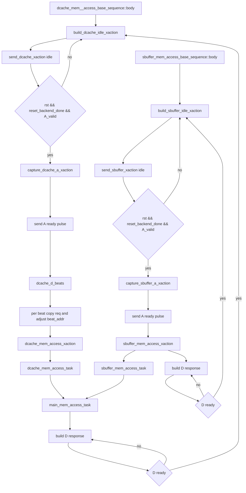

# DCache/SBuffer Memory Responder Flow

本文档说明 mem_ut 中 `mem_base_sequence.sv` 提供的 DCache 和 SBuffer memory responder flow。它们是 DUT 下游 TileLink-like memory responder：采样 A channel request，访问 sequence 内部 `main_mem`，再驱动 D channel response。

## 1. 函数调用 Flow 图



### 1.1 函数调用 Flow 图整体文字伪代码

```text
DCache responder 主流程：
  body 每拍先发送 idle xaction。
  如果 reset 完成且 DCache A channel valid：
    capture_dcache_a_xaction 采样请求。
    发送一拍 A ready 接收请求。
    dcache_d_beats 根据 opcode/size 计算 D response beat 数。
    每个 beat 调整地址后调用 dcache_mem_access_xaction。
    dcache_mem_access_xaction 访问 main_mem 并构造 D response。
    body 循环发送 D response，直到 DUT D ready。

SBuffer responder 主流程：
  body 每拍先发送 idle xaction。
  如果 reset 完成且 SBuffer A channel valid：
    capture_sbuffer_a_xaction 采样请求。
    发送一拍 A ready 接收请求。
    sbuffer_mem_access_xaction 访问 main_mem 并构造单拍 D response。
    body 循环发送 D response，直到 DUT D ready。

共享 memory 访问：
  dcache/sbuffer task 都调用 main_mem_access_task。
  main_mem_access_task 对 store 按 byte mask 更新 main_mem，对 load 返回 main_mem 数据。
```

## 2. `dcache_mem__access_base_sequence::body()`

源码位置：`mem_ut/ver/ut/memblock/seq/base_seq_help/mem_base_sequence.sv`

真实逻辑摘要：

```systemverilog
forever begin
    build_dcache_idle_xaction(idle_xact);
    send_dcache_xaction(idle_xact);

    if (dcache_vif.rst_n == 1'b1 &&
        memblock_sync_pkg::reset_backend_done == 1'b1 &&
        dcache_vif.auto_inner_dcache_client_out_a_valid === 1'b1) begin
        capture_dcache_a_xaction(req_xact);
        build_dcache_idle_xaction(idle_xact);
        idle_xact.auto_inner_dcache_client_out_a_ready = 1'b1;
        send_dcache_xaction(idle_xact);
        beats = dcache_d_beats(req_xact.auto_inner_dcache_client_out_a_bits_opcode,
                               req_xact.auto_inner_dcache_client_out_a_bits_size);
        for (int unsigned beat_idx = 0; beat_idx < beats; beat_idx++) begin
            beat_req_xact.copy(req_xact);
            beat_addr = dcache_beat_addr(req_xact.auto_inner_dcache_client_out_a_bits_address) +
                        (mem_addr_t'(beat_idx) * 48'd32);
            beat_req_xact.auto_inner_dcache_client_out_a_bits_address = beat_addr;
            dcache_mem_access_xaction(beat_req_xact, rsp_xact);
            rsp_xact.auto_inner_dcache_client_out_a_ready = 1'b0;
            do begin
                send_dcache_xaction(rsp_xact);
            end while (dcache_vif.auto_inner_dcache_client_out_d_ready !== 1'b1);
        end
    end
end
```

功能解释：

DCache responder 常驻运行，先保持 idle，再在 A valid 时接收请求并按 D ready backpressure 驱动 response。

输入/输出：

- 输入：DCache A channel request、D channel ready。
- 输出：A ready pulse、D channel response。

文字伪代码：

```text
DCache responder 循环：
  构造并发送 idle xaction。
  如果 reset 完成且 A valid：
    采样 A request。
    发送一拍 A ready，表示接收请求。
    根据 opcode/size 计算 D response beat 数。
    对每个 beat：
      复制原始 request。
      按 beat_idx 调整地址到对应 32B beat。
      调用 dcache_mem_access_xaction 构造 response。
      清 response 的 A ready。
      持续发送 response，直到 DUT D ready。
```

内部子调用：

- `build_dcache_idle_xaction()`：清空 DCache responder 输出。
- `capture_dcache_a_xaction()`：从 vif 采样 A channel payload。
- `dcache_d_beats()`：确定 response beat 数。
- `dcache_mem_access_xaction()`：访问 main memory 并生成 D response。

## 3. `dcache_mem_access_xaction()`

源码位置：`mem_ut/ver/ut/memblock/seq/base_seq_help/mem_base_sequence.sv`

真实逻辑摘要：

```systemverilog
is_store = is_store_opcode(req_xact.auto_inner_dcache_client_out_a_bits_opcode);
dcache_mem_access_task(
    req_xact.auto_inner_dcache_client_out_a_bits_address,
    is_store,
    dcache_beat_mask(req_xact.auto_inner_dcache_client_out_a_bits_opcode,
                     req_xact.auto_inner_dcache_client_out_a_bits_mask),
    req_xact.auto_inner_dcache_client_out_a_bits_data,
    corrupt,
    denied,
    load_data
);

rsp_xact.auto_inner_dcache_client_out_d_valid        = 1'b1;
rsp_xact.auto_inner_dcache_client_out_d_bits_opcode  =
    dcache_d_opcode(req_xact.auto_inner_dcache_client_out_a_bits_opcode);
rsp_xact.auto_inner_dcache_client_out_d_bits_size    = req_xact.auto_inner_dcache_client_out_a_bits_size;
rsp_xact.auto_inner_dcache_client_out_d_bits_source  = req_xact.auto_inner_dcache_client_out_a_bits_source;
rsp_xact.auto_inner_dcache_client_out_d_bits_denied  = denied;
rsp_xact.auto_inner_dcache_client_out_d_bits_data    = is_store ? '0 : load_data;
rsp_xact.auto_inner_dcache_client_out_d_bits_corrupt = corrupt;
```

功能解释：

该 task 把一笔 DCache A request 转成 D response。store 只更新 memory 并返回 ack；load 从 memory 读数据并返回 AccessAckData/GrantData。

输入/输出：

- 输入：DCache A request xaction。
- 输出：DCache D response xaction。

文字伪代码：

```text
构造 DCache response：
  根据 opcode 判断是否 store。
  调用 dcache_mem_access_task：
    对 store 写 main_mem。
    对 load 读 main_mem。
    返回 corrupt/denied/load_data。
  设置 D channel valid。
  根据 A opcode 选择 D opcode。
  复制 size/source。
  写入 denied/corrupt。
  如果是 store，D data 为 0；如果是 load，D data 为 load_data。
```

内部子调用：

- `is_store_opcode()`：判断 PutFullData/PutPartialData。
- `dcache_beat_mask()`：Acquire 使用全 mask，其它请求使用原 mask。
- `dcache_d_opcode()`：把 A opcode 映射成 D opcode。
- `dcache_mem_access_task()`：访问共享 memory。

## 4. `sbuffer_mem_access_base_sequence::body()`

源码位置：`mem_ut/ver/ut/memblock/seq/base_seq_help/mem_base_sequence.sv`

真实逻辑摘要：

```systemverilog
forever begin
    build_sbuffer_idle_xaction(idle_xact);
    send_sbuffer_xaction(idle_xact);

    if (sbuffer_vif.rst_n == 1'b1 &&
        memblock_sync_pkg::reset_backend_done == 1'b1 &&
        sbuffer_vif.auto_inner_buffers_out_a_valid === 1'b1) begin
        capture_sbuffer_a_xaction(req_xact);
        build_sbuffer_idle_xaction(idle_xact);
        idle_xact.auto_inner_buffers_out_a_ready = 1'b1;
        send_sbuffer_xaction(idle_xact);
        sbuffer_mem_access_xaction(req_xact, rsp_xact);
        rsp_xact.auto_inner_buffers_out_a_ready = 1'b0;

        do begin
            send_sbuffer_xaction(rsp_xact);
        end while (sbuffer_vif.auto_inner_buffers_out_d_ready !== 1'b1);
    end
end
```

功能解释：

SBuffer responder 和 DCache responder 类似，但当前实现是单 beat response。它接收 SBuffer A request，访问 shared memory，然后等待 D ready。

输入/输出：

- 输入：SBuffer A channel request、D channel ready。
- 输出：A ready pulse、D channel response。

文字伪代码：

```text
SBuffer responder 循环：
  发送 idle xaction。
  如果 reset 完成且 A valid：
    采样 A request。
    发送一拍 A ready。
    调用 sbuffer_mem_access_xaction 构造 response。
    清 response 的 A ready。
    持续发送 D response，直到 DUT D ready。
```

## 5. `sbuffer_mem_access_xaction()`

源码位置：`mem_ut/ver/ut/memblock/seq/base_seq_help/mem_base_sequence.sv`

真实逻辑摘要：

```systemverilog
is_store = is_store_opcode(req_xact.auto_inner_buffers_out_a_bits_opcode);
sbuffer_mem_access_task(
    req_xact.auto_inner_buffers_out_a_bits_address,
    is_store,
    req_xact.auto_inner_buffers_out_a_bits_mask,
    req_xact.auto_inner_buffers_out_a_bits_data,
    corrupt,
    denied,
    load_data
);

rsp_xact.auto_inner_buffers_out_a_ready        = 1'b1;
rsp_xact.auto_inner_buffers_out_d_valid        = 1'b1;
rsp_xact.auto_inner_buffers_out_d_bits_opcode  = is_store ? 4'd0 : 4'd1;
rsp_xact.auto_inner_buffers_out_d_bits_size    = req_xact.auto_inner_buffers_out_a_bits_size;
rsp_xact.auto_inner_buffers_out_d_bits_source  = req_xact.auto_inner_buffers_out_a_bits_source;
rsp_xact.auto_inner_buffers_out_d_bits_denied  = denied;
rsp_xact.auto_inner_buffers_out_d_bits_data    = is_store ? '0 : load_data;
rsp_xact.auto_inner_buffers_out_d_bits_corrupt = corrupt;
```

功能解释：

该 task 把 SBuffer A request 转成 D response。store 返回 ack，load 返回数据。

输入/输出：

- 输入：SBuffer A request xaction。
- 输出：SBuffer D response xaction。

文字伪代码：

```text
构造 SBuffer response：
  根据 opcode 判断是否 store。
  调用 sbuffer_mem_access_task 访问 shared memory。
  设置 A ready 和 D valid。
  store response opcode 为 0，load response opcode 为 1。
  复制 size/source。
  写入 denied/corrupt。
  store 不返回 data，load 返回 load_data。
```

## 6. `main_mem_access_task()`

源码位置：`mem_ut/ver/ut/memblock/seq/base_seq_help/mem_base_sequence.sv`

真实逻辑摘要：

```systemverilog
line_addr = addr[47:6];
line_offset = addr[5:0];
ensure_main_line(line_addr);
line_data = main_mem[line_addr];

if (is_store) begin
    for (int unsigned byte_idx = 0; byte_idx < 64; byte_idx++) begin
        if (byte_mask[byte_idx]) begin
            line_data[byte_idx*8 +: 8] = store_data[byte_idx*8 +: 8];
        end
    end
    main_mem[line_addr] = line_data;
end
load_data = line_data;
paddr_to_error(addr, corrupt, denied);
```

功能解释：

这是 DCache/SBuffer responder 共享的 memory 后端。它按 64B cache line 存储，用 byte mask 支持部分写。

输入/输出：

- 输入：物理地址、store/load 类型、byte mask、store data。
- 输出：load data、corrupt、denied，并可能更新 `main_mem`。

文字伪代码：

```text
访问 shared main_mem：
  根据地址计算 line_addr 和 line_offset。
  如果 main_mem 没有该 line：
    ensure_main_line 创建 lazy line。
  读取 line_data。
  如果是 store：
    遍历 64 个 byte。
    对 byte_mask=1 的 byte 写入 store_data。
    把更新后的 line_data 写回 main_mem。
  无论 load/store，都把 line_data 返回给 load_data。
  调用 paddr_to_error 计算 corrupt/denied。
```

内部子调用：

- `ensure_main_line()`：懒创建 memory line。
- `build_lazy_line()`：按 line address 生成默认数据。
- `paddr_to_error()`：根据地址范围返回 corrupt/denied。

## 7. 队列和状态说明

- 这两个 responder 不使用 `common_data_transaction` 的 issue queue/status table。
- `main_mem` 是 `mem_access_base_sequence` 内部 associative array，按 line address 保存 64B 数据。
- DCache responder 会处理多 beat AcquireBlock，SBuffer responder 当前按单 beat 响应。
- request/response 没有显式软件队列；A request 被采样后立即构造 response，并在 D ready 前重复 drive 同一个 response。

## 8. 分支优先级

1. reset 未完成时只发送 idle。
2. A valid 为 0 时只发送 idle。
3. A valid 为 1 时先发送 A ready 接收 request，再访问 memory。
4. D response 会一直 drive 到 D ready。
5. store 更新 memory 后返回 ack；load 不更新 memory，只返回 data。
6. DCache AcquireBlock 根据 size 可能多 beat，SBuffer 当前没有多 beat loop。

## 9. 端到端行为总结

```text
场景 A：DCache load
  DCache A valid Get/Acquire
  -> capture_dcache_a_xaction
  -> A ready pulse
  -> dcache_mem_access_xaction
  -> main_mem_access_task load
  -> D valid with load_data
  -> wait D ready

场景 B：DCache store
  DCache A valid Put
  -> capture_dcache_a_xaction
  -> A ready pulse
  -> dcache_mem_access_xaction
  -> main_mem_access_task masked store
  -> D valid ack no data
  -> wait D ready

场景 C：SBuffer request
  SBuffer A valid
  -> capture_sbuffer_a_xaction
  -> A ready pulse
  -> sbuffer_mem_access_xaction
  -> main_mem_access_task
  -> D valid response
  -> wait D ready
```

### 9.1 端到端文字伪代码

```text
场景 A：
  DCache responder 发现 A valid 后采样 request。
  它先给 A ready，表示请求已被 testbench memory 接收。
  对 load，dcache_mem_access_xaction 从 main_mem 读取 line data。
  然后构造带 data 的 D response，并一直发送到 DUT D ready。

场景 B：
  DCache responder 发现 store request 后采样 request。
  main_mem_access_task 按 byte mask 更新对应 cache line。
  D response 只返回 ack，不返回 store data。
  如果 DUT 暂时不 ready，sequence 持续 drive 同一 response。

场景 C：
  SBuffer responder 的处理模型类似 DCache，但当前是单 beat response。
  它采样 request、发送 A ready、访问 main_mem，再等待 D ready 完成响应。
```
