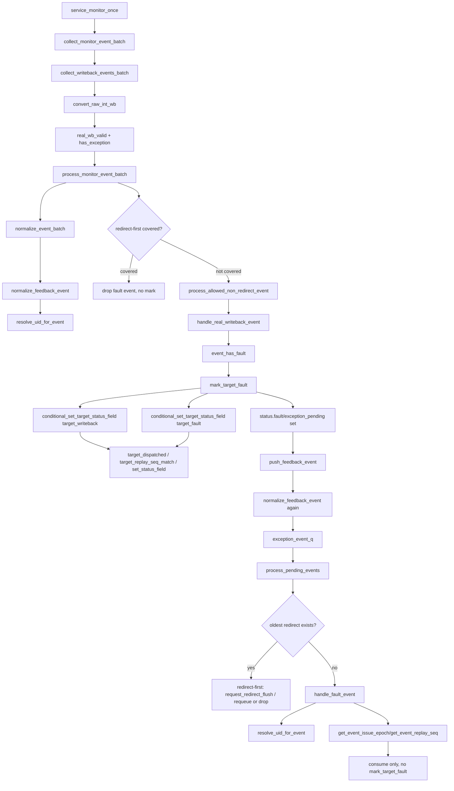

# Fault / Exception Flow

本文按通用 flow 文档规则整理 mem_ut 中 real writeback fault 之后的处理。关键结论：**fault 状态先在 `writeback_status_handler::handle_real_writeback_event()` 中通过 `mark_target_fault()` 落表；随后 fault event 进入 `push_feedback_event()`，由 `handle_fault_event()` 消费，但不重复 mark fault。**

## 1. 函数调用 Flow 图



## 1.1 函数调用 Flow 图整体文字伪代码

```text
Fault / Exception 主流程：

1. raw writeback 采集和转换：
   service_monitor_once 调用 collect_monitor_event_batch；
   collect_writeback_events_batch 从 raw int writeback queue 出队；
   convert_raw_int_wb 根据 exception_vec!=0 生成 fault 语义 memblock_wb_event_t，并补 ROB/LQ/SQ key。

2. batch 级 redirect-first 仲裁：
   process_monitor_event_batch 先调用 normalize_event_batch；
   normalize_feedback_event 通过 active ROB/LQ/SQ map 解析 uid，并补齐 issue_epoch/replay_seq；
   如果 active redirect 或同批 oldest redirect 覆盖该 fault，直接 drop，不允许 mark fault；
   如果未覆盖，进入 process_allowed_non_redirect_event。

3. fault 状态落表：
   handle_real_writeback_event 判断 event_has_fault；
   调用 mark_target_fault：先设置 target writeback，再设置 target fault，并置 status.fault/exception_pending；
   fault 状态在这里已经完成，后续 recovery handler 不重复写 fault。

4. recovery queue 消费：
   mark_target_fault 后调用 push_feedback_event；
   push_feedback_event 再次 normalize，成功后写入 exception_event_q；
   process_pending_events 出队后如果没有 redirect 抢占，调用 handle_fault_event；
   handle_fault_event 只解析 uid/issue_epoch/replay_seq 并消费事件，不重新调用 mark_target_fault。
```


## 2. `convert_raw_int_wb()` fault event 生成

源码位置：`mem_ut/ver/ut/memblock/seq/base_seq_help/dispatch_monitor_event_adapter.sv`

真实逻辑摘要：

```systemverilog
wb_event.real_wb_valid = 1'b1;
wb_event.has_exception = raw.exception_vec != '0;
wb_event.exception_vec = raw.exception_vec;
wb_event.has_rob = raw_rob_to_key(...);
case (raw.port_id)
    0,1,2: target = LOAD;
    3,4:   target = STA;
    5,6:   target = STD;
endcase
```

功能解释：

fault 来源于真实 writeback 端口的 `exception_vec != 0`。adapter 只设置 `has_exception/exception_vec` 和 target/key，不在这里写 fault 状态。

输入/输出：

- 输入：raw int writeback。
- 输出：带 `has_exception=1` 的 `memblock_wb_event_t` 进入 batch。

文字伪代码：

```text
pop raw int writeback；
调用 convert_raw_int_wb：设置 real_wb_valid=1；
根据 exception_vec 是否非 0 设置 has_exception；
根据 port_id 设置 LOAD/STA/STD target；
填 ROB/LQ/SQ key；
把 event 放入 batch，等待 redirect-first 仲裁。
```

内部子调用：

- `raw_rob_to_key()` / `raw_lq_to_key()` / `raw_sq_to_key()`：提供 uid 反查依据。

## 3. batch handler 对 fault 的 redirect-first 防护

源码位置：`mem_ut/ver/ut/memblock/seq/base_seq_help/dispatch_monitor_batch_handler.sv`

真实逻辑摘要：

```systemverilog
if (select_oldest_redirect(normalized_events, selected_redirect_event)) begin
    selected_redirect = redirect_from_event(selected_redirect_event);
    data.push_feedback_event(selected_redirect_event);
    foreach (normalized_events[idx]) begin
        if (event_covered_by_redirect(normalized_events[idx], selected_redirect)) continue;
        else void'(process_allowed_non_redirect_event(normalized_events[idx]));
    end
end else begin
    foreach (normalized_events[idx]) void'(process_allowed_non_redirect_event(normalized_events[idx]));
end
```

功能解释：

fault 只有在未被 active/same-batch redirect 覆盖时才允许落表。如果 older redirect 覆盖了该 fault，batch handler 直接 drop，避免旧动态实例 fault 污染 redirect 后状态。

输入/输出：

- 输入：normalized fault event。
- 输出：未覆盖时进入 writeback handler；覆盖时 drop。

文字伪代码：

```text
调用 normalize_event_batch：fault event 需要先 resolve uid 和补齐 issue_epoch/replay_seq；
如果 active_redirect 存在，调用 event_covered_by_redirect，覆盖则 drop；
如果同 batch 有 redirect，调用 select_oldest_redirect 选最老 redirect；
调用 event_covered_by_redirect 判断 fault 是否被 oldest redirect 覆盖；
覆盖则 drop，不调用 mark_target_fault；
未覆盖则调用 process_allowed_non_redirect_event，进入 handle_real_writeback_event。
```

内部子调用：

- `normalize_feedback_event()`：fault 落表前规范化。
- `event_covered_by_redirect()`：调用 `rob_order_util::rob_need_flush()`。
- `process_allowed_non_redirect_event()`：分派到 `handle_real_writeback_event()`。

## 4. `handle_real_writeback_event()` fault 分支

源码位置：`mem_ut/ver/ut/memblock/seq/base_seq_help/writeback_status_handler.sv:79`

真实逻辑摘要：

```systemverilog
if (event_has_fault(wb_event)) begin
    if (!data.mark_target_fault(uid, wb_event.target,
                                issue_epoch, replay_seq,
                                wb_event.exception_vec, wb_event.cycle)) begin
        return 1'b0;
    end
    data.push_feedback_event(wb_event);
    return 1'b1;
end
```

功能解释：

fault 分支先落表，再入 recovery queue。这样 status 立即阻塞后续 pass/success；后续 recovery handler 只是消费 fault event，不再写 fault 状态。

输入/输出：

- 输入：未被 redirect 覆盖的 fault event。
- 输出：target fault/status fault 落表，event 入 `exception_event_q`。

文字伪代码：

```text
调用 event_has_fault：检查 has_exception 或 exception_vec 非 0；
如果是 fault：
  调用 mark_target_fault：写 target writeback/fault，设置 uid fault/exception_pending；
  如果 mark_target_fault 返回 false，说明 event stale，drop；
  mark 成功后调用 push_feedback_event：把 fault event 放入 recovery queue；
  返回 1；
normal pass 分支不会执行。
```

内部子调用：

- `event_has_fault()`：fault 判断。
- `mark_target_fault()`：fault 唯一落表点。
- `push_feedback_event()`：fault 后续 recovery 消费入口。

## 5. `mark_target_fault()`

源码位置：`mem_ut/ver/ut/memblock/seq/base_seq_help/common_data_transaction.sv:612`

真实逻辑摘要：

```systemverilog
if (!conditional_set_target_status_field(uid, target_writeback_field(target), 1'b1, target, issue_epoch, replay_seq)) return 1'b0;
if (!conditional_set_target_status_field(uid, target_fault_field(target), 1'b1, target, issue_epoch, replay_seq)) return 1'b0;
status = get_status(uid);
status.fault = 1'b1;
status.exception_pending = 1'b1;
status.exception_vec = exception_vec;
status.pass = 1'b0;
status.success = 1'b0;
status.last_event_cycle = cycle;
```

功能解释：

这是 fault 的唯一状态落表点。它先用同 normal pass 一样的 epoch/replay 防护写 target writeback/fault，再设置 uid 级 fault/exception pending。`exception_pending` 会阻塞 normal pass 成功路径，但 fault uid 后续到达 ROB commit/deq 前沿后，会通过 `consume_fault_retire()` 作为非成功终态退休。

输入/输出：

- 输入：uid、target、issue_epoch、replay_seq、exception_vec、cycle。
- 输出：target fault 和 uid fault 状态。

文字伪代码：

```text
调用 conditional_set_target_status_field 写 target_writeback：检查 active、未 issue_killed、target_dispatched、issue_epoch 和 replay_seq；
如果失败，返回 false；
调用 conditional_set_target_status_field 写 target_fault：使用同样 stale event 防护；
如果失败，返回 false；
调用 get_status 获取 status；
设置 status.fault=1；
设置 status.exception_pending=1；
保存 exception_vec；
清 status.pass/status.success/status.terminal_done，防止 fault uid 在 commit 前被当作成功或终态；
更新 last_event_cycle；
返回 true。
```

内部子调用：

- `target_writeback_field()`：target 到 `load/sta/std_writeback` 字段映射。
- `target_fault_field()`：target 到 `load/sta/std_fault` 字段映射。
- `conditional_set_target_status_field()`：epoch/replay 防护状态写入口。

## 6. fault 如何阻塞 normal pass 并等待 commit terminal retire

源码位置：`mem_ut/ver/ut/memblock/seq/base_seq_help/common_data_transaction.sv`

真实逻辑摘要：

```systemverilog
// mark_target_normal_pass
if (status.fault || status.exception_pending || status.redirect_pending ||
    target_entry_done(status, target)) return 1'b0;
...
if (required_targets_done(uid) && !status.fault && !status.exception_pending &&
    !status.replay_pending && !status.redirect_pending) begin
    status.writeback = 1'b1;
    status.pass = 1'b1;
end
```

功能解释：

fault 落表后，后续同 uid/target 的 normal pass 会被 `status.fault/exception_pending` 拦住。即使其它 target 已完成，uid 总体 `pass` 也不会置高。该阻塞只是不允许 fault 被误当作 normal pass；当该 uid 到达 commit/deq 前沿时，`try_retire_committed_uid()` 会识别 fault/exception，并调用 `consume_fault_retire()` 设置 `success=0 && terminal_done=1`。

输入/输出：

- 输入：fault 后的 status。
- 输出：阻塞后续 normal pass；等待 commit/deq 后进入 fault terminal retire。

文字伪代码：

```text
后续如果迟到 normal pass 进入 mark_target_normal_pass：
  首先检查 status.fault 或 exception_pending；
  如果为 1，直接返回 false；
  不会写 target pass；
required_targets_done 即使返回 true，也还要检查 !status.fault 和 !status.exception_pending；
因此 fault uid 不会变成总体 pass/success；
后续 commit/deq 完成后，try_retire_committed_uid 会把 fault uid 转成非成功终态 terminal_done。
```

内部子调用：

- `mark_target_normal_pass()`：fault 后会拒绝 pass。
- `required_targets_done()`：被 fault/pending 条件共同约束。
- `try_retire_committed_uid()`：commit/deq 后识别 fault 并进入 terminal retire。
- `consume_fault_retire()`：清 exception_pending，设置 success=0、terminal_done=1 并释放 active uid。

## 6.1 `consume_fault_retire()`

源码位置：`mem_ut/ver/ut/memblock/seq/base_seq_help/common_data_transaction.sv`

真实逻辑摘要：

```systemverilog
if (!status.fault && !status.exception_pending &&
    !status.load_fault && !status.sta_fault && !status.std_fault) begin
    `uvm_fatal("COMMON_DATA", ...)
end
status.exception_pending = 1'b0;
set_status_field(uid, MEMBLOCK_STATUS_SUCCESS, 1'b0);
set_status_field(uid, MEMBLOCK_STATUS_TERMINAL_DONE, 1'b1);
retire_active_uid(uid);
```

功能解释：

这是 fault/exception 从 pending 状态进入最终终态的收口。它不把 fault 当成 normal success，而是设置 `success=0`、`terminal_done=1`，让完成前缀可以越过合法 fault，同时保留非成功结果供后续 checker 或日志区分。

输入/输出：

- 输入：已经完成 ROB commit 且 LQ/SQ active map 已释放的 fault uid。
- 输出：清 `exception_pending`，设置 `terminal_done=1`，释放 active uid。

文字伪代码：

```text
读取 uid status；
如果 uid 没有 fault、exception_pending 或 target fault：
  fatal，说明该函数被错误调用；
清 exception_pending：
  fault 已经被 commit retire 消费，不再作为 pending 中间态；
设置 success=0：
  表示该 uid 不是 normal pass；
设置 terminal_done=1：
  表示该 uid 生命周期已结束，并推进 terminal_done_uid；
调用 retire_active_uid：
  删除 active ROB/LQ/SQ map，清 active 状态。
```

内部子调用：

- `set_status_field(MEMBLOCK_STATUS_SUCCESS, 0)`：记录非成功结果。
- `set_status_field(MEMBLOCK_STATUS_TERMINAL_DONE, 1)`：推进 completion 前缀。
- `retire_active_uid()`：释放 active 生命周期。

## 7. `push_feedback_event()` 后 fault 入队

源码位置：`mem_ut/ver/ut/memblock/seq/base_seq_help/common_data_transaction.sv`

真实逻辑摘要：

```systemverilog
if (!normalize_feedback_event(wb_event, normalized_event)) return;
exception_event_q.push_back(normalized_event);
```

功能解释：

fault 状态已经落表，但 event 仍进入 recovery queue，目的是让 recovery handler 统一消费 fault/replay/redirect 队列，保留后续扩展或调试上下文。入队前仍做 normalize，过滤已失效事件。

输入/输出：

- 输入：fault event。
- 输出：`exception_event_q` 中的 normalized fault event。

文字伪代码：

```text
调用 normalize_feedback_event：再次解析 active uid、补齐 replay_seq，检查非 redirect target 合法；
如果 replay 后缺 issue_epoch/replay_seq snapshot，drop；
如果 normalize 成功，把 fault event push_back 到 exception_event_q；
等待 process_pending_events 消费。
```

内部子调用：

- `normalize_feedback_event()`：fault 入队前二次防线。
- `resolve_uid_for_event()`：确认 fault event 仍属于 active uid。

## 8. `process_pending_events()` / `handle_fault_event()`

源码位置：`mem_ut/ver/ut/memblock/seq/base_seq_help/exception_redirect_replay_handler.sv`

真实逻辑摘要：

```systemverilog
foreach (events[idx]) begin
    if (event_is_redirect(events[idx])) continue;
    if (event_is_replay(events[idx])) handle_replay_event(events[idx]);
    else if (event_is_fault(events[idx])) handle_fault_event(events[idx]);
end

function void handle_fault_event(input memblock_wb_event_t wb_event);
    if (!data.resolve_uid_for_event(wb_event, uid)) return;
    issue_epoch = data.get_event_issue_epoch(wb_event, uid);
    replay_seq  = data.get_event_replay_seq(wb_event, uid);
    `uvm_info(...);
endfunction
```

功能解释：

`handle_fault_event()` 只是 fault recovery event 的消费点。它不调用 `mark_target_fault()`，因为 fault 已经在 writeback handler 中落表。它重新解析 uid/epoch/replay_seq，用于过滤失效事件和保留调试信息。

输入/输出：

- 输入：`exception_event_q` 中的 fault event。
- 输出：消费完成；不改变 target fault 状态。

文字伪代码：

```text
process_pending_events 先处理 service_ptw_wait_replay 和 advance_active_redirect；
如果存在 active_redirect，暂停消费 fault；
pop exception_event_q 到本地 events；
如果 recovery events 中有 redirect，redirect 优先，fault 被覆盖则 drop，未覆盖则 push_front 回 exception_event_q；
如果没有 redirect，遍历 events：
  调用 event_is_fault 判断 fault；
  调用 handle_fault_event；
handle_fault_event 内部：
  调用 resolve_uid_for_event：确认 fault event 仍属于 active uid；
  调用 get_event_issue_epoch：读取 event 快照或 status target issue epoch；
  调用 get_event_replay_seq：读取 event 快照或 status replay_seq；
  打印 consume fault recovery event；
  不调用 mark_target_fault，不重复设置 fault。
```

内部子调用：

- `event_is_fault()`：判断 `has_exception || exception_vec != 0`。
- `resolve_uid_for_event()`：过滤失效 uid。
- `get_event_issue_epoch()` / `get_event_replay_seq()`：读取调试和过滤上下文。

## 9. 端到端行为总结

```text
real writeback fault 未被 redirect 覆盖：
  raw int writeback exception_vec!=0
  -> convert_raw_int_wb(has_exception=1)
  -> process_monitor_event_batch
  -> normalize_event_batch / normalize_feedback_event / resolve_uid_for_event
  -> redirect-first 仲裁确认未被覆盖
  -> process_allowed_non_redirect_event
  -> handle_real_writeback_event
  -> event_has_fault
  -> mark_target_fault
  -> conditional_set_target_status_field(target_writeback)
  -> conditional_set_target_status_field(target_fault)
  -> status.fault=1 / exception_pending=1 / pass=0 / success=0 / terminal_done=0
  -> push_feedback_event
  -> normalize_feedback_event 二次规范化
  -> exception_event_q
  -> process_pending_events
  -> handle_fault_event
  -> resolve_uid_for_event / get_event_issue_epoch / get_event_replay_seq
  -> consume only，不重复 mark_target_fault
  -> 后续 ROB commit 且 LQ/SQ deq 完成
  -> try_retire_committed_uid
  -> consume_fault_retire
  -> success=0 / terminal_done=1 / active=0

fault 被 older redirect 覆盖：
  raw int writeback fault 与 older redirect 同 batch 或 active redirect 覆盖
  -> process_monitor_event_batch
  -> event_covered_by_redirect
  -> drop fault event
  -> 不调用 mark_target_fault，不调用 push_feedback_event

fault 后迟到 normal pass：
  status.fault=1 或 exception_pending=1
  -> mark_target_normal_pass 开头检查失败
  -> 拒绝 target pass 和 uid pass
  -> fault 阻塞 normal success，但不阻塞后续 terminal_done retire
```

端到端文字伪代码描述：

```text
real writeback fault 未被 redirect 覆盖：
  当真实 int writeback 的 exception_vec 非 0 时，adapter 生成 has_exception 的 wb_event；
  batch handler normalize 并做 redirect-first 检查，确认该 fault 不属于被 flush 的旧动态实例；
  handle_real_writeback_event 识别 event_has_fault，先调用 mark_target_fault；
  mark_target_fault 通过 conditional_set_target_status_field 写 target_writeback 和 target_fault；
  条件写入会检查 active、target_dispatched、issue_epoch 和 replay_seq，避免旧 fault 污染新实例；
  target fault 写入成功后，uid 级 fault/exception_pending 置位，pass/success/terminal_done 清零；
  fault event 随后进入 push_feedback_event，用于 recovery queue 统一消费和调试追踪；
  process_pending_events 中没有 redirect 抢占时，handle_fault_event 只解析 uid/epoch/replay_seq 并消费 event；
  handle_fault_event 不再调用 mark_target_fault，避免 fault 状态重复写入。
  当该 uid 后续完成 ROB commit 且 LQ/SQ active map 都释放后：
    try_retire_committed_uid 识别 fault/exception；
    调用 consume_fault_retire；
    清 exception_pending，设置 success=0 和 terminal_done=1；
    retire_active_uid 释放 active 状态；
    terminal_done_uid 可以越过该 fault uid。

fault 被 older redirect 覆盖：
  如果同 batch 或 active redirect 覆盖该 fault 的 ROB，batch handler 直接 drop fault event；
  drop 后不会调用 mark_target_fault，因此不会设置 fault/exception_pending；
  该 uid 后续由 redirect flush/reissue 流程重新生成动态实例。

fault 后迟到 normal pass：
  fault 已落表后，如果同 uid 后续又收到迟到 pass；
  mark_target_normal_pass 首先检查 status.fault/exception_pending；
  检查失败后直接返回 false；
  因此 target pass 和 uid pass 都不会被重新置高，fault 会阻塞 normal success；
  fault 最终仍可在 commit/deq 前沿进入 success=0、terminal_done=1 的非成功终态。
```
