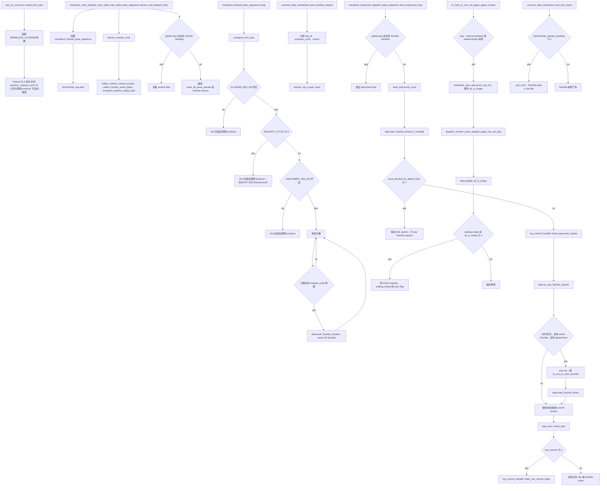

# MemBlock flushSb 队列式请求 Flow

本文说明当前 mem_ut dispatch 框架中 `flushSb` directed flow。当前实现使用
`common_data_transaction` 中的 `flushsb_req_q` 请求队列：

```text
flushSb producer
  -> common_data_transaction::push_flushsb_request()
  -> memblock_lsqcommit_dispatch_base_sequence::send_lsqcommit_cycle()
  -> 普通 lsqcommit xaction 上附加 io_ooo_to_mem_flushSb=1
  -> ctrl monitor 采样 io_mem_to_ooo_sbIsEmpty
  -> common_data_transaction::update_sb_is_empty()
```

对应主要源码：

- `mem_ut/ver/ut/memblock/env/plus.sv`
- `mem_ut/ver/ut/memblock/seq/base_seq_help/seq_csr_common.sv`
- `mem_ut/ver/ut/memblock/seq/base_seq_help/memblock_dispatch_types.sv`
- `mem_ut/ver/ut/memblock/seq/base_seq_help/common_data_transaction.sv`
- `mem_ut/ver/ut/memblock/seq/base_seq_help/lsq_commit_handler.sv`
- `mem_ut/ver/ut/memblock/seq/base_seq/memblock_flushsb_base_sequence.sv`
- `mem_ut/ver/ut/memblock/seq/base_seq/memblock_lsqcommit_dispatch_base_sequence.sv`
- `mem_ut/ver/ut/memblock/seq/base_seq/memblock_main_dispatch_auto_build_main_table_base_sequence.sv`
- `mem_ut/ver/ut/memblock/agent/io_mem_to_ooo_ctrl_agent_agent/src/io_mem_to_ooo_ctrl_agent_agent_monitor.sv`
- `mem_ut/ver/ut/memblock/seq/base_seq_help/dispatch_monitor_event_adapter.sv`

## 1. 函数调用 Flow 图



### 1.1 函数调用 Flow 图整体文字伪代码

```text
flushSb 队列式主流程：

1. 参数阶段：
   seq_csr_common::reload_from_plus 读取 MEMBLOCK_FLUSHSB_SEQ_EN、MEMBLOCK_FLUSHSB_REQUEST_CYCLE、MEMBLOCK_FLUSHSB_TIMEOUT；
   MEMBLOCK_FLUSHSB_SEQ_EN 只控制周期 producer 是否运行，不 gate push_flushsb_request；
   MEMBLOCK_FLUSHSB_REQUEST_CYCLE=0 只表示周期 producer 不自动触发，不影响其它 producer 不定时 push；
   MEMBLOCK_FLUSHSB_TIMEOUT=0 表示关闭 timeout warning，不再 clamp 到 1。

2. 周期 producer 阶段：
   real smoke service flow fork memblock_flushsb_base_sequence；
   flushsb_base_sequence 如果没有开启、request_cycle 为 0，或 LSQCOMMIT sequence 关闭，则只打印 info 后退出；
   如果开启且 request_cycle 非 0，则每拍计数；
   计数达到 request_cycle 的整数倍时调用 push_flushsb_request，把 periodic 请求写入 flushsb_req_q。

3. LSQ commit consumer 阶段：
   memblock_lsqcommit_dispatch_base_sequence 每拍先检查 active flushSb timeout warning；
   如果 global flush/redirect/freeze 正在阻塞，驱动 idle xaction，并且不 pop flushSb queue；
   否则先 build 普通 commit xaction，保持 LSQ commit 字段正常赋值；
   再调用 try_pop_flushsb_request；
   如果队列非空、当前没有 active flushSb waiting，且未被 global flush 阻塞，则 pop 一个请求；
   将本拍 xaction 的 io_ooo_to_mem_flushSb 置 1，并调用 mark_flushsb_driven 进入 waiting empty。

4. sbIsEmpty 回采阶段：
   mark_flushsb_driven 设置 dispatch_flushsb_waiting_empty=1；
   ctrl monitor 因该同步标志持续采样 sbIsEmpty，即使本拍没有 LQ/SQ deq 也会 push raw_ctrl；
   dispatch_monitor_event_adapter::apply_raw_ctrl_deq 调用 update_sb_is_empty；
   如果 active flushSb 正在 waiting 且 sbIsEmpty=1，则清 active request、waiting_empty 和 sync flag。

5. 收尾阶段：
   顶层 service flow 在 global_stop_requested 之后继续服务，直到 data.flushsb_request_pending() 为 0；
   end_test_check 再检查 flushSb 队列和 active waiting 是否都为空；
   如果队列未消费或已经 drive 但未等到 sbIsEmpty，则报 uvm_error。
```

## 2. 参数配置语义

参数定义在 `plus.sv`：

```systemverilog
`MEMBLOCK_PLUS_ARGS_DEFINE(MEMBLOCK_FLUSHSB_SEQ_EN, bit, 1'b0)
`MEMBLOCK_PLUS_ARGS_DEFINE(MEMBLOCK_FLUSHSB_REQUEST_CYCLE, int, 0)
`MEMBLOCK_PLUS_ARGS_DEFINE(MEMBLOCK_FLUSHSB_TIMEOUT, int, 1000)
```

默认 cfg：

```text
+MEMBLOCK_FLUSHSB_SEQ_EN=0
+MEMBLOCK_FLUSHSB_REQUEST_CYCLE=0
+MEMBLOCK_FLUSHSB_TIMEOUT=1000
```

语义：

- `MEMBLOCK_FLUSHSB_SEQ_EN=1`：允许 `memblock_flushsb_base_sequence` 周期性 producer 运行。
- `MEMBLOCK_FLUSHSB_SEQ_EN=0`：周期 producer 不运行，但其它代码仍可直接调用 `push_flushsb_request()`。
- `MEMBLOCK_FLUSHSB_REQUEST_CYCLE=0`：周期 producer 不自动入队；表示支持不定时 directed producer。
- `MEMBLOCK_FLUSHSB_REQUEST_CYCLE=N`：周期 producer 每 N 个有效 clk 入队一个请求。
- `MEMBLOCK_FLUSHSB_TIMEOUT=0`：关闭 timeout warning。
- `MEMBLOCK_FLUSHSB_TIMEOUT=N`：active flushSb 等待 `sbIsEmpty` 达到 N 个 dispatch service cycle 后只报一次 warning，不 fatal。
- `MEMBLOCK_LSQCOMMIT_SEQ_EN=0`：没有 consumer 承载 `io_ooo_to_mem_flushSb`，周期 producer 打印 info 后退出，不报 fatal。

## 3. `memblock_flushsb_req_t`

源码位置：`mem_ut/ver/ut/memblock/seq/base_seq_help/memblock_dispatch_types.sv`

真实逻辑摘要：

```systemverilog
typedef struct {
    int unsigned              req_id;
    longint unsigned          enqueue_cycle;
    int unsigned              source;
} memblock_flushsb_req_t;
```

功能解释：

这是 flushSb 队列元素。它不影响 DUT 端口语义，只用于让公共队列记录请求来源和 debug 信息。

输入/输出：

- 输入：producer 入队时提供 `source`。
- 输出：consumer pop 后把该请求备份到 `active_flushsb_req`，用于 timeout/completion 日志。

文字伪代码：

```text
req_id：
  记录请求编号，便于 timeout 或 completion 日志定位是哪一次 flushSb。
enqueue_cycle：
  记录请求入队时的 dispatch service cycle，便于判断请求在队列中停留了多久。
source：
  记录请求来源标签；0 表示 directed/unknown，1 表示 periodic。
```

## 4. `common_data_transaction` flushSb 状态

源码位置：`mem_ut/ver/ut/memblock/seq/base_seq_help/common_data_transaction.sv`

真实逻辑摘要：

```systemverilog
memblock_flushsb_req_t      flushsb_req_q[$];
memblock_flushsb_req_t      active_flushsb_req;
bit                         active_flushsb_req_valid;
int unsigned                next_flushsb_req_id;
bit                         flushsb_waiting_empty;
longint unsigned            flushsb_start_cycle;
bit                         last_sb_is_empty;
bit                         flushsb_timeout_warned;
```

功能解释：

这些字段把 flushSb flow 拆成两个阶段：`flushsb_req_q` 表示尚未 drive 的请求；`active_flushsb_req_valid/flushsb_waiting_empty` 表示已经 drive 到 DUT、正在等待 `sbIsEmpty` 的请求。

输入/输出：

- 输入：producer 入队、LSQ commit consumer 出队、ctrl monitor 回采 `sbIsEmpty`。
- 输出：队列深度、active request、waiting 状态和 timeout warning 状态。

文字伪代码：

```text
flushsb_req_q：
  保存所有待消费 flushSb 请求；
  producer 只 push，LSQ commit sequence 只 pop。

active_flushsb_req / active_flushsb_req_valid：
  保存已经 drive 到 DUT 的请求；
  waiting_empty 完成前不能再 pop 新请求。

next_flushsb_req_id：
  每次 push 后递增，为请求分配唯一 debug id。

flushsb_waiting_empty：
  表示 DUT 已收到 flushSb pulse，测试框架正在等待 sbIsEmpty。

flushsb_start_cycle：
  记录 drive flushSb 的 cycle，供 timeout warning 计算 age。

last_sb_is_empty：
  记录 ctrl monitor 最近采到的 sbIsEmpty。

flushsb_timeout_warned：
  当前 active 请求是否已经报过 timeout warning，避免每拍刷屏。
```

## 5. `common_data_transaction::push_flushsb_request()`

源码位置：`mem_ut/ver/ut/memblock/seq/base_seq_help/common_data_transaction.sv`

真实逻辑摘要：

```systemverilog
function void push_flushsb_request(input int unsigned source = 0);
    memblock_flushsb_req_t req;

    req.req_id        = next_flushsb_req_id;
    req.enqueue_cycle = memblock_sync_pkg::get_dispatch_service_cycle();
    req.source        = source;
    next_flushsb_req_id++;
    flushsb_req_q.push_back(req);
    `uvm_info("COMMON_DATA", ...)
endfunction
```

功能解释：

这是所有 flushSb producer 的统一入口。该函数只负责入队，不检查 `MEMBLOCK_FLUSHSB_SEQ_EN`，因此周期 producer 之外的 directed 场景也可以不定时触发 flushSb。

输入/输出：

- 输入：`source` 来源标签。
- 输出：`flushsb_req_q` 增加一个请求，`next_flushsb_req_id` 递增。

文字伪代码：

```text
创建 req；
把 next_flushsb_req_id 写入 req.req_id；
读取当前 dispatch service cycle，写入 req.enqueue_cycle；
保存调用方传入的 source；
递增 next_flushsb_req_id，为下一次请求准备编号；
把 req push 到 flushsb_req_q 尾部；
打印 info，说明 req_id、source、enqueue_cycle 和当前队列深度。
```

## 6. `has_pending_flushsb_request()` / `flushsb_busy()` / `flushsb_request_pending()`

源码位置：`mem_ut/ver/ut/memblock/seq/base_seq_help/common_data_transaction.sv`

真实逻辑摘要：

```systemverilog
function bit has_pending_flushsb_request();
    return flushsb_req_q.size() != 0;
endfunction

function bit flushsb_busy();
    return flushsb_waiting_empty;
endfunction

function bit flushsb_request_pending();
    return has_pending_flushsb_request() ||
           flushsb_busy() ||
           active_flushsb_req_valid;
endfunction
```

功能解释：

这三个函数分别表达队列待消费、active 请求未完成、整体 flow 未收敛。

输入/输出：

- 输入：`flushsb_req_q`、`flushsb_waiting_empty`、`active_flushsb_req_valid`。
- 输出：布尔返回值，供 LSQ commit loop、顶层 service flow 和 end check 使用。

文字伪代码：

```text
has_pending_flushsb_request：
  如果 flushsb_req_q 非空，表示还有请求没被 consumer pop。

flushsb_busy：
  只读取 flushsb_waiting_empty；如果为 1，表示已有请求打到 DUT 且正在等待 sbIsEmpty。

flushsb_request_pending：
  先调用 has_pending_flushsb_request，判断队列是否还有待消费请求；
  再调用 flushsb_busy，判断是否有 active 请求正在等待 sbIsEmpty；
  最后检查 active_flushsb_req_valid，作为 active 请求备份有效位的一致性收尾保护；
  三者任一为 true，说明 flushSb flow 还不能收尾。
```

## 7. `common_data_transaction::try_pop_flushsb_request()`

源码位置：`mem_ut/ver/ut/memblock/seq/base_seq_help/common_data_transaction.sv`

真实逻辑摘要：

```systemverilog
function bit try_pop_flushsb_request(output memblock_flushsb_req_t req);
    req = '{default:'0};
    if (flushsb_busy()) begin
        return 1'b0;
    end
    if (issue_blocked_by_global_flush()) begin
        return 1'b0;
    end
    if (!has_pending_flushsb_request()) begin
        return 1'b0;
    end
    req = flushsb_req_q.pop_front();
    return 1'b1;
endfunction
```

功能解释：

这是 LSQ commit consumer 的唯一出队入口。它保证同一时间只有一个 active flushSb 等待 `sbIsEmpty`，并且 global flush/redirect/freeze 期间不会丢失队列请求。

输入/输出：

- 输入：flushSb 队列、active 状态、global flush/redirect 状态。
- 输出：成功时返回 1 并输出 `req`；失败时返回 0 且不改变队列。

文字伪代码：

```text
先把输出 req 清成默认值，避免调用方误用旧值；
调用 flushsb_busy：
  如果已有 active flushSb 在等 sbIsEmpty，则返回 false，不弹出新请求；
调用 issue_blocked_by_global_flush：
  判断 redirect/global flush/issue freeze 是否正在阻塞接口驱动；
  如果阻塞，则返回 false，请求继续留在队列里；
调用 has_pending_flushsb_request：
  如果队列为空，返回 false；
否则从 flushsb_req_q 队头 pop 一个请求；
返回 true，表示调用方可以在本拍 xaction 上附加 io_ooo_to_mem_flushSb=1。
```

内部子调用：

- `flushsb_busy()`：判断是否已有 active flushSb 未完成。
- `issue_blocked_by_global_flush()`：复用全局恢复控制 gating，避免恢复窗口内插入新 flushSb pulse。
- `has_pending_flushsb_request()`：判断队列是否非空。

## 8. `mark_flushsb_driven()` / `update_sb_is_empty()`

源码位置：`mem_ut/ver/ut/memblock/seq/base_seq_help/common_data_transaction.sv`

真实逻辑摘要：

```systemverilog
function void mark_flushsb_driven(input memblock_flushsb_req_t req,
                                  input longint unsigned cycle);
    active_flushsb_req       = req;
    active_flushsb_req_valid = 1'b1;
    flushsb_waiting_empty    = 1'b1;
    flushsb_start_cycle      = cycle;
    last_sb_is_empty         = 1'b0;
    flushsb_timeout_warned   = 1'b0;
    memblock_sync_pkg::dispatch_flushsb_waiting_empty = 1'b1;
endfunction

function void update_sb_is_empty(input bit sb_is_empty);
    last_sb_is_empty = sb_is_empty;
    if (flushsb_waiting_empty && sb_is_empty) begin
        flushsb_waiting_empty    = 1'b0;
        active_flushsb_req       = '{default:'0};
        active_flushsb_req_valid = 1'b0;
        flushsb_start_cycle      = 0;
        flushsb_timeout_warned   = 1'b0;
        memblock_sync_pkg::dispatch_flushsb_waiting_empty = 1'b0;
    end
endfunction
```

功能解释：

`mark_flushsb_driven()` 在 LSQ commit xaction 已经附加 flushSb pulse 后调用，把请求切到 active waiting 状态。`update_sb_is_empty()` 由 ctrl monitor drain 路径调用，在 DUT 表示 SBuffer empty 后完成该请求。

输入/输出：

- 输入：已 pop 的 `req`、drive cycle、monitor 采样到的 `sb_is_empty`。
- 输出：active request、waiting 状态、sync flag 和 timeout 状态更新。

文字伪代码：

```text
mark_flushsb_driven：
  保存刚刚 drive 的 req，供 timeout/completion 日志使用；
  设置 active_flushsb_req_valid=1，表示当前有 active flushSb；
  设置 flushsb_waiting_empty=1，表示开始等待 DUT sbIsEmpty；
  记录 flushsb_start_cycle；
  清 last_sb_is_empty，避免复用上一笔请求的 empty 结果；
  清 flushsb_timeout_warned，允许本次请求最多报一次 timeout warning；
  设置 dispatch_flushsb_waiting_empty=1，通知 ctrl monitor 即使没有 deq 也要采 sbIsEmpty。

update_sb_is_empty：
  先保存最近一次 sbIsEmpty 采样值；
  如果当前正在等待 empty 且 sb_is_empty=1：
    打印 completion info；
    清 flushsb_waiting_empty；
    清 active request 及 valid bit；
    清 start cycle 和 timeout warning 状态；
    清 dispatch_flushsb_waiting_empty，让 ctrl monitor 回到普通采样条件。
  如果 sb_is_empty=0 或当前没有 waiting：
    只更新 last_sb_is_empty，不结束请求。
```

## 9. `common_data_transaction::warn_flushsb_timeout_if_needed()`

源码位置：`mem_ut/ver/ut/memblock/seq/base_seq_help/common_data_transaction.sv`

真实逻辑摘要：

```systemverilog
function void warn_flushsb_timeout_if_needed(input int unsigned timeout);
    longint unsigned age;

    if (!flushsb_waiting_empty || timeout == 0 || flushsb_timeout_warned) begin
        return;
    end
    age = (memblock_sync_pkg::get_dispatch_service_cycle() >= flushsb_start_cycle) ?
          (memblock_sync_pkg::get_dispatch_service_cycle() - flushsb_start_cycle) : 0;
    if (age >= timeout) begin
        `uvm_warning("COMMON_DATA", ...)
        flushsb_timeout_warned = 1'b1;
    end
endfunction
```

功能解释：

该函数只做诊断，不改变 flushSb flow 的完成条件。timeout 到达后只报一次 warning，不 fatal、不清 waiting、不丢 active request。

输入/输出：

- 输入：`timeout`，来自 `seq_csr_common::get_flushsb_timeout()`。
- 输出：必要时打印一次 warning，并设置 `flushsb_timeout_warned=1`。

文字伪代码：

```text
如果当前没有 active flushSb waiting：
  直接返回；
如果 timeout=0：
  表示关闭 warning，直接返回；
如果本 active request 已经报过 warning：
  直接返回，避免每拍重复刷屏；
计算当前 dispatch service cycle 距离 flushsb_start_cycle 的 age；
如果 age 大于等于 timeout：
  打印 uvm_warning，带 req_id/source/age/timeout/start_cycle/last_sb_is_empty；
  设置 flushsb_timeout_warned=1。
```

## 10. `memblock_flushsb_base_sequence::body()`

源码位置：`mem_ut/ver/ut/memblock/seq/base_seq/memblock_flushsb_base_sequence.sv`

真实逻辑摘要：

```systemverilog
seq_csr_common::init();
configure_from_plus();
if (!enable) return;
if (request_cycle == 0) return;
if (!seq_csr_common::get_lsqcommit_seq_en()) return;

ensure_handles();
cycle_count = 0;
forever begin
    if (data.is_global_stop_requested()) break;
    wait_clock_tick();
    if (data.is_global_stop_requested()) break;
    if (service_vif.rst_n !== 1'b1 ||
        memblock_sync_pkg::reset_backend_done !== 1'b1 ||
        !data.main_table_ready) begin
        continue;
    end
    cycle_count++;
    if ((cycle_count % request_cycle) == 0) begin
        data.push_flushsb_request(FLUSHSB_SOURCE_PERIODIC);
    end
end
```

功能解释：

这是周期性 producer。它不驱动 DUT 接口，只在满足参数和运行期条件后向 `flushsb_req_q` 入队。

输入/输出：

- 输入：`MEMBLOCK_FLUSHSB_SEQ_EN`、`MEMBLOCK_FLUSHSB_REQUEST_CYCLE`、`MEMBLOCK_LSQCOMMIT_SEQ_EN`、reset/main table/global stop。
- 输出：周期性调用 `push_flushsb_request(1)`。

文字伪代码：

```text
初始化 seq_csr_common 并读取 plus/cfg 快照；
如果 MEMBLOCK_FLUSHSB_SEQ_EN=0：
  打印 info，退出周期 producer；
如果 MEMBLOCK_FLUSHSB_REQUEST_CYCLE=0：
  打印 info，退出周期 producer；其它 directed producer 仍可使用队列 API；
如果 MEMBLOCK_LSQCOMMIT_SEQ_EN=0：
  打印 info，退出周期 producer，因为没有 LSQ commit consumer 承载 flushSb pulse；
获取 common data 和 service clock vif；
进入循环：
  如果 global_stop_requested 已经置位，退出；
  等一个 service clock posedge；
  再检查一次 global_stop_requested，避免 stop 后多入队一次；
  如果 reset/backend reset 未完成，或 main_table_ready=0：
    continue，不计入周期；
  cycle_count++；
  如果 cycle_count 是 request_cycle 的整数倍：
    调用 push_flushsb_request，source=periodic。
```

内部子调用：

- `configure_from_plus()`：读取 flushSb 周期 producer enable 和 request cycle。
- `ensure_handles()`：获取 `common_data_transaction` 和 service clock vif。
- `push_flushsb_request()`：写入公共 flushSb 请求队列。

## 11. `memblock_lsqcommit_dispatch_base_sequence::drive_lsqcommit_loop()`

源码位置：`mem_ut/ver/ut/memblock/seq/base_seq/memblock_lsqcommit_dispatch_base_sequence.sv`

真实逻辑摘要：

```systemverilog
forever begin
    bit has_progress;

    if (data.is_global_stop_requested() &&
        !data.flushsb_request_pending()) begin
        break;
    end

    send_lsqcommit_cycle(cycle_idx, has_progress);
    cycle_idx++;
    if (has_progress) begin
        idle_count = 0;
    end else begin
        idle_count++;
        if (no_progress_warn_cycles != 0 &&
            idle_count >= no_progress_warn_cycles) begin
            `uvm_warning(...)
            idle_count = 0;
        end
    end
end
```

功能解释：

这是 LSQ commit consumer 的长期循环。它在 global stop 后不会立刻退出，必须等 flushSb 队列和 active waiting 都清空。

输入/输出：

- 输入：global stop、flushSb request pending、commit candidate 状态。
- 输出：每拍调用 `send_lsqcommit_cycle()`，必要时打印 no-progress warning。

文字伪代码：

```text
每轮先检查 global stop：
  如果 global_stop_requested=1 且 flushsb_request_pending=0，说明 transaction 已完成且 flushSb 已 drain，退出；
  如果还有 flushSb 队列请求或 active waiting，继续循环消费/等待；
调用 send_lsqcommit_cycle：
  本拍可能驱动普通 commit，也可能附加 flushSb pulse，也可能 idle；
调用 data.flushsb_busy：
  判断是否已有 active flushSb 正在等待 sbIsEmpty；
如果本拍有普通 commit 或 active flushSb 进展：
  清 idle_count；
否则累计 idle_count；
达到 no_progress_warn_cycles 后打印 warning，但不退出 sequence。
```

内部子调用：

- `data.flushsb_request_pending()`：判断队列和 active waiting 是否都已收敛。
- `send_lsqcommit_cycle()`：每拍构造并驱动 LSQ commit xaction。
- `data.flushsb_busy()`：用于 no-progress 统计，把等待 sbIsEmpty 视作仍有未完成工作。

## 12. `memblock_lsqcommit_dispatch_base_sequence::send_lsqcommit_cycle()`

源码位置：`mem_ut/ver/ut/memblock/seq/base_seq/memblock_lsqcommit_dispatch_base_sequence.sv`

真实逻辑摘要：

```systemverilog
has_commit = 1'b0;
has_flushsb_progress = 1'b0;
has_progress = 1'b0;
data.warn_flushsb_timeout_if_needed(seq_csr_common::get_flushsb_timeout());
if (data.issue_blocked_by_global_flush()) begin
    tr = lsqcommit_agent_agent_xaction::type_id::create(...);
    commit_handler.clear_lsqcommit_xaction(tr);
    start_item(tr);
    finish_item(tr);
    has_progress = data.flushsb_request_pending();
    return;
end
commit_handler.build_lsqcommit_xaction(tr, commit_uids, has_commit);
tr.set_name($sformatf("lsqcommit_dispatch_tr_%0d", cycle_idx));
if (data.try_pop_flushsb_request(flushsb_req)) begin
    tr.io_ooo_to_mem_flushSb = 1'b1;
    data.mark_flushsb_driven(flushsb_req,
                             memblock_sync_pkg::get_dispatch_service_cycle());
end
start_item(tr);
finish_item(tr);
if (has_commit) begin
    commit_handler.mark_rob_commit_batch(commit_uids);
end
has_progress = has_commit || has_flushsb_progress || data.flushsb_busy()
```

功能解释：

这是 flushSb 队列式消费点。普通 commit xaction 总是先按原逻辑构造，flushSb 只是在允许时附加一个 pulse。

输入/输出：

- 输入：commit candidate、flushSb 队列、global flush 状态、timeout 参数。
- 输出：一个 LSQ commit xaction；可能带普通 pendingPtr，也可能同时带 `io_ooo_to_mem_flushSb=1`。

文字伪代码：

```text
把 has_commit 清 0；
调用 warn_flushsb_timeout_if_needed：
  如果 active flushSb 等待太久，只报一次 warning，不中断 flow；
调用 issue_blocked_by_global_flush：
  如果 redirect/global flush/issue freeze 正在阻塞：
    创建 idle transaction；
    clear_lsqcommit_xaction 保持 last_pending_ptr 且 flushSb=0；
    发送 idle transaction；
    返回，不 pop flushSb queue，不推进普通 commit；
调用 build_lsqcommit_xaction：
  选择当前连续可 commit uid batch；
  构造本拍 pendingPtr 字段；
  如果没有 commit，则保持 last_pending_ptr；
调用 try_pop_flushsb_request：
  检查当前是否没有 active waiting、global flush 未阻塞、队列非空；
  成功时从队头取出一个 req；
如果 pop 成功：
  在同一个 tr 上设置 io_ooo_to_mem_flushSb=1；
  调用 mark_flushsb_driven，记录 active req 并进入 waiting_empty；
发送 transaction 到 lsqcommit driver；
如果 has_commit=1：
  调用 mark_rob_commit_batch，更新软件 rob_commit/retire 状态。
```

内部子调用：

- `warn_flushsb_timeout_if_needed()`：只做一次性 warning。
- `issue_blocked_by_global_flush()`：global recovery gating，阻塞普通 commit 和 flushSb pop。
- `build_lsqcommit_xaction()`：选择 commit batch，设置 pendingPtr。
- `try_pop_flushsb_request()`：从 flushSb 队列消费一个可 drive 请求。
- `mark_flushsb_driven()`：切换到等待 `sbIsEmpty` 状态。
- `mark_rob_commit_batch()`：本拍普通 commit 成功后更新状态表。

## 13. `dispatch_monitor_event_adapter::apply_raw_ctrl_deq()`

源码位置：`mem_ut/ver/ut/memblock/seq/base_seq_help/dispatch_monitor_event_adapter.sv`

真实逻辑摘要：

```systemverilog
data.update_sb_is_empty(raw.sb_is_empty);
if (raw.lq_deq_count != 0 || raw.sq_deq_count != 0) begin
    monitor_commit_handler.apply_raw_ctrl_deq(raw);
end
```

功能解释：

ctrl monitor 的 raw ctrl drain 会先更新 `sbIsEmpty`，再处理 LQ/SQ deq。因此即使没有 deq，只要 `dispatch_flushsb_waiting_empty=1` 让 monitor 持续 push raw_ctrl，也可以解除 flushSb waiting。

输入/输出：

- 输入：raw ctrl 中的 `sb_is_empty`、LQ/SQ deq 信息。
- 输出：可能完成 active flushSb；可能释放 LQ/SQ active map。

文字伪代码：

```text
读取 raw ctrl 的 sb_is_empty；
调用 data.update_sb_is_empty：
  如果 active flushSb 正在 waiting 且 sb_is_empty=1，则完成 flushSb；
如果 raw ctrl 还包含 LQ/SQ deq：
  调用 commit handler 释放对应 LQ/SQ 软件指针和 active map；
如果没有 deq：
  本函数仍可能只通过 sbIsEmpty 完成 flushSb。
```

内部子调用：

- `common_data_transaction::update_sb_is_empty()`：完成 flushSb waiting。
- `lsq_commit_handler::apply_raw_ctrl_deq()`：处理 LQ/SQ deq。

## 14. `common_data_transaction::end_test_check()`

源码位置：`mem_ut/ver/ut/memblock/seq/base_seq_help/common_data_transaction.sv`

真实逻辑摘要：

```systemverilog
if (flushsb_request_pending()) begin
    `uvm_error("COMMON_DATA", "flushSb state is not idle at end_test_check")
end
```

功能解释：

测试结束时要求 flushSb 队列和 active waiting 都已经收敛。该检查能抓住“请求入队但未消费”和“请求已 drive 但未等到 sbIsEmpty”两类问题。

输入/输出：

- 输入：`flushsb_req_q`、`flushsb_waiting_empty`、`active_flushsb_req_valid`。
- 输出：如果未收敛，报 `uvm_error`。

文字伪代码：

```text
调用 flushsb_request_pending：
  检查 flushsb_req_q 是否还有待消费请求；
  检查 active_flushsb_req_valid 或 flushsb_waiting_empty 是否仍为 1；
如果返回 true：
  说明 flushSb flow 没有收尾干净；
  报 uvm_error。
```

内部子调用：

- `flushsb_request_pending()`：统一判断 flushSb queue 和 active 状态是否仍有未完成工作。

## 15. 分支优先级

1. `MEMBLOCK_FLUSHSB_SEQ_EN=0` 只关闭周期 producer，不关闭队列 API。
2. `MEMBLOCK_FLUSHSB_REQUEST_CYCLE=0` 只表示周期 producer 不自动触发，不代表 flushSb flow 不支持不定时请求。
3. `MEMBLOCK_LSQCOMMIT_SEQ_EN=0` 时周期 producer info 后退出，不 fatal。
4. `global_stop_requested` 后，顶层 service 和 LSQ commit sequence 仍会等待 `flushsb_request_pending()==0` 后退出。
5. `issue_blocked_by_global_flush()` 为 1 时，普通 commit 不推进，flushSb 队列也不 pop，请求留队等待。
6. `flushsb_waiting_empty/active_flushsb_req_valid` 为 1 时，不 pop 新 flushSb 请求。
7. waiting empty 期间普通 commit 不因 flushSb 被暂停；是否能 commit 仍由 `build_lsqcommit_xaction()` 和 global flush gating 决定。
8. timeout 只 warning 一次，不 fatal，不清 active 状态。

## 16. 端到端行为总结

```text
场景 A：周期 producer 自动触发
  MEMBLOCK_FLUSHSB_SEQ_EN=1 且 MEMBLOCK_FLUSHSB_REQUEST_CYCLE=N；
  real smoke service flow fork memblock_flushsb_base_sequence；
  producer 每 N 个有效 clk 调用 push_flushsb_request；
  LSQ commit sequence 每拍 build 普通 commit xaction；
  如果队列可 pop，则同拍设置 io_ooo_to_mem_flushSb=1；
  ctrl monitor 采到 sbIsEmpty=1 后 update_sb_is_empty 完成 active request。

场景 B：REQUEST_CYCLE=0 的不定时触发
  周期 producer info 后退出；
  testcase、后续 directed helper 或其它 producer 可直接调用 push_flushsb_request；
  队列 entry 仍由 LSQ commit sequence 消费；
  因此 0 表示“不自动周期触发”，不是“禁止 flushSb”。

场景 C：global flush/redirect 正在阻塞
  send_lsqcommit_cycle 发现 issue_blocked_by_global_flush=1；
  本拍只驱动 idle xaction；
  不调用 try_pop_flushsb_request 成功路径；
  flushSb 请求继续留在 flushsb_req_q；
  global flush 解除后再按正常消费流程 pop。

场景 D：active flushSb 正在等待 sbIsEmpty
  try_pop_flushsb_request 先检查 flushsb_busy；
  busy 时不弹出新请求；
  本拍普通 commit 仍可按 build_lsqcommit_xaction 结果继续驱动；
  ctrl monitor 持续 push sbIsEmpty；
  sbIsEmpty=1 后清 active 状态，下一拍才允许消费下一个 flushSb request。

场景 E：timeout warning
  active flushSb 等待超过 MEMBLOCK_FLUSHSB_TIMEOUT；
  warn_flushsb_timeout_if_needed 打印一次 uvm_warning；
  不 fatal，不退出，不清队列；
  后续如果 sbIsEmpty=1，仍按正常完成路径清 waiting。
```

端到端文字伪代码：

```text
flushSb 队列式端到端：
  producer 只负责入队，不直接驱动 DUT；
  queue owner 是 common_data_transaction；
  consumer 是 memblock_lsqcommit_dispatch_base_sequence；
  consumer 每拍先维持普通 LSQ commit 逻辑；
  如果当前允许发 flushSb，则在同一个 lsqcommit xaction 上附加 flushSb pulse；
  drive 后进入 active waiting，等待 ctrl monitor 的 sbIsEmpty；
  sbIsEmpty 完成前不再弹出新 flushSb 请求；
  waiting 期间普通 commit 不被 flushSb 本身暂停；
  global stop 后仍等待队列和 active request 清空；
  end_test_check 做最终一致性检查。
```
