# MemBlock LOAD/STA/STD Issue Queue and Lintsissue Fire Flow

本文按当前源码整理 LOAD/STA/STD issue queue 的 route、select、assign、driver ready/fire 和 fire marking 流程。入口覆盖两类真实调用：

- LSQ admission 后的即时 route：`memblock_lsqenq_dispatch_base_sequence::complete_admission() -> issue_queue_scheduler::prepare_issue_route_for_uid()`
- lintsissue 发射循环中的补 route 和发射：`memblock_issue_dispatch_base_sequence::body() -> drive_dispatch_issue_loop()`

核心源码：

- `mem_ut/ver/ut/memblock/seq/base_seq_help/issue_queue_scheduler.sv`
- `mem_ut/ver/ut/memblock/seq/base_seq_help/common_data_transaction.sv`
- `mem_ut/ver/ut/memblock/seq/base_seq_help/main_control_transaction.sv`
- `mem_ut/ver/ut/memblock/seq/base_seq_help/status_transaction.sv`
- `mem_ut/ver/ut/memblock/seq/base_seq_help/issue_field_assigner.sv`
- `mem_ut/ver/ut/memblock/seq/base_seq/memblock_issue_dispatch_base_sequence.sv`
- `mem_ut/ver/ut/memblock/agent/lintsissue_agent_agent/src/lintsissue_agent_agent_driver.sv`
- `mem_ut/ver/ut/memblock/env/plus.sv`
- `mem_ut/ver/ut/memblock/seq/plus_cfg/*.cfg`

说明：当前源码中没有 `issue_queue_assigner.sv`。LOAD/STA/STD payload 字段由 `issue_field_assigner.sv` 写入 `lintsissue_agent_agent_xaction`。

## 1. 函数调用 Flow 图

```mermaid
flowchart TD
    A["complete_admission(uid)"] --> B["issue_sched.prepare_issue_route_for_uid"]
    B --> C["set_status_field ISSUE_READY=1"]
    C --> D["route_uid"]

    E["memblock_main_dispatch_auto_build_main_table_base_sequence.service_real_dispatch_flow"] --> F["route_all_issue_queues"]
    F --> G["issue_sched.route_all_ready_uids"]
    H["memblock_issue_dispatch_base_sequence.drive_dispatch_issue_loop"] --> G

    G --> G1{"issue_blocked_by_global_flush?"}
    G1 -->|yes| G2["return"]
    G1 -->|no| G3["advance_terminal_done_uid"]
    G3 --> G4["get_active_scan_begin_uid / get_active_scan_end_uid"]
    G4 --> G5["scan up to MEMBLOCK_REAL_LSQ_ENQ_MAX"]
    G5 --> D

    D --> D1{"is_uid_route_ready?"}
    D1 -->|no| D2["skip uid"]
    D1 -->|yes| D3["get_main_transaction"]
    D3 --> D4["lsq_ctrl_model::derive_op_behavior"]
    D4 --> D5{"route_load?"}
    D4 --> D6{"route_sta?"}
    D4 --> D7{"route_std?"}
    D5 -->|yes| R1["route_target LOAD"]
    D6 -->|yes| R2["route_target STA"]
    D7 -->|yes| R3["route_target STD"]
    R1 --> R4["target_already_queued_or_done"]
    R2 --> R4
    R3 --> R4
    R4 --> R5{"already queued/dispatched/done?"}
    R5 -->|yes| R6["return"]
    R5 -->|no| R7{"replay_pending and target not requested?"}
    R7 -->|yes| R6
    R7 -->|no| R8["delete_issue_queue_entry match_replay_seq=0"]
    R8 --> R9["make_issue_item"]
    R9 --> R10["push_issue_queue_item"]
    R10 --> R11["set_target_queued=1"]

    H --> I["send_issue_cycle"]
    I --> I1["create xaction"]
    I1 --> I2["field_assigner.clear_lintsissue_xaction"]
    I2 --> I3["set wait_ready / nonblocking / timeout / flush_epoch / fired_mask"]
    I3 --> I4{"issue_blocked_by_global_flush?"}
    I4 -->|yes| I9["start_item / finish_item idle"]
    I4 -->|no| J["select_issue_candidates"]
    J --> J1{"sample_global_send_pri_en and find_global_max_send_pri?"}
    J1 -->|yes| J2["global_pri=max eligible send_pri"]
    J1 -->|no| J3["no global priority filter"]
    J2 --> J4["select_target_candidates LOAD/STA/STD"]
    J3 --> J4
    J4 --> J5["is_issue_item_eligible"]
    J5 --> J6["item_is_better: send_pri then ROB age"]
    J6 --> K["assign_issue_items"]
    K --> K1["issue_field_assigner.assign_issue_item_fields"]
    K1 --> K2["assign_main_issue_fields"]
    K2 --> K3["assign_issue_dep_fields"]
    K3 --> K4["assign_backend_meta_fields"]
    K4 --> I9

    I9 --> L["lintsissue_agent_agent_driver.main_phase"]
    L --> M["send_pkt"]
    M --> N{"memblock_dispatch_wait_ready?"}
    N -->|no| P["return to sequence"]
    N -->|yes and nonblocking=1| O0["drive_dispatch_issue_one_cycle"]
    N -->|yes and nonblocking=0| O["wait_dispatch_issue_ready"]
    O0 --> O01{"flush before sample?"}
    O01 -->|yes| O3
    O01 -->|no| O02["clear_ready_dispatch_issue_ports"]
    O02 --> O03{"flush after sample?"}
    O03 -->|yes| O3
    O03 -->|no| O04["clear_dispatch_issue_ports + send_pkt"]
    O04 --> P
    O --> O1["clear_ready_dispatch_issue_ports"]
    O1 --> O2{"flush_in_progress or flush_epoch changed?"}
    O2 -->|yes| O3["clear_dispatch_issue_ports + send_pkt + aborted_by_redirect=1"]
    O2 -->|no| O4{"pending valid ports?"}
    O4 -->|yes| M
    O4 -->|timeout| O5["uvm_fatal ready timeout"]
    O4 -->|no| P

    P --> Q{"aborted_by_redirect?"}
    Q -->|yes and fired_mask!=0| Q1["mark_fired_items fired_mask"]
    Q -->|yes and fired_mask==0| Q2["return"]
    Q -->|no| Q3{"issue_blocked_by_global_flush or flush_epoch changed?"}
    Q3 -->|yes| Q4["skip fire marking"]
    Q3 -->|no and fired_items!=empty| Q5["mark_fired_items effective_fired_mask"]

    Q1 --> S["mark_issue_fire_already_accepted or mark_issue_fire"]
    Q5 --> S
    S --> S1["alloc_issue_epoch"]
    S1 --> S2["mark_issue_snapshot"]
    S2 --> S3["delete_issue_queue_entry match_replay_seq=1"]
    S3 --> S4["set_target_queued=0"]
    S4 --> S5["set_target_dispatched=1"]
    S5 --> S6["clear_replay_target_after_fire"]
    S6 --> S7["optional submit_issue_accept_pass for STD"]
```



### 1.1 函数调用 Flow 图整体文字伪代码

```text
LOAD/STA/STD issue 主流程：

1. route 阶段
LSQ admission 成功后 complete_admission 调用 prepare_issue_route_for_uid；
prepare_issue_route_for_uid 要求 uid active 且 enq，随后置 issue_ready=1 并调用 route_uid；
service_real_dispatch_flow 和 lintsissue drive loop 也会周期性调用 route_all_ready_uids 补 route；
route_all_ready_uids 先检查 global flush/redirect/freeze，阻塞时直接返回；
未阻塞时推进 terminal_done_uid，并只扫描 terminal_done_uid 到 max_enqueued_uid 之间最多 MEMBLOCK_REAL_LSQ_ENQ_MAX 个 uid；
route_uid 对每个 uid 检查 active/enq/issue_ready、flushed、redirect_pending、exception_pending、replay_pending；
通过检查后 derive_op_behavior，按 route_load/route_sta/route_std 调 route_target；
route_target 对目标去重、过滤非 replay target、生成 issue item、写入 load_issue_q/sta_issue_q/std_issue_q，并置 queued bit。

2. select 阶段
memblock_issue_dispatch_base_sequence.body 读取 MEMBLOCK_DISPATCH_ISSUE_SEQ_EN；
enable 后 wait_for_main_table，进入 drive_dispatch_issue_loop；
每拍先 route_all_ready_uids，再 send_issue_cycle；
send_issue_cycle 创建 xaction、清 valid/bits、记录 wait_ready/timeout/flush_epoch/fired_mask；
如果 global flush/redirect 阻塞，则发 idle/frozen xaction，不选择候选；
否则 select_issue_candidates；
select_issue_candidates 先读取 send_pri_mode_en，决定本拍是否比较 send_pri；
如果 send_pri_mode_en=1 且 sample_global_send_pri_en() 命中，则先在三个 queue 中找所有 eligible item 的最大 send_pri；
LOAD/STA/STD 分别调用 select_target_candidates，最多取对应 pipe 数；
select_target_candidates 跳过已选 index、不可发射 item；global 模式下还会跳过非 global_pri item，最终按 send_pri 和 ROB age 选 best item。

3. assign/driver 阶段
assign_issue_items 对每个 selected item 使用 pipe_idx 写入 xaction；
issue_field_assigner.assign_issue_item_fields 按 target 写 LOAD 0..2、STA 3..4、STD 5..6；
start_item/finish_item 后 driver.main_phase 调 send_pkt 驱动 DUT；
如果 wait_ready=1，driver.wait_dispatch_issue_ready 循环等待 valid port ready；
每拍 clear_ready_dispatch_issue_ports 记录已 ready 的 port 到 fired_mask，并清掉该 port valid；
等待过程中如果 flush_in_progress 或 flush_epoch 改变，则清所有 remaining valid，重发清空包，置 aborted_by_redirect=1 返回。

4. fire marking 阶段
sequence 返回后先看 aborted_by_redirect；
如果 aborted 且 fired_mask 非 0，只对 fired_mask 命中的 port 调 mark_fired_items；
如果 aborted 且 fired_mask 为 0，直接返回，不改 status；
如果未 aborted，但当前 global flush/redirect 阻塞或 flush_epoch 改变，跳过 fire marking；
正常情况下对本拍 selected fired_items 全部调用 mark_fired_items；
mark_fired_items 根据 target/uop_index 计算 port bit，bit 未命中则跳过；
如果 data.issue_blocked_by_global_flush 当前为 1，调用 mark_issue_fire_already_accepted，只做 state eligibility 检查；
否则调用 mark_issue_fire，包含 global flush 检查；
fire 成功后分配 issue_epoch，记录 target issue snapshot，删除匹配 replay_seq 的 queue item，清 queued bit，置 dispatched bit，清 replay target；
STD 兼容路径在 MEMBLOCK_STD_REAL_WB_PASS_EN=0 时可补 issue-accept pass event。
```

## 2. `prepare_issue_route_for_uid()`

源码位置：`mem_ut/ver/ut/memblock/seq/base_seq_help/issue_queue_scheduler.sv`

真实逻辑摘要：

```systemverilog
status = data.get_status(uid);
if (!status.active || !status.enq) begin
    `uvm_fatal("ISSUE_Q", $sformatf("prepare_issue_route_for_uid uid=%0d requires active enqueued status", uid))
end
data.set_status_field(uid, MEMBLOCK_STATUS_ISSUE_READY, 1'b1);
route_uid(uid);
```

功能解释：

该函数是 LSQ admission 到 issue queue route 的直接入口。它只接受已经 active 且 enq 的 uid，避免未被 DUT admission 的主表项进入 issue queue。

输入/输出：

- 输入：`uid`，对应 status 必须 `active=1` 且 `enq=1`。
- 输出：`issue_ready=1`；调用 `route_uid()` 后可能写入 issue queue。

文字伪代码：

```text
读取 uid status；
如果 status.active=0 或 status.enq=0：
  fatal，因为未 admission 的 uid 不能 issue；
设置 MEMBLOCK_STATUS_ISSUE_READY=1；
调用 route_uid，立即尝试把 uid 拆成 LOAD/STA/STD queue item。
```

内部子调用：

- `data.set_status_field(MEMBLOCK_STATUS_ISSUE_READY)`：置 route 允许位。
- `route_uid()`：按 op behavior 入队。

## 3. `route_all_ready_uids()`

源码位置：`mem_ut/ver/ut/memblock/seq/base_seq_help/issue_queue_scheduler.sv`

真实逻辑摘要：

```systemverilog
if (data.issue_blocked_by_global_flush()) begin
    return;
end

data.advance_terminal_done_uid();
begin_uid = data.get_active_scan_begin_uid();
end_uid   = data.get_active_scan_end_uid();
scan_limit = seq_csr_common::get_real_lsq_enq_max();
for (uid = begin_uid;
     uid < end_uid && scanned < scan_limit;
     uid++) begin
    route_uid(uid);
    scanned++;
end
```

功能解释：

这是周期性补 route 入口，避免 LSQ admission 当拍遗漏或 replay 后需要重新 route 的 target 长期滞留。它只扫描公共 active 窗口，并用 `MEMBLOCK_REAL_LSQ_ENQ_MAX` 限流，避免大规模 testcase 每拍全表遍历。

输入/输出：

- 输入：`dispatch_progress.terminal_done_uid`、`max_enqueued_uid`、`MEMBLOCK_REAL_LSQ_ENQ_MAX`。
- 输出：可能向 `load_issue_q/sta_issue_q/std_issue_q` 补充 item。

文字伪代码：

```text
如果 issue_blocked_by_global_flush 为 1：
  直接返回，不扫描；
调用 advance_terminal_done_uid：
  从 terminal_done_uid 开始跳过已经进入终态的连续 uid；
  这里不会因为 normal pass 但尚未 commit/deq 的 uid 前进，也不会因为 replay/redirect 中间态前进；
begin_uid = terminal_done_uid；
end_uid = max_enqueued_uid + 1，如果还没有 admission 则等于 begin；
scan_limit = MEMBLOCK_REAL_LSQ_ENQ_MAX；
从 begin_uid 顺序扫描到 end_uid 或达到 scan_limit：
  对每个 uid 调 route_uid；
```

内部子调用：

- `data.issue_blocked_by_global_flush()`：flush/redirect/freeze 总阻塞。
- `data.advance_terminal_done_uid()`：推进完成前缀。
- `route_uid()`：单 uid route。

## 4. `route_uid()`

源码位置：`mem_ut/ver/ut/memblock/seq/base_seq_help/issue_queue_scheduler.sv`

真实逻辑摘要：

```systemverilog
if (!is_uid_route_ready(uid)) begin
    return;
end
main_tr  = data.get_main_transaction(uid);
behavior = lsq_ctrl_model::derive_op_behavior(main_tr);
if (behavior.route_load) begin
    route_target(uid, MEMBLOCK_ISSUE_TARGET_LOAD, behavior);
end
if (behavior.route_sta) begin
    route_target(uid, MEMBLOCK_ISSUE_TARGET_STA, behavior);
end
if (behavior.route_std) begin
    route_target(uid, MEMBLOCK_ISSUE_TARGET_STD, behavior);
end
```

功能解释：

`route_uid()` 把一个已 admission 的 uid 按 LSU behavior 拆成一个或多个 issue target。LOAD 走 LOAD；STORE 通常同时走 STA 和 STD；AMO/MOU 按 `derive_op_behavior()` 给出的 route bit 处理。

输入/输出：

- 输入：uid、main table entry、status。
- 输出：对每个 target 调 `route_target()`。

文字伪代码：

```text
调用 is_uid_route_ready：
  判断当前 uid 是否满足进入 issue route 的基本条件，包括全局 flush/redirect 是否阻塞、uid 是否 active/enq/issue_ready、是否处于异常或 redirect 等不能 route 的状态。
如果 is_uid_route_ready 返回 false：
  直接返回，不读取主表 transaction，也不向任何 issue queue 入队。
读取 main transaction：
  获取该 transaction 的 fuType、fuOpType、lsq_flow、load/store/atomic 等主表字段。
调用 lsq_ctrl_model::derive_op_behavior：
  根据 main transaction 推导这条 transaction 应该拆成哪些 issue target，例如 LOAD、STA、STD，以及对应的 LSQ/atomic 行为信息。
如果 route_load=1：
  调用 route_target(uid, LOAD, behavior)：
    尝试把该 uid 的 LOAD target 写入 load issue queue。
如果 route_sta=1：
  调用 route_target(uid, STA, behavior)：
    尝试把该 uid 的 STA target 写入 STA issue queue。
如果 route_std=1：
  调用 route_target(uid, STD, behavior)：
    尝试把该 uid 的 STD target 写入 STD issue queue。
```

内部子调用：

- `is_uid_route_ready()`：统一判断该 uid 是否允许进入 route；它处理 global flush/redirect/freeze 阻塞、active/enq/issue_ready 门槛、flushed/redirect/exception/replay pending 门槛。
- `lsq_ctrl_model::derive_op_behavior()`：把主表中的 `fuType/fuOpType/lsq_flow` 转换成 `route_load/route_sta/route_std` 等行为位。
- `route_target()`：对单个 target 做重复过滤、replay target 过滤、旧 entry 清理、issue item 构造和目标 queue 入队。

## 5. `is_uid_route_ready()`

源码位置：`mem_ut/ver/ut/memblock/seq/base_seq_help/issue_queue_scheduler.sv`

真实逻辑摘要：

```systemverilog
if (data.issue_blocked_by_global_flush()) begin
    return 1'b0;
end
status = data.get_status(uid);
if (status.active &&
    status.enq &&
    status.issue_ready &&
    status.replay_pending &&
    !status.flushed &&
    !status.redirect_pending &&
    !status.exception_pending) begin
    return 1'b1;
end
return status.active &&
       status.enq &&
       status.issue_ready &&
       !status.flushed &&
       !status.redirect_pending &&
       !status.exception_pending &&
       !status.replay_pending;
```

功能解释：

该函数定义 route 的状态门槛。replay pending 不是全局禁止条件，但后续 `route_target()` 会只允许被请求 replay 的 target 重新入队。

输入/输出：

- 输入：uid status、global flush/redirect/freeze 状态。
- 输出：是否允许 `route_uid()` 继续。

文字伪代码：

```text
如果全局 flush/redirect/freeze 阻塞：
  返回 false；
读取 status；
如果 active/enq/issue_ready 且 replay_pending=1，且未 flushed/redirect/exception：
  返回 true，让 route_target 做 replay target 过滤；
否则要求 active/enq/issue_ready 为 1；
同时要求 flushed、redirect_pending、exception_pending、replay_pending 都为 0；
满足则 true，否则 false。
```

内部子调用：

- `data.issue_blocked_by_global_flush()`：统一阻塞条件。
- `data.get_status()`：读取 uid 状态。

## 6. `route_target()`

源码位置：`mem_ut/ver/ut/memblock/seq/base_seq_help/issue_queue_scheduler.sv`

真实逻辑摘要：

```systemverilog
status = data.get_status(uid);
if (target_already_queued_or_done(status, target)) begin
    return;
end
if (status.replay_pending &&
    !data.replay_target_requested(status, target)) begin
    return;
end
data.delete_issue_queue_entry(target, uid, status.replay_seq, 1'b0);
item = make_issue_item(uid, target, behavior);
data.push_issue_queue_item(item);
set_target_queued(uid, target, 1'b1);
```

功能解释：

该函数是 queue 入队点。它先保证 target 不重复，然后在 replay 场景只 route 请求 replay 的 target，最后生成 `memblock_issue_q_item_t` 并写入对应 queue。

输入/输出：

- 输入：uid、target、`memblock_op_behavior_t behavior`。
- 输出：目标 issue queue 入队；对应 `queued_*` 置 1。

文字伪代码：

```text
读取 status；
如果 target_already_queued_or_done：
  return，避免重复入队或已完成 target 重发；
如果 status.replay_pending=1 且 replay_target_requested(target)=0：
  return，避免 replay 时误发未请求 target；
delete_issue_queue_entry(match_replay_seq=0)：
  删除该 uid/target 所有旧 entry；
make_issue_item：
  从 main_tr/status 生成 queue item；
push_issue_queue_item：
  按 target 写 load_issue_q/sta_issue_q/std_issue_q；
set_target_queued：
  设置 queued_load/queued_sta/queued_std。
```

内部子调用：

- `target_already_queued_or_done()`：重复/完成过滤。
- `data.replay_target_requested()`：replay target 过滤。
- `data.delete_issue_queue_entry()`：清旧 entry。
- `make_issue_item()`：构造 queue item。
- `data.push_issue_queue_item()`：入队。

## 7. `make_issue_item()` / `push_issue_queue_item()`

源码位置：以下多个文件共同实现：

- `mem_ut/ver/ut/memblock/seq/base_seq_help/issue_queue_scheduler.sv`
- `mem_ut/ver/ut/memblock/seq/base_seq_help/common_data_transaction.sv`

真实逻辑摘要：

```systemverilog
main_tr = data.get_main_transaction(uid);
status  = data.get_status(uid);
item.uid         = uid;
item.rob_key     = main_tr.get_rob_key();
item.target      = target;
item.send_pri    = (target == MEMBLOCK_ISSUE_TARGET_STD) ? main_tr.send_pri_std : main_tr.send_pri;
item.ready_cycle = main_tr.delay;
item.replay_seq  = status.replay_seq;
item.has_lqIdx   = status.active_lq_mapped;
item.lq_key.flag = status.lqIdx_flag;
item.lq_key.value = status.lqIdx_value;
item.has_sqIdx   = status.active_sq_mapped;
item.sq_key.flag = status.sqIdx_flag;
item.sq_key.value = status.sqIdx_value;
item.numLsElem   = behavior.num_ls_elem;
```

```systemverilog
if (issue_queue_contains(item.target, item.uid, item.replay_seq)) begin
    return;
end
case (item.target)
    MEMBLOCK_ISSUE_TARGET_LOAD: load_issue_q.push_back(item);
    MEMBLOCK_ISSUE_TARGET_STA:  sta_issue_q.push_back(item);
    MEMBLOCK_ISSUE_TARGET_STD:  std_issue_q.push_back(item);
endcase
```

功能解释：

`make_issue_item()` 把 main table 和 status 快照压缩成 issue queue item。`push_issue_queue_item()` 是唯一按 target 写入三个 issue queue 的函数，并按 `(target, uid, replay_seq)` 去重。

输入/输出：

- 输入：uid、target、behavior。
- 输出：`memblock_issue_q_item_t`；写入目标 queue。

文字伪代码：

```text
make_issue_item:
  读取 main_tr 和 status；
  item.uid = uid；
  item.rob_key = main_tr ROB key；
  item.target = target；
  如果 target 是 STD，使用 main_tr.send_pri_std，否则使用 send_pri；
  ready_cycle = main_tr.delay；
  replay_seq = status.replay_seq；
  LQ/SQ key 来自 status active mapping；
  numLsElem 来自 behavior；
  AMO 的 STA/STD 可按 behavior 设置 uop_count；

push_issue_queue_item:
  检查 uid 合法和 target 非 NONE；
  如果 queue 已有同 target/uid/replay_seq，return；
  LOAD 写 load_issue_q；
  STA 写 sta_issue_q；
  STD 写 std_issue_q。
```

内部子调用：

- `issue_queue_contains()`：去重。
- `data.get_main_transaction()` / `data.get_status()`：取字段来源。

## 8. `memblock_issue_dispatch_base_sequence::body()` / `drive_dispatch_issue_loop()`

源码位置：`mem_ut/ver/ut/memblock/seq/base_seq/memblock_issue_dispatch_base_sequence.sv`

真实逻辑摘要：

```systemverilog
seq_csr_common::init();
configure_from_plus();
if (!enable) begin
    return;
end
ensure_helpers();
wait_for_main_table();
drive_dispatch_issue_loop();
```

```systemverilog
forever begin
    issue_sched.route_all_ready_uids();
    send_issue_cycle(cycle_idx, has_fire);
    issue_sched.advance_issue_queue_delays();

    if (data.is_global_stop_requested()) begin
        break;
    end
    ...
    cycle_idx++;
end
```

功能解释：

lintsissue sequence 是真实 issue driver sequence。它每拍先补 route，再选择并驱动 issue，最后递减 queue item delay。全局结束由顶层设置 `global_stop_requested`，子 sequence 只读该标志退出。

输入/输出：

- 输入：`MEMBLOCK_DISPATCH_ISSUE_SEQ_EN`、`MEMBLOCK_ACTIVE_SEQ_NO_PROGRESS_WARN_CYCLES`、issue queues。
- 输出：驱动 lintsissue agent xaction；fire 成功后更新 status 和 issue queues。

文字伪代码：

```text
body:
  初始化 plus；
  调用 configure_from_plus：
    读取 issue sequence 是否开启，以及 no-progress warning 周期。
  如果 enable=0：
    return；
  调用 ensure_helpers：
    获取 common_data、issue scheduler、field assigner 和 writeback handler，作为后续 route/assign/状态更新的依赖。
  调用 wait_for_main_table：
    等待主表和 status 表构建完成，避免 issue sequence 在无主表时发射。
  调用 drive_dispatch_issue_loop：
    进入每拍补 route、选择 issue item、驱动 lintsissue、更新 fire 状态的主循环。

drive_dispatch_issue_loop:
  每拍调用 route_all_ready_uids：
    对已 admission 且 issue_ready 的 uid 做补 route，把遗漏或 replay 后重新 ready 的 target 推入 issue queue。
  调用 send_issue_cycle：
    从 issue queue 中选择本拍候选，构造并驱动 lintsissue xaction，然后根据 driver 回填更新 fire 状态。
  调用 advance_issue_queue_delays：
    递减 queue item 的 ready_cycle，使带 delay 的 item 在后续 cycle 变为可发射。
  如果 global_stop_requested：
    break；
  如果 has_fire：
    idle_count 清 0；
  否则 idle_count 累加，到阈值打印 warning。
```

内部子调用：

- `configure_from_plus()`：读取 issue enable 和 no-progress warning。
- `wait_for_main_table()`：等待主表 ready。
- `send_issue_cycle()`：选择、驱动、标记 fire。
- `issue_sched.advance_issue_queue_delays()`：递减 queue delay。

## 9. `send_issue_cycle()`

源码位置：`mem_ut/ver/ut/memblock/seq/base_seq/memblock_issue_dispatch_base_sequence.sv`

真实逻辑摘要：

```systemverilog
field_assigner.clear_lintsissue_xaction(tr);
tr.memblock_dispatch_wait_ready = 1'b1;
tr.memblock_dispatch_nonblocking_issue =
    seq_csr_common::get_dispatch_issue_nonblocking_en();
tr.memblock_dispatch_ready_timeout = seq_csr_common::get_dispatch_ready_timeout();
tr.memblock_dispatch_aborted_by_redirect = 1'b0;
tr.memblock_dispatch_flush_epoch = memblock_sync_pkg::dispatch_flush_epoch;
tr.memblock_dispatch_fired_mask = '0;
if (!data.issue_blocked_by_global_flush()) begin
    issue_sched.select_issue_candidates(load_items, sta_items, std_items);
    if (!data.issue_blocked_by_global_flush()) begin
        assign_issue_items(tr, load_items, fired_items);
        assign_issue_items(tr, sta_items, fired_items);
        assign_issue_items(tr, std_items, fired_items);
    end
end

start_item(tr);
finish_item(tr);

if (tr.memblock_dispatch_aborted_by_redirect) begin
    if (tr.memblock_dispatch_fired_mask != '0) begin
        mark_fired_items(fired_items, tr.memblock_dispatch_fired_mask);
        has_fire = 1'b1;
    end
    return;
end

if (data.issue_blocked_by_global_flush() ||
    tr.memblock_dispatch_flush_epoch != memblock_sync_pkg::dispatch_flush_epoch) begin
    return;
end

if (fired_items.size() != 0) begin
    bit [6:0] effective_fired_mask;

    if (tr.memblock_dispatch_nonblocking_issue) begin
        effective_fired_mask = tr.memblock_dispatch_fired_mask;
    end else begin
        effective_fired_mask = 7'h7f;
    end

    if (effective_fired_mask != '0) begin
        mark_fired_items(fired_items, effective_fired_mask);
        has_fire = 1'b1;
    end
end
```

功能解释：

该函数同时处理三件事：构造 xaction、发给 driver、根据 driver 回填的 `aborted_by_redirect/fired_mask` 更新状态。它是避免 redirect/flush 边界误标 fired 的关键函数。

输入/输出：

- 输入：issue queues、global flush/redirect 状态。
- 输出：lintsissue xaction；`has_fire`；status dispatched/queued/issue_epoch 更新。

文字伪代码：

```text
创建 xaction；
调用 clear_lintsissue_xaction：
  清空所有 intIssue valid/bits，避免上一拍 payload 残留到本拍。
设置 wait_ready=1、nonblocking_issue、ready_timeout、aborted_by_redirect=0；
记录本拍开始 flush_epoch；
fired_mask 清 0；
如果当前未被 global flush/redirect 阻塞：
  调用 select_issue_candidates：
    从 load/STA/STD issue queue 中按 pipe 数、send_pri 和 ROB age 选择本拍候选。
  再次确认未被阻塞；
  调用 assign_issue_items：
    把 LOAD/STA/STD 候选写入 xaction 对应端口，并把候选复制到 fired_items，用于 driver 返回后做状态更新。
start_item/finish_item，driver 实际驱动并可能回填 fired_mask/aborted_by_redirect；

如果 aborted_by_redirect=1：
  如果 fired_mask 非 0：
    调用 mark_fired_items：
      只对 fired_mask 命中的 port 更新 dispatched 状态，未命中的 port 保留给后续 flush/replay 处理。
    has_fire=1；
  return；

如果未 aborted，但当前 issue_blocked_by_global_flush=1 或 flush_epoch 改变：
  跳过 fire marking；
  return；

如果 fired_items 非空：
  如果 nonblocking_issue=1：
    effective_fired_mask 使用 driver 回填的真实 fired_mask。
    只有 valid&&ready 的 port 才会出队；未 ready item 保留在 issue queue。
  如果 nonblocking_issue=0：
    effective_fired_mask 使用 7'h7f，保持旧阻塞等待路径的全部 selected item 已 fire 假设。
  如果 effective_fired_mask 非 0：
    调用 mark_fired_items；
    has_fire=1。
```

内部子调用：

- `field_assigner.clear_lintsissue_xaction()`：清 xaction。
- `issue_sched.select_issue_candidates()`：选择候选。
- `assign_issue_items()`：写 payload。
- `mark_fired_items()`：更新状态和 queue。

## 10. `select_issue_candidates()` / `select_target_candidates()`

源码位置：`mem_ut/ver/ut/memblock/seq/base_seq_help/issue_queue_scheduler.sv`

真实逻辑摘要：

```systemverilog
if (data.issue_blocked_by_global_flush()) begin
    data.issue_freeze_ack = 1'b1;
    return;
end

compare_pri = seq_csr_common::get_send_pri_mode_en();
use_global_pri = compare_pri && seq_csr_common::sample_global_send_pri_en();
if (use_global_pri && !find_global_max_send_pri(global_pri)) begin
    use_global_pri = 1'b0;
end
select_target_candidates(MEMBLOCK_ISSUE_TARGET_LOAD,
                         seq_csr_common::sample_load_pip_num(),
                         compare_pri,
                         use_global_pri,
                         global_pri,
                         load_items);
...
```

```systemverilog
while (selected.size() < max_count) begin
    for (int idx = 0; idx < get_target_queue_size(target); idx++) begin
        if (index_already_selected(idx, selected_indices)) continue;
        item = get_target_queue_item(target, idx);
        if (!is_issue_item_eligible(item)) continue;
        if (use_global_pri && item.send_pri != global_pri) continue;
        if (!found || item_is_better(item, best_item, compare_pri)) begin
            best_idx = idx;
            best_item = item;
            found = 1'b1;
        end
    end
    if (!found) break;
    selected.push_back(best_item);
    selected_indices.push_back(best_idx);
end
```

功能解释：

该阶段从三个 queue 中选择本拍要驱动的 item。`MEMBLOCK_SEND_PRI_MODE_EN=0` 时不比较 priority，只按 ROB age；`MEMBLOCK_SEND_PRI_MODE_EN=1` 且本拍未采样到 global 时，各 target 内部先按 priority 再按 ROB age；采样到 global 且存在 eligible item 时，先跨 LOAD/STA/STD 过滤全局最大 priority。

输入/输出：

- 输入：`load_issue_q/sta_issue_q/std_issue_q`、pipe LIMIT/随机开关、send_pri 模式和 global 权重配置。
- 输出：`load_items/sta_items/std_items`。

文字伪代码：

```text
select_issue_candidates:
  清输出数组；
  如果 issue_blocked_by_global_flush：
    设置 issue_freeze_ack=1；
    return 空候选；
  compare_pri = get_send_pri_mode_en；
  use_global_pri = compare_pri && sample_global_send_pri_en；
  如果 use_global_pri=1：
    find_global_max_send_pri 在所有 eligible item 中找最大 send_pri；
    如果找不到 eligible item，则 use_global_pri=0，退化为 non-global；
  LOAD 最多选 sample_load_pip_num() 个；
  STA 最多选 sample_sta_pip_num() 个；
  STD 最多选 sample_std_pip_num() 个；

select_target_candidates:
  重复直到 selected.size 达 max_count；
  扫描目标 queue；
  跳过本拍已经选过的 queue index；
  跳过 !is_issue_item_eligible；
  如果 use_global_pri=1，跳过 send_pri 不等于 global_pri 的 item；
  在候选中选择 item_is_better；
  找不到候选则停止；
  找到后 push 到 selected，并记录 selected index。
```

内部子调用：

- `find_global_max_send_pri()`：跨 queue 找最大 priority。
- `is_issue_item_eligible()`：状态和 delay 检查。
- `item_is_better()`：priority/age 仲裁。
- `get_target_queue_item()`：读取目标 queue。

## 11. `is_issue_item_eligible()` / `item_is_better()`

源码位置：`mem_ut/ver/ut/memblock/seq/base_seq_help/issue_queue_scheduler.sv`

真实逻辑摘要：

```systemverilog
if (data.issue_blocked_by_global_flush()) begin
    return 1'b0;
end
return is_issue_item_state_eligible(item);
```

```systemverilog
if (!status.active || !status.enq || !status.issue_ready) return 1'b0;
if (status.flushed || status.redirect_pending || status.exception_pending ||
    status.issue_killed) return 1'b0;
if (!data.target_replay_seq_match(status, item.target, item.replay_seq) ||
    item.ready_cycle != 0) return 1'b0;
case (item.target)
    MEMBLOCK_ISSUE_TARGET_LOAD: return !status.load_dispatched && !status.writeback && !status.pass;
    MEMBLOCK_ISSUE_TARGET_STA:  return !status.sta_dispatched;
    MEMBLOCK_ISSUE_TARGET_STD:  return !status.std_dispatched;
endcase
```

```systemverilog
if (compare_pri) begin
    if (candidate.send_pri > best.send_pri) return 1'b1;
    if (candidate.send_pri < best.send_pri) return 1'b0;
end
return item_is_older(candidate, best);
```

功能解释：

eligibility 决定 item 是否可以发射，重点过滤 redirect/flush/replay 后的旧 item。仲裁优先级在 send_pri 模式下先比较 priority，同 priority 再比较 ROB age；非 send_pri 模式只比较 ROB age。

输入/输出：

- 输入：queue item、status、global flush 状态。
- 输出：eligible bit；better 比较结果。

文字伪代码：

```text
is_issue_item_eligible:
  如果 global flush/redirect/freeze 阻塞，false；
  调 is_issue_item_state_eligible；

is_issue_item_state_eligible:
  target 不能是 NONE，uid 必须合法；
  status 必须 active/enq/issue_ready；
  flushed/redirect_pending/exception_pending/issue_killed 任一为 1 则 false；
  item.replay_seq 必须匹配 status 当前 replay_seq；
  ready_cycle 必须为 0；
  LOAD 要求未 load_dispatched 且未 writeback/pass；
  STA 要求未 sta_dispatched；
  STD 要求未 std_dispatched；

item_is_better:
  如果 compare_pri=1：
    send_pri 高者更好；
    send_pri 低者更差；
  send_pri 相等或 compare_pri=0：
    ROB 更老者更好；
    ROB 相同则 uid 小者更老。
```

内部子调用：

- `data.target_replay_seq_match()`：过滤 replay 后旧 item。
- `item_is_older()`：ROB age 比较。

## 12. `assign_issue_items()` / `assign_issue_item_fields()`

源码位置：以下多个文件共同实现：

- `mem_ut/ver/ut/memblock/seq/base_seq/memblock_issue_dispatch_base_sequence.sv`
- `mem_ut/ver/ut/memblock/seq/base_seq_help/issue_field_assigner.sv`

真实逻辑摘要：

```systemverilog
foreach (items[idx]) begin
    pipe_idx = idx;
    field_assigner.assign_issue_item_fields(tr, items[idx], pipe_idx);
    fired_item = items[idx];
    fired_item.uop_index = pipe_idx;
    fired_items.push_back(fired_item);
end
```

```systemverilog
function void assign_issue_item_fields(input lintsissue_agent_agent_xaction tr,
                                       input memblock_issue_q_item_t item,
                                       input int unsigned pipe_idx);
    assign_main_issue_fields(tr, item, pipe_idx);
    assign_issue_dep_fields(tr, item, pipe_idx);
    assign_backend_meta_fields(tr, item, pipe_idx);
endfunction:assign_issue_item_fields
```

功能解释：

`assign_issue_items()` 把 selected items 绑定到目标 pipe index，并保存一份 `fired_items` 供发射后状态标记使用。`issue_field_assigner` 按 target 把 fields 写到 lintsissue 的 7 个端口。

输入/输出：

- 输入：selected item 数组、xaction。
- 输出：xaction valid/bits；`fired_items`。

文字伪代码：

```text
assign_issue_items:
  对当前 target 的 selected items 按数组顺序分配 pipe_idx；
  调 assign_issue_item_fields 写 xaction；
  复制 item 到 fired_items；
  fired_item.uop_index = pipe_idx，用于后续映射 fired_mask port bit；

assign_issue_item_fields:
  assign_main_issue_fields 写 valid、fuType/fuOpType、src_0、imm、ROB、LQ/SQ key；
  assign_issue_dep_fields 写 LOAD wait/store-set 或 STA first-issue/store-set；
  assign_backend_meta_fields 写 LOAD/STA 的 pdest、rfWen/fpWen、pc、RVC、ftq。
```

内部子调用：

- `assign_main_issue_fields()`：主 payload。
- `assign_issue_dep_fields()`：依赖字段。
- `assign_backend_meta_fields()`：后端 meta 字段。

## 13. `assign_main_issue_fields()` 端口映射

源码位置：`mem_ut/ver/ut/memblock/seq/base_seq_help/issue_field_assigner.sv`

真实逻辑摘要：

```systemverilog
case (item.target)
    MEMBLOCK_ISSUE_TARGET_LOAD: assign_load_main_fields(tr, main_tr, item, pipe_idx);
    MEMBLOCK_ISSUE_TARGET_STA:  assign_sta_main_fields(tr, main_tr, item, pipe_idx);
    MEMBLOCK_ISSUE_TARGET_STD:  assign_std_main_fields(tr, main_tr, item, pipe_idx);
endcase
```

```systemverilog
// LOAD pipe 0/1/2 -> intIssue_0/1/2
tr.io_ooo_to_mem_intIssue_0_0_valid = 1'b1;
...
// STA pipe 0/1 -> intIssue_3/4
tr.io_ooo_to_mem_intIssue_3_0_valid = 1'b1;
...
// STD pipe 0/1 -> intIssue_5/6
tr.io_ooo_to_mem_intIssue_5_0_valid = 1'b1;
```

功能解释：

端口映射固定为 LOAD 使用 `intIssue_0/1/2`，STA 使用 `intIssue_3/4`，STD 使用 `intIssue_5/6`。后续 `mark_fired_items()` 也按这个映射把 target pipe index 转成 `fired_mask[6:0]`。

输入/输出：

- 输入：target、pipe_idx、main transaction、queue item。
- 输出：对应 intIssue port 的 valid 和 bits。

文字伪代码：

```text
检查 pipe_idx 是否在 target 合法范围；
LOAD:
  pipe 0 写 intIssue_0；
  pipe 1 写 intIssue_1；
  pipe 2 写 intIssue_2；
  写 fuOpType/src_0/imm/ROB/LQ/SQ；
STA:
  pipe 0 写 intIssue_3；
  pipe 1 写 intIssue_4；
  写 fuType/fuOpType/src_0/imm/ROB/SQ；
STD:
  pipe 0 写 intIssue_5；
  pipe 1 写 intIssue_6；
  写 fuType/fuOpType/src_0/ROB/SQ。
```

内部子调用：

- `check_pipe_idx()`：端口范围检查。
- `assign_load_main_fields()`、`assign_sta_main_fields()`、`assign_std_main_fields()`：具体端口写入。

## 14. `lintsissue_agent_agent_driver::main_phase()` / `send_pkt()`

源码位置：`mem_ut/ver/ut/memblock/agent/lintsissue_agent_agent/src/lintsissue_agent_agent_driver.sv`

真实逻辑摘要：

```systemverilog
seq_item_port.try_next_item(req);
if(req!=null) begin
    repeat(req.pre_pkt_gap) begin
        @this.vif.drv_mp.drv_cb;
        this.drive_idle(this.cfg.drv_mode);
    end
    @this.vif.drv_mp.drv_cb;
    this.send_pkt(req);
    if (req.memblock_dispatch_wait_ready) begin
        if (req.memblock_dispatch_nonblocking_issue) begin
            this.drive_dispatch_issue_one_cycle(req);
        end else begin
            this.wait_dispatch_issue_ready(req);
        end
    end
    repeat(req.post_pkt_gap) begin
        @this.vif.drv_mp.drv_cb;
        this.drive_idle(this.cfg.drv_mode);
    end
    seq_item_port.item_done();
end
```

```systemverilog
vif.drv_mp.drv_cb.io_ooo_to_mem_intIssue_6_0_valid <= tr.io_ooo_to_mem_intIssue_6_0_valid;
...
vif.drv_mp.drv_cb.io_ooo_to_mem_intIssue_0_0_valid <= tr.io_ooo_to_mem_intIssue_0_0_valid;
```

功能解释：

driver 是真实驱动 DUT intIssue valid/bits 的组件。sequence 只构造 xaction；真正 ready 等待和 `fired_mask` 回填发生在 driver。

输入/输出：

- 输入：`lintsissue_agent_agent_xaction req`。
- 输出：DUT interface 上的 `io_ooo_to_mem_intIssue_*` valid/bits；回填 `req.memblock_dispatch_fired_mask/aborted_by_redirect`。

文字伪代码：

```text
main_phase:
  从 sequencer try_next_item；
  如果有 req：
    pre_pkt_gap 期间 drive_idle；
    下一个 driver clocking block 调 send_pkt；
    如果 memblock_dispatch_wait_ready=1 且 memblock_dispatch_nonblocking_issue=1：
      调 drive_dispatch_issue_one_cycle；
      只采样一次 ready，把真实 valid&&ready 写入 fired_mask，然后清掉剩余 valid 并返回；
    如果 memblock_dispatch_wait_ready=1 且 memblock_dispatch_nonblocking_issue=0：
      调 wait_dispatch_issue_ready；
    post_pkt_gap 期间 drive_idle；
    item_done；
  如果无 req：
    每拍 drive_idle；

send_pkt:
  将 xaction 中 intIssue_6 到 intIssue_0 的 valid/bits 全部写到 vif.drv_cb；
```

内部子调用：

- `drive_dispatch_issue_one_cycle()`：非阻塞模式下一拍采样 ready，只记录真实 fire port。
- `wait_dispatch_issue_ready()`：阻塞模式下等待 valid/ready 并记录 fired_mask。
- `drive_idle()`：无请求或 gap 期间驱动 idle。

## 15. `wait_dispatch_issue_ready()` / `clear_ready_dispatch_issue_ports()`

源码位置：`mem_ut/ver/ut/memblock/agent/lintsissue_agent_agent/src/lintsissue_agent_agent_driver.sv`

真实逻辑摘要：

```systemverilog
wait_cycles = 0;
tr.memblock_dispatch_fired_mask = '0;
while (has_dispatch_issue_pending(tr)) begin
    @this.vif.drv_mp.drv_cb;
    clear_ready_dispatch_issue_ports(tr);
    if (memblock_sync_pkg::dispatch_flush_in_progress ||
        tr.memblock_dispatch_flush_epoch != memblock_sync_pkg::dispatch_flush_epoch) begin
        clear_dispatch_issue_ports(tr);
        this.send_pkt(tr);
        tr.memblock_dispatch_aborted_by_redirect = 1'b1;
        return;
    end
    this.send_pkt(tr);
    wait_cycles++;
    if (tr.memblock_dispatch_ready_timeout != 0 &&
        wait_cycles >= tr.memblock_dispatch_ready_timeout &&
        has_dispatch_issue_pending(tr)) begin
        report_dispatch_issue_timeout(tr, wait_cycles);
        `uvm_fatal(...)
    end
end
```

```systemverilog
if (tr.io_ooo_to_mem_intIssue_6_0_valid && vif.drv_mp.drv_cb.io_ooo_to_mem_intIssue_6_0_ready) begin
    tr.memblock_dispatch_fired_mask[6] = 1'b1;
    tr.io_ooo_to_mem_intIssue_6_0_valid = 1'b0;
end
...
if (tr.io_ooo_to_mem_intIssue_0_0_valid && vif.drv_mp.drv_cb.io_ooo_to_mem_intIssue_0_0_ready) begin
    tr.memblock_dispatch_fired_mask[0] = 1'b1;
    tr.io_ooo_to_mem_intIssue_0_0_valid = 1'b0;
end
```

功能解释：

这是 partial fire 处理的核心。每个 ready 的 port 单独置 `fired_mask` 并清 valid；如果等待期间遇到 redirect/flush，driver 只保留已经 ready 的 fired_mask，清掉未 ready 的 valid，并通知 sequence 走 abort 路径。

输入/输出：

- 输入：xaction valid ports、DUT ready、`dispatch_flush_epoch`。
- 输出：`fired_mask`、remaining valid 清零、`aborted_by_redirect`。

文字伪代码：

```text
初始化 fired_mask=0；
while 还有 valid port pending：
  等一个 driver clock；
  clear_ready_dispatch_issue_ports：
    对每个 port，如果 valid && ready：
      fired_mask[port]=1；
      清该 port valid；
  如果 dispatch_flush_in_progress=1 或 flush_epoch 改变：
    clear_dispatch_issue_ports 清所有剩余 valid；
    send_pkt 把清空 valid 驱动出去；
    aborted_by_redirect=1；
    return；
  send_pkt 继续驱动尚未 ready 的 valid ports；
  wait_cycles++；
  如果达到 ready_timeout 且仍 pending：
    dump timeout 信息并 fatal。
```

内部子调用：

- `has_dispatch_issue_pending()`：检查是否仍有 valid port。
- `clear_ready_dispatch_issue_ports()`：记录每个已 ready port。
- `clear_dispatch_issue_ports()`：redirect/flush 时清 remaining valid。
- `report_dispatch_issue_timeout()`：timeout 诊断。

## 15.1 `drive_dispatch_issue_one_cycle()`

源码位置：`mem_ut/ver/ut/memblock/agent/lintsissue_agent_agent/src/lintsissue_agent_agent_driver.sv`

真实逻辑摘要：

```systemverilog
tr.memblock_dispatch_fired_mask = '0;
if (!has_dispatch_issue_pending(tr)) begin
    return;
end
@this.vif.drv_mp.drv_cb;
if (memblock_sync_pkg::dispatch_flush_in_progress ||
    tr.memblock_dispatch_flush_epoch != memblock_sync_pkg::dispatch_flush_epoch) begin
    clear_dispatch_issue_ports(tr);
    this.send_pkt(tr);
    tr.memblock_dispatch_aborted_by_redirect = 1'b1;
    return;
end
clear_ready_dispatch_issue_ports(tr);
if (memblock_sync_pkg::dispatch_flush_in_progress ||
    tr.memblock_dispatch_flush_epoch != memblock_sync_pkg::dispatch_flush_epoch) begin
    clear_dispatch_issue_ports(tr);
    this.send_pkt(tr);
    tr.memblock_dispatch_aborted_by_redirect = 1'b1;
    return;
end
clear_dispatch_issue_ports(tr);
this.send_pkt(tr);
```

功能解释：

这是非阻塞 issue drive 的 driver 路径。它只等待一个 driver clocking block，采样一次 DUT ready；只有本拍真实 `valid&&ready` 的 port 会置入 `fired_mask`。未 ready port 会被清 valid 后结束本次 xaction，但不会被 sequence 标记为 dispatched，因此仍留在 issue queue 下轮重试。

文字伪代码：

```text
清空 fired_mask；
调用 has_dispatch_issue_pending：
  如果当前 xaction 没有任何 valid port，直接返回；
  这样空 xaction 不会额外等待一个 driver clock，保持旧阻塞路径无 pending 时立即返回的行为；
等待一个 driver clock；
采样 ready 前检查 flush/epoch：
  如果 flush 已开始或 epoch 改变：
    清掉所有 valid，drive idle，置 aborted_by_redirect=1，返回；
调用 clear_ready_dispatch_issue_ports：
  对每个 valid&&ready port 置 fired_mask 并清该 port valid；
采样 ready 后再次检查 flush/epoch：
  如果 flush 已开始或 epoch 改变：
    清掉剩余 valid，drive idle，置 aborted_by_redirect=1，返回；
正常非阻塞结束：
  清掉所有剩余 valid；
  drive idle；
  返回 sequence。
```

## 16. `mark_fired_items()`

源码位置：`mem_ut/ver/ut/memblock/seq/base_seq/memblock_issue_dispatch_base_sequence.sv`

真实逻辑摘要：

```systemverilog
case (fired_items[idx].target)
    MEMBLOCK_ISSUE_TARGET_LOAD: port_idx = fired_items[idx].uop_index;
    MEMBLOCK_ISSUE_TARGET_STA:  port_idx = fired_items[idx].uop_index + 3;
    MEMBLOCK_ISSUE_TARGET_STD:  port_idx = fired_items[idx].uop_index + 5;
endcase
if (!fired_mask[port_idx]) begin
    continue;
end
if (data.issue_blocked_by_global_flush()) begin
    fire_marked = issue_sched.mark_issue_fire_already_accepted(fired_items[idx]);
end else begin
    fire_marked = issue_sched.mark_issue_fire(fired_items[idx]);
end
if (fire_marked) begin
    submit_issue_accept_pass(fired_items[idx]);
end
```

功能解释：

该函数把 driver 的 port-level `fired_mask` 转回 item-level 状态更新。它只标记 DUT 确认 ready 的 port，避免 redirect/flush 边界把未 ready 的 valid 误标成 dispatched。

输入/输出：

- 输入：`fired_items`、`fired_mask[6:0]`。
- 输出：fire 成功的 item 更新 status/queue；STD 兼容路径可能补 writeback event。

文字伪代码：

```text
遍历 fired_items；
按 target 和 uop_index 计算真实 port_idx：
  LOAD pipe 0/1/2 -> bit 0/1/2；
  STA pipe 0/1 -> bit 3/4；
  STD pipe 0/1 -> bit 5/6；
如果 fired_mask[port_idx]=0：
  continue，不标记；
如果当前 issue_blocked_by_global_flush=1：
  调用 mark_issue_fire_already_accepted：
    处理“port 已被 DUT ready 接收，但 sequence 回来时 flush/redirect 已开始”的边界；只检查 item 状态仍可接受，不再用全局 flush 阻塞否定已接收 port。
否则：
  调用 mark_issue_fire：
    走普通 fire marking 路径，重新检查全局 flush 阻塞和 item eligibility 后再落 dispatched 状态。
如果 fire_marked=0：
  warning stale item；
否则：
  调用 submit_issue_accept_pass：
    在未开启真实 STD writeback pass 的兼容模式下，为已接受的 STD 构造 pass event。
```

内部子调用：

- `issue_sched.mark_issue_fire()`：正常 fire marking。
- `issue_sched.mark_issue_fire_already_accepted()`：redirect/flush 已开始但 port 已被 DUT ready 接收的边界 marking。
- `submit_issue_accept_pass()`：STD 兼容 pass。

## 17. `mark_issue_fire()` / `mark_issue_fire_already_accepted()`

源码位置：`mem_ut/ver/ut/memblock/seq/base_seq_help/issue_queue_scheduler.sv`

真实逻辑摘要：

```systemverilog
if (data.issue_blocked_by_global_flush()) begin
    return 1'b0;
end
if (!is_issue_item_eligible(item)) begin
    return 1'b0;
end
issue_epoch = data.alloc_issue_epoch();
data.mark_issue_snapshot(item.uid, item.target, issue_epoch);
data.delete_issue_queue_entry(item.target, item.uid, item.replay_seq, 1'b1);
set_target_queued(item.uid, item.target, 1'b0);
set_target_dispatched(item.uid, item.target, 1'b1);
data.clear_replay_target_after_fire(item.uid, item.target);
return 1'b1;
```

```systemverilog
if (!is_issue_item_state_eligible(item)) begin
    return 1'b0;
end
issue_epoch = data.alloc_issue_epoch();
data.mark_issue_snapshot(item.uid, item.target, issue_epoch);
...
```

功能解释：

两个函数更新同一组状态。区别是 `mark_issue_fire()` 会重新检查 global flush 阻塞；`mark_issue_fire_already_accepted()` 用于 driver 已经观测 ready 的 partial fire，即使此时 global flush 已置位，也允许对已接收 port 落 dispatched，但仍检查 uid/item 状态和 replay_seq。

输入/输出：

- 输入：已 fire 的 queue item。
- 输出：`issue_epoch`、target issue snapshot、queue 删除、queued 清 0、dispatched 置 1、replay target 清理。

文字伪代码：

```text
mark_issue_fire:
  如果 global flush/redirect/freeze 已阻塞：
    return false；
  如果 item 不 eligible：
    return false；
  分配 issue_epoch；
  调用 mark_issue_snapshot：
    记录 target issue_epoch/replay_seq 快照，供后续 writeback/feedback 过滤旧事件。
  删除匹配 target/uid/replay_seq 的 queue entry；
  清 target queued bit；
  置 target dispatched bit；
  调用 clear_replay_target_after_fire：
    如果本次 fire 的 target 是 replay target，则清掉对应 replay_target bit。
  return true；

mark_issue_fire_already_accepted:
  不检查 global flush 阻塞；
  调用 is_issue_item_state_eligible：
    只检查 item 自身是否仍属于当前有效 uid/target/replay_seq，过滤 stale item。
  后续状态更新与 mark_issue_fire 相同。
```

内部子调用：

- `data.alloc_issue_epoch()`：生成全局 issue 版本。
- `data.mark_issue_snapshot()`：写 target issue epoch。
- `data.delete_issue_queue_entry(match_replay_seq=1)`：只删当前动态实例 entry。
- `data.clear_replay_target_after_fire()`：replay target 完成后清 pending。

## 18. `submit_issue_accept_pass()` 兼容路径

源码位置：`mem_ut/ver/ut/memblock/seq/base_seq/memblock_issue_dispatch_base_sequence.sv`

真实逻辑摘要：

```systemverilog
if (seq_csr_common::get_std_real_wb_pass_en()) begin
    return 1'b0;
end
if (item.target != MEMBLOCK_ISSUE_TARGET_STD || !data.is_valid_uid(item.uid)) begin
    return 1'b0;
end
main_tr = data.get_main_transaction(item.uid);
return main_tr.op_class == MEMBLOCK_OP_CLASS_STORE &&
       main_tr.fuType == MEMBLOCK_FUTYPE_STU &&
       lsq_ctrl_model::is_store_fuoptype(main_tr.fuOpType);
```

```systemverilog
wb_event.source              = MEMBLOCK_WB_EVENT_SOURCE_STD_FEEDBACK;
wb_event.target              = MEMBLOCK_ISSUE_TARGET_STD;
wb_event.uid                 = item.uid;
wb_event.issue_epoch         = status.get_target_issue_epoch(MEMBLOCK_ISSUE_TARGET_STD);
wb_event.replay_seq          = item.replay_seq;
wb_event.iq_feedback_valid   = 1'b1;
wb_event.iq_feedback_hit     = 1'b1;
wb_event.iq_feedback_failed  = 1'b0;
...
issue_accept_wb_handler.handle_event(wb_event)
```

功能解释：

这是 STD 没有真实 writeback pass 时的兼容路径。默认 `MEMBLOCK_STD_REAL_WB_PASS_EN=1` 时关闭；关闭后，STD issue 被 DUT 接收即可生成一个 IQ feedback success 事件，让 writeback handler 走 pass 状态。

输入/输出：

- 输入：STD fired item、`MEMBLOCK_STD_REAL_WB_PASS_EN`。
- 输出：可选 `memblock_wb_event_t`，由 `writeback_status_handler` 消费。

文字伪代码：

```text
item_needs_issue_accept_pass:
  如果 std_real_wb_pass_en=1：
    return false；
  只有 target=STD 且 uid 合法才继续；
  main transaction 必须是普通 STORE/STU/store fuOpType；

make_issue_accept_pass_event:
  构造 STD feedback event；
  填 uid、ROB、SQ、issue_epoch、replay_seq；
  iq_feedback_hit=1，failed=0；

submit_issue_accept_pass:
  如果不需要兼容 pass，return；
  构造 event；
  调 writeback_status_handler.handle_event。
```

内部子调用：

- `item_needs_issue_accept_pass()`：判断兼容路径是否启用。
- `make_issue_accept_pass_event()`：构造 feedback event。
- `writeback_status_handler::handle_event()`：落 writeback/pass 状态。

## 19. 队列和状态说明

Issue queues：

- `load_issue_q`：`route_target(LOAD)` 写入，`select_target_candidates(LOAD)` 读取，`mark_issue_fire()` 删除。
- `sta_issue_q`：`route_target(STA)` 写入，`select_target_candidates(STA)` 读取，`mark_issue_fire()` 删除。
- `std_issue_q`：`route_target(STD)` 写入，`select_target_candidates(STD)` 读取，`mark_issue_fire()` 删除。

Queue item 字段：

- `uid`：主表 uid。
- `rob_key`：ROB age 仲裁和 redirect/flush 判断使用。
- `target`：LOAD/STA/STD。
- `send_pri`：send priority，全局优先级模式使用。
- `ready_cycle`：由 `main_tr.delay` 初始化，`advance_issue_queue_delays()` 每拍递减。
- `replay_seq`：replay 版本过滤。
- `lq_key/sq_key`：由 LSQ admission 后 status active mapping 提供。

Status 字段：

- `issue_ready`：admission 后 `prepare_issue_route_for_uid()` 置位。
- `queued_load/queued_sta/queued_std`：route 入队后置 1，fire 后清 0。
- `load_dispatched/sta_dispatched/std_dispatched`：fire marking 后置 1。
- `issue_killed`：redirect/replay 后可阻止旧 item eligibility。
- `replay_pending/replay_target_*`：只允许请求 replay 的 target route 和 fire。
- `load_issue_epoch/sta_issue_epoch/std_issue_epoch`：fire 后分配，用于 writeback/feedback 过滤旧事件。

Driver 协作字段：

- `memblock_dispatch_wait_ready`：sequence 要求 driver 等待 valid port ready。
- `memblock_dispatch_nonblocking_issue`：为 1 时 driver 只采样一次 ready，未 fire item 不出队。
- `memblock_dispatch_ready_timeout`：等待 ready 最大周期。
- `memblock_dispatch_flush_epoch`：发射开始时的 flush 版本。
- `memblock_dispatch_fired_mask`：driver 回填，bit0..2 LOAD、bit3..4 STA、bit5..6 STD。
- `memblock_dispatch_aborted_by_redirect`：等待 ready 中遇到 redirect/flush 时置 1。

## 20. 分支优先级

Route 分支优先级：

1. `issue_blocked_by_global_flush()` 最高，route_all 直接返回。
2. uid 必须 `active && enq && issue_ready`。
3. `flushed || redirect_pending || exception_pending` 直接跳过。
4. replay pending 时允许 route_uid，但 route_target 只允许 `replay_target_requested()` 的 target。
5. target 已 queued/dispatched/done 时跳过。

Select 分支优先级：

1. `issue_blocked_by_global_flush()` 时 `select_issue_candidates()` 设置 `issue_freeze_ack=1` 并返回空候选。
2. `MEMBLOCK_SEND_PRI_MODE_EN=1` 时启用 priority 比较，否则只按 ROB age。
3. `sample_global_send_pri_en()` 采样为 1 且存在 eligible item 时启用全局 priority filter。
4. 全局 priority 模式下，三个 queue 都只能选 `send_pri == global_pri` 的 item；找不到 global_pri 时退化为 non-global。
5. 同 priority 或未启用 priority 时，按 ROB age 选更老 item。
6. `ready_cycle != 0`、`replay_seq` 不匹配、`issue_killed`、已 dispatched/pass/writeback 的 item 都不可选。

Fire marking 分支优先级：

1. Driver 若 `aborted_by_redirect=1`，sequence 只按 `fired_mask` 标记已 ready port。
2. Driver abort 且 `fired_mask=0`，直接 return，不修改 status。
3. 未 abort 但 sequence 看到 global flush/redirect 或 flush_epoch 改变，跳过 fire marking。
4. 正常路径若 `memblock_dispatch_nonblocking_issue=1`，只按真实 `tr.memblock_dispatch_fired_mask` 标记 fire。
5. 正常路径若 `memblock_dispatch_nonblocking_issue=0`，用 `7'h7f` 标记全部 selected fired_items，保持旧阻塞等待语义。
6. `mark_issue_fire_already_accepted()` 只用于已被 DUT ready 接收的 redirect/flush 边界 item。

## 21. 端到端行为总结

```text
LOAD 正常发射：
  LSQ admission complete_admission
  -> prepare_issue_route_for_uid
  -> route_uid(route_load)
  -> route_target(LOAD)
  -> load_issue_q push queued_load=1
  -> lintsissue drive loop select LOAD
  -> assign intIssue_0/1/2
  -> driver send_pkt and wait ready
  -> mark_fired_items bit0/1/2
  -> mark_issue_fire
  -> delete load_issue_q entry
  -> queued_load=0 load_dispatched=1 issue_epoch recorded

STORE STA/STD 正常发射：
  LSQ admission
  -> route_uid(route_sta + route_std)
  -> sta_issue_q/std_issue_q push
  -> select STA and STD according to pipe count/send_pri/ROB age
  -> assign intIssue_3/4 and intIssue_5/6
  -> driver ready records fired_mask[3:6]
  -> mark_issue_fire per target
  -> queued_sta/std cleared, sta_dispatched/std_dispatched set

send_pri 全局优先级：
  route_target creates items with send_pri/send_pri_std
  -> select_issue_candidates sample_global_send_pri_en 命中后 find_global_max_send_pri across LOAD/STA/STD
  -> each target select only item.send_pri == global_pri
  -> within same priority choose older ROB

redirect/flush partial fire：
  send_issue_cycle selected multiple ports
  -> driver wait_dispatch_issue_ready
  -> some ports ready, fired_mask bits set and valid cleared
  -> flush_epoch changes
  -> clear remaining valid, aborted_by_redirect=1
  -> sequence mark_fired_items only fired_mask bits
  -> remaining selected items stay unmarked or later flushed/replayed

redirect/flush before ready：
  send_issue_cycle selected items
  -> driver sees flush before any ready
  -> fired_mask=0 aborted_by_redirect=1
  -> sequence returns
  -> no queue deletion, no dispatched mark
```

端到端文字伪代码：

```text
LOAD 正常路径：
  Admission 让 uid active/enq/issue_ready；
  route_uid 看到 LOAD behavior，将 item 写入 load_issue_q；
  select 阶段确认 item 未 killed、未 replay stale、ready_cycle=0；
  assign 阶段写 intIssue_0/1/2；
  driver 等 ready，ready 后置 fired_mask 对应 bit；
  sequence fire marking 分配 issue_epoch，删除 queue entry，清 queued_load，置 load_dispatched。

STORE 路径：
  STORE behavior 同时 route STA 和 STD；
  两个 target 有独立 queue item、queued bit、dispatched bit 和 issue_epoch；
  STA/STD 可以同拍或不同拍 fire，状态独立更新；
  STD 如果关闭真实 writeback pass，可通过 issue-accept feedback 补 pass。

send_pri 路径：
  主表阶段生成 send_pri；
  select 阶段如果开启 send_pri mode，会在队列内按 priority 和 ROB age 选择；
  如果本拍 sample_global_send_pri_en() 命中，还会跨三个 queue 找最大 priority；
  global 模式下非最大 priority 的 item 即使 ROB 更老也本拍不可选；
  priority 相同才回到 ROB age。

redirect/flush 边界：
  sequence 在发射前记录 flush_epoch；
  driver 等 ready 期间逐 port 记录 fired_mask；
  一旦 flush_epoch 改变，driver 清剩余 valid 并通知 aborted；
  sequence 只对已 ready 的 port 落 dispatched；
  未 ready port 不会删除 queue 或置 dispatched，后续由 redirect/flush recovery 清理或重放。
```
