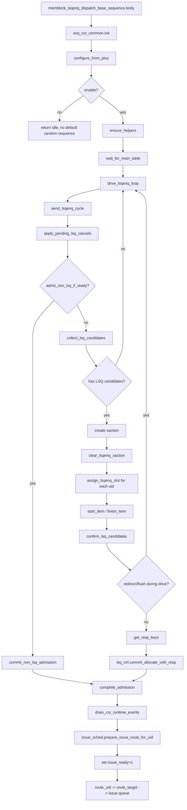
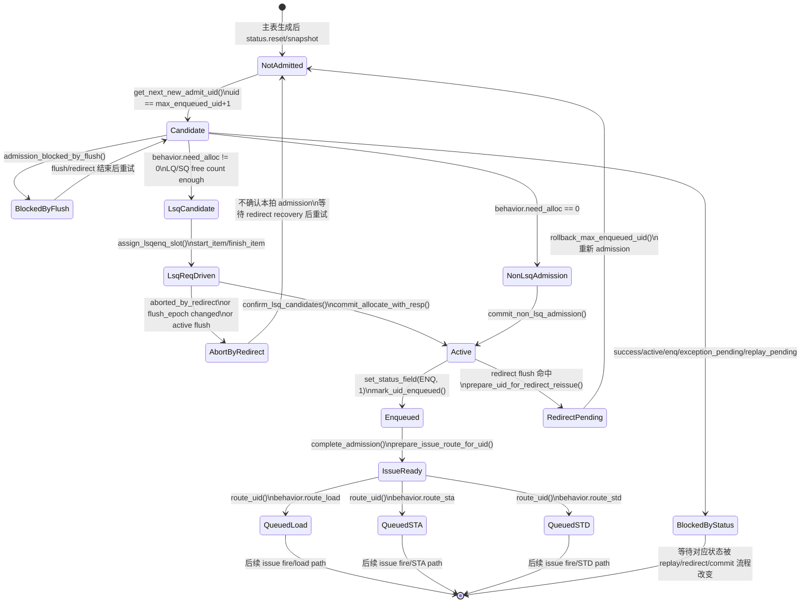

# MemBlock LSQ Admission 函数 Flow

本文整理 mem_ut/memblock 测试框架中 LSQ admission 入队流程。这里的 admission 指测试框架把主表中的 transaction 顺序推进到“已进入 DUT/软件 LSQ admission 边界，并准备 route 到 load/STA/STD issue queue”的过程。

核心源码：

- `mem_ut/ver/ut/memblock/seq/base_seq/memblock_lsqenq_dispatch_base_sequence.sv`
- `mem_ut/ver/ut/memblock/seq/base_seq_help/lsq_ctrl_model.sv`
- `mem_ut/ver/ut/memblock/seq/base_seq_help/common_data_transaction.sv`
- `mem_ut/ver/ut/memblock/seq/base_seq_help/issue_queue_scheduler.sv`

## 1. LSQ Admission 在框架中的位置

LSQ admission 是主表 transaction 进入后续 issue 流程前的第一道门：

- load 类操作分配 LQ 资源。
- store/CBO 类操作分配 SQ 资源。
- non-LSQ/atomic 当前 `need_alloc==0`，不走真实 LSQ enqueue 接口，但仍通过同一 admission sequence 标记 active/enq/issue_ready。
- admission 成功后调用 `complete_admission()`，再由 `issue_queue_scheduler::prepare_issue_route_for_uid()` 立即尝试 route 到 load/STA/STD issue queue。

关键状态：

- `dispatch_progress.max_enqueued_uid`：当前已 admission 的最大 uid。
- `status.active`：该 uid 当前动态实例已经激活。
- `status.enq`：该 uid 已通过 admission。
- `status.issue_ready`：该 uid 可以进入 route/issue 阶段。
- `status.active_lq_mapped/active_sq_mapped`：该 uid 是否占用 LQ/SQ active map。
- `uid_by_active_rob/uid_by_lq/uid_by_sq`：active event 反查 uid 的索引表。

## 2. 总体 Mermaid 程序流图



## 2.1 函数调用 Flow 图整体文字伪代码

```text
LSQ Admission 主流程：

1. sequence 启动：
   memblock_lsqenq_dispatch_base_sequence::body 初始化 seq_csr_common；
   configure_from_plus 读取 enable/no_progress_warn/ready_timeout；
   如果 enable=0，直接 return idle，不启动父类随机 sequence；
   enable=1 时 ensure_helpers 绑定 common_data、lsq_ctrl、issue_sched 和 monitor_adapter；
   wait_for_main_table 等主表 ready 后进入 drive_lsqenq_loop。

2. 每拍 admission：
   drive_lsqenq_loop 每拍调用 send_lsqenq_cycle；
   send_lsqenq_cycle 先 apply_pending_lsq_cancels，同步 redirect/cancel 对本地 LSQ free count 的影响；
   然后优先尝试 admit_non_lsq_if_ready，处理 need_alloc=0 的 non-LSQ/atomic 简化路径；
   如果没有 non-LSQ 候选，则 collect_lsq_candidates 从 next uid 顺序收集需要 LQ/SQ 分配的候选。

3. LSQ allocating 路径：
   有 LSQ 候选时创建 lsqenq xaction；
   assign_lsqenq_slot 把候选 uid 的 req 字段填入对应 slot；
   start_item/finish_item drive 到 DUT；
   confirm_lsq_candidates 在 drive 后检查 redirect/flush 边界；
   get_resp_keys 读取 DUT 返回的 LQ/SQ key；
   lsq_ctrl.commit_allocate_with_resp 校验软件预测 key 与 DUT response key 一致，并激活 uid。

4. non-LSQ 路径：
   admit_non_lsq_if_ready 找到 need_alloc=0 的 uid；
   lsq_ctrl.commit_non_lsq_admission 不 drive LSQ enqueue，只做软件 admission；
   该 uid 仍会 complete_admission，设置 active/enq/issue_ready。

5. admission 后 route：
   complete_admission drain CSR runtime event，避免 route 时使用旧 CSR snapshot；
   mark_uid_enqueued 推进 max_enqueued_uid；
   prepare_issue_route_for_uid 置 issue_ready 并调用 issue scheduler；
   route_uid/route_target 根据 op behavior 生成 LOAD/STA/STD issue queue item。
```

## 3. 两条 Admission 路径

### 3.1 LSQ allocating 路径

适用：

- `behavior.need_alloc != 2'b00`
- load：`need_alloc=2'b01`，使用 LQ。
- store/CBO：`need_alloc=2'b10`，使用 SQ。

流程：

```text
send_lsqenq_cycle()
  -> collect_lsq_candidates()
  -> assign_lsqenq_slot()
  -> start_item()/finish_item()
  -> confirm_lsq_candidates()
      -> get_resp_keys()
      -> lsq_ctrl.commit_allocate_with_resp()
      -> complete_admission()
```

特点：

- 真实驱动 `lsqenq_agent`。
- 等 driver/DUT 返回 LQ/SQ resp key。
- `commit_allocate_with_resp()` 会检查 DUT 返回的 key 是否等于软件预测 key。

### 3.2 non-LSQ admission 路径

适用：

- `behavior.need_alloc == 2'b00`
- 当前主要是 MOU/atomic 简化 admission。

流程：

```text
send_lsqenq_cycle()
  -> admit_non_lsq_if_ready()
      -> lsq_ctrl.commit_non_lsq_admission()
          -> commit_allocate()
      -> complete_admission()
```

特点：

- 不驱动真实 LSQ enqueue xaction。
- 不分配 LQ/SQ active mapping。
- 仍会标记 `active/enq/issue_ready`，后续 route 到 STA/STD。

## 4. 函数逐项说明

## 4.1 `body()`

源码位置：`mem_ut/ver/ut/memblock/seq/base_seq/memblock_lsqenq_dispatch_base_sequence.sv`

功能：

- 初始化 sequence 配置。
- 如果 LSQ admission sequence 关闭，则保持 idle 并返回，不回退父类随机 default sequence。
- 如果开启，则初始化 helper，等待主表 ready，进入 admission loop。

真实逻辑摘要：

```systemverilog
seq_csr_common::init();
configure_from_plus();
if (!enable) begin
    `uvm_info(get_type_name(), "MEMBLOCK_LSQENQ_SEQ_EN=0, LSQ enqueue dispatch sequence stays idle", UVM_LOW)
    return;
end
ensure_helpers();
wait_for_main_table();
drive_lsqenq_loop();
```

文字伪代码：

```text
初始化 plus/CSR 参数。
读取 MEMBLOCK_LSQENQ_* 控制项。
如果本 sequence 没开，直接 return，保持 idle，不回退父类随机 default sequence。
获取 common_data、lsq_ctrl、issue_sched、monitor_adapter。
等主表构建完成。
进入每拍 LSQ admission 发送循环。
```

输入：

- 无显式输入，依赖 plus 参数和 `common_data_transaction` 主表状态。

输出：

- 无直接返回值，最终推进 uid admission。

## 4.2 `configure_from_plus()`

源码位置：`mem_ut/ver/ut/memblock/seq/base_seq/memblock_lsqenq_dispatch_base_sequence.sv`

功能：

- 从 `seq_csr_common` 读取 admission sequence 的控制参数。

真实逻辑摘要：

```systemverilog
enable = seq_csr_common::get_lsqenq_seq_en();
no_progress_warn_cycles = seq_csr_common::get_active_seq_no_progress_warn_cycles();
ready_timeout = seq_csr_common::get_lsqenq_ready_timeout();
```

文字伪代码：

```text
读取是否开启 LSQ enqueue sequence。
读取主动主流程统一 no-progress warning 阈值。
读取等待 canAccept/ready 的 timeout。
```

设计意义：

- admission 行为由统一参数控制，不在 testcase 中硬编码。

## 4.3 `ensure_helpers()`

源码位置：`mem_ut/ver/ut/memblock/seq/base_seq/memblock_lsqenq_dispatch_base_sequence.sv`

功能：

- 获取或创建 admission 需要的公共 helper。

真实逻辑摘要：

```systemverilog
data = common_data_transaction::get();
lsq_ctrl = lsq_ctrl_model::get();
if (issue_sched == null) begin
    issue_sched = issue_queue_scheduler::type_id::create("issue_sched");
end
if (monitor_adapter == null) begin
    monitor_adapter = dispatch_monitor_event_adapter::type_id::create("monitor_adapter");
end
if (data == null || lsq_ctrl == null || issue_sched == null || monitor_adapter == null) begin
    `uvm_fatal(...)
end
```

文字伪代码：

```text
拿到全局 common_data。
拿到单例 LSQ 软件镜像 lsq_ctrl。
如果 issue scheduler 不存在则创建。
如果 monitor adapter 不存在则创建。
任一关键 helper 为空则 fatal。
```

设计意义：

- `common_data` 是状态真源。
- `lsq_ctrl_model` 是 LQ/SQ 指针和 free count 的软件镜像。
- `issue_queue_scheduler` 是 admission 后进入 issue queue 的入口。

## 4.4 `wait_for_main_table()`

源码位置：`mem_ut/ver/ut/memblock/seq/base_seq/memblock_lsqenq_dispatch_base_sequence.sv`

功能：

- 等待主控制表生成完成。

真实逻辑摘要：

```systemverilog
wait_count = 0;
while (!data.main_table_ready) begin
    if (no_progress_warn_cycles != 0 &&
        wait_count != 0 &&
        (wait_count % no_progress_warn_cycles) == 0) begin
        `uvm_warning(...)
    end
    #1;
    wait_count++;
end
```

文字伪代码：

```text
循环等待 data.main_table_ready。
每等待一次计数加 1。
如果达到 no-progress warning 阈值，只打印 warning 并继续等待。
```

设计意义：

- LSQ admission 必须以主表为输入。
- 没有主表时不能推进入队，否则 uid/main transaction/status 都没有合法来源。

## 4.5 `drive_lsqenq_loop()`

源码位置：`mem_ut/ver/ut/memblock/seq/base_seq/memblock_lsqenq_dispatch_base_sequence.sv`

功能：

- 以 cycle 为单位反复调用 `send_lsqenq_cycle()`。
- global stop 前常驻 admission；global stop 后退出。
- 长时间无进展只打印 warning，不作为正常退出条件。

真实逻辑摘要：

```systemverilog
idle_count = 0;
cycle_idx = 0;
forever begin
    if (data.is_global_stop_requested()) begin
        break;
    end
    send_lsqenq_cycle(cycle_idx, has_progress);
    cycle_idx++;
    if (has_progress) begin
        idle_count = 0;
    end else begin
        idle_count++;
        if (no_progress_warn_cycles != 0 &&
            idle_count >= no_progress_warn_cycles) begin
            `uvm_warning(...)
            idle_count = 0;
        end
    end
end
```

文字伪代码：

```text
从 cycle 0 开始持续运行。
如果 global_stop_requested=1，退出 loop。
每拍尝试 admission。
每拍结束后 cycle_idx 加 1，只用于 xaction 命名和 debug。
如果本拍有 uid 成功 admission，清空 idle 计数。
如果本拍没有进展，idle 计数加 1。
idle_count 达到 no-progress warning 阈值后打印 warning 并继续运行。
```

设计意义：

- LSQENQ 不再有专用 max_cycles、idle stop 或 start timeout 上限。
- `has_progress` 是本拍是否真正推进 uid 的唯一反馈。
- 正常退出只由顶层置位的 `global_stop_requested` 控制。

## 4.6 `send_lsqenq_cycle()`

源码位置：`mem_ut/ver/ut/memblock/seq/base_seq/memblock_lsqenq_dispatch_base_sequence.sv`

功能：

- admission 每拍的核心调度函数。
- 先处理 redirect 造成的 LSQ cancel。
- 再优先处理 non-LSQ admission。
- 最后收集需要真实 LSQ enqueue 的候选并驱动 xaction。

真实逻辑摘要：

```systemverilog
has_progress = 1'b0;
apply_pending_lsq_cancels();
if (admit_non_lsq_if_ready(has_progress)) begin
    return;
end
if (!collect_lsq_candidates(uids, trs, behaviors, lq_keys, sq_keys)) begin
    tr = lsqenq_agent_agent_xaction::type_id::create($sformatf("lsqenq_dispatch_idle_tr_%0d", cycle_idx));
    clear_lsqenq_xaction(tr);
    tr.memblock_dispatch_wait_can_accept = 1'b0;
    start_item(tr);
    finish_item(tr);
    return;
end

tr = lsqenq_agent_agent_xaction::type_id::create(...);
clear_lsqenq_xaction(tr);
tr.memblock_dispatch_wait_can_accept = 1'b1;
tr.memblock_dispatch_ready_timeout = ready_timeout;
tr.memblock_dispatch_aborted_by_redirect = 1'b0;
tr.memblock_dispatch_flush_epoch = memblock_sync_pkg::dispatch_flush_epoch;
foreach (uids[idx]) begin
    assign_lsqenq_slot(tr, idx, uids[idx], trs[idx], behaviors[idx], lq_keys[idx], sq_keys[idx]);
end

start_item(tr);
finish_item(tr);
confirm_lsq_candidates(tr, uids, trs, behaviors, has_progress);
```

文字伪代码：

```text
默认本拍没有进展。
先调用 apply_pending_lsq_cancels：
    消费 redirect 遗留的 pending LQ/SQ cancel，回退软件 LQ/SQ enq 指针。
再调用 admit_non_lsq_if_ready：
    只检查 admission 高水位后的下一条 uid。
    如果它是 need_alloc=0，则走 commit_non_lsq_admission + complete_admission。
    该路径成功或已处理后直接返回，不再构造 LSQ xaction。
否则调用 collect_lsq_candidates：
    收集连续、未阻塞、资源足够且 need_alloc!=0 的 uid。
    同时生成每个 slot 的软件预测 LQ/SQ key。
如果没有 LSQ 候选，创建并发送 idle lsqenq xaction 后返回；该 idle xaction 不推进 uid，只保持 driver 时序一致。
创建 lsqenq xaction。
调用 clear_lsqenq_xaction 清空所有 slot，防止字段残留。
设置等待 canAccept、ready timeout、当前 flush epoch。
逐个调用 assign_lsqenq_slot，把 uid/tr/behavior/预测 key 写入 xaction slot。
通过 start_item/finish_item 发给 driver。
driver 返回后调用 confirm_lsq_candidates：
    检查 redirect/flush epoch。
    读取 DUT response key。
    提交 LSQ 分配并完成 admission 收口。
```

设计意义：

- `memblock_dispatch_flush_epoch` 用于检测 driver 等待 ready/canAccept 期间是否发生 redirect。
- non-LSQ admission 放在 LSQ xaction 前，是因为它不需要 DUT LSQ 接口。
- 本函数是 admission 单拍的父调度点，所有下游函数都只处理自己的局部职责：
  cancel 只回退软件镜像，non-LSQ 只走软件提交，LSQ candidate 只负责构造并确认真实 DUT enqueue。

## 4.7 `apply_pending_lsq_cancels()`

源码位置：`mem_ut/ver/ut/memblock/seq/base_seq/memblock_lsqenq_dispatch_base_sequence.sv`

功能：

- redirect flush 后，回退软件 LSQ admission 镜像。

真实逻辑摘要：

```systemverilog
if (data.pending_lq_cancel_count != 0) begin
    lsq_ctrl.cancel_lq(data.pending_lq_cancel_count);
    data.pending_lq_cancel_count = 0;
end
if (data.pending_sq_cancel_count != 0) begin
    lsq_ctrl.cancel_sq(data.pending_sq_cancel_count);
    data.pending_sq_cancel_count = 0;
end
```

文字伪代码：

```text
如果 common_data 中记录了待取消的 LQ 分配数量：
    调用 lsq_ctrl.cancel_lq 回退 LQ enq 指针和 free count。
    清零 pending_lq_cancel_count。
如果记录了待取消的 SQ 分配数量：
    调用 lsq_ctrl.cancel_sq 回退 SQ enq 指针和 free count。
    清零 pending_sq_cancel_count。
```

设计意义：

- redirect reissue 后，同一 uid 会重新 admission。
- 软件 LSQ 指针必须回退，否则下一次分配的 lqIdx/sqIdx 会和 DUT 不一致。

## 4.8 `admission_blocked_by_flush()`

源码位置：`mem_ut/ver/ut/memblock/seq/base_seq/memblock_lsqenq_dispatch_base_sequence.sv`

功能：

- 判断当前是否因为 redirect/flush 正在进行而禁止 admission。

真实逻辑摘要：

```systemverilog
return data.issue_blocked_by_global_flush();
```

`issue_blocked_by_global_flush()` 检查：

```systemverilog
return flush_in_progress ||
       active_redirect.valid ||
       issue_freeze_ack ||
       has_pending_redirect_drive() ||
       memblock_sync_pkg::dispatch_flush_in_progress;
```

文字伪代码：

```text
如果软件处于 redirect/flush recovery：
    admission 禁止推进。
否则：
    admission 可以继续。
```

设计意义：

- admission 和 issue 使用同一个全局 freeze 判断，避免 redirect 期间继续把旧 epoch transaction 推进到 DUT。

## 4.9 `next_uid_needs_lsq_admission()`

源码位置：`mem_ut/ver/ut/memblock/seq/base_seq/memblock_lsqenq_dispatch_base_sequence.sv`

功能：

- 找到下一个应该 admission 的 uid，并解析它的行为类型。

真实逻辑摘要：

```systemverilog
if (admission_blocked_by_flush()) return 0;
uid = data.get_next_new_admit_uid();
if (uid < data.main_trans_num) begin
    status = data.get_status(uid);
    main_tr = data.get_main_transaction(uid);
    behavior = lsq_ctrl_model::derive_op_behavior(main_tr);
    if (status.success || status.active || status.enq ||
        status.exception_pending || status.replay_pending) begin
        return 0;
    end
    return 1;
end
uid = 0;
main_tr = null;
behavior = lsq_ctrl_model::make_default_behavior();
return 0;
```

文字伪代码：

```text
如果全局 flush/redirect 阻塞，返回没有候选。
从 common_data 的 max_enqueued_uid 推导下一条 uid。
如果 uid 超过主表数量，返回没有候选。
读取 status 和 main transaction。
根据 fuType/fuOpType 推导 op behavior。
如果该 uid 已 terminal_done、active、enq、exception pending、replay pending，则不能 admission。
否则该 uid 是下一条 admission 候选。
```

设计意义：

- admission 必须顺序推进，不从 0 全表扫描。
- redirect 后 `max_enqueued_uid` 会回退，保证从最老 flushed uid 重新 admission。

## 4.10 `data.get_next_new_admit_uid()`

源码位置：`mem_ut/ver/ut/memblock/seq/base_seq_help/common_data_transaction.sv`

功能：

- 根据 admission 高水位返回下一条 uid。

真实逻辑摘要：

```systemverilog
if (!dispatch_progress.max_enqueued_uid_valid) begin
    return 0;
end
return dispatch_progress.max_enqueued_uid + 1;
```

文字伪代码：

```text
如果还没有任何 uid 成功 admission，下一条是 uid0。
否则下一条是 max_enqueued_uid + 1。
```

设计意义：

- 10 万笔场景避免每拍从 0 扫描。
- admission 是顺序模型，重入队时通过回退 `max_enqueued_uid` 恢复顺序。

## 4.11 `lsq_ctrl_model::derive_op_behavior()`

源码位置：`mem_ut/ver/ut/memblock/seq/base_seq_help/lsq_ctrl_model.sv`

功能：

- 根据主表 transaction 的 `fuType/fuOpType` 推导 LSQ admission 和 route 行为。

真实逻辑摘要：

```systemverilog
if (is_vector_ls_futype(tr.fuType)) fatal;

if (tr.fuType == MEMBLOCK_FUTYPE_LDU) begin
    need_alloc = 2'b01;
    uses_lq = 1;
    route_load = 1;
    num_ls_elem = 1;
    kind = LOAD or PREFETCH;
end else if (tr.fuType == MEMBLOCK_FUTYPE_STU) begin
    need_alloc = 2'b10;
    uses_sq = 1;
    route_sta = 1;
    route_std = 1;
    num_ls_elem = 1;
    kind = STORE or CBO;
end else if (tr.fuType == MEMBLOCK_FUTYPE_MOU) begin
    need_alloc = 2'b00;
    route_sta = 1;
    route_std = 1;
    commit_is_normal = 1;
    is_atomic = 1;
    num_ls_elem = 0;
    set atomic_sta_uop_count / atomic_data_uop_count;
end else fatal;
```

文字伪代码：

```text
如果是 vector LS，当前不支持，fatal。
如果是 LDU：
    需要分配 LQ。
    后续 route 到 load issue queue。
    fuOpType 必须是 load 或 prefetch。
如果是 STU：
    需要分配 SQ。
    后续 route 到 STA 和 STD。
    fuOpType 必须是 store 或 CBO。
如果是 MOU atomic：
    不走 LQ/SQ 分配。
    后续 route 到 STA 和 STD。
    根据 AMO 类型设置抽象 uop_count。
其他 fuType fatal。
```

设计意义：

- 这是 admission 的行为分类真源。
- 后续 `collect_lsq_candidates()`、`commit_allocate_with_resp()`、`route_uid()` 都依赖这个 behavior。

## 4.12 `collect_lsq_candidates()`

源码位置：`mem_ut/ver/ut/memblock/seq/base_seq/memblock_lsqenq_dispatch_base_sequence.sv`

功能：

- 收集本拍要真实驱动 LSQ enqueue 接口的一批 uid。

真实逻辑摘要：

```systemverilog
clear output queues;
if (!next_uid_needs_lsq_admission(uid, main_tr, behavior)) return 0;
if (behavior.need_alloc == 2'b00) return 0;

max_enq = seq_csr_common::get_enq_per_cycle();
lq_tmp = lsq_ctrl.lq_enq_ptr;
sq_tmp = lsq_ctrl.sq_enq_ptr;
lq_free_tmp = lsq_ctrl.lq_free_count;
sq_free_tmp = lsq_ctrl.sq_free_count;

while (uids.size() < max_enq) begin
    if (admission_blocked_by_flush()) break;
    uid = data.get_next_new_admit_uid() + uids.size();
    if (uid >= main_trans_num) break;
    read main_tr/status/behavior;
    if status already done/active/enq/exception/replay break;
    if behavior.need_alloc == 0 break;
    if free count not enough break;
    push uid/tr/behavior/current predicted lq/sq key;
    advance temporary lq/sq key and free count;
end
return uids.size() != 0;
```

文字伪代码：

```text
先确认下一条 uid 存在且需要 LSQ 分配。
读取每拍最大 enqueue 数量。固定模式返回 `MEMBLOCK_ENQ_PER_CYCLE`；随机模式
`MEMBLOCK_ENQ_PER_CYCLE_RAND_EN=1` 时，在 `[1:MEMBLOCK_REAL_ENQ_WIDTH]`
内均匀随机。
复制当前 LQ/SQ enq 指针和 free count，作为临时预测状态。
循环收集连续 uid：
    如果 flush/redirect 阻塞，停止。
    计算本 slot 对应 uid。
    如果 uid 超出主表，停止。
    如果 status 已完成、已 active、已 enq、异常 pending、replay pending，停止。
    如果该 uid 是 non-LSQ admission，停止。
    如果 LQ/SQ free count 不够，停止。
    把 uid、transaction、behavior、预测 lq/sq key 存入数组。
    按 num_ls_elem 推进临时 lq/sq 指针和 free count。
有至少一个候选时返回 true。
```

设计意义：

- 只收集顺序连续 uid，符合 admission 顺序模型。
- 使用临时指针提前预测每个 slot 的 lqIdx/sqIdx。
- 真正写入状态要等 DUT resp 确认后在 `confirm_lsq_candidates()` 中完成。

## 4.13 `clear_lsqenq_xaction()`

源码位置：`mem_ut/ver/ut/memblock/seq/base_seq/memblock_lsqenq_dispatch_base_sequence.sv`

功能：

- 清空本拍 LSQ enqueue xaction 的所有 slot。

真实逻辑摘要：

```systemverilog
tr.io_ooo_to_mem_enqLsq_canAccept = 1'b0;
for (slot = 0; slot < real_enq_width; slot++) begin
    set_need_alloc(tr, slot, 2'b00);
    set_req_fields(tr, slot, 0, 0, 0, zero_rob, zero_lq, zero_sq, 0);
end
```

文字伪代码：

```text
把 canAccept 默认清 0。
遍历所有真实 enqueue slot。
每个 slot 的 needAlloc 清 0。
每个 slot 的 req valid/fuType/uopIdx/robIdx/lqIdx/sqIdx/numLsElem 全部清空。
```

设计意义：

- 防止上一拍残留字段污染本拍。
- 未使用 slot 必须明确 invalid。

## 4.14 `assign_lsqenq_slot()`

源码位置：`mem_ut/ver/ut/memblock/seq/base_seq/memblock_lsqenq_dispatch_base_sequence.sv`

功能：

- 把一个 admission candidate 填入 xaction 的指定 slot。

真实逻辑摘要：

```systemverilog
if (slot >= real_enq_width) fatal;
set_need_alloc(tr, slot, behavior.need_alloc);
set_req_fields(tr,
               slot,
               1'b1,
               main_tr.fuType,
               uid[6:0],
               main_tr.get_rob_key(),
               lq_key,
               sq_key,
               behavior.num_ls_elem);
```

文字伪代码：

```text
检查 slot 是否超过真实入队宽度。
写 needAlloc，告诉 DUT 该项需要 LQ 还是 SQ 分配。
写 req valid。
写 fuType。
写 uopIdx，这里使用 uid[6:0]。
写 robIdx。
写预测 lqIdx/sqIdx。
写 numLsElem。
```

设计意义：

- 将主表和软件预测的 LSQ 信息转成 DUT enqueue 接口字段。

## 4.15 `set_need_alloc()`

源码位置：`mem_ut/ver/ut/memblock/seq/base_seq_help/issue_field_assigner.sv`

功能：

- 根据 slot 写对应的 `io_ooo_to_mem_enqLsq_needAlloc_N` 字段。

真实逻辑摘要：

```systemverilog
case (slot)
    0: tr.io_ooo_to_mem_enqLsq_needAlloc_0 = need_alloc;
    ...
    7: tr.io_ooo_to_mem_enqLsq_needAlloc_7 = need_alloc;
    default: fatal;
endcase
```

文字伪代码：

```text
根据 slot 编号选择对应接口字段。
把 need_alloc 写入该 slot。
slot 不在 0..7 范围则 fatal。
```

设计意义：

- 这是固定宽度 Verilog interface 字段和数组化程序逻辑之间的桥接函数。

## 4.16 `set_req_fields()`

源码位置：`mem_ut/ver/ut/memblock/seq/base_seq_help/issue_field_assigner.sv`

功能：

- 根据 slot 写对应的 LSQ enqueue req 字段。

真实逻辑摘要：

```systemverilog
case (slot)
    N: begin
        req_N_valid = valid;
        req_N_bits_fuType = fuType;
        req_N_bits_uopIdx = uopIdx;
        req_N_bits_robIdx_flag/value = rob_key;
        req_N_bits_lqIdx_flag/value = lq_key;
        req_N_bits_sqIdx_flag/value = sq_key;
        req_N_bits_numLsElem = numLsElem;
    end
    default: fatal;
endcase
```

文字伪代码：

```text
根据 slot 编号选择 req_N。
写 valid。
写 fuType/uopIdx。
写 ROB flag/value。
写 LQ flag/value。
写 SQ flag/value。
写 numLsElem。
slot 不支持则 fatal。
```

设计意义：

- 与 `set_need_alloc()` 类似，负责把数组式 candidate 信息展开到具体接口字段。

## 4.17 `start_item()` / `finish_item()` 与 driver 行为

源码位置：`mem_ut/ver/ut/memblock/seq/base_seq/memblock_lsqenq_dispatch_base_sequence.sv` 和 `mem_ut/ver/ut/memblock/agent/lsqenq_agent_agent/src/lsqenq_agent_agent_driver.sv`

功能：

- 把构造好的 `lsqenq_agent_agent_xaction` 交给 UVM sequencer/driver。

关键字段：

```systemverilog
tr.memblock_dispatch_wait_can_accept = 1'b1;
tr.memblock_dispatch_ready_timeout = ready_timeout;
tr.memblock_dispatch_aborted_by_redirect = 1'b0;
tr.memblock_dispatch_flush_epoch = memblock_sync_pkg::dispatch_flush_epoch;
```

文字伪代码：

```text
sequence 把 xaction 发给 driver。
driver 等 DUT canAccept/ready。
如果等待期间发生 redirect，driver 可以标记 aborted_by_redirect。
driver 返回 LSQ enqueue response key 到 xaction。
sequence 在 finish_item 后读取这些 response key。
```

设计意义：

- admission 不只受每拍最大候选数控制，还受 DUT canAccept 和 redirect flush epoch 约束。

## 4.18 `confirm_lsq_candidates()`

源码位置：`mem_ut/ver/ut/memblock/seq/base_seq/memblock_lsqenq_dispatch_base_sequence.sv`

功能：

- 在 xaction 完成后确认本拍候选是否真的 admission 成功。
- 用 DUT 返回的 lqIdx/sqIdx 更新软件状态。

真实逻辑摘要：

```systemverilog
has_progress = 1'b0;
if (tr.memblock_dispatch_aborted_by_redirect ||
    admission_blocked_by_flush() ||
    tr.memblock_dispatch_flush_epoch != memblock_sync_pkg::dispatch_flush_epoch) begin
    info skip;
    return;
end
foreach (uids[idx]) begin
    get_resp_keys(tr, idx, dut_lq_key, dut_sq_key);
    lsq_ctrl.commit_allocate_with_resp(uids[idx], behaviors[idx], trs[idx], dut_lq_key, dut_sq_key);
    complete_admission(uids[idx]);
    has_progress = 1'b1;
end
```

文字伪代码：

```text
默认本拍没有进展。
如果 driver 明确被 redirect abort，跳过确认。
如果当前已经被全局 flush/redirect 阻塞，跳过确认。
如果 xaction 记录的 flush_epoch 和当前全局 flush_epoch 不一致，说明等待期间跨过 redirect，跳过确认。
对每个候选：
    调用 get_resp_keys：
        从该 slot 的 xaction response 中读取 DUT 返回的 lqIdx/sqIdx。
        get_resp_keys 只做字段读取和 slot 解码，不修改状态。
    调用 lsq_ctrl.commit_allocate_with_resp：
        重新用当前软件指针 preview expected key。
        对比 DUT key 和 expected key。
        匹配后写回主表、activate uid、设置 ENQ、推进 LQ/SQ 指针。
    调用 complete_admission：
        先 drain CSR runtime event。
        再把 uid 标记为 issue_ready 并尝试 route。
    设置 has_progress=1。
```

设计意义：

- 防止 redirect 边界上把已经无效的 admission 错误写入状态表。
- DUT response key 是最终真源，软件预测必须和它一致。

## 4.19 `get_resp_keys()`

源码位置：`mem_ut/ver/ut/memblock/seq/base_seq/memblock_lsqenq_dispatch_base_sequence.sv`

功能：

- 根据 slot 读取 DUT 返回的 LQ/SQ response key。

真实逻辑摘要：

```systemverilog
case (slot)
    N: begin
        lq_key.flag  = tr.io_ooo_to_mem_enqLsq_resp_N_lqIdx_flag;
        lq_key.value = tr.io_ooo_to_mem_enqLsq_resp_N_lqIdx_value;
        sq_key.flag  = tr.io_ooo_to_mem_enqLsq_resp_N_sqIdx_flag;
        sq_key.value = tr.io_ooo_to_mem_enqLsq_resp_N_sqIdx_value;
    end
    default: fatal;
endcase
```

文字伪代码：

```text
初始化 lq_key/sq_key 为 0。
根据 slot 选择对应 resp_N。
读取 lqIdx flag/value。
读取 sqIdx flag/value。
slot 不支持则 fatal。
```

设计意义：

- LSQ admission 确认必须以 DUT 返回的 key 为准。
- 即使 load 不使用 SQ、store 不使用 LQ，也统一读取两个 key，再由 behavior 判断哪些 key 有效。

## 4.20 `lsq_ctrl_model::commit_allocate_with_resp()`

源码位置：`mem_ut/ver/ut/memblock/seq/base_seq_help/lsq_ctrl_model.sv`

功能：

- 用 DUT response key 确认并提交 LQ/SQ 分配。

真实逻辑摘要：

```systemverilog
if (tr.uid != uid) fatal;
if (behavior.need_alloc == 2'b00) fatal;
preview_allocate(behavior, expected_lq_key, expected_sq_key);
if (dut_lq_key != expected_lq_key || dut_sq_key != expected_sq_key) fatal;

tr.lqIdx_flag/value = dut_lq_key;
tr.sqIdx_flag/value = dut_sq_key;
tr.numLsElem = behavior.num_ls_elem;

data.set_main_transaction(uid, tr);
data.activate_uid(uid, behavior.uses_lq, behavior.uses_sq);
data.set_status_field(uid, MEMBLOCK_STATUS_ENQ, 1'b1);

if (uses_lq) advance lq_enq_ptr and reduce free count;
if (uses_sq) advance sq_enq_ptr and reduce free count;
```

文字伪代码：

```text
检查 transaction uid 和参数 uid 一致。
如果这是 non-LSQ admission，fatal。
调用 preview_allocate：
    检查当前 LQ/SQ free count 是否能满足 behavior.num_ls_elem。
    返回当前 lq_enq_ptr/sq_enq_ptr 作为 expected key。
比较 DUT 返回 key 和 expected key。
不一致则 fatal，因为软件镜像和 DUT 已不同步。
把 DUT key 写回主表 transaction。
更新主表。
调用 data.activate_uid：
    建立 active ROB -> uid 映射。
    对 load 建立 active LQ -> uid 映射。
    对 store/CBO 建立 active SQ -> uid 映射。
调用 data.set_status_field(ENQ, 1)：
    标记 admission 成功。
    通过 mark_uid_enqueued 推进 admission 高水位。
最后按 behavior 推进 LQ/SQ enq 指针并减少 free count。
```

设计意义：

- 这是 LSQ allocating path 的状态落表点。
- `data.activate_uid()` 建立后续 writeback/replay/redirect 通过 ROB/LQ/SQ key 反查 uid 的基础。

## 4.21 `lsq_ctrl_model::commit_non_lsq_admission()`

源码位置：`mem_ut/ver/ut/memblock/seq/base_seq_help/lsq_ctrl_model.sv`

功能：

- 完成不需要 LQ/SQ 分配的 admission。

真实逻辑摘要：

```systemverilog
if (behavior.need_alloc != 2'b00 || behavior.uses_lq || behavior.uses_sq) begin
    fatal;
end
commit_allocate(uid, behavior, tr);
```

`commit_allocate()` 内部会：

```systemverilog
preview_allocate(behavior, lq_key, sq_key);
tr.lqIdx = lq_key;
tr.sqIdx = sq_key;
tr.numLsElem = behavior.num_ls_elem;
data.set_main_transaction(uid, tr);
data.activate_uid(uid, behavior.uses_lq, behavior.uses_sq);
data.set_status_field(uid, MEMBLOCK_STATUS_ENQ, 1'b1);
if (uses_lq) advance lq;
if (uses_sq) advance sq;
```

文字伪代码：

```text
确认这是 need_alloc=0 且不使用 LQ/SQ 的 behavior。
调用 commit_allocate：
    commit_allocate 会先 preview_allocate。
    对 need_alloc=0 的 behavior，preview_allocate 不消耗 LQ/SQ 资源，只返回当前指针快照。
    写主表 transaction 的 lqIdx/sqIdx/numLsElem。
    调用 data.activate_uid(uid, uses_lq=0, uses_sq=0) 建立 active ROB 映射。
    调用 data.set_status_field(ENQ, 1) 推进 admission 高水位。
由于 uses_lq/uses_sq 为 0，不建立 LQ/SQ active map，也不推进 LQ/SQ 指针。
```

设计意义：

- non-LSQ/atomic 仍然需要 active/enq/issue_ready 状态，否则后续无法 route。
- 它不占用 LQ/SQ 容量。

## 4.22 `data.activate_uid()`

源码位置：`mem_ut/ver/ut/memblock/seq/base_seq_help/common_data_transaction.sv`

功能：

- 激活 uid 的当前动态实例，并建立 active map。

真实逻辑摘要：

```systemverilog
main_tr = get_main_transaction(uid);
status = status_by_uid[uid];
if (status.active) fatal;
status.snapshot_from_main(main_tr);

rob_key = main_tr.get_rob_key();
if uid_by_active_rob already has rob_key fatal;

if (map_lq) begin
    lq_key = main_tr.get_lq_key();
    validate lq_key;
    if uid_by_lq already has lq_key fatal;
    uid_by_lq[lq_key] = uid;
    status.active_lq_mapped = 1;
end

if (map_sq) begin
    sq_key = main_tr.get_sq_key();
    validate sq_key;
    if uid_by_sq already has sq_key fatal;
    uid_by_sq[sq_key] = uid;
    status.active_sq_mapped = 1;
end

uid_by_active_rob[rob_key] = uid;
status.active = 1;
```

文字伪代码：

```text
读取 uid 对应主表 transaction。
确认该 uid 当前不是 active。
把主表快照写入状态表。
通过 robIdx 建立 active ROB -> uid 映射。
如果该操作使用 LQ：
    校验 lqIdx。
    建立 active LQ -> uid 映射。
    标记 active_lq_mapped。
如果该操作使用 SQ：
    校验 sqIdx。
    建立 active SQ -> uid 映射。
    标记 active_sq_mapped。
设置 status.active=1。
```

设计意义：

- 后续 writeback、replay、redirect、deq 都依赖 active map 反查 uid。

## 4.23 `data.set_status_field(uid, MEMBLOCK_STATUS_ENQ, 1)`

源码位置：`mem_ut/ver/ut/memblock/seq/base_seq_help/common_data_transaction.sv`

功能：

- 标记 uid 已 admission，并推进 admission 高水位。

真实逻辑摘要：

```systemverilog
old_value = status.enq;
status.enq = value;
if (value && !old_value) begin
    mark_uid_enqueued(uid);
    if (status.redirect_pending || status.flushed) begin
        status.redirect_pending = 0;
        status.flushed = 0;
        status.issue_killed = 0;
    end
end
```

文字伪代码：

```text
记录旧 enq 值。
设置 enq。
如果这是第一次从 0 变成 1：
    调用 mark_uid_enqueued 推进 max_enqueued_uid。
    如果这是 redirect reissue 后重新 admission：
        清 redirect_pending。
        清 flushed。
        清 issue_killed。
```

设计意义：

- admission 必须顺序推进。
- redirect reissue 的旧阻塞位在重新 admission 成功时解除。

## 4.24 `data.mark_uid_enqueued()`

源码位置：`mem_ut/ver/ut/memblock/seq/base_seq_help/common_data_transaction.sv`

功能：

- 维护 `dispatch_progress.max_enqueued_uid`。

真实逻辑摘要：

```systemverilog
if (!max_enqueued_uid_valid) begin
    if (uid != 0) fatal;
    max_enqueued_uid = uid;
    max_enqueued_uid_valid = 1;
    return;
end
if (uid != max_enqueued_uid + 1) fatal;
max_enqueued_uid = uid;
```

文字伪代码：

```text
如果这是第一条 admission：
    必须是 uid0。
    设置 max_enqueued_uid=0，valid=1。
否则：
    admission uid 必须等于当前 max_enqueued_uid+1。
    不连续则 fatal。
    更新 max_enqueued_uid。
```

设计意义：

- 强制主表 admission 顺序。
- 支撑 10 万笔场景用高水位推进，而不是每次从 0 扫描。

## 4.25 `complete_admission()`

源码位置：`mem_ut/ver/ut/memblock/seq/base_seq_help/lsq_ctrl_model.sv`

功能：

- admission 成功后的收口函数。
- 将 uid 推进到 issue-ready 并尝试 route。

真实逻辑摘要：

```systemverilog
drain_csr_runtime_events();
issue_sched.prepare_issue_route_for_uid(uid);
```

文字伪代码：

```text
先调用 drain_csr_runtime_events：
    确保 helper 存在。
    通过 monitor_adapter drain CSR runtime latest snapshot；sfence/hfence FIFO 不在 admission helper 中消费。
再调用 issue_sched.prepare_issue_route_for_uid：
    校验 uid 已 active/enq。
    设置 issue_ready。
    立即进入 route_uid。
```

设计意义：

- admission 后马上给 issue scheduler 一个推进机会。
- CSR runtime drain 在这里确保后续 issue/TLB 相关逻辑尽量使用较新的 CSR 镜像。

## 4.26 `drain_csr_runtime_events()`

源码位置：`mem_ut/ver/ut/memblock/seq/base_seq/memblock_lsqenq_dispatch_base_sequence.sv` 和 `mem_ut/ver/ut/memblock/seq/base_seq_help/dispatch_monitor_event_adapter.sv`

功能：

- 通过 monitor adapter 采集 CSR runtime event。

真实逻辑摘要：

```systemverilog
ensure_helpers();
monitor_adapter.drain_csr_events();
```

文字伪代码：

```text
调用 ensure_helpers，保证 monitor_adapter/data 等 helper 已初始化。
调用 monitor_adapter.drain_csr_events：
    adapter 从 memblock_sync_pkg 获取最新 raw CSR。
    写入 common_data 的 CSR runtime mirror。
    当前实现不在这里 drain sfence/hfence FIFO；sfence/hfence 由 collect_runtime_context_events() 显式调用 drain_sfence_events() 消费。
```

说明：

- 当前 `drain_csr_events()` 只同步 CSR latest snapshot；sfence/hfence FIFO 由 `collect_runtime_context_events()` 显式调用 `drain_sfence_events()` 消费，详见 `sfence_flow.md` 和 `csr_runtime_sync_flow.md`。
- CSR runtime 和 sfence 是不同流程；admission helper 只做 CSR latest snapshot 同步，不隐式消费 sfence/hfence。

## 4.27 `issue_sched.prepare_issue_route_for_uid()`

源码位置：`mem_ut/ver/ut/memblock/seq/base_seq_help/issue_queue_scheduler.sv`

功能：

- 将 admission 成功的 uid 标记为 issue ready，并立即 route。

真实逻辑摘要：

```systemverilog
status = data.get_status(uid);
if (!status.active || !status.enq) fatal;
data.set_status_field(uid, MEMBLOCK_STATUS_ISSUE_READY, 1'b1);
route_uid(uid);
```

文字伪代码：

```text
读取 status。
确认该 uid 已 active 且已 enq。
设置 issue_ready=1。
调用 route_uid：
    route_uid 先检查 flush/replay/exception 等 route 条件。
    条件满足后按 behavior 拆到 load/STA/STD target。
```

设计意义：

- admission 和 route 的边界在这里衔接。
- `issue_ready` 表示该 uid 已经具备进入 issue queue 的条件。

## 4.28 `issue_sched.route_uid()`

源码位置：`mem_ut/ver/ut/memblock/seq/base_seq_help/issue_queue_scheduler.sv`

功能：

- 根据 op behavior 把 uid route 到对应 issue target。

真实逻辑摘要：

```systemverilog
if (!is_uid_route_ready(uid)) return;
main_tr = data.get_main_transaction(uid);
behavior = lsq_ctrl_model::derive_op_behavior(main_tr);
if (behavior.route_load) route_target(uid, LOAD, behavior);
if (behavior.route_sta)  route_target(uid, STA, behavior);
if (behavior.route_std)  route_target(uid, STD, behavior);
```

文字伪代码：

```text
如果 uid 当前不满足 route 条件，返回。
读取主表 transaction。
调用 lsq_ctrl_model::derive_op_behavior 重新推导 behavior。
如果 behavior.route_load=1，调用 route_target(uid, LOAD, behavior)。
如果 behavior.route_sta=1，调用 route_target(uid, STA, behavior)。
如果 behavior.route_std=1，调用 route_target(uid, STD, behavior)。
每个 route_target 都独立检查该 target 是否已 queued/dispatched/done。
```

设计意义：

- admission 只负责“入队到 LSQ/active 状态”。
- route 负责根据操作类型拆到具体 issue queue。

## 4.29 `issue_sched.is_uid_route_ready()`

源码位置：`mem_ut/ver/ut/memblock/seq/base_seq_help/issue_queue_scheduler.sv`

功能：

- 判断 uid 当前是否允许 route。

真实逻辑摘要：

```systemverilog
if (data.issue_blocked_by_global_flush()) return 0;
status = data.get_status(uid);
if (status.active && status.enq && status.issue_ready &&
    status.replay_pending &&
    !status.flushed && !status.redirect_pending && !status.exception_pending) begin
    return 1;
end
return status.active && status.enq && status.issue_ready &&
       !status.flushed && !status.redirect_pending &&
       !status.exception_pending && !status.replay_pending;
```

文字伪代码：

```text
如果全局 flush/redirect 阻塞，不能 route。
如果 uid 是 replay pending 且没有 flushed/redirect/exception，允许 route replay target。
否则普通 route 需要：
    active=1
    enq=1
    issue_ready=1
    flushed=0
    redirect_pending=0
    exception_pending=0
    replay_pending=0
```

设计意义：

- admission 后的普通 uid 可以 route。
- replay uid 也可以复用 route 机制重新进入 issue queue。
- redirect/fault/flush 状态会阻止 route。

## 4.30 `issue_sched.route_target()`

源码位置：`mem_ut/ver/ut/memblock/seq/base_seq_help/issue_queue_scheduler.sv`

功能：

- 将 uid 的某个 target 放入对应 issue queue。

真实逻辑摘要：

```systemverilog
status = data.get_status(uid);
if (target_already_queued_or_done(status, target)) return;
if (status.replay_pending && !data.replay_target_requested(status, target)) return;
data.delete_issue_queue_entry(target, uid, status.replay_seq, 1'b0);
item = make_issue_item(uid, target, behavior);
data.push_issue_queue_item(item);
set_target_queued(uid, target, 1'b1);
```

文字伪代码：

```text
读取 status。
调用 target_already_queued_or_done：
    如果该 target 已经 queued、dispatched 或 done，返回。
如果当前是 replay pending，但该 target 不是 replay 请求目标，返回。
删除同 uid/target 的旧 issue queue 项，作为幂等保护。
调用 make_issue_item 构造新的 issue queue item：
    复制 ROB/LQ/SQ key、delay、send_pri、replay_seq、numLsElem。
    初始化 uop_index=0、uop_count=1。
    atomic STA/STD 根据 behavior 写入理论 uop_count。
调用 data.push_issue_queue_item，push 到 load/STA/STD 对应队列。
调用 set_target_queued，将 queued_load/queued_sta/queued_std 置 1。
```

设计意义：

- admission 后真正进入 issue queue 的入口。
- replay 重发也复用该逻辑。

## 4.31 `issue_sched.make_issue_item()`

源码位置：`mem_ut/ver/ut/memblock/seq/base_seq_help/issue_queue_scheduler.sv`

功能：

- 根据 uid、target、behavior 构造 issue queue 元素。

真实逻辑摘要：

```systemverilog
main_tr = data.get_main_transaction(uid);
status = data.get_status(uid);
item.uid = uid;
item.rob_key = main_tr.get_rob_key();
item.target = target;
item.send_pri = target == STD ? main_tr.send_pri_std : main_tr.send_pri;
item.ready_cycle = main_tr.delay;
item.replay_seq = status.replay_seq;
item.has_lqIdx = status.active_lq_mapped;
item.lq_key = status.lqIdx;
item.has_sqIdx = status.active_sq_mapped;
item.sq_key = status.sqIdx;
item.numLsElem = behavior.num_ls_elem;
item.uop_index = 0;
item.uop_count = 1;
if atomic STA/STD, item.uop_count = atomic_*_uop_count;
```

文字伪代码：

```text
读取主表和 status。
填 uid、ROB key、target。
填发送优先级，STD 使用 send_pri_std。
填 delay 到 ready_cycle。
记录当前 replay_seq。
根据 active_lq_mapped/active_sq_mapped 填 LQ/SQ key。
填 numLsElem。
默认 uop_index=0、uop_count=1。
如果是 atomic STA/STD，写 atomic 对应的 uop_count。
```

设计意义：

- issue queue item 是 admission 后传给 issue driver 的轻量句柄。
- 实际 transaction 内容仍通过 uid 回查主表/status。
- `uop_index` 在这里只是安全默认值，不代表真实发射端口。真正发射时，`memblock_issue_dispatch_base_sequence::assign_issue_items()` 会用本 target 候选数组下标覆盖它：LOAD 0/1/2 对应 `intIssue_0/1/2`，STA 0/1 对应 `intIssue_3/4`，STD 0/1 对应 `intIssue_5/6`。
- `uop_count` 表示该 target 理论需要几个 uop。普通标量 load/store 为 1；atomic/AMOCAS 会记录更大的地址侧或数据侧 uop 数。当前 issue queue 不会按 `uop_count` 展开多个 item，所以它是记录/预留字段。

注意：

- 当前 atomic multi-uop 只记录 `uop_count`，issue 侧尚未真正展开多个 item；这是当前框架的支持边界。

## 5. LSQ Admission 成功后的状态变化

LSQ allocating path 成功后：

```text
main_table[uid].lqIdx/sqIdx/numLsElem 更新
status.snapshot_from_main()
status.active = 1
status.active_lq_mapped 或 active_sq_mapped = 1
uid_by_active_rob 建立映射
uid_by_lq 或 uid_by_sq 建立映射
status.enq = 1
dispatch_progress.max_enqueued_uid 推进
status.issue_ready = 1
load/STA/STD issue queue 可能新增 item
```

non-LSQ admission 成功后：

```text
main_table[uid].numLsElem = 0
status.active = 1
不建立 active_lq_mapped/active_sq_mapped
status.enq = 1
dispatch_progress.max_enqueued_uid 推进
status.issue_ready = 1
STA/STD issue queue 可能新增 item
```

redirect reissue admission 成功后额外清：

```text
status.redirect_pending = 0
status.flushed = 0
status.issue_killed = 0
```

## 6. Redirect/Flush 对 Admission 的约束

admission 在三个位置防 redirect/flush：

1. `next_uid_needs_lsq_admission()` 开头检查 `admission_blocked_by_flush()`。
2. `collect_lsq_candidates()` 循环中每次检查 `admission_blocked_by_flush()`。
3. `confirm_lsq_candidates()` 在 xaction 返回后检查：

```systemverilog
tr.memblock_dispatch_aborted_by_redirect ||
admission_blocked_by_flush() ||
tr.memblock_dispatch_flush_epoch != memblock_sync_pkg::dispatch_flush_epoch
```

含义：

- 发送前不能处于 redirect/flush。
- 收集多个候选过程中如果发生阻塞，要停止继续收集。
- driver 等 canAccept/ready 期间如果跨过 redirect epoch，不能确认旧 admission。

## 7. 函数调用关系总表

本节按真实程序流从前到后排序。表中“直接子函数/子流程”只写当前函数直接调用或直接驱动的下一层逻辑，具体实现伪代码仍以第 4 节对应函数说明为准。

| 顺序 | 函数 | 输入 | 输出/副作用 | 直接子函数/子流程及功能 |
| --- | --- | --- | --- | --- |
| 1 | `body()` | plus 配置、主表状态 | 启动 admission loop | `seq_csr_common::init()` 加载 plus；`configure_from_plus()` 读取本 sequence 参数；`ensure_helpers()` 获取公共对象；`wait_for_main_table()` 等主表；`drive_lsqenq_loop()` 进入每拍 admission |
| 2 | `configure_from_plus()` | `seq_csr_common` | 写 `enable/no_progress_warn_cycles/ready_timeout` | 调用 `get_lsqenq_seq_en()`、`get_lsqenq_ready_timeout()` 和统一 no-progress getter；不再读取 idle/start timeout |
| 3 | `ensure_helpers()` | 无 | 获取 `data/lsq_ctrl/issue_sched/monitor_adapter` | `common_data_transaction::get()` 获取状态真源；`lsq_ctrl_model::get()` 获取 LSQ 软件镜像；`type_id::create()` 创建 scheduler/adapter |
| 4 | `wait_for_main_table()` | `data.main_table_ready` | 等待并周期性 warning | 无复杂子函数；循环等待主表完成，达到 no-progress 阈值只 warning |
| 5 | `drive_lsqenq_loop()` | `global_stop_requested` | 多拍调用 admission | global stop 前每轮调用 `send_lsqenq_cycle()`；根据 `has_progress` 清零或累加 idle；连续 idle 到阈值只 warning |
| 6 | `send_lsqenq_cycle()` | `cycle_idx` | 本拍 admission 推进 | `apply_pending_lsq_cancels()` 回退 redirect cancel；`admit_non_lsq_if_ready()` 尝试 non-LSQ；`collect_lsq_candidates()` 收 LSQ 候选；`clear_lsqenq_xaction()` 清 slot；`assign_lsqenq_slot()` 填 slot；`start_item()/finish_item()` 交给 driver；`confirm_lsq_candidates()` 确认状态 |
| 7 | `apply_pending_lsq_cancels()` | pending cancel count | 回退 LSQ 软件镜像 | `lsq_ctrl.cancel_lq()` 回退 LQ 指针/free count；`lsq_ctrl.cancel_sq()` 回退 SQ 指针/free count |
| 8 | `admit_non_lsq_if_ready()` | 下一条 uid/status/behavior | non-LSQ admission 或返回 false | `next_uid_needs_lsq_admission()` 找候选；`commit_non_lsq_admission()` 软件确认；`complete_admission()` 进入 route |
| 9 | `next_uid_needs_lsq_admission()` | admission 高水位 | uid/main_tr/behavior | `admission_blocked_by_flush()` 检查全局阻塞；`data.get_next_new_admit_uid()` 取下一条 uid；`data.get_status()` 过滤状态；`derive_op_behavior()` 推导行为 |
| 10 | `admission_blocked_by_flush()` | 全局 flush/redirect 状态 | bit | `data.issue_blocked_by_global_flush()` 汇总 `flush_in_progress/active_redirect/issue_freeze_ack/pending_redirect_drive/dispatch_flush_in_progress` |
| 11 | `data.get_next_new_admit_uid()` | `dispatch_progress.max_enqueued_uid` | 下一条 uid | 无复杂子函数；第一条返回 0，之后返回 `max_enqueued_uid + 1` |
| 12 | `lsq_ctrl_model::derive_op_behavior()` | `main_tr` | `behavior` | 根据 `lsq_flow/fuType/fuOpType` 判断是否使用 LQ/SQ、`need_alloc`、route target 和 `num_ls_elem` |
| 13 | `collect_lsq_candidates()` | 当前 uid、高水位、free count | candidate arrays | 复用 `next_uid_needs_lsq_admission()` 确认起点；循环内调用 `admission_blocked_by_flush()`、`derive_op_behavior()` 和本地 LQ/SQ 临时指针预览 |
| 14 | `clear_lsqenq_xaction()` | xaction | 清 slot | `set_need_alloc()` 清 needAlloc；`set_req_fields()` 清 req 字段 |
| 15 | `assign_lsqenq_slot()` | uid/tr/behavior/key | 写 xaction slot | `set_need_alloc()` 写 LQ/SQ allocation 类型；`set_req_fields()` 写 valid/fuType/uopIdx/ROB/LQ/SQ/numLsElem |
| 16 | `set_need_alloc()` | slot/need_alloc | 写接口字段 | 无子函数；把数组化 slot 映射到扁平 Verilog 字段 |
| 17 | `set_req_fields()` | slot/fields | 写接口字段 | 无子函数；把主表和预测 key 展开到 req_N 字段 |
| 18 | `start_item()/finish_item()` | xaction | driver 驱动 DUT | driver 等 `canAccept`；若 flush epoch 变化则置 `aborted_by_redirect`；否则采样 response key |
| 19 | `confirm_lsq_candidates()` | xaction/candidates | 状态落表、`has_progress` | 先检查 redirect/flush abort；`get_resp_keys()` 读 DUT key；`commit_allocate_with_resp()` 校验并提交 LSQ 分配；`complete_admission()` 进入 route |
| 20 | `get_resp_keys()` | xaction/slot | lq_key/sq_key | 无子函数；读取扁平 resp_N 字段并组装 LQ/SQ key |
| 21 | `lsq_ctrl_model::commit_allocate_with_resp()` | uid/behavior/tr/DUT key | active/enq/map/ptr 更新 | `preview_allocate()` 算 expected key；`data.set_main_transaction()` 回写主表；`data.activate_uid()` 建 active map；`data.set_status_field(ENQ)` 推进 admission 高水位 |
| 22 | `lsq_ctrl_model::commit_non_lsq_admission()` | uid/behavior/tr | active/enq 更新 | `commit_allocate()` 复用通用提交；因 `uses_lq/uses_sq=0` 不建 LQ/SQ map、不推进 LSQ 指针 |
| 23 | `lsq_ctrl_model::commit_allocate()` | uid/behavior/tr | 写主表、active/enq、可选推进指针 | `preview_allocate()` 检查资源并取 key；`data.set_main_transaction()` 写主表；`data.activate_uid()` 建 active map；`data.set_status_field(ENQ)` 推进高水位；uses_lq/sq 时推进 LQ/SQ 指针 |
| 24 | `lsq_ctrl_model::preview_allocate()` | behavior | expected lq/sq key | `can_allocate()` 检查 LQ/SQ free count；返回当前 `lq_enq_ptr/sq_enq_ptr` 作为本次 expected key |
| 25 | `data.activate_uid()` | uid/map_lq/map_sq | active map 建立 | `get_main_transaction()` 读主表；`snapshot_from_main()` 刷状态快照；按 ROB/LQ/SQ key 建 active map |
| 26 | `data.set_status_field(uid, ENQ, 1)` | uid/value | `status.enq=1` | `mark_uid_enqueued()` 推进 `max_enqueued_uid`；redirect reissue 成功时清 `redirect_pending/flushed/issue_killed` |
| 27 | `data.mark_uid_enqueued()` | uid | admission 高水位推进 | 无复杂子函数；要求 uid0 起步且每次必须连续加 1 |
| 28 | `complete_admission()` | uid | issue_ready/route | `drain_csr_runtime_events()` 刷 CSR runtime；`issue_sched.prepare_issue_route_for_uid()` 标记 issue_ready 并 route |
| 29 | `drain_csr_runtime_events()` | monitor raw CSR queue | CSR runtime mirror 更新 | `ensure_helpers()` 确保 adapter 存在；`monitor_adapter.drain_csr_events()` 只同步 raw CSR latest snapshot；sfence event 已拆到 `drain_sfence_events()` |
| 30 | `issue_sched.prepare_issue_route_for_uid()` | uid | `issue_ready=1`，route | `data.get_status()` 检查 active/enq；`data.set_status_field(ISSUE_READY)` 标记可 issue；`route_uid()` 尝试入 issue queue |
| 31 | `issue_sched.route_uid()` | uid | route load/STA/STD | `is_uid_route_ready()` 做状态门控；`derive_op_behavior()` 再次推导 target；按 `route_load/route_sta/route_std` 调 `route_target()` |
| 32 | `issue_sched.is_uid_route_ready()` | uid/status | bit | `data.issue_blocked_by_global_flush()` 检查全局阻塞；普通 uid 要 active/enq/issue_ready 且无 fault/replay/redirect；replay uid 只允许 replay target |
| 33 | `issue_sched.route_target()` | uid/target/behavior | push issue queue | `target_already_queued_or_done()` 防重复；`delete_issue_queue_entry()` 清旧项；`make_issue_item()` 构造 item；`push_issue_queue_item()` 入队；`set_target_queued()` 置 queued |
| 34 | `issue_sched.target_already_queued_or_done()` | status/target | 是否跳过 target route | 无子函数；按 LOAD/STA/STD 检查 queued、dispatched、done/pass，避免同 target 重复入队 |
| 35 | `issue_sched.make_issue_item()` | uid/target/behavior | issue queue item | `make_empty_item()` 给默认值；`get_main_transaction()` 和 `get_status()` 回查主表/状态；复制 ROB/LQ/SQ、send_pri、delay、replay_seq、uop 信息 |
| 36 | `issue_sched.set_target_queued()` | uid/target/value | queued_* 状态更新 | `data.set_status_field()` 设置 `queued_load/queued_sta/queued_std` |

总流程文字伪代码：

```text
body:
    初始化 seq_csr_common 并读取 LSQENQ 参数。
    如果 enable=0，保持 idle 后退出。
    获取 common_data、lsq_ctrl、issue_sched、monitor_adapter。
    等主表 ready。
    进入 drive_lsqenq_loop。

drive_lsqenq_loop:
    forever:
        如果 global_stop_requested=1，退出 loop。
        调用 send_lsqenq_cycle。
        如果 has_progress=1，清 idle_count。
        否则 idle_count++。
        idle_count 达到 no-progress warning 阈值后打印 warning 并继续。

send_lsqenq_cycle:
    先处理 pending LQ/SQ cancel。
    优先尝试 non-LSQ admission：
        找下一条 uid。
        如果 behavior.need_alloc==0：
            commit_non_lsq_admission。
            complete_admission。
            本拍结束。
    再尝试 LSQ allocating admission：
        按 uid 顺序收集候选。
        清 xaction slot。
        为每个候选填 needAlloc 和 req 字段。
        start_item/finish_item 交给 driver 等 canAccept。
        如果 driver 等待期间发生 redirect/flush，跳过确认。
        否则读取 DUT resp key。
        commit_allocate_with_resp 校验并提交 LSQ 分配。
        complete_admission。

complete_admission:
    调用 drain_csr_runtime_events，只同步 CSR runtime mirror；sfence/hfence FIFO 由 collect_runtime_context_events 显式处理。
    调用 prepare_issue_route_for_uid，校验 active/enq 后设置 issue_ready。
    prepare_issue_route_for_uid 再调用 route_uid。
    route_uid 先做 route-ready 门控，再按 behavior 拆到 load/STA/STD queue。
```

## 8. Admission 状态转移与条件

LSQ admission flow 中最关键的状态转移发生在 `status_transaction` 和公共进度表 `dispatch_progress` 中。可以把一条 uid 的 admission 到 route 过程理解成下面几个阶段：

```text
未 admission
  -> active
  -> enq
  -> issue_ready
  -> queued_load / queued_sta / queued_std
```

其中 `active/enq/issue_ready` 是 admission 主状态，`queued_*` 是 admission 成功后进入 issue queue 的结果状态。

### 8.1 状态转移 Mermaid 图



### 8.2 `NotAdmitted -> Candidate`

触发函数：

- `next_uid_needs_lsq_admission()`
- `data.get_next_new_admit_uid()`

转移条件：

```text
!admission_blocked_by_flush()
uid = data.get_next_new_admit_uid()
uid < data.main_trans_num
```

含义：

- 只有 admission 高水位之后的下一条 uid 才能成为候选。
- 第一条 admission 必须是 uid0。
- redirect 后高水位会回退，因此被 flush 的老 uid 可以重新成为候选。

### 8.3 `Candidate -> BlockedByFlush`

触发函数：

- `admission_blocked_by_flush()`
- `data.issue_blocked_by_global_flush()`

阻塞条件：

```systemverilog
flush_in_progress ||
active_redirect.valid ||
issue_freeze_ack ||
has_pending_redirect_drive() ||
memblock_sync_pkg::dispatch_flush_in_progress
```

含义：

- redirect/flush recovery 期间禁止 admission。
- 这是为了避免旧 epoch transaction 在 redirect 边界后继续进入 DUT。

### 8.4 `Candidate -> BlockedByStatus`

触发函数：

- `next_uid_needs_lsq_admission()`
- `collect_lsq_candidates()`

阻塞条件：

```systemverilog
status.success ||
status.active ||
status.enq ||
status.exception_pending ||
status.replay_pending
```

含义：

- `success=1`：该 uid 已完成，不应再次 admission。
- `active=1`：该 uid 当前动态实例仍在飞行。
- `enq=1`：该 uid 已经过 admission。
- `exception_pending=1`：该 uid 已异常阻塞。
- `replay_pending=1`：该 uid 等待 replay route，不应重新 admission。

注意：

- `redirect_pending/flushed` 不在这里阻塞，因为 redirect reissue 正是要允许同 uid 重新 admission。
- 重新 admission 成功时，`set_status_field(ENQ, 1)` 会清掉 `redirect_pending/flushed/issue_killed`。

### 8.5 `Candidate -> NonLsqAdmission`

触发函数：

- `admit_non_lsq_if_ready()`
- `lsq_ctrl_model::derive_op_behavior()`

转移条件：

```systemverilog
behavior.need_alloc == 2'b00
```

当前典型来源：

- MOU/atomic 简化 flow。

后续动作：

```text
lsq_ctrl.commit_non_lsq_admission()
  -> commit_allocate()
  -> data.activate_uid(uid, uses_lq=0, uses_sq=0)
  -> data.set_status_field(ENQ, 1)
  -> complete_admission()
```

结果：

- `status.active=1`
- `status.enq=1`
- 不建立 `active_lq_mapped/active_sq_mapped`
- 不推进 LQ/SQ 指针

### 8.6 `Candidate -> LsqCandidate`

触发函数：

- `collect_lsq_candidates()`

转移条件：

```text
behavior.need_alloc != 0
uids.size() < seq_csr_common::get_enq_per_cycle()
uid < data.main_trans_num
status 未 success/active/enq/exception_pending/replay_pending
LQ/SQ free count 足够
```

LQ/SQ 资源条件：

```systemverilog
!(behavior.uses_lq && lq_free_tmp < behavior.num_ls_elem)
!(behavior.uses_sq && sq_free_tmp < behavior.num_ls_elem)
```

含义：

- load 需要 LQ free count 足够。
- store/CBO 需要 SQ free count 足够。
- 当前一次最多收集 `get_enq_per_cycle()` 个连续 uid。

### 8.7 `LsqCandidate -> LsqReqDriven`

触发函数：

- `clear_lsqenq_xaction()`
- `assign_lsqenq_slot()`
- `start_item(tr)`
- `finish_item(tr)`

转移条件：

```text
collect_lsq_candidates() 返回至少一个 candidate
xaction 创建成功
slot < real_enq_width
```

写入 DUT 请求字段：

```text
needAlloc
req.valid
fuType
uopIdx
robIdx
lqIdx
sqIdx
numLsElem
```

含义：

- 这是从软件候选进入 DUT LSQ enqueue 接口的阶段。
- 还没有真正修改状态表 active/enq，必须等 response 确认。

### 8.8 `LsqReqDriven -> AbortByRedirect`

触发函数：

- `confirm_lsq_candidates()`

转移条件：

```systemverilog
tr.memblock_dispatch_aborted_by_redirect ||
admission_blocked_by_flush() ||
tr.memblock_dispatch_flush_epoch != memblock_sync_pkg::dispatch_flush_epoch
```

含义：

- driver 等待 canAccept/ready 期间遇到 redirect。
- 或 xaction 发出前后 flush epoch 已变化。
- 这拍 admission 结果不能落表，直接跳过确认。

状态结果：

```text
不调用 commit_allocate_with_resp()
不 activate uid
不 set ENQ
不 issue_ready
has_progress = 0
```

### 8.9 `LsqReqDriven -> Active`

触发函数：

- `confirm_lsq_candidates()`
- `get_resp_keys()`
- `lsq_ctrl.commit_allocate_with_resp()`

转移条件：

```text
没有 redirect/flush abort
DUT resp key 可读取
DUT resp lqIdx/sqIdx == 软件 expected key
```

`commit_allocate_with_resp()` 检查：

```systemverilog
preview_allocate(behavior, expected_lq_key, expected_sq_key);
if (dut_lq_key != expected_lq_key || dut_sq_key != expected_sq_key) fatal;
```

下游函数作用：

```text
get_resp_keys 只负责把 resp_N_lqIdx/resp_N_sqIdx 解码成 key，不修改状态。
commit_allocate_with_resp 调用 preview_allocate 校验 expected key。
preview_allocate 调用 can_allocate，保证软件 free count 仍可满足本次分配。
key 校验通过后，commit_allocate_with_resp 再写主表、activate uid、set ENQ、推进 LQ/SQ 指针。
```

状态结果：

```text
main_table[uid].lqIdx/sqIdx/numLsElem 更新
data.activate_uid(uid, behavior.uses_lq, behavior.uses_sq)
status.active = 1
uid_by_active_rob 建立
uid_by_lq 或 uid_by_sq 建立
```

### 8.10 `Active -> Enqueued`

触发函数：

- `data.set_status_field(uid, MEMBLOCK_STATUS_ENQ, 1'b1)`
- `data.mark_uid_enqueued(uid)`

转移条件：

```text
commit_allocate_with_resp() 或 commit_non_lsq_admission() 已调用
uid admission 顺序合法
```

顺序合法条件：

```systemverilog
if (!max_enqueued_uid_valid) uid 必须为 0;
else uid 必须为 max_enqueued_uid + 1;
```

状态结果：

```text
status.enq = 1
dispatch_progress.max_enqueued_uid 更新
```

redirect reissue 额外清理：

```systemverilog
if (status.redirect_pending || status.flushed) begin
    status.redirect_pending = 1'b0;
    status.flushed          = 1'b0;
    status.issue_killed     = 1'b0;
end
```

### 8.11 `Enqueued -> IssueReady`

触发函数：

- `complete_admission()`
- `issue_sched.prepare_issue_route_for_uid()`

转移条件：

```systemverilog
status.active == 1
status.enq == 1
```

源码行为：

```systemverilog
if (!status.active || !status.enq) fatal;
data.set_status_field(uid, MEMBLOCK_STATUS_ISSUE_READY, 1'b1);
route_uid(uid);
```

下游函数作用：

```text
complete_admission 先调用 drain_csr_runtime_events，刷新 CSR runtime mirror；sfence/hfence FIFO 不在该 helper 中消费。
drain_csr_runtime_events 内部通过 monitor_adapter.drain_csr_events 消费 runtime event。
随后 prepare_issue_route_for_uid 校验 active/enq，并设置 ISSUE_READY。
最后 prepare_issue_route_for_uid 直接调用 route_uid，给本 uid 一个立即入 issue queue 的机会。
```

状态结果：

```text
status.issue_ready = 1
立即调用 route_uid(uid)
```

含义：

- `issue_ready` 表示该 uid 已经通过 admission，可以进入 issue queue 调度阶段。
- 它不表示已经发射，也不表示已经写回。

### 8.12 `IssueReady -> Queued*`

触发函数：

- `issue_sched.route_uid()`
- `issue_sched.route_target()`
- `data.push_issue_queue_item()`

route 条件：

普通 route：

```systemverilog
status.active &&
status.enq &&
status.issue_ready &&
!status.flushed &&
!status.redirect_pending &&
!status.exception_pending &&
!status.replay_pending
```

replay route 特例：

```systemverilog
status.active &&
status.enq &&
status.issue_ready &&
status.replay_pending &&
!status.flushed &&
!status.redirect_pending &&
!status.exception_pending
```

target 入队条件：

```text
target 尚未 queued/dispatched/done
如果 replay_pending=1，该 target 必须被 replay_target_* 请求
```

下游函数作用：

```text
route_uid 调用 is_uid_route_ready，先挡住全局 flush、异常、redirect pending 和普通 replay pending。
route_uid 调用 derive_op_behavior，重新得到 route_load/route_sta/route_std。
每个有效 target 调用 route_target。
route_target 调用 target_already_queued_or_done 防重复。
route_target 调用 delete_issue_queue_entry 清同 uid/target 旧项。
route_target 调用 make_issue_item 生成包含 ROB/LQ/SQ key、delay、priority、replay_seq 的 item。
route_target 调用 push_issue_queue_item 入队，再调用 set_target_queued 置 queued_*。
```

状态结果：

```text
behavior.route_load -> load_issue_q.push_back(item), status.queued_load=1
behavior.route_sta  -> sta_issue_q.push_back(item),  status.queued_sta=1
behavior.route_std  -> std_issue_q.push_back(item),  status.queued_std=1
```

含义：

- load admission 后通常进入 load queue。
- store/CBO admission 后通常同时进入 STA 和 STD queue。
- atomic/non-LSQ 当前进入 STA/STD queue。

### 8.13 `Active/Enqueued/IssueReady/Queued -> RedirectPending`

触发函数：

- `common_data_transaction::prepare_uid_for_redirect_reissue()`
- `common_data_transaction::apply_redirect_flush_range()`

转移条件：

```text
uid 在 active scan window 内
rob_order_util::rob_need_flush(status.get_rob_key(), redirect) == 1
status.success == 0
```

状态结果：

```text
remove active ROB/LQ/SQ map 或 issue queue 残留
pending_lq_cancel_count / pending_sq_cancel_count 增加
clear_uid_dispatch_result(uid)
status.redirect_pending = 1
status.flushed = 1
status.dynamic_epoch++
status.active = 0
status.success = 0
rollback_max_enqueued_uid(oldest_flushed_uid)
```

含义：

- redirect kill 的是旧动态实例，不是删除主表项。
- 后续 admission 会从最老 flushed uid 重新开始。

## 9. 当前实现边界

- vector LS 在 `derive_op_behavior()` 中直接 fatal，当前不支持。
- atomic/MOU 是简化支持：`need_alloc=0`，不占 LQ/SQ，但会 route 到 STA/STD；AMOCAS 等只把理论拆分数量记录到 `uop_count`，issue queue 未真正展开多个 item，也没有完整 atomic writeback/AMOCAS 多 uop 闭环。
- 多元素 LSQ 范围映射不完整。当前 active map 主要保存 base LQ/SQ key，vector/multi-element 的范围分配、逐元素 deq 和 event 反查没有完整实现。
- STD backend replay 不支持。STA miss 可转 replay；STD miss 当前 warning/drop，不进入重发流程。
- 非 LDU/STU/MOU 的 fuType、以及 LDU/STU/MOU 下非法 fuOpType 会 fatal，没有未知 FU fallback。
- CBO/prefetch 当前按 store-like/load-like 路径建模，特殊完成语义和异常专项覆盖不是完整闭环。
- LSQ admission 必须顺序推进，`mark_uid_enqueued()` 会检查 uid 必须连续。
- `drain_csr_runtime_events()` 当前只通过 `drain_csr_events()` 同步 CSR latest snapshot；sfence/hfence 已由 `collect_runtime_context_events()` 的 `drain_sfence_events()` 显式处理，避免 admission 文档和 sfence flow 职责混淆。


## 11. 端到端行为总结

```text
LSQ load admission：
  body
  -> wait_for_main_table
  -> drive_lsqenq_loop/send_lsqenq_cycle
  -> collect_lsq_candidates
  -> assign_lsqenq_slot drive lsqenq
  -> confirm_lsq_candidates
  -> commit_allocate_with_resp 校验 LQ key
  -> complete_admission
  -> prepare_issue_route_for_uid
  -> load_issue_q

LSQ store admission：
  body
  -> send_lsqenq_cycle
  -> collect_lsq_candidates
  -> assign_lsqenq_slot drive lsqenq
  -> commit_allocate_with_resp 校验 SQ key
  -> complete_admission
  -> prepare_issue_route_for_uid
  -> sta_issue_q/std_issue_q

non-LSQ/atomic 简化 admission：
  send_lsqenq_cycle
  -> admit_non_lsq_if_ready
  -> commit_non_lsq_admission
  -> complete_admission
  -> prepare_issue_route_for_uid
  -> route 到当前简化支持的 issue target

redirect 后重新 admission：
  apply_redirect_flush_range
  -> prepare_uid_for_redirect_reissue
  -> rollback_max_enqueued_uid(oldest_flushed_uid)
  -> 后续 send_lsqenq_cycle 从回滚 uid 重新 admission
```

端到端文字伪代码：

```text
load/store 这类需要 LSQ 分配的 transaction 必须经过真实 lsqenq drive；测试框架用 lsq_ctrl 预测 LQ/SQ key，并在 DUT 返回 response key 后校验一致，之后才允许该 uid 进入 issue queue。
need_alloc=0 的 transaction 不 drive lsqenq 接口，但仍通过同一 admission 收口设置 active/enq/issue_ready，保证后续 route/issue/status flow 使用统一状态表。
每条 uid admission 完成后立即 prepare_issue_route_for_uid：根据 op behavior 拆成 load、STA、STD target，并写入对应 issue queue。
如果 redirect flush 覆盖已经 admission 的 uid，prepare_uid_for_redirect_reissue 会清旧动态实例状态，rollback_max_enqueued_uid 把 admission 边界回退，后续 LSQ admission flow 会重新处理这些 uid。
```

## 10. 一句话总结

LSQ admission 的本质是：从主表按 uid 顺序取下一条 transaction，按 `fuType/fuOpType` 判断是否需要 LQ/SQ 分配；需要分配时驱动 DUT LSQ enqueue 并用 response key 确认，不需要分配时直接软件确认；确认后激活 uid、推进 admission 高水位、设置 issue_ready，并立即 route 到后续 issue queue。
