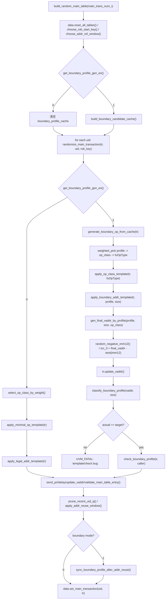

# main table boundary_profile 生成 flow

本文记录当前源码中 `MEMBLOCK_BOUNDARY_PROFILE_GEN_EN` 打开后的主表 `boundary_profile` 激励生成 flow。

本文只描述测试框架如何生成有效激励，不实现 DUT correctness checker、RM 对比、scoreboard 或 coveragent。

关联源码：

- `mem_ut/ver/ut/memblock/seq/base_seq_help/memblock_dispatch_base_sequence.sv`
- `mem_ut/ver/ut/memblock/seq/base_seq_help/memblock_dispatch_types.sv`
- `mem_ut/ver/ut/memblock/seq/base_seq_help/main_control_transaction.sv`
- `mem_ut/ver/ut/memblock/seq/base_seq_help/seq_csr_common.sv`
- `mem_ut/ver/ut/memblock/env/plus.sv`
- `mem_ut/ver/ut/memblock/seq/plus_cfg/default.cfg`

## 1. 函数调用 Flow 图



### 函数调用 Flow 图整体文字伪代码

```text
main table boundary_profile 生成主流程：

1. build_random_main_table() 是随机主表生成入口。
   它先重置公共数据表，生成起始 ROB key 和地址复用窗口参数。

2. 如果 MEMBLOCK_BOUNDARY_PROFILE_GEN_EN 为 0：
   build_random_main_table() 清空 boundary candidate cache；
   每条 transaction 继续使用旧路径：
     select_op_class_by_weight();
     apply_minimal_op_template();
     apply_legal_addr_template();
   旧路径生成完后仍会执行 apply_addr_reuse_window()。

3. 如果 MEMBLOCK_BOUNDARY_PROFILE_GEN_EN 为 1：
   build_random_main_table() 在生成 transaction 前调用 build_boundary_candidate_cache()。
   build_boundary_candidate_cache() 只执行一次，按 profile -> op_class -> fuOpType 建立合法候选表。
   profile 权重为 0、op_class 权重为 0、支持矩阵不支持或 gate 关闭的组合不会进入候选表。

4. boundary 模式下 randomize_main_transaction() 不再先随机 op_class。
   它调用 generate_boundary_op_from_cache()：
     先按 profile_cache 权重选 boundary_profile；
     再在该 profile 自己的 op_cache 中按权重选 op_class；
     再在该 op_class 自己的 fuop_cache 中按 effective_weight 选 fuOpType；
     最后调用 apply_op_class_template() 填 fuType、lsq_flow、fuOpType 和 numLsElem。

5. generate_boundary_op_from_cache() 只选择 op 信息，不生成地址。
   地址由 apply_boundary_addr_template() 负责。

6. apply_boundary_addr_template() 根据 target boundary_profile 和 size_bytes 构造 final_vaddr。
   final_vaddr 是 RTL 看到的 effective address / virtual address。
   地址生成不从 MEMBLOCK_PADDR_BASE/RANGE 采样，也不检查 L2TLB/page backing。

7. apply_boundary_addr_template() 生成非 0 的负 imm12，再反推 src_0：
     imm_sext = sign_extend_imm12(imm12);
     src_0 = final_vaddr - imm_sext。
   设置 tr.src_0/tr.imm 后调用 tr.update_vaddr()，要求 tr.vaddr 必须等于 final_vaddr。

8. 地址模板不使用 retry。
   如果 final_vaddr/end_vaddr 非 Sv39 正 canonical、发生回绕、update_vaddr 不匹配或 classify 结果不是目标 profile，
   直接 UVM_FATAL。这表示模板规则或实现错误，不 fallback 到 ALIGNED。

9. boundary 模式下 build_random_main_table() 也会进入 apply_addr_reuse_window()。
   地址复用可能改写 op_class、fuOpType、src_0、imm 和 vaddr。
   如果 boundary 模式打开，地址复用之后调用 sync_boundary_profile_after_addr_reuse()。
   该函数只把 boundary_profile/boundary_size_bytes 更新为最终 transaction 的实际形态。
   它不恢复复用前 profile，不重选地址，不把复用结果 fallback 到 ALIGNED。

10. 最后 data.set_main_transaction(uid, tr) 写入公共主表。
    后续 LSQ admission、issue、writeback、commit 等 flow 读取同一个 main_control_transaction。
```

## 2. `build_random_main_table()`

源码位置：`mem_ut/ver/ut/memblock/seq/base_seq_help/memblock_dispatch_base_sequence.sv`

真实逻辑摘要：

```systemverilog
if (seq_csr_common::get_boundary_profile_gen_en()) begin
    build_boundary_candidate_cache();
end else begin
    boundary_candidate_cache_built = 1'b0;
    boundary_profile_cache.delete();
end

for (int unsigned idx = 0; idx < main_trans_num_i; idx++) begin
    uid = data.alloc_uid();
    tr = main_control_transaction::type_id::create($sformatf("main_uid_%0d", uid));
    randomize_main_transaction(tr, uid, rob_key);
    prune_recent_uid_q(recent_load_uid_q, uid, addr_ref_window);
    prune_recent_uid_q(recent_store_uid_q, uid, addr_ref_window);
    apply_addr_reuse_window(tr, uid, recent_load_uid_q, recent_store_uid_q);
    if (seq_csr_common::get_boundary_profile_gen_en()) begin
        sync_boundary_profile_after_addr_reuse(tr,
            $sformatf("random uid=%0d boundary after addr reuse", uid));
    end
    data.set_main_transaction(uid, tr);
    push_recent_uid(tr, uid, recent_load_uid_q, recent_store_uid_q);
    rob_key = rob_order_util::rob_advance(rob_key, 1);
end
```

功能解释：

`build_random_main_table()` 是随机主表构建入口。它在 boundary 模式打开时先建立候选表；每条 transaction 初始生成后，normal 和 boundary 两种模式都会进入地址复用窗口。boundary 模式在地址复用后同步最终 `boundary_profile` 和 `boundary_size_bytes` 标签。

输入/输出：

- 输入：`main_trans_num_i`、plus/cfg 中的 boundary 开关和权重。
- 输出：`data.main_table_by_uid` 中的主表 transaction。
- 副作用：boundary 模式会设置 `boundary_candidate_cache_built=1` 并填充 `boundary_profile_cache`。

文字伪代码：

```text
函数开始时先重置公共主表和状态表。
读取 boundary_profile_gen_en：
  如果开关打开，调用 build_boundary_candidate_cache()，为后续所有 uid 准备合法候选表；
  如果开关关闭，清空候选表和 built 标志，保证旧路径不会误读旧 cache。

进入 uid 生成循环：
  分配一个新 uid；
  创建 main_control_transaction；
  调用 randomize_main_transaction() 填写 op、地址、优先级、delay 和 ROB key；
  无论 boundary 开关是否打开，都清理 recent load/store queue 并执行地址复用窗口；
  如果 boundary 开关打开，在地址复用后同步最终 boundary_profile/boundary_size_bytes；
  将 transaction 写入 common_data_transaction 主表；
  将当前 uid 加入 recent load/store pool，供后续地址复用使用；
  推进 ROB key。
```

内部子调用：

- `build_boundary_candidate_cache()`：构建 profile/op/fuOpType 合法候选表。
- `randomize_main_transaction()`：生成单条主表 transaction。
- `apply_addr_reuse_window()`：normal 和 boundary 模式共用的地址复用入口，可能改写 op_class、fuOpType、src_0、imm 和 vaddr。
- `sync_boundary_profile_after_addr_reuse()`：boundary 模式地址复用后同步最终 boundary 标签。
- `data.set_main_transaction()`：把生成结果写入公共主表。

### 2.1 `apply_addr_reuse_window()` 地址复用子流程

源码位置：`mem_ut/ver/ut/memblock/seq/base_seq_help/memblock_dispatch_base_sequence.sv`

真实逻辑摘要：

```systemverilog
if (rand_weighted2(seq_csr_common::get_addr_reuse_en_1_wt(),
                   seq_csr_common::get_addr_reuse_en_0_wt()) != 0) begin
    return;
end

kind = select_addr_reuse_kind();
case (kind)
    MEMBLOCK_ADDR_REUSE_LOAD_AFTER_STORE: begin
        target_op_class = MEMBLOCK_OP_CLASS_INT_LOAD;
        fallback_op_class = MEMBLOCK_OP_CLASS_STORE;
        got_ref = random_pick_recent_uid(recent_store_uid_q, ref_uid, 1'b0);
    end
    MEMBLOCK_ADDR_REUSE_LOAD_AFTER_LOAD: begin
        target_op_class = MEMBLOCK_OP_CLASS_INT_LOAD;
        fallback_op_class = MEMBLOCK_OP_CLASS_INT_LOAD;
        got_ref = random_pick_recent_uid(recent_load_uid_q, ref_uid, 1'b1);
    end
    MEMBLOCK_ADDR_REUSE_STORE_AFTER_LOAD: begin
        target_op_class = MEMBLOCK_OP_CLASS_STORE;
        fallback_op_class = MEMBLOCK_OP_CLASS_INT_LOAD;
        got_ref = random_pick_recent_uid(recent_load_uid_q, ref_uid, 1'b0);
    end
    MEMBLOCK_ADDR_REUSE_STORE_AFTER_STORE: begin
        target_op_class = MEMBLOCK_OP_CLASS_STORE;
        fallback_op_class = MEMBLOCK_OP_CLASS_STORE;
        got_ref = random_pick_recent_uid(recent_store_uid_q, ref_uid, 1'b1);
    end
endcase
```

功能解释：

该函数是 normal 和 boundary 模式共用的地址复用入口。它先按 `MEMBLOCK_ADDR_REUSE_EN_*` 判断本条是否尝试复用，再按复用 kind 选择目标 op_class 和参考队列。

输入/输出：

- 输入：当前 `tr`、当前 `uid`、recent load/store uid queue。
- 输出：可能改写后的 `tr.op_class`、`tr.fuOpType`、`tr.src_0`、`tr.imm`、`tr.vaddr`。
- 副作用：`LOAD_AFTER_LOAD` 和 `STORE_AFTER_STORE` 会从对应 recent queue 中消费被选中的 ref uid。

文字伪代码：

```text
先读取地址复用总开关权重：
  rand_weighted2() 用 EN_1_WT 和 EN_0_WT 做二选一；
  当前实现中返回 0 表示尝试地址复用，返回非 0 表示本条保持初始 transaction 不变并直接返回。

如果本条命中地址复用：
  调用 select_addr_reuse_kind()；
  该函数按 LOAD_AFTER_STORE、LOAD_AFTER_LOAD、STORE_AFTER_LOAD、STORE_AFTER_STORE 四类权重选择一种地址相关关系。

根据 kind 设置 target_op_class：
  LOAD_AFTER_STORE 和 LOAD_AFTER_LOAD 的目标都是 INT_LOAD；
  STORE_AFTER_LOAD 和 STORE_AFTER_STORE 的目标都是 STORE。

根据 kind 选择参考队列：
  LOAD_AFTER_STORE 从 recent_store_uid_q 中选一个参考 store；
  LOAD_AFTER_LOAD 从 recent_load_uid_q 中选一个参考 load，并在选中后从队列删除该 uid；
  STORE_AFTER_LOAD 从 recent_load_uid_q 中选一个参考 load；
  STORE_AFTER_STORE 从 recent_store_uid_q 中选一个参考 store，并在选中后从队列删除该 uid。

fallback_op_class 只在参考队列为空时使用：
  它用于生成一条仍然合法的 load/store transaction；
  不复制参考地址，因为此时没有 ref_tr。
```

真实逻辑摘要：

```systemverilog
if (!got_ref) begin
    tr.op_class = fallback_op_class;
    apply_minimal_op_template(tr);
    fixup_after_addr_reuse(tr, null, 1'b0, fallback_caller);
    return;
end

ref_tr = data.get_main_transaction(ref_uid);
keep_ref_size = rand_weighted2(seq_csr_common::get_addr_reuse_keep_ref_size_en_1_wt(),
                               seq_csr_common::get_addr_reuse_keep_ref_size_en_0_wt()) == 0;

if (!keep_ref_size || ref_tr.op_class == MEMBLOCK_OP_CLASS_PREFETCH) begin
    tr.op_class = target_op_class;
    apply_minimal_op_template(tr);
    fixup_after_addr_reuse(tr, ref_tr, 1'b1, reuse_caller);
    return;
end

ref_size = derive_size_bytes(ref_tr.op_class, ref_tr.fuOpType);
target_fuOpType = choose_fuop_by_op_class_and_size(target_op_class, ref_size, reuse_caller);
tr.op_class = target_op_class;
apply_op_class_template(tr, target_fuOpType);
fixup_after_addr_reuse(tr, ref_tr, 1'b1, reuse_caller);
```

功能解释：

该段处理“选到 ref_tr 之后如何生成目标 op”。默认路径保持旧行为：目标 op_class 内按 fuOpType 权重重新选择操作，再复制 ref_tr 地址。`keep_ref_size` 命中时，目标 op_class 仍由地址复用 kind 决定，但 fuOpType 必须在目标 op_class 内选择与 ref_tr 相同 size 的合法候选。

输入/输出：

- 输入：选中的 `ref_uid/ref_tr`、`target_op_class`、keep_ref_size 权重。
- 输出：最终目标 transaction 的 op 模板和地址。
- 副作用：如果同 size 合法 fuOpType 权重全 0，会打印 `UVM_ERROR` 并使用同 size default fuOpType；如果目标 op_class 没有该 size 的合法 fuOpType，则 `UVM_FATAL`。

文字伪代码：

```text
如果没有选到 ref_tr：
  设置 tr.op_class 为 fallback_op_class；
  调用 apply_minimal_op_template() 按该 op_class 和 fuOpType 权重生成合法 op 模板；
  调用 fixup_after_addr_reuse() 更新 vaddr 并做主表合法性检查；
  由于 copy_addr=0，不会复制任何参考地址；
  然后返回。

如果选到 ref_tr：
  从 common_data_transaction 中读取 ref_uid 对应的参考 transaction；
  读取 keep_ref_size 权重并随机决定是否进入同 size 复用路径。

如果 keep_ref_size 未命中：
  设置 tr.op_class 为 target_op_class；
  调用 apply_minimal_op_template()，在目标 op_class 内按 fuOpType 权重选择新 fuOpType；
  调用 fixup_after_addr_reuse() 复制 ref_tr 的 src_0/imm，并更新当前 tr.vaddr；
  该路径保持旧地址复用行为，不保证复用前后访问 size 相同。

如果 ref_tr 是 PREFETCH：
  即使 keep_ref_size 权重命中，也不进入同 size 路径；
  PREFETCH size 在本框架中按整 cacheline 分类，不能作为普通 load/store 同 size 复用参考；
  因此走旧地址复用路径，在目标 op_class 内重新选择 fuOpType 后复制地址。

如果 keep_ref_size 命中且 ref_tr 不是 PREFETCH：
  调用 derive_size_bytes() 从 ref_tr.op_class/ref_tr.fuOpType 派生 ref_size；
  ref_size 表示参考 transaction 的真实访问大小，不直接 copy ref_tr.fuOpType。
  调用 choose_fuop_by_op_class_and_size()：
    在 target_op_class 支持的 fuOpType 中筛选 size 等于 ref_size 的候选；
    再按 fuOpType plus 权重选择目标 fuOpType；
    如果同 size 合法候选权重全 0，打印 UVM_ERROR 并使用该 op_class/size 的 default fuOpType；
    如果 default 不属于目标 op_class 或 size 不匹配，直接 UVM_FATAL。
  设置 tr.op_class 为 target_op_class；
  调用 apply_op_class_template() 用选出的 target_fuOpType 填写 fuType、lsq_flow、fuOpType 和 numLsElem；
  调用 fixup_after_addr_reuse() 复制 ref_tr 的 src_0/imm 并更新 vaddr；
  这样 load/store 跨类复用时不直接 copy 不属于目标 op_class 的 fuOpType，但可以保持访问 size。
```

内部子调用：

- `select_addr_reuse_kind()`：按四类地址相关权重选择复用关系。
- `random_pick_recent_uid()`：从 recent queue 中选参考 uid，必要时消费该 uid。
- `apply_minimal_op_template()`：按目标 op_class 和 fuOpType 权重生成合法 op 模板。
- `derive_size_bytes()`：从 op_class/fuOpType 派生访问 size。
- `choose_fuop_by_op_class_and_size()`：在目标 op_class 中选择与 ref_size 相同的合法 fuOpType。
- `fixup_after_addr_reuse()`：按需复制参考地址，更新 vaddr，并调用主表合法性检查。

### 2.2 `sync_boundary_profile_after_addr_reuse()` 标签同步子流程

源码位置：`mem_ut/ver/ut/memblock/seq/base_seq_help/memblock_dispatch_base_sequence.sv`

真实逻辑摘要：

```systemverilog
if (!seq_csr_common::get_boundary_profile_gen_en()) begin
    return;
end

size_bytes = derive_size_bytes(tr.op_class, tr.fuOpType);
if (size_bytes == 0) begin
    `uvm_fatal(get_type_name(), ...)
end

tr.update_vaddr();
actual_profile = classify_boundary_profile(tr.vaddr, size_bytes);
if (actual_profile == MEMBLOCK_BOUNDARY_PROFILE_UNKNOWN) begin
    `uvm_fatal(get_type_name(), ...)
end

tr.boundary_size_bytes = size_bytes;
tr.boundary_profile = actual_profile;
validate_main_table_entry(tr, caller);
```

功能解释：

boundary 模式下，地址复用可能覆盖初始 boundary 地址和 op 模板。该函数不恢复旧 profile，也不重新生成地址；它只根据最终写入 main table 前的 transaction 重新计算 `boundary_size_bytes` 和 `boundary_profile`。

输入/输出：

- 输入：地址复用后的 `tr`。
- 输出：同步后的 `tr.boundary_size_bytes` 和 `tr.boundary_profile`。
- 副作用：最终 transaction 不自洽时 `UVM_FATAL`。

文字伪代码：

```text
如果 boundary_profile_gen_en 关闭：
  该函数直接返回；
  normal 模式不维护 boundary 标签。

如果 boundary_profile_gen_en 打开：
  调用 derive_size_bytes() 从最终 tr.op_class/tr.fuOpType 派生最终访问 size；
  如果 size 为 0，说明最终 op 模板非法，直接 fatal。

调用 tr.update_vaddr()：
  用最终 src_0/imm 重新计算 vaddr；
  这是为了确保标签同步基于最终地址，而不是复用前的旧地址。

调用 classify_boundary_profile()：
  用最终 vaddr 和最终 size 重新分类；
  如果分类为 UNKNOWN，说明地址或 size 组合不自洽，直接 fatal。

写回 boundary 标签：
  boundary_size_bytes 写成最终 size；
  boundary_profile 写成最终 actual_profile。

最后调用 validate_main_table_entry()：
  检查最终 op_class、fuType、lsq_flow、fuOpType、numLsElem 等主表字段仍合法；
  该检查只验证测试框架 transaction 自洽，不做 DUT 结果 checker。
```

同步后的语义：

```text
如果地址复用后 size 从 8 变成 4，这是合法结果；
如果地址复用后 profile 从 CROSS_4K 变成 ALIGNED，这也是合法结果；
sync 的目标是记录最终真实激励形态，不是强制保持初始 directed profile。

如果 directed case 要求最终 profile 不被复用破坏，应通过：
  MEMBLOCK_ADDR_REUSE_EN_1_WT=0
  MEMBLOCK_ADDR_REUSE_EN_0_WT=1
关闭地址复用。

如果希望地址复用时尽量保持跨界形态，可打开 keep_ref_size；
它能保持访问 size，但仍不保证所有复用关系都保持原 boundary_profile。
```

## 3. `randomize_main_transaction()`

源码位置：`mem_ut/ver/ut/memblock/seq/base_seq_help/memblock_dispatch_base_sequence.sv`

真实逻辑摘要：

```systemverilog
if (seq_csr_common::get_boundary_profile_gen_en()) begin
    if (!boundary_candidate_cache_built) begin
        build_boundary_candidate_cache();
    end
    generate_boundary_op_from_cache(tr);
    apply_boundary_addr_template(tr, tr.boundary_profile, tr.boundary_size_bytes);
    check_boundary_profile(tr, $sformatf("random uid=%0d boundary", uid));
end else begin
    tr.op_class = select_op_class_by_weight();
    apply_minimal_op_template(tr);
    apply_legal_addr_template(tr);
end
tr.send_pri     = randomize_send_pri_value(1'b0);
tr.send_pri_std = randomize_send_pri_value(1'b1);
tr.delay        = randomize_delay_value();
tr.update_vaddr();
validate_main_table_entry(tr, $sformatf("random uid=%0d", uid));
```

功能解释：

`randomize_main_transaction()` 是单条随机主表 transaction 的生成入口。boundary 模式打开后，它把 op/address 生成切到候选表和 final_vaddr 模板；开关关闭时保持旧 op-first 路径。

输入/输出：

- 输入：待填写的 `tr`、`uid`、`rob_key`。
- 输出：填好的 `tr`。
- 副作用：boundary 模式下设置 `tr.boundary_profile` 和 `tr.boundary_size_bytes`。

文字伪代码：

```text
先对 transaction 做原有 randomize 和默认字段初始化：
  设置 uid、ROB key、LQ/SQ 默认值、异常响应默认值。

读取 boundary_profile_gen_en：
  如果开关打开：
    如果候选表尚未 build，先调用 build_boundary_candidate_cache()；
    调用 generate_boundary_op_from_cache()，从合法候选表中选择 profile/op_class/fuOpType/size；
    调用 apply_boundary_addr_template()，按目标 profile 和 size 构造 vaddr/src_0/imm；
    调用 check_boundary_profile()，确认实际 vaddr 分类等于目标 profile。
  如果开关关闭：
    调用 select_op_class_by_weight()；
    调用 apply_minimal_op_template()；
    调用 apply_legal_addr_template()。

随后统一生成 send_pri、send_pri_std 和 delay；
调用 update_vaddr() 保持 vaddr 与 src_0/imm 一致；
调用 validate_main_table_entry() 检查主表结构字段合法性。
```

内部子调用：

- `generate_boundary_op_from_cache()`：只选择 profile/op/fuOpType/size。
- `apply_boundary_addr_template()`：只生成地址并做自洽检查。
- `check_boundary_profile()`：复查最终 `tr.vaddr` 和 `tr.boundary_profile` 一致。
- `validate_main_table_entry()`：沿用主表结构合法性检查，不判断 DUT 结果正确性。

## 4. `build_boundary_candidate_cache()`

源码位置：`mem_ut/ver/ut/memblock/seq/base_seq_help/memblock_dispatch_base_sequence.sv`

真实逻辑摘要：

```systemverilog
boundary_profile_cache.delete();
boundary_candidate_cache_built = 1'b0;
if (!seq_csr_common::get_boundary_profile_gen_en()) begin
    return;
end

enumerate_boundary_profiles(profiles);
enumerate_op_classes(op_classes);
foreach (profiles[pidx]) begin
    profile_weight = seq_csr_common::get_boundary_profile_weight(profiles[pidx]);
    if (profile_weight == 0) begin
        continue;
    end
    profile_entry.profile = profiles[pidx];
    profile_entry.profile_weight = profile_weight;
    profile_entry.op_cache.delete();

    foreach (op_classes[oidx]) begin
        op_weight = get_op_class_weight(op_classes[oidx]);
        if (op_weight == 0) begin
            continue;
        end
        if (!boundary_profile_supported_for_op(op_classes[oidx], profiles[pidx])) begin
            continue;
        end
        if (op_classes[oidx] == MEMBLOCK_OP_CLASS_STORE &&
            profiles[pidx] == MEMBLOCK_BOUNDARY_PROFILE_CROSS_8B_WITHIN_16B &&
            !seq_csr_common::get_store_cross_8b_within_16b_en()) begin
            continue;
        end
        ...
        op_entry.fuop_cache.push_back(fuop_entry);
    end

    if (profile_entry.op_cache.size() == 0) begin
        `uvm_fatal(get_type_name(), ...)
    end
    boundary_profile_cache.push_back(profile_entry);
end

if (boundary_profile_cache.size() == 0 || profile_count == 0) begin
    `uvm_fatal(get_type_name(), ...)
end
boundary_candidate_cache_built = 1'b1;
```

功能解释：

该函数把所有合法组合预先压缩成动态候选表。生成 transaction 时只查表，不在高频构建循环里反复遍历全集和 retry。

输入/输出：

- 输入：profile 权重、op_class 权重、STORE x CROSS_8B gate、支持矩阵。
- 输出：`boundary_profile_cache[$]`。
- 副作用：成功后设置 `boundary_candidate_cache_built=1`。

文字伪代码：

```text
先清空旧候选表和 built 标志。
如果 boundary 开关关闭，直接返回，表示本流程旁路。

枚举所有 boundary_profile：
  读取 profile 权重；
  权重为 0 表示该 profile 被禁用，不加入候选表。

对每个权重非 0 的 profile，枚举所有 op_class：
  op_class 权重为 0 时跳过；
  boundary_profile_supported_for_op() 不支持时跳过；
  STORE x CROSS_8B_WITHIN_16B 且 gate 关闭时跳过。

对保留下来的 op_class/profile，枚举该 op_class 的 fuOpType：
  derive_size_bytes() 推导访问大小；
  boundary_profile_supported_for_fuop() 判断该 fuOpType/size 是否支持目标 profile；
  只有语义合法的 fuOpType 进入 legal_fuop_list。

如果 legal_fuop_list 为空：
  说明 profile/op_class 已被权重和 gate 放行，但支持矩阵没有任何可用 fuOpType；
  这是 plan/实现矩阵错误，直接 UVM_FATAL。

如果合法 fuOpType 中存在正权重：
  只把正权重项加入 op_entry.fuop_cache。

如果合法 fuOpType 权重全部为 0：
  打印 UVM_ERROR，说明配置上下层语义冲突；
  选择 default_fuop_by_op_profile() 给出的默认合法 fuOpType；
  先调用 fuop_belongs_to_op_class() 检查 default 是否属于该 op_class 的枚举集合；
  default 仍要经过 boundary_profile_supported_for_fuop() 校验，失败则 UVM_FATAL；
  default entry 的 effective_weight 设置为 1，保证后续 weighted_pick_index() 可选。

如果某个 profile 最终没有任何 op_class/fuOpType 候选：
  UVM_FATAL，指出 profile 权重非 0 但无法生成合法激励。

所有 profile 处理完后，如果全局候选表为空：
  UVM_FATAL，要求至少打开一个可生成 profile。
```

内部子调用：

- `enumerate_boundary_profiles()`：列出六类 profile。
- `enumerate_op_classes()`：列出 INT_LOAD、FP_LOAD、STORE、PREFETCH、AMO、CBO。
- `boundary_profile_supported_for_op()`：op_class 级支持矩阵。
- `boundary_profile_supported_for_fuop()`：fuOpType/size 级支持矩阵。
- `fuop_belongs_to_op_class()`：检查 default fuOpType 是否来自该 op_class 的原始 fuOpType 枚举集合。
- `default_fuop_by_op_profile()`：配置权重全 0 时的错误恢复默认项。

## 5. `generate_boundary_op_from_cache()`

源码位置：`mem_ut/ver/ut/memblock/seq/base_seq_help/memblock_dispatch_base_sequence.sv`

真实逻辑摘要：

```systemverilog
foreach (boundary_profile_cache[i]) begin
    weights.push_back(boundary_profile_cache[i].profile_weight);
end
profile_idx = weighted_pick_index(weights);
profile_entry = boundary_profile_cache[profile_idx];
tr.boundary_profile = profile_entry.profile;

weights.delete();
foreach (profile_entry.op_cache[i]) begin
    weights.push_back(profile_entry.op_cache[i].op_class_weight);
end
op_idx = weighted_pick_index(weights);
op_entry = profile_entry.op_cache[op_idx];
tr.op_class = op_entry.op_class;

weights.delete();
foreach (op_entry.fuop_cache[i]) begin
    weights.push_back(op_entry.fuop_cache[i].effective_weight);
end
fuop_idx = weighted_pick_index(weights);
fuop_entry = op_entry.fuop_cache[fuop_idx];

apply_op_class_template(tr, fuop_entry.fuOpType);
tr.boundary_size_bytes = fuop_entry.size_bytes;
```

功能解释：

该函数按三层候选表加权抽样，保证选出的 op_class 和 fuOpType 一定支持已选中的 profile。

输入/输出：

- 输入：已 build 的 `boundary_profile_cache`。
- 输出：`tr.boundary_profile`、`tr.op_class`、`tr.fuOpType`、`tr.boundary_size_bytes` 以及 op 模板字段。
- 副作用：如果开关关闭、tr 为空或 cache 未 build，直接 `UVM_FATAL`。

文字伪代码：

```text
先检查 boundary 开关、transaction 指针和候选表 built 状态。

第一层：
  从 profile_cache 收集 profile_weight；
  调用 weighted_pick_index() 选择 profile index；
  将选中的 profile 写入 tr.boundary_profile。

第二层：
  只读取该 profile_entry 自己的 op_cache；
  从 op_cache 收集 op_class_weight；
  调用 weighted_pick_index() 选择 op_class；
  将选中的 op_class 写入 tr.op_class。

第三层：
  只读取该 op_entry 自己的 fuop_cache；
  从 fuop_cache 收集 effective_weight；
  调用 weighted_pick_index() 选择 fuOpType；
  如果 use_default 为 1，打印 info 便于定位配置错误恢复路径。

最后调用 apply_op_class_template()：
  根据 op_class 和 fuOpType 填 fuType、lsq_flow、numLsElem 等主表字段；
  将 fuop_entry.size_bytes 写入 tr.boundary_size_bytes；
  本函数不生成地址，也不做 profile classify。
```

内部子调用：

- `weighted_pick_index()`：动态权重数组抽样 helper。
- `apply_op_class_template()`：把 op_class/fuOpType 转成主表字段。

## 6. `apply_boundary_addr_template()`

源码位置：`mem_ut/ver/ut/memblock/seq/base_seq_help/memblock_dispatch_base_sequence.sv`

真实逻辑摘要：

```systemverilog
final_vaddr = gen_final_vaddr_by_profile(profile, size_bytes, tr.op_class);
size_minus_one = size_bytes - 1;
end_vaddr = final_vaddr + size_minus_one;
if (end_vaddr < final_vaddr ||
    !is_sv39_positive_canonical(final_vaddr) ||
    !is_sv39_positive_canonical(end_vaddr)) begin
    `uvm_fatal(get_type_name(), ...)
end

imm12 = random_negative_imm12();
imm_sext = main_control_transaction::sign_extend_imm12(imm12);
src_0 = final_vaddr - imm_sext;
if (src_0 + imm_sext != final_vaddr) begin
    `uvm_fatal(get_type_name(), ...)
end

tr.src_0 = src_0;
tr.imm   = imm12;
tr.update_vaddr();

if (tr.vaddr != final_vaddr) begin
    `uvm_fatal(get_type_name(), ...)
end
if (classify_boundary_profile(tr.vaddr, size_bytes) != profile) begin
    `uvm_fatal(get_type_name(), ...)
end
```

功能解释：

该函数负责把已选中的 `boundary_profile + size_bytes` 变成真实的 `src_0/imm/vaddr`。它构造的是虚拟 final_vaddr，不从物理地址窗口采样，也不检查 TLB backing。

输入/输出：

- 输入：`tr`、目标 `profile`、访问大小 `size_bytes`。
- 输出：`tr.src_0`、`tr.imm`、`tr.vaddr`。
- 副作用：模板自洽检查失败时 `UVM_FATAL`。

文字伪代码：

```text
先检查 boundary 开关、transaction 指针和 size_bytes。

调用 gen_final_vaddr_by_profile()：
  根据目标 profile 和 size 生成 final_vaddr；
  final_vaddr 是 DUT/RTL 看到的 effective address，也就是 vaddr。

计算 end_vaddr：
  如果 end_vaddr 小于 final_vaddr，说明加法回绕，直接 fatal；
  如果 final_vaddr 或 end_vaddr 不满足 Sv39 正 canonical，直接 fatal。

生成非 0 的负 imm12：
  random_negative_imm12() 只返回 0x800 到 0xfff；
  sign_extend_imm12() 将它扩展成负数。

反推 src_0：
  src_0 = final_vaddr - imm_sext；
  再检查 src_0 + imm_sext 是否回到 final_vaddr。

写入 transaction：
  设置 tr.src_0 和 tr.imm；
  调用 tr.update_vaddr()，让 transaction 自己计算 vaddr；
  如果 tr.vaddr 不等于 final_vaddr，说明 src_0/imm 拆分或 update_vaddr 规则错误，fatal。

最后调用 classify_boundary_profile()：
  如果实际分类不等于目标 profile，说明模板规则或支持矩阵错误，fatal；
  不 retry，不 fallback，不改写 profile。
```

内部子调用：

- `gen_final_vaddr_by_profile()`：构造目标虚拟地址。
- `random_negative_imm12()`：生成非 0 负 imm12。
- `main_control_transaction::sign_extend_imm12()`：复用 transaction 自带立即数扩展规则。
- `classify_boundary_profile()`：复查地址是否命中目标边界类别。

## 7. `gen_final_vaddr_by_profile()`

源码位置：`mem_ut/ver/ut/memblock/seq/base_seq_help/memblock_dispatch_base_sequence.sv`

真实逻辑摘要：

```systemverilog
case (profile)
    MEMBLOCK_BOUNDARY_PROFILE_ALIGNED: begin
        align_bytes = (size_bytes >= 64) ? 64 : size_bytes;
        return random_aligned_vaddr(align_bytes);
    end
    MEMBLOCK_BOUNDARY_PROFILE_MISALIGN_WITHIN_8B: begin
        base = random_aligned_vaddr(8);
        ...
        return base + offset;
    end
    MEMBLOCK_BOUNDARY_PROFILE_CROSS_8B_WITHIN_16B: begin
        base = random_aligned_vaddr(16);
        k = $urandom_range(size_bytes - 1, k_min);
        return base + 8 - k;
    end
    MEMBLOCK_BOUNDARY_PROFILE_CROSS_16B_SAME_LINE: begin
        line_base = random_aligned_vaddr(64);
        bank = $urandom_range(2, 0);
        k = $urandom_range(size_bytes - 1, 1);
        return line_base + bank * 16 + 16 - k;
    end
    MEMBLOCK_BOUNDARY_PROFILE_CROSS_CACHELINE_SAME_4K: begin
        page_base = random_aligned_vaddr(4096);
        line = $urandom_range(62, 0);
        k = $urandom_range(size_bytes - 1, 1);
        return page_base + line * 64 + 64 - k;
    end
    MEMBLOCK_BOUNDARY_PROFILE_CROSS_4K: begin
        k = $urandom_range(size_bytes - 1, 1);
        page_count = (64'h0000_0080_0000_0000 - size_bytes + k) >> 12;
        page_base = (random64() % page_count) << 12;
        return page_base + 4096 - k;
    end
endcase
```

功能解释：

该函数用构造式模板生成目标虚拟地址。每个 profile 都直接在合法边界附近采样，避免“纯随机地址 + 检查 + retry”。

输入/输出：

- 输入：目标 `profile`、`size_bytes`、`op_class`。
- 输出：`final_vaddr`。
- 副作用：非法 size 或无合法页时 `UVM_FATAL`。

文字伪代码：

```text
如果 size_bytes 为 0，直接 fatal。

ALIGNED：
  按 size 选择对齐粒度，size>=64 时用 64B 对齐；
  调用 random_aligned_vaddr() 在 Sv39 正地址空间内取对齐 vaddr。

MISALIGN_WITHIN_8B：
  只允许 size 2/4；
  先取 8B 对齐 base；
  size=2 时只选 offset 1/3/5，保证非自然对齐且不跨 8B；
  size=4 时选 offset 1..3，保证非自然对齐且不跨 8B。

CROSS_8B_WITHIN_16B：
  只允许 size 2/4/8；
  先取 16B 对齐 base；
  在 8B 边界前选择 k，使访问跨 8B 但仍落在同一 16B block 内。

CROSS_16B_SAME_LINE：
  只允许 size 2/4/8；
  先取 64B 对齐 line_base；
  bank 只在 0..2 中选，避免最后一个 16B bank 升级成跨 cacheline；
  在 16B 边界前选择 k，使访问跨 16B 但不跨 64B。

CROSS_CACHELINE_SAME_4K：
  只允许 size 2/4/8；
  先取 4K 对齐 page_base；
  line 只在 0..62 中选，避免最后一条 cacheline 升级成跨 4K；
  在 64B 边界前选择 k，使访问跨 cacheline 但不跨页。

CROSS_4K：
  只允许 size 2/4/8；
  先选 k，使访问从页尾跨到下一页；
  page_count 按 Sv39 正 canonical 上界扣掉 tail 空间；
  随机选择 page_base 后返回 page_base + 4096 - k。
```

内部子调用：

- `random_aligned_vaddr()`：在 `[0, 2^39)` 内生成指定粒度对齐虚拟地址。
- `random64()`：提供 64-bit 随机数，供大范围取模使用。

## 8. `classify_boundary_profile()` / `check_boundary_profile()`

源码位置：`mem_ut/ver/ut/memblock/seq/base_seq_help/memblock_dispatch_base_sequence.sv`

真实逻辑摘要：

```systemverilog
if ((vaddr >> 12) != (end_vaddr >> 12)) begin
    return MEMBLOCK_BOUNDARY_PROFILE_CROSS_4K;
end
if ((vaddr >> 6) != (end_vaddr >> 6)) begin
    return MEMBLOCK_BOUNDARY_PROFILE_CROSS_CACHELINE_SAME_4K;
end
if ((vaddr >> 4) != (end_vaddr >> 4)) begin
    return MEMBLOCK_BOUNDARY_PROFILE_CROSS_16B_SAME_LINE;
end
if ((vaddr >> 3) != (end_vaddr >> 3)) begin
    return MEMBLOCK_BOUNDARY_PROFILE_CROSS_8B_WITHIN_16B;
end
if ((vaddr % size_bytes) == 0) begin
    return MEMBLOCK_BOUNDARY_PROFILE_ALIGNED;
end
return MEMBLOCK_BOUNDARY_PROFILE_MISALIGN_WITHIN_8B;
```

功能解释：

`classify_boundary_profile()` 是测试框架自身的激励有效性检查 helper，只根据 `vaddr` 和 `size_bytes` 判断生成的地址是否命中目标边界。它不读取 DUT 结果，不判断 RM/checker 正确性。

输入/输出：

- 输入：`vaddr`、`size_bytes`。
- 输出：实际分类出来的 `memblock_boundary_profile_e`。
- 副作用：无；非法输入返回 `UNKNOWN`。

文字伪代码：

```text
如果 size 为 0，返回 UNKNOWN。
计算 end_vaddr = vaddr + size - 1。
如果 end_vaddr 回绕，返回 UNKNOWN。

按从大边界到小边界的优先级分类：
  先判断是否跨 4K；
  再判断是否跨 64B cacheline；
  再判断是否跨 16B；
  再判断是否跨 8B；
  如果都不跨，再检查 vaddr 是否按 size 自然对齐；
  自然对齐返回 ALIGNED；
  否则返回 MISALIGN_WITHIN_8B。

这种顺序保证跨更大边界的访问不会被较小边界误分类。
```

真实逻辑摘要：

```systemverilog
actual = classify_boundary_profile(tr.vaddr, tr.boundary_size_bytes);
if (actual != tr.boundary_profile) begin
    `uvm_fatal(get_type_name(),
               $sformatf("%s uid=%0d boundary_profile mismatch target=%s actual=%s vaddr=0x%0h size=%0d",
                         caller,
                         tr.uid,
                         boundary_profile_name(tr.boundary_profile),
                         boundary_profile_name(actual),
                         tr.vaddr,
                         tr.boundary_size_bytes))
end
```

功能解释：

`check_boundary_profile()` 是 transaction 生成后的自洽检查。它只验证标签和最终地址一致。

输入/输出：

- 输入：`tr` 和调用者字符串。
- 输出：无。
- 副作用：不一致时 `UVM_FATAL`。

文字伪代码：

```text
先检查 transaction 非空。
如果 boundary 开关关闭，直接返回，因为旧路径不维护 boundary_profile 标签。
调用 classify_boundary_profile() 得到实际地址分类。
如果实际分类不等于 tr.boundary_profile：
  打印 uid、target、actual、vaddr 和 size；
  直接 UVM_FATAL，说明生成规则或后续改写破坏了目标 profile。
如果一致则返回，允许后续 validate_main_table_entry() 和主表写入继续执行。
```

内部子调用：

- `classify_boundary_profile()`：根据最终地址重新分类。

## 9. 支持矩阵

源码位置：`mem_ut/ver/ut/memblock/seq/base_seq_help/memblock_dispatch_base_sequence.sv`

真实逻辑摘要：

```systemverilog
case (op_class)
    MEMBLOCK_OP_CLASS_INT_LOAD,
    MEMBLOCK_OP_CLASS_FP_LOAD,
    MEMBLOCK_OP_CLASS_STORE: begin
        return profile == MEMBLOCK_BOUNDARY_PROFILE_ALIGNED ||
               profile == MEMBLOCK_BOUNDARY_PROFILE_MISALIGN_WITHIN_8B ||
               profile == MEMBLOCK_BOUNDARY_PROFILE_CROSS_8B_WITHIN_16B ||
               profile == MEMBLOCK_BOUNDARY_PROFILE_CROSS_16B_SAME_LINE ||
               profile == MEMBLOCK_BOUNDARY_PROFILE_CROSS_CACHELINE_SAME_4K ||
               profile == MEMBLOCK_BOUNDARY_PROFILE_CROSS_4K;
    end
    MEMBLOCK_OP_CLASS_PREFETCH,
    MEMBLOCK_OP_CLASS_CBO,
    MEMBLOCK_OP_CLASS_AMO: begin
        return profile == MEMBLOCK_BOUNDARY_PROFILE_ALIGNED;
    end
endcase
```

功能解释：

op_class 支持矩阵规定哪些大类操作允许进入哪些 profile。普通 load/store 可以覆盖所有第一版 profile；PREFETCH/CBO/AMO 第一版只进入 ALIGNED。

输入/输出：

- 输入：`op_class`、`profile`。
- 输出：是否支持。
- 副作用：无。

文字伪代码：

```text
如果 op_class 是 INT_LOAD、FP_LOAD 或 STORE：
  允许 ALIGNED、MISALIGN_WITHIN_8B、CROSS_8B_WITHIN_16B、CROSS_16B_SAME_LINE、CROSS_CACHELINE_SAME_4K 和 CROSS_4K。

如果 op_class 是 PREFETCH、CBO 或 AMO：
  第一版只允许 ALIGNED。
  这表示它们不进入普通 load/store 非对齐路径。

其他 op_class 返回不支持。
```

真实逻辑摘要：

```systemverilog
case (profile)
    MEMBLOCK_BOUNDARY_PROFILE_ALIGNED: begin
        return 1'b1;
    end
    MEMBLOCK_BOUNDARY_PROFILE_MISALIGN_WITHIN_8B: begin
        return size_bytes == 2 || size_bytes == 4;
    end
    MEMBLOCK_BOUNDARY_PROFILE_CROSS_8B_WITHIN_16B,
    MEMBLOCK_BOUNDARY_PROFILE_CROSS_16B_SAME_LINE,
    MEMBLOCK_BOUNDARY_PROFILE_CROSS_CACHELINE_SAME_4K,
    MEMBLOCK_BOUNDARY_PROFILE_CROSS_4K: begin
        return size_bytes == 2 || size_bytes == 4 || size_bytes == 8;
    end
endcase
```

功能解释：

fuOpType 支持矩阵在 op_class 支持矩阵之后再按 size 过滤。它保证 size=1 不进入非对齐/跨边界 profile，第一版也不把 size=16 放进普通 load/store helper。

输入/输出：

- 输入：`op_class`、`fuOpType`、`profile`、`size_bytes`。
- 输出：是否支持。
- 副作用：无。

文字伪代码：

```text
先调用 boundary_profile_supported_for_op() 做 op_class 级过滤；
如果 op_class/profile 不支持或 size 为 0，直接返回 false。

ALIGNED：
  允许所有合法 size。

MISALIGN_WITHIN_8B：
  只允许 size 2 和 4。
  size 8 不可能既非自然对齐又保持在同一个 8B block 内。

跨 8B、跨 16B、跨 cacheline 和跨 4K：
  第一版只允许 size 2、4、8。
  size 1 无法跨边界；
  size 16 留给后续 AMOCAS.Q 或专项扩展，不进入第一版普通 helper。
```

## 10. 参数入口和默认行为

源码位置：`mem_ut/ver/ut/memblock/env/plus.sv`、`mem_ut/ver/ut/memblock/seq/base_seq_help/seq_csr_common.sv`、`mem_ut/ver/ut/memblock/seq/plus_cfg/default.cfg`

真实逻辑摘要：

```systemverilog
`MEMBLOCK_PLUS_ARGS_DEFINE(MEMBLOCK_BOUNDARY_PROFILE_GEN_EN, bit, 1'b0)
`MEMBLOCK_PLUS_ARGS_DEFINE(MEMBLOCK_BOUNDARY_ALIGNED_WT, int, 1)
`MEMBLOCK_PLUS_ARGS_DEFINE(MEMBLOCK_BOUNDARY_MISALIGN_WITHIN_8B_WT, int, 0)
`MEMBLOCK_PLUS_ARGS_DEFINE(MEMBLOCK_BOUNDARY_CROSS_8B_WITHIN_16B_WT, int, 0)
`MEMBLOCK_PLUS_ARGS_DEFINE(MEMBLOCK_BOUNDARY_CROSS_16B_SAME_LINE_WT, int, 0)
`MEMBLOCK_PLUS_ARGS_DEFINE(MEMBLOCK_BOUNDARY_CROSS_CACHELINE_SAME_4K_WT, int, 0)
`MEMBLOCK_PLUS_ARGS_DEFINE(MEMBLOCK_BOUNDARY_CROSS_4K_WT, int, 0)
`MEMBLOCK_PLUS_ARGS_DEFINE(MEMBLOCK_STORE_CROSS_8B_WITHIN_16B_EN, bit, 1'b0)
```

功能解释：

新增参数都是公共测试框架参数，入口为 plus/default.cfg，正式读取通过 `seq_csr_common` getter。总开关默认关闭，保证默认 smoke/regression 仍走旧主表生成路径。

输入/输出：

- 输入：runtime plusarg 或 `seq/plus_cfg/default.cfg`。
- 输出：`seq_csr_common::get_boundary_profile_gen_en()` 等 getter。
- 副作用：boundary 开关打开时，`seq_csr_common::validate_and_clamp()` 要求 profile 权重不能全 0。

文字伪代码：

```text
plus.sv 定义参数名和默认值，并在 reload_from_cmdline() 中读取命令行。
default.cfg 写入同名默认项，保证 Makefile cfg 路径可见。
seq_csr_common.sv 在 load_from_plus() 中读取 plus 最终值。

如果 MEMBLOCK_BOUNDARY_PROFILE_GEN_EN 为 0：
  不检查 boundary profile 权重是否全 0；
  主表继续使用旧路径。
  如果某个 op_class 权重非 0，该 op_class 的 fuOpType 权重组不能全 0。

如果 MEMBLOCK_BOUNDARY_PROFILE_GEN_EN 为 1：
  validate_and_clamp() 检查六个 boundary profile 权重不能全为 0；
  后续 build_boundary_candidate_cache() 进一步检查权重非 0 的 profile 是否存在合法候选。
  op_class/profile 下合法 fuOpType 权重全 0 时，candidate cache 打印 UVM_ERROR 并使用 default fuOpType。
```

参数管理文档同步记录：

```text
已检查 AI_DOC/project_management/mem_ut_parameter_management.md：
  该文档已经定义公共测试框架参数必须走 plus.sv -> seq_csr_common.sv -> getter；
  本次新增 fuOpType 权重和 keep_ref_size 权重符合该通用规则，无需为每个具体参数重复列举。

已检查 mem_ut/ver/ut/memblock/rule/memblock_parameter_management_rule.md：
  该规则已经要求新增公共框架参数同步 plus.sv、seq_csr_common.sv、default.cfg；
  本次实现已按该规则同步。

已更新 mem_ut/ver/ut/memblock/rule/plus_demo_migration_plan.md：
  参数分类表补充 fuOpType 权重、boundary profile 生成参数和 MEMBLOCK_ADDR_REUSE_KEEP_REF_SIZE_EN_*_WT；
  用于让后续 plus 参数迁移/扩展规则能看到本次新增参数类别。
```

## 11. 当前边界和后续扩展

当前实现边界：

- `MEMBLOCK_BOUNDARY_PROFILE_GEN_EN=0` 时默认旧路径完全保留。
- boundary 模式启用既有地址复用窗口；复用后同步最终 `boundary_profile/boundary_size_bytes`。
- boundary 地址生成不检查 `MEMBLOCK_PADDR_BASE/RANGE`，不检查 L2TLB/page backing。
- boundary 地址生成不 retry，check 失败直接 `UVM_FATAL`。
- PREFETCH/CBO/AMO 第一版只支持 `ALIGNED`。
- STORE x `CROSS_8B_WITHIN_16B` 需要 `MEMBLOCK_STORE_CROSS_8B_WITHIN_16B_EN=1` 才进入候选表。
- 逐 fuOpType 权重已通过 plus/default.cfg/seq_csr_common getter 落地，normal 和 boundary 路径共用同一组权重。
- 地址复用命中后可通过 `MEMBLOCK_ADDR_REUSE_KEEP_REF_SIZE_EN_*` 控制是否保持参考 transaction 的 size。

后续可扩展点：

- 如需 CBO/PREFETCH/AMO 非对齐或跨页专项激励，应单独建立专项方案。
- 如需让地址复用强制保持 directed boundary profile，需要在当前“复用后同步最终标签”基础上另建专项规则。

## 12. RM 协同支持

本 flow 不实现 RM/checker/scoreboard。

后续 RM/checker/scoreboard 如需关联激励标签，可读取：

- `main_control_transaction.boundary_profile`
- `main_control_transaction.boundary_size_bytes`
- `main_control_transaction.vaddr`
- `main_control_transaction.fuOpType`
- `main_control_transaction.op_class`

这些字段只表示测试框架生成的激励意图和最终地址分类，不表示 DUT 结果正确或错误。

## 13. 功能覆盖率协同支持

本 flow 不实现 coveragent/covergroup。

后续功能覆盖率可采样：

- `boundary_profile`
- `boundary_size_bytes`
- `op_class`
- `fuOpType`
- `vaddr` 的 8B/16B/64B/4K 边界关系

覆盖率组件应独立实现 coverpoint/cross，本 flow 只负责产生并记录有效激励。
