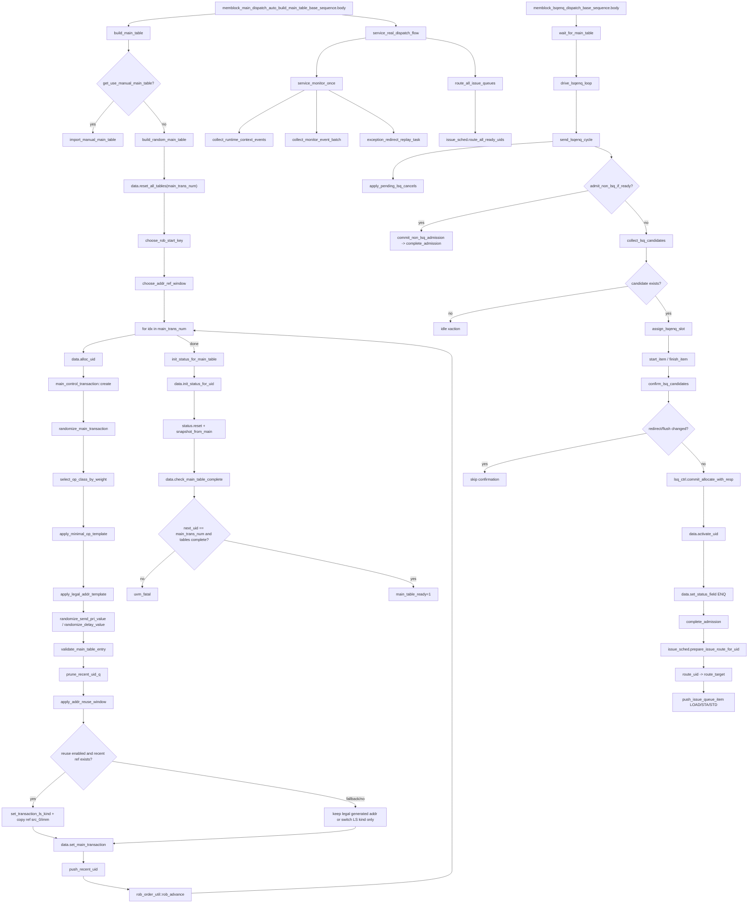

# MemBlock Main Table Build and Stimulus Flow

本文按当前源码整理 `memblock_main_dispatch_auto_build_main_table_base_sequence` 的主表构建、uid/status 生成、LSQ admission 和 issue queue 入队链路。重点是说明主表如何生成 `uid`、`main_control_transaction`、`status_transaction`，以及后续如何通过 LSQ admission 进入 LOAD/STA/STD issue queue。

核心源码：

- `mem_ut/ver/ut/memblock/seq/base_seq/memblock_main_dispatch_auto_build_main_table_base_sequence.sv`
- `mem_ut/ver/ut/memblock/seq/base_seq_help/memblock_dispatch_base_sequence.sv`
- `mem_ut/ver/ut/memblock/seq/base_seq_help/main_control_transaction.sv`
- `mem_ut/ver/ut/memblock/seq/base_seq_help/status_transaction.sv`
- `mem_ut/ver/ut/memblock/seq/base_seq_help/common_data_transaction.sv`
- `mem_ut/ver/ut/memblock/seq/base_seq/memblock_lsqenq_dispatch_base_sequence.sv`
- `mem_ut/ver/ut/memblock/seq/base_seq_help/lsq_ctrl_model.sv`
- `mem_ut/ver/ut/memblock/seq/base_seq_help/issue_queue_scheduler.sv`
- `mem_ut/ver/ut/memblock/env/plus.sv`
- `mem_ut/ver/ut/memblock/seq/plus_cfg/*.cfg`

说明：用户给出的 `issue_queue_assigner.sv` 在当前源码树中不存在。当前 issue 字段分配由 `issue_field_assigner.sv` 承担，issue queue 路由和选择由 `issue_queue_scheduler.sv` 承担。

## 1. 函数调用 Flow 图



### 1.1 函数调用 Flow 图整体文字伪代码

```text
主表构建与入队主流程：

1. 主表构建入口
memblock_main_dispatch_auto_build_main_table_base_sequence.body:
  调用 build_main_table 构建所有 main_control_transaction；
  main_table_ready 后进入 service_real_dispatch_flow；
  service loop 每拍收集 runtime/monitor/recovery 事件，再调用 route_all_issue_queues 补 route；
  所有 transaction terminal_done 后执行 end_test_check；normal pass 会置 `success=1 && terminal_done=1`，允许 retire 的 fault/exception 会置 `success=0 && terminal_done=1`。

2. 随机主表构建
build_main_table:
  如果 MEMBLOCK_USE_MANUAL_MAIN_TABLE=1：
    调用 import_manual_main_table，从 manual_main_table_by_rob 按 ROB key 排序导入；
  否则：
    调用 build_random_main_table(MEMBLOCK_MAIN_TRANS_NUM)。

build_random_main_table:
  reset_all_tables 清空主表、status 表、issue queues、redirect/flush 状态和 raw monitor queue；
  choose_rob_start_key 决定首个 ROB key；
  choose_addr_ref_window 决定地址复用历史窗口；
  对每个 idx:
    alloc_uid 分配连续 uid；
    创建 main_control_transaction；
    randomize_main_transaction 填 op_class、fuType、fuOpType、src_0/imm/vaddr、ROB、send_pri、delay；
    prune_recent_uid_q 移除超出地址复用窗口的历史 uid；
    apply_addr_reuse_window 根据 MEMBLOCK_ADDR_REUSE_* 权重选择是否复用历史 load/store 地址；
    set_main_transaction 写 main_table_by_uid[uid]；
    push_recent_uid 把当前 load/store uid 加到地址复用历史队列；
    rob_advance 推进下一个 ROB key；
  init_status_for_main_table 为每个 uid 创建 status 快照；
  check_main_table_complete 检查 uid 数量和表项完整性，并置 main_table_ready=1。

3. LSQ admission 到 issue route
memblock_lsqenq_dispatch_base_sequence.body:
  等待 data.main_table_ready；
  drive_lsqenq_loop 每拍调用 send_lsqenq_cycle；

send_lsqenq_cycle:
  先 apply_pending_lsq_cancels，消费 redirect 后需要回退的软件 LQ/SQ 指针；
  如果 next uid 是 non-LSQ 类型且可 admission：
    commit_non_lsq_admission，随后 complete_admission；
  否则 collect_lsq_candidates 从 get_next_new_admit_uid 开始顺序取候选；
  如果没有候选：
    发 idle xaction；
  如果有候选：
    assign_lsqenq_slot 写 req valid、fuType、uopIdx、ROB/LQ/SQ key、numLsElem；
    start_item/finish_item 交给 lsqenq driver；
    confirm_lsq_candidates 只在未发生 redirect/flush 且 flush_epoch 未变化时确认；
    commit_allocate_with_resp 用 DUT resp key 校验软件预期 key，写回 main transaction 的 LQ/SQ key；
    data.activate_uid 建立 ROB/LQ/SQ active map；
    set_status_field(ENQ) 置 enq=1 并推进 max_enqueued_uid；
    complete_admission 调用 prepare_issue_route_for_uid。

4. issue queue 入队
prepare_issue_route_for_uid:
  要求 status.active=1 且 status.enq=1；
  设置 issue_ready=1；
  调用 route_uid。

route_uid:
  如果处于 global flush/redirect freeze，或 status 已 flushed/redirect_pending/exception_pending，则跳过；
  derive_op_behavior 按 fuType/fuOpType 判断 route_load/route_sta/route_std；
  LOAD 写 load_issue_q；
  STORE 写 sta_issue_q 和 std_issue_q；
  AMO/MOU 按 behavior 写 STA/STD 或其他目标；
  route_target 会去重旧 queue entry，生成 memblock_issue_q_item_t，并置 queued_load/queued_sta/queued_std。
```

## 2. `memblock_main_dispatch_auto_build_main_table_base_sequence::body()`

源码位置：`mem_ut/ver/ut/memblock/seq/base_seq/memblock_main_dispatch_auto_build_main_table_base_sequence.sv`

真实逻辑摘要：

```systemverilog
task memblock_main_dispatch_auto_build_main_table_base_sequence::body();
    build_main_table();
    service_real_dispatch_flow();
    data.end_test_check();
endtask:body
```

功能解释：

这是真实 DUT dispatch smoke 的顶层 orchestration。它先完成主表构建，再进入 runtime service loop，最后检查所有共享表、queue、redirect/flush 状态是否收尾干净。

输入/输出：

- 输入：`seq_csr_common` 读取到的 plus 配置、共享 `common_data_transaction data`。
- 输出：`main_table_by_uid[]`、`status_by_uid[]`、`main_table_ready`；运行过程中推动 monitor/recovery/route；结束时执行 `end_test_check()`。

文字伪代码：

```text
调用 build_main_table：生成所有 uid/main transaction/status 快照；
打印主表数量；
调用 service_real_dispatch_flow：每拍服务 monitor/recovery/route；
调用 data.end_test_check：检查 raw monitor queue、issue queue、active map、flush/redirect 状态均收尾。
```

内部子调用：

- `build_main_table()`：选择随机或手工主表构建路径。
- `service_real_dispatch_flow()`：真实 DUT 运行期间的 monitor/recovery/route 服务循环。
- `data.end_test_check()`：结束一致性检查。

## 3. `build_main_table()`

源码位置：`mem_ut/ver/ut/memblock/seq/base_seq_help/memblock_dispatch_base_sequence.sv`

真实逻辑摘要：

```systemverilog
task memblock_dispatch_base_sequence::build_main_table();
    if (data == null) begin
        data = common_data_transaction::get();
    end

    if (seq_csr_common::get_use_manual_main_table()) begin
        import_manual_main_table();
    end else begin
        build_random_main_table(seq_csr_common::get_main_trans_num());
    end
endtask:build_main_table
```

功能解释：

该函数是主表构建分支入口。`MEMBLOCK_USE_MANUAL_MAIN_TABLE` 为 1 时导入 testcase 预先配置的 manual table；默认为 0 时按 `MEMBLOCK_MAIN_TRANS_NUM` 随机构建。

输入/输出：

- 输入：`MEMBLOCK_USE_MANUAL_MAIN_TABLE`、`MEMBLOCK_MAIN_TRANS_NUM`。
- 输出：调用后要求 `data.main_table_ready=1`，否则后续 LSQ/issue sequence 会一直等待。

文字伪代码：

```text
如果 data 未初始化，则取 common_data_transaction 单例；
读取 use_manual_main_table；
如果手工模式：
  import_manual_main_table；
否则：
  build_random_main_table(main_trans_num)。
```

内部子调用：

- `import_manual_main_table()`：按 ROB key 排序导入手工 transaction。
- `build_random_main_table()`：随机生成 transaction，并初始化 status 表。

## 4. `build_random_main_table()`

源码位置：`mem_ut/ver/ut/memblock/seq/base_seq_help/memblock_dispatch_base_sequence.sv`

真实逻辑摘要：

```systemverilog
data.reset_all_tables(main_trans_num_i);
rob_key = choose_rob_start_key();
addr_ref_window = choose_addr_ref_window();

for (int unsigned idx = 0; idx < main_trans_num_i; idx++) begin
    uid = data.alloc_uid();
    tr = main_control_transaction::type_id::create($sformatf("main_uid_%0d", uid));
    randomize_main_transaction(tr, uid, rob_key);
    prune_recent_uid_q(recent_load_uid_q, uid, addr_ref_window);
    prune_recent_uid_q(recent_store_uid_q, uid, addr_ref_window);
    apply_addr_reuse_window(tr, uid, recent_load_uid_q, recent_store_uid_q);
    data.set_main_transaction(uid, tr);
    push_recent_uid(tr, uid, recent_load_uid_q, recent_store_uid_q);
    rob_key = rob_order_util::rob_advance(rob_key, 1);
end

init_status_for_main_table();
data.check_main_table_complete();
```

功能解释：

这是随机主表的核心生成函数。它保证 uid 连续分配、ROB 顺序推进、地址复用只引用窗口内已生成 transaction，并在所有 transaction 写入后统一初始化 status 表。

输入/输出：

- 输入：`main_trans_num_i`、ROB 起点配置、地址复用配置、op class/send_pri/delay plus 权重。
- 输出：`main_table_by_uid[uid]` 填满；`status_by_uid[uid]` 完整；`main_table_ready=1`。

文字伪代码：

```text
reset_all_tables(main_trans_num_i)：清空主表、状态表、issue queues、redirect/flush 状态；
choose_rob_start_key：选择首个 ROB flag/value；
choose_addr_ref_window：确定地址复用可引用的 uid 距离窗口；
for idx in 0..main_trans_num_i-1:
  alloc_uid：分配连续 uid；
  创建 main_control_transaction；
  randomize_main_transaction：生成合法基础 transaction；
  prune_recent_uid_q：删除超过窗口的历史 load/store uid；
  apply_addr_reuse_window：按权重决定是否把当前 transaction 改成 load/store 并复用历史地址；
  set_main_transaction：写入 main_table_by_uid[uid]；
  push_recent_uid：如果当前是 load/store，加入最近 uid 队列；
  rob_advance：下一个 uid 使用下一个 ROB key；
init_status_for_main_table：为每个 uid 生成 status 快照；
check_main_table_complete：检查完整性并置 main_table_ready。
```

内部子调用：

- `data.reset_all_tables()`：清空共享状态并创建 status object 数组。
- `data.alloc_uid()`：顺序分配 uid。
- `randomize_main_transaction()`：填 transaction 字段。
- `apply_addr_reuse_window()`：处理地址复用和 load/store 类型修正。
- `data.set_main_transaction()`：写主表。
- `init_status_for_main_table()`：创建 status 快照。
- `data.check_main_table_complete()`：置 `main_table_ready`。

## 5. `import_manual_main_table()`

源码位置：`mem_ut/ver/ut/memblock/seq/base_seq_help/memblock_dispatch_base_sequence.sv`

真实逻辑摘要：

```systemverilog
manual_num = manual_main_table_by_rob.num();
if (manual_num == 0) begin
    `uvm_fatal(get_type_name(), "manual main table mode requires at least one configured entry")
end

data.reset_all_tables(manual_num);
foreach (manual_main_table_by_rob[rob_key]) begin
    rob_keys.push_back(rob_key);
end
rob_keys.sort();
foreach (rob_keys[idx]) begin
    rob_key = rob_keys[idx];
    tr = manual_main_table_by_rob[rob_key];
    uid = data.alloc_uid();
    tr.uid = uid;
    tr.post_manual_config(1'b1);
    validate_main_table_entry(tr, $sformatf("manual rob_key=%0d", rob_key));
    data.set_main_transaction(uid, tr);
end

init_status_for_main_table();
data.check_main_table_complete();
```

功能解释：

该函数是手工主表模式的构建路径。它不随机生成 transaction，而是把 testcase 预先放入 `manual_main_table_by_rob` 的 entry 按 ROB key 排序后导入，并重新分配连续 uid。

输入/输出：

- 输入：`manual_main_table_by_rob[int unsigned]`，key 是 ROB value/order。
- 输出：连续 uid 的 `main_table_by_uid[]`、`status_by_uid[]`、`main_table_ready=1`。

文字伪代码：

```text
读取 manual_main_table_by_rob 数量；
如果为空：
  fatal，因为手工模式必须有 entry；
reset_all_tables(manual_num)；
收集所有 rob_key；
rob_keys.sort，保证按 ROB 顺序导入；
foreach rob_key:
  取手工 transaction；
  如果 transaction 为 null，fatal；
  alloc_uid 分配连续 uid；
  写 tr.uid；
  post_manual_config 重新计算 vaddr 并校验 transaction 自洽；
  validate_main_table_entry 检查 mem_ut 支持范围和 behavior；
  set_main_transaction 写入主表；
init_status_for_main_table；
check_main_table_complete。
```

内部子调用：

- `data.reset_all_tables()`：按手工 entry 数重建共享表。
- `data.alloc_uid()`：导入时仍使用连续 uid。
- `tr.post_manual_config()`：手工 entry 的自检入口。
- `validate_main_table_entry()`：与随机路径共用合法性检查。
- `data.set_main_transaction()`：写主表。
- `init_status_for_main_table()` / `check_main_table_complete()`：完成 status 和 ready 标志。

## 6. `common_data_transaction::reset_all_tables() / alloc_uid() / set_main_transaction()`

源码位置：`mem_ut/ver/ut/memblock/seq/base_seq_help/common_data_transaction.sv`

真实逻辑摘要：

```systemverilog
main_trans_num      = main_trans_num_i;
next_uid            = 0;
main_table_ready    = 1'b0;
global_stop_requested = 1'b0;
dispatch_progress.terminal_done_uid = 0;
dispatch_progress.max_enqueued_uid_valid = 1'b0;
clear_issue_queues();
clear_feedback_events();
clear_redirect_drive_queue();
uid_by_active_rob.delete();
uid_by_lq.delete();
uid_by_sq.delete();
main_table_by_uid = new[main_trans_num_i];
status_by_uid     = new[main_trans_num_i];
...
uid = next_uid;
next_uid++;
...
tr.uid = uid;
main_table_by_uid[uid] = tr;
```

功能解释：

这组函数是主表和全局状态的 owner。`reset_all_tables()` 保证构建前共享状态归零；`alloc_uid()` 只允许在 `main_trans_num` 范围内连续分配；`set_main_transaction()` 禁止覆盖已 active 的 uid。

输入/输出：

- 输入：`main_trans_num_i`、待写入的 `main_control_transaction tr`。
- 输出：`main_table_by_uid[]`、`status_by_uid[]` 数组和 `next_uid`。

文字伪代码：

```text
reset_all_tables:
  检查 main_trans_num_i 非 0；
  清 main_table_ready/global_stop/dispatch_progress；
  清 redirect/flush/issue_freeze/flushsb/raw monitor queue；
  new main_table_by_uid 和 status_by_uid；
  为每个 uid 创建 status_transaction 并 reset；

alloc_uid:
  如果未 reset 或 next_uid 越界则 fatal；
  返回当前 next_uid；
  next_uid 加 1；

set_main_transaction:
  检查 uid 合法、tr 非空；
  如果对应 status 已 active，则 fatal，避免覆盖运行中动态实例；
  tr.uid = uid；
  main_table_by_uid[uid] = tr。
```

内部子调用：

- `clear_issue_queues()`：清 `load_issue_q/sta_issue_q/std_issue_q`。
- `clear_feedback_events()`、`clear_redirect_drive_queue()`：清事件与 redirect drive 队列。
- `status_transaction::reset()`：初始化每个 uid 的状态字段。

## 7. `randomize_main_transaction()`

源码位置：`mem_ut/ver/ut/memblock/seq/base_seq_help/memblock_dispatch_base_sequence.sv`

真实逻辑摘要：

```systemverilog
if (!tr.randomize()) begin
    `uvm_fatal(get_type_name(), $sformatf("main transaction randomize failed uid=%0d", uid))
end

tr.uid          = uid;
tr.robIdx_flag  = rob_key.flag;
tr.robIdx_value = rob_key.value;
tr.lqIdx_flag   = 1'b0;
tr.sqIdx_flag   = 1'b0;
tr.numLsElem    = 5'd1;
tr.imm          = main_control_transaction::sign_extend_imm12(tr.imm);
...
tr.op_class     = select_op_class_by_weight();
apply_minimal_op_template(tr);
apply_legal_addr_template(tr);
tr.send_pri     = randomize_send_pri_value(1'b0);
tr.send_pri_std = randomize_send_pri_value(1'b1);
tr.delay        = randomize_delay_value();
tr.update_vaddr();
validate_main_table_entry(tr, $sformatf("random uid=%0d", uid));
```

功能解释：

该函数生成单条主表 transaction 的基础字段。LSQ key 在这里先清零，真实 LQ/SQ key 要等 LSQ admission 根据 DUT response 回填。

输入/输出：

- 输入：`uid`、当前 `rob_key`、plus 权重配置。
- 输出：填好的 `tr`，包括 op class、fuType/fuOpType、地址、ROB、send priority、delay。

文字伪代码：

```text
调用 tr.randomize 生成 rand 字段初值；
写 uid 和当前 ROB key；
清 lqIdx/sqIdx，因为 LSQ admission 才会分配；
清 TLB/PMA/denied/corrupt 异常字段；
select_op_class_by_weight：按 MEMBLOCK_OP_CLASS_*_WT 选 load/store/prefetch/amo；
apply_minimal_op_template：按 op_class 写 fuType、lsq_flow、fuOpType、numLsElem；
apply_legal_addr_template：从 MEMBLOCK_PADDR_BASE/RANGE 中选 64B 对齐地址；
randomize_send_pri_value：生成 send_pri 和 send_pri_std；
randomize_delay_value：生成 issue queue ready_cycle 初值；
update_vaddr；
validate_main_table_entry：检查字段组合合法。
```

内部子调用：

- `select_op_class_by_weight()`：五类 op 权重选择。
- `apply_minimal_op_template()`：op class 到 FU/LSQ 模板转换。
- `apply_legal_addr_template()`：生成合法地址。
- `randomize_send_pri_value()`：send priority 配置入口。
- `validate_main_table_entry()`：结构合法性检查。

## 8. `apply_minimal_op_template() / validate_main_table_entry()`

源码位置：`mem_ut/ver/ut/memblock/seq/base_seq_help/memblock_dispatch_base_sequence.sv`

真实逻辑摘要：

```systemverilog
case (tr.op_class)
    MEMBLOCK_OP_CLASS_INT_LOAD,
    MEMBLOCK_OP_CLASS_FP_LOAD: begin
        tr.fuType   = MEMBLOCK_FUTYPE_LDU;
        tr.lsq_flow = MEMBLOCK_LSQ_FLOW_LOAD;
        tr.fuOpType = random_load_fuoptype();
        tr.numLsElem = 5'd1;
    end
    MEMBLOCK_OP_CLASS_STORE: begin
        tr.fuType   = MEMBLOCK_FUTYPE_STU;
        tr.lsq_flow = MEMBLOCK_LSQ_FLOW_STORE;
        tr.fuOpType = random_store_fuoptype();
        tr.numLsElem = 5'd1;
    end
    MEMBLOCK_OP_CLASS_AMO: begin
        tr.fuType   = MEMBLOCK_FUTYPE_MOU;
        tr.lsq_flow = MEMBLOCK_LSQ_FLOW_ATOMIC;
        tr.fuOpType = random_amo_fuoptype();
        tr.numLsElem = 5'd0;
    end
endcase
...
behavior = derive_op_behavior(tr);
if (tr.numLsElem != behavior.num_ls_elem) begin
    `uvm_fatal(...)
end
```

功能解释：

`apply_minimal_op_template()` 把高层 op class 落到 DUT issue/admission 所需的 `fuType/fuOpType/lsq_flow/numLsElem`。`validate_main_table_entry()` 再用 `lsq_ctrl_model::derive_op_behavior()` 复核该模板能被 LSQ/issue 识别。

输入/输出：

- 输入：`tr.op_class`。
- 输出：`fuType`、`fuOpType`、`lsq_flow`、`numLsElem`；非法组合直接 fatal。

文字伪代码：

```text
如果 op_class 是 INT/FP LOAD：
  设置 LDU + LOAD flow + load fuOpType；
如果 op_class 是 STORE：
  设置 STU + STORE flow + store fuOpType；
如果 op_class 是 PREFETCH：
  设置 LDU + LOAD flow + prefetch fuOpType；
如果 op_class 是 AMO：
  设置 MOU + ATOMIC flow + amo fuOpType；
validate_main_table_entry:
  检查 vaddr 等于 src_0 + sign_extend(imm12)；
  检查 ROB value 未超 MEMBLOCK_ROB_SIZE；
  拒绝 vector LS；
  derive_op_behavior 并检查 numLsElem 匹配；
  按 op_class 检查 fuType/lsq_flow/fuOpType 合法。
```

内部子调用：

- `random_load_fuoptype()`、`random_store_fuoptype()`、`random_prefetch_fuoptype()`、`random_amo_fuoptype()`：选择具体 LSU op。
- `derive_op_behavior()`：调用 `lsq_ctrl_model::derive_op_behavior()`。

## 9. `choose_rob_start_key()`

源码位置：`mem_ut/ver/ut/memblock/seq/base_seq_help/memblock_dispatch_base_sequence.sv`

真实逻辑摘要：

```systemverilog
key.flag = 1'b0;
if (seq_csr_common::get_rob_start_fixed_en()) begin
    key.value = seq_csr_common::get_rob_start_fixed_value();
    return key;
end

sel = rand_weighted3(seq_csr_common::get_rob_start_zero_wt(),
                     seq_csr_common::get_rob_start_mid_wt(),
                     seq_csr_common::get_rob_start_near_wrap_wt());
case (sel)
    0: key.value = '0;
    1: key.value = $urandom_range(mid_hi, mid_lo);
    default: key.value = $urandom_range(MEMBLOCK_ROB_SIZE - 1, near_lo);
endcase
```

功能解释：

该函数决定 uid0 的 ROB 起点。后续 `build_random_main_table()` 每生成一条 transaction 都调用 `rob_order_util::rob_advance(rob_key, 1)`，因此主表 ROB key 保持源码定义的 ROB 环形顺序。

输入/输出：

- 输入：`MEMBLOCK_ROB_START_FIXED_EN`、`MEMBLOCK_ROB_START_FIXED_VALUE`、`MEMBLOCK_ROB_START_*_WT`。
- 输出：首个 `memblock_rob_key_t`。

文字伪代码：

```text
ROB flag 固定从 0 开始；
如果 fixed_en=1：
  使用 fixed_value；
否则按 zero/mid/near_wrap 权重选择 value；
返回首个 ROB key。
```

内部子调用：

- `rand_weighted3()`：三段起点权重选择。
- `rob_order_util::rob_advance()`：调用点在 `build_random_main_table()`，用于后续 uid。

## 10. `apply_legal_addr_template()` 和地址复用窗口

源码位置：`mem_ut/ver/ut/memblock/seq/base_seq_help/memblock_dispatch_base_sequence.sv`

真实逻辑摘要：

```systemverilog
base       = seq_csr_common::get_paddr_base();
range      = seq_csr_common::get_paddr_range();
upper      = base + range - 1;
align_mask = 64'd63;
aligned_base = (base + align_mask) & ~align_mask;
slot_count = ((upper - aligned_base) >> 6) + 1;
slot_pick = {$urandom(), $urandom()} % slot_count;
tr.src_0 = aligned_base + (slot_pick << 6);
tr.imm   = 64'h0;
tr.update_vaddr();
```

```systemverilog
if (rand_weighted2(seq_csr_common::get_addr_reuse_en_1_wt(),
                   seq_csr_common::get_addr_reuse_en_0_wt()) != 0) begin
    return;
end

kind = select_addr_reuse_kind();
case (kind)
    MEMBLOCK_ADDR_REUSE_LOAD_AFTER_STORE: ...
    MEMBLOCK_ADDR_REUSE_LOAD_AFTER_LOAD: ...
    MEMBLOCK_ADDR_REUSE_STORE_AFTER_LOAD: ...
    MEMBLOCK_ADDR_REUSE_STORE_AFTER_STORE: ...
endcase
```

功能解释：

基础地址先从 `MEMBLOCK_PADDR_BASE/RANGE` 中选择 64B 对齐地址。随后 `apply_addr_reuse_window()` 可以按权重把当前 transaction 改成 load 或 store，并复制窗口内历史 transaction 的 `src_0/imm`，用于构造 load-after-store、store-after-load 等地址相关场景。

输入/输出：

- 输入：`MEMBLOCK_PADDR_BASE`、`MEMBLOCK_PADDR_RANGE`、`MEMBLOCK_ADDR_REUSE_*`、`MEMBLOCK_ADDR_REF_WINDOW_*`。
- 输出：`tr.src_0/imm/vaddr`，可能还会改写 `op_class/fuType/fuOpType/lsq_flow`。

文字伪代码：

```text
apply_legal_addr_template:
  计算 paddr base/range 的 64B 对齐槽；
  随机选择一个槽；
  写 src_0，imm=0，更新 vaddr；

choose_addr_ref_window:
  如果 fixed_window>0，直接使用；
  否则按 small/medium/large 权重在最大窗口内随机；

apply_addr_reuse_window:
  先按 MEMBLOCK_ADDR_REUSE_EN_1_WT/0_WT 判断是否启用复用；
  未启用则保留 apply_legal_addr_template 生成的地址；
  启用后按四类 reuse kind 选择；
  如果引用队列有历史 uid：
    取 ref_tr，必要时 set_transaction_ls_kind，把当前改成 load 或 store；
    copy ref_tr.src_0/ref_tr.imm，并 update_vaddr；
  如果引用队列为空：
    走 fallback，可能只切换 load/store 类型，不复制地址；
  validate_main_table_entry 复核改写后的 transaction。
```

内部子调用：

- `prune_recent_uid_q()`：删除 `cur_uid - old_uid > addr_ref_window` 的历史 uid。
- `random_pick_recent_uid()`：从历史队列随机选引用 uid，部分模式会删除被引用 uid。
- `set_transaction_ls_kind()`：把当前 transaction 切成 load 或 store 模板。
- `fixup_after_addr_reuse()`：复制地址并做合法性检查。

## 11. `randomize_send_pri_value()`

源码位置：`mem_ut/ver/ut/memblock/seq/base_seq_help/memblock_dispatch_base_sequence.sv`

真实逻辑摘要：

```systemverilog
if (!seq_csr_common::get_send_pri_mode_en()) begin
    if (is_std) begin
        return seq_csr_common::get_send_pri_std_default();
    end
    return seq_csr_common::get_send_pri_default();
end

sel = rand_weighted3(...low_wt..., ...mid_wt..., ...high_wt...);
case (sel)
    0: return $urandom_range(33, 0);
    1: return $urandom_range(66, 34);
    default: return $urandom_range(100, 67);
endcase
```

功能解释：

主表阶段生成 `send_pri` 和 `send_pri_std`。`MEMBLOCK_SEND_PRI_MODE_EN=0` 时使用默认 priority；开启后按 low/mid/high 权重随机 priority。issue 选择阶段再由 `MEMBLOCK_GLOBAL_SEND_PRI_EN_WT` 每拍采样决定是否做跨 LOAD/STA/STD 的全局 priority filter。

输入/输出：

- 输入：`MEMBLOCK_SEND_PRI_MODE_EN`、普通 target 和 STD target 的 default/low/mid/high 权重。
- 输出：`main_tr.send_pri`、`main_tr.send_pri_std`。

文字伪代码：

```text
如果 send_pri_mode_en=0：
  普通 target 使用 MEMBLOCK_SEND_PRI_DEFAULT；
  STD 使用 MEMBLOCK_SEND_PRI_STD_DEFAULT；
如果 send_pri_mode_en=1：
  按 low/mid/high 权重选择区间；
  low 返回 0..33；
  mid 返回 34..66；
  high 返回 67..100。
```

内部子调用：

- `seq_csr_common::get_send_pri_*()`：从 `env/plus.sv` 和 `seq/plus_cfg/*.cfg` 读取配置。
- `rand_weighted3()`：权重选择。

## 12. `init_status_for_main_table()` / `status_transaction::snapshot_from_main()`

源码位置：以下多个文件共同实现：

- `mem_ut/ver/ut/memblock/seq/base_seq_help/memblock_dispatch_base_sequence.sv`
- `mem_ut/ver/ut/memblock/seq/base_seq_help/status_transaction.sv`
- `mem_ut/ver/ut/memblock/seq/base_seq_help/common_data_transaction.sv`

真实逻辑摘要：

```systemverilog
for (int unsigned uid = 0; uid < data.main_trans_num; uid++) begin
    void'(data.init_status_for_uid(uid));
end
```

```systemverilog
status.reset(uid);
if (main_table_by_uid[uid] != null) begin
    status.snapshot_from_main(main_table_by_uid[uid]);
end
```

```systemverilog
uid          = tr.uid;
robIdx_flag  = tr.robIdx_flag;
robIdx_value = tr.robIdx_value;
lqIdx_flag   = tr.lqIdx_flag;
lqIdx_value  = tr.lqIdx_value;
sqIdx_flag   = tr.sqIdx_flag;
sqIdx_value  = tr.sqIdx_value;
```

功能解释：

主表构建完后，每个 uid 都有一个 status object。此时 status 只保存 ROB/LQ/SQ key 快照和初始状态；`active/enq/issue_ready/queued/dispatched/writeback/pass/success` 都仍为 0。

输入/输出：

- 输入：`main_table_by_uid[uid]`。
- 输出：`status_by_uid[uid]`，包含 uid 和 key 快照。

文字伪代码：

```text
对每个 uid:
  reset status，清所有运行期状态位；
  如果主表已有 transaction：
    snapshot_from_main 保存 uid、ROB key、LQ key、SQ key；
  写回 status_by_uid[uid]。
```

内部子调用：

- `status.reset()`：清 active/enq/queued/dispatched/replay/redirect/success 等字段。
- `status.snapshot_from_main()`：保存主表 key 快照。

## 13. `check_main_table_complete()`

源码位置：`mem_ut/ver/ut/memblock/seq/base_seq_help/common_data_transaction.sv`

真实逻辑摘要：

```systemverilog
if (next_uid != main_trans_num) begin
    `uvm_fatal("COMMON_DATA", $sformatf("uid allocation mismatch: next_uid=%0d main_trans_num=%0d", next_uid, main_trans_num))
end
for (uid = 0; uid < main_trans_num; uid++) begin
    if (main_table_by_uid[uid] == null) begin
        `uvm_fatal(...)
    end
    if (status_by_uid[uid] == null) begin
        `uvm_fatal(...)
    end
end
main_table_ready = 1'b1;
```

功能解释：

该函数是主表可消费的唯一完成标志。LSQ enqueue sequence 和 lintsissue issue sequence 都通过 `wait_for_main_table()` 等待它。

输入/输出：

- 输入：`next_uid`、`main_trans_num`、主表/status 数组。
- 输出：`main_table_ready=1`。

文字伪代码：

```text
检查已经分配的 uid 数等于 main_trans_num；
逐 uid 检查 main_table_by_uid 和 status_by_uid 均非空；
设置 main_table_ready=1。
```

内部子调用：

- 无 flushSb 子调用。flushSb 由 `memblock_flushsb_base_sequence` 或其它 producer 通过
  `push_flushsb_request()` 入队，主表完成函数只负责发布 `main_table_ready`。

## 14. `service_real_dispatch_flow()` / `service_monitor_once()`

源码位置：`mem_ut/ver/ut/memblock/seq/base_seq/memblock_main_dispatch_auto_build_main_table_base_sequence.sv`

真实逻辑摘要：

```systemverilog
task memblock_main_dispatch_auto_build_main_table_base_sequence::service_real_dispatch_flow();
    memblock_flushsb_base_sequence flushsb_seq;

    ensure_service_vif();
    flushsb_seq = memblock_flushsb_base_sequence::type_id::create("flushsb_seq");
    fork
        flushsb_seq.start(null);
    join_none
    forever begin
        @(negedge service_vif.clk);
        if (service_vif.rst_n !== 1'b1 ||
            memblock_sync_pkg::reset_backend_done !== 1'b1) begin
            continue;
        end
        service_monitor_once();
        if (!data.is_global_stop_requested()) begin
            route_all_issue_queues();
        end
        void'(all_transactions_terminal_done());
        if (data.is_global_stop_requested() &&
            !data.flushsb_request_pending()) begin
            break;
        end
    end
endtask:service_real_dispatch_flow
```

```systemverilog
task memblock_main_dispatch_auto_build_main_table_base_sequence::service_monitor_once();
    memblock_sync_pkg::tick_dispatch_service_cycle();
    collect_runtime_context_events();
    collect_monitor_event_batch();
    exception_redirect_replay_task();
endtask:service_monitor_once
```

功能解释：

这是主表构建完成后的顶层服务循环。它不直接驱动 LSQ/lintsissue agent，但每拍推进 dispatch service cycle，收集 monitor/recovery 事件，并周期性调用 `route_all_issue_queues()` 补充 issue queue。

输入/输出：

- 输入：`service_vif` 时钟/reset、`reset_backend_done`、主表/status/monitor queues。
- 输出：monitor/recovery 状态更新、issue queue 补 route、`global_stop_requested` 触发退出。

文字伪代码：

```text
ensure_service_vif 获取 lintsissue service 时钟 vif；
创建 memblock_flushsb_base_sequence，并 fork 启动周期 flushSb producer；
forever:
  等 negedge service_vif.clk；
  如果 reset 未释放或 backend reset 未完成：
    continue；
  service_monitor_once：
    tick_dispatch_service_cycle；
    collect_runtime_context_events：先 drain CSR runtime，再 drain sfence；
    collect_monitor_event_batch：收集 writeback/redirect ctrl batch 并做 redirect-first 仲裁；
    exception_redirect_replay_task：消费 pending exception/replay/redirect 事件；
  如果 global_stop_requested 尚未置位：
    route_all_issue_queues 周期性补充 ready uid 到 issue queue；
  调用 all_transactions_terminal_done：
    request_global_stop_if_done，如果全表 terminal_done 则置 global stop；
  如果 global_stop_requested=1 且 flushsb_request_pending=0：
    说明主 transaction 已完成且 flushSb 队列/active waiting 已清空，退出 service loop。
```

内部子调用：

- `ensure_service_vif()`：获取服务循环使用的时钟 vif。
- `memblock_flushsb_base_sequence::start()`：启动周期 flushSb producer；它只向公共队列入队，不驱动 DUT。
- `all_transactions_terminal_done()`：推进 terminal_done_uid 并请求 global stop。
- `collect_runtime_context_events()`：先同步 CSR runtime latest snapshot，再显式消费 sfence/hfence FIFO。
- `collect_monitor_event_batch()`：收集并处理 monitor batch。
- `exception_redirect_replay_task()`：处理 pending recovery 事件。
- `route_all_issue_queues()`：补 route 到 issue queue。
- `data.flushsb_request_pending()`：检查 flushSb 队列和 active waiting 是否都收敛，防止 final check 前仍有未完成 flushSb。

## 15. LSQ Admission：`send_lsqenq_cycle()` 到 `complete_admission()`

源码位置：`mem_ut/ver/ut/memblock/seq/base_seq/memblock_lsqenq_dispatch_base_sequence.sv`

真实逻辑摘要：

```systemverilog
apply_pending_lsq_cancels();
if (admit_non_lsq_if_ready(has_progress)) begin
    return;
end
if (!collect_lsq_candidates(uids, trs, behaviors, lq_keys, sq_keys)) begin
    ... idle xaction ...
    return;
end
...
foreach (uids[idx]) begin
    assign_lsqenq_slot(tr, idx, uids[idx], trs[idx], behaviors[idx], lq_keys[idx], sq_keys[idx]);
end
start_item(tr);
finish_item(tr);
confirm_lsq_candidates(tr, uids, trs, behaviors, has_progress);
```

```systemverilog
if (tr.memblock_dispatch_aborted_by_redirect ||
    admission_blocked_by_flush() ||
    tr.memblock_dispatch_flush_epoch != memblock_sync_pkg::dispatch_flush_epoch) begin
    return;
end
foreach (uids[idx]) begin
    get_resp_keys(tr, idx, dut_lq_key, dut_sq_key);
    lsq_ctrl.commit_allocate_with_resp(uids[idx], behaviors[idx], trs[idx], dut_lq_key, dut_sq_key);
    complete_admission(uids[idx]);
end
```

```systemverilog
function void memblock_lsqenq_dispatch_base_sequence::complete_admission(input memblock_uid_t uid);
    drain_csr_runtime_events();
    issue_sched.prepare_issue_route_for_uid(uid);
endfunction:complete_admission
```

功能解释：

LSQ admission 是主表进入 active runtime 的边界。只有 confirmation 未被 redirect/flush 覆盖时，才会提交 LQ/SQ key、置 `enq`、置 `issue_ready` 并立即尝试 issue queue route。

输入/输出：

- 输入：`main_table_by_uid` 中顺序 next uid、DUT LSQ enqueue response key。
- 输出：更新 `main_table_by_uid[uid].lqIdx/sqIdx`，建立 active ROB/LQ/SQ map，设置 `status.enq/issue_ready`，可能写入 issue queue。

文字伪代码：

```text
send_lsqenq_cycle:
  先处理 redirect 后 pending_lq_cancel_count/pending_sq_cancel_count；
  如果 next uid 是 non-LSQ admission：
    直接 commit_non_lsq_admission 并 complete_admission；
  否则 collect_lsq_candidates；
  如果没有候选：
    发送 idle xaction；
  有候选则写 LSQ req slot 并发给 driver；
  driver 完成后调用 confirm_lsq_candidates；

confirm_lsq_candidates:
  如果 driver 标记 aborted_by_redirect：
    直接 return，不确认，不写 status；
  如果 admission_blocked_by_flush 或 flush_epoch 改变：
    直接 return，不确认；
  对每个 candidate:
    从 xaction response 取 DUT lq/sq key；
    commit_allocate_with_resp 校验并提交；
    complete_admission；

complete_admission:
  drain_csr_runtime_events 更新 CSR runtime snapshot；
  prepare_issue_route_for_uid 设置 issue_ready 并 route_uid。
```

内部子调用：

- `collect_lsq_candidates()`：从 `get_next_new_admit_uid()` 顺序收集最多 `MEMBLOCK_ENQ_PER_CYCLE` 个候选。
- `assign_lsqenq_slot()`：写 LSQ req payload。
- `confirm_lsq_candidates()`：redirect/flush 边界过滤。
- `lsq_ctrl.commit_allocate_with_resp()`：提交 key 和 status。
- `issue_sched.prepare_issue_route_for_uid()`：LSQ admission 后进入 issue route。

## 16. `lsq_ctrl_model::commit_allocate_with_resp()` / `common_data_transaction::activate_uid()`

源码位置：以下多个文件共同实现：

- `mem_ut/ver/ut/memblock/seq/base_seq_help/lsq_ctrl_model.sv`
- `mem_ut/ver/ut/memblock/seq/base_seq_help/common_data_transaction.sv`

真实逻辑摘要：

```systemverilog
preview_allocate(behavior, expected_lq_key, expected_sq_key);
if (dut_lq_key.flag  != expected_lq_key.flag  ||
    dut_lq_key.value != expected_lq_key.value ||
    dut_sq_key.flag  != expected_sq_key.flag  ||
    dut_sq_key.value != expected_sq_key.value) begin
    `uvm_fatal(...)
end

tr.lqIdx_flag  = dut_lq_key.flag;
tr.lqIdx_value = dut_lq_key.value;
tr.sqIdx_flag  = dut_sq_key.flag;
tr.sqIdx_value = dut_sq_key.value;
tr.numLsElem   = behavior.num_ls_elem;

data.set_main_transaction(uid, tr);
data.activate_uid(uid, behavior.uses_lq, behavior.uses_sq);
data.set_status_field(uid, MEMBLOCK_STATUS_ENQ, 1'b1);
```

```systemverilog
status.snapshot_from_main(main_tr);
...
uid_by_lq[lq_map_key] = uid;
status.active_lq_mapped = 1'b1;
...
uid_by_sq[sq_map_key] = uid;
status.active_sq_mapped = 1'b1;
uid_by_active_rob[rob_map_key] = uid;
status.active = 1'b1;
```

功能解释：

该阶段把静态主表 entry 变成 active 动态实例。`commit_allocate_with_resp()` 以 DUT 返回 key 为准更新 main transaction；`activate_uid()` 建立 runtime 查找 map，后续 writeback、commit、redirect 都依赖这些 map 定位 uid。

输入/输出：

- 输入：uid、behavior、main transaction、DUT LQ/SQ key。
- 输出：main transaction key 更新；`status.active=1`、`status.active_lq_mapped/active_sq_mapped`；`uid_by_active_rob/uid_by_lq/uid_by_sq`。

文字伪代码：

```text
commit_allocate_with_resp:
  preview_allocate 计算软件期望 LQ/SQ key；
  比较 DUT resp key 和软件期望 key，不一致 fatal；
  将 DUT key 写回 main transaction；
  set_main_transaction 更新主表；
  activate_uid 建立 active map；
  set_status_field(ENQ,1) 置 enq 并推进 max_enqueued_uid；
  推进软件 lq/sq enq 指针和 free_count；

activate_uid:
  从 main transaction 取 ROB/LQ/SQ key；
  检查 ROB map 不冲突；
  如果 behavior 使用 LQ：
    检查 LQ key 合法且未被占用，写 uid_by_lq 并置 active_lq_mapped；
  如果 behavior 使用 SQ：
    检查 SQ key 合法且未被占用，写 uid_by_sq 并置 active_sq_mapped；
  写 uid_by_active_rob；
  置 active=1。
```

内部子调用：

- `preview_allocate()`：计算软件 LSQ 指针预期。
- `data.set_status_field(MEMBLOCK_STATUS_ENQ)`：推进 admission 高水位。
- `rob_order_util::*_to_map_key()`：将 ROB/LQ/SQ key 转 map key。

## 17. `set_status_field(ENQ)` 与 admission 高水位

源码位置：`mem_ut/ver/ut/memblock/seq/base_seq_help/common_data_transaction.sv`

真实逻辑摘要：

```systemverilog
MEMBLOCK_STATUS_ENQ: begin
    old_value = status.enq;
    status.enq = value;
    if (value && !old_value) begin
        mark_uid_enqueued(uid);
        if (status.redirect_pending || status.flushed) begin
            status.redirect_pending = 1'b0;
            status.flushed          = 1'b0;
            status.issue_killed     = 1'b0;
        end
    end
end
```

```systemverilog
if (!dispatch_progress.max_enqueued_uid_valid) begin
    if (uid != 0) `uvm_fatal(...)
    dispatch_progress.max_enqueued_uid = uid;
    dispatch_progress.max_enqueued_uid_valid = 1'b1;
    return;
end
if (uid != dispatch_progress.max_enqueued_uid + 1) begin
    `uvm_fatal(...)
end
dispatch_progress.max_enqueued_uid = uid;
```

功能解释：

`enq` 不只是状态位，还维护公共 active 扫描窗口的上界。LSQ admission 必须按 uid 顺序推进，route/redirect/recovery 为避免大表全扫描，都依赖 `terminal_done_uid..max_enqueued_uid` 窗口。

输入/输出：

- 输入：uid、`MEMBLOCK_STATUS_ENQ=1`。
- 输出：`status.enq=1`、`dispatch_progress.max_enqueued_uid` 前进；redirect reissue 时清旧 `redirect_pending/flushed/issue_killed`。

文字伪代码：

```text
设置 enq 时：
  如果 old enq 已经为 1，只更新值，不重复推进高水位；
  如果第一次置 enq：
    mark_uid_enqueued 检查 uid 必须连续；
    若该 uid 是 redirect 后重新 admission：
      清 redirect_pending/flushed/issue_killed，使新动态实例可 route；
```

内部子调用：

- `mark_uid_enqueued()`：维护 `dispatch_progress.max_enqueued_uid`。
- `get_next_new_admit_uid()`：LSQ admission 用该高水位找下一条新 uid。
- `get_active_scan_begin_uid()/get_active_scan_end_uid()`：route/redirect 扫描窗口使用。

## 18. `prepare_issue_route_for_uid()` / `route_uid()` / `route_target()`

源码位置：`mem_ut/ver/ut/memblock/seq/base_seq_help/issue_queue_scheduler.sv`

真实逻辑摘要：

```systemverilog
status = data.get_status(uid);
if (!status.active || !status.enq) begin
    `uvm_fatal(...)
end
data.set_status_field(uid, MEMBLOCK_STATUS_ISSUE_READY, 1'b1);
route_uid(uid);
```

```systemverilog
if (!is_uid_route_ready(uid)) begin
    return;
end
main_tr  = data.get_main_transaction(uid);
behavior = lsq_ctrl_model::derive_op_behavior(main_tr);
if (behavior.route_load) route_target(uid, MEMBLOCK_ISSUE_TARGET_LOAD, behavior);
if (behavior.route_sta)  route_target(uid, MEMBLOCK_ISSUE_TARGET_STA,  behavior);
if (behavior.route_std)  route_target(uid, MEMBLOCK_ISSUE_TARGET_STD,  behavior);
```

```systemverilog
if (target_already_queued_or_done(status, target)) begin
    return;
end
if (status.replay_pending &&
    !data.replay_target_requested(status, target)) begin
    return;
end
data.delete_issue_queue_entry(target, uid, status.replay_seq, 1'b0);
item = make_issue_item(uid, target, behavior);
data.push_issue_queue_item(item);
set_target_queued(uid, target, 1'b1);
```

功能解释：

LSQ admission 成功后，`prepare_issue_route_for_uid()` 将 uid 标成 issue-ready，并立即尝试把它拆成 LOAD/STA/STD queue item。STORE 通常会产生 STA 和 STD 两个 target；LOAD 进入 LOAD queue。

输入/输出：

- 输入：active 且 enq 的 uid。
- 输出：`load_issue_q/sta_issue_q/std_issue_q` 入队；`queued_load/queued_sta/queued_std` 置位。

文字伪代码：

```text
prepare_issue_route_for_uid:
  检查 status.active 和 status.enq；
  设置 issue_ready=1；
  调用 route_uid；

route_uid:
  is_uid_route_ready 检查 global flush、active、enq、issue_ready、flushed、redirect_pending、exception_pending；
  replay_pending 时允许继续，但 route_target 会只允许 replay target；
  derive_op_behavior 得到 route_load/route_sta/route_std；
  对每个 route bit 调用 route_target；

route_target:
  如果 target 已 queued/dispatched/done，则跳过；
  如果 replay_pending 且 target 不在 replay target 集合中，则跳过；
  删除旧 queue entry，不要求 replay_seq 匹配；
  make_issue_item 复制 uid、ROB、send_pri、delay、replay_seq、LQ/SQ key；
  push_issue_queue_item 写目标 queue；
  设置对应 queued bit。
```

内部子调用：

- `is_uid_route_ready()`：route 资格过滤。
- `lsq_ctrl_model::derive_op_behavior()`：判断 LOAD/STA/STD target。
- `make_issue_item()`：生成 queue item。
- `data.push_issue_queue_item()`：按 target 入队并去重。

## 19. 队列和状态说明

主表构建相关状态：

- `main_table_by_uid[uid]`：由 `set_main_transaction()` 写入；元素是 `main_control_transaction`。
- `status_by_uid[uid]`：由 `reset_all_tables()` 创建，由 `init_status_for_uid()` snapshot 主表 key；后续 admission/issue/writeback/commit 修改。
- `main_table_ready`：由 `check_main_table_complete()` 置 1；LSQ enqueue 和 lintsissue issue sequence 都等待它。

运行期 active map：

- `uid_by_active_rob`：`activate_uid()` 写入，writeback/commit/redirect 定位 uid 使用。
- `uid_by_lq`：LOAD 或使用 LQ 的 op admission 后写入。
- `uid_by_sq`：STORE/STD 或使用 SQ 的 op admission 后写入。

issue queue：

- `load_issue_q`：`route_target(...LOAD...)` 写入，lintsissue sequence 消费。
- `sta_issue_q`：`route_target(...STA...)` 写入，lintsissue sequence 消费。
- `std_issue_q`：`route_target(...STD...)` 写入，lintsissue sequence 消费。
- queue item 关键字段：`uid`、`rob_key`、`target`、`send_pri`、`ready_cycle`、`replay_seq`、`lq_key`、`sq_key`、`numLsElem`。

状态字段：

- `active`：`activate_uid()` 置 1，表示 uid 已成为 runtime 动态实例。
- `enq`：LSQ admission commit 后置 1，同时推进 `max_enqueued_uid`。
- `issue_ready`：`prepare_issue_route_for_uid()` 置 1。
- `queued_load/queued_sta/queued_std`：`route_target()` 入队后置 1，fire 后清 0。
- `load_dispatched/sta_dispatched/std_dispatched`：真实 fire marking 后置 1。
- `flushed/redirect_pending/issue_killed`：redirect/flush recovery 置位或清理，route 和 fire marking 都会过滤。
- `replay_seq`：replay 后递增，queue item 和 feedback 用它过滤旧动态实例。

## 20. 分支优先级

主表构建分支：

1. `MEMBLOCK_USE_MANUAL_MAIN_TABLE=1` 优先走 manual import。
2. 默认走随机主表。
3. 随机主表中基础合法地址先生成，地址复用后应用；地址复用可能覆盖 op kind 和地址。
4. `validate_main_table_entry()` 是最终合法性门禁，非法组合 fatal。

LSQ admission 分支：

1. `data.issue_blocked_by_global_flush()` 为最高优先级，阻止 admission。
2. `admit_non_lsq_if_ready()` 在 LSQ allocate candidate 前处理 non-LSQ admission。
3. `collect_lsq_candidates()` 只从 `get_next_new_admit_uid()` 顺序收集，遇到 invalid、active/enq、pending、资源不足或 non-LSQ 即停止。
4. `confirm_lsq_candidates()` 中 redirect/flush 边界优先于 status 更新；若 `aborted_by_redirect` 或 `flush_epoch` 变化，不提交 key、不置 enq、不 route。

issue route 分支：

1. global flush/redirect/freeze 阻塞最高，直接不 route。
2. uid 必须 `active && enq && issue_ready`。
3. `flushed/redirect_pending/exception_pending` 直接跳过。
4. `replay_pending` 允许进入 route，但 `route_target()` 只允许 replay target。
5. target 已 queued/dispatched/done 时跳过，避免重复入队。

## 21. 端到端行为总结

```text
随机主表普通 LOAD：
  body
  -> build_main_table
  -> build_random_main_table
  -> alloc_uid / randomize_main_transaction(op_class LOAD)
  -> set_main_transaction / init_status_for_main_table / main_table_ready
  -> LSQ enqueue collect_lsq_candidates
  -> commit_allocate_with_resp
  -> activate_uid + set_status_field(ENQ)
  -> prepare_issue_route_for_uid
  -> route_uid(route_load)
  -> route_target(LOAD)
  -> load_issue_q push + queued_load=1

随机主表 STORE：
  body
  -> build_random_main_table
  -> randomize_main_transaction(op_class STORE)
  -> optional apply_addr_reuse_window
  -> LSQ admission commit
  -> prepare_issue_route_for_uid
  -> route_uid(route_sta + route_std)
  -> route_target(STA) + route_target(STD)
  -> sta_issue_q/std_issue_q push + queued_sta/queued_std=1

redirect/flush 覆盖 LSQ admission：
  send_lsqenq_cycle
  -> start_item/finish_item
  -> confirm_lsq_candidates sees aborted_by_redirect or flush_epoch changed
  -> return
  -> no commit_allocate_with_resp
  -> no ENQ
  -> no issue_ready
  -> no issue queue entry

地址复用 load-after-store：
  randomize_main_transaction creates legal addr
  -> prune_recent_store_uid_q
  -> apply_addr_reuse_window selects LOAD_AFTER_STORE
  -> pick recent store uid
  -> set_transaction_ls_kind(load)
  -> copy ref_tr src_0/imm
  -> validate_main_table_entry
  -> later LSQ admission and LOAD route
```

端到端文字伪代码：

```text
普通 LOAD：
  主表先创建 uid 和 LOAD transaction；
  status 初始化时只保存 ROB/LQ/SQ key 快照，active/enq/issue_ready 仍为 0；
  LSQ enqueue sequence 等 main_table_ready 后，按 uid 顺序 admission；
  commit_allocate_with_resp 确认 DUT LQ/SQ key 后，activate_uid 建 active map；
  set_status_field(ENQ) 推进 max_enqueued_uid；
  complete_admission 置 issue_ready 并 route；
  route_uid 识别 route_load，只写 load_issue_q。

STORE：
  主表 op_class STORE 被模板化为 STU/STORE；
  admission 后 status 同时拥有 ROB 和 SQ mapping；
  route_uid 的 behavior.route_sta 和 route_std 都为 1；
  route_target 分别为 STA/STD 生成独立 queue item；
  后续真实 issue fire 会分别清 queued_sta/queued_std 并置 dispatched。

redirect/flush 边界：
  LSQ driver 等待 ready 或发包期间如果发生 redirect/flush，xaction 会带 aborted 或 flush_epoch 变化；
  confirm_lsq_candidates 在任何 status/key 更新前检查该条件；
  命中后直接丢弃本次 confirmation，避免旧动态实例被错误 admission 或错误 route。

地址复用：
  每条随机 transaction 先有合法独立地址；
  地址复用只在窗口内历史队列选择 ref uid；
  若 ref 存在，当前 transaction 可被改成 load/store 并复制 ref 地址；
  若 ref 不存在，fallback 不复制地址，但仍保持 transaction 合法；
  最终统一通过 validate_main_table_entry。
```
