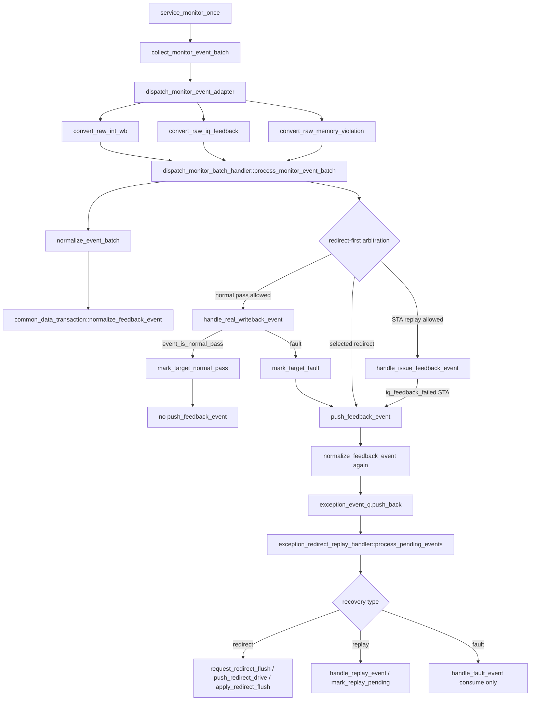

# push_feedback_event Writeback 后续总览

本文是 writeback 之后 normal pass / redirect / replay / fault 四类 flow 的总览和索引。具体场景不在本文混写长流程，而是分别维护在独立文档中：

- [normal_pass_flow.md](normal_pass_flow.md)：真实 writeback normal pass，直接落 status，不进入 `push_feedback_event()`。
- [redirect_flow.md](redirect_flow.md)：`memoryViolation` redirect 进入 `push_feedback_event()` 后的 flush/reissue。
- [replay_flow.md](replay_flow.md)：STA IQ feedback replay 进入 `push_feedback_event()` 后的 replay pending/route/issue。
- [fault_exception_flow.md](fault_exception_flow.md)：真实 writeback fault 先 `mark_target_fault()`，再入队由 `handle_fault_event()` 消费。

## 1. 总览 Flow 图



## 1.1 函数调用 Flow 图整体文字伪代码

```text
push_feedback_event Writeback 后续总览：

1. monitor event 统一转换：
   service_monitor_once 调用 collect_monitor_event_batch；
   adapter 分别把 raw int writeback、raw IQ feedback、raw memoryViolation 转成 memblock_wb_event_t；
   batch handler 对同一 service cycle 的事件做 normalize 和 redirect-first 仲裁。

2. normal pass 分支：
   如果事件是真实 writeback normal pass 且未被 redirect 覆盖，调用 handle_real_writeback_event；
   mark_target_normal_pass 直接更新 status；
   normal pass 不进入 push_feedback_event，因为它不需要跨 cycle recovery。

3. recovery 分支：
   如果事件是 selected redirect、STA replay 或 fault，才调用 push_feedback_event；
   push_feedback_event 调用 normalize_feedback_event，保证 event 能解析到当前 active uid；
   normalize 成功后写入 exception_event_q。

4. recovery queue 消费：
   process_pending_events 是 exception_event_q 的统一消费者；
   redirect 优先级最高，会建立 active_redirect 并驱动 io_redirect；
   replay 在无 redirect 抢占时 mark_replay_pending 并等待 route/issue 重发；
   fault 在 mark_target_fault 后只由 handle_fault_event 消费，不重复落 fault 状态。
```


## 2. 场景边界

源码位置：涉及以下文件：

- `mem_ut/ver/ut/memblock/seq/base_seq_help/dispatch_monitor_event_adapter.sv`
- `mem_ut/ver/ut/memblock/seq/base_seq_help/dispatch_monitor_batch_handler.sv`
- `mem_ut/ver/ut/memblock/seq/base_seq_help/writeback_status_handler.sv`
- `mem_ut/ver/ut/memblock/seq/base_seq_help/common_data_transaction.sv`
- `mem_ut/ver/ut/memblock/seq/base_seq_help/exception_redirect_replay_handler.sv`

真实逻辑摘要：

```systemverilog
// normal pass: no recovery queue
if (event_is_normal_pass(wb_event)) begin
    data.mark_target_normal_pass(...);
    return 1'b1;
end

// fault: mark first, then queue recovery event
if (event_has_fault(wb_event)) begin
    data.mark_target_fault(...);
    data.push_feedback_event(wb_event);
    return 1'b1;
end

// replay: STA IQ feedback failed
if (wb_event.iq_feedback_failed && wb_event.target != MEMBLOCK_ISSUE_TARGET_STD) begin
    data.push_feedback_event(wb_event);
    return 1'b1;
end

// redirect: selected by batch redirect-first arbitration
data.push_feedback_event(selected_redirect_event);
```

功能解释：

`push_feedback_event()` 不是 writeback 后所有事件的统一入口，而是 recovery 类事件入口。normal pass 直接更新状态；redirect/replay/fault 需要跨队列、跨 cycle 处理，所以进入 `exception_event_q`。

输入/输出：

- 输入：redirect、replay、fault 语义的 `memblock_wb_event_t`。
- 输出：normalize 成功后写入 `common_data_transaction::exception_event_q`。
- 非输入：normal pass 不调用 `push_feedback_event()`。

文字伪代码：

```text
adapter 把 raw monitor fact 转换为 memblock_wb_event_t；
batch handler 先 normalize，再做 active redirect 和同批 redirect-first 仲裁；
如果事件是 normal pass：
  进入 normal_pass_flow.md；
  调用 mark_target_normal_pass；
  不进入 push_feedback_event；
如果事件是 selected redirect：
  进入 redirect_flow.md；
  调用 push_feedback_event 后由 process_pending_events 建立 active redirect；
如果事件是 STA replay：
  进入 replay_flow.md；
  调用 push_feedback_event 后由 process_pending_events/handle_replay_event 设置 replay pending；
如果事件是 fault：
  进入 fault_exception_flow.md；
  先调用 mark_target_fault 落表，再调用 push_feedback_event；
  后续 handle_fault_event 只消费，不重复 mark。
```

内部子调用：

- `normalize_event_batch()`：batch handler 的第一道规范化，解析 uid 和 event 快照。
- `push_feedback_event()`：recovery queue 入队前的第二道规范化。
- `process_pending_events()`：`exception_event_q` 的唯一消费者。

## 3. `push_feedback_event()` 共同骨架

源码位置：`mem_ut/ver/ut/memblock/seq/base_seq_help/common_data_transaction.sv`

真实逻辑摘要：

```systemverilog
function void push_feedback_event(input memblock_wb_event_t wb_event);
    memblock_wb_event_t normalized_event;

    if (!normalize_feedback_event(wb_event, normalized_event)) begin
        return;
    end
    exception_event_q.push_back(normalized_event);
endfunction
```

功能解释：

该函数只做两件事：先把 event 规范化，再把规范化后的 event 放入 `exception_event_q`。它不决定 redirect/replay/fault 具体怎么恢复，具体恢复由 `process_pending_events()` 根据事件类型处理。

输入/输出：

- 输入：`wb_event`。
- 输出：`exception_event_q.push_back(normalized_event)`。

文字伪代码：

```text
调用 normalize_feedback_event：解析 active uid、补齐 ROB/issue_epoch/replay_seq，并过滤 stale event；
如果 normalize 失败，直接返回，不入队；
如果 normalize 成功，把 normalized_event push_back 到 exception_event_q；
等待 exception_redirect_replay_handler::process_pending_events 消费。
```

内部子调用：

- `normalize_feedback_event()`：入队前防御，保证队列中 event 能定位到当前 active uid。
- `exception_event_q.push_back()`：保存 recovery event。

## 4. `normalize_feedback_event()` 共同骨架

源码位置：`mem_ut/ver/ut/memblock/seq/base_seq_help/common_data_transaction.sv`

真实逻辑摘要：

```systemverilog
if (!normalized_event.valid || !feedback_event_has_action(normalized_event)) return 1'b0;
if (normalized_event.redirect.valid && !normalized_event.has_rob) begin
    normalized_event.rob_key = normalized_event.redirect.rob_key;
    normalized_event.has_rob = 1'b1;
end
if (!resolve_uid_for_event(normalized_event, uid)) return 1'b0;
status = get_status(uid);
normalized_event.uid = uid;
normalized_event.has_uid = 1'b1;
...
if (!normalized_event.has_replay_seq) begin
    normalized_event.replay_seq = status.replay_seq;
    normalized_event.has_replay_seq = 1'b1;
end
```

功能解释：

这是 `push_feedback_event()` 后续能正确处理的前提。redirect 允许 `target=NONE`，但必须能通过 ROB 找到 active uid；replay/fault 必须是合法 LOAD/STA/STD target，并带有或能补齐 issue/replay 快照。

文字伪代码：

```text
调用 feedback_event_has_action：确认 event 至少有 redirect/replay/fault/real writeback/IQ feedback 语义；
如果是 redirect 且缺 ROB key，从 redirect.rob_key 补齐；
调用 resolve_uid_for_event：通过 uid/ROB/LQ/SQ 反查 active uid，并检查多 key 一致；
补齐 uid/has_uid；
如果不是 redirect：
  调用 feedback_event_target_is_valid：要求 target 为 LOAD/STA/STD；
  replay 后如果缺 issue_epoch/replay_seq snapshot，drop，避免旧 event 被补成新 replay 轮次；
  缺 issue_epoch 时，先确认 target_dispatched，再从 status 获取 target issue epoch；
缺 replay_seq 时，从 status.replay_seq 补齐；
返回 normalized_event。
```

内部子调用：

- `feedback_event_has_action()`：判断 event 是否值得处理。
- `resolve_uid_for_event()`：通过 active ROB/LQ/SQ map 反查 uid。
- `feedback_event_target_is_valid()`：检查非 redirect target 合法性。
- `target_dispatched()`：缺 issue epoch 时的补齐前提。

## 5. `process_pending_events()` 共同消费骨架

源码位置：`mem_ut/ver/ut/memblock/seq/base_seq_help/exception_redirect_replay_handler.sv`

真实逻辑摘要：

```systemverilog
service_ptw_wait_replay();
advance_active_redirect();
if (data.active_redirect.valid) return;

while (data.pop_feedback_event(wb_event)) begin
    events.push_back(wb_event);
end

if (select_oldest_redirect(events, redirect_event)) begin
    data.request_redirect_flush(redirect);
    data.push_redirect_drive(redirect);
end

if (data.active_redirect.valid) begin
    requeue_events_not_flushed_by_redirect(events, data.active_redirect);
    return;
end

foreach (events[idx]) begin
    if (event_is_replay(events[idx])) handle_replay_event(events[idx]);
    else if (event_is_fault(events[idx])) handle_fault_event(events[idx]);
end
```

功能解释：

这是 `push_feedback_event()` 入队后的共同消费者。redirect 优先级最高；如果 recovery queue 中存在 redirect，replay/fault 可能被 drop 或 requeue。只有没有 active redirect 且当前 recovery events 中没有 redirect 时，replay/fault 才被消费。注意：同一 monitor batch 中未被 redirect 覆盖的 non-redirect event 是由 batch handler 直接继续处理，不走这里的 requeue 规则。

文字伪代码：

```text
调用 service_ptw_wait_replay：释放 ready/timeout 的 PTW wait replay；
调用 advance_active_redirect：推进已有 active redirect，必要时 apply flush；
如果 active_redirect 仍有效，返回，不处理新队列；
调用 pop_feedback_event：把 exception_event_q 全部弹到本地 events；
调用 select_oldest_redirect：如果存在 redirect，先处理 ROB 最老 redirect；
如果建立 active_redirect：
  调用 requeue_events_not_flushed_by_redirect：覆盖事件 drop，未覆盖事件回队列；
  返回；
如果没有 redirect：
  replay 调用 handle_replay_event；
  fault 调用 handle_fault_event；
normal pass 不在 exception_event_q，所以不会到这里。
```

内部子调用：

- `service_ptw_wait_replay()`：PTW-back replay 延迟释放。
- `advance_active_redirect()`：redirect drive done 后 apply flush。
- `pop_feedback_event()`：从 `exception_event_q` 出队。
- `select_oldest_redirect()`：redirect-first recovery 仲裁。
- `handle_replay_event()`：replay pending/等待 PTW。
- `handle_fault_event()`：fault event 消费，不重复 mark。

## 6. 端到端行为总结

```text
normal pass：
  real writeback exception_vec=0
  -> process_monitor_event_batch
  -> handle_real_writeback_event
  -> mark_target_normal_pass
  -> 不调用 push_feedback_event
  -> 详见 normal_pass_flow.md

redirect：
  memoryViolation
  -> process_monitor_event_batch selected oldest redirect
  -> push_feedback_event
  -> exception_event_q
  -> process_pending_events
  -> request_redirect_flush / push_redirect_drive / apply_redirect_flush / reissue
  -> 详见 redirect_flow.md

replay：
  STA IQ feedback miss
  -> handle_issue_feedback_event
  -> push_feedback_event
  -> exception_event_q
  -> process_pending_events
  -> handle_replay_event
  -> push_ptw_wait_replay 或 mark_replay_pending
  -> route/issue
  -> 详见 replay_flow.md

fault：
  real writeback exception_vec!=0
  -> handle_real_writeback_event
  -> mark_target_fault
  -> push_feedback_event
  -> exception_event_q
  -> process_pending_events
  -> handle_fault_event 只消费，不重复 mark
  -> 详见 fault_exception_flow.md
```

端到端文字伪代码描述：

```text
normal pass：
  如果事件是真实 writeback 且无 redirect/replay/fault，batch handler 放行后直接进入 handle_real_writeback_event；
  handle_real_writeback_event 调用 mark_target_normal_pass 更新 target/uid pass 状态；
  该事件不进入 push_feedback_event，因为它不需要 recovery queue 后续处理。

redirect：
  如果 batch 中存在 memoryViolation redirect，batch handler 先选 oldest redirect；
  selected redirect 通过 push_feedback_event 进入 exception_event_q；
  process_pending_events 负责建立 active_redirect、驱动 redirect、flush 被覆盖 uid 并触发 reissue；
  被 redirect 覆盖的同批 pass/fault/replay 不允许落状态。

replay：
  如果 STA IQ feedback miss 未被 redirect 覆盖，handle_issue_feedback_event 将其作为 replay event 入队；
  process_pending_events 在没有 redirect 抢占时调用 handle_replay_event；
  replay 根据 ptw_back_replay 选择等待 PTW 或直接 mark_replay_pending；
  mark_replay_pending 只设置需要重发的 target，后续由 route/issue 重新发射。

fault：
  如果真实 writeback 带 exception_vec，handle_real_writeback_event 先 mark_target_fault；
  fault 状态落表后再 push_feedback_event，供 recovery queue 统一消费；
  handle_fault_event 只做消费和调试上下文解析，不重复写 fault 状态。
```
