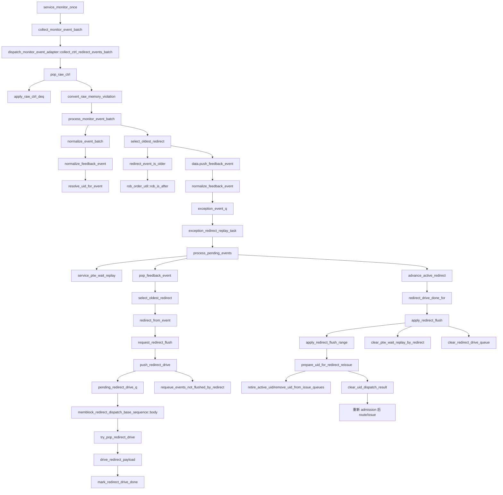

# Redirect Flow

本文按通用 flow 文档规则整理 mem_ut 中 writeback 之后 redirect 的完整后续。当前真实 DUT 来源是 `io_mem_to_ooo_ctrl.memoryViolation` 被 raw ctrl monitor 采集后转成 `memblock_wb_event_t.redirect`。redirect 进入 `push_feedback_event()` 后，必须继续追到 `process_pending_events -> request_redirect_flush -> push_redirect_drive -> redirect sequence drive -> advance_active_redirect -> apply_redirect_flush -> reissue`。

## 1. 函数调用 Flow 图



## 1.1 函数调用 Flow 图整体文字伪代码

```text
Redirect 主流程：

1. ctrl output monitor 采集：
   service_monitor_once 调用 collect_monitor_event_batch；
   collect_ctrl_redirect_events_batch 从 raw ctrl queue 出队；
   apply_raw_ctrl_deq 先处理 sbIsEmpty 和 LQ/SQ deq；
   convert_raw_memory_violation 将 memoryViolation 转成 redirect 语义 memblock_wb_event_t。

2. batch 级 redirect-first 仲裁：
   process_monitor_event_batch normalize 整批事件；
   select_oldest_redirect 选择同批最老 redirect；
   selected redirect 调用 push_feedback_event 入 exception_event_q；
   同批被该 redirect 覆盖的 pass/fault/replay 直接 drop，未覆盖事件继续处理或回队列。

3. recovery queue 建立 active redirect：
   process_pending_events 先 service_ptw_wait_replay，再 advance_active_redirect；
   如果当前没有 active redirect，则 pop_feedback_event 得到本轮 recovery events；
   select_oldest_redirect 再次确认 queue 内 redirect 优先级；
   request_redirect_flush 建立 active_redirect/flush_in_progress/issue_freeze_ack；
   push_redirect_drive 将 payload 写入 pending_redirect_drive_q，等待 redirect sequence drive。

4. redirect drive 和 flush 应用：
   memblock_redirect_dispatch_base_sequence 从 pending_redirect_drive_q 取 payload，drive io_redirect；
   drive 完成后 mark_redirect_drive_done；
   下一轮 process_pending_events 的 advance_active_redirect 看到 drive done，调用 apply_redirect_flush；
   apply_redirect_flush_range 扫描 active uid，prepare_uid_for_redirect_reissue 清旧状态并回滚 admission 边界；
   flush 结束后清 redirect queue/state，后续 LSQ admission/route/issue 重新发射被 flush 的 uid。
```


## 2. `collect_ctrl_redirect_events_batch()` / `convert_raw_memory_violation()`

源码位置：`mem_ut/ver/ut/memblock/seq/base_seq_help/dispatch_monitor_event_adapter.sv`

真实逻辑摘要：

```systemverilog
while (memblock_sync_pkg::pop_raw_ctrl(raw_ctrl)) begin
    apply_raw_ctrl_deq(raw_ctrl);
    if (convert_raw_memory_violation(raw_ctrl, wb_event)) begin
        events.push_back(wb_event);
    end
end

wb_event.source = MEMBLOCK_WB_EVENT_SOURCE_MEMORY_VIOLATION;
wb_event.target = MEMBLOCK_ISSUE_TARGET_NONE;
wb_event.redirect_valid = 1'b1;
wb_event.redirect.valid = 1'b1;
wb_event.redirect.flush_itself = raw.memory_violation_level;
wb_event.redirect.level = raw.memory_violation_level;
wb_event.has_rob = raw_rob_to_key(..., wb_event.rob_key);
wb_event.redirect.rob_key = wb_event.rob_key;
```

功能解释：

raw ctrl monitor 采集到 memoryViolation 后，adapter 把它转换成 redirect 语义 event。这里不直接 drive redirect，也不直接 flush status；只是把事件放进 batch，后续由 batch handler 做 redirect-first 仲裁。

输入/输出：

- 输入：`dispatch_raw_ctrl_t raw_ctrl`。
- 输出：redirect `memblock_wb_event_t` 进入当前 batch。

文字伪代码：

```text
循环 pop_raw_ctrl：读取 DUT ctrl output monitor 采集的 raw ctrl；
调用 apply_raw_ctrl_deq：先更新 SB empty，并把 LQ/SQ deq 交给 commit handler 释放映射；
调用 convert_raw_memory_violation：如果 memory_violation_valid=0，返回 false；
如果 valid，创建 wb_event，source 设 MEMORY_VIOLATION，target 设 NONE；
设置 redirect_valid 和 redirect.valid；
把 memory_violation_level 写入 flush_itself/level；
调用 raw_rob_to_key：把 memoryViolation ROB 指针转为 rob_key；
把 rob_key 复制到 redirect.rob_key；
把 redirect event push 到 batch events。
```

内部子调用：

- `apply_raw_ctrl_deq()`：更新 `sb_is_empty`，并调用 `monitor_commit_handler.apply_raw_ctrl_deq()` 处理 DUT LQ/SQ deq。
- `raw_rob_to_key()`：转换 ROB flag/value。
- `make_wb_event_base()`：创建空 event。

## 3. `process_monitor_event_batch()` redirect-first 仲裁

源码位置：`mem_ut/ver/ut/memblock/seq/base_seq_help/dispatch_monitor_batch_handler.sv`

真实逻辑摘要：

```systemverilog
if (!normalize_event_batch(events, normalized_events)) return;

if (select_oldest_redirect(normalized_events, selected_redirect_event)) begin
    selected_redirect = redirect_from_event(selected_redirect_event);
    data.push_feedback_event(selected_redirect_event);
    foreach (normalized_events[idx]) begin
        if (same_redirect_event(...)) continue;
        if (event_covered_by_redirect(normalized_events[idx], selected_redirect)) continue;
        if (event_is_redirect(normalized_events[idx])) data.push_feedback_event(normalized_events[idx]);
        else void'(process_allowed_non_redirect_event(normalized_events[idx]));
    end
    return;
}
```

功能解释：

batch handler 保证 redirect 优先于同批 normal pass/fault/replay。选中 oldest redirect 后，被它覆盖的 writeback/replay/fault 不落状态；未覆盖 non-redirect event 会在同一轮继续处理，未覆盖的其它 redirect 会继续进入 recovery queue。selected redirect 自身通过 `push_feedback_event()` 进入 recovery queue。

输入/输出：

- 输入：本拍所有 normalized events。
- 输出：selected redirect 入 `exception_event_q`；同批覆盖事件 drop；同批未覆盖 non-redirect 直接继续处理；同批未覆盖 redirect 继续入 `exception_event_q`。

文字伪代码：

```text
调用 normalize_event_batch：对所有 event 调用 normalize_feedback_event，解析 active uid 和 ROB key；
调用 select_oldest_redirect：遍历 normalized_events，用 event_is_redirect 过滤 redirect；
select_oldest_redirect 内部调用 redirect_event_is_older：ROB 相同按 port_id 稳定排序，否则调用 rob_order_util::rob_is_after 判断谁更老；
如果选中 oldest redirect：
  调用 redirect_from_event 取 redirect payload；
  调用 data.push_feedback_event：把 selected redirect 放入 recovery queue；
  遍历同 batch 其它 event：
    调用 same_redirect_event：跳过 selected redirect 自身；
    调用 event_covered_by_redirect：用 rob_need_flush 判断 event 是否被 redirect 覆盖，覆盖则 drop；
    未覆盖 redirect 继续 push_feedback_event；
    未覆盖 non-redirect 调用 process_allowed_non_redirect_event。
```

内部子调用：

- `normalize_event_batch()`：调用 `data.normalize_feedback_event()`。
- `select_oldest_redirect()`：选择同批最老 redirect。
- `event_covered_by_redirect()`：调用 `rob_order_util::rob_need_flush()`。
- `data.push_feedback_event()`：redirect 入 recovery queue。

## 4. `push_feedback_event()` 到 `exception_event_q`

源码位置：`mem_ut/ver/ut/memblock/seq/base_seq_help/common_data_transaction.sv:1112`

真实逻辑摘要：

```systemverilog
if (!normalize_feedback_event(wb_event, normalized_event)) begin
    return;
end
exception_event_q.push_back(normalized_event);
```

功能解释：

redirect 在 batch handler 中已经 normalize 过，但入队时仍会再次 normalize，作为防御。成功后放入 `exception_event_q`，等待 `process_pending_events()` 消费。

输入/输出：

- 输入：selected redirect event。
- 输出：`exception_event_q` 新增 normalized redirect event。

文字伪代码：

```text
调用 normalize_feedback_event：如果 redirect 缺 has_rob，则从 redirect.rob_key 补；
调用 resolve_uid_for_event：用 ROB key 反查 active uid；
补齐 uid/has_uid/replay_seq；
redirect 不要求 LOAD/STA/STD target，也不补 issue_epoch；
normalize 成功后 push_back 到 exception_event_q。
```

内部子调用：

- `normalize_feedback_event()`：redirect 入队前二次规范化。
- `resolve_uid_for_event()`：通过 active ROB map 反查 uid。

## 5. `process_pending_events()` redirect 消费

源码位置：`mem_ut/ver/ut/memblock/seq/base_seq_help/exception_redirect_replay_handler.sv`

真实逻辑摘要：

```systemverilog
service_ptw_wait_replay();
advance_active_redirect();
if (data.active_redirect.valid) return;
while (data.pop_feedback_event(wb_event)) events.push_back(wb_event);

if (select_oldest_redirect(events, redirect_event)) begin
    redirect = redirect_from_event(redirect_event);
    if (seq_csr_common::is_initialized() && !seq_csr_common::get_redirect_seq_en()) fatal;
    if (!data.active_redirect.valid) begin
        data.request_redirect_flush(redirect);
        data.push_redirect_drive(redirect);
    end
end
if (data.active_redirect.valid) begin
    requeue_events_not_flushed_by_redirect(events, data.active_redirect);
    return;
end
```

功能解释：

这是 redirect queue 的消费点。它再次做 oldest redirect 选择，因为 `exception_event_q` 可能累积多个 batch 的 redirect/replay/fault。选中 redirect 后建立 active redirect，驱动 redirect sequence，并把 recovery queue 中未被 flush 覆盖的 event 放回队列。这里的 requeue 只发生在 `exception_event_q` 消费阶段，不代表 batch handler 对同批未覆盖 non-redirect event 也会 requeue。

输入/输出：

- 输入：`exception_event_q`。
- 输出：active redirect 状态、redirect drive queue、事件 requeue/drop。

文字伪代码：

```text
调用 service_ptw_wait_replay：active redirect 存在时暂停 PTW wait replay，避免先置 replay_pending 再被 flush；
调用 advance_active_redirect：如果已有 active redirect，检查 drive 是否 done，done 后 apply flush；
如果 active_redirect 仍存在，返回，不处理新队列；
循环调用 pop_feedback_event：把 exception_event_q 当前内容全部弹到本地 events；
调用 select_oldest_redirect：在 events 中选 ROB 最老 redirect；
如果有 redirect：
  调用 redirect_from_event 获取 payload；
  检查 get_redirect_seq_en，未开启则 fatal；
  调用 request_redirect_flush：建立 active_redirect、flush_in_progress、issue_freeze_ack、dispatch_flush_epoch；
  调用 push_redirect_drive：把 payload 放入 pending_redirect_drive_q 给 redirect sequence；
如果 active_redirect 建立：
  调用 requeue_events_not_flushed_by_redirect：当前 redirect 覆盖的 event drop，未覆盖的 event push_front 回 exception_event_q；
  返回，等待后续 advance_active_redirect apply flush。
```

内部子调用：

- `service_ptw_wait_replay()`：redirect 单飞期间暂停 replay 释放。
- `advance_active_redirect()`：已有 redirect 的推进点。
- `pop_feedback_event()`：从 `exception_event_q` 出队。
- `request_redirect_flush()`：建立 redirect/freeze 状态。
- `push_redirect_drive()`：给 redirect sequence 的 pending queue。
- `requeue_events_not_flushed_by_redirect()`：保持未覆盖 event。

## 6. `request_redirect_flush()` / `push_redirect_drive()`

源码位置：`mem_ut/ver/ut/memblock/seq/base_seq_help/common_data_transaction.sv`

真实逻辑摘要：

```systemverilog
// request_redirect_flush 关键行为
active_redirect = redirect;
flush_in_progress = 1'b1;
memblock_sync_pkg::dispatch_flush_in_progress = 1'b1;
issue_freeze_ack = 1'b1;
redirect_phase = MEMBLOCK_REDIRECT_PHASE_DETECTED;

// push_redirect_drive 关键行为
pending_redirect_drive_q.push_back(redirect);
```

功能解释：

`request_redirect_flush()` 是测试框架内部建立“当前有 redirect 正在恢复”的锁；`push_redirect_drive()` 只把 redirect payload 放入 `pending_redirect_drive_q`。真正的 inflight 置位和 drive done 记录发生在 redirect sequence 的 `try_pop_redirect_drive()` / `mark_redirect_drive_done()` 中。两者配合，先冻结 route/issue，再把 payload 排队给 redirect sequence 驱动 DUT redirect input。

输入/输出：

- 输入：`memblock_redirect_payload_t redirect`。
- 输出：`request_redirect_flush()` 更新 active redirect / freeze 状态；`push_redirect_drive()` 只更新 pending drive queue。

文字伪代码：

```text
request_redirect_flush：
  检查 redirect.valid；
  记录 active_redirect；
  设置 flush_in_progress 和 dispatch_flush_in_progress，阻止 route/issue 继续发旧动态实例；
  设置 issue_freeze_ack，表示 issue 侧应冻结；
  记录 redirect_freeze_cycle 和 phase；

push_redirect_drive：
  检查 redirect.valid；
  把 redirect payload push 到 pending_redirect_drive_q；
  不设置 redirect_drive_inflight，也不设置 redirect_phase；
  等待 redirect sequence 调用 try_pop_redirect_drive 取走 payload。
```

内部子调用：

- `pending_redirect_drive_q.push_back()`：redirect sequence 后续从该队列取 payload。
- `memblock_sync_pkg::dispatch_flush_in_progress`：跨 sequence 的全局 freeze 标志。

## 7. `memblock_redirect_dispatch_base_sequence` drive 链路

源码位置：涉及以下文件：

- `mem_ut/ver/ut/memblock/seq/base_seq/memblock_redirect_dispatch_base_sequence.sv`
- `mem_ut/ver/ut/memblock/seq/base_seq_help/common_data_transaction.sv`

真实逻辑摘要：

```systemverilog
if (data.try_pop_redirect_drive(payload)) begin
    drive_redirect_payload(payload);
end else begin
    drive_idle_once(...);
    if (drive_timeout != 0 && data.active_redirect.valid &&
        !data.redirect_drive_done_for(data.active_redirect)) fatal;
end

// try_pop_redirect_drive
if (pending_redirect_drive_q.size() == 0 || redirect_drive_inflight) return 1'b0;
payload = pending_redirect_drive_q.pop_front();
redirect_drive_inflight_payload = payload;
redirect_drive_inflight = 1'b1;

// drive_redirect_payload
assign_redirect_xaction(tr, payload);
start_item(tr);
finish_item(tr);
data.mark_redirect_drive_done(payload);
```

功能解释：

redirect payload 入 `pending_redirect_drive_q` 后，真正的 DUT input drive 由 `memblock_redirect_dispatch_base_sequence` 完成。它每拍尝试 `try_pop_redirect_drive()`；成功后生成 redirect xaction、驱动 agent，并在 drive 完成后调用 `mark_redirect_drive_done()`。`advance_active_redirect()` 看到 drive done 后才允许 apply flush。

输入/输出：

- 输入：`pending_redirect_drive_q` 中的 redirect payload。
- 输出：redirect agent xaction；`redirect_drive_inflight` / `redirect_drive_done_epoch` / `redirect_drive_done_cycle` 更新。

文字伪代码：

```text
redirect sequence body 初始化 seq_csr_common 和配置；
如果 redirect sequence disable，只 drive idle 并返回；
循环执行：
  调用 try_pop_redirect_drive：如果 pending queue 非空且当前没有 inflight，则 pop 一个 payload；
  try_pop_redirect_drive 内部设置 redirect_drive_inflight_payload 和 redirect_drive_inflight=1；
  如果 pop 成功，调用 drive_redirect_payload；
  drive_redirect_payload 创建 redirect xaction，调用 assign_redirect_xaction 填 DUT input 字段；
  调用 start_item/finish_item 把 xaction 发给 redirect driver；
  调用 mark_redirect_drive_done：清 inflight，递增 redirect_drive_done_epoch，记录 redirect_drive_done_cycle；
  如果 payload 等于 active_redirect，mark_redirect_drive_done 设置 redirect_phase=REDIRECT_DRIVEN；
  如果没有 payload，drive_idle_once；
  如果 idle 超过 redirect_drive_timeout 且 active_redirect 还未 done，fatal。
```

内部子调用：

- `try_pop_redirect_drive()`：从 `pending_redirect_drive_q` 出队并置 inflight。
- `drive_redirect_payload()`：把 payload 转成 redirect agent xaction 并 drive。
- `assign_redirect_xaction()`：填 `io_redirect_*` 字段。
- `mark_redirect_drive_done()`：记录 drive 完成，是 `redirect_drive_done_for()` 后续返回 true 的前提。
- `redirect_drive_done_for()`：被 timeout 检查和 `advance_active_redirect()` 使用。

## 8. `advance_active_redirect()` / `apply_redirect_flush()`

源码位置：涉及以下文件：

- `mem_ut/ver/ut/memblock/seq/base_seq_help/exception_redirect_replay_handler.sv`
- `mem_ut/ver/ut/memblock/seq/base_seq_help/common_data_transaction.sv`

真实逻辑摘要：

```systemverilog
if (data.redirect_drive_done_for(redirect)) begin
    data.apply_redirect_flush(redirect);
end else if (timeout) fatal;

apply_redirect_flush_range(redirect);
clear_ptw_wait_replay_by_redirect(redirect);
clear_redirect_drive_queue();
flush_in_progress = 1'b0;
dispatch_flush_in_progress = 1'b0;
issue_freeze_ack = 1'b0;
active_redirect = '{default:'0};
redirect_phase = IDLE;
```

功能解释：

`advance_active_redirect()` 每拍检查 redirect drive 是否完成。完成后 `apply_redirect_flush()` 才真正修改 common data 状态：flush 被 redirect 覆盖的 uid、清 PTW wait replay、清 drive 状态、解除 freeze。

输入/输出：

- 输入：`data.active_redirect`。
- 输出：被覆盖 uid 准备 reissue，redirect 状态清空。

文字伪代码：

```text
advance_active_redirect：
  如果没有 active_redirect，直接返回；
  调用 redirect_drive_done_for：检查 pending_redirect_drive_q/inflight 已清，drive done epoch 有效，phase 已到 REDIRECT_DRIVEN，且当前 cycle 大于 drive done cycle；
  如果 drive done，调用 apply_redirect_flush；
  如果超过 redirect_freeze_timeout 仍未完成，fatal；

apply_redirect_flush：
  调用 apply_redirect_flush_range：扫描 active uid 窗口，找出被 redirect 覆盖的 uid 并准备 reissue；
  调用 clear_ptw_wait_replay_by_redirect：删除被 redirect 覆盖的 PTW wait replay；
  调用 clear_redirect_drive_queue：清 pending/inflight/done 状态；
  清 flush_in_progress、dispatch_flush_in_progress、issue_freeze_ack 和 active_redirect；
  redirect_phase 回到 IDLE。
```

内部子调用：

- `redirect_drive_done_for()`：确认 redirect sequence 已完成 drive，且不是同拍立即 apply。
- `apply_redirect_flush_range()`：真正扫描 uid 并 flush。
- `clear_ptw_wait_replay_by_redirect()`：避免 flush 后释放旧 replay。
- `clear_redirect_drive_queue()`：结束本次 redirect drive 状态。

## 9. `apply_redirect_flush_range()` / `prepare_uid_for_redirect_reissue()`

源码位置：`mem_ut/ver/ut/memblock/seq/base_seq_help/common_data_transaction.sv`

真实逻辑摘要：

```systemverilog
advance_terminal_done_uid();
begin_uid = get_active_scan_begin_uid();
end_uid = get_active_scan_end_uid();
for (uid = begin_uid; uid < end_uid; uid++) begin
    status = get_status(uid);
    if (status.terminal_done || (!status.active && !status.writeback && !status.pass)) continue;
    if (rob_order_util::rob_need_flush(status.get_rob_key(), redirect)) begin
        prepare_uid_for_redirect_reissue(uid, redirect);
    end
end
if (found_flushed) rollback_max_enqueued_uid(oldest_flushed_uid);

// prepare_uid_for_redirect_reissue
if (status.active) retire_active_uid(uid);
else remove_uid_from_issue_queues(uid);
if (had_lq_mapping) pending_lq_cancel_count += main_tr.numLsElem;
if (had_sq_mapping) pending_sq_cancel_count += main_tr.numLsElem;
clear_uid_dispatch_result(uid);
status.redirect_pending = 1'b1;
status.flushed = 1'b1;
status.dynamic_epoch++;
status.active = 1'b0;
```

功能解释：

这是 redirect flush 真正影响 transaction 的位置。被 redirect 覆盖的 uid 会被清掉 active map/issue queue/status 完成痕迹，记录 pending cancel，并设置 `redirect_pending/flushed`。之后 LSQ admission 会从回滚后的 uid 重新 admission，route/issue 再重发。

输入/输出：

- 输入：active redirect payload。
- 输出：被覆盖 uid 清理并准备重新 admission；admission 高水位回滚。

文字伪代码：

```text
apply_redirect_flush_range：
  调用 advance_terminal_done_uid：跳过已经 terminal_done 的 uid 前缀，缩小扫描范围；
  调用 get_active_scan_begin_uid/get_active_scan_end_uid：确定当前已 admission 活跃窗口；
  遍历窗口内 uid：
    调用 get_status；
    terminal_done uid 跳过；非 active 且无 writeback/pass 的 uid 跳过；
    调用 status.get_rob_key 和 rob_order_util::rob_need_flush：判断该 uid 是否被 redirect 覆盖；
    覆盖则记录最小 flushed uid，并调用 prepare_uid_for_redirect_reissue；
  如果找到 flushed uid，调用 rollback_max_enqueued_uid(oldest_flushed_uid)：回退 admission 边界；

prepare_uid_for_redirect_reissue：
  检查 redirect.valid；
  如果 status.terminal_done，fatal，禁止 flush 已完成 uid；
  读取 main transaction，记录旧 LQ/SQ mapping 是否存在；
  如果 status.active，调用 retire_active_uid：删除 active ROB/LQ/SQ map 并 remove_uid_from_issue_queues；
  如果不 active，直接调用 remove_uid_from_issue_queues；
  根据旧 LQ/SQ mapping 累加 pending_lq_cancel_count/pending_sq_cancel_count；
  调用 clear_uid_dispatch_result：清 enq/queued/dispatched/writeback/pass/fault/replay 等动态结果；
  设置 redirect_pending=1、flushed=1、dynamic_epoch++、active=0、success=0；
  等待后续重新 admission/route/issue。
```

内部子调用：

- `advance_terminal_done_uid()`：推进已 terminal_done uid 前缀。
- `rob_order_util::rob_need_flush()`：按照 ROB flag/value 和 redirect payload 判断是否 flush。
- `retire_active_uid()`：删除 active ROB/LQ/SQ map，并清 issue queue。
- `remove_uid_from_issue_queues()`：清 load/sta/std issue queue 中该 uid 的旧项。
- `clear_uid_dispatch_result()`：清动态执行结果，保留主表静态配置。
- `rollback_max_enqueued_uid()`：让 LSQ admission 从最老 flushed uid 重新开始。

## 10. reissue 后续

源码位置：涉及以下文件：

- `mem_ut/ver/ut/memblock/seq/base_seq_help/common_data_transaction.sv`
- `mem_ut/ver/ut/memblock/seq/base_seq_help/issue_queue_scheduler.sv`
- `mem_ut/ver/ut/memblock/seq/base_seq/memblock_lsqenq_dispatch_base_sequence.sv`

功能解释：

redirect flush 本身不会立刻把 uid 塞回 issue queue，而是把 uid 状态改成可重新 admission 的形态，并回滚 admission 边界。后续 LSQ enqueue sequence 重新入队同 uid，`set_status_field(ENQ)` 会清掉 `redirect_pending/flushed/issue_killed`，再由 issue route 重新发射。

文字伪代码：

```text
LSQ admission 看到 max_enqueued_uid 已回滚，从 oldest_flushed_uid 重新尝试入队；
调用 activate_uid / set_status_field(ENQ)：重新建立 active ROB/LQ/SQ map；
set_status_field(ENQ) 如果发现 redirect_pending 或 flushed，会清 redirect_pending、flushed、issue_killed；
issue_queue_scheduler::route_all_ready_uids 扫描 active window；
route_uid 根据主表 behavior 重新 route LOAD/STA/STD；
route_target 生成 issue item 并 push_issue_queue_item；
后续 issue scheduler drive 到 DUT，进入新动态实例。
```

## 11. 端到端行为总结

```text
memoryViolation redirect：
  raw ctrl memoryViolation
  -> collect_ctrl_redirect_events_batch
  -> apply_raw_ctrl_deq 更新 SB/LQ/SQ deq
  -> convert_raw_memory_violation 生成 redirect wb_event
  -> process_monitor_event_batch
  -> normalize_event_batch / normalize_feedback_event / resolve_uid_for_event
  -> select_oldest_redirect
  -> data.push_feedback_event
  -> normalize_feedback_event 二次规范化
  -> exception_event_q
  -> process_pending_events
  -> pop_feedback_event
  -> select_oldest_redirect
  -> request_redirect_flush 建立 active_redirect/freeze
  -> push_redirect_drive 放入 pending_redirect_drive_q
  -> memblock_redirect_dispatch_base_sequence::body
  -> try_pop_redirect_drive 设置 redirect_drive_inflight
  -> drive_redirect_payload 驱动 redirect agent
  -> mark_redirect_drive_done 清 inflight 并记录 done epoch/cycle
  -> requeue_events_not_flushed_by_redirect 保留 recovery queue 中未覆盖 event
  -> advance_active_redirect 等 drive done
  -> redirect_drive_done_for 返回 true
  -> apply_redirect_flush
  -> apply_redirect_flush_range / prepare_uid_for_redirect_reissue
  -> rollback_max_enqueued_uid
  -> LSQ admission 重新入队
  -> route_all_issue_queues 重新 route/issue

redirect 覆盖同批 normal pass/fault/replay：
  同 batch 选出 oldest redirect
  -> event_covered_by_redirect 调用 rob_need_flush
  -> 被覆盖 event drop
  -> 不落 normal pass/fault/replay 状态

recovery queue 中 redirect 未覆盖 event：
  process_pending_events 建立 active redirect
  -> requeue_events_not_flushed_by_redirect
  -> 未覆盖 event push_front 回 exception_event_q
  -> 当前 redirect 完成后下一拍继续处理

同 batch 中 redirect 未覆盖 non-redirect event：
  process_monitor_event_batch 选出 oldest redirect
  -> event_covered_by_redirect 返回 false
  -> process_allowed_non_redirect_event
  -> 按 normal pass / replay / fault 场景继续处理
```

端到端文字伪代码描述：

```text
memoryViolation redirect：
  当 ctrl monitor 采到 memoryViolation 时，adapter 先处理同一个 raw ctrl 中的 LQ/SQ deq 和 SB empty；
  如果 memoryViolation valid，则 convert_raw_memory_violation 生成 target=NONE 的 redirect wb_event；
  batch handler normalize 后选择同批 oldest redirect，selected redirect 通过 push_feedback_event 进入 exception_event_q；
  process_pending_events 从 exception_event_q 中再次选 oldest redirect，建立 active_redirect 和全局 freeze；
  request_redirect_flush 记录 active_redirect、dispatch_flush_epoch、issue_freeze_ack，阻止旧动态实例继续 route/issue；
  push_redirect_drive 把 redirect payload 放进 pending_redirect_drive_q，等待 redirect sequence 驱动 DUT input；
  redirect sequence drive 完成后 mark_redirect_drive_done 记录 done epoch/cycle；
  下一拍 advance_active_redirect 看到 drive done，调用 apply_redirect_flush；
  apply_redirect_flush_range 扫描 active uid 窗口，命中 flush 范围的 uid 调用 prepare_uid_for_redirect_reissue；
  prepare_uid_for_redirect_reissue 清 active map、issue queue、动态完成状态，并设置 redirect_pending/flushed/dynamic_epoch；
  rollback_max_enqueued_uid 回滚 admission 边界，后续 LSQ admission 重新入队并 route/issue。

redirect 覆盖同批 normal pass/fault/replay：
  batch handler 先选 oldest redirect，而不是先让 pass/fault/replay 落状态；
  对同批其它 event 调用 event_covered_by_redirect；
  如果 event 被 redirect 覆盖，说明它属于将被 flush 的旧动态实例，直接 drop；
  drop 后不会写 pass/fault/replay 状态，也不会创建 replay pending。

recovery queue 中 redirect 未覆盖 event：
  process_pending_events 建立 active_redirect 后，会把本轮从 exception_event_q 弹出的其它 event 重新分类；
  被 active_redirect 覆盖的 event 直接 drop；
  未覆盖 event push_front 回 exception_event_q，等当前 redirect drive/apply flush 完成后再处理；
  这样保证同一时间只有一个 active redirect 推进，同时不丢失不在 flush 范围内的 recovery event。

同 batch 中 redirect 未覆盖 non-redirect event：
  batch handler 发现 event 不被 selected redirect 覆盖时，不需要 requeue；
  non-redirect event 直接进入 process_allowed_non_redirect_event；
  后续按 normal pass、replay 或 fault 各自场景继续处理。
```
