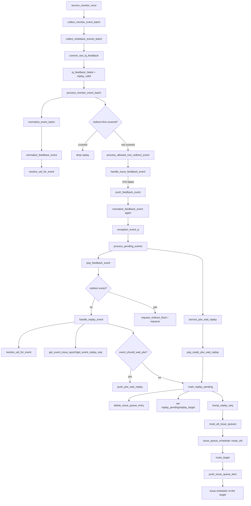

# Replay Flow

本文按通用 flow 文档规则整理 mem_ut 中 writeback/IQ feedback 后 replay 进入 `push_feedback_event()` 后的完整处理。当前真实后端 replay 来源主要是 STA IQ feedback miss；STD miss 当前 warning/drop，不建立 backend replay。

## 1. 函数调用 Flow 图



## 1.1 函数调用 Flow 图整体文字伪代码

```text
Replay 主流程：

1. IQ feedback 转 replay event：
   service_monitor_once 调用 collect_monitor_event_batch；
   collect_writeback_events_batch 从 raw IQ feedback queue 出队；
   convert_raw_iq_feedback 将 STA miss 转成 replay_valid event；
   STD miss 当前 warning/drop，不建立 backend replay。

2. batch 仲裁和入队：
   process_monitor_event_batch 先 normalize 整批 event；
   如果 active redirect 或同批 oldest redirect 覆盖该 replay，drop；
   未覆盖时进入 handle_issue_feedback_event；
   handle_issue_feedback_event 对 STA failed 调用 push_feedback_event；
   push_feedback_event 再次 normalize 后写入 exception_event_q。

3. replay 消费：
   process_pending_events 先处理 PTW wait replay 和 active redirect；
   如果没有 redirect 抢占，则 pop_feedback_event 取 replay；
   handle_replay_event 解析 uid、issue_epoch、replay_seq；
   如果 ptw_back_replay 需要等待 PTW，push_ptw_wait_replay 暂存；
   否则 mark_replay_pending 清对应 target 旧 issue 项，设置 replay_pending/replay_target，并 bump replay_seq。

4. replay 重新发射：
   后续 service_real_dispatch_flow 调用 route_all_issue_queues；
   issue_queue_scheduler::route_uid 只允许 replay_target 对应 target 重新入队；
   route_target 生成新的 issue item 并 push_issue_queue_item；
   lintsissue sequence 后续重新发射该 target。
```


## 2. `convert_raw_iq_feedback()`

源码位置：`mem_ut/ver/ut/memblock/seq/base_seq_help/dispatch_monitor_event_adapter.sv`

真实逻辑摘要：

```systemverilog
if (raw.is_sta) begin
    wb_event.target = MEMBLOCK_ISSUE_TARGET_STA;
    wb_event.source = MEMBLOCK_WB_EVENT_SOURCE_STA_FEEDBACK;
end else begin
    wb_event.target = MEMBLOCK_ISSUE_TARGET_STD;
    wb_event.source = MEMBLOCK_WB_EVENT_SOURCE_STD_FEEDBACK;
end
if (raw.is_std && !raw.hit) begin
    `uvm_warning(... "no backend STD replay feedback path")
    return 1'b0;
end
wb_event.iq_feedback_valid = 1'b1;
wb_event.iq_feedback_hit = raw.hit;
wb_event.iq_feedback_failed = !raw.hit;
wb_event.iq_feedback_flush_state = raw.flush_state;
wb_event.replay_valid = raw.is_sta && !raw.hit;
wb_event.ptw_back_replay = raw.is_sta && !raw.hit && raw.flush_state;
```

功能解释：

IQ feedback 是 IssueQueue response，不是真实 RF/ROB writeback。STA miss 会转换成 replay event；如果 `flush_state` 为 1，则同时标记 `ptw_back_replay`，后续可选择等待 PTW/TLB ready 再 replay。

输入/输出：

- 输入：`dispatch_raw_iq_feedback_t raw`。
- 输出：STA miss replay event 进入 batch；STD miss drop。

文字伪代码：

```text
创建空 wb_event；
如果 raw.valid=0，返回 false；
如果 vector_feedback=1，当前 scalar flow 不支持，drop；
根据 raw.is_sta/raw.is_std 设置 target 和 source；
如果是 STD miss，warning/drop，因为当前 MemBlock 没有 backend STD replay feedback path；
调用 raw_rob_to_key/raw_lq_to_key/raw_sq_to_key 填 key；
设置 iq_feedback_valid=1；
设置 iq_feedback_hit=raw.hit，iq_feedback_failed=!raw.hit；
如果是 STA miss，设置 replay_valid=1；
如果是 STA miss 且 flush_state=1，设置 ptw_back_replay=1；
返回 true，进入 batch handler。
```

内部子调用：

- `raw_rob_to_key()` / `raw_lq_to_key()` / `raw_sq_to_key()`：生成后续 uid 反查 key。
- `make_wb_event_base()`：创建空 event。

## 3. `handle_issue_feedback_event()`

源码位置：`mem_ut/ver/ut/memblock/seq/base_seq_help/writeback_status_handler.sv:136`

真实逻辑摘要：

```systemverilog
if (!event_is_issue_feedback(wb_event)) return 1'b0;
uid = wb_event.uid;
issue_epoch = wb_event.issue_epoch;
replay_seq = wb_event.replay_seq;
if (wb_event.iq_feedback_failed) begin
    if (wb_event.target == MEMBLOCK_ISSUE_TARGET_STD) return 1'b0;
    data.push_feedback_event(wb_event);
    return 1'b1;
end
if (wb_event.iq_feedback_hit) begin
    if (target_real_wb_pass_enabled(wb_event.target))
        data.mark_issue_feedback_success(...);
    else
        data.mark_target_normal_pass(...);
end
```

功能解释：

该函数负责 IQ feedback，不负责真实 writeback。replay 路径只在 `iq_feedback_failed` 且 target 不是 STD 时调用 `push_feedback_event()`。hit 路径不会进入 replay queue。

输入/输出：

- 输入：batch 放行的 IQ feedback event。
- 输出：STA failed 入 `exception_event_q`；hit 更新 issue feedback success 或兼容 pass。

文字伪代码：

```text
调用 event_is_issue_feedback：确认这是 IQ feedback；
取 uid/issue_epoch/replay_seq；
如果 iq_feedback_failed：
  如果 target 是 STD，warning/drop，不建立 replay；
  否则调用 data.push_feedback_event：STA replay 进入 recovery queue；
  返回 1；
如果 iq_feedback_hit：
  调用 target_real_wb_pass_enabled：判断 STA/STD 是否等待真实 writeback pass；
  如果开启，调用 mark_issue_feedback_success：只记录 issue feedback success，不置 pass；
  如果关闭，调用 mark_target_normal_pass：兼容模式下把 feedback hit 当 pass；
返回处理结果。
```

内部子调用：

- `target_real_wb_pass_enabled()`：读取 `seq_csr_common` 中 STA/STD real writeback pass 开关。
- `data.push_feedback_event()`：STA replay 入队。
- `data.mark_issue_feedback_success()`：hit 成功但等待真实 writeback 的记录。
- `data.mark_target_normal_pass()`：兼容 pass 路径。

## 4. `push_feedback_event()` / `normalize_feedback_event()`

源码位置：`mem_ut/ver/ut/memblock/seq/base_seq_help/common_data_transaction.sv`

真实逻辑摘要：

```systemverilog
if (!normalize_feedback_event(wb_event, normalized_event)) return;
exception_event_q.push_back(normalized_event);

if (status.replay_seq != 0 && missing issue_epoch/replay_seq snapshot for non-STD) begin
    normalized_event = make_empty_wb_event();
    return 1'b0;
end
```

功能解释：

STA replay 入队前必须能解析 uid，并携带正确 issue_epoch/replay_seq。replay 之后如果旧 event 缺 snapshot，会被 drop，避免旧 replay/pass 污染新 replay 轮次。

输入/输出：

- 输入：STA IQ feedback miss event。
- 输出：normalized replay event 入 `exception_event_q`。

文字伪代码：

```text
push_feedback_event 调用 normalize_feedback_event；
normalize_feedback_event 调用 resolve_uid_for_event：通过 ROB/SQ 等 active map 找到 uid；
非 redirect target 必须是 LOAD/STA/STD；
如果 status.replay_seq != 0 且该非 STD event 缺 issue_epoch/replay_seq，warning/drop；
如果缺 issue_epoch，必须 target_dispatched 后才能从 status 补齐；
如果缺 replay_seq，从 status.replay_seq 补齐；
normalize 成功后 push_back 到 exception_event_q。
```

内部子调用：

- `resolve_uid_for_event()`：active uid 反查。
- `target_dispatched()`：缺 issue_epoch 的补齐前提。
- `exception_event_q.push_back()`：replay 等待 recovery handler 消费。

## 5. `process_pending_events()` replay 分支

源码位置：`mem_ut/ver/ut/memblock/seq/base_seq_help/exception_redirect_replay_handler.sv`

真实逻辑摘要：

```systemverilog
service_ptw_wait_replay();
advance_active_redirect();
if (data.active_redirect.valid) return;
while (data.pop_feedback_event(wb_event)) events.push_back(wb_event);
if (select_oldest_redirect(events, redirect_event)) begin
    request_redirect_flush(...);
    push_redirect_drive(...);
end
if (data.active_redirect.valid) begin
    requeue_events_not_flushed_by_redirect(events, data.active_redirect);
    return;
end
foreach (events[idx]) begin
    if (event_is_replay(events[idx])) handle_replay_event(events[idx]);
end
```

功能解释：

replay 不是队列最高优先级。batch handler 先处理同批 redirect 覆盖：同批被 redirect 覆盖的 replay 会 drop，未覆盖 replay 才允许进入 `push_feedback_event()`。进入 `exception_event_q` 之后，如果队列中又有 redirect，redirect 会先建立 active redirect；被该 redirect 覆盖的 replay 会 drop，未覆盖 replay 会 requeue。只有当前 recovery batch 没有 redirect 时 replay 才进入 `handle_replay_event()`。

输入/输出：

- 输入：`exception_event_q` 中的 replay event。
- 输出：PTW wait replay 或 replay pending。

文字伪代码：

```text
调用 service_ptw_wait_replay：处理之前因 PTW back 等待的 replay；
调用 advance_active_redirect：先推进 active redirect；
如果 active_redirect 有效，暂停处理 replay；
pop exception_event_q 到本地 events；
调用 select_oldest_redirect：如果 recovery events 中有 redirect，redirect 优先；
如果 redirect 建立，调用 requeue_events_not_flushed_by_redirect：覆盖 replay drop，未覆盖 replay push_front 回 exception_event_q；
如果没有 redirect，遍历 events：
  event_is_replay 为真则调用 handle_replay_event。
```

内部子调用：

- `service_ptw_wait_replay()`：释放 PTW wait replay。
- `select_oldest_redirect()`：保证 redirect 优先级。
- `requeue_events_not_flushed_by_redirect()`：redirect 期间 replay 的保留/drop。
- `handle_replay_event()`：真正设置 replay pending 或 PTW wait。

## 6. `handle_replay_event()`

源码位置：`mem_ut/ver/ut/memblock/seq/base_seq_help/exception_redirect_replay_handler.sv:104`

真实逻辑摘要：

```systemverilog
if (!data.resolve_uid_for_event(wb_event, uid)) return;
issue_epoch = data.get_event_issue_epoch(wb_event, uid);
replay_seq  = data.get_event_replay_seq(wb_event, uid);
if (event_should_wait_ptw(wb_event)) begin
    data.push_ptw_wait_replay(uid, wb_event.target, issue_epoch, replay_seq, get_dispatch_service_cycle());
    return;
end
void'(data.mark_replay_pending(uid, wb_event.target, issue_epoch, replay_seq, wb_event.cycle));
```

功能解释：

这是 replay event 的消费函数。它重新解析 uid 和快照，决定是否先进入 PTW wait 队列，或者直接置 `replay_pending`。它不直接发射，只把状态改成可被 issue route 重新入队的形态。

输入/输出：

- 输入：normalized replay event。
- 输出：`ptw_wait_replay_q` 或 status replay pending。

文字伪代码：

```text
调用 resolve_uid_for_event：确认 replay event 仍映射到 active uid；
调用 get_event_issue_epoch：优先用 event.issue_epoch，缺失时从 status target issue epoch 补；
调用 get_event_replay_seq：优先用 event.replay_seq，缺失时从 status.replay_seq 补；
调用 event_should_wait_ptw：检查 seq_csr_common::get_replay_wait_ptw_en 和 wb_event.ptw_back_replay；
如果需要等 PTW：
  调用 push_ptw_wait_replay：把 uid/target/issue_epoch/replay_seq/入队 cycle 放入 PTW wait replay 队列，并去重；
  返回，不置 replay_pending；
否则：
  调用 mark_replay_pending：清旧发射状态，设置 replay_pending/replay_target，并 bump replay_seq。
```

内部子调用：

- `resolve_uid_for_event()`：过滤无法定位或已失效 uid。
- `get_event_issue_epoch()` / `get_event_replay_seq()`：读取 event 快照或 status 当前值。
- `event_should_wait_ptw()`：决定是否走 PTW wait。
- `push_ptw_wait_replay()`：延迟 replay。
- `mark_replay_pending()`：设置 replay 状态。

## 7. `service_ptw_wait_replay()`

源码位置：`mem_ut/ver/ut/memblock/seq/base_seq_help/exception_redirect_replay_handler.sv`

真实逻辑摘要：

```systemverilog
if (data.active_redirect.valid) return;
while (data.pop_ready_ptw_wait_replay(seq_csr_common::get_replay_wait_ptw_timeout(), wait_item, timed_out)) begin
    if (timed_out) `uvm_warning(...);
    void'(data.mark_replay_pending(wait_item.uid, wait_item.target,
                                   wait_item.issue_epoch, wait_item.replay_seq,
                                   get_dispatch_service_cycle()));
end
```

功能解释：

PTW-back replay 可以先等待 TLB entry ready，避免过早重发。active redirect 存在时暂停释放，避免 replay pending 立刻又被 redirect flush 清掉。

输入/输出：

- 输入：`ptw_wait_replay_q`。
- 输出：ready/timeout 的 wait item 转成 `mark_replay_pending()`。

文字伪代码：

```text
如果 active_redirect 有效，直接返回，暂停 PTW wait replay；
调用 seq_csr_common::get_replay_wait_ptw_timeout 获取最大等待周期；
循环调用 pop_ready_ptw_wait_replay(timeout)：检查 TLB 是否 ready 或是否超时；
如果 timeout，打印 warning，但仍释放 replay；
对弹出的 wait item 调用 mark_replay_pending，进入正常 replay pending 流程。
```

内部子调用：

- `pop_ready_ptw_wait_replay()`：判断 TLB ready 或超时。
- `mark_replay_pending()`：释放后置 replay pending。

## 8. `mark_replay_pending()`

源码位置：`mem_ut/ver/ut/memblock/seq/base_seq_help/common_data_transaction.sv:648`

真实逻辑摘要：

```systemverilog
case (target)
    LOAD, STA: ;
    STD: warning; return 1'b0;
endcase
if (!status.active || status.issue_killed || !target_dispatched(status, target) ||
    status.get_target_issue_epoch(target) != issue_epoch ||
    !target_replay_seq_match(status, target, replay_seq)) return 1'b0;

delete_issue_queue_entry(target, uid, 0, 1'b0);
status.replay_pending = 1'b1;
status.writeback = 1'b0;
status.pass = 1'b0;
status.success = 1'b0;
case (target)
    LOAD: clear load dispatched/writeback/pass/fault; replay_target_load=1;
    STA:  clear sta dispatched/writeback/pass/fault; replay_target_sta=1;
endcase
bump_replay_seq(uid);
```

功能解释：

该函数把一个已发射 target 改成需要重发。它只支持 LOAD/STA，STD replay 当前不支持。它清掉该 target 旧结果，设置 replay target mask，并 bump `replay_seq`，让旧 event 失配。

输入/输出：

- 输入：uid、target、issue_epoch、replay_seq、cycle。
- 输出：status replay pending，目标 target 等待重新 route。

文字伪代码：

```text
检查 target：LOAD/STA 允许，STD warning/drop；
读取 status；
检查 status.active、未 issue_killed、target_dispatched；
检查 status.get_target_issue_epoch 和 target_replay_seq_match，过滤旧 replay event；
调用 delete_issue_queue_entry：清掉该 target 旧队列项，避免残留项先发；
设置 replay_pending=1，清 uid 总体 writeback/pass/success；
如果 target 是 LOAD：清 load_dispatched/load_writeback/load_pass/load_fault，设置 replay_target_load=1；
如果 target 是 STA：清 sta_dispatched/sta_writeback/sta_pass/sta_fault，设置 replay_target_sta=1；
调用 bump_replay_seq：进入新的 replay 轮次；
返回成功。
```

内部子调用：

- `target_dispatched()`：确认 replay 发生在已发射 target 上。
- `target_replay_seq_match()`：确认 event 属于当前 replay 轮次。
- `delete_issue_queue_entry()`：删除旧队列项。
- `bump_replay_seq()`：递增 replay_seq，过滤旧反馈。

## 9. replay 后 route/issue

源码位置：`mem_ut/ver/ut/memblock/seq/base_seq_help/issue_queue_scheduler.sv`

真实逻辑摘要：

```systemverilog
if (status.replay_pending && !data.replay_target_requested(status, target)) return;
data.delete_issue_queue_entry(target, uid, status.replay_seq, 1'b0);
item = make_issue_item(uid, target, behavior);
data.push_issue_queue_item(item);
set_target_queued(uid, target, 1'b1);
```

功能解释：

`mark_replay_pending()` 不直接 drive DUT。下一轮 `route_all_issue_queues()` 会扫描 active window。对于 replay pending uid，只允许 replay_target 对应 target 重新入 queue；非 replay target 不会被重复发射。

输入/输出：

- 输入：status 中的 `replay_pending/replay_target_*`。
- 输出：新的 issue queue item，等待 issue scheduler 发射。

文字伪代码：

```text
service_real_dispatch_flow 每拍调用 route_all_issue_queues；
issue_queue_scheduler::route_all_ready_uids 扫描 active uid；
route_uid 调用 is_uid_route_ready：replay_pending uid 只要 active/enq/issue_ready 且无 redirect/exception，就可 route；
route_target 先调用 target_already_queued_or_done：已排队或已完成则跳过；
如果 replay_pending 且 replay_target_requested(status,target)=false，跳过非 replay target；
调用 delete_issue_queue_entry：清同 target 同 replay_seq 旧项；
调用 make_issue_item：用当前 status.replay_seq 生成新 issue item；
调用 push_issue_queue_item：放入 load/sta/std issue queue；
set_target_queued 置 queued_*；
issue scheduler 后续发射成功后调用 clear_replay_target_after_fire 清 target mask，mask 全空则 replay_pending=0。
```

内部子调用：

- `is_uid_route_ready()`：允许 replay pending uid 重新 route。
- `replay_target_requested()`：只 route replay 目标。
- `make_issue_item()`：生成带当前 replay_seq 的 issue item。
- `clear_replay_target_after_fire()`：发射后清 replay target。

## 10. 端到端行为总结

```text
STA IQ feedback replay：
  raw IQ feedback is_sta=1 hit=0
  -> convert_raw_iq_feedback
  -> iq_feedback_failed=1 replay_valid=1
  -> process_monitor_event_batch
  -> normalize_event_batch / normalize_feedback_event / resolve_uid_for_event
  -> redirect-first 仲裁确认未被 redirect 覆盖
  -> process_allowed_non_redirect_event
  -> handle_issue_feedback_event
  -> push_feedback_event
  -> normalize_feedback_event 二次规范化
  -> exception_event_q
  -> process_pending_events
  -> 如果 recovery queue 中有 redirect：replay 被覆盖则 drop，未覆盖则 requeue
  -> 如果无 redirect：handle_replay_event
  -> event_should_wait_ptw=false：mark_replay_pending
  -> route_all_issue_queues / route_target
  -> push_issue_queue_item
  -> issue scheduler 重新发射 LOAD/STA target

PTW-back replay：
  STA IQ feedback miss flush_state=1
  -> convert_raw_iq_feedback(ptw_back_replay=1)
  -> push_feedback_event
  -> process_pending_events
  -> handle_replay_event
  -> event_should_wait_ptw=true
  -> push_ptw_wait_replay
  -> 后续 service_ptw_wait_replay 检查 TLB ready 或 timeout
  -> mark_replay_pending
  -> route/issue 重发

STD IQ feedback miss：
  raw IQ feedback is_std=1 hit=0
  -> convert_raw_iq_feedback
  -> warning/drop: no backend STD replay feedback path
  -> 不进入 push_feedback_event
```

端到端文字伪代码描述：

```text
STA IQ feedback replay：
  当 IQ feedback monitor 采到 STA hit=0 时，adapter 把它转换成 iq_feedback_failed/replay_valid 的 wb_event；
  batch handler normalize 并检查 redirect 覆盖，只有未被覆盖的 STA replay 才能继续；
  handle_issue_feedback_event 识别 iq_feedback_failed 且 target 不是 STD，调用 push_feedback_event 入 recovery queue；
  process_pending_events 如果没有更高优先级 redirect，调用 handle_replay_event；
  handle_replay_event 重新解析 uid、issue_epoch、replay_seq，确认 replay event 仍属于当前 active 实例；
  如果不需要等待 PTW，mark_replay_pending 清该 target 的 dispatched/writeback/pass/fault/queued 状态；
  mark_replay_pending 设置 replay_pending 和 replay_target_sta，并 bump replay_seq 过滤旧反馈；
  下一轮 route_all_issue_queues 只允许 replay_target 对应 target 重新入 issue queue；
  issue scheduler 重新发射成功后清 replay target mask，后续等待新的 writeback/feedback。

PTW-back replay：
  当 STA miss 同时带 flush_state 时，adapter 额外设置 ptw_back_replay；
  handle_replay_event 看到 event_should_wait_ptw 为真，不立即 mark_replay_pending；
  push_ptw_wait_replay 把 uid/target/epoch/seq 放入 ptw_wait_replay_q；
  service_ptw_wait_replay 在没有 active redirect 时检查 TLB ready 或 timeout；
  ready/timeout 后再调用 mark_replay_pending，把 replay 转入正常 route/issue 流程。

STD IQ feedback miss：
  当 adapter 看到 STD hit=0 时直接 warning/drop；
  当前测试框架不把 STD miss 建成 backend replay，因为 DUT 没有对应的 backend STD replay feedback path；
  drop 后不会进入 push_feedback_event，也不会设置 replay_pending。
```
