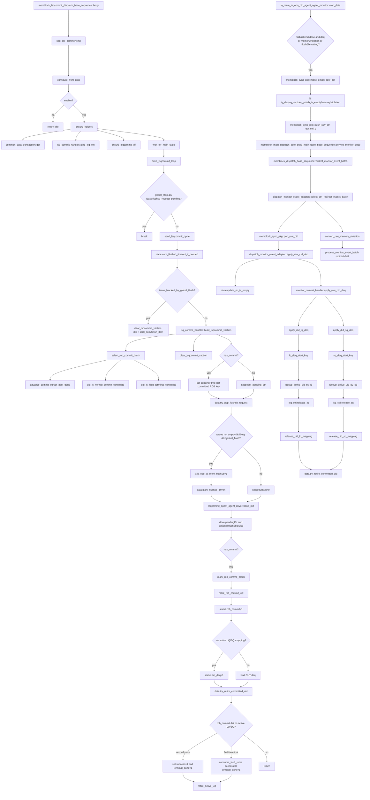

# ROB Commit 与 LQ/SQ Deq Flow

本文整理 mem_ut/memblock 中 ROB commit pendingPtr 驱动和 DUT LQ/SQ deq 采样回收的真实函数调用链。这个 flow 有两条入口：

- `memblock_lsqcommit_dispatch_base_sequence` 周期性选择已 writeback/pass 的连续 uid，驱动 `io_ooo_to_mem_lsqio_pendingPtr_*`，并在软件状态中标记 `rob_commit`。
- `io_mem_to_ooo_ctrl_agent_agent_monitor` 采样 DUT `lqDeq/sqDeq/*DeqPtr/sbIsEmpty`，写入 `memblock_sync_pkg::raw_ctrl_q`，随后由 service loop drain，释放 `uid_by_lq/uid_by_sq` active map，并触发 `try_retire_committed_uid()`。

`flushSb` 在本 flow 中共享 `lsqcommit` driver 和 ctrl monitor 的 `sbIsEmpty` 采样。当前实现是队列式请求：`memblock_lsqcommit_dispatch_base_sequence` 先构造普通 commit xaction，再在同一个 xaction 上可选附加 `io_ooo_to_mem_flushSb=1`。完整 directed 测试流程见 `flushsb_test_flow.md`。

## 1. 函数调用 Flow 图



### 1.1 函数调用 Flow 图整体文字伪代码

```text
ROB commit 主流程：

1. lsqcommit sequence 启动
body:
  初始化 seq_csr_common；
  configure_from_plus 读取 MEMBLOCK_LSQCOMMIT_SEQ_EN 和 no_progress_warn_cycles；
  如果 enable=0，sequence 打印 info 后 idle 返回；
  ensure_helpers 获取 common_data_transaction，创建 lsq_commit_handler，绑定 lsq_ctrl_model，并取得 lsqcommit vif；
  wait_for_main_table 等 data.main_table_ready。

2. 每拍 pendingPtr/flushSb 驱动
drive_lsqcommit_loop:
  如果 global_stop_requested 且 data.flushsb_request_pending() 为 false，退出循环；
  否则调用 send_lsqcommit_cycle；
  has_commit 或 data.flushsb_busy() 表示本拍仍有普通 commit 或 flushSb active work，用于清 idle 计数；
  长时间没有 commit 且没有 active flushSb work 时只 warning，不退出。

send_lsqcommit_cycle:
  先调用 warn_flushsb_timeout_if_needed；timeout 只 warning，不 fatal；
  如果 redirect/global flush 正在阻塞 issue，驱动 idle xaction 并返回，不 pop flushSb 队列；
  调用 build_lsqcommit_xaction 选择连续 commit uid batch，并构造 pendingPtr；
  调用 try_pop_flushsb_request；如果队列非空、没有 active waiting、global flush 未阻塞，则 pop 一个请求；
  pop 成功时在同一个 lsqcommit xaction 上设置 io_ooo_to_mem_flushSb=1，并调用 mark_flushsb_driven；
  driver::send_pkt 把 pendingPtr_flag/value 和可选 flushSb pulse 发到 DUT；
  如果 has_commit，mark_rob_commit_batch 在软件状态中逐个标记 rob_commit。

3. commit batch 选择和状态更新
select_rob_commit_batch:
  advance_commit_cursor_past_done 跳过已 terminal_done 的 uid；
  从 commit_cursor_uid 开始按 uid 顺序扫描；
  normal candidate 必须满足 active、writeback、pass、required_targets_done、未 rob_commit、无 fault/exception/replay/redirect/flushed/issue_killed；
  fault terminal candidate 必须满足 active、未 rob_commit、无 replay/redirect/flushed/issue_killed，并且已有 writeback 或 target fault 落表；
  normal candidate 可以连续加入 batch，最多 MEMBLOCK_COMMIT_WIDTH 个；
  如果最老 uid 是 fault terminal candidate，把该 uid 加入 batch 后立即停止，保证 fault frontier 不被更年轻 uid 越过；
  遇到第一个既不是 normal 也不是 fault terminal 的 uid 即停止，保证 ROB 顺序；
  最多选择 MEMBLOCK_COMMIT_WIDTH 个 uid。

build_lsqcommit_xaction:
  clear_lsqcommit_xaction 默认沿用 last_pending_ptr，flushSb=0；
  如果选到 commit uid，把最后一个 uid 的 ROB key 写入 pendingPtr，并更新 last_pending_ptr；
  如果没有 commit，pendingPtr 保持上一次值。

mark_rob_commit_uid:
  如果 global flush 正在进行或 uid 不再满足 candidate，info 记录后跳过；
  设置 status.rob_commit=1；
  如果该 uid 没有 active_lq_mapped 且没有 active_sq_mapped，直接设置 status.lsq_deq=1；
  调用 try_retire_committed_uid；
  advance_commit_cursor_past_done 让 cursor 越过新 terminal_done 前缀。

4. DUT LQ/SQ deq monitor 回收
io_mem_to_ooo_ctrl_agent_agent_monitor::mon_data:
  每拍采样 lqDeq/sqDeq/deqPtr/memoryViolation/sbIsEmpty；
  只有 reset/backend done 且 deq 非零、memoryViolation valid 或 dispatch_flushsb_waiting_empty 为 1 时构造 raw_ctrl；
  push_raw_ctrl 把 raw_ctrl 写入 memblock_sync_pkg::raw_ctrl_q。

service_monitor_once:
  collect_monitor_event_batch 先 collect_writeback_events_batch，再 collect_ctrl_redirect_events_batch；
  collect_ctrl_redirect_events_batch 循环 pop_raw_ctrl；
  对每个 raw_ctrl 先 apply_raw_ctrl_deq，后 convert_raw_memory_violation；
  因此同一个 raw_ctrl 中的 LQ/SQ deq 和 sbIsEmpty 会先更新，memoryViolation redirect 再进入 batch handler 的 redirect-first 仲裁。

apply_raw_ctrl_deq:
  update_sb_is_empty 记录 sbIsEmpty，并在 flushSb waiting_empty 且 sb_is_empty=1 时解除 waiting；
  如果 lq_deq/sq_deq 都为 0，直接返回；
  把 raw ptr 转为 key 后调用 lsq_commit_handler.apply_raw_ctrl_deq。

apply_dut_lq_deq / apply_dut_sq_deq:
  如果 count=0 返回；
  如果 DUT ptr 表示 next 指针，先 rewind count 得到本批 deq 起点；
  起点必须等于软件 lsq_ctrl 的 deq_ptr，否则按 MEMBLOCK_LSQ_RESYNC_ON_MISMATCH warning 或 fatal；
  对每个 deq slot 用 active LQ/SQ map 查 uid，查不到也是 mismatch；
  所有 slot 都能解析后，release_lq/release_sq 推进软件 deq_ptr 和 free_count；
  对每个 uid 释放对应 active map，并调用 try_retire_committed_uid。

5. retire 收敛
try_retire_committed_uid:
  如果 uid inactive 或未 rob_commit，返回；
  如果仍有 active_lq_mapped 或 active_sq_mapped，返回；
  如果 active_redirect 覆盖该 uid，prepare_uid_for_redirect_reissue 后返回；
  如果 uid 是 fault/exception/target fault，调用 consume_fault_retire：设置 success=0、terminal_done=1，并 retire active uid；
  如果 uid 仍有 replay/redirect/flushed/issue_killed 中间态，返回；
  normal pass 要求 pass=1 且 required_targets_done=1；
  normal pass 成功时设置 success=1、terminal_done=1，并 retire active uid；
  retire_active_uid 删除 active ROB map 和剩余 LQ/SQ map，status.active=0。
```

## 2. `memblock_lsqcommit_dispatch_base_sequence::body()`

源码位置：`mem_ut/ver/ut/memblock/seq/base_seq/memblock_lsqcommit_dispatch_base_sequence.sv`

真实逻辑摘要：

```systemverilog
task memblock_lsqcommit_dispatch_base_sequence::body();
    seq_csr_common::init();
    configure_from_plus();
    if (!enable) begin
        `uvm_info(get_type_name(), "MEMBLOCK_LSQCOMMIT_SEQ_EN=0, LSQ commit dispatch sequence stays idle", UVM_LOW)
        return;
    end
    ensure_helpers();
    wait_for_main_table();
    drive_lsqcommit_loop();
endtask:body
```

功能解释：

这是 ROB commit pendingPtr 驱动 sequence 的真实入口。它不创建主表，也不处理 DUT deq；它只等主表 ready 后持续驱动 `lsqcommit_agent`。

输入/输出：

- 输入：plus/cfg 中的 `MEMBLOCK_LSQCOMMIT_SEQ_EN`、`MEMBLOCK_ACTIVE_SEQ_NO_PROGRESS_WARN_CYCLES`。
- 输出：开启时进入 `drive_lsqcommit_loop()`；关闭时不驱动 pendingPtr/flushSb。

文字伪代码：

```text
初始化 seq_csr_common；
读取 lsqcommit enable 和 no-progress warning 周期；
如果 enable=0：
  打印 info 并返回；
创建/绑定 helper；
等待 common data 主表 ready；
进入每拍 commit 驱动循环。
```

内部子调用：

- `configure_from_plus()`：读取 sequence enable 和 no-progress warning cycle。
- `ensure_helpers()`：取得 common data，创建 commit handler，绑定 `lsq_ctrl_model`，取得 vif。
- `wait_for_main_table()`：轮询 `data.main_table_ready`，期间按配置打印 warning。
- `drive_lsqcommit_loop()`：周期性调用 `send_lsqcommit_cycle()`。

## 3. `ensure_helpers()` / `configure_from_plus()`

源码位置：`mem_ut/ver/ut/memblock/seq/base_seq/memblock_lsqcommit_dispatch_base_sequence.sv`

真实逻辑摘要：

```systemverilog
function void memblock_lsqcommit_dispatch_base_sequence::configure_from_plus();
    enable = seq_csr_common::get_lsqcommit_seq_en();
    no_progress_warn_cycles = seq_csr_common::get_active_seq_no_progress_warn_cycles();
endfunction

function void memblock_lsqcommit_dispatch_base_sequence::ensure_helpers();
    data = common_data_transaction::get();
    if (commit_handler == null) begin
        commit_handler = lsq_commit_handler::type_id::create("commit_handler");
    end
    commit_handler.bind_lsq_ctrl(lsq_ctrl_model::get());
    ensure_lsqcommit_vif();
endfunction
```

功能解释：

`configure_from_plus()` 决定本 sequence 是否运行。`ensure_helpers()` 把 commit handler 绑定到全局 `common_data_transaction` 和 `lsq_ctrl_model`；flushSb 请求由公共队列 producer 产生。

输入/输出：

- 输入：`seq_csr_common` getter。
- 输出：`enable/no_progress_warn_cycles` 本地字段，`commit_handler.lsq_ctrl` 绑定。

文字伪代码：

```text
configure_from_plus：
  读取 MEMBLOCK_LSQCOMMIT_SEQ_EN；
  读取 no-progress warning 周期。

ensure_helpers：
  获取 common_data_transaction 单例；
  如果 commit_handler 为空则创建；
  绑定 lsq_ctrl_model 单例，供 deq release 时维护软件 LQ/SQ 指针；
  获取 lsqcommit virtual interface；
  不创建 flushSb 请求；flushSb 新请求来自 flushsb_req_q。
```

内部子调用：

- `lsq_commit_handler::bind_lsq_ctrl()`：保存软件 LSQ mirror，后续 `release_lq/release_sq` 依赖它。
- `ensure_lsqcommit_vif()`：获取 LSQ commit driver 使用的 virtual interface。

## 4. `drive_lsqcommit_loop()`

源码位置：`mem_ut/ver/ut/memblock/seq/base_seq/memblock_lsqcommit_dispatch_base_sequence.sv`

真实逻辑摘要：

```systemverilog
forever begin
    bit has_progress;

    if (data.is_global_stop_requested() &&
        !data.flushsb_request_pending()) begin
        break;
    end

    send_lsqcommit_cycle(cycle_idx, has_progress);
    cycle_idx++;
    if (has_progress) begin
        idle_count = 0;
    end else begin
        idle_count++;
        if (no_progress_warn_cycles != 0 &&
            idle_count >= no_progress_warn_cycles) begin
            `uvm_warning(...)
            idle_count = 0;
        end
    end
end
```

功能解释：

这是 pendingPtr/flushSb 的长期驱动循环。退出条件不是“主表完成”本身，而是公共 `global_stop_requested` 已置位且 flushSb 队列和 active waiting 都为空。

输入/输出：

- 输入：`data.global_stop_requested`、`data.flushsb_request_pending()`、普通 commit candidate 状态。
- 输出：重复调用 `send_lsqcommit_cycle()`；无进展时打印 warning。

文字伪代码：

```text
从 cycle_idx=0 开始循环；
如果 global_stop_requested=1 且 data.flushsb_request_pending()=0：
  说明主 transaction 已完成且 flushSb 已 drain；
  退出 sequence；
调用 send_lsqcommit_cycle：
  可能驱动 pendingPtr；
  可能在同一个 xaction 上附加 flushSb pulse；
  可能只驱动 idle；
send_lsqcommit_cycle 返回 has_progress：
  如果本拍有普通 commit、成功 drive flushSb pulse，或仍有 active flushSb waiting，则返回 true；
如果本拍有 progress：
  清 idle_count；
否则：
  idle_count++；
  达到 no_progress_warn_cycles 后 warning，并重新计数。
```

内部子调用：

- `data.flushsb_request_pending()`：检查 flushSb 队列和 active waiting 是否收敛。
- `send_lsqcommit_cycle()`：本 flow 的每拍核心。
- `send_lsqcommit_cycle()`：返回 has_progress，用于 no-progress 判断；等待 sbIsEmpty 也视作仍有未完成工作。

## 5. `send_lsqcommit_cycle()`

源码位置：`mem_ut/ver/ut/memblock/seq/base_seq/memblock_lsqcommit_dispatch_base_sequence.sv`

真实逻辑摘要：

```systemverilog
has_commit = 1'b0;
has_flushsb_progress = 1'b0;
has_progress = 1'b0;
data.warn_flushsb_timeout_if_needed(seq_csr_common::get_flushsb_timeout());
if (data.issue_blocked_by_global_flush()) begin
    tr = lsqcommit_agent_agent_xaction::type_id::create(...);
    commit_handler.clear_lsqcommit_xaction(tr);
    start_item(tr);
    finish_item(tr);
    has_progress = data.flushsb_request_pending();
    return;
end
commit_handler.build_lsqcommit_xaction(tr, commit_uids, has_commit);
tr.set_name($sformatf("lsqcommit_dispatch_tr_%0d", cycle_idx));
if (data.try_pop_flushsb_request(flushsb_req)) begin
    tr.io_ooo_to_mem_flushSb = 1'b1;
    data.mark_flushsb_driven(flushsb_req,
                             memblock_sync_pkg::get_dispatch_service_cycle());
end
start_item(tr);
finish_item(tr);
if (has_commit) begin
    commit_handler.mark_rob_commit_batch(commit_uids);
end
has_progress = has_commit || has_flushsb_progress || data.flushsb_busy()
```

功能解释：

每拍先处理 active flushSb timeout warning，再处理 global flush gating。未被 gating 阻塞时，先构造普通 commit xaction，再尝试从 flushSb 队列 pop 一个请求并附加 pulse。waiting empty 期间只阻止新的 flushSb pop，不阻止普通 commit。

输入/输出：

- 输入：`cycle_idx`、公共 flush/redirect/flushSb 状态、commit candidate 状态表。
- 输出：一个 `lsqcommit_agent_agent_xaction` 被送到 driver；如果普通 commit 成功，软件 status 被标记 `rob_commit`。

文字伪代码：

```text
has_commit、has_flushsb_progress、has_progress 默认 0；
调用 warn_flushsb_timeout_if_needed：
  如果 active flushSb 等待超过 timeout，只 warning 一次，不 fatal；
如果 issue_blocked_by_global_flush：
  创建 idle transaction；
  clear_lsqcommit_xaction 使用 last_pending_ptr 且 flushSb=0；
  start_item/finish_item 后，按 flushsb_request_pending 设置 has_progress 并返回；
  不选择 commit uid，也不 pop flushSb 队列；
调用 build_lsqcommit_xaction：
  选择连续可 commit uid；
  构造 pendingPtr transaction；
调用 try_pop_flushsb_request：
  如果队列非空、没有 active waiting、global flush 未阻塞，则 pop 一个请求；
如果 pop 成功：
  在同一个 transaction 上设置 io_ooo_to_mem_flushSb=1；
  调用 mark_flushsb_driven 进入 waiting empty；
置 has_flushsb_progress，表示本拍 flushSb 出队并发出 pulse；
驱动 transaction；
如果 has_commit=1：
  调用 mark_rob_commit_batch 更新软件状态。
最后根据 has_commit、has_flushsb_progress 和 data.flushsb_busy 生成 has_progress，返回给外层 no-progress 统计。
```

内部子调用：

- `common_data_transaction::warn_flushsb_timeout_if_needed()`：对 active flushSb 等待超时做一次性 warning。
- `common_data_transaction::issue_blocked_by_global_flush()`：redirect/global flush/freeze 期间阻止普通 commit 和 flushSb pop。
- `lsq_commit_handler::build_lsqcommit_xaction()`：选择 commit batch 并计算 pendingPtr。
- `common_data_transaction::try_pop_flushsb_request()`：从 flushSb 队列消费一个可 drive 请求。
- `common_data_transaction::mark_flushsb_driven()`：切换到等待 `sbIsEmpty` 状态。
- `lsq_commit_handler::mark_rob_commit_batch()`：软件状态落表。

## 6. flushSb 在 commit/deq flow 中的边界

源码位置：`mem_ut/ver/ut/memblock/seq/base_seq_help/common_data_transaction.sv`、`mem_ut/ver/ut/memblock/seq/base_seq/memblock_lsqcommit_dispatch_base_sequence.sv`

真实逻辑摘要：

```systemverilog
function bit try_pop_flushsb_request(output memblock_flushsb_req_t req);
    if (flushsb_busy()) return 1'b0;
    if (issue_blocked_by_global_flush()) return 1'b0;
    if (!has_pending_flushsb_request()) return 1'b0;
    req = flushsb_req_q.pop_front();
    return 1'b1;
endfunction

function void update_sb_is_empty(input bit sb_is_empty);
    last_sb_is_empty = sb_is_empty;
    if (flushsb_waiting_empty && sb_is_empty) begin
        flushsb_waiting_empty    = 1'b0;
        active_flushsb_req       = '{default:'0};
        active_flushsb_req_valid = 1'b0;
        memblock_sync_pkg::dispatch_flushsb_waiting_empty = 1'b0;
    end
endfunction
```

功能解释：

flushSb 与普通 commit 共享 LSQ commit xaction，但它不是 commit 的优先级屏障。global flush 会同时阻止普通 commit 和 flushSb pop；active flushSb waiting 只阻止新的 flushSb 请求出队，不暂停普通 commit。

输入/输出：

- 输入：`flushsb_req_q`、`flushsb_waiting_empty`、`active_flushsb_req_valid`、`sbIsEmpty`。
- 输出：可选 `io_ooo_to_mem_flushSb=1` pulse；active waiting 状态完成后清除。

文字伪代码：

```text
flushSb 出队：
  如果当前已有 active flushSb waiting，返回 false，不 pop 新请求；
  如果 global flush/redirect/freeze 正在阻塞，返回 false，请求留队；
  如果队列为空，返回 false；
  否则 pop 队头请求，允许本拍 xaction 附加 flushSb pulse。

flushSb 完成：
  ctrl monitor 在 dispatch_flushsb_waiting_empty=1 时持续 push sbIsEmpty；
  adapter 调用 update_sb_is_empty；
  如果 sbIsEmpty=1，清 waiting_empty、active req 和 sync flag；
  下一拍才允许消费新的 flushSb 请求。
```

内部子调用：

- `try_pop_flushsb_request()`：flushSb queue consumer 入口。
- `mark_flushsb_driven()`：记录 active request 并打开 monitor sync flag。
- `update_sb_is_empty()`：由 ctrl monitor drain 路径完成 active request。

## 7. `lsq_commit_handler::build_lsqcommit_xaction()`

源码位置：`mem_ut/ver/ut/memblock/seq/base_seq_help/lsq_commit_handler.sv`

真实逻辑摘要：

```systemverilog
select_rob_commit_batch(commit_uids);
has_commit = commit_uids.size() != 0;
tr = lsqcommit_agent_agent_xaction::type_id::create("lsqcommit_dispatch_tr");
clear_lsqcommit_xaction(tr);

if (has_commit) begin
    pending_ptr = data.get_status(commit_uids[commit_uids.size() - 1]).get_rob_key();
    last_pending_ptr = pending_ptr;
    tr.io_ooo_to_mem_lsqio_pendingPtr_flag  = pending_ptr.flag;
    tr.io_ooo_to_mem_lsqio_pendingPtr_value = pending_ptr.value;
end
```

功能解释：

该函数把软件选择出的 commit uid batch 转换成 DUT 输入 `pendingPtr`。`pendingPtr` 指向本拍 batch 的最后一个 ROB key；没有新 commit 时继续沿用 `last_pending_ptr`。

输入/输出：

- 输入：公共 status 表、`commit_cursor_uid`、`last_pending_ptr`。
- 输出：`lsqcommit_agent_agent_xaction tr`、`commit_uids[$]`、`has_commit`；可能更新 `last_pending_ptr`。

文字伪代码：

```text
调用 select_rob_commit_batch 得到本拍连续 commit uid；
has_commit = uid 队列非空；
创建 lsqcommit xaction；
调用 clear_lsqcommit_xaction：
  pendingPtr 默认等于 last_pending_ptr；
  flushSb 默认 0；
如果 has_commit：
  取最后一个 uid 的 ROB key；
  更新 last_pending_ptr；
  把 transaction pendingPtr 写成该 ROB key；
否则：
  transaction 维持 last_pending_ptr，不产生新 commit 边界。
```

内部子调用：

- `select_rob_commit_batch()`：按 ROB uid 顺序选择连续可提交 batch。
- `clear_lsqcommit_xaction()`：默认驱动上一次 pendingPtr，避免无 commit 时乱跳。

## 8. `select_rob_commit_batch()` / commit candidate helpers

源码位置：`mem_ut/ver/ut/memblock/seq/base_seq_help/lsq_commit_handler.sv`

真实逻辑摘要：

```systemverilog
function bit uid_is_normal_commit_candidate(input memblock_uid_t uid);
    status = data.get_status(uid);
    return status.active &&
           status.writeback &&
           status.pass &&
           data.required_targets_done(uid) &&
           !status.rob_commit &&
           !status.fault &&
           !status.exception_pending &&
           !status.replay_pending &&
           !status.redirect_pending &&
           !status.flushed &&
           !status.issue_killed;
endfunction:uid_is_normal_commit_candidate

function bit uid_is_fault_terminal_candidate(input memblock_uid_t uid);
    status = data.get_status(uid);
    if (!status.active || status.rob_commit ||
        status.replay_pending || status.redirect_pending ||
        status.flushed || status.issue_killed) begin
        return 1'b0;
    end
    if (!status.writeback &&
        !status.load_fault && !status.sta_fault && !status.std_fault) begin
        return 1'b0;
    end
    return status.fault ||
           status.exception_pending ||
           status.load_fault ||
           status.sta_fault ||
           status.std_fault;
endfunction:uid_is_fault_terminal_candidate

function bit uid_is_commit_candidate(input memblock_uid_t uid);
    if (data.issue_blocked_by_global_flush()) begin
        return 1'b0;
    end
    return uid_is_normal_commit_candidate(uid) ||
           uid_is_fault_terminal_candidate(uid);
endfunction:uid_is_commit_candidate

function void select_rob_commit_batch(output memblock_uid_t uids[$]);
    uids.delete();
    if (data.issue_blocked_by_global_flush()) return;
    advance_commit_cursor_past_done();
    uid = commit_cursor_uid;
    while (uid < data.main_trans_num && uids.size() < MEMBLOCK_COMMIT_WIDTH) begin
        if (data.get_status(uid).terminal_done) begin
            commit_cursor_uid = uid + 1;
            uid++;
            continue;
        end
        if (uid_is_normal_commit_candidate(uid)) begin
            uids.push_back(uid);
            uid++;
            continue;
        end
        if (uid_is_fault_terminal_candidate(uid)) begin
            uids.push_back(uid);
            break;
        end
        break;
    end
endfunction
```

功能解释：

commit 选择严格保持 uid 顺序。第一个不可提交 uid 会阻塞后续更年轻 uid，即使后续 uid 已 pass。normal candidate 要求 `pass=1` 且 `required_targets_done()`；fault terminal candidate 允许 fault/exception 在 commit frontier 到达后以非 success 终态退休，但该 uid 加入 batch 后立即停止，避免同拍越过 fault frontier。

输入/输出：

- 输入：status 表、main transaction 表、`commit_cursor_uid`。
- 输出：`uids[$]`，长度不超过 `MEMBLOCK_COMMIT_WIDTH`。

文字伪代码：

```text
select_rob_commit_batch:
  清空输出队列；
  如果 global flush 正在阻塞，返回空 batch；
  advance_commit_cursor_past_done：
    从 commit_cursor_uid 开始跳过 status.terminal_done=1 的 uid；
    遇到第一个未 terminal_done uid 停止；
  从 commit_cursor_uid 开始扫描；
  如果 uid 超过 main_trans_num 或 batch 达到 MEMBLOCK_COMMIT_WIDTH，停止；
  如果当前 uid 已 terminal_done，cursor 前进并继续；
  调用 uid_is_normal_commit_candidate：
    normal candidate 要求 active/writeback/pass/required_targets_done，且没有 rob_commit/fault/exception/replay/redirect/flushed/issue_killed；
    如果 true，把 uid 加入 batch，继续下一个 uid；
  调用 uid_is_fault_terminal_candidate：
    fault terminal candidate 要求 active、未 rob_commit、无 replay/redirect/flushed/issue_killed，并且已有 writeback 或 target fault 记录；
    如果 true，把 uid 加入 batch 后 break，fault frontier 不允许同拍越过；
  如果两类 candidate 都不是，立即停止，后续 uid 不看。

uid_is_commit_candidate:
  如果 global flush 阻塞，返回 false；
  返回 normal candidate 或 fault terminal candidate 的组合结果；
  mark_rob_commit_uid 使用该函数做落表前二次防护。
```

内部子调用：

- `advance_commit_cursor_past_done()`：只跳过 `terminal_done` 终态 uid；源码注释明确 `flushed` 不是终态，不能被 cursor 跳过。
- `common_data_transaction::required_targets_done()`：load 检查 LOAD target，store/MOU 检查 STA 和 STD target。

## 9. `lsqcommit_agent_agent_driver::send_pkt()`

源码位置：`mem_ut/ver/ut/memblock/agent/lsqcommit_agent_agent/src/lsqcommit_agent_agent_driver.sv`

真实逻辑摘要：

```systemverilog
task lsqcommit_agent_agent_driver::send_pkt(lsqcommit_agent_agent_xaction tr);
    vif.drv_mp.drv_cb.io_ooo_to_mem_lsqio_pendingPtr_flag <= tr.io_ooo_to_mem_lsqio_pendingPtr_flag;
    vif.drv_mp.drv_cb.io_ooo_to_mem_lsqio_pendingPtr_value <= tr.io_ooo_to_mem_lsqio_pendingPtr_value;
    vif.drv_mp.drv_cb.io_ooo_to_mem_flushSb <= tr.io_ooo_to_mem_flushSb;
endtask
```

功能解释：

driver 不理解 commit 语义，只把 transaction 字段打一拍到 DUT input。commit 语义由 sequence/handler 在 `finish_item()` 后调用 `mark_rob_commit_batch()` 落软件状态。

输入/输出：

- 输入：`lsqcommit_agent_agent_xaction`。
- 输出：DUT input `io_ooo_to_mem_lsqio_pendingPtr_flag/value` 和 `io_ooo_to_mem_flushSb`。

文字伪代码：

```text
收到 sequence item；
在 driver clocking block 上驱动 pendingPtr flag；
驱动 pendingPtr value；
驱动 flushSb；
不更新 common_data，不采样 DUT response。
```

内部子调用：

- 无关键子调用。`drive_idle()` 仅在无 req 或 reset gap 时按 driver mode 驱动 0/1/X/random/list 默认值。

## 10. `mark_rob_commit_batch()` / `mark_rob_commit_uid()`

源码位置：`mem_ut/ver/ut/memblock/seq/base_seq_help/lsq_commit_handler.sv`

真实逻辑摘要：

```systemverilog
function void mark_rob_commit_uid(input memblock_uid_t uid);
    status = data.get_status(uid);
    if (data.issue_blocked_by_global_flush()) begin
        `uvm_info("LSQ_COMMIT", ..., UVM_LOW)
        return;
    end
    if (!uid_is_commit_candidate(uid)) begin
        `uvm_info("LSQ_COMMIT", ..., UVM_LOW)
        return;
    end
    status.rob_commit       = 1'b1;
    status.last_event_cycle = $time;
    if (!status.active_lq_mapped && !status.active_sq_mapped) begin
        status.lsq_deq = 1'b1;
    end
    data.try_retire_committed_uid(uid);
    advance_commit_cursor_past_done();
endfunction

function void mark_rob_commit_batch(input memblock_uid_t uids[$]);
    foreach (uids[idx]) begin
        mark_rob_commit_uid(uids[idx]);
    end
endfunction
```

功能解释：

这是 commit pass/terminal_done 链路中的 commit 落表点。`writeback/pass` 或 fault target 已在 writeback flow 中完成；这里设置 `rob_commit`，并在不占 LQ/SQ 时直接把 `lsq_deq` 置为完成。真正 `success/terminal_done` 仍由 `try_retire_committed_uid()` 判断。

输入/输出：

- 输入：本拍已驱动 pendingPtr 覆盖的 uid 列表。
- 输出：`status.rob_commit=1`；可能 `status.lsq_deq=1`；normal pass 可能 `success=1 && terminal_done=1`；fault terminal 可能 `success=0 && terminal_done=1`。

文字伪代码：

```text
mark_rob_commit_batch:
  按 batch 顺序对每个 uid 调用 mark_rob_commit_uid。

mark_rob_commit_uid:
  重新读取 status；
  如果 global flush 阻塞，info 记录后跳过；
  如果 uid 当前已不满足 commit candidate，info 记录后跳过；
  这两个跳过分支属于 commit 选择到落表之间的合法竞争窗口，不作为 testcase warning；
  设置 rob_commit=1；
  更新 last_event_cycle；
  如果 uid 不占 active LQ/SQ：
    设置 lsq_deq=1，表示 LSQ 资源无需等待 DUT deq；
  调用 try_retire_committed_uid：
    只有 rob_commit 且 LQ/SQ map 都释放后才进入 normal pass terminal 或 fault terminal retire；
  调用 advance_commit_cursor_past_done，跳过新增 terminal_done 前缀。
```

内部子调用：

- `uid_is_commit_candidate()`：commit 落表前二次防护。
- `common_data_transaction::try_retire_committed_uid()`：commit 与 deq 两边的统一收敛点。
- `advance_commit_cursor_past_done()`：更新下一拍扫描起点。

### 10.1 mark pass 边界

源码位置：以下多个文件共同实现：

- `mem_ut/ver/ut/memblock/seq/base_seq_help/writeback_status_handler.sv`
- `mem_ut/ver/ut/memblock/seq/base_seq_help/common_data_transaction.sv`

真实逻辑摘要：

```systemverilog
if (!event_has_fault(wb_event)) begin
    if (!data.mark_target_normal_pass(uid,
                                      wb_event.target,
                                      issue_epoch,
                                      replay_seq,
                                      wb_event.cycle)) begin
        return 1'b0;
    end
end
```

```systemverilog
if (required_targets_done(uid) && !status.fault &&
    !status.exception_pending && !status.replay_pending && !status.redirect_pending) begin
    status.writeback = 1'b1;
    status.pass      = 1'b1;
end
```

功能解释：

`pass` 不是 `lsqcommit` sequence 标记的字段。真实 normal pass 在 writeback flow 中由 `writeback_status_handler::handle_real_writeback_event()` 调用 `common_data_transaction::mark_target_normal_pass()` 设置。ROB commit flow 只把 `status.writeback && status.pass && required_targets_done(uid)` 当作 candidate 条件。

输入/输出：

- 输入：未被 redirect-first 仲裁覆盖的 real writeback event。
- 输出：target 级 `*_writeback/*_pass`，以及在 required targets 都完成时的 uid 级 `writeback/pass`。

文字伪代码：

```text
real writeback event 进入 writeback handler；
如果不是 fault：
  调用 mark_target_normal_pass；
  mark_target_normal_pass 先检查 active、issue_epoch、replay_seq 和 target dispatched；
  写 target_writeback 和 target_pass；
  如果该 uid required targets 都已完成，且没有 fault/exception/replay/redirect：
    设置 status.writeback=1；
    设置 status.pass=1；
后续 lsqcommit uid_is_commit_candidate 只读取这些字段，不重新 mark pass。
```

内部子调用：

- `mark_target_normal_pass()`：normal pass 的真实落表点。
- `required_targets_done()`：决定是否把 target pass 汇总成 uid 级 pass。

## 11. `io_mem_to_ooo_ctrl_agent_agent_monitor::mon_data()`

源码位置：`mem_ut/ver/ut/memblock/agent/io_mem_to_ooo_ctrl_agent_agent/src/io_mem_to_ooo_ctrl_agent_agent_monitor.sv`

真实逻辑摘要：

```systemverilog
if(this.vif.rst_n==1'b1 && memblock_sync_pkg::reset_backend_done==1'b1) begin
    if (io_mem_to_ooo_lqDeq != '0 ||
        io_mem_to_ooo_sqDeq != '0 ||
        io_mem_to_ooo_memoryViolation_valid ||
        memblock_sync_pkg::dispatch_flushsb_waiting_empty) begin
        raw_ctrl = memblock_sync_pkg::make_empty_raw_ctrl();
        raw_ctrl.valid = 1'b1;
        raw_ctrl.lq_deq = io_mem_to_ooo_lqDeq;
        raw_ctrl.sq_deq = io_mem_to_ooo_sqDeq;
        raw_ctrl.lq_deq_ptr_flag = io_mem_to_ooo_lqDeqPtr_flag;
        raw_ctrl.lq_deq_ptr_value = io_mem_to_ooo_lqDeqPtr_value;
        raw_ctrl.sq_deq_ptr_flag = io_mem_to_ooo_sqDeqPtr_flag;
        raw_ctrl.sq_deq_ptr_value = io_mem_to_ooo_sqDeqPtr_value;
        raw_ctrl.memory_violation_valid = io_mem_to_ooo_memoryViolation_valid;
        raw_ctrl.sb_is_empty = io_mem_to_ooo_sbIsEmpty;
        raw_ctrl.cycle = $time;
        memblock_sync_pkg::push_raw_ctrl(raw_ctrl);
    end
end
```

功能解释：

这是 DUT LQ/SQ deq 的采样入口。monitor 不直接调用 commit handler，也不直接释放 active map；它只把原始 ctrl fact 送入 `raw_ctrl_q`。

输入/输出：

- 输入：DUT `io_mem_to_ooo_lqDeq/sqDeq/*DeqPtr/sbIsEmpty/memoryViolation*`。
- 输出：`memblock_sync_pkg::raw_ctrl_q` 追加 `dispatch_raw_ctrl_t`。

文字伪代码：

```text
每拍等待 monitor clocking block；
采样 lqDeq、sqDeq、deqPtr、memoryViolation、sbIsEmpty 等信号；
如果 rst_n=1 且 reset_backend_done=1：
  如果 lqDeq/sqDeq 非零，或 memoryViolation valid，或 flushSb 正在等待 sbIsEmpty：
    创建 empty raw_ctrl；
    设置 valid=1；
    拷贝 LQ/SQ deq count 和 deq ptr；
    拷贝 memoryViolation ROB key 和 level；
    拷贝 sbIsEmpty；
    设置 cycle；
    push_raw_ctrl。
```

内部子调用：

- `memblock_sync_pkg::make_empty_raw_ctrl()`：初始化 raw ctrl 默认字段。
- `memblock_sync_pkg::push_raw_ctrl()`：在 capture enable 且 valid 时入队。

## 12. `memblock_sync_pkg::push_raw_ctrl()` / `pop_raw_ctrl()`

源码位置：`mem_ut/ver/ut/memblock/common/memblock_common/src/memblock_sync_pkg.sv`

真实逻辑摘要：

```systemverilog
dispatch_raw_ctrl_t raw_ctrl_q[$];

function void push_raw_ctrl(input dispatch_raw_ctrl_t item);
    if (dispatch_monitor_capture_en && item.valid) begin
        raw_ctrl_q.push_back(item);
    end
endfunction

function bit pop_raw_ctrl(output dispatch_raw_ctrl_t item);
    if (raw_ctrl_q.size() == 0) begin
        item = make_empty_raw_ctrl();
        return 1'b0;
    end
    item = raw_ctrl_q.pop_front();
    return 1'b1;
endfunction
```

功能解释：

`raw_ctrl_q` 是 monitor 和 service loop 之间的 FIFO。monitor 写入 raw fact；adapter 在 `collect_ctrl_redirect_events_batch()` 中消费。

输入/输出：

- 输入：`dispatch_raw_ctrl_t`，包含 deq、memoryViolation、sbIsEmpty。
- 输出：FIFO 入队或出队；空队列时返回 empty item。

文字伪代码：

```text
push_raw_ctrl:
  如果 dispatch_monitor_capture_en=1 且 item.valid=1：
    push_back 到 raw_ctrl_q；
  否则 drop。

pop_raw_ctrl:
  如果 raw_ctrl_q 为空：
    输出 empty raw_ctrl；
    返回 false；
  否则 pop_front；
  返回 true。
```

内部子调用：

- `make_empty_raw_ctrl()`：把 count/ptr/redirect/sbIsEmpty/cycle 全部清成默认值。

## 13. `collect_monitor_event_batch()` / `collect_ctrl_redirect_events_batch()`

源码位置：以下多个文件共同实现：

- `mem_ut/ver/ut/memblock/seq/base_seq_help/memblock_dispatch_base_sequence.sv`
- `mem_ut/ver/ut/memblock/seq/base_seq_help/dispatch_monitor_event_adapter.sv`

真实逻辑摘要：

```systemverilog
monitor_adapter.collect_writeback_events_batch(events);
monitor_adapter.collect_ctrl_redirect_events_batch(events);
monitor_batch_handler.process_monitor_event_batch(events);
```

```systemverilog
task dispatch_monitor_event_adapter::collect_ctrl_redirect_events_batch(ref memblock_wb_event_t events[$]);
    while (memblock_sync_pkg::pop_raw_ctrl(raw_ctrl)) begin
        apply_raw_ctrl_deq(raw_ctrl);
        if (convert_raw_memory_violation(raw_ctrl, wb_event)) begin
            events.push_back(wb_event);
        end
    end
endtask
```

功能解释：

service loop 每轮把 writeback/IQ feedback 和 ctrl raw fact 收成同一批。ctrl raw fact 的 deq 部分立即应用；memoryViolation 部分转换成 redirect event 后进入 batch handler 做 redirect-first 仲裁。

输入/输出：

- 输入：`raw_ctrl_q`、writeback raw queues。
- 输出：LQ/SQ deq 可能释放 active map；memoryViolation redirect event 可能进入 `events[$]`。

文字伪代码：

```text
collect_monitor_event_batch:
  创建 events 队列；
  绑定 writeback handler；
  创建/绑定 monitor_commit_handler；
  collect_writeback_events_batch 收集 int wb 和 IQ feedback；
  collect_ctrl_redirect_events_batch drain raw_ctrl；
  process_monitor_event_batch 对 events 做 normalize 和 redirect-first。

collect_ctrl_redirect_events_batch:
  while pop_raw_ctrl 成功：
    先调用 apply_raw_ctrl_deq：
      更新 sbIsEmpty；
      应用 LQ/SQ deq；
    再调用 convert_raw_memory_violation：
      如果 memoryViolation valid，把 raw ctrl 转成 redirect wb_event；
      push 到本轮 events；
```

内部子调用：

- `dispatch_monitor_event_adapter::apply_raw_ctrl_deq()`：本 flow 的 deq 应用入口。
- `dispatch_monitor_event_adapter::convert_raw_memory_violation()`：redirect flow 入口，本文只说明顺序边界。
- `dispatch_monitor_batch_handler::process_monitor_event_batch()`：对 redirect/writeback/replay/fault 做统一 batch 仲裁。

## 14. `dispatch_monitor_event_adapter::apply_raw_ctrl_deq()`

源码位置：`mem_ut/ver/ut/memblock/seq/base_seq_help/dispatch_monitor_event_adapter.sv`

真实逻辑摘要：

```systemverilog
function void dispatch_monitor_event_adapter::apply_raw_ctrl_deq(input memblock_sync_pkg::dispatch_raw_ctrl_t raw);
    ensure_handles();
    data.update_sb_is_empty(raw.sb_is_empty);
    if (raw.lq_deq == 0 && raw.sq_deq == 0) begin
        return;
    end
    lq_ptr.flag  = raw.lq_deq_ptr_flag;
    lq_ptr.value = raw.lq_deq_ptr_value;
    sq_ptr.flag  = raw.sq_deq_ptr_flag;
    sq_ptr.value = raw.sq_deq_ptr_value;
    monitor_commit_handler.apply_raw_ctrl_deq(raw.lq_deq, lq_ptr, raw.sq_deq, sq_ptr);
endfunction
```

功能解释：

adapter 先处理 `sbIsEmpty`，即使没有 deq 也能解除 flushSb waiting。只有 deq count 非零时才转给 commit handler 做 LQ/SQ release。

输入/输出：

- 输入：`dispatch_raw_ctrl_t raw`。
- 输出：可能更新 flushSb waiting 状态；可能调用 LQ/SQ deq release。

文字伪代码：

```text
确保 data 和 monitor_commit_handler 存在；
调用 update_sb_is_empty：
  记录 raw.sb_is_empty；
  如果 flushSb waiting_empty 且 sb_is_empty=1，解除 waiting 并清 sync_pkg flag；
如果 raw.lq_deq 和 raw.sq_deq 都为 0：
  返回；
把 raw lq_deq_ptr/sq_deq_ptr 转成 key；
调用 monitor_commit_handler.apply_raw_ctrl_deq：
  分别处理 LQ 和 SQ release。
```

内部子调用：

- `common_data_transaction::update_sb_is_empty()`：flushSb waiting 状态收敛。
- `lsq_commit_handler::apply_raw_ctrl_deq()`：分发到 LQ/SQ deq helper。

## 15. `lsq_commit_handler::apply_raw_ctrl_deq()`

源码位置：`mem_ut/ver/ut/memblock/seq/base_seq_help/lsq_commit_handler.sv`

真实逻辑摘要：

```systemverilog
function void apply_raw_ctrl_deq(input int unsigned lq_count,
                                 input memblock_lq_key_t lq_ptr,
                                 input int unsigned sq_count,
                                 input memblock_sq_key_t sq_ptr,
                                 input bit ptr_is_next = 1'b1);
    apply_dut_lq_deq(lq_count, lq_ptr, ptr_is_next);
    apply_dut_sq_deq(sq_count, sq_ptr, ptr_is_next);
endfunction
```

功能解释：

这是 raw ctrl deq 的分发函数。默认 `ptr_is_next=1` 表示 DUT deq ptr 是 deq 后 next pointer，因此 LQ/SQ helper 会先 rewind 得到本批起点。

输入/输出：

- 输入：LQ/SQ deq count 和 DUT deq pointer。
- 输出：分别释放 LQ/SQ 软件资源和 uid active map。

文字伪代码：

```text
调用 apply_dut_lq_deq：
  按 LQ count 和 ptr 释放 load queue entries；
调用 apply_dut_sq_deq：
  按 SQ count 和 ptr 释放 store queue entries；
两个方向互相独立，任一 count=0 时对应方向直接返回。
```

内部子调用：

- `apply_dut_lq_deq()`：LQ deq 具体检查、release、active map 更新。
- `apply_dut_sq_deq()`：SQ deq 具体检查、release、active map 更新。

## 16. `apply_dut_lq_deq()`

源码位置：`mem_ut/ver/ut/memblock/seq/base_seq_help/lsq_commit_handler.sv`

真实逻辑摘要：

```systemverilog
start_key = lq_deq_start_key(deq_ptr, count, ptr_is_next);
if (start_key != lsq_ctrl.lq_deq_ptr) begin
    report_deq_mismatch(...);
    return;
end
for (int unsigned idx = 0; idx < count; idx++) begin
    key = lsq_ctrl_model::advance_lq_key(start_key, idx);
    if (data.lookup_active_uid_by_lq(key, uid)) begin
        deq_uids.push_back(uid);
    end else begin
        report_deq_mismatch(...);
        return;
    end
end
lsq_ctrl.release_lq(count);
foreach (deq_uids[idx]) begin
    data.release_uid_lq_mapping(deq_uids[idx]);
    data.try_retire_committed_uid(deq_uids[idx]);
end
```

功能解释：

LQ deq 先整批验证起点和每个 key 都能映射到 active uid，验证全部通过后才推进软件 LQ deq pointer/free count，再释放 uid 的 LQ active map。

输入/输出：

- 输入：DUT `lqDeq` count、`lqDeqPtr`、`ptr_is_next`。
- 输出：`lsq_ctrl.lq_deq_ptr/lq_free_count` 更新；`uid_by_lq` 删除；uid 可能 retire。

文字伪代码：

```text
如果 count=0，返回；
调用 lq_deq_start_key：
  如果 ptr_is_next=1，把 DUT deq_ptr rewind count，得到本批起点；
  否则直接使用 deq_ptr；
如果 start_key != 软件 lsq_ctrl.lq_deq_ptr：
  report_deq_mismatch；
  返回，不释放任何资源；
for idx in 0 .. count-1:
  key = advance_lq_key(start_key, idx)；
  lookup_active_uid_by_lq(key)；
  如果找到 uid，把 uid 放入 deq_uids；
  如果找不到，report_deq_mismatch 并返回，不 release_lq；
调用 lsq_ctrl.release_lq(count)：
  推进软件 lq_deq_ptr；
  增加 lq_free_count；
对 deq_uids 中每个 uid：
  release_uid_lq_mapping 删除 uid_by_lq 并清 status.active_lq_mapped；
  try_retire_committed_uid 检查是否 rob_commit 且所有 LSQ mapping 已释放。
```

内部子调用：

- `lq_deq_start_key()`：根据 next pointer 语义 rewind。
- `lsq_ctrl_model::advance_lq_key()`：处理 LQ 环形指针 flag/value wrap。
- `common_data_transaction::lookup_active_uid_by_lq()`：从 `uid_by_lq` 查 active uid。
- `lsq_ctrl_model::release_lq()`：维护软件 LQ mirror。
- `common_data_transaction::release_uid_lq_mapping()`：释放 active map。
- `common_data_transaction::try_retire_committed_uid()`：统一 retire 收敛。

## 17. `apply_dut_sq_deq()`

源码位置：`mem_ut/ver/ut/memblock/seq/base_seq_help/lsq_commit_handler.sv`

真实逻辑摘要：

```systemverilog
start_key = sq_deq_start_key(deq_ptr, count, ptr_is_next);
if (start_key != lsq_ctrl.sq_deq_ptr) begin
    report_deq_mismatch(...);
    return;
end
for (int unsigned idx = 0; idx < count; idx++) begin
    key = lsq_ctrl_model::advance_sq_key(start_key, idx);
    if (data.lookup_active_uid_by_sq(key, uid)) begin
        deq_uids.push_back(uid);
    end else begin
        report_deq_mismatch(...);
        return;
    end
end
lsq_ctrl.release_sq(count);
foreach (deq_uids[idx]) begin
    data.release_uid_sq_mapping(deq_uids[idx]);
    data.try_retire_committed_uid(deq_uids[idx]);
end
```

功能解释：

SQ deq 与 LQ deq 结构相同，只是使用 `sq_deq_ptr`、`uid_by_sq` 和 SQ 环形指针。store 类 uid 通常需要 ROB commit 和 SQ deq 都完成后才能 success。

输入/输出：

- 输入：DUT `sqDeq` count、`sqDeqPtr`、`ptr_is_next`。
- 输出：`lsq_ctrl.sq_deq_ptr/sq_free_count` 更新；`uid_by_sq` 删除；uid 可能 retire。

文字伪代码：

```text
如果 count=0，返回；
根据 ptr_is_next 计算 SQ 本批 deq 起点；
起点必须等于软件 sq_deq_ptr，否则 mismatch；
逐个 SQ key 查 active uid；
任一 key 查不到则 mismatch 返回；
整批验证通过后 release_sq；
逐个 uid release_uid_sq_mapping；
每释放一个 uid 后调用 try_retire_committed_uid。
```

内部子调用：

- `sq_deq_start_key()`：根据 next pointer 语义 rewind。
- `lsq_ctrl_model::advance_sq_key()`：处理 SQ 环形指针。
- `common_data_transaction::lookup_active_uid_by_sq()`：从 `uid_by_sq` 查 active uid。
- `lsq_ctrl_model::release_sq()`：维护软件 SQ mirror。
- `common_data_transaction::release_uid_sq_mapping()`：释放 active map。
- `common_data_transaction::try_retire_committed_uid()`：统一 retire 收敛。

## 18. `report_deq_mismatch()`

源码位置：`mem_ut/ver/ut/memblock/seq/base_seq_help/lsq_commit_handler.sv`

真实逻辑摘要：

```systemverilog
function void report_deq_mismatch(input string msg);
    if (seq_csr_common::is_initialized() &&
        seq_csr_common::get_lsq_resync_on_mismatch()) begin
        `uvm_warning("LSQ_COMMIT", msg)
    end else begin
        `uvm_fatal("LSQ_COMMIT", msg)
    end
endfunction
```

功能解释：

deq mismatch 的处理优先级很高：默认 fatal；只有配置 `MEMBLOCK_LSQ_RESYNC_ON_MISMATCH` 时降级为 warning。当前 helper 在 warning 后仍返回，不继续 release 当前批次资源。

输入/输出：

- 输入：mismatch 信息。
- 输出：warning 或 fatal。

文字伪代码：

```text
如果 seq_csr_common 已初始化且 lsq_resync_on_mismatch=1：
  打 warning；
否则：
  fatal；
调用方收到 mismatch 后 return；
本批 deq 不推进软件指针，也不释放 active map。
```

内部子调用：

- `seq_csr_common::get_lsq_resync_on_mismatch()`：决定 warning/fatal 策略。

## 19. `common_data_transaction::release_uid_lq_mapping()` / `release_uid_sq_mapping()`

源码位置：`mem_ut/ver/ut/memblock/seq/base_seq_help/common_data_transaction.sv`

真实逻辑摘要：

```systemverilog
function void release_uid_lq_mapping(input memblock_uid_t uid);
    status = get_status(uid);
    if (!status.active_lq_mapped) return;
    lq_key.flag  = status.lqIdx_flag;
    lq_key.value = status.lqIdx_value;
    lq_map_key = rob_order_util::lq_to_map_key(lq_key);
    if (!uid_by_lq.exists(lq_map_key) || uid_by_lq[lq_map_key] != uid) begin
        `uvm_fatal("COMMON_DATA", ...)
    end
    uid_by_lq.delete(lq_map_key);
    status.active_lq_mapped = 1'b0;
    status.lsq_deq = !status.active_lq_mapped && !status.active_sq_mapped;
endfunction

function void release_uid_sq_mapping(input memblock_uid_t uid);
    status = get_status(uid);
    if (!status.active_sq_mapped) return;
    sq_map_key = rob_order_util::sq_to_map_key(sq_key);
    if (!uid_by_sq.exists(sq_map_key) || uid_by_sq[sq_map_key] != uid) begin
        `uvm_fatal("COMMON_DATA", ...)
    end
    uid_by_sq.delete(sq_map_key);
    status.active_sq_mapped = 1'b0;
    status.lsq_deq = !status.active_lq_mapped && !status.active_sq_mapped;
endfunction
```

功能解释：

这两个函数是 active map 释放点。它们只释放 LQ/SQ map，不删除 ROB active map，也不设置 success；success/active retire 由 `try_retire_committed_uid()` 统一处理。

输入/输出：

- 输入：uid。
- 输出：`uid_by_lq` 或 `uid_by_sq` 删除；`status.active_lq_mapped/active_sq_mapped=0`；如果 LQ/SQ 都释放则 `status.lsq_deq=1`。

文字伪代码：

```text
release_uid_lq_mapping:
  读取 status；
  如果 active_lq_mapped=0，直接返回；
  从 status 中取 lqIdx；
  校验 lqIdx 合法；
  用 lqIdx 生成 map key；
  校验 uid_by_lq 中存在同一个 uid；
  删除 uid_by_lq；
  清 active_lq_mapped；
  如果 LQ/SQ map 都已经清空，设置 lsq_deq=1。

release_uid_sq_mapping:
  与 LQ 版本相同，只操作 sqIdx、uid_by_sq 和 active_sq_mapped。
```

内部子调用：

- `rob_order_util::lq_to_map_key()` / `sq_to_map_key()`：统一 active map key 编码。
- `is_valid_lq_key()` / `is_valid_sq_key()`：防止非法指针释放。

## 20. `common_data_transaction::try_retire_committed_uid()`

源码位置：`mem_ut/ver/ut/memblock/seq/base_seq_help/common_data_transaction.sv`

真实逻辑摘要：

```systemverilog
function void try_retire_committed_uid(input memblock_uid_t uid);
    status = get_status(uid);
    if (!status.active || !status.rob_commit) begin
        return;
    end
    if (status.active_lq_mapped || status.active_sq_mapped) begin
        return;
    end
    if (active_redirect.valid &&
        rob_order_util::rob_need_flush(status.get_rob_key(), active_redirect)) begin
        prepare_uid_for_redirect_reissue(uid, active_redirect);
        return;
    end
    if (status.replay_pending || status.redirect_pending || status.flushed ||
        status.issue_killed) begin
        return;
    end
    if (status.fault || status.exception_pending ||
        status.load_fault || status.sta_fault || status.std_fault) begin
        consume_fault_retire(uid);
        return;
    end
    if (!status.pass || !required_targets_done(uid)) begin
        return;
    end
    set_status_field(uid, MEMBLOCK_STATUS_SUCCESS, 1'b1);
    set_status_field(uid, MEMBLOCK_STATUS_TERMINAL_DONE, 1'b1);
    retire_active_uid(uid);
endfunction
```

功能解释：

这是 ROB commit 和 LQ/SQ deq 两条路径的交汇点。只有 active uid 已 commit 且 LQ/SQ active map 全部释放，才允许进入最终 retire。normal pass 会设置 `success=1 && terminal_done=1`；fault/exception 会通过 `consume_fault_retire()` 设置 `success=0 && terminal_done=1`。redirect 覆盖优先于两类终态。

输入/输出：

- 输入：uid 当前 status、`active_redirect`。
- 输出：可能 `status.success=1 && terminal_done=1`；可能 `success=0 && terminal_done=1`；可能调用 `prepare_uid_for_redirect_reissue()`；最终可能 `retire_active_uid()`。

文字伪代码：

```text
读取 uid status；
如果 uid inactive 或 rob_commit=0：
  返回；
如果 active_lq_mapped 或 active_sq_mapped 仍为 1：
  返回，等待 DUT deq；
如果 active_redirect.valid 且该 uid 被 redirect 覆盖：
  调用 prepare_uid_for_redirect_reissue；
  返回，不设置 success/terminal_done；
如果 replay_pending、redirect_pending、flushed 或 issue_killed 仍为 1：
  返回，等待 recovery 或 reissue；
如果 fault、exception_pending 或 target fault 任一为 1：
  调用 consume_fault_retire：
    清 exception_pending；
    设置 success=0；
    设置 terminal_done=1 并推进 terminal_done_uid；
    retire_active_uid 释放 active ROB/LQ/SQ map；
  返回；
如果 pass=0 或 required_targets_done=false：
  返回，等待 writeback/pass 补齐；
normal pass 分支：
  设置 success=1；
  设置 terminal_done=1 并推进 terminal_done_uid；
调用 retire_active_uid：
  删除 active ROB map；
  删除任何仍存在的 LQ/SQ map；
  清 status.active。
```

内部子调用：

- `rob_order_util::rob_need_flush()`：判断 active redirect 是否覆盖该 uid。
- `consume_fault_retire()`：把 fault/exception uid 作为非 success 终态退休。
- `set_status_field(MEMBLOCK_STATUS_SUCCESS, ...)`：设置 normal pass 的 success 结果。
- `set_status_field(MEMBLOCK_STATUS_TERMINAL_DONE, ...)`：设置最终完成状态并推进 terminal_done_uid。
- `retire_active_uid()`：释放 active ROB map 和最终 active 状态。

## 21. `retire_active_uid()`

源码位置：`mem_ut/ver/ut/memblock/seq/base_seq_help/common_data_transaction.sv`

真实逻辑摘要：

```systemverilog
remove_uid_from_issue_queues(uid);

rob_key = status.get_rob_key();
rob_map_key = rob_order_util::rob_to_map_key(rob_key);
if (!uid_by_active_rob.exists(rob_map_key) || uid_by_active_rob[rob_map_key] != uid) begin
    `uvm_fatal("COMMON_DATA", ...)
end
uid_by_active_rob.delete(rob_map_key);

if (status.active_lq_mapped) begin
    ... uid_by_lq.delete(lq_map_key);
    status.active_lq_mapped = 1'b0;
end
if (status.active_sq_mapped) begin
    ... uid_by_sq.delete(sq_map_key);
    status.active_sq_mapped = 1'b0;
end
status.active = 1'b0;
```

功能解释：

retire 是 active 生命周期终点。正常 commit/deq 路径进入这里时 LQ/SQ map 通常已释放；函数仍保留一致性检查和兜底删除，确保 active maps 在 end_test_check 前为空。

输入/输出：

- 输入：active uid。
- 输出：issue queue 中该 uid 被删除；`uid_by_active_rob` 删除；可能删除剩余 `uid_by_lq/uid_by_sq`；`status.active=0`。

文字伪代码：

```text
确认 uid active；
从 LOAD/STA/STD issue queue 中删除该 uid；
从 status 取 ROB key；
校验 uid_by_active_rob 中存在同 uid；
删除 active ROB map；
如果 active_lq_mapped 仍为 1：
  校验并删除 uid_by_lq；
  清 active_lq_mapped；
如果 active_sq_mapped 仍为 1：
  校验并删除 uid_by_sq；
  清 active_sq_mapped；
打印 retire info；
设置 status.active=0。
```

内部子调用：

- `remove_uid_from_issue_queues()`：清理 stale issue queue entry。
- `rob_order_util::*_to_map_key()`：生成 active map key。

## 22. 队列和状态表说明

### 22.1 `raw_ctrl_q`

- 写入者：`io_mem_to_ooo_ctrl_agent_agent_monitor::mon_data()` 调用 `memblock_sync_pkg::push_raw_ctrl()`。
- 元素：`dispatch_raw_ctrl_t`，包含 `lq_deq/sq_deq/*DeqPtr/memoryViolation/sb_is_empty/cycle`。
- 消费者：`dispatch_monitor_event_adapter::collect_ctrl_redirect_events_batch()` 调用 `pop_raw_ctrl()`。
- 消费后：
  - `apply_raw_ctrl_deq()` 立即处理 `sbIsEmpty` 和 LQ/SQ deq。
  - `convert_raw_memory_violation()` 把 memoryViolation 转成 redirect event，交给 batch handler。
- drop/requeue：`push_raw_ctrl()` 在 `dispatch_monitor_capture_en=0` 或 `item.valid=0` 时不入队；`pop_raw_ctrl()` 空队列返回 false，不 requeue。

### 22.2 `uid_by_active_rob`

- 写入者：LSQ admission 阶段 `common_data_transaction::activate_uid()`。
- 消费者：writeback/redirect/retire 等通过 ROB key 查 active uid；`retire_active_uid()` 删除。
- 本 flow 中的作用：`try_retire_committed_uid()` 成功后调用 `retire_active_uid()` 删除 active ROB map。

### 22.3 `uid_by_lq` / `uid_by_sq`

- 写入者：LSQ admission 阶段 `activate_uid(map_lq/map_sq)`。
- 消费者：`apply_dut_lq_deq()` / `apply_dut_sq_deq()` 用 DUT deq key 查 uid。
- 删除者：`release_uid_lq_mapping()` / `release_uid_sq_mapping()`；`retire_active_uid()` 也有兜底一致性删除。
- 状态字段联动：删除后清 `active_lq_mapped` 或 `active_sq_mapped`；两者都清时置 `lsq_deq=1`。

### 22.4 status 关键字段

- `writeback/pass`：由 writeback flow 设置，是 commit candidate 的前置条件。
- `rob_commit`：由 `mark_rob_commit_uid()` 设置。
- `active_lq_mapped/active_sq_mapped`：由 admission 设置，由 DUT deq release 清除。
- `lsq_deq`：无 LQ/SQ 映射时 commit 直接置 1；有映射时 LQ/SQ release 后两者都清才置 1。
- `success`：由 `try_retire_committed_uid()` 在 normal pass retire 时设置，只表示该 uid 正常通过。
- `terminal_done`：由 normal pass retire 或允许退休的 fault/exception retire 设置；`set_status_field(MEMBLOCK_STATUS_TERMINAL_DONE, 1)` 会推进 `terminal_done_uid` 前缀。
- `active`：由 admission 设置，由 `retire_active_uid()` 清除。

### 22.5 `commit_cursor_uid` / `last_pending_ptr`

- `commit_cursor_uid` 属于 `lsq_commit_handler`，只被 commit selection 使用。
- `advance_commit_cursor_past_done()` 只跳过 `terminal_done` uid，不跳过 `flushed` uid。
- `last_pending_ptr` 是无新 commit 或 idle transaction 的默认 pendingPtr；有 commit 时更新为 batch 最后一个 uid 的 ROB key。

### 22.6 flushSb 状态

- `flushsb_req_q`：公共 flushSb 待处理请求队列，producer 入队，LSQ commit sequence 出队。
- `active_flushsb_req/active_flushsb_req_valid`：当前已经 drive 到 DUT、正在等待 `sbIsEmpty` 的请求备份和有效位。
- `flushsb_waiting_empty`：表示 flushSb 已打一拍，等待 DUT `sbIsEmpty=1`。
- `flushsb_start_cycle/flushsb_timeout_warned`：用于 active 请求 timeout warning；warning 只报一次，不 fatal。
- `memblock_sync_pkg::dispatch_flushsb_waiting_empty`：通知 ctrl monitor 即使没有 deq/memoryViolation 也要持续 push raw_ctrl，以便 adapter 看到 `sbIsEmpty`。

## 23. 分支优先级

1. `body()` 中 `enable=0` 最高优先级，直接 idle 返回。
2. `drive_lsqcommit_loop()` 中 `global_stop_requested && !data.flushsb_request_pending()` 才退出；有 flushSb queue 或 active waiting 时继续循环。
3. `send_lsqcommit_cycle()` 先执行 timeout warning，再检查 global flush gating。
4. `issue_blocked_by_global_flush()` 阻止普通 commit，也阻止本拍 `try_pop_flushsb_request()` 成功，flushSb 请求留队等待。
5. 普通 commit xaction 先构造，flushSb pulse 作为可选字段附加到同一个 xaction；waiting_empty 只阻止新的 flushSb 出队，不暂停普通 commit。
6. 普通 commit 选择严格按 uid 顺序，遇到第一个非 candidate 立即停止。
7. deq 应用先整批验证起点和 active uid 映射，再 release 软件指针和 active map；任一 mismatch 时本方向返回。
8. `try_retire_committed_uid()` 中 active/rob_commit 检查先于 LQ/SQ map 检查；active redirect 覆盖先于 success。
9. ctrl raw drain 中 `apply_raw_ctrl_deq()` 先于 `convert_raw_memory_violation()`，但 memoryViolation 后续仍由 batch handler 按 redirect-first 规则仲裁。

## 24. 端到端行为总结

```text
场景 A：load 已 pass，ROB commit 先到，LQ deq 后到
  writeback flow 设置 status.writeback/pass/load_pass
  -> send_lsqcommit_cycle
  -> build_lsqcommit_xaction 选择 uid
  -> driver send pendingPtr
  -> mark_rob_commit_uid 设置 rob_commit
  -> try_retire_committed_uid 发现 active_lq_mapped=1，返回
  -> ctrl monitor 采到 lqDeq
  -> raw_ctrl_q
  -> apply_raw_ctrl_deq
  -> apply_dut_lq_deq
  -> release_uid_lq_mapping 设置 lsq_deq=1
  -> try_retire_committed_uid 设置 success 并 retire active uid

场景 B：non-LSQ/atomic 简化 admission uid 已 pass，ROB commit 即完成
  uid 没有 active_lq_mapped/active_sq_mapped
  -> mark_rob_commit_uid 设置 rob_commit
  -> 直接设置 lsq_deq=1
  -> try_retire_committed_uid 设置 success
  -> retire_active_uid 删除 active ROB map

场景 C：store 已 pass，ROB commit 后等待 SQ deq
  STA/STD target 都 done，status.writeback/pass=1
  -> build_lsqcommit_xaction 选择 uid
  -> mark_rob_commit_uid 设置 rob_commit
  -> active_sq_mapped=1，try_retire 返回
  -> ctrl monitor 采到 sqDeq/sqDeqPtr
  -> apply_dut_sq_deq 验证软件 SQ head
  -> release_sq 推进 sq_deq_ptr/free_count
  -> release_uid_sq_mapping 清 active_sq_mapped 并置 lsq_deq
  -> try_retire_committed_uid success/retire

场景 D：DUT deq 先于 ROB commit 到达
  ctrl monitor 采到 lqDeq 或 sqDeq
  -> apply_dut_*_deq 释放 active LQ/SQ map
  -> try_retire_committed_uid 发现 rob_commit=0，返回
  -> 后续 mark_rob_commit_uid 设置 rob_commit
  -> 如果无 active LQ/SQ map，try_retire_committed_uid success/retire

场景 E：deq ptr 或 active map mismatch
  ctrl monitor raw_ctrl
  -> apply_dut_lq_deq/apply_dut_sq_deq
  -> start_key != software deq_ptr 或 key 查不到 active uid
  -> report_deq_mismatch
  -> 默认 fatal；若 MEMBLOCK_LSQ_RESYNC_ON_MISMATCH=1 则 warning
  -> 当前批不 release_lq/release_sq，不释放 active map

场景 F：flushSb queue 请求被消费
  producer 调用 push_flushsb_request
  -> flushsb_req_q 增加一个请求
  send_lsqcommit_cycle
  -> build_lsqcommit_xaction 先构造普通 pendingPtr/commit xaction
  -> try_pop_flushsb_request 成功后在同一个 xaction 上设置 io_ooo_to_mem_flushSb=1
  -> mark_flushsb_driven 设置 waiting_empty 和 dispatch_flushsb_waiting_empty
  -> waiting_empty 期间不再 pop 新 flushSb 请求，但普通 commit 仍按 candidate/gating 正常选择
  -> ctrl monitor 因 dispatch_flushsb_waiting_empty 持续 push raw_ctrl
  -> apply_raw_ctrl_deq 调用 update_sb_is_empty
  -> sbIsEmpty=1 时清 waiting_empty 和 active request
```

端到端文字伪代码：

```text
普通 commit/deq：
  当 writeback flow 已经把 uid 标成 pass 且所有 required target 完成后，
  lsqcommit sequence 才可能把它作为 commit candidate；
  candidate 必须从 commit_cursor_uid 开始连续，不能越过老 uid；
  sequence 用 batch 最后一个 uid 的 ROB key 驱动 pendingPtr；
  驱动后软件立即设置 rob_commit；
  如果 uid 没有 LQ/SQ 映射，commit 侧同时认为 lsq_deq 完成；
  如果 uid 仍占 LQ/SQ，success 被推迟到 DUT deq monitor 释放 active map。

DUT deq：
  ctrl monitor 只负责采样并把 raw_ctrl 放入 raw_ctrl_q；
  service loop drain raw_ctrl 时先更新 sbIsEmpty，再处理 LQ/SQ deq；
  deq helper 用 DUT next pointer rewind 出本批起点；
  起点必须匹配软件 deq_ptr，且每个 key 必须能查到 active uid；
  只有整批验证通过后才推进软件 deq_ptr/free_count；
  active map 释放后调用 try_retire_committed_uid；
  如果 rob_commit 已到且没有 redirect/fault/replay/flush 阻塞，uid 设置 success 并 retire。

redirect/flushSb 边界：
  global flush 或 redirect freeze 阻塞普通 commit；
  active redirect 覆盖已 commit 且 deq 完成的 uid 时，try_retire_committed_uid 不置 success，而是进入 redirect reissue；
  flushSb 通过同一个 lsqcommit driver 打到 DUT input，且作为普通 commit xaction 的可选 pulse 字段；
  flushSb waiting_empty 期间只阻止新的 flushSb 请求出队，不阻止普通 commit；
  ctrl monitor 采到 sbIsEmpty=1 后清 active flushSb 状态。
```
