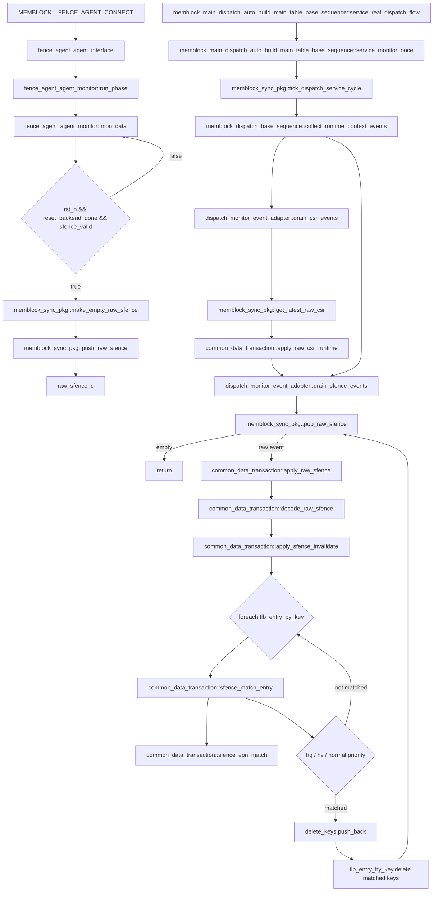

# mem_ut sfence/hfence flow

本文档说明 mem_ut 测试框架中 sfence/hfence 离散 TLB invalidation 事件的真实函数调用链。当前实现把 CSR runtime 镜像和 sfence/hfence 事件拆成两类状态：CSR 是 latest snapshot，sfence/hfence 是 FIFO 事件。统一 service loop 按 `drain_csr_events()` -> `drain_sfence_events()` 的顺序处理，保证失效匹配使用最新 CSR runtime，同时不让 CSR-only 路径隐式消费 sfence。

## 1. 函数调用 Flow 图



### 1.1 函数调用 Flow 图整体文字伪代码

```text
sfence/hfence 主流程：

1. 连接阶段：
   MEMBLOCK__FENCE_AGENT_CONNECT 建立 fence_agent_agent_interface；
   非 MEMBLOCK_UT 模式下，把 DUT io_ooo_to_mem_sfence_* force 到 interface；
   monitor 后续只从 interface 采样，不直接修改 common_data_transaction。

2. 采集阶段：
   fence_agent_agent_monitor::run_phase 调用 mon_data；
   mon_data 每拍读取 io_ooo_to_mem_sfence_valid/rs1/rs2/addr/id/hv/hg；
   如果 rst_n、reset_backend_done 和 valid 同时为 1：
     调用 make_empty_raw_sfence：生成全零 raw event；
     填入 rs1/rs2/addr/id/hv/hg 和当前 dispatch_service_cycle；
     调用 push_raw_sfence：只有 dispatch_monitor_capture_en=1 且 raw.valid=1 才入 raw_sfence_q；
   否则本拍不入队，monitor 继续下一拍。

3. service 消费阶段：
   service_real_dispatch_flow 在 reset_backend_done 后每个 negedge clk 调用 service_monitor_once；
   service_monitor_once 先 tick_dispatch_service_cycle；
   随后调用 collect_runtime_context_events；
   collect_runtime_context_events 先 drain_csr_events，再 drain_sfence_events；
   这个顺序保证 sfence_match_entry 中读取到的 mmu_csr_state 是最新 CSR runtime。

4. CSR 优先阶段：
   drain_csr_events 调用 get_latest_raw_csr；
   如果 latest_raw_csr_valid=0，则不更新 CSR；
   如果存在 latest snapshot，则 common_data_transaction::apply_raw_csr_runtime 按 raw_csr_seq 去重；
   raw_csr_seq 与 last_applied_raw_csr_seq 相同则直接返回；
   否则更新 mmu_csr_state，并记录 last_applied_raw_csr_seq。

5. sfence FIFO 阶段：
   drain_sfence_events 循环调用 pop_raw_sfence；
   raw_sfence_q 为空时返回；
   每个 raw event 调用 apply_raw_sfence；
   apply_raw_sfence 先 decode_raw_sfence，把 rs1 转成 ignore_addr，rs2 转成 ignore_id；
   再调用 apply_sfence_invalidate 遍历 tlb_entry_by_key。

6. 匹配与删除阶段：
   apply_sfence_invalidate 对每个 live TLB entry 调用 sfence_match_entry；
   sfence_match_entry 先过滤 invalid payload 和地址不匹配项；
   如果 hg=1，优先按 hfence.g 语义匹配 stage2/G-stage entry，id 表示 VMID；
   否则如果 hv=1，按 hfence.v 语义匹配 VS/G-stage 相关 entry，id 表示 ASID；
   否则按普通 sfence.vma 语义匹配非纯 stage2 entry，id 表示 ASID；
   匹配项先 push 到 delete_keys，遍历结束后统一从 tlb_entry_by_key 删除；
   uid_tlb_record_by_uid、main_table_by_uid 和 status_by_uid 不因 sfence 删除。
```

## 2. `MEMBLOCK__FENCE_AGENT_CONNECT`

源码位置：`mem_ut/ver/ut/memblock/tb/fence_agent_connect.sv`

真实逻辑摘要：

```systemverilog
`define MEMBLOCK__FENCE_AGENT_CONNECT(U_IF_NAME,AGENT_PATH,RTL_PATH) \
    fence_agent_agent_interface  U_IF_NAME (clk,tc_if.rst_n); \
    initial begin \
        uvm_config_db#(virtual fence_agent_agent_interface)::set(null,`"*AGENT_PATH*`", "vif", U_IF_NAME); \
    end \
    `ifdef MEMBLOCK_UT \
    initial begin \
        force RTL_PATH.io_ooo_to_mem_sfence_valid = U_IF_NAME.io_ooo_to_mem_sfence_valid; \
        ...
    end \
    `else \
    initial begin \
        force U_IF_NAME.io_ooo_to_mem_sfence_valid = RTL_PATH.io_ooo_to_mem_sfence_valid; \
        force U_IF_NAME.io_ooo_to_mem_sfence_bits_rs1 = RTL_PATH.io_ooo_to_mem_sfence_bits_rs1; \
        force U_IF_NAME.io_ooo_to_mem_sfence_bits_hg = RTL_PATH.io_ooo_to_mem_sfence_bits_hg; \
    end \
    `endif
```

功能解释：

该宏建立 fence agent 的 virtual interface，并把 DUT 的 `io_ooo_to_mem_sfence_*` 信号接到 interface。真实 DUT flow 下，interface 采样 DUT 输出；`MEMBLOCK_UT` 调试模式下方向相反，由 agent interface 驱动 DUT。

输入/输出：

- 输入：`U_IF_NAME`、`AGENT_PATH`、`RTL_PATH`。
- 输出：UVM config DB 中的 `vif`，以及 interface 与 RTL sfence 信号的 force 连接。

文字伪代码：

```text
创建 fence_agent_agent_interface；
把 interface 写入 uvm_config_db，供 monitor 获取；
如果定义 MEMBLOCK_UT：
  force RTL sfence 信号等于 interface 信号；
否则：
  force interface sfence 信号等于 RTL 信号；
```

内部子调用：

- 无函数子调用；该宏只做 interface 创建、config 设置和信号 force。

## 3. `fence_agent_agent_monitor::run_phase()`

源码位置：`mem_ut/ver/ut/memblock/agent/fence_agent_agent/src/fence_agent_agent_monitor.sv`

真实逻辑摘要：

```systemverilog
task fence_agent_agent_monitor::run_phase(uvm_phase phase);
    super.run_phase(phase);
    this.mon_data();
endtask:run_phase
```

功能解释：

monitor 的运行入口，进入无限采样循环 `mon_data()`。它本身不做过滤和入队。

输入/输出：

- 输入：UVM phase、monitor base class 已配置的 `vif/cfg`。
- 输出：调用 `mon_data()` 后，sfence raw event 可能进入 `memblock_sync_pkg::raw_sfence_q`。

文字伪代码：

```text
执行父类 run_phase；
调用 mon_data：开始按 clocking block 采样 fence interface；
```

内部子调用：

- `mon_data()`：真实采样 sfence 信号并写入 raw queue。

## 4. `fence_agent_agent_monitor::mon_data()`

源码位置：`mem_ut/ver/ut/memblock/agent/fence_agent_agent/src/fence_agent_agent_monitor.sv`

真实逻辑摘要：

```systemverilog
while(1) begin
    @this.vif.mon_mp.mon_cb;
    io_ooo_to_mem_sfence_valid = this.vif.mon_mp.mon_cb.io_ooo_to_mem_sfence_valid;
    io_ooo_to_mem_sfence_bits_rs1 = this.vif.mon_mp.mon_cb.io_ooo_to_mem_sfence_bits_rs1;
    ...
    if(this.vif.rst_n==1'b1 &&
       memblock_sync_pkg::reset_backend_done==1'b1 &&
       io_ooo_to_mem_sfence_valid==1'b1) begin
        raw_sfence = memblock_sync_pkg::make_empty_raw_sfence();
        raw_sfence.valid = 1'b1;
        raw_sfence.rs1   = io_ooo_to_mem_sfence_bits_rs1;
        raw_sfence.rs2   = io_ooo_to_mem_sfence_bits_rs2;
        raw_sfence.addr  = io_ooo_to_mem_sfence_bits_addr;
        raw_sfence.id    = io_ooo_to_mem_sfence_bits_id;
        raw_sfence.hv    = io_ooo_to_mem_sfence_bits_hv;
        raw_sfence.hg    = io_ooo_to_mem_sfence_bits_hg;
        raw_sfence.cycle = memblock_sync_pkg::get_dispatch_service_cycle();
        memblock_sync_pkg::push_raw_sfence(raw_sfence);
    end
end
```

功能解释：

这是 sfence/hfence 事件进入软件框架的真实入口。monitor 每拍采样 DUT 输出的 sfence payload，只有 reset 后端完成且 valid 为 1 时才构造 raw event。

输入/输出：

- 输入：`io_ooo_to_mem_sfence_valid/rs1/rs2/addr/id/hv/hg`。
- 输出：`dispatch_raw_sfence_t`，经 `push_raw_sfence()` 写入 `raw_sfence_q`。

文字伪代码：

```text
循环等待 monitor clocking block；
读取本拍 sfence valid 和 payload 字段；
如果 xz 检查打开且 reset/backend ready：
  检查 valid、rs1、rs2、addr、id、hv、hg 是否有 X/Z；
如果 rst_n=1 且 reset_backend_done=1 且 valid=1：
  调用 make_empty_raw_sfence：得到默认无效事件；
  将 raw.valid 置 1；
  复制 rs1/rs2/addr/id/hv/hg；
  用 get_dispatch_service_cycle 记录采样时对应的软件 service cycle；
  调用 push_raw_sfence：尝试写入 raw_sfence_q；
否则：
  本拍没有 sfence raw event；
```

内部子调用：

- `memblock_sync_pkg::make_empty_raw_sfence()`：生成默认 raw event。
- `memblock_sync_pkg::get_dispatch_service_cycle()`：读取当前 service cycle，用于日志和追踪。
- `memblock_sync_pkg::push_raw_sfence()`：按 capture enable 和 valid 入 FIFO。

## 5. `memblock_sync_pkg::make_empty_raw_sfence()`

源码位置：`mem_ut/ver/ut/memblock/common/memblock_common/src/memblock_sync_pkg.sv`

真实逻辑摘要：

```systemverilog
function dispatch_raw_sfence_t make_empty_raw_sfence();
    dispatch_raw_sfence_t item;
    item.valid = 1'b0;
    item.rs1   = 1'b0;
    item.rs2   = 1'b0;
    item.addr  = '0;
    item.id    = '0;
    item.hv    = 1'b0;
    item.hg    = 1'b0;
    item.cycle = 0;
    return item;
endfunction
```

功能解释：

提供 raw sfence event 的统一默认值，避免 monitor 遗留旧字段。

输入/输出：

- 输入：无。
- 输出：字段清零、`valid=0` 的 `dispatch_raw_sfence_t`。

文字伪代码：

```text
创建 dispatch_raw_sfence_t；
清 valid、rs1、rs2、addr、id、hv、hg、cycle；
返回该默认 raw event；
```

内部子调用：

- 无。

## 6. `memblock_sync_pkg::push_raw_sfence()`

源码位置：`mem_ut/ver/ut/memblock/common/memblock_common/src/memblock_sync_pkg.sv`

真实逻辑摘要：

```systemverilog
function void push_raw_sfence(input dispatch_raw_sfence_t item);
    if (dispatch_monitor_capture_en && item.valid) begin
        raw_sfence_q.push_back(item);
    end
endfunction
```

功能解释：

把 sfence/hfence raw event 写入 FIFO。sfence 是离散事件，不能像 CSR snapshot 一样覆盖为 latest。

输入/输出：

- 输入：`dispatch_raw_sfence_t item`。
- 输出：满足条件时 `raw_sfence_q.push_back(item)`。

文字伪代码：

```text
如果 dispatch_monitor_capture_en=1 且 item.valid=1：
  将 item 追加到 raw_sfence_q 尾部；
否则：
  丢弃 item，不产生状态变化；
```

内部子调用：

- 无。

## 7. `memblock_main_dispatch_auto_build_main_table_base_sequence::service_monitor_once()`

源码位置：`mem_ut/ver/ut/memblock/seq/base_seq/memblock_main_dispatch_auto_build_main_table_base_sequence.sv`

真实逻辑摘要：

```systemverilog
task memblock_main_dispatch_auto_build_main_table_base_sequence::service_monitor_once();
    memblock_sync_pkg::tick_dispatch_service_cycle();
    collect_runtime_context_events();
    collect_monitor_event_batch();
    exception_redirect_replay_task();
endtask
```

功能解释：

真实 dispatch smoke flow 的单轮 monitor 服务入口。sfence/hfence 在 writeback、IQ feedback、memory violation batch 之前消费。

输入/输出：

- 输入：各 monitor 已采集到的 raw queues/latest CSR。
- 输出：推进 service cycle；更新 CSR runtime；消费 `raw_sfence_q` 并失效 TLB entry；随后继续处理 writeback/recovery。

文字伪代码：

```text
推进 dispatch_service_cycle；
调用 collect_runtime_context_events：先同步 CSR runtime，再消费 sfence/hfence；
调用 collect_monitor_event_batch：处理 writeback/IQ feedback/ctrl；
调用 exception_redirect_replay_task：处理 redirect/replay/fault 队列；
```

内部子调用：

- `tick_dispatch_service_cycle()`：更新 service cycle。
- `collect_runtime_context_events()`：本 flow 的 consumer 入口。
- `collect_monitor_event_batch()`、`exception_redirect_replay_task()`：sfence 后续同轮处理，不是 sfence 删除逻辑。

## 8. `memblock_dispatch_base_sequence::collect_runtime_context_events()`

源码位置：`mem_ut/ver/ut/memblock/seq/base_seq_help/memblock_dispatch_base_sequence.sv`

真实逻辑摘要：

```systemverilog
function void memblock_dispatch_base_sequence::collect_runtime_context_events();
    if (monitor_adapter == null) begin
        monitor_adapter = dispatch_monitor_event_adapter::type_id::create("monitor_adapter");
    end
    if (monitor_commit_handler != null) begin
        monitor_adapter.bind_commit_handler(monitor_commit_handler);
    end
    monitor_adapter.drain_csr_events();
    monitor_adapter.drain_sfence_events();
endfunction
```

功能解释：

统一 runtime context 入口。它显式保证 CSR runtime 在 sfence/hfence 前更新。

输入/输出：

- 输入：`latest_raw_csr`、`raw_sfence_q`。
- 输出：`mmu_csr_state` 更新；`raw_sfence_q` 被 FIFO 排空；`tlb_entry_by_key` 可能删除。

文字伪代码：

```text
如果 monitor_adapter 未创建：
  创建 dispatch_monitor_event_adapter；
如果已有 monitor_commit_handler：
  绑定到 adapter；
调用 drain_csr_events：应用 latest CSR snapshot；
调用 drain_sfence_events：消费所有 pending sfence/hfence raw event；
```

内部子调用：

- `dispatch_monitor_event_adapter::drain_csr_events()`：CSR latest snapshot 消费入口。
- `dispatch_monitor_event_adapter::drain_sfence_events()`：sfence FIFO 消费入口。

## 9. `dispatch_monitor_event_adapter::drain_csr_events()`

源码位置：`mem_ut/ver/ut/memblock/seq/base_seq_help/dispatch_monitor_event_adapter.sv`

真实逻辑摘要：

```systemverilog
function void drain_csr_events();
    memblock_sync_pkg::dispatch_raw_csr_t raw_csr;
    int unsigned raw_csr_seq;

    ensure_handles();
    if (memblock_sync_pkg::get_latest_raw_csr(raw_csr, raw_csr_seq)) begin
        data.apply_raw_csr_runtime(raw_csr, raw_csr_seq);
    end
endfunction
```

功能解释：

读取最新 CSR snapshot，并交给 `common_data_transaction` 去重应用。它不消费 `raw_sfence_q`。

输入/输出：

- 输入：`latest_raw_csr/latest_raw_csr_valid/latest_raw_csr_seq`。
- 输出：可能更新 `common_data_transaction::mmu_csr_state`。

文字伪代码：

```text
调用 ensure_handles：保证 data 指向 common_data_transaction；
调用 get_latest_raw_csr：
  如果没有 latest CSR，直接返回；
  如果有 latest CSR，取得 raw_csr 和 raw_csr_seq；
调用 data.apply_raw_csr_runtime：
  由 common_data_transaction 根据 seq 去重并更新 mmu_csr_state；
```

内部子调用：

- `ensure_handles()`：确保 adapter 持有 `common_data_transaction`。
- `memblock_sync_pkg::get_latest_raw_csr()`：读取 latest CSR snapshot。
- `common_data_transaction::apply_raw_csr_runtime()`：更新 runtime CSR 镜像。

## 10. `common_data_transaction::apply_raw_csr_runtime()`

源码位置：`mem_ut/ver/ut/memblock/seq/base_seq_help/common_data_transaction.sv`

真实逻辑摘要：

```systemverilog
function void apply_raw_csr_runtime(input memblock_sync_pkg::dispatch_raw_csr_t raw,
                                    input int unsigned raw_csr_seq);
    if (!raw.valid) begin
        return;
    end
    if (raw_csr_seq == last_applied_raw_csr_seq) begin
        return;
    end
    if (mmu_csr_state == null) begin
        mmu_csr_state = mmu_csr_runtime_state::type_id::create("mmu_csr_state");
        mmu_csr_state.reset();
    end
    mmu_csr_state.update_from_raw_csr(raw);
    last_applied_raw_csr_seq = raw_csr_seq;
endfunction
```

功能解释：

维护 `mmu_csr_state` 的最新运行时镜像，并用 `last_applied_raw_csr_seq` 防止同一个 latest snapshot 被重复应用。

输入/输出：

- 输入：`dispatch_raw_csr_t raw`、`raw_csr_seq`。
- 输出：`mmu_csr_state` 更新；`last_applied_raw_csr_seq` 更新。

文字伪代码：

```text
如果 raw.valid=0：
  返回；
如果 raw_csr_seq 等于 last_applied_raw_csr_seq：
  返回，避免重复应用同一 latest snapshot；
如果 mmu_csr_state 为空：
  创建并 reset；
调用 mmu_csr_state.update_from_raw_csr：复制 CSR 字段并维护 update_seq；
记录 last_applied_raw_csr_seq=raw_csr_seq；
```

内部子调用：

- `mmu_csr_runtime_state::update_from_raw_csr()`：复制 satp/vsatp/hgatp/priv/PBMT 字段，变化时递增 `update_seq`。

## 11. `dispatch_monitor_event_adapter::drain_sfence_events()`

源码位置：`mem_ut/ver/ut/memblock/seq/base_seq_help/dispatch_monitor_event_adapter.sv`

真实逻辑摘要：

```systemverilog
function void drain_sfence_events();
    memblock_sync_pkg::dispatch_raw_sfence_t raw_sfence;

    ensure_handles();
    while (memblock_sync_pkg::pop_raw_sfence(raw_sfence)) begin
        void'(data.apply_raw_sfence(raw_sfence));
    end
endfunction
```

功能解释：

按 FIFO 顺序消费所有 pending sfence/hfence raw event。每个 raw event 都独立触发一次 TLB entry invalidation。

输入/输出：

- 输入：`memblock_sync_pkg::raw_sfence_q`。
- 输出：`raw_sfence_q` 被 pop；`tlb_entry_by_key` 可能删除匹配项。

文字伪代码：

```text
调用 ensure_handles：保证 data 可用；
循环调用 pop_raw_sfence：
  如果队列为空，结束；
  如果弹出 raw_sfence，调用 data.apply_raw_sfence；
```

内部子调用：

- `memblock_sync_pkg::pop_raw_sfence()`：FIFO 出队。
- `common_data_transaction::apply_raw_sfence()`：decode 并执行失效。

## 12. `memblock_sync_pkg::pop_raw_sfence()`

源码位置：`mem_ut/ver/ut/memblock/common/memblock_common/src/memblock_sync_pkg.sv`

真实逻辑摘要：

```systemverilog
function bit pop_raw_sfence(output dispatch_raw_sfence_t item);
    if (raw_sfence_q.size() == 0) begin
        item = make_empty_raw_sfence();
        return 1'b0;
    end
    item = raw_sfence_q.pop_front();
    return 1'b1;
endfunction
```

功能解释：

`raw_sfence_q` 的唯一出队入口。空队列返回 `0`，非空时从队头弹出，保持采集顺序。

输入/输出：

- 输入：`raw_sfence_q`。
- 输出：`item` 和返回值；非空时队列减少一个元素。

文字伪代码：

```text
如果 raw_sfence_q 为空：
  输出默认 empty sfence；
  返回 0；
否则：
  pop_front 得到最早采集的 sfence；
  返回 1；
```

内部子调用：

- `make_empty_raw_sfence()`：空队列时输出默认无效 event。

## 13. `common_data_transaction::apply_raw_sfence()`

源码位置：`mem_ut/ver/ut/memblock/seq/base_seq_help/common_data_transaction.sv`

真实逻辑摘要：

```systemverilog
function int unsigned apply_raw_sfence(input memblock_sync_pkg::dispatch_raw_sfence_t raw);
    return apply_sfence_invalidate(decode_raw_sfence(raw));
endfunction
```

功能解释：

raw event 到公共 TLB invalidation payload 的桥接入口。返回删除的 TLB entry 数量。

输入/输出：

- 输入：`dispatch_raw_sfence_t raw`。
- 输出：返回 `apply_sfence_invalidate()` 删除数量。

文字伪代码：

```text
调用 decode_raw_sfence：把接口 raw 字段转成 memblock_sfence_payload_t；
调用 apply_sfence_invalidate：按 payload 删除匹配 live TLB entry；
返回删除数量；
```

内部子调用：

- `decode_raw_sfence()`：字段语义转换。
- `apply_sfence_invalidate()`：遍历并删除 `tlb_entry_by_key`。

## 14. `common_data_transaction::decode_raw_sfence()`

源码位置：`mem_ut/ver/ut/memblock/seq/base_seq_help/common_data_transaction.sv`

真实逻辑摘要：

```systemverilog
function memblock_sfence_payload_t decode_raw_sfence(input memblock_sync_pkg::dispatch_raw_sfence_t raw);
    memblock_sfence_payload_t payload;

    payload = '{default:'0};
    payload.valid       = raw.valid;
    payload.ignore_addr = raw.rs1;
    payload.ignore_id   = raw.rs2;
    payload.addr        = raw.addr;
    payload.id          = raw.id;
    payload.hv          = raw.hv;
    payload.hg          = raw.hg;
    payload.cycle       = raw.cycle;
    return payload;
endfunction
```

功能解释：

把 fence interface raw 字段转换为公共数据层使用的失效 payload。`rs1` 表示是否忽略地址，`rs2` 表示是否忽略 ASID/VMID。

输入/输出：

- 输入：`dispatch_raw_sfence_t raw`。
- 输出：`memblock_sfence_payload_t payload`。

文字伪代码：

```text
创建全零 payload；
复制 valid；
payload.ignore_addr = raw.rs1；
payload.ignore_id = raw.rs2；
复制 addr、id、hv、hg、cycle；
返回 payload；
```

内部子调用：

- 无。

## 15. `common_data_transaction::apply_sfence_invalidate()`

源码位置：`mem_ut/ver/ut/memblock/seq/base_seq_help/common_data_transaction.sv`

真实逻辑摘要：

```systemverilog
function int unsigned apply_sfence_invalidate(input memblock_sfence_payload_t payload);
    memblock_tlb_lookup_key_t delete_keys[$];

    if (!payload.valid) begin
        return 0;
    end
    foreach (tlb_entry_by_key[key]) begin
        if (sfence_match_entry(payload, key, tlb_entry_by_key[key])) begin
            delete_keys.push_back(key);
        end
    end
    foreach (delete_keys[idx]) begin
        tlb_entry_by_key.delete(delete_keys[idx]);
    end
    return delete_keys.size();
endfunction
```

功能解释：

执行真正的 TLB entry 级删除。它先收集要删除的 key，再统一删除，避免遍历关联数组时直接修改。

输入/输出：

- 输入：`memblock_sfence_payload_t payload`、`tlb_entry_by_key`。
- 输出：删除匹配 key；返回删除数量。

文字伪代码：

```text
创建 delete_keys 空队列；
如果 payload.valid=0：
  返回 0；
遍历 tlb_entry_by_key 的所有 live entry：
  调用 sfence_match_entry；
  如果匹配：
    把 key 追加到 delete_keys；
遍历 delete_keys：
  从 tlb_entry_by_key 删除该 key；
如果删除数量非 0：
  打印删除数量和 payload 条件；
返回 delete_keys.size；
```

内部子调用：

- `sfence_match_entry()`：按地址、hv/hg、ASID/VMID、`pte_g` 判断单个 entry 是否命中。

## 16. `common_data_transaction::sfence_match_entry()`

源码位置：`mem_ut/ver/ut/memblock/seq/base_seq_help/common_data_transaction.sv`

真实逻辑摘要：

```systemverilog
if (!payload.valid) return 1'b0;
if (entry == null) `uvm_fatal("COMMON_DATA", "sfence_match_entry got null entry")
if (!payload.ignore_addr && !sfence_vpn_match(key.vpn, entry.level, payload.addr)) return 1'b0;

if (payload.hg) begin
    if (!(key.s2xlate == 2'd2 || key.s2xlate == 2'd3)) return 1'b0;
    if (!payload.ignore_id && key.vmid != payload.id) return 1'b0;
    return 1'b1;
end

if (payload.hv) begin
    if (!(key.s2xlate == 2'd1 || key.s2xlate == 2'd3)) return 1'b0;
    if (key.s2xlate == 2'd3 && mmu_csr_state != null && key.vmid != mmu_csr_state.hgatp_vmid) return 1'b0;
    if (!payload.ignore_id) begin
        if (entry.pte_g) return 1'b0;
        if (key.asid != payload.id) return 1'b0;
    end
    return 1'b1;
end

if (key.s2xlate == 2'd2) return 1'b0;
if (!payload.ignore_id) begin
    if (entry.pte_g) return 1'b0;
    if (key.asid != payload.id) return 1'b0;
end
return 1'b1;
```

功能解释：

该函数定义 sfence/hfence 的匹配优先级。优先级为：invalid/null/address 过滤 -> `hg` -> `hv` -> 普通 sfence。若 `hg` 和 `hv` 同时为 1，源码先进入 `hg` 分支。

输入/输出：

- 输入：`payload`、`memblock_tlb_lookup_key_t key`、`memblock_tlb_entry entry`。
- 输出：返回是否匹配；null entry 会 fatal。

文字伪代码：

```text
如果 payload.valid=0：
  返回不匹配；
如果 entry=null：
  fatal；
如果 payload.ignore_addr=0：
  调用 sfence_vpn_match；
  如果地址不匹配，返回不匹配；

如果 payload.hg=1：
  只匹配 s2xlate 为 2 或 3 的 stage2/G-stage entry；
  如果 ignore_id=0 且 key.vmid != payload.id，返回不匹配；
  返回匹配；

如果 payload.hv=1：
  只匹配 s2xlate 为 1 或 3 的 VS/G-stage 相关 entry；
  如果 key.s2xlate=3 且当前 mmu_csr_state 存在，要求 key.vmid 等于当前 hgatp_vmid；
  如果 ignore_id=0：
    pte_g=1 的 global entry 不因 ASID 精确匹配被删除；
    key.asid 必须等于 payload.id；
  返回匹配；

普通 sfence：
  不匹配纯 stage2 entry，即 key.s2xlate=2 返回不匹配；
  如果 ignore_id=0：
    pte_g=1 的 global entry 不因 ASID 精确匹配被删除；
    key.asid 必须等于 payload.id；
  返回匹配；
```

内部子调用：

- `sfence_vpn_match()`：按 entry page level 比较 VPN 前缀。

## 17. `common_data_transaction::sfence_vpn_match()`

源码位置：`mem_ut/ver/ut/memblock/seq/base_seq_help/common_data_transaction.sv`

真实逻辑摘要：

```systemverilog
function bit sfence_vpn_match(input bit [51:0] entry_vpn,
                              input bit [1:0] entry_level,
                              input bit [49:0] addr);
    bit [51:0] addr_vpn;

    addr_vpn = {14'b0, addr[49:12]};
    case (entry_level)
        2'd0: return entry_vpn[37:0]  == addr_vpn[37:0];
        2'd1: return entry_vpn[37:9]  == addr_vpn[37:9];
        2'd2: return entry_vpn[37:18] == addr_vpn[37:18];
        default: return entry_vpn[37:27] == addr_vpn[37:27];
    endcase
endfunction
```

功能解释：

根据 entry 的 page level 判断 fence 地址是否覆盖该 TLB entry。level 越大，比较的 VPN 前缀越短。

输入/输出：

- 输入：entry key 的 VPN、entry level、fence addr。
- 输出：地址是否匹配。

文字伪代码：

```text
从 addr[49:12] 生成 addr_vpn；
如果 entry_level=0：
  比较 VPN[37:0]；
如果 entry_level=1：
  比较 VPN[37:9]；
如果 entry_level=2：
  比较 VPN[37:18]；
否则：
  比较 VPN[37:27]；
```

内部子调用：

- 无。

## 18. 队列和状态说明

| 队列/状态 | 写入者 | 消费者 | 元素/字段含义 | 删除或更新条件 |
|---|---|---|---|---|
| `raw_sfence_q[$]` | `push_raw_sfence()` | `drain_sfence_events()` -> `pop_raw_sfence()` | `dispatch_raw_sfence_t`，保存 valid、rs1、rs2、addr、id、hv、hg、cycle | `pop_raw_sfence()` FIFO 出队；空队列返回 empty event |
| `latest_raw_csr` | `push_raw_csr()` | `drain_csr_events()` | CSR latest snapshot，不是 FIFO | 新 CSR 覆盖旧 snapshot；`latest_raw_csr_seq` 递增 |
| `mmu_csr_state` | `apply_raw_csr_runtime()` | `sfence_match_entry()`、L2TLB lookup | 当前 satp/vsatp/hgatp/priv/PBMT runtime 镜像 | raw CSR seq 变化时更新；sfence 不清它 |
| `tlb_entry_by_key[key]` | L2TLB lookup miss 时 `insert_tlb_entry()` | `apply_sfence_invalidate()`、L2TLB lookup hit | live TLB cache，key 为 `{vpn, asid, vmid, s2xlate}` | sfence/hfence 匹配后删除；lookup miss 后可重新创建 |
| `uid_tlb_record_by_uid[uid]` | uid issue 和 L2TLB response 回填 | PTW wait/replay 和 debug | uid 历史 TLB 上下文和 PTE 回填状态 | sfence 不删除；保留到 testcase/reset |

## 19. 分支优先级

- monitor 入队优先级：`rst_n && reset_backend_done && sfence_valid` 必须同时为 1，否则不入队。
- queue 写入优先级：`dispatch_monitor_capture_en && item.valid` 必须同时为 1，否则 `push_raw_sfence()` 丢弃。
- runtime context 优先级：service loop 总是先 `drain_csr_events()`，再 `drain_sfence_events()`。
- CSR 去重优先级：`raw.valid=0` 先返回；`raw_csr_seq == last_applied_raw_csr_seq` 再返回；否则才更新 `mmu_csr_state`。
- sfence match 优先级：invalid/null/address 过滤先执行；`payload.hg` 优先于 `payload.hv`；最后才是普通 sfence。
- ASID/VMID 精确匹配：`ignore_id=0` 时，`hg` 检查 VMID，`hv` 和普通 sfence 检查 ASID；`pte_g=1` 的 entry 不被 ASID 精确 flush 删除。
- 删除时机：匹配时只记录 key，遍历结束后统一 `tlb_entry_by_key.delete()`。

## 20. 对 L2TLB lookup 的影响

sfence/hfence 只删除 live `tlb_entry_by_key` cache，不删除 uid 历史 record。后续 DTLB 再向 L2TLB 发 request 时，`common_data_transaction::get_or_create_tlb_entry_by_req()` 会用 request 的 `vpn/s2xlate` 和最新 `mmu_csr_state` 生成 key；如果 sfence 已删除旧 entry，则 lookup miss 并重新创建 entry。

L2TLB responder 自己的 CSR-only 路径只调用 `drain_csr_events()`，不会隐式消费 `raw_sfence_q`。sfence/hfence 的 FIFO 消费只在统一 runtime context service 入口 `collect_runtime_context_events()` 中显式发生。

## 21. 端到端行为总结

sfence/hfence flow 是一条 monitor raw event 到 live TLB cache invalidation 的离散事件链路。fence monitor 不直接访问公共 TLB 表，只把 DUT sfence payload 包成 `dispatch_raw_sfence_t` 写入 `raw_sfence_q`。真实 dispatch service loop 每轮先同步 CSR latest snapshot，再 FIFO 消费 sfence/hfence。公共数据层把 raw event decode 成 `memblock_sfence_payload_t`，按地址、stage、ASID/VMID 和 global PTE 规则匹配 `tlb_entry_by_key`，最后删除命中的 live entry。该删除不影响主表、状态表或 uid TLB record；它只让后续同 key L2TLB request 重新建表。

### 21.1 端到端文字伪代码

```text
初始化：
  connect 宏把 DUT sfence 信号接到 fence_agent_agent_interface；
  common_data_transaction::reset_all_tables 清 raw queues，打开 dispatch_monitor_capture_en。

采集：
  fence monitor 每拍采 io_ooo_to_mem_sfence_*；
  如果 backend 未完成或 valid=0：
    不产生 raw event；
  如果 valid=1：
    构造 dispatch_raw_sfence_t；
    若 capture enable 打开：
      push 到 raw_sfence_q 尾部。

消费：
  dispatch smoke service 每轮先 tick service cycle；
  collect_runtime_context_events：
    drain_csr_events：
      如果 latest CSR 存在且 seq 未应用：
        更新 mmu_csr_state；
    drain_sfence_events：
      while raw_sfence_q 非空：
        pop 最早 sfence；
        decode raw 字段；
        遍历 tlb_entry_by_key；
        对每个 entry：
          地址不覆盖则跳过；
          hg 优先匹配 stage2/G-stage 和 VMID；
          hv 其次匹配 VS/G-stage 和 ASID；
          普通 sfence 最后匹配非纯 stage2 和 ASID；
        删除所有匹配 key。

后续：
  L2TLB responder 收到同 key request 时：
    如果 entry 已被删除，则 miss 后重新 build/insert；
    如果 entry 未被删除，则命中旧 live entry；
```
