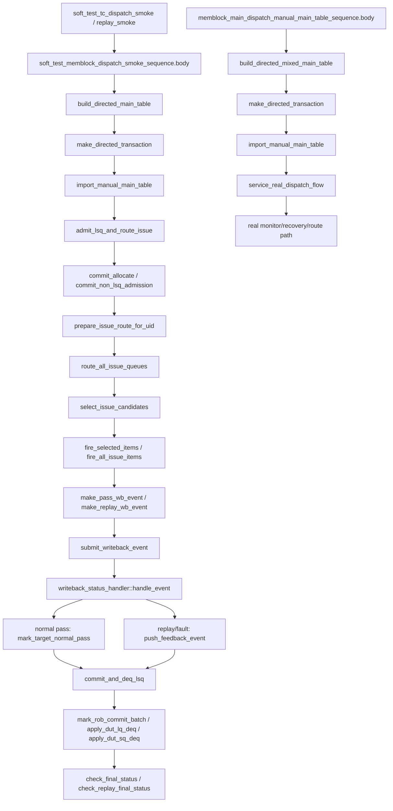

# Soft Test 与 Mixed Directed Flow

本文整理 mem_ut 中两类容易被误认为“真实 DUT 主路径”的流程：

- `soft_test` 软件闭环 smoke / replay smoke。
- `memblock_main_dispatch_manual_main_table_sequence` 真实 DUT mixed directed main table 构造。

这两类 flow 都不是 monitor 驱动的真实后端反馈主链路：
- `soft_test` 是软件事件模拟闭环，用于快速验证 status/queue/commit/deq/replay 规则。
- `real_mixed` 是真实 DUT smoke 的定向主表构造分支，只负责生成混合 load/store 主表，不替代 monitor/recovery 逻辑。

对应主要源码：

- `mem_ut/ver/ut/memblock/seq/base_seq/memblock_main_dispatch_manual_main_table_sequence.sv`
- `mem_ut/ver/ut/memblock/seq/base_seq/soft_test/soft_test_memblock_dispatch_smoke_sequence.sv`
- `mem_ut/ver/ut/memblock/seq/base_seq/soft_test/soft_test_memblock_dispatch_replay_smoke_sequence.sv`
- `mem_ut/ver/ut/memblock/seq/base_seq_help/common_data_transaction.sv`
- `mem_ut/ver/ut/memblock/seq/base_seq_help/lsq_commit_handler.sv`
- `mem_ut/ver/ut/memblock/seq/base_seq_help/issue_queue_scheduler.sv`

## 1. 函数调用 Flow 图



## 2. 函数调用 Flow 图整体文字伪代码

```text
Soft test / mixed directed flow：

1. soft_test smoke 构造阶段：
   body 先 build_directed_main_table；
   build_directed_main_table 通过 make_directed_transaction 直接构造 load/store/amo 的主表项；
   import_manual_main_table 把手工 transaction 导入 common_data；
   这里不是 DUT monitor 采集，而是软件直接构造测试数据。

2. soft_test admission 与 issue 阶段：
   admit_lsq_and_route_issue 对每个 uid 做 commit_allocate 或 commit_non_lsq_admission；
   prepare_issue_route_for_uid 置 issue_ready 并进入 issue scheduler；
   route_all_issue_queues 负责把 ready uid 路由到 load/STA/STD queue；
   select_issue_candidates / fire_selected_items / fire_all_issue_items 根据队列内容直接 fire，不依赖真实 DUT 后端反馈。

3. soft_test 写回与 commit 阶段：
   make_pass_wb_event/make_replay_wb_event 构造软件 writeback/replay event；
   submit_writeback_event 把 event 交给 writeback_status_handler::handle_event；
   handler 再进入 normal pass 或 replay/fault 分支；
   replay smoke 会构造 make_replay_wb_event，并验证 stale pass 被忽略；
   commit_and_deq_lsq 通过 lsq_commit_handler 收敛 ROB commit 和 LQ/SQ deq；
   check_final_status / check_replay_final_status 最后验证所有状态和 replay 轮次正确。

4. real mixed directed 阶段：
   memblock_main_dispatch_manual_main_table_sequence 只覆盖混合主表构造；
   build_directed_mixed_main_table 生成 load + store 定向 transaction；
   之后直接复用 memblock_main_dispatch_auto_build_main_table_base_sequence 的 service_real_dispatch_flow；
   真实 monitor/recovery/route 仍按 DUT 反馈主路径运行。
```

## 3. `memblock_main_dispatch_manual_main_table_sequence::build_directed_mixed_main_table()`

源码位置：`mem_ut/ver/ut/memblock/seq/base_seq/memblock_main_dispatch_manual_main_table_sequence.sv`

真实逻辑摘要：

```systemverilog
clear_manual_main_table();
set_manual_main_transaction(0, make_directed_transaction(... INT_LOAD ...));
set_manual_main_transaction(1, make_directed_transaction(... STORE ...));
import_manual_main_table();
```

功能解释：

该函数只负责把 mixed smoke 的主表定死：一条 load、一条 store。它不处理 issue、writeback、redirect/replay，也不消费 monitor event。

输入/输出：

- 输入：无。
- 输出：导入一个定向主表到 common_data。

文字伪代码：

```text
清空手工主表；
构造一个 load transaction；
构造一个 store transaction；
把两条 transaction 导入 common_data；
后续交给 real smoke 的 service loop 处理。
```

## 4. `soft_test_memblock_dispatch_smoke_sequence::body()`

源码位置：`mem_ut/ver/ut/memblock/seq/base_seq/soft_test/soft_test_memblock_dispatch_smoke_sequence.sv`

真实逻辑摘要：

```systemverilog
build_directed_main_table();
admit_lsq_and_route_issue();
fire_all_issue_items(fired_items);
inject_writeback_events(fired_items);
commit_and_deq_lsq();
check_final_status();
```

功能解释：

这是软件闭环 smoke 主入口。它不是 DUT monitor 路径，而是直接在测试框架内部模拟 issue/fire/writeback/commit/deq，验证框架状态机能否闭环。

输入/输出：

- 输入：手工构造的 main table。
- 输出：完成一次软件模拟闭环，并检查最终状态。

文字伪代码：

```text
先构造定向主表；
把主表每个 uid 先 admission，再 route 到 issue queue；
直接 fire 所有 issue item，收集 fired_items；
把 fired_items 转成 pass writeback event；
把这些 event 注入到软件状态路径；
最后提交 ROB commit 并执行 LQ/SQ deq；
检查所有 uid 的 status 都已经完成。
```

## 5. `soft_test_memblock_dispatch_replay_smoke_sequence::body()`

源码位置：`mem_ut/ver/ut/memblock/seq/base_seq/soft_test/soft_test_memblock_dispatch_replay_smoke_sequence.sv`

真实逻辑摘要：

```systemverilog
build_directed_main_table();
admit_lsq_and_route_issue();
fire_all_issue_items(fired_items);
inject_writeback_events_except(... STA ...);
submit_writeback_event(make_replay_wb_event(first_sta_item));
exception_redirect_replay_task();
check_replay_pending_state(...);
fire_replay_sta_item(...);
submit_writeback_event(make_pass_wb_event_with_snapshot(...));
check_stale_pass_ignored(...);
submit_writeback_event(make_pass_wb_event(...));
check_replay_final_status(...);
commit_and_deq_lsq();
check_final_status();
```

功能解释：

该 sequence 专门验证 replay 轮次和 stale pass 过滤，不依赖真实 DUT 输出。它通过软件构造 replay event、stale pass event 和最终 pass event，验证 replay_seq/issue_epoch 过滤是否正确。

输入/输出：

- 输入：软件 fire 出来的 STA item。
- 输出：验证 replay pending、stale pass ignore、最终 replay 完成。

文字伪代码：

```text
先构造并 fire 所有 issue item；
找到目标 STA item，记录当前 issue_epoch 和 replay_seq；
先注入除了目标 STA 之外的正常 pass；
再注入 replay 语义事件，触发 exception/replay 处理；
检查目标 uid 进入 replay_pending；
重新 fire STA replay item；
注入带旧 snapshot 的 pass，确认被忽略；
注入正确的 replay pass，确认 replay 完成；
最后 commit/deq 并检查最终状态。
```

## 6. `admit_lsq_and_route_issue()`

源码位置：`mem_ut/ver/ut/memblock/seq/base_seq/soft_test/soft_test_memblock_dispatch_smoke_sequence.sv`

真实逻辑摘要：

```systemverilog
for (int unsigned uid = 0; uid < data.main_trans_num; uid++) begin
    main_tr  = data.get_main_transaction(uid);
    behavior = derive_op_behavior(main_tr);
    if (behavior.need_alloc == 2'b00) begin
        lsq_ctrl.commit_non_lsq_admission(uid, behavior, main_tr);
    end else begin
        lsq_ctrl.commit_allocate(uid, behavior, main_tr);
    end
    prepare_issue_route_for_uid(uid);
end
route_all_issue_queues();
```

功能解释：

soft-test 不 drive LSQ enqueue DUT 接口，而是直接调用 `lsq_ctrl` 的软件 admission API，随后把 uid route 到 issue queue。

输入/输出：

- 输入：手工主表和 `lsq_ctrl` 软件镜像。
- 输出：uid 被标记 active/enq/issue_ready，并进入 issue queue。

文字伪代码：

```text
按 uid 顺序遍历主表；
读取 main transaction 并推导 op behavior；
如果 need_alloc=0，调用 commit_non_lsq_admission；
否则调用 commit_allocate 软件分配 LQ/SQ；
每个 uid admission 后调用 prepare_issue_route_for_uid；
最后调用 route_all_issue_queues，把所有 ready target 推入 load/STA/STD queue。
```

内部子调用：

- `derive_op_behavior()`：根据 fuType/fuOpType 推导 LSQ/issue 行为。
- `commit_allocate()` / `commit_non_lsq_admission()`：软件 admission 收口。
- `prepare_issue_route_for_uid()`：设置 issue_ready 并 route。

## 7. `fire_all_issue_items()` / `fire_selected_items()`

源码位置：`mem_ut/ver/ut/memblock/seq/base_seq/soft_test/soft_test_memblock_dispatch_smoke_sequence.sv`

真实逻辑摘要：

```systemverilog
for (int unsigned cycle_idx = 0; cycle_idx < 8; cycle_idx++) begin
    route_all_issue_queues();
    select_issue_candidates(load_items, sta_items, std_items);
    fire_selected_items(load_items, fired_items, had_fire);
    fire_selected_items(sta_items, fired_items, had_fire);
    fire_selected_items(std_items, fired_items, had_fire);
    if (all_required_targets_dispatched()) return;
    if (!had_fire) `uvm_fatal(...);
end
`uvm_fatal(...);
```

功能解释：

该流程用软件方式模拟 issue fire：从三个 issue queue 中选 candidate，调用 `mark_issue_item_fire()` 标记 dispatched，并收集 fired item 用于后续构造 writeback event。

输入/输出：

- 输入：load/STA/STD issue queue。
- 输出：`fired_items` 列表和 status 的 dispatched/issue_epoch snapshot。

文字伪代码：

```text
最多尝试 8 个软件 cycle；
每轮先 route_all_issue_queues，保证 ready uid 已入队；
select_issue_candidates 取 load/STA/STD 候选；
fire_selected_items 对每个候选调用 mark_issue_item_fire；
fire 成功后把 item 追加到 fired_items；
如果所有 required target 已 dispatched，返回；
如果某轮完全没有 fire，说明软件闭环卡住，fatal；
8 轮后仍未完成也 fatal。
```

内部子调用：

- `select_issue_candidates()`：从 issue queue 中取待发射项。
- `mark_issue_item_fire()`：设置 target dispatched 和 issue snapshot。
- `all_required_targets_dispatched()`：判断软件 issue 阶段是否完成。

## 8. `inject_writeback_events()` / `make_pass_wb_event()`

源码位置：`mem_ut/ver/ut/memblock/seq/base_seq/soft_test/soft_test_memblock_dispatch_smoke_sequence.sv`

真实逻辑摘要：

```systemverilog
foreach (fired_items[idx]) begin
    submit_writeback_event(make_pass_wb_event(fired_items[idx]));
end

wb_event.valid               = 1'b1;
wb_event.target              = item.target;
wb_event.uid                 = item.uid;
wb_event.has_uid             = 1'b1;
wb_event.rob_key             = item.rob_key;
wb_event.has_rob             = 1'b1;
wb_event.issue_epoch         = status.get_target_issue_epoch(item.target);
wb_event.has_issue_epoch     = 1'b1;
wb_event.replay_seq          = status.replay_seq;
wb_event.has_replay_seq      = 1'b1;
wb_event.real_wb_valid       = 1'b1;
```

功能解释：

该流程把软件 fire 出来的 issue item 转成 pass writeback event，再交给 `submit_writeback_event()`。关键点是 event 带上 issue_epoch/replay_seq snapshot，和真实路径一样参与旧事件过滤。

输入/输出：

- 输入：`fired_items`。
- 输出：每个 fired item 对应一个软件 pass event。

文字伪代码：

```text
如果 fired_items 为空，fatal；
遍历每个 fired item；
make_pass_wb_event 从 status 读取 target issue_epoch 和 replay_seq；
填 uid/ROB key/target/real_wb_valid；
调用 submit_writeback_event，把 event 送入 writeback handler。
```

内部子调用：

- `make_pass_wb_event()`：构造带 snapshot 的 normal pass event。
- `submit_writeback_event()`：进入 writeback handler。


## 9. `submit_writeback_event()`

源码位置：`mem_ut/ver/ut/memblock/seq/base_seq/soft_test/soft_test_memblock_dispatch_smoke_sequence.sv`

真实逻辑摘要：

```systemverilog
task soft_test_memblock_dispatch_smoke_sequence::submit_writeback_event(input memblock_wb_event_t wb_event);
    if (writeback_handler == null) begin
        writeback_handler = writeback_status_handler::type_id::create("writeback_handler");
    end
    void'(writeback_handler.handle_event(wb_event));
endtask
```

功能解释：

这是 soft-test 写回事件进入状态处理器的入口。它没有经过真实 DUT monitor batch，也没有调用 `process_monitor_event_batch()`，而是直接复用 `writeback_status_handler::handle_event()` 验证 status 更新和 replay/fault 入队逻辑。

输入/输出：

- 输入：软件构造的 `memblock_wb_event_t`。
- 输出：normal pass 直接落 status；replay/fault 可能进入 `push_feedback_event()`。

文字伪代码：

```text
如果 writeback_handler 尚未创建，则创建一个 handler；
调用 writeback_handler.handle_event；
由 handler 根据 event 类型决定：
  normal pass 调 mark_target_normal_pass；
  replay/fault 调 push_feedback_event；
soft-test 不经过 raw monitor queue 和 batch redirect-first 仲裁。
```

内部子调用：

- `writeback_status_handler::handle_event()`：软件事件复用的 writeback 分类入口。

## 10. `commit_and_deq_lsq()`

源码位置：`mem_ut/ver/ut/memblock/seq/base_seq/soft_test/soft_test_memblock_dispatch_smoke_sequence.sv`

真实逻辑摘要：

```systemverilog
commit_handler.build_lsqcommit_xaction(commit_tr, commit_uids, has_commit);
commit_handler.mark_rob_commit_batch(commit_uids);
lq_deq_head = lsq_ctrl.lq_deq_ptr;
sq_deq_head = lsq_ctrl.sq_deq_ptr;
commit_handler.apply_dut_lq_deq(1, lq_deq_head, 1'b0);
commit_handler.apply_dut_sq_deq(1, sq_deq_head, 1'b0);
```

功能解释：

该 task 用软件方式完成 ROB commit 与 LQ/SQ deq 收尾。它不等 DUT ctrl monitor 输出，而是直接调用 commit handler API，让 active map 和 status 收敛到 success。

输入/输出：

- 输入：当前 status 表、lsq_ctrl 的 deq 指针。
- 输出：`rob_commit`、`lsq_deq`、active LQ/SQ map 释放，最终允许 `success` 置位。

文字伪代码：

```text
确保 commit_handler 存在并绑定 lsq_ctrl；
调用 build_lsqcommit_xaction 选出可 commit 的 uid；
调用 mark_rob_commit_batch 标记 ROB commit；
读取当前 LQ/SQ deq head；
调用 apply_dut_lq_deq / apply_dut_sq_deq 模拟 DUT deq；
通过 try_retire_committed_uid 收敛 active map 和 success 状态。
```

内部子调用：

- `build_lsqcommit_xaction()`：选择满足 commit 条件的 uid。
- `mark_rob_commit_batch()`：设置 ROB commit 状态。
- `apply_dut_lq_deq()` / `apply_dut_sq_deq()`：释放 LQ/SQ active mapping。

## 11. `check_stale_pass_ignored()` / `check_replay_final_status()`

源码位置：`mem_ut/ver/ut/memblock/seq/base_seq/soft_test/soft_test_memblock_dispatch_replay_smoke_sequence.sv`

真实逻辑摘要：

```systemverilog
if (status.sta_writeback || status.sta_pass || status.writeback || status.pass) begin
    `uvm_fatal(get_type_name(), "stale STA pass was not ignored ...")
end

if (status.replay_pending ||
    status.replay_target_load || status.replay_target_sta || status.replay_target_std ||
    !status.sta_dispatched || !status.sta_writeback || !status.sta_pass ||
    !status.std_pass || !status.writeback || !status.pass ||
    status.replay_seq != expected_replay_seq) begin
    `uvm_fatal(get_type_name(), "bad replay final state ...")
end
```

功能解释：

这两个检查专门验证 replay_seq/issue_epoch 防旧事件能力。`check_stale_pass_ignored()` 要求旧 snapshot pass 不得落表；`check_replay_final_status()` 要求正确 replay item pass 后状态完全收敛。

输入/输出：

- 输入：目标 uid 的 `status_transaction`。
- 输出：状态不符合预期时报 `uvm_fatal`。

文字伪代码：

```text
check_stale_pass_ignored：
  读取 uid status；
  如果旧 pass 已经把 sta_writeback/sta_pass/writeback/pass 置位，fatal；
  否则说明 replay_seq/issue_epoch 过滤生效。

check_replay_final_status：
  读取 uid status；
  要求 replay_pending 和 replay_target 全清；
  要求 STA replay 已 dispatched/writeback/pass；
  要求整条 uid writeback/pass 完成；
  要求 replay_seq 等于预期值。
```

内部子调用：

- `data.get_status()`：读取当前 uid 的动态状态。

## 12. 端到端行为总结

```text
soft_test smoke：
  body
  -> build_directed_main_table
  -> admit_lsq_and_route_issue
  -> fire_all_issue_items
  -> inject_writeback_events
  -> commit_and_deq_lsq
  -> check_final_status

soft_test replay smoke：
  body
  -> fire_all_issue_items
  -> make_replay_wb_event
  -> exception/replay 处理
  -> check_stale_pass_ignored
  -> replay STA 再发射
  -> check_replay_final_status
  -> commit_and_deq_lsq
  -> check_final_status

real mixed directed smoke：
  body
  -> build_directed_mixed_main_table
  -> import_manual_main_table
  -> service_real_dispatch_flow
  -> 真实 monitor/recovery/route 主路径
```

端到端文字伪代码：

```text
soft_test 系列的重点是“软件主动构造状态和事件”，而不是等 DUT monitor 回采；它适合验证 status、queue、commit、deq、replay_seq 等框架逻辑是否自洽。
real mixed directed smoke 则只是把真实 DUT smoke 的主表构造固定为 mixed load/store，后续仍沿着真实 monitor/writeback/recovery 流程运行。
两类 flow 都应在文档里明确标出边界，避免读者把软件模拟闭环误认成真实 DUT 回采闭环。
```
