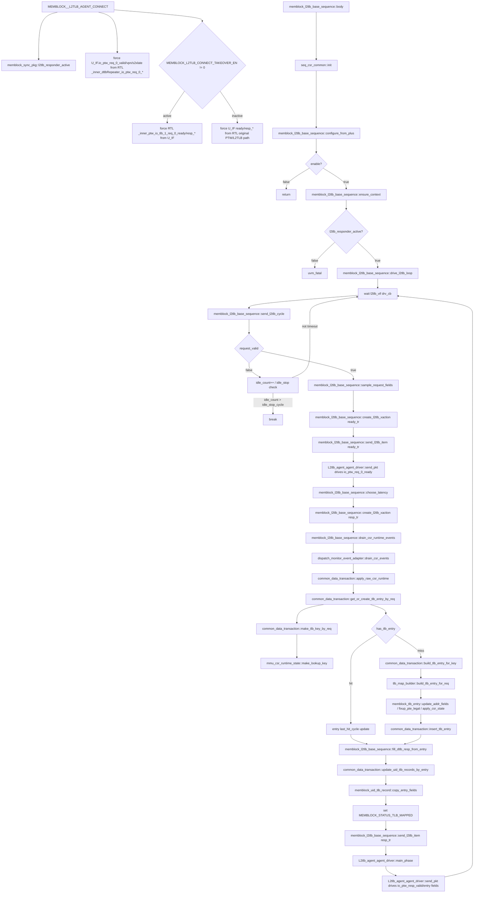

# mem_ut TLB/L2TLB responder flow

本文档说明 mem_ut 中 L2TLB responder 的真实函数调用链。当前 `L2TLB_agent` 是 DTLB 与 L2TLB 连接处的上游 responder：request 来自 DTLB，response 由 `L2TLB_agent` 回给 DTLB。它不是 L2TLB 到 L2Cache、PTW 或 memory 的下游访问模型。

## 1. 函数调用 Flow 图



### 1.1 函数调用 Flow 图整体文字伪代码

```text
TLB/L2TLB responder 主流程：

1. 连接阶段：
   MEMBLOCK__L2TLB_AGENT_CONNECT 创建 L2tlb_agent_agent_interface；
   把 DTLB request 信号 _inner_dtlbRepeater_io_ptw_req_0_valid/vpn/s2xlate force 到 interface；
   根据 MEMBLOCK_L2TLB_CONNECT_TAKEOVER_EN 设置 l2tlb_responder_active；
   如果 takeover active：
     把 interface 的 ready 和 resp_* force 回 RTL _inner_ptw_io_tlb_1_*；
     这表示 L2TLB_agent 接管 L2TLB 返回 DTLB 的 response 通路；
   如果 takeover inactive：
     interface 只观察原始 RTL ready/resp_*，sequence 如果仍启用会 fatal。

2. sequence 启动阶段：
   memblock_l2tlb_base_sequence::body 初始化 seq_csr_common；
   configure_from_plus 读取 MEMBLOCK_L2TLB_SEQ_EN、latency 和 idle_stop_cycle；
   如果 MEMBLOCK_L2TLB_SEQ_EN=0：
     直接返回，不响应 request；
   否则 ensure_context 获取 common_data_transaction、monitor_adapter 和 L2TLB vif；
   如果 l2tlb_responder_active=0：
     fatal，因为 sequence 无法合法把 response 回给 DTLB；
   否则进入 drive_l2tlb_loop。

3. request 轮询阶段：
   drive_l2tlb_loop 每个 l2tlb_vif.drv_cb 调 send_l2tlb_cycle；
   send_l2tlb_cycle 先检查 request_valid；
   request_valid 只要求 rst_n、reset_backend_done 和 io_ptw_req_0_valid 为 1；
   如果没有 request：
     has_progress=0，idle_count 递增；
     idle_count 超过 idle_stop_cycle 后退出 sequence；
   如果有 request：
     sample_request_fields 采 DTLB request 的 vpn/s2xlate；
     先发 ready_tr，把 io_ptw_req_0_ready 拉高一个 xaction；
     再创建 resp_tr，设置随机 pre_pkt_gap，并保留 request vpn/s2xlate 供 driver/xaction 追踪。

4. lookup/build 阶段：
   在查表前 drain_csr_runtime_events；
   drain_csr_runtime_events 只调用 drain_csr_events，不消费 sfence FIFO；
   common_data_transaction::get_or_create_tlb_entry_by_req 使用 request 的 vpn/s2xlate；
   make_tlb_key_by_req 调 mmu_csr_state.make_lookup_key，把 runtime CSR 中的 asid/vmid 合入 key；
   如果 tlb_entry_by_key 已有该 key：
     命中并更新 last_hit_cycle；
   如果没有该 key：
     build_tlb_entry_for_key 创建 tlb_map_builder；
     tlb_map_builder 按 vpn/s2xlate/runtime CSR 生成 memblock_tlb_entry；
     insert_tlb_entry 写入 tlb_entry_by_key。

5. response 回填阶段：
   fill_dtlb_resp_from_entry 把 entry 的 S1/S2 tag、ASID/VMID、PPN、权限、fault 和 index 字段填入 resp_tr；
   update_uid_tlb_records_by_entry 遍历 uid_tlb_record_by_uid；
   只回填 record_valid=1 且 pte_valid=0 且 key 完全匹配的 uid record；
   匹配 uid 的 record.copy_entry_fields 置 pte_valid=1；
   同时设置 MEMBLOCK_STATUS_TLB_MAPPED；
   如果没有任何 uid record 匹配，打印 UVM_ERROR，但 sequence 仍发送 response。

6. driver 发送阶段：
   send_l2tlb_item 用 start_item/finish_item 把 resp_tr 交给 L2tlb_agent_agent_driver；
   driver main_phase 根据 pre_pkt_gap 先 idle 若干拍；
   send_pkt 驱动 io_ptw_resp_valid 和所有 response entry 字段；
   connect takeover active 时，这些 interface 字段 force 回 DTLB/L2TLB response RTL 连接点。
```

## 2. `MEMBLOCK__L2TLB_AGENT_CONNECT`

源码位置：`mem_ut/ver/ut/memblock/tb/L2tlb_agent_connect.sv`

真实逻辑摘要：

```systemverilog
U_IF_NAME``_l2tlb_active = (`MEMBLOCK_L2TLB_CONNECT_TAKEOVER_EN != 0);
memblock_sync_pkg::l2tlb_responder_active = U_IF_NAME``_l2tlb_active;
...
force U_IF_NAME.io_ptw_req_0_valid = RTL_PATH._inner_dtlbRepeater_io_ptw_req_0_valid;
force U_IF_NAME.io_ptw_req_0_bits_vpn = RTL_PATH._inner_dtlbRepeater_io_ptw_req_0_bits_vpn;
force U_IF_NAME.io_ptw_req_0_bits_s2xlate = RTL_PATH._inner_dtlbRepeater_io_ptw_req_0_bits_s2xlate;
if(U_IF_NAME``_l2tlb_active) begin
    force RTL_PATH._inner_ptw_io_tlb_1_req_0_ready = U_IF_NAME.io_ptw_req_0_ready;
    force RTL_PATH._inner_ptw_io_tlb_1_resp_valid = U_IF_NAME.io_ptw_resp_valid;
    force RTL_PATH._inner_ptw_io_tlb_1_resp_bits_s2xlate = U_IF_NAME.io_ptw_resp_bits_s2xlate;
    ...
end else begin
    force U_IF_NAME.io_ptw_req_0_ready = RTL_PATH._inner_ptw_io_tlb_1_req_0_ready;
    force U_IF_NAME.io_ptw_resp_valid = RTL_PATH._inner_ptw_io_tlb_1_resp_valid;
    ...
end
```

功能解释：

该 connect 宏确认了 L2TLB agent 的语义边界：request 从 DTLB repeater 侧进入 agent interface；response 从 agent interface 返回给 DTLB/L2TLB response 连接点。takeover 关闭时，agent 只观察原 RTL response，不接管驱动。

输入/输出：

- 输入：`MEMBLOCK_L2TLB_CONNECT_TAKEOVER_EN`、RTL DTLB request 信号、原 RTL PTW/L2TLB response 信号。
- 输出：`memblock_sync_pkg::l2tlb_responder_active`；takeover active 时，agent driver 的 ready/resp 被 force 回 RTL。

文字伪代码：

```text
创建 L2tlb_agent_agent_interface；
把 vif 写入 uvm_config_db；
根据 MEMBLOCK_L2TLB_CONNECT_TAKEOVER_EN 设置本地 active 位；
把 active 位同步到 memblock_sync_pkg::l2tlb_responder_active；
清 interface ready/resp 默认值；
总是把 DTLB request valid/vpn/s2xlate force 到 interface；
如果 active=1：
  force RTL request ready 和 response 字段等于 interface；
否则：
  force interface ready/response 字段等于 RTL 原始路径；
```

内部子调用：

- 无函数子调用；该宏通过 force 建立连接和接管状态。

## 3. `memblock_l2tlb_base_sequence::body()`

源码位置：`mem_ut/ver/ut/memblock/seq/base_seq/memblock_l2tlb_base_sequence.sv`

真实逻辑摘要：

```systemverilog
task memblock_l2tlb_base_sequence::body();
    seq_csr_common::init();
    configure_from_plus();
    if (!enable) begin
        return;
    end
    ensure_context();
    if (!memblock_sync_pkg::l2tlb_responder_active) begin
        `uvm_fatal(get_type_name(),
                   "MEMBLOCK_L2TLB_SEQ_EN is enabled but L2TLB connect takeover is not active; enable compile macro MEMBLOCK_L2TLB_CONNECT_TAKEOVER_EN")
    end
    drive_l2tlb_loop();
endtask
```

功能解释：

L2TLB responder sequence 的主入口。它用 runtime plus 控制是否运行，用 compile-time takeover 状态确认 response 通路是否真的接管。

输入/输出：

- 输入：`MEMBLOCK_L2TLB_SEQ_EN`、latency/idle plus 配置、`l2tlb_responder_active`。
- 输出：disabled 时直接退出；enabled 且 takeover active 时进入 responder loop；enabled 但 takeover inactive 时 fatal。

文字伪代码：

```text
初始化 seq_csr_common；
调用 configure_from_plus：读取 sequence enable 和参数；
如果 enable=0：
  返回，不发送 ready/response；
调用 ensure_context：获取公共数据、adapter 和 vif；
如果 l2tlb_responder_active=0：
  fatal，避免 response 没有合法连接点；
调用 drive_l2tlb_loop：开始被动响应 DTLB request；
```

内部子调用：

- `configure_from_plus()`：读取 `seq_csr_common` 中的 L2TLB sequence 参数。
- `ensure_context()`：获取共享数据和 virtual interface。
- `drive_l2tlb_loop()`：循环等待 request。

## 4. `memblock_l2tlb_base_sequence::configure_from_plus()`

源码位置：`mem_ut/ver/ut/memblock/seq/base_seq/memblock_l2tlb_base_sequence.sv`

真实逻辑摘要：

```systemverilog
function void memblock_l2tlb_base_sequence::configure_from_plus();
    enable = seq_csr_common::get_l2tlb_seq_en();
    min_latency = seq_csr_common::get_l2tlb_min_latency();
    max_latency = seq_csr_common::get_l2tlb_max_latency();
    idle_stop_cycle = seq_csr_common::get_l2tlb_idle_stop_cycle();
endfunction
```

功能解释：

读取 L2TLB responder 的运行开关、response latency 随机范围和空闲退出阈值。

输入/输出：

- 输入：`seq_csr_common` 已初始化的 L2TLB 参数。
- 输出：成员变量 `enable/min_latency/max_latency/idle_stop_cycle`。

文字伪代码：

```text
读取 MEMBLOCK_L2TLB_SEQ_EN 到 enable；
读取 min/max latency；
读取 idle_stop_cycle；
```

内部子调用：

- `seq_csr_common::get_l2tlb_seq_en()`。
- `seq_csr_common::get_l2tlb_min_latency()`。
- `seq_csr_common::get_l2tlb_max_latency()`。
- `seq_csr_common::get_l2tlb_idle_stop_cycle()`。

## 5. `memblock_l2tlb_base_sequence::ensure_context()`

源码位置：`mem_ut/ver/ut/memblock/seq/base_seq/memblock_l2tlb_base_sequence.sv`

真实逻辑摘要：

```systemverilog
function void memblock_l2tlb_base_sequence::ensure_context();
    data = common_data_transaction::get();
    if (monitor_adapter == null) begin
        monitor_adapter = dispatch_monitor_event_adapter::type_id::create("monitor_adapter");
    end
    if (data == null) begin
        `uvm_fatal(get_type_name(), "failed to get common_data_transaction")
    end
    if (monitor_adapter == null) begin
        `uvm_fatal(get_type_name(), "failed to create dispatch_monitor_event_adapter")
    end
    if (!uvm_config_db#(virtual L2tlb_agent_agent_interface)::get(null, get_full_name(), "vif", l2tlb_vif) &&
        !uvm_config_db#(virtual L2tlb_agent_agent_interface)::get(null, "uvm_test_top.env.u_L2tlb_agent_agent*", "vif", l2tlb_vif)) begin
        `uvm_fatal(get_type_name(), "L2TLB virtual interface is not set")
    end
endfunction
```

功能解释：

建立 responder 所需上下文：公共数据表、monitor adapter 和 L2TLB virtual interface。

输入/输出：

- 输入：UVM config DB 中的 L2TLB vif。
- 输出：`data`、`monitor_adapter`、`l2tlb_vif` 成员可用；失败时 fatal。

文字伪代码：

```text
获取 common_data_transaction singleton；
如果 monitor_adapter 为空，创建 adapter；
如果 data 或 adapter 创建失败，fatal；
先按当前 sequence full_name 获取 vif；
如果失败，再按 env.u_L2tlb_agent_agent 通配路径获取 vif；
如果仍失败，fatal；
```

内部子调用：

- `common_data_transaction::get()`：返回共享数据 owner。
- `uvm_config_db::get()`：获取 agent interface。

## 6. `memblock_l2tlb_base_sequence::drive_l2tlb_loop()`

源码位置：`mem_ut/ver/ut/memblock/seq/base_seq/memblock_l2tlb_base_sequence.sv`

真实逻辑摘要：

```systemverilog
idle_count = 0;
send_count = 0;
forever begin
    bit has_progress;

    @(l2tlb_vif.drv_cb);
    send_l2tlb_cycle(send_count, has_progress);
    if (has_progress) begin
        send_count++;
        idle_count = 0;
    end else begin
        idle_count++;
        if (idle_count > idle_stop_cycle) begin
            break;
        end
    end
end
```

功能解释：

被动 responder loop。它不预知 request 总数，只按连续 idle 周期退出；每处理一个 request，`send_count` 增加并清空 idle 计数。

输入/输出：

- 输入：`l2tlb_vif.drv_cb`、`idle_stop_cycle`。
- 输出：周期性调用 `send_l2tlb_cycle()`；空闲超时后退出。

文字伪代码：

```text
idle_count=0；
send_count=0；
永久循环：
  等待 l2tlb_vif.drv_cb；
  调用 send_l2tlb_cycle；
  如果 has_progress=1：
    send_count++；
    idle_count=0；
  否则：
    idle_count++；
    如果 idle_count > idle_stop_cycle：
      打印日志并退出循环；
```

内部子调用：

- `send_l2tlb_cycle()`：单拍 request 检查、查表、回包。

## 7. `memblock_l2tlb_base_sequence::send_l2tlb_cycle()`

源码位置：`mem_ut/ver/ut/memblock/seq/base_seq/memblock_l2tlb_base_sequence.sv`

真实逻辑摘要：

```systemverilog
has_progress = 1'b0;
if (request_valid()) begin
    sample_request_fields(vpn, s2xlate);
    ready_tr = create_l2tlb_xaction($sformatf("l2tlb_ready_tr_send_%0d", send_count));
    ready_tr.io_ptw_req_0_ready = 1'b1;
    send_l2tlb_item(ready_tr);
    latency = choose_latency();
    resp_tr = create_l2tlb_xaction($sformatf("l2tlb_resp_tr_send_%0d", send_count));
    resp_tr.pre_pkt_gap = latency;
    resp_tr.io_ptw_req_0_valid = 1'b1;
    resp_tr.io_ptw_req_0_bits_vpn = vpn;
    resp_tr.io_ptw_req_0_bits_s2xlate = s2xlate;
    drain_csr_runtime_events();
    if (data.get_or_create_tlb_entry_by_req(vpn, s2xlate, key, entry, created)) begin
        fill_dtlb_resp_from_entry(entry, resp_tr);
        record_update_count = data.update_uid_tlb_records_by_entry(key, entry);
    end else begin
        `uvm_fatal(get_type_name(), $sformatf("L2TLB entry miss for vpn=0x%0h s2xlate=%0d", vpn, s2xlate))
    end
    send_l2tlb_item(resp_tr);
    has_progress = 1'b1;
end
```

功能解释：

单个 request 的完整处理函数。它从 DTLB request 中采 `vpn/s2xlate`，先发送 ready，再基于 runtime CSR 查找或创建 TLB entry，填充 response transaction，回填 uid record，最后把 response 交给 driver。

输入/输出：

- 输入：DTLB request `io_ptw_req_0_valid/bits_vpn/bits_s2xlate`、runtime CSR、`tlb_entry_by_key`。
- 输出：`io_ptw_req_0_ready` xaction、`io_ptw_resp_*` xaction、`uid_tlb_record_by_uid` 回填、`MEMBLOCK_STATUS_TLB_MAPPED`。

文字伪代码：

```text
默认 has_progress=0；
如果 request_valid=0：
  直接返回，让外层 idle_count 增加；
如果 request_valid=1：
  调用 sample_request_fields：采 vpn/s2xlate；
  创建 ready_tr，并将 io_ptw_req_0_ready=1；
  send_l2tlb_item ready_tr：让 driver 对 DTLB request 给 ready；
  调用 choose_latency：选择 response 前等待拍数；
  创建 resp_tr，设置 pre_pkt_gap；
  在 resp_tr 中保存本次 request 的 valid/vpn/s2xlate；
  调用 drain_csr_runtime_events：只同步 latest CSR；
  调用 data.get_or_create_tlb_entry_by_req：
    用 vpn/s2xlate/runtime CSR 构造 key；
    hit 则取 live entry；
    miss 则创建并插入 entry；
  如果查表/建表成功：
    fill_dtlb_resp_from_entry：把 entry 填到 response 字段；
    update_uid_tlb_records_by_entry：回填所有匹配 uid record；
  否则：
    fatal；
  send_l2tlb_item resp_tr：把 response 交给 driver；
  has_progress=1；
```

内部子调用：

- `request_valid()`：判断是否有 DTLB request。
- `sample_request_fields()`：采 request `vpn/s2xlate`。
- `create_l2tlb_xaction()` / `clear_l2tlb_xaction()`：创建并清空 transaction。
- `send_l2tlb_item()`：交给 sequencer/driver。
- `choose_latency()`：随机 response latency。
- `drain_csr_runtime_events()`：更新 CSR runtime。
- `common_data_transaction::get_or_create_tlb_entry_by_req()`：按 key 查表或建表。
- `fill_dtlb_resp_from_entry()`：填 response payload。
- `common_data_transaction::update_uid_tlb_records_by_entry()`：回填 uid record。

## 8. `memblock_l2tlb_base_sequence::request_valid()`

源码位置：`mem_ut/ver/ut/memblock/seq/base_seq/memblock_l2tlb_base_sequence.sv`

真实逻辑摘要：

```systemverilog
function bit memblock_l2tlb_base_sequence::request_valid();
    if (l2tlb_vif == null) begin
        return 1'b0;
    end
    return l2tlb_vif.rst_n === 1'b1 &&
           memblock_sync_pkg::reset_backend_done === 1'b1 &&
           l2tlb_vif.io_ptw_req_0_valid === 1'b1;
endfunction
```

功能解释：

判断 DTLB 是否正在发起 L2TLB request。当前 sequence 用 valid 判断是否需要响应，并随后主动发送 ready。

输入/输出：

- 输入：`l2tlb_vif`、`rst_n`、`reset_backend_done`、`io_ptw_req_0_valid`。
- 输出：是否进入本轮 responder 处理。

文字伪代码：

```text
如果 vif 为空：
  返回 0；
如果 rst_n=1 且 reset_backend_done=1 且 io_ptw_req_0_valid=1：
  返回 1；
否则返回 0；
```

内部子调用：

- 无。

## 9. `memblock_l2tlb_base_sequence::sample_request_fields()`

源码位置：`mem_ut/ver/ut/memblock/seq/base_seq/memblock_l2tlb_base_sequence.sv`

真实逻辑摘要：

```systemverilog
function void memblock_l2tlb_base_sequence::sample_request_fields(output bit [37:0] vpn,
                                                                  output bit [1:0] s2xlate);
    vpn = l2tlb_vif.io_ptw_req_0_bits_vpn;
    s2xlate = l2tlb_vif.io_ptw_req_0_bits_s2xlate;
endfunction
```

功能解释：

从 DTLB request 采样 lookup 所需字段。当前 request 不携带 `paddr`，lookup 不能基于 `paddr`。

输入/输出：

- 输入：`io_ptw_req_0_bits_vpn`、`io_ptw_req_0_bits_s2xlate`。
- 输出：`vpn`、`s2xlate`。

文字伪代码：

```text
vpn = interface request vpn；
s2xlate = interface request s2xlate；
```

内部子调用：

- 无。

## 10. `memblock_l2tlb_base_sequence::drain_csr_runtime_events()`

源码位置：`mem_ut/ver/ut/memblock/seq/base_seq/memblock_l2tlb_base_sequence.sv`

真实逻辑摘要：

```systemverilog
function void memblock_l2tlb_base_sequence::drain_csr_runtime_events();
    ensure_context();
    monitor_adapter.drain_csr_events();
endfunction
```

功能解释：

在 L2TLB lookup 前同步最新 CSR runtime。该函数只 drain CSR latest snapshot，不消费 `raw_sfence_q`。

输入/输出：

- 输入：`latest_raw_csr`。
- 输出：可能更新 `common_data_transaction::mmu_csr_state`。

文字伪代码：

```text
确保 data、adapter、vif 可用；
调用 monitor_adapter.drain_csr_events：
  如果 latest CSR 有新 seq，则更新 mmu_csr_state；
  不调用 drain_sfence_events；
```

内部子调用：

- `ensure_context()`：保证 adapter 可用。
- `dispatch_monitor_event_adapter::drain_csr_events()`：CSR latest snapshot 消费入口。

## 11. `common_data_transaction::get_or_create_tlb_entry_by_req()`

源码位置：`mem_ut/ver/ut/memblock/seq/base_seq_help/common_data_transaction.sv`

真实逻辑摘要：

```systemverilog
function bit get_or_create_tlb_entry_by_req(input bit [37:0] vpn,
                                            input bit [1:0] s2xlate,
                                            output memblock_tlb_lookup_key_t key,
                                            output memblock_tlb_entry entry,
                                            output bit created);
    key = make_tlb_key_by_req(vpn, s2xlate);
    if (has_tlb_entry(key)) begin
        entry = tlb_entry_by_key[key];
        entry.last_hit_cycle = memblock_sync_pkg::get_dispatch_service_cycle();
        created = 1'b0;
        return 1'b1;
    end
    entry = build_tlb_entry_for_key(key);
    insert_tlb_entry(key, entry);
    created = 1'b1;
    return 1'b1;
endfunction
```

功能解释：

L2TLB responder 的核心 lookup API。它用 request `vpn/s2xlate` 和 runtime CSR 生成 key，命中则复用 live entry，miss 则创建新 entry。

输入/输出：

- 输入：DTLB request 的 `vpn/s2xlate`、当前 `mmu_csr_state`。
- 输出：`key`、`entry`、`created`；可能新增 `tlb_entry_by_key[key]`。

文字伪代码：

```text
调用 make_tlb_key_by_req：由 vpn/s2xlate/runtime CSR 生成 key；
如果 has_tlb_entry(key)=1：
  entry = tlb_entry_by_key[key]；
  更新 entry.last_hit_cycle；
  created=0；
  返回成功；
否则：
  调用 build_tlb_entry_for_key：生成新 entry；
  调用 insert_tlb_entry：写入 tlb_entry_by_key；
  created=1；
  返回成功；
```

内部子调用：

- `make_tlb_key_by_req()`：生成 `{vpn,asid,vmid,s2xlate}` key。
- `has_tlb_entry()`：检查 live entry 是否存在且非 null。
- `build_tlb_entry_for_key()`：miss 时创建 entry。
- `insert_tlb_entry()`：写入 by-key TLB cache。

## 12. `common_data_transaction::make_tlb_key_by_req()`

源码位置：`mem_ut/ver/ut/memblock/seq/base_seq_help/common_data_transaction.sv`

真实逻辑摘要：

```systemverilog
function memblock_tlb_lookup_key_t make_tlb_key_by_req(input bit [37:0] vpn,
                                                       input bit [1:0] s2xlate);
    if (mmu_csr_state == null) begin
        mmu_csr_state = mmu_csr_runtime_state::type_id::create("mmu_csr_state");
        mmu_csr_state.reset();
    end
    return mmu_csr_state.make_lookup_key({26'b0, vpn}, s2xlate);
endfunction
```

功能解释：

把 DTLB request 的 `vpn/s2xlate` 转换成公共 TLB key。ASID/VMID 不是 request 直接携带，而是从当前 runtime CSR 镜像中派生。

输入/输出：

- 输入：`vpn[37:0]`、`s2xlate`。
- 输出：`memblock_tlb_lookup_key_t`。

文字伪代码：

```text
如果 mmu_csr_state 为空：
  创建并 reset；
将 38-bit vpn 扩展为 52-bit key.vpn 输入；
调用 mmu_csr_state.make_lookup_key：
  根据 s2xlate 选择当前 ASID/VMID；
返回 key；
```

内部子调用：

- `mmu_csr_runtime_state::make_lookup_key()`：填充 key 的 `vpn/asid/vmid/s2xlate`。

## 13. `mmu_csr_runtime_state::make_lookup_key()`

源码位置：`mem_ut/ver/ut/memblock/seq/base_seq_help/mmu_csr_runtime_state.sv`

真实逻辑摘要：

```systemverilog
function memblock_tlb_lookup_key_t make_lookup_key(input bit [63:0] vpn,
                                                   input bit [1:0] s2xlate);
    memblock_tlb_lookup_key_t key;

    key.vpn     = vpn[51:0];
    key.asid    = current_asid(s2xlate);
    key.vmid    = current_vmid(s2xlate);
    key.s2xlate = s2xlate;
    return key;
endfunction
```

功能解释：

runtime CSR key 生成函数。`current_asid()` 与 `current_vmid()` 按翻译阶段决定 ASID/VMID 是否有效。

输入/输出：

- 输入：扩展后的 VPN 和 DTLB request `s2xlate`。
- 输出：完整 lookup key。

文字伪代码：

```text
key.vpn = vpn[51:0]；
key.asid = current_asid(s2xlate)：
  s2xlate=0 用 satp_asid；
  s2xlate=1 或 3 用 vsatp_asid；
  s2xlate=2 用 0；
key.vmid = current_vmid(s2xlate)：
  s2xlate=2 或 3 用 hgatp_vmid；
  其它为 0；
key.s2xlate = request s2xlate；
返回 key；
```

内部子调用：

- `current_asid()`：按 s2xlate 返回 satp/vsatp ASID 或 0。
- `current_vmid()`：按 s2xlate 返回 hgatp VMID 或 0。

## 14. `common_data_transaction::build_tlb_entry_for_key()`

源码位置：`mem_ut/ver/ut/memblock/seq/base_seq_help/common_data_transaction.sv`

真实逻辑摘要：

```systemverilog
function memblock_tlb_entry build_tlb_entry_for_key(input memblock_tlb_lookup_key_t key);
    memblock_tlb_entry entry;
    tlb_map_builder    builder;

    builder = tlb_map_builder::type_id::create("tlb_builder_by_key");
    if (builder == null) begin
        `uvm_fatal("COMMON_DATA", "failed to create tlb_map_builder")
    end
    entry = builder.build_tlb_entry_for_req(key.vpn[37:0], key.s2xlate, mmu_csr_state);
    entry.lookup_key = key;
    entry.asid = key.asid;
    entry.vmid = key.vmid;
    entry.s2xlate = key.s2xlate;
    return entry;
endfunction
```

功能解释：

lookup miss 时创建 TLB entry。builder 使用 key 中的 request 语义和当前 CSR state 生成 entry，再用 key 覆盖 entry 的索引字段。

输入/输出：

- 输入：`memblock_tlb_lookup_key_t key`。
- 输出：新建的 `memblock_tlb_entry`。

文字伪代码：

```text
创建 tlb_map_builder；
如果创建失败，fatal；
调用 builder.build_tlb_entry_for_req：
  输入 key.vpn[37:0]、key.s2xlate 和 mmu_csr_state；
将 entry.lookup_key/asid/vmid/s2xlate 设置为 key；
返回 entry；
```

内部子调用：

- `tlb_map_builder::build_tlb_entry_for_req()`：生成地址、PTE、CSR 派生字段。

## 15. `tlb_map_builder::build_tlb_entry_for_req()`

源码位置：`mem_ut/ver/ut/memblock/seq/base_seq_help/tlb_map_builder.sv`

真实逻辑摘要：

```systemverilog
function memblock_tlb_entry build_tlb_entry_for_req(input bit [37:0] vpn,
                                                    input bit [1:0] s2xlate,
                                                    input mmu_csr_runtime_state csr_state);
    memblock_tlb_entry entry;
    bit [63:0]         vaddr;

    if (csr_state == null) begin
        `uvm_fatal("TLB_BUILDER", "build_tlb_entry_for_req got null csr_state")
    end
    entry = memblock_tlb_entry::type_id::create($sformatf("tlb_entry_%0h_%0d", vpn, s2xlate));
    entry.reset();
    vaddr = {14'b0, vpn, 12'b0};
    entry.update_addr_fields(vaddr, choose_paddr(vaddr));
    randomize_pte_bits(entry);
    entry.fixup_pte_legal(memblock_tlb_entry::MEMBLOCK_TLB_ACCESS_UNKNOWN);
    entry.apply_csr_state(csr_state, s2xlate);
    entry.create_cycle = memblock_sync_pkg::get_dispatch_service_cycle();
    entry.last_hit_cycle = entry.create_cycle;
    return entry;
endfunction
```

功能解释：

为 DTLB request 创建可回包的 TLB entry。它从 VPN 生成虚拟地址，选择物理地址，随机/修正 PTE 字段，应用 runtime CSR context，并记录创建周期。

输入/输出：

- 输入：request `vpn/s2xlate`、`mmu_csr_runtime_state`。
- 输出：`memblock_tlb_entry`，包含 PPN、权限、fault、level、lookup key 等 response 所需字段。

文字伪代码：

```text
如果 csr_state=null：
  fatal；
创建 memblock_tlb_entry；
reset entry；
vaddr = {14'b0, vpn, 12'b0}；
调用 choose_paddr：按 PADDR_BASE/PADDR_RANGE 和 vpn mix 生成 paddr；
entry.update_addr_fields：填 vaddr/paddr/vpn/ppn/addr_low/index 字段；
randomize_pte_bits：按 seq_csr_common 权重生成 PTE 位；
entry.fixup_pte_legal：根据 PTE mode 修正 A/D/R/W/X 等组合；
entry.apply_csr_state：用 csr_state 和 s2xlate 生成 lookup_key/asid/vmid/priv_mode；
记录 create_cycle 和 last_hit_cycle；
返回 entry；
```

内部子调用：

- `choose_paddr()`：从配置的物理地址范围选择 paddr。
- `randomize_pte_bits()`：按权重生成 PTE bit。
- `memblock_tlb_entry::update_addr_fields()`：派生 VPN/PPN/index。
- `memblock_tlb_entry::fixup_pte_legal()`：修正 PTE 合法性。
- `memblock_tlb_entry::apply_csr_state()`：应用 CSR runtime context。

## 16. `common_data_transaction::insert_tlb_entry()`

源码位置：`mem_ut/ver/ut/memblock/seq/base_seq_help/common_data_transaction.sv`

真实逻辑摘要：

```systemverilog
function void insert_tlb_entry(input memblock_tlb_lookup_key_t key,
                               input memblock_tlb_entry entry);
    if (entry == null) begin
        `uvm_fatal("COMMON_DATA", "insert_tlb_entry got null entry")
    end
    entry.lookup_key = key;
    entry.asid       = key.asid;
    entry.vmid       = key.vmid;
    entry.s2xlate    = key.s2xlate;
    tlb_entry_by_key[key] = entry;
endfunction
```

功能解释：

把新 entry 写入 live TLB cache。key 是后续 L2TLB request hit 和 sfence invalidation 的共同索引。

输入/输出：

- 输入：`key`、`entry`。
- 输出：`tlb_entry_by_key[key] = entry`。

文字伪代码：

```text
如果 entry=null：
  fatal；
确保 entry.lookup_key/asid/vmid/s2xlate 与 key 一致；
写入 tlb_entry_by_key[key]；
```

内部子调用：

- 无。

## 17. `memblock_l2tlb_base_sequence::fill_dtlb_resp_from_entry()`

源码位置：`mem_ut/ver/ut/memblock/seq/base_seq/memblock_l2tlb_base_sequence.sv`

真实逻辑摘要：

```systemverilog
function void memblock_l2tlb_base_sequence::fill_dtlb_resp_from_entry(input memblock_tlb_entry entry,
                                                                      ref L2tlb_agent_agent_xaction resp);
    if (resp == null || entry == null) begin
        `uvm_fatal(get_type_name(), "fill_dtlb_resp_from_entry got null input")
    end

    resp.io_ptw_resp_valid = 1'b1;
    resp.io_ptw_resp_bits_s2xlate = entry.s2xlate;
    resp.io_ptw_resp_bits_s1_entry_tag = entry.lookup_key.vpn[34:0];
    resp.io_ptw_resp_bits_s1_entry_asid = entry.asid[15:0];
    resp.io_ptw_resp_bits_s1_entry_vmid = entry.vmid[13:0];
    resp.io_ptw_resp_bits_s1_entry_perm_g = entry.pte_g;
    resp.io_ptw_resp_bits_s1_entry_ppn = entry.ppn[40:0];
    ...
    resp.io_ptw_resp_bits_s2_entry_tag = entry.lookup_key.vpn[37:0];
    resp.io_ptw_resp_bits_s2_entry_vmid = entry.vmid[13:0];
    resp.io_ptw_resp_bits_s2_entry_ppn = entry.ppn[37:0];
    resp.io_ptw_resp_bits_s2_gpf = entry.tlbGPF;
    resp.io_ptw_resp_bits_s2_gaf = 1'b0;
endfunction
```

功能解释：

把 `memblock_tlb_entry` 转换成 DTLB 可接收的 L2TLB response xaction。字段包括 S1/S2 entry tag、ASID/VMID、权限、PPN、level、fault、AF/PF 和 index 辅助字段。

输入/输出：

- 输入：`memblock_tlb_entry entry`。
- 输出：`L2tlb_agent_agent_xaction resp` 的 `io_ptw_resp_*` 字段。

文字伪代码：

```text
如果 resp 或 entry 为空：
  fatal；
置 io_ptw_resp_valid=1；
复制 s2xlate；
填 S1 entry：
  tag=entry.lookup_key.vpn[34:0]；
  asid/vmid=entry.asid/entry.vmid；
  n/pbmt/perm/level/v/ppn 来自 entry；
  addr_low、ppn_low、valididx、pteidx 来自 entry 派生字段；
  pf=entry.tlbPF；
  af=entry.tlbAF 或 entry.pmaAF；
填 S2 entry：
  tag=entry.lookup_key.vpn[37:0]；
  vmid、n、pbmt、ppn、perm、level 来自 entry；
  gpf=entry.tlbGPF；
  gaf 固定为 0；
```

内部子调用：

- 无。

## 18. `common_data_transaction::update_uid_tlb_records_by_entry()`

源码位置：`mem_ut/ver/ut/memblock/seq/base_seq_help/common_data_transaction.sv`

真实逻辑摘要：

```systemverilog
function int unsigned update_uid_tlb_records_by_entry(input memblock_tlb_lookup_key_t key,
                                                      input memblock_tlb_entry entry);
    int unsigned match_count;

    if (entry == null) begin
        `uvm_fatal("COMMON_DATA", "update_uid_tlb_records_by_entry got null entry")
    end
    match_count = 0;
    foreach (uid_tlb_record_by_uid[uid]) begin
        memblock_uid_tlb_record record;

        record = uid_tlb_record_by_uid[uid];
        if (record == null || !record.record_valid || record.pte_valid) begin
            continue;
        end
        if (record.vpn == key.vpn &&
            record.s2xlate == key.s2xlate &&
            record.asid == key.asid &&
            record.vmid == key.vmid) begin
            record.copy_entry_fields(entry);
            set_status_field(record.uid, MEMBLOCK_STATUS_TLB_MAPPED, 1'b1);
            match_count++;
        end
    end
    if (match_count == 0) begin
        `uvm_error("COMMON_DATA", "no pending uid_tlb_record matches TLB key ...")
    end
    return match_count;
endfunction
```

功能解释：

L2TLB response 生成后，按 key 回填所有等待该 TLB entry 的 uid record。多个 uid 可以共享同一个 `{vpn,asid,vmid,s2xlate}` entry。

输入/输出：

- 输入：lookup `key`、live `entry`、`uid_tlb_record_by_uid`。
- 输出：匹配 record 的 PTE 字段被复制，`pte_valid=1`；对应 uid 的 `MEMBLOCK_STATUS_TLB_MAPPED=1`。

文字伪代码：

```text
如果 entry=null：
  fatal；
match_count=0；
遍历 uid_tlb_record_by_uid：
  如果 record=null 或 record_valid=0：
    跳过；
  如果 record.pte_valid=1：
    跳过，避免重复回填；
  如果 record 的 vpn/s2xlate/asid/vmid 全部等于 key：
    调用 record.copy_entry_fields：复制 entry 的 PPN/PTE/fault/level 等字段并置 pte_valid；
    调用 set_status_field：置 MEMBLOCK_STATUS_TLB_MAPPED；
    match_count++；
如果 match_count=0：
  打印 UVM_ERROR，表示当前 response 没有等待中的 uid record；
返回 match_count；
```

内部子调用：

- `memblock_uid_tlb_record::copy_entry_fields()`：复制 entry 字段并置 `pte_valid`。
- `set_status_field()`：更新 uid 状态表。

## 19. `memblock_uid_tlb_record::copy_entry_fields()`

源码位置：`mem_ut/ver/ut/memblock/seq/base_seq_help/memblock_tlb_entry.sv`

真实逻辑摘要：

```systemverilog
function void copy_entry_fields(input memblock_tlb_entry entry);
    if (entry == null) begin
        `uvm_fatal("UID_TLB_RECORD", "copy_entry_fields got null entry")
    end
    lookup_key       = entry.lookup_key;
    asid             = entry.asid;
    vmid             = entry.vmid;
    s2xlate          = entry.s2xlate;
    vpn              = entry.lookup_key.vpn;
    paddr            = entry.paddr;
    ppn              = entry.ppn;
    pte_r            = entry.pte_r;
    ...
    level            = entry.level;
    pte_valid        = 1'b1;
    pte_update_cycle = memblock_sync_pkg::get_dispatch_service_cycle();
endfunction
```

功能解释：

把 live TLB entry 的最终 PTE/PPN/fault 信息复制到 uid record，作为该 uid 已等到 L2TLB response 的证据。

输入/输出：

- 输入：`memblock_tlb_entry entry`。
- 输出：record 字段更新，`pte_valid=1`，`pte_update_cycle` 更新。

文字伪代码：

```text
如果 entry=null：
  fatal；
复制 lookup_key、asid、vmid、s2xlate、vpn；
复制 paddr/ppn；
复制所有 PTE permission、fault、pbmt、level 字段；
pte_valid=1；
pte_update_cycle=当前 dispatch_service_cycle；
```

内部子调用：

- `memblock_sync_pkg::get_dispatch_service_cycle()`：记录回填周期。

## 20. `memblock_l2tlb_base_sequence::send_l2tlb_item()`

源码位置：`mem_ut/ver/ut/memblock/seq/base_seq/memblock_l2tlb_base_sequence.sv`

真实逻辑摘要：

```systemverilog
task memblock_l2tlb_base_sequence::send_l2tlb_item(input L2tlb_agent_agent_xaction tr);
    if (tr == null) begin
        `uvm_fatal(get_type_name(), "send_l2tlb_item got null xaction")
    end
    start_item(tr);
    finish_item(tr);
endtask
```

功能解释：

把 ready 或 response xaction 交给 L2TLB agent sequencer/driver。

输入/输出：

- 输入：`L2tlb_agent_agent_xaction tr`。
- 输出：driver 的 `seq_item_port` 后续可取到该 item。

文字伪代码：

```text
如果 tr=null：
  fatal；
start_item；
finish_item；
```

内部子调用：

- `start_item()` / `finish_item()`：标准 UVM sequence item 发送。

## 21. `L2tlb_agent_agent_driver::main_phase()`

源码位置：`mem_ut/ver/ut/memblock/agent/L2tlb_agent_agent/src/L2tlb_agent_agent_driver.sv`

真实逻辑摘要：

```systemverilog
if(this.cfg.sqr_sw==tcnt_dec_base::ON && this.cfg.drv_sw==tcnt_dec_base::ON) begin
    while(1) begin
        seq_item_port.try_next_item(req);
        if(req!=null) begin
            repeat(req.pre_pkt_gap) begin
                @this.vif.drv_mp.drv_cb;
                this.drive_idle(this.cfg.drv_mode);
            end
            @this.vif.drv_mp.drv_cb;
            this.send_pkt(req);
            repeat(req.post_pkt_gap) begin
                @this.vif.drv_mp.drv_cb;
                this.drive_idle(this.cfg.drv_mode);
            end
            seq_item_port.item_done();
        end
        else begin
            @this.vif.drv_mp.drv_cb;
            this.drive_idle(this.cfg.drv_mode);
        end
    end
end
```

功能解释：

L2TLB agent driver 的主循环。它从 sequencer 拉取 ready/response item，按 `pre_pkt_gap/post_pkt_gap` 插入 idle，再调用 `send_pkt()` 驱动 interface。

输入/输出：

- 输入：sequence 发送的 `L2tlb_agent_agent_xaction`。
- 输出：interface 上的 `io_ptw_req_0_ready` 和 `io_ptw_resp_*`。

文字伪代码：

```text
如果 sqr_sw 和 drv_sw 都打开：
  永久循环：
    try_next_item；
    如果拿到 req：
      pre_pkt_gap 期间每拍 drive_idle；
      下一拍调用 send_pkt 驱动 req；
      post_pkt_gap 期间每拍 drive_idle；
      item_done；
    如果没有 req：
      等一拍并 drive_idle；
如果 sqr_sw=OFF 且 drv_sw=ON：
  fatal，要求提供 driver send task；
```

内部子调用：

- `drive_idle()`：空闲周期默认驱动。
- `send_pkt()`：真实驱动 ready/response 字段。

## 22. `L2tlb_agent_agent_driver::send_pkt()`

源码位置：`mem_ut/ver/ut/memblock/agent/L2tlb_agent_agent/src/L2tlb_agent_agent_driver.sv`

真实逻辑摘要：

```systemverilog
task L2tlb_agent_agent_driver::send_pkt(L2tlb_agent_agent_xaction tr);
    vif.drv_mp.drv_cb.io_ptw_req_0_ready <= tr.io_ptw_req_0_ready;
    vif.drv_mp.drv_cb.io_ptw_resp_valid <= tr.io_ptw_resp_valid;
    vif.drv_mp.drv_cb.io_ptw_resp_bits_s2xlate <= tr.io_ptw_resp_bits_s2xlate;
    vif.drv_mp.drv_cb.io_ptw_resp_bits_s1_entry_tag <= tr.io_ptw_resp_bits_s1_entry_tag;
    ...
    vif.drv_mp.drv_cb.io_ptw_resp_bits_s2_entry_level <= tr.io_ptw_resp_bits_s2_entry_level;
    vif.drv_mp.drv_cb.io_ptw_resp_bits_s2_gpf <= tr.io_ptw_resp_bits_s2_gpf;
    vif.drv_mp.drv_cb.io_ptw_resp_bits_s2_gaf <= tr.io_ptw_resp_bits_s2_gaf;
endtask
```

功能解释：

把 xaction 的 ready/response 字段驱动到 `L2tlb_agent_agent_interface`。connect takeover active 时，这些字段再被 force 回 DUT 的 DTLB/L2TLB response 连接点。

输入/输出：

- 输入：`L2tlb_agent_agent_xaction tr`。
- 输出：interface driver clocking block 上的 ready/resp。

文字伪代码：

```text
驱动 io_ptw_req_0_ready；
驱动 io_ptw_resp_valid；
驱动 s2xlate；
逐字段驱动 S1 entry tag/asid/vmid/permission/level/v/ppn/index/pf/af；
逐字段驱动 S2 entry tag/vmid/permission/level/gpf/gaf；
```

内部子调用：

- 无。

## 23. `L2tlb_agent_agent_driver::drive_idle()`

源码位置：`mem_ut/ver/ut/memblock/agent/L2tlb_agent_agent/src/L2tlb_agent_agent_driver.sv`

真实逻辑摘要：

```systemverilog
if(drv_mode==tcnt_dec_base::DRV_0) begin
    vif.drv_mp.drv_cb.io_ptw_req_0_ready <= memblock_sync_pkg::l2tlb_responder_active ? '0 : '1;
    vif.drv_mp.drv_cb.io_ptw_resp_valid <= '0;
    ...
end
else if(drv_mode==tcnt_dec_base::DRV_1) begin
    vif.drv_mp.drv_cb.io_ptw_req_0_ready <= '1;
    vif.drv_mp.drv_cb.io_ptw_resp_valid <= '1;
    ...
end
```

功能解释：

空闲周期默认驱动。正常 `DRV_0` 下，takeover active 时 idle ready 为 0，避免没有 sequence item 时误接收 request；takeover inactive 时 idle ready 为 1，保持观察/透传场景下 interface 不阻断。

输入/输出：

- 输入：driver mode、`l2tlb_responder_active`。
- 输出：idle ready/resp 默认值。

文字伪代码：

```text
如果 drv_mode=DRV_0：
  如果 l2tlb_responder_active=1：
    idle ready=0；
  否则：
    idle ready=1；
  response valid 和 payload 清 0；
如果 drv_mode=DRV_1：
  ready、response valid 和 payload 驱 1；
其它模式按 driver 模板后续分支处理；
```

内部子调用：

- 无。

## 24. 队列和状态说明

| 队列/状态 | 写入者 | 消费者 | 元素/字段含义 | 删除或更新条件 |
|---|---|---|---|---|
| `memblock_sync_pkg::l2tlb_responder_active` | `MEMBLOCK__L2TLB_AGENT_CONNECT` | `memblock_l2tlb_base_sequence::body()`、driver `drive_idle()` | connect takeover 是否 active | 仿真初始根据 `MEMBLOCK_L2TLB_CONNECT_TAKEOVER_EN` 设置 |
| `latest_raw_csr/latest_raw_csr_seq` | CSR monitor via `push_raw_csr()` | `drain_csr_runtime_events()` -> `drain_csr_events()` | 最新 CSR runtime snapshot | L2TLB lookup 前按 seq 去重应用；不作为 FIFO |
| `mmu_csr_state` | `apply_raw_csr_runtime()` | `make_tlb_key_by_req()` | 当前 ASID/VMID/priv/runtime CSR | raw CSR seq 更新时刷新；sfence 不直接更新 |
| `tlb_entry_by_key[key]` | `insert_tlb_entry()` | `get_or_create_tlb_entry_by_req()`、sfence flow | live TLB entry cache，key 为 `{vpn,asid,vmid,s2xlate}` | lookup miss 时插入；sfence/hfence 匹配时删除 |
| `uid_tlb_record_by_uid[uid]` | issue path 预登记；L2TLB response 回填 | `update_uid_tlb_records_by_entry()`、PTW wait/replay | uid 发射时的 TLB context 和 response 后 PTE 信息 | record 回填后 `pte_valid=1`；sfence 不删除 |
| `ptw_wait_replay_q[$]` | replay handler | `pop_ready_ptw_wait_replay()` | 等待 L2TLB response done 或 timeout 的 replay 项 | 当 `tlb_entry_ready_for_uid()` 或 timeout 满足时出队 |
| sequence item queue | `send_l2tlb_item()` | `L2tlb_agent_agent_driver::main_phase()` | ready_tr 或 resp_tr | driver `item_done()` 后消费完成 |

## 25. 分支优先级

- connect 优先级：`MEMBLOCK_L2TLB_CONNECT_TAKEOVER_EN` 决定 response 是否由 agent 接管；runtime `MEMBLOCK_L2TLB_SEQ_EN` 只决定 sequence 是否运行。
- sequence 启动优先级：`enable=0` 直接 return；`enable=1` 但 `l2tlb_responder_active=0` 直接 fatal；只有二者都满足才进入 loop。
- request 处理优先级：`request_valid()` 为 false 时不查表、不发 response；连续 idle 超过 `idle_stop_cycle` 后退出。
- ready/response 顺序：源码先发送 `ready_tr`，再创建并延迟发送 `resp_tr`。
- CSR 与 sfence 优先级：L2TLB lookup 前只同步 CSR latest snapshot，不消费 sfence FIFO；sfence FIFO 消费由 dispatch service 的 runtime context flow 显式处理。
- lookup 优先级：先按 request `vpn/s2xlate` 和 runtime CSR 生成 key；`has_tlb_entry()` hit 优先复用 live entry；miss 才 build/insert。
- uid record 回填优先级：只回填 `record_valid=1 && pte_valid=0` 且 `vpn/s2xlate/asid/vmid` 完全匹配的 record；没有匹配时 `UVM_ERROR`，但 response 仍发送。
- driver idle 优先级：正常 `DRV_0` 下 takeover active 时 idle ready=0，只有 sequence 发送 ready_tr 时才 ready。

## 26. 端到端行为总结

L2TLB responder flow 从 DTLB 发出的 `io_ptw_req_0_valid/vpn/s2xlate` 开始。connect 宏把这些 request 字段接入 `L2tlb_agent_agent_interface`，并在 takeover active 时把 agent 的 ready/response force 回 DTLB/L2TLB response 连接点。`memblock_l2tlb_base_sequence` 在 enabled 且 takeover active 后循环等待 request；采到 request 后先 ready，再用 request 的 `vpn/s2xlate` 和最新 runtime CSR 生成 `{vpn,asid,vmid,s2xlate}` key。live TLB cache 命中则复用 entry，miss 则创建 entry 并插入 `tlb_entry_by_key`。随后 sequence 把 entry 填成 response xaction，回填所有匹配 uid record，并由 driver 将 response 驱动回 DTLB。

### 26.1 端到端文字伪代码

```text
连接：
  从 DTLB repeater 采 request valid/vpn/s2xlate；
  如果 connect takeover active：
    agent interface ready/resp 驱回 DTLB/L2TLB response 点；
  否则：
    agent 只观察原 RTL response；

启动：
  body 初始化 plus 配置；
  如果 MEMBLOCK_L2TLB_SEQ_EN=0：
    退出；
  如果 MEMBLOCK_L2TLB_SEQ_EN=1 但 takeover inactive：
    fatal；
  否则进入 responder loop；

处理 request：
  每拍检查 request_valid；
  如果无 request：
    增加 idle_count，超过 idle_stop_cycle 后退出；
  如果有 request：
    采 vpn/s2xlate；
    发送 ready_tr；
    选择 response latency；
    同步 latest CSR runtime；
    key = {vpn, current_asid(s2xlate), current_vmid(s2xlate), s2xlate}；
    如果 tlb_entry_by_key[key] 存在：
      复用 entry；
    否则：
      用 tlb_map_builder 创建 entry；
      插入 tlb_entry_by_key；
    把 entry 填入 response xaction；
    遍历 uid_tlb_record_by_uid：
      对匹配且 pte_valid=0 的 uid record 复制 entry 字段；
      置 MEMBLOCK_STATUS_TLB_MAPPED；
    发送 response xaction；
    driver 按 pre_pkt_gap 延迟后驱动 io_ptw_resp_*；

后续：
  PTW-back replay wait 可通过 uid record 的 pte_valid 判断 response done；
  sfence/hfence 可删除 live tlb_entry_by_key；
  被删除后同 key request 再来会重新 build entry；
```

## 27. 语义边界

- request 来源是 DTLB：`_inner_dtlbRepeater_io_ptw_req_0_valid/vpn/s2xlate`。
- response 方向是 L2TLB_agent 到 DTLB：`_inner_ptw_io_tlb_1_req_0_ready/resp_*` 在 takeover active 时由 agent interface 驱动。
- 查表依据是 DTLB request 的 `vpn/s2xlate` 和 runtime CSR 的 `asid/vmid`。
- 当前 request 不携带 `paddr`；文档和实现都不应描述为根据 DTLB request 的 `paddr` 查表。
- `L2TLB_agent` 不建模 L2TLB 到 L2Cache/PTW/memory 的下游访问，也不接管 L2Cache refill、PTW memory request 或 dcache error 类接口。
- 当前源码的 request 接收边界由 `request_valid()` 触发：sequence 看到 DTLB request valid 后先发送一拍 `io_ptw_req_0_ready=1` 的 ready xaction，再按 latency 发送 response。`request_fire()` 函数存在但当前主路径未使用，因此本文档按真实源码描述为 valid-triggered responder，而不是同拍 valid-ready fire-triggered responder。
