# Writeback 函数调用 Flow

本文整理当前 mem_ut 测试框架中 writeback 相关逻辑的真实函数调用 flow。这里的 writeback flow 指 DUT output monitor 采到 int writeback 后，测试框架如何把 raw 端口事件转换成 `memblock_wb_event_t`，如何进入 batch redirect-first 仲裁，最后如何更新 status 或进入 recovery queue。

需要注意：当前实现已经不是旧的 `adapter -> writeback_status_handler::handle_event()` 逐条处理模式。真实 monitor event 必须先进入 batch handler，由 batch handler 完成 normalize 和 redirect-first 仲裁后，才允许 writeback handler 更新状态。

## 1. 总体调用图

```mermaid
flowchart TD
    A[memblock_main_dispatch_auto_build_main_table_base_sequence::service_monitor_once] --> B[memblock_dispatch_base_sequence::collect_runtime_context_events]
    B --> B1[dispatch_monitor_event_adapter::drain_csr_events]
    B --> B2[dispatch_monitor_event_adapter::drain_sfence_events]

    A --> C[memblock_dispatch_base_sequence::collect_monitor_event_batch]
    C --> C1[dispatch_monitor_event_adapter::collect_writeback_events_batch]
    C1 --> C11[memblock_sync_pkg::pop_raw_int_wb]
    C11 --> C12[dispatch_monitor_event_adapter::convert_raw_int_wb]
    C12 --> C13[events.push_back]

    C --> C2[dispatch_monitor_event_adapter::collect_ctrl_redirect_events_batch]
    C2 --> C21[memblock_sync_pkg::pop_raw_ctrl]
    C21 --> C22[dispatch_monitor_event_adapter::apply_raw_ctrl_deq]
    C21 --> C23[dispatch_monitor_event_adapter::convert_raw_memory_violation]
    C23 --> C24[events.push_back]

    C --> D[dispatch_monitor_batch_handler::process_monitor_event_batch]
    D --> D1[dispatch_monitor_batch_handler::normalize_event_batch]
    D1 --> D11[common_data_transaction::normalize_feedback_event]
    D --> D2{active_redirect valid?}
    D2 -->|yes| D21[event_covered_by_redirect]
    D21 -->|covered| D22[drop event]
    D21 -->|uncovered redirect| D23[data.push_feedback_event]
    D23 --> D231[normalize_feedback_event]
    D231 --> D232[exception_event_q.push_back]
    D21 -->|uncovered non-redirect| D4
    D2 -->|no| D3[select_oldest_redirect]
    D3 --> D31{batch has redirect?}
    D31 -->|yes| D32[data.push_feedback_event selected redirect]
    D32 --> D321[normalize_feedback_event]
    D321 --> D322[exception_event_q.push_back]
    D31 -->|yes| D33[drop covered writeback/fault/replay]
    D31 -->|yes uncovered| D4
    D31 -->|no| D4[process_allowed_non_redirect_event]

    D4 --> E{event source}
    E -->|LOAD_WB / STORE_WB| F[writeback_status_handler::handle_real_writeback_event]
    E -->|STA_FEEDBACK / STD_FEEDBACK| G[writeback_status_handler::handle_issue_feedback_event]

    F --> F1[event_has_fault]
    F1 -->|fault| F2[common_data_transaction::mark_target_fault]
    F2 --> F3[common_data_transaction::push_feedback_event]
    F3 --> F31[normalize_feedback_event]
    F31 --> F32[exception_event_q.push_back]
    F1 -->|normal pass| F4[event_is_normal_pass]
    F4 --> F5[common_data_transaction::mark_target_normal_pass]

    G --> G1{iq_feedback_failed?}
    G1 -->|STA failed| G2[common_data_transaction::push_feedback_event replay]
    G2 --> G21[normalize_feedback_event]
    G21 --> G22[exception_event_q.push_back]
    G1 -->|STD failed| G3[uvm_warning and drop]
    G1 -->|hit| G4[target_real_wb_pass_enabled]
    G4 -->|enabled| G5[common_data_transaction::mark_issue_feedback_success]
    G4 -->|disabled| G6[common_data_transaction::mark_target_normal_pass compat]

    A --> H[memblock_dispatch_base_sequence::exception_redirect_replay_task]
    H --> H1[exception_redirect_replay_handler::process_pending_events]
    H1 --> H2[common_data_transaction::pop_feedback_event]
    H1 --> H3{redirect/replay/fault}
    H3 -->|redirect| H4[request_redirect_flush + push_redirect_drive]
    H3 -->|replay| H51[handle_replay_event]
    H3 -->|fault| H6[consume fault recovery event only]

    A0[memblock_main_dispatch_auto_build_main_table_base_sequence::service_real_dispatch_flow] --> A
    A0 --> A1[memblock_dispatch_base_sequence::route_all_issue_queues]

    C12 --> C121[dispatch_monitor_event_adapter::make_wb_event_base]
    C121 --> C122[common_data_transaction::make_empty_wb_event]
    C12 --> C123[raw_rob_to_key / raw_lq_to_key / raw_sq_to_key]
    C1 --> C14[memblock_sync_pkg::pop_raw_iq_feedback]
    C14 --> C15[dispatch_monitor_event_adapter::convert_raw_iq_feedback]
    C15 --> C151[dispatch_monitor_event_adapter::make_wb_event_base]
    C15 --> C152[raw_rob_to_key / raw_lq_to_key / raw_sq_to_key]
    C15 --> C16[events.push_back]

    D11 --> D111[feedback_event_has_action]
    D111 --> D112[feedback_event_is_redirect / feedback_event_is_replay / feedback_event_has_fault]
    D11 --> D113[resolve_uid_for_event]
    D113 --> D114[lookup_active_uid_by_rob / lookup_active_uid_by_lq / lookup_active_uid_by_sq]
    D11 --> D115[target_dispatched / get_target_issue_epoch / replay_seq fill]

    F5 --> F51[target_entry_done]
    F5 --> F52[conditional_set_target_status_field]
    F52 --> F53[target_writeback_field / target_pass_field]
    F52 --> F54[target_dispatched / target_replay_seq_match]
    F5 --> F55[required_targets_done]

    F2 --> F21[conditional_set_target_status_field]
    F21 --> F22[target_writeback_field / target_fault_field]

    H1 --> H11[service_ptw_wait_replay]
    H11 --> H111[pop_ready_ptw_wait_replay]
    H11 --> H112[mark_replay_pending]
    H1 --> H12[advance_active_redirect]
    H12 --> H121[redirect_drive_done_for]
    H12 --> H122[apply_redirect_flush]
    H1 --> H13[select_oldest_redirect]
    H13 --> H131[redirect_event_is_older]
    H131 --> H132[redirect_from_event]
    H4 --> H41[request_redirect_flush]
    H4 --> H42[push_redirect_drive]
    H1 --> H14[requeue_events_not_flushed_by_redirect]
    H51 --> H511[resolve_uid_for_event / get_event_issue_epoch / get_event_replay_seq]
    H51 --> H512[event_should_wait_ptw]
    H512 -->|yes| H513[push_ptw_wait_replay]
    H512 -->|no| H514[mark_replay_pending]
    H514 --> H515[delete_issue_queue_entry + bump_replay_seq]
    H6 --> H61[handle_fault_event]
    H61 --> H611[resolve_uid_for_event / get_event_issue_epoch / get_event_replay_seq]
    H122 --> H123[apply_redirect_flush_range]
    H123 --> H124[prepare_uid_for_redirect_reissue]
    H122 --> H125[clear_ptw_wait_replay_by_redirect + clear_redirect_drive_queue]
```



## 1.1 函数调用 Flow 图整体文字伪代码

```text
Writeback 函数调用主流程：

1. service loop 入口：
   service_real_dispatch_flow 每个 service clock 先调用 service_monitor_once；
   service_monitor_once tick dispatch service cycle；
   collect_runtime_context_events 先同步 CSR runtime 和 sfence/hfence 离散事件；
   collect_monitor_event_batch 再收集 writeback/IQ feedback/ctrl redirect；
   exception_redirect_replay_task 最后消费 recovery queue。

2. raw monitor event 转换：
   collect_writeback_events_batch 依次 pop raw int writeback 和 raw IQ feedback；
   convert_raw_int_wb 把真实 writeback 端口事件转换成 LOAD/STA/STD target 的 memblock_wb_event_t；
   convert_raw_iq_feedback 把 STA/STD IQ feedback 转换成 feedback event，其中 STA miss 可成为 replay；
   collect_ctrl_redirect_events_batch pop raw ctrl，先 apply_raw_ctrl_deq 处理 LQ/SQ deq 与 sbIsEmpty，再把 memoryViolation 转成 redirect event。

3. batch 级 normalize 和 redirect-first 仲裁：
   process_monitor_event_batch 调用 normalize_event_batch；
   normalize_feedback_event 通过 active ROB/LQ/SQ map 解析 uid，并补齐 issue_epoch/replay_seq；
   如果已有 active redirect，覆盖事件 drop，未覆盖 redirect 可入 recovery queue，未覆盖 non-redirect 可继续处理；
   如果同批存在 redirect，select_oldest_redirect 选最老 redirect 先 push_feedback_event，并 drop 被覆盖事件；
   如果没有 redirect，所有 allowed non-redirect event 进入 writeback_status_handler。

4. writeback / feedback 分类处理：
   handle_real_writeback_event 处理真实 int writeback；
   normal pass 调用 mark_target_normal_pass 直接落 status；
   fault 先调用 mark_target_fault 落 status，再 push_feedback_event 进入 recovery queue；
   handle_issue_feedback_event 处理 IQ feedback；
   STA miss 调用 push_feedback_event 形成 replay，STD miss warning/drop，hit 根据 real WB pass 参数决定是否只标记 feedback success 或兼容 mark pass。

5. recovery queue 消费：
   process_pending_events 先 service_ptw_wait_replay，再 advance_active_redirect；
   active redirect 未完成时不处理新 recovery event；
   没有 active redirect 时 pop_feedback_event 得到本轮 events；
   redirect 优先 request_redirect_flush + push_redirect_drive，并 requeue/drop 被覆盖事件；
   replay 调用 handle_replay_event，按 ptw_back_replay 等待或 mark_replay_pending；
   fault 调用 handle_fault_event，只消费和打印上下文，不重复落 fault。
```

## 2. `service_real_dispatch_flow()`

源码位置：`memblock_main_dispatch_auto_build_main_table_base_sequence.sv`

真实逻辑摘要：

```systemverilog
forever begin
    @(negedge service_vif.clk);
    if (service_vif.rst_n !== 1'b1 ||
        memblock_sync_pkg::reset_backend_done !== 1'b1) begin
        continue;
    end
    if (all_transactions_terminal_done()) begin
        break;
    end
    service_monitor_once();
    route_all_issue_queues();
    if (all_transactions_terminal_done()) begin
        break;
    end
end
```

功能解释：

这是真实 dispatch smoke 的外层服务循环。它在 lintsissue service clock 的下降沿运行，先服务 monitor/recovery，再 route issue queue。`route_all_issue_queues()` 不直接处理 writeback，但 replay/redirect 改变 status 或重新入队后，需要靠它把 ready uid 重新送回 issue 队列。

文字伪代码：

```text
每个 service clock 下降沿：
  如果 reset 或 backend 未完成初始化，跳过；
  调用 all_transactions_terminal_done：通过 terminal_done_uid 判断所有 transaction 是否已经进入终态；
  如果所有 transaction 已完成，退出；
  调用 service_monitor_once：同步 monitor raw queue、执行 batch 仲裁，并消费 recovery queue；
  调用 route_all_issue_queues：根据 replay/redirect 后的状态，把 ready uid 重新路由到 load/STA/STD issue queue；
  再调用 all_transactions_terminal_done 做一次收尾检查，避免最后一轮 monitor 服务后还多跑一拍。
```

## 3. `service_monitor_once()`

源码位置：`memblock_main_dispatch_auto_build_main_table_base_sequence.sv`

真实逻辑摘要：

```systemverilog
memblock_sync_pkg::tick_dispatch_service_cycle();
collect_runtime_context_events();
collect_monitor_event_batch();
exception_redirect_replay_task();
```

功能解释：

`service_monitor_once()` 是真实 DUT smoke flow 每个 service cycle 的 monitor 服务入口。它先推进测试框架自己的 service cycle 计数，然后同步 CSR latest snapshot 并显式消费 sfence/hfence FIFO，再收集同一轮 monitor raw event，最后消费 recovery queue。

文字伪代码：

```text
每一轮 service cycle：
  调用 tick_dispatch_service_cycle：推进测试框架 service cycle 计数，供 event cycle 和 timeout 使用；
  调用 collect_runtime_context_events：先同步 CSR runtime 和 sfence/hfence 事件，保证后续事件解释使用最新上下文；
  调用 collect_monitor_event_batch：收集本轮 writeback / IQ feedback / memoryViolation raw event，并作为同一个 batch 做 redirect-first 仲裁；
  调用 exception_redirect_replay_task：消费 recovery queue 中的 redirect / replay / fault，执行 redirect drive、replay pending 或 fault 消费。
```

## 4. `collect_runtime_context_events()`

源码位置：`memblock_dispatch_base_sequence.sv`

真实逻辑摘要：

```systemverilog
monitor_adapter.drain_csr_events();
monitor_adapter.drain_sfence_events();
```

功能解释：

该函数不是 writeback 状态更新本身，但它必须在 writeback batch 前执行。原因是后续 TLB、CSR runtime、sfence 失效等状态都可能影响当前 batch 的上下文解释。它只更新运行时上下文，不处理 writeback pass/fault。

入口准备逻辑：

`collect_runtime_context_events()` 依赖 `monitor_adapter`。base sequence 在使用 adapter 前会确保相关对象已创建并绑定：CSR/sfence 运行时上下文由 `common_data_transaction` 直接更新；`dispatch_monitor_event_adapter` 持有的 `lsq_commit_handler` 主要供 ctrl deq 同步使用，不是 `drain_sfence_events()` 的处理主体。这里的准备动作不改变 writeback 状态，只保证 adapter 能访问 commit/TLB/CSR runtime 相关 helper。

文字伪代码：

```text
在处理 monitor feedback 前：
  调用 drain_csr_events：同步 CSR runtime snapshot，不处理 writeback 状态；
    drain_csr_events 内部调用 memblock_sync_pkg::get_latest_raw_csr 获取最新 CSR raw snapshot；
    如果存在新 CSR snapshot，调用 data.apply_raw_csr_runtime 更新 common_data_transaction 中的 runtime CSR 镜像；
  调用 drain_sfence_events：消费 sfence/hfence raw event，并按 fence payload 失效 TLB entry；
    drain_sfence_events 内部循环调用 memblock_sync_pkg::pop_raw_sfence 弹出离散 fence 事件；
    每个 fence 事件调用 data.apply_raw_sfence；
    apply_raw_sfence 内部会 decode_raw_sfence，再通过 apply_sfence_invalidate、sfence_match_entry 和 sfence_vpn_match 找到并失效匹配的 tlb_entry_by_key；
  不在这里处理 writeback、replay 或 redirect。
```

## 5. `collect_monitor_event_batch()`

源码位置：`memblock_dispatch_base_sequence.sv`

真实逻辑摘要：

```systemverilog
monitor_adapter.collect_writeback_events_batch(events);
monitor_adapter.collect_ctrl_redirect_events_batch(events);
monitor_batch_handler.process_monitor_event_batch(events);
```

功能解释：

这是更改后的关键入口。它把同一 service cycle 中的 int writeback、IQ feedback 和 ctrl memoryViolation 都收集到同一个 `events[$]`，然后统一交给 batch handler。这样可以避免旧 flow 中 writeback 先落状态、redirect 后出现导致状态污染的问题。

入口准备逻辑：

base sequence 会在调用本 task 前确保 `writeback_handler`、`monitor_batch_handler`、`monitor_commit_handler`、`monitor_adapter` 已存在，并把 handler 绑定到 adapter/batch handler。`monitor_batch_handler` 内部需要持有 `writeback_handler`，这样通过 redirect-first 仲裁的非 redirect event 才能继续调用真实 writeback 状态更新函数。

文字伪代码：

```text
创建一个空 batch events；
如果 writeback_handler 为空，创建 writeback_status_handler，作为真实 writeback/IQ feedback 的状态更新器；
如果 monitor_batch_handler 为空，创建 dispatch_monitor_batch_handler；
调用 monitor_batch_handler.bind_writeback_handler：把 writeback_handler 绑定给 batch handler，用于处理通过 redirect 仲裁的非 redirect event；
如果 monitor_commit_handler 为空，创建 lsq_commit_handler；
如果 lsq_ctrl 存在，调用 monitor_commit_handler.bind_lsq_ctrl：让 ctrl deq 同步可以释放本地 LSQ 映射；
如果 monitor_adapter 为空，创建 dispatch_monitor_event_adapter；
调用 monitor_adapter.bind_commit_handler：把 monitor_commit_handler 绑定给 adapter，供 ctrl deq 同步使用；
调用 collect_writeback_events_batch：从 int writeback 和 IQ feedback raw queue 中取事件，转换成统一 memblock_wb_event_t 后放入 events；
调用 collect_ctrl_redirect_events_batch：从 ctrl raw queue 中同步 deq/sb 状态，并把 memoryViolation 转换成 redirect event 后放入 events；
调用 process_monitor_event_batch：把整个 events 一次性交给 batch handler，由它做 normalize 和 redirect-first 仲裁；
由 batch handler 决定哪些事件可以真正更新状态。
```

兼容入口说明：

`memblock_dispatch_base_sequence` 已删除 `collect_writeback_events()` 和 `collect_exception_and_redirect_events()` 这类拆分入口。真实 DUT flow 只能通过 `collect_monitor_event_batch()` 同时收集 writeback/IQ feedback 和 ctrl memoryViolation，避免拆开处理时绕过同批 redirect-first 仲裁。

## 6. `collect_writeback_events_batch()`

源码位置：`dispatch_monitor_event_adapter.sv`

真实逻辑摘要：

```systemverilog
while (memblock_sync_pkg::pop_raw_int_wb(raw_int_wb)) begin
    if (convert_raw_int_wb(raw_int_wb, wb_event)) begin
        events.push_back(wb_event);
    end
end
while (memblock_sync_pkg::pop_raw_iq_feedback(raw_iq)) begin
    if (convert_raw_iq_feedback(raw_iq, wb_event)) begin
        events.push_back(wb_event);
    end
end
```

功能解释：

该 task 只负责收集 writeback 类 monitor event。它不调用 `writeback_status_handler`，也不更新 status。转换成功的 event 只是进入本轮 batch。

文字伪代码：

```text
不断从 raw int writeback queue 弹出 raw event；
  调用 convert_raw_int_wb：把 DUT int writeback 端口字段转换成统一 event，并标记真实 writeback、target、ROB/LQ/SQ key；
  如果转换成功，就放入 batch；
不断从 raw IQ feedback queue 弹出 raw event；
  调用 convert_raw_iq_feedback：把 STA/STD IQ feedback 转换成统一 event，并把 STA miss 标记为 replay 语义；
  如果转换成功，也放入 batch；
这里不判断 redirect 覆盖，也不判断最终 pass/fault 是否有效。
```

## 7. `convert_raw_int_wb()`

源码位置：`dispatch_monitor_event_adapter.sv`

真实逻辑摘要：

```systemverilog
wb_event.valid         = 1'b1;
wb_event.port_id       = raw.port_id;
wb_event.real_wb_valid = 1'b1;
wb_event.has_exception = raw.exception_vec != '0;
wb_event.exception_vec = raw.exception_vec;
wb_event.has_rob       = raw_rob_to_key(...);
case (raw.port_id)
    0, 1, 2: source = LOAD_WB;  target = LOAD; has_lq = raw_lq_to_key(...);
    3, 4:    source = STORE_WB; target = STA;  has_sq = raw_sq_to_key(...);
    5, 6:    source = STORE_WB; target = STD;  has_sq = raw_sq_to_key(...);
endcase
wb_event.cycle = raw.cycle;
```

功能解释：

该函数把 DUT int writeback monitor 采到的端口事实转换成统一的 `memblock_wb_event_t`。`real_wb_valid=1` 表示这是 DUT 真实 writeback 路径，不是 IQ feedback。`exception_vec` 非零时，该 event 后续会走 fault 分支。

内部子调用：

- `make_wb_event_base()`：创建默认清零的 `memblock_wb_event_t`。
- `common_data_transaction::make_empty_wb_event()`：实际填充 event 默认值，保证所有 valid、key、action 字段有确定初值。
- `raw_rob_to_key()` / `raw_lq_to_key()` / `raw_sq_to_key()`：把 monitor raw 的 flag/value 转成框架统一 key，并返回 raw valid。

文字伪代码：

```text
如果 raw writeback 无效，返回无事件；
调用 make_wb_event_base：创建默认清零 event，避免 valid、key、action 字段继承旧值；
创建一个有效 event；
标记 real_wb_valid=1，说明这是 DUT 真实 writeback；
保存 exception_vec；
调用 raw_rob_to_key：把 raw ROB flag/value 转成框架统一 ROB key，并记录 raw 端口是否提供有效 ROB；
根据 port_id 判断 target：
  0/1/2 是 load writeback；
  3/4 是 store address writeback；
  5/6 是 store data writeback；
调用 raw_lq_to_key/raw_sq_to_key：按 port_id 补充 LQ 或 SQ key，供后续 active uid 反查；
补充 cycle，记录该 event 的 monitor 采样周期；
返回转换成功。
```

## 8. `convert_raw_iq_feedback()`

源码位置：`dispatch_monitor_event_adapter.sv`

真实逻辑摘要：

```systemverilog
wb_event = make_wb_event_base();
if (!raw.valid) return 1'b0;
if (raw.vector_feedback) return 1'b0;
if (!raw.is_sta && !raw.is_std) return 1'b0;

wb_event.valid = 1'b1;
wb_event.port_id = raw.port_id;
if (raw.is_sta) begin
    wb_event.target = MEMBLOCK_ISSUE_TARGET_STA;
    wb_event.source = MEMBLOCK_WB_EVENT_SOURCE_STA_FEEDBACK;
end else begin
    wb_event.target = MEMBLOCK_ISSUE_TARGET_STD;
    wb_event.source = MEMBLOCK_WB_EVENT_SOURCE_STD_FEEDBACK;
end
if (raw.is_std && !raw.hit) begin
    `uvm_warning("DISP_MON_ADAPT", "drop STD iq feedback miss ...")
    return 1'b0;
end
wb_event.has_rob = raw_rob_to_key(...);
wb_event.has_lq  = raw.is_std ? raw_lq_to_key(...) : 1'b0;
wb_event.has_sq  = raw_sq_to_key(...);
wb_event.iq_feedback_valid       = 1'b1;
wb_event.iq_feedback_hit         = raw.hit;
wb_event.iq_feedback_failed      = !raw.hit;
wb_event.iq_feedback_flush_state = raw.flush_state;
wb_event.replay_valid            = raw.is_sta && !raw.hit;
wb_event.ptw_back_replay         = raw.is_sta && !raw.hit && raw.flush_state;
wb_event.cycle                   = raw.cycle;
return 1'b1;
```

功能解释：

该函数把 IssueQueue feedback monitor 采到的 STA/STD feedback 转换成统一 event。它不会设置 `real_wb_valid`，因为 IQ feedback 不是真实 ROB/RF writeback。`hit=1` 只表示 IssueQueue finalSuccess；`hit=0` 对 STA 会派生成 replay，STD miss 当前没有后端 replay 路径，直接 warning 后丢弃。

内部子调用：

- `make_wb_event_base()`：创建默认清零 event。
- `common_data_transaction::make_empty_wb_event()`：实际填充 event 默认值。
- `raw_rob_to_key()` / `raw_lq_to_key()` / `raw_sq_to_key()`：转换 raw key。

文字伪代码：

```text
如果 raw IQ feedback 无效，返回无事件；
如果是 vector feedback，当前不支持，丢弃；
如果既不是 STA 也不是 STD，丢弃；
调用 make_wb_event_base：创建默认清零 event，保证 IQ feedback 不继承真实 writeback 标志；
根据 raw.is_sta/raw.is_std 设置 target 和 source；
如果是 STD miss，当前没有后端 STD replay path，warning 后丢弃；
调用 raw_rob_to_key/raw_lq_to_key/raw_sq_to_key：保存 ROB/LQ/SQ key，供 normalize 阶段反查 active uid；
设置 iq_feedback_valid/hit/failed/flush_state；
如果是 STA miss，额外设置 replay_valid；
如果 STA miss 且 flush_state=1，设置 ptw_back_replay；
返回转换成功。
```

## 9. `collect_ctrl_redirect_events_batch()`

源码位置：`dispatch_monitor_event_adapter.sv`

真实逻辑摘要：

```systemverilog
while (memblock_sync_pkg::pop_raw_ctrl(raw_ctrl)) begin
    apply_raw_ctrl_deq(raw_ctrl);
    if (convert_raw_memory_violation(raw_ctrl, wb_event)) begin
        events.push_back(wb_event);
    end
end
```

功能解释：

该 task 负责 ctrl output monitor event。`lq_deq/sq_deq/sb_is_empty` 这类资源释放状态仍然即时更新；`memoryViolation` 会被转换成 redirect event，放入同一个 batch 参与 redirect-first 仲裁。

内部子调用：

- `apply_raw_ctrl_deq()`：同步 ctrl monitor 中的 LQ/SQ deq 和 `sb_is_empty`。
- `common_data_transaction::update_sb_is_empty()`：更新 store buffer empty 状态。
- `lsq_commit_handler::apply_raw_ctrl_deq()`：根据 DUT deq 指针释放 LQ/SQ 映射。
- `convert_raw_memory_violation()`：把 memoryViolation 转成 redirect event。

文字伪代码：

```text
不断从 raw ctrl queue 弹出事件；
  调用 apply_raw_ctrl_deq：先根据 lq_deq/sq_deq 更新 LSQ commit/deq 本地模型，并同步 sb_is_empty；
    apply_raw_ctrl_deq 内部调用 data.update_sb_is_empty(raw.sb_is_empty) 更新 SB empty 镜像；
    如果 lq_deq/sq_deq 均为 0，则不需要释放 LQ/SQ 映射，直接返回；
    如果存在 deq，则组出 LQ/SQ deq pointer，并调用 monitor_commit_handler.apply_raw_ctrl_deq；
    monitor_commit_handler.apply_raw_ctrl_deq 内部释放 DUT 已 deq 的 LQ/SQ 映射；
  调用 convert_raw_memory_violation：如果 raw ctrl 中存在 memoryViolation，就转换成 redirect event；
  redirect event 不立即 drive redirect，也不直接 flush；
  先放入 batch，让 batch handler 判断它是否是本批 oldest redirect。
```

## 10. `convert_raw_memory_violation()`

源码位置：`dispatch_monitor_event_adapter.sv`

真实逻辑摘要：

```systemverilog
wb_event.valid                 = 1'b1;
wb_event.source                = MEMBLOCK_WB_EVENT_SOURCE_MEMORY_VIOLATION;
wb_event.target                = MEMBLOCK_ISSUE_TARGET_NONE;
wb_event.redirect_valid        = 1'b1;
wb_event.redirect.valid        = 1'b1;
wb_event.redirect.flush_itself = raw.memory_violation_level;
wb_event.redirect.level        = raw.memory_violation_level;
wb_event.has_rob               = raw_rob_to_key(...);
wb_event.redirect.rob_key      = wb_event.rob_key;
wb_event.cycle                 = raw.cycle;
```

功能解释：

memoryViolation 在 DUT 语义上不是普通 writeback，也不是 IQ feedback，而是 redirect/recovery 请求。adapter 在这里把它标准化成 redirect event，但不在 adapter 内执行 flush，也不在 adapter 内更新 status。

内部子调用：

- `make_wb_event_base()`：创建默认清零 event。
- `common_data_transaction::make_empty_wb_event()`：实际填充 event 默认值。
- `raw_rob_to_key()`：转换 memoryViolation ROB key。

文字伪代码：

```text
如果 raw ctrl 没有 memoryViolation，返回无事件；
调用 make_wb_event_base：创建默认清零 event，避免 redirect payload 外的旧字段残留；
创建一个 redirect event；
source 标记为 MEMORY_VIOLATION；
target 设为 NONE，因为 redirect 是全局恢复边界；
调用 raw_rob_to_key：保存 memoryViolation 对应 ROB key，作为 redirect flush 边界；
保存 redirect payload；
返回转换成功，等待 batch handler 仲裁。
```

## 11. `process_monitor_event_batch()`

源码位置：`dispatch_monitor_batch_handler.sv`

真实逻辑骨架：

```systemverilog
if (!normalize_event_batch(events, normalized_events)) return;

if (data.active_redirect.valid) begin
    foreach (normalized_events[idx]) begin
        if (event_covered_by_redirect(normalized_events[idx], data.active_redirect)) continue;
        if (event_is_redirect(normalized_events[idx])) data.push_feedback_event(normalized_events[idx]);
        else void'(process_allowed_non_redirect_event(normalized_events[idx]));
    end
    return;
end

if (select_oldest_redirect(normalized_events, selected_redirect_event)) begin
    selected_redirect = redirect_from_event(selected_redirect_event);
    data.push_feedback_event(selected_redirect_event);
    foreach (normalized_events[idx]) begin
        if (same_redirect_event(normalized_events[idx], selected_redirect_event)) continue;
        if (event_covered_by_redirect(normalized_events[idx], selected_redirect)) continue;
        if (event_is_redirect(normalized_events[idx])) data.push_feedback_event(normalized_events[idx]);
        else void'(process_allowed_non_redirect_event(normalized_events[idx]));
    end
    return;
end

foreach (normalized_events[idx]) begin
    void'(process_allowed_non_redirect_event(normalized_events[idx]));
end
```

功能解释：

这是本次重构后的核心。它保证同一 batch 内 redirect 优先于 writeback pass/fault/replay。只要本批有 redirect，就先选 oldest redirect；被该 redirect 覆盖的 writeback/fault/replay 全部丢弃，不允许先写状态表。

文字伪代码：

```text
调用 normalize_event_batch：把 batch 中所有 event 补齐 uid、ROB、issue_epoch、replay_seq，并过滤无法定位的旧事件；
  normalize_event_batch 内部逐项调用 normalize_feedback_event，解析 active uid 并补齐 replay snapshot；
如果一个 event 解析不到 active uid/ROB，就 warning 后丢弃；

如果当前已经有 active redirect：
  调用 event_covered_by_redirect：用 ROB 顺序判断 event 是否在 active redirect flush 范围内；
    event_covered_by_redirect 内部调用 rob_order_util::rob_need_flush 判断 event ROB 是否落在 redirect flush 范围；
  被 active redirect 覆盖的 event 直接丢弃；
  调用 push_feedback_event：未覆盖的 redirect 进入 recovery queue，并在入队前再次 normalize；
  调用 process_allowed_non_redirect_event：未覆盖的非 redirect event 继续交给 writeback handler 更新状态；
    process_allowed_non_redirect_event 内部按 source 分派到 handle_real_writeback_event 或 handle_issue_feedback_event；未分类但带 replay/fault 的 event 会调用 push_feedback_event 入 recovery queue；
  结束本轮处理。

如果当前没有 active redirect，但本批存在 redirect：
  调用 select_oldest_redirect：按 ROB 顺序和 port_id tie-break 选择本批最老 redirect；
    select_oldest_redirect 内部遍历 batch，调用 event_is_redirect 过滤 redirect event，再调用 redirect_event_is_older 比较候选；
    redirect_event_is_older 内部调用 redirect_from_event 获取 payload；ROB 不同时调用 rob_order_util::rob_is_after 判断 candidate 是否更老；
  调用 push_feedback_event：把 selected redirect 放入 recovery queue，等待 recovery handler 建立 active redirect；
  遍历本批其它 event：
    调用 same_redirect_event：识别并跳过 selected redirect 自身，避免重复入队；
    调用 event_covered_by_redirect：被 selected redirect 覆盖的 event 直接丢弃；
      event_covered_by_redirect 内部调用 rob_order_util::rob_need_flush 判断 event ROB 是否落在 selected redirect flush 范围；
    调用 push_feedback_event：未覆盖的其它 redirect 放入 recovery queue 延后处理；
    调用 process_allowed_non_redirect_event：未覆盖的非 redirect event 才允许继续更新状态；
      process_allowed_non_redirect_event 内部按 source 分派到真实 writeback handler 或 IQ feedback handler。

如果本批没有 redirect：
  调用 process_allowed_non_redirect_event：所有 normalized event 按来源进入对应 handler；
    process_allowed_non_redirect_event 内部按 source 分派到 handle_real_writeback_event 或 handle_issue_feedback_event。
```

关键内部子调用：

- `normalize_event_batch()`：先把端口事件补齐成 active uid 事件。
- `event_covered_by_redirect()`：调用 `rob_order_util::rob_need_flush()` 判断 event 是否被 redirect 覆盖。
- `select_oldest_redirect()`：从本批 redirect 中选 ROB 顺序最老的 redirect。
- `select_oldest_redirect()` 内部逐个检查 `event_is_redirect()`；发现候选后调用 `redirect_event_is_older()` 比较 ROB 顺序。
- `redirect_event_is_older()` 内部先用 `redirect_from_event()` 取 redirect payload；ROB 相等时按 `port_id` 做稳定 tie-break；ROB 不等时调用 `rob_order_util::rob_is_after(best, candidate)` 判断 candidate 是否更老。
- `redirect_from_event()` 内部会先调用 `event_is_redirect()`；如果非 redirect event 误入则 fatal。
- `same_redirect_event()`：避免 selected redirect 被重复入队。
- `same_redirect_event()` 内部比较 source、port_id、ROB key、`flush_itself` 和 `level`，用于识别“本批已经选中的同一个 redirect event”。
- `process_allowed_non_redirect_event()`：只有通过 redirect 仲裁的非 redirect event 才能进入状态更新。
- `data.push_feedback_event()`：selected redirect 或未覆盖 redirect 进入 recovery queue。

## 12. `normalize_event_batch()`

源码位置：`dispatch_monitor_batch_handler.sv`

真实逻辑摘要：

```systemverilog
foreach (events[idx]) begin
    if (!events[idx].valid) continue;
    if (!data.normalize_feedback_event(events[idx], normalized_event)) begin
        `uvm_warning("DISP_MON_BATCH", ...)
        continue;
    end
    normalized_events.push_back(normalized_event);
end
```

功能解释：

batch handler 不直接相信 raw event 已经能定位到 transaction。它必须调用 `common_data_transaction::normalize_feedback_event()`，补齐 `uid/ROB/issue_epoch/replay_seq`，并确认该 event 对应 active 动态实例。

文字伪代码：

```text
遍历 batch 中每个 event；
  跳过无效 event；
  调用 normalize_feedback_event：解析 active uid、补齐 ROB/issue_epoch/replay_seq，并过滤无法定位或 replay snapshot 缺失的旧事件；
  如果 normalize 失败，说明无法定位当前 active uid，warning 后丢弃；
  如果 normalize 成功，放入 normalized_events，等待 redirect-first 仲裁。
```

## 13. `common_data_transaction::normalize_feedback_event()`

源码位置：`common_data_transaction.sv`

真实逻辑摘要：

```systemverilog
if (!normalized_event.valid || !feedback_event_has_action(normalized_event)) return 0;
if (normalized_event.redirect.valid && !normalized_event.has_rob) begin
    normalized_event.rob_key = normalized_event.redirect.rob_key;
    normalized_event.has_rob = 1'b1;
end
if (!resolve_uid_for_event(normalized_event, uid)) return 0;
status = get_status(uid);
normalized_event.uid = uid;
normalized_event.has_uid = 1'b1;
if (!normalized_event.has_rob) normalized_event.rob_key = status.get_rob_key();
if (!feedback_event_is_redirect(normalized_event)) begin
    check target is LOAD/STA/STD;
    if status.replay_seq != 0 and non-STD event misses issue/replay snapshot: drop;
    fill issue_epoch from status if missing;
end
fill replay_seq from status if missing;
return 1;
```

功能解释：

该函数把一个 monitor event 从“端口事实”提升为“能落状态的 transaction event”。它会通过 uid 或 ROB/LQ/SQ active map 反查 uid，并补齐发射快照。没有这个步骤，后续无法判断 event 是不是旧 replay、旧 issue 或被 redirect 覆盖的旧动态实例。

文字伪代码：

```text
如果 event 无效或没有任何动作语义，返回失败；
  feedback_event_has_action 会确认 event 至少是 redirect/replay/fault/真实 writeback/IQ feedback 之一；
如果是 redirect 且缺 ROB key，从 redirect payload 中补 ROB key；
调用 resolve_uid_for_event：通过 uid/ROB/LQ/SQ active map 解析唯一 active uid，并检查多个 key 是否一致；
解析失败则返回失败；
从 status 表读取该 uid 当前状态；
补 uid 和 ROB key；
如果不是 redirect：
  调用 feedback_event_target_is_valid：确认 target 必须是 LOAD/STA/STD；
  如果当前 uid 已发生过 replay，且非 STD event 缺 issue_epoch 或 replay_seq 快照，warning 后丢弃；
  调用 target_dispatched：缺 issue_epoch 时先确认该 target 已经发射；
  调用 get_target_issue_epoch：从该 target 当前发射快照补齐 issue_epoch；
如果缺 replay_seq，则从 status 当前 replay_seq 补齐；
返回 normalized event。
```

内部子调用：

- `feedback_event_has_action()`：确认 event 至少有 redirect/replay/fault/real writeback/IQ feedback 之一。
- `feedback_event_is_redirect()`：以 `redirect.valid` 为 canonical redirect 标志，并检查 `redirect_valid` 一致性。
- `feedback_event_is_replay()`：检查 `replay_valid`。
- `feedback_event_has_fault()`：检查 exception/fault。
- `resolve_uid_for_event()`：通过 uid、ROB、LQ、SQ active map 解析唯一 active uid。
- `feedback_event_target_is_valid()`：非 redirect event 必须是 LOAD/STA/STD target。
- `status.replay_seq` snapshot 防御：replay 后的非 STD event 必须自带 `issue_epoch/replay_seq` 快照；否则不能从当前 status 补齐，避免旧 event 被错配到新 replay 轮次。
- `target_dispatched()`：缺 issue_epoch 时，必须确认该 target 已经发射过。
- `status.get_target_issue_epoch()`：补齐缺失的 issue epoch。
- `status.replay_seq`：补齐缺失的 replay seq。

## 14. `common_data_transaction::resolve_uid_for_event()`

源码位置：`common_data_transaction.sv`

真实逻辑摘要：

```systemverilog
if (wb_event.has_uid) begin
    check_uid(wb_event.uid, ...);
    check status_by_uid[uid].active;
    uid = wb_event.uid;
end
if (wb_event.has_rob) begin
    lookup_active_uid_by_rob(wb_event.rob_key, rob_uid);
    check uid mismatch;
end
if (wb_event.has_lq) begin
    lookup_active_uid_by_lq(wb_event.lq_key, lq_uid);
    check uid mismatch;
end
if (wb_event.has_sq) begin
    lookup_active_uid_by_sq(wb_event.sq_key, sq_uid);
    check uid mismatch;
end
return have_uid;
```

功能解释：

该函数是 monitor event 定位 transaction 的核心。一个 event 可能同时带 uid、ROB key、LQ key、SQ key。函数会用所有可用 key 反查 active uid，并强制它们指向同一个 uid；如果任意 key 找不到 active 映射，或者多个 key 指向不同 uid，就认为 event 不合法或已过期。

文字伪代码：

```text
如果 event 自带 uid：
  调用 check_uid：检查 uid 数值范围合法；
  检查 status_by_uid[uid] 存在且 active；
  记录 uid。
如果 event 带 ROB key：
  调用 lookup_active_uid_by_rob：把 ROB flag/value 转成 map key 后查 active ROB map；
  如果和已有 uid 不一致，fatal。
如果 event 带 LQ key：
  调用 lookup_active_uid_by_lq：把 LQ flag/value 转成 map key 后查 active LQ map；
  如果和已有 uid 不一致，fatal。
如果 event 带 SQ key：
  调用 lookup_active_uid_by_sq：把 SQ flag/value 转成 map key 后查 active SQ map；
  如果和已有 uid 不一致，fatal。
至少成功解析一个 uid 才返回成功。
```

内部子调用：

- `lookup_active_uid_by_rob()`：使用 `rob_order_util::rob_to_map_key()` 查 `uid_by_active_rob`。
- `lookup_active_uid_by_lq()`：使用 `rob_order_util::lq_to_map_key()` 查 `uid_by_lq`。
- `lookup_active_uid_by_sq()`：使用 `rob_order_util::sq_to_map_key()` 查 `uid_by_sq`。
- `check_uid()` / `is_valid_uid()`：检查 uid 范围。

## 15. `process_allowed_non_redirect_event()`

源码位置：`dispatch_monitor_batch_handler.sv`

真实逻辑摘要：

```systemverilog
case (wb_event.source)
    MEMBLOCK_WB_EVENT_SOURCE_LOAD_WB,
    MEMBLOCK_WB_EVENT_SOURCE_STORE_WB:
        return writeback_handler.handle_real_writeback_event(wb_event);

    MEMBLOCK_WB_EVENT_SOURCE_STA_FEEDBACK,
    MEMBLOCK_WB_EVENT_SOURCE_STD_FEEDBACK:
        return writeback_handler.handle_issue_feedback_event(wb_event);

    default:
        if (event_is_replay(wb_event) || event_has_fault(wb_event)) begin
            data.push_feedback_event(wb_event);
            return 1'b1;
        end
endcase
```

功能解释：

该函数只处理已经通过 batch 仲裁的非 redirect event。它按 `source` 把事件分到真实 writeback 分支或 IQ feedback 分支。redirect 不允许进入这里。

文字伪代码：

```text
如果误传入 redirect，fatal；
如果来源是真实 LOAD/STORE writeback，调用 handle_real_writeback_event：按 fault 或 normal pass 更新状态；
如果来源是 STA/STD IQ feedback，调用 handle_issue_feedback_event：按 IQ hit/miss 更新 issue success 或生成 replay；
如果来源无法分类但带 replay/fault 语义，调用 push_feedback_event：进入 recovery queue，并在入队前再次 normalize；
其它无法分类 event 丢弃。
```

## 16. `handle_real_writeback_event()`

源码位置：`writeback_status_handler.sv`

真实逻辑摘要：

```systemverilog
if (!event_is_real_writeback(wb_event) && !event_has_fault(wb_event)) return 0;
uid = wb_event.uid;
issue_epoch = wb_event.issue_epoch;
replay_seq = wb_event.replay_seq;

if (event_has_fault(wb_event)) begin
    if (!data.mark_target_fault(uid, wb_event.target, issue_epoch, replay_seq,
                                wb_event.exception_vec, wb_event.cycle)) return 0;
    data.push_feedback_event(wb_event);
    return 1;
end

if (event_is_normal_pass(wb_event)) begin
    if (!data.mark_target_normal_pass(uid, wb_event.target, issue_epoch,
                                      replay_seq, wb_event.cycle)) return 0;
    return 1;
end
```

功能解释：

该函数只处理真实 DUT int writeback。它有两个主要分支：无异常就是 normal pass，更新 target pass；有异常就是 fault，先更新 target fault，然后把 fault event 放入 recovery queue。

内部子调用：

- `event_is_real_writeback()`：确认 event 来自真实 int writeback，而不是 IQ feedback 或 synthetic event。
- `event_has_fault()`：检查 `has_exception` 或 `exception_vec`，决定是否走 fault 分支。
- `data.mark_target_fault()`：fault 分支的唯一状态落表入口，内部会检查 issue_epoch/replay_seq。
- `data.push_feedback_event()`：fault 落表成功后，把 fault event 放入 recovery queue，交给 recovery handler 消费。
- `event_is_normal_pass()`：确认真实 writeback 且不是 redirect/replay/fault。
- `data.mark_target_normal_pass()`：normal pass 分支的状态落表入口，内部检查 active、target dispatched、issue_epoch、replay_seq 和 required target 完成情况。

文字伪代码：

```text
如果 event 既不是真实 writeback，也没有 fault，直接忽略；
取出 uid、issue_epoch、replay_seq；

如果 event 带 exception：
  调用 mark_target_fault：先写 target writeback/fault，再设置 uid fault 和 exception_pending；
  如果 issue_epoch/replay_seq 不匹配，mark_target_fault 会失败，说明是 stale fault；
  调用 push_feedback_event：fault 状态成功落表后，把 fault event 放入 recovery queue，供 recovery handler 消费；
  返回处理成功。

如果 event 是 normal pass：
  调用 mark_target_normal_pass：写 target writeback/pass，并在 required target 全完成后设置 uid 总体 pass；
  该函数会检查 issue_epoch/replay_seq，避免旧发射结果污染状态；
  成功后 target pass/writeback 状态更新；
  不进入 recovery queue。
```

## 17. `event_is_normal_pass()`

源码位置：`writeback_status_handler.sv`

真实逻辑摘要：

```systemverilog
return event_is_real_writeback(wb_event) &&
       !event_is_redirect(wb_event) &&
       !event_is_replay(wb_event) &&
       !event_has_fault(wb_event);
```

功能解释：

normal pass 必须是真实 writeback，且不能同时是 redirect、replay 或 fault。IQ feedback hit 不会设置 `real_wb_valid`，因此不会被误判为真实 writeback pass。

文字伪代码：

```text
只有满足以下条件才是 normal pass：
  调用 event_is_real_writeback：确认 event 来自真实 int writeback，而不是 IQ feedback 或 synthetic event；
  调用 event_is_redirect：确认该 event 不是 redirect/recovery 请求；
  调用 event_is_replay：确认该 event 不是 replay 请求；
  调用 event_has_fault：确认没有 exception_vec/has_exception；
否则不能走 normal pass 状态更新。
```

## 18. `handle_issue_feedback_event()`

源码位置：`writeback_status_handler.sv`

真实逻辑摘要：

```systemverilog
if (!event_is_issue_feedback(wb_event)) return 0;
uid = wb_event.uid;
issue_epoch = wb_event.issue_epoch;
replay_seq = wb_event.replay_seq;

if (wb_event.iq_feedback_failed) begin
    if (wb_event.target == MEMBLOCK_ISSUE_TARGET_STD) begin
        `uvm_warning("WB_STATUS", "drop STD issue feedback failed ...")
        return 0;
    end
    data.push_feedback_event(wb_event);
    return 1;
end

if (wb_event.iq_feedback_hit) begin
    if (target_real_wb_pass_enabled(wb_event.target)) begin
        return data.mark_issue_feedback_success(uid, wb_event.target,
                                                issue_epoch, replay_seq,
                                                wb_event.cycle);
    end
    return data.mark_target_normal_pass(uid, wb_event.target,
                                        issue_epoch, replay_seq,
                                        wb_event.cycle);
end
```

功能解释：

该函数处理 IssueQueue feedback，而不是真实 writeback。`hit=1` 表示 IssueQueue finalSuccess；如果对应 target 配置为等待真实 writeback pass，那么这里只记录 issue feedback success，不置 target pass。`failed=1` 对 STA 会进入 replay queue；STD failed 当前没有后端 replay 路径，warning 后丢弃。

内部子调用：

- `event_is_issue_feedback()`：确认 event 是 STA/STD IQ feedback。
- `data.push_feedback_event()`：STA feedback failed 时进入 recovery queue，后续由 replay handler 置 replay pending。
- `target_real_wb_pass_enabled()`：判断该 target 的 IQ feedback hit 是否只能作为 issue success，还是可以兼容闭环为 pass。
- `data.mark_issue_feedback_success()`：真实 writeback pass 打开时，只记录 IQ feedback success，不设置 target pass。
- `data.mark_target_normal_pass()`：真实 writeback pass 关闭时的兼容路径，把 IQ feedback hit 当作 pass。

文字伪代码：

```text
如果 event 不是 IQ feedback，忽略；
取出 uid、issue_epoch、replay_seq；

如果 IQ feedback failed：
  如果 target 是 STD，当前不支持 STD backend replay，warning 后丢弃；
  调用 push_feedback_event：否则把该 event 放入 recovery queue，后续由 replay handler 置 replay_pending；

如果 IQ feedback hit：
  调用 target_real_wb_pass_enabled：读取 STA/STD real writeback pass 开关，判断 IQ hit 是否能直接闭环；
  如果该 target 开启真实 writeback pass：
    调用 mark_issue_feedback_success，只记录 issue feedback success，等待真实 writeback 才能 pass；
  如果该 target 未开启真实 writeback pass：
    调用 mark_target_normal_pass，按兼容模式把 IQ feedback hit 当作 target pass。
```

## 19. `target_real_wb_pass_enabled()`

源码位置：`writeback_status_handler.sv`

真实逻辑摘要：

```systemverilog
case (target)
    MEMBLOCK_ISSUE_TARGET_STA: return seq_csr_common::get_sta_real_wb_pass_en();
    MEMBLOCK_ISSUE_TARGET_STD: return seq_csr_common::get_std_real_wb_pass_en();
    default: return 1'b0;
endcase
```

功能解释：

该函数决定 IQ feedback hit 是否可以直接闭环为 pass。默认真实 STA/STD writeback pass 打开时，IQ feedback hit 只表示 IssueQueue 接受成功，不代表最终 writeback pass。

文字伪代码：

```text
如果 target 是 STA，调用 get_sta_real_wb_pass_en：读取 STA 是否必须等待真实 writeback pass 的配置；
如果 target 是 STD，调用 get_std_real_wb_pass_en：读取 STD 是否必须等待真实 writeback pass 的配置；
其它 target 默认不等待额外 real writeback pass；
返回该 target 是否必须等真实 writeback 才能 pass。
```

## 20. `mark_target_normal_pass()`

源码位置：`common_data_transaction.sv`

真实逻辑摘要：

```systemverilog
if (status.fault || status.exception_pending ||
    status.redirect_pending ||
    target_entry_done(status, target)) return 0;
if (status.replay_pending && replay_target_requested(status, target)) return 0;

conditional_set_target_status_field(uid, target_writeback_field(target), 1, target, issue_epoch, replay_seq);
conditional_set_target_status_field(uid, target_pass_field(target), 1, target, issue_epoch, replay_seq);

if (required_targets_done(uid) && no fault/replay/redirect pending) begin
    status.writeback = 1;
    status.pass = 1;
end
```

功能解释：

这是 normal pass 的最终落表函数。它会先过滤 fault、exception、redirect、重复完成等不能 pass 的状态；对 replay pending 只过滤“当前 replay 目标”的迟到 pass，避免 STA replay 时误挡住同 uid 的 STD 正常完成。检查通过后，它按 target 写 `*_writeback` 和 `*_pass`。只有该 uid 所需 target 全部完成后，才置全局 `writeback/pass`。

内部子调用：

- `target_entry_done()`：检查该 target 是否已经 pass 或 fault，避免重复完成。
- `replay_target_requested()`：如果当前 replay pending 且该 target 正是 replay 目标，则旧 pass 不能落表。
- `target_writeback_field()`：把 LOAD/STA/STD target 映射成对应 `*_writeback` 状态字段。
- `target_pass_field()`：把 LOAD/STA/STD target 映射成对应 `*_pass` 状态字段。
- `conditional_set_target_status_field()`：带 active、issue_epoch、replay_seq 防护的状态写入口。
- `required_targets_done()`：判断该 uid 所需 target 是否全部完成。

文字伪代码：

```text
读取 uid 的 status；
如果 uid 已经 fault、exception pending 或 redirect pending，拒绝 pass；
调用 target_entry_done：如果该 target 已经 pass 或 fault，拒绝重复写入；
调用 replay_target_requested：如果 uid 正在 replay pending 且当前 target 正是 replay 目标，拒绝旧 pass；
调用 conditional_set_target_status_field 写 target writeback=1：内部检查 active、target dispatched、issue_epoch 和 replay_seq；
调用 conditional_set_target_status_field 写 target pass=1：同样用 epoch/replay 防护过滤 stale event；
调用 required_targets_done：确认 load 的 LOAD target 或 store 的 STA/STD target 是否都完成；
如果这个 uid 所有 required target 都完成，且没有 fault/replay/redirect pending：
  设置 uid 总体 writeback=1；
  设置 uid 总体 pass=1。
```

## 21. `conditional_set_target_status_field()`

源码位置：`common_data_transaction.sv`

真实逻辑摘要：

```systemverilog
status = get_status(uid);
if (!status.active || status.issue_killed ||
    !target_dispatched(status, target)) begin
    return 1'b0;
end
if (status.get_target_issue_epoch(target) != issue_epoch ||
    !target_replay_seq_match(status, target, replay_seq)) begin
    return 1'b0;
end
set_status_field(uid, field, value);
return 1'b1;
```

功能解释：

这是 writeback/fault/pass 状态写入前的统一防护函数。它保证只有当前 active、没有被 kill、target 已发射、issue_epoch 匹配、replay_seq 匹配的 event 才能写状态表。

文字伪代码：

```text
读取 uid 的 status；
如果 uid 不 active、issue 已被 kill、或者 target 尚未发射，拒绝写入；
调用 target_dispatched：确认 LOAD/STA/STD target 已经发射过；
调用 get_target_issue_epoch：读取 target 当前发射轮次，和 event issue_epoch 不一致则拒绝写入；
调用 target_replay_seq_match：LOAD/STA replay_seq 必须匹配，STD 当前不因 replay_seq 阻塞；
所有检查通过后，调用 set_status_field：实际写 status_transaction 中对应状态字段。
```

内部子调用：

- `target_dispatched()`：确认 LOAD/STA/STD target 已发射。
- `status.get_target_issue_epoch()`：读取当前 target issue epoch。
- `target_replay_seq_match()`：LOAD/STA 要求 replay_seq 匹配，STD 当前不做 replay_seq 阻塞。
- `set_status_field()`：实际更新 status 字段。

## 22. `required_targets_done()`

源码位置：`common_data_transaction.sv`

真实逻辑摘要：

```systemverilog
if (main_tr.fuType == MEMBLOCK_FUTYPE_LDU) begin
    return target_entry_done(status, MEMBLOCK_ISSUE_TARGET_LOAD);
end
if (main_tr.fuType == MEMBLOCK_FUTYPE_STU || main_tr.fuType == MEMBLOCK_FUTYPE_MOU) begin
    return target_entry_done(status, MEMBLOCK_ISSUE_TARGET_STA) &&
           target_entry_done(status, MEMBLOCK_ISSUE_TARGET_STD);
end
```

功能解释：

该函数决定一个 uid 是否所有必要 target 都完成。load 只需要 LOAD target 完成；store 需要 STA 和 STD 都完成，才能把 uid 总体 `writeback/pass` 置高。

文字伪代码：

```text
如果是 load 指令：
  调用 target_entry_done(LOAD)：检查 LOAD target 是否已经 pass 或 fault；
  LOAD target done 后，该 uid 所需 target 即完成。
如果是 store/amo 类指令：
  调用 target_entry_done(STA)：检查地址侧是否已经 pass 或 fault；
  调用 target_entry_done(STD)：检查数据侧是否已经 pass 或 fault；
  STA target done 且 STD target done，才算 required targets done。
否则说明 fuType 不在当前 flow 支持范围内，fatal。
```

## 23. `mark_target_fault()`

源码位置：`common_data_transaction.sv`

真实逻辑摘要：

```systemverilog
if (!conditional_set_target_status_field(uid, target_writeback_field(target), 1, target, issue_epoch, replay_seq)) return 0;
if (!conditional_set_target_status_field(uid, target_fault_field(target), 1, target, issue_epoch, replay_seq)) return 0;
status.fault = 1;
status.exception_pending = 1;
status.exception_vec = exception_vec;
status.pass = 0;
status.success = 0;
```

功能解释：

这是 fault 状态唯一落表点。它先把对应 target 标记为 writeback，再把该 target 标记为 fault，并把 uid 置为 fault/exception pending。注意源码不设置 uid 总体 `writeback=1`；uid 总体进入异常 pending 后不按 normal pass 完成。fault event 之后还会进入 recovery queue，但 recovery handler 不再重复写 target fault。

文字伪代码：

```text
调用 conditional_set_target_status_field 写 target writeback=1：检查该 fault 是否对应当前 target 的 issue_epoch/replay_seq；
如果不匹配，说明是旧 fault，拒绝写入；
调用 conditional_set_target_status_field 写 target fault=1：复用相同 stale event 防护；
设置 uid fault=1；
设置 exception_pending=1；
保存 exception_vec；
清除 pass/success，防止异常 transaction 被误认为完成。
```

## 24. `mark_issue_feedback_success()`

源码位置：`common_data_transaction.sv`

真实逻辑摘要：

```systemverilog
status = get_status(uid);
if (!status.active || status.issue_killed ||
    !target_dispatched(status, target) ||
    status.get_target_issue_epoch(target) != issue_epoch ||
    !target_replay_seq_match(status, target, replay_seq)) return 0;
case (target)
    LOAD: status.load_issue_feedback_success = 1;
    STA:  status.sta_issue_feedback_success  = 1;
    STD:  status.std_issue_feedback_success  = 1;
endcase
status.last_event_cycle = cycle;
```

功能解释：

该函数只记录 IssueQueue feedback hit 成功，不代表真实 writeback pass。它用于真实 STA/STD writeback pass 开启时，保留“issue 已经被 IQ 接受”的状态，同时等待后续真实 writeback 决定最终 pass/fault。

内部子调用：

- `get_status()`：取 uid 对应状态对象。
- `target_dispatched()`：确认该 target 本轮已经发射。
- `status.get_target_issue_epoch()`：检查 IQ feedback 对应当前 target issue epoch。
- `target_replay_seq_match()`：过滤 replay 前后不匹配的旧 feedback；STD 当前不做 replay_seq 阻塞。
- `case target`：直接写 `load_issue_feedback_success`、`sta_issue_feedback_success` 或 `std_issue_feedback_success`，源码没有 `target_issue_feedback_success_field()` 这一层映射 helper。

文字伪代码：

```text
读取 uid status，并检查 active、未 issue_killed、target 已发射；
调用 get_target_issue_epoch：检查 IQ feedback 对应当前 target issue epoch；
调用 target_replay_seq_match：检查 replay_seq 是否仍属于当前 replay 轮次；
如果匹配，设置该 target 的 issue_feedback_success=1；
更新 last_event_cycle；
不设置 target pass；
不设置 uid pass；
等待真实 writeback event。
```

## 25. `push_feedback_event()`

源码位置：`common_data_transaction.sv`

真实逻辑摘要：

```systemverilog
if (!normalize_feedback_event(wb_event, normalized_event)) begin
    return;
end
exception_event_q.push_back(normalized_event);
```

功能解释：

该函数是 recovery queue 的统一入口。redirect、replay、fault 等需要后续 recovery handler 决策的事件会进入 `exception_event_q`。normal pass 不进入这个队列。

内部子调用：

- `normalize_feedback_event()`：再次补齐并校验 uid/ROB/epoch，防止未规范化 event 进入 recovery queue。
- `exception_event_q.push_back()`：真正入队。

文字伪代码：

```text
调用 normalize_feedback_event：再次解析 active uid、补齐 ROB/issue_epoch/replay_seq，并过滤无法定位的旧 event；
如果 normalize 失败，直接丢弃；
如果 normalize 成功，调用 exception_event_q.push_back，把 event 放入 recovery queue；
等待 exception_redirect_replay_handler 后续消费。
```

## 26. `process_pending_events()`

源码位置：`exception_redirect_replay_handler.sv`

真实逻辑摘要：

```systemverilog
service_ptw_wait_replay();
advance_active_redirect();
if (data.active_redirect.valid) return;

while (data.pop_feedback_event(wb_event)) begin
    events.push_back(wb_event);
end

if (select_oldest_redirect(events, redirect_event)) begin
    redirect = redirect_from_event(redirect_event);
    if (seq_csr_common::is_initialized() &&
        !seq_csr_common::get_redirect_seq_en()) fatal;
    data.request_redirect_flush(redirect);
    data.push_redirect_drive(redirect);
end

if (data.active_redirect.valid) begin
    requeue_events_not_flushed_by_redirect(events, data.active_redirect);
    return;
end

foreach (events[idx]) begin
    if (event_is_replay(events[idx])) handle_replay_event(events[idx]);
    else if (event_is_fault(events[idx])) handle_fault_event(events[idx]);
end
```

功能解释：

该函数是 recovery queue 消费者。它不是 writeback pass 更新器，而是处理 redirect/replay/fault 的后续动作。redirect 具有最高优先级；如果建立了 active redirect，则未被 flush 覆盖的事件会 requeue，等待后续 cycle 继续处理。

内部子调用：

- `service_ptw_wait_replay()`：释放满足条件的 PTW wait replay。
- `advance_active_redirect()`：检查 active redirect 是否已经 drive done，完成则 apply flush。
- `data.pop_feedback_event()`：从 `exception_event_q` 弹出事件。
- `select_oldest_redirect()`：从 pending events 中选择 oldest redirect。
- `select_oldest_redirect()` 内部调用 `event_is_redirect()` 和 `redirect_event_is_older()`，ROB 相等时按 `port_id` 稳定排序，否则用 `rob_order_util::rob_is_after()` 比较 ROB 顺序。
- `redirect_from_event()`：取 redirect payload。
- `seq_csr_common::get_redirect_seq_en()`：redirect sequence 必须开启，否则 recovery payload 无法被 drive，源码会 fatal。
- `data.request_redirect_flush()`：建立 active redirect / freeze 状态。
- `data.push_redirect_drive()`：把 redirect payload 交给 redirect sequence。
- `requeue_events_not_flushed_by_redirect()`：active redirect 建立后，保留未被 flush 覆盖的事件。
- `handle_replay_event()`：处理 replay pending 或 PTW wait replay。
- `handle_fault_event()`：只消费 fault recovery event，不重复 mark fault。

文字伪代码：

```text
调用 service_ptw_wait_replay：释放 TLB ready 或等待超时的 PTW wait replay，并转成 replay_pending；
调用 advance_active_redirect：推进当前 active redirect，如果 redirect drive 已完成则 apply flush；
如果 active redirect 仍存在，本轮不再处理新的 recovery event；

调用 pop_feedback_event：弹出 exception_event_q 中所有 pending event，形成本轮 recovery batch；
如果其中有 redirect：
  调用 select_oldest_redirect：选择 ROB 顺序最老的 redirect；
  检查 MEMBLOCK_REDIRECT_SEQ_EN 是否开启，未开启则 fatal；
  调用 request_redirect_flush：建立 active_redirect、freeze/flush 状态，阻止继续错误发射；
  调用 push_redirect_drive：把 redirect payload 放入 redirect drive queue，由 redirect sequence 驱动 DUT；

如果 active redirect 已建立：
  调用 requeue_events_not_flushed_by_redirect：丢弃被 redirect 覆盖的 event，未覆盖的 replay/fault/redirect 重新放回队列；
  结束本轮。

如果没有 redirect：
  调用 handle_replay_event：replay event 进入 PTW wait 或 replay_pending 流程；
  调用 handle_fault_event：fault event 只做 recovery 消费和调试打印，不重复写 fault 状态。
```

`service_ptw_wait_replay()` 内部逻辑：

```text
如果 active redirect 存在，PTW wait replay 暂停释放；
调用 seq_csr_common::get_replay_wait_ptw_timeout：读取 PTW wait replay 最大等待周期；
循环调用 pop_ready_ptw_wait_replay(timeout)：使用该 timeout 检查 PTW wait replay 是否已经 TLB ready 或等待超时；
  pop_ready_ptw_wait_replay 内部检查 tlb_entry_ready_for_uid(uid)，确认 uid 对应 TLB entry 是否已可用于 replay；
  如果 TLB ready 或等待超时，弹出 wait item；如果是超时释放，会记录 warning；
  对弹出的 wait item 调用 mark_replay_pending：清旧 target 状态、设置 replay target mask 并 bump replay_seq；
```

`advance_active_redirect()` 内部逻辑：

```text
如果没有 active_redirect，直接返回；
调用 redirect_drive_done_for(active_redirect)：判断 redirect sequence 是否已经完成当前 active redirect 的 drive；
  redirect_drive_done_for 会检查 pending_redirect_drive_q 和 redirect_drive_inflight，确认 payload 不再 pending 或 inflight；
  它还要求 redirect_drive_done_epoch != 0、redirect_phase >= MEMBLOCK_REDIRECT_PHASE_REDIRECT_DRIVEN；
  当前 service cycle 必须大于 redirect_drive_done_cycle，避免 drive done 同拍立刻 apply flush；
如果 drive done，调用 apply_redirect_flush：扫描 active uid 窗口，flush 被 redirect 覆盖的 uid 并回滚 admission 边界；
如果超过 redirect_freeze_timeout 仍没 done，fatal。
```

## 27. `handle_replay_event()`

源码位置：`exception_redirect_replay_handler.sv`

真实逻辑摘要：

```systemverilog
if (!data.resolve_uid_for_event(wb_event, uid)) return;
issue_epoch = data.get_event_issue_epoch(wb_event, uid);
replay_seq  = data.get_event_replay_seq(wb_event, uid);
if (event_should_wait_ptw(wb_event)) begin
    data.push_ptw_wait_replay(uid, wb_event.target, issue_epoch, replay_seq, cycle);
    return;
end
data.mark_replay_pending(uid, wb_event.target, issue_epoch, replay_seq, wb_event.cycle);
```

功能解释：

该函数消费 recovery queue 中的 replay event。它先重新解析 uid 和 epoch 快照，确认 event 仍属于 active transaction；如果配置为等待 PTW 且 event 是 PTW back replay，则先进入 PTW wait 队列，否则直接置 replay pending。

内部子调用：

- `data.resolve_uid_for_event()`：确认 replay event 仍能映射到 active uid。
- `data.get_event_issue_epoch()`：读取 event 自带或 status 当前 target 的 issue_epoch。
- `data.get_event_replay_seq()`：读取 event 自带或 status 当前 replay_seq。
- `event_should_wait_ptw()`：检查 `MEMBLOCK_REPLAY_WAIT_PTW_EN` 和 `ptw_back_replay`。
- `data.push_ptw_wait_replay()`：PTW back replay 延迟释放入口，内部会对同 uid/target/replay_seq wait item 去重。
- `data.mark_replay_pending()`：真正置 replay pending，内部会清旧 target issue queue 项、清 target dispatched/pass、设置 replay target mask 并 bump replay_seq。

文字伪代码：

```text
解析 replay event 对应的 active uid；
调用 get_event_issue_epoch/get_event_replay_seq：优先使用 event 快照，缺失时从当前 status 补齐；
如果该 replay 需要等 PTW：
  调用 push_ptw_wait_replay：放入 PTW wait replay 队列，并对同 uid/target/replay_seq 去重；
  本轮不置 replay_pending。
否则：
  调用 mark_replay_pending：清理旧 issue queue 项、清 target 发射/完成状态，并设置 replay_target；
  按 replay target 等待后续重新 route。
```

`mark_replay_pending()` 内部逻辑：

```text
只允许 LOAD/STA replay；STD replay 当前 warning 后拒绝；
检查 uid active、未 issue_killed、target 已发射、issue_epoch/replay_seq 匹配；
调用 delete_issue_queue_entry(target, uid, 0, 0)：清掉该 target 旧队列项，避免 replay 前残留项再次发射；
设置 replay_pending=1，清 uid 总体 writeback/pass/success；
按 target 清 dispatched/writeback/feedback_success/pass/queued；
设置对应 replay_target_load 或 replay_target_sta；
调用 bump_replay_seq(uid)：进入新的 replay 轮次，让后续旧 event 的 replay_seq 失配。
```

## 28. `handle_fault_event()`

源码位置：`exception_redirect_replay_handler.sv`

真实逻辑摘要：

```systemverilog
if (!data.resolve_uid_for_event(wb_event, uid)) return;
issue_epoch = data.get_event_issue_epoch(wb_event, uid);
replay_seq  = data.get_event_replay_seq(wb_event, uid);
`uvm_info(...);
```

功能解释：

fault 状态已经在 `mark_target_fault()` 中落表。`handle_fault_event()` 只是 recovery queue 的消费点，用于确认 fault event 仍可解析，并保留调试信息；它不再次写 target fault。

文字伪代码：

```text
调用 resolve_uid_for_event：解析 fault event 对应的 active uid，确认它仍属于当前 active transaction；
调用 get_event_issue_epoch/get_event_replay_seq：读取 event 快照或当前 status 中的 issue_epoch/replay_seq；
打印调试信息；
不重复设置 fault 状态。
```

## 29. `advance_active_redirect()` 和 `requeue_events_not_flushed_by_redirect()`

源码位置：`exception_redirect_replay_handler.sv`

真实逻辑摘要：

```systemverilog
if (data.redirect_drive_done_for(redirect)) begin
    data.apply_redirect_flush(redirect);
end else if (timeout) begin
    fatal;
end
```

```systemverilog
foreach pending event from back to front:
    if event is redirect and same ROB key / covered by active redirect: drop;
    else if event is redirect: push_front;
    else if event.rob is covered by active redirect: drop;
    else push_front;
```

功能解释：

`advance_active_redirect()` 负责推进已经建立的 active redirect：redirect sequence drive 完成后，调用 `apply_redirect_flush()` 真正 flush 状态。`requeue_events_not_flushed_by_redirect()` 负责在 active redirect 建立后，把没有被 flush 覆盖的 replay/fault/redirect 放回队列，等待 redirect 完成后继续处理。

内部子调用：

- `redirect_drive_done_for()`：检查 redirect payload 是否仍在 pending queue 或 inflight；只有 drive done 后下一 service cycle 才允许 apply flush。
- `apply_redirect_flush()`：真正应用 redirect flush。
- `advance_terminal_done_uid()`：推进已经 terminal_done 的 uid 前缀，缩小 redirect flush 扫描窗口。
- `get_active_scan_begin_uid()` / `get_active_scan_end_uid()`：确定当前需要扫描的已 admission active 窗口。
- `apply_redirect_flush_range()`：扫描 active uid 窗口，用 `rob_order_util::rob_need_flush()` 判断哪些 uid 被 redirect 覆盖。
- `prepare_uid_for_redirect_reissue()`：对被 flush uid 做 reissue 准备，清 active/success、增加 dynamic_epoch 并记录 flushed。
- `retire_active_uid()`：如果 uid 仍 active，先从 issue queue、active ROB map、LQ/SQ map 删除。
- `remove_uid_from_issue_queues()`：如果 uid 已非 active，则至少清理残留 issue queue 项。
- `clear_uid_dispatch_result()`：清除 uid 的 enq/queued/dispatched/writeback/pass/fault/replay 等发射与完成状态。
- `rollback_max_enqueued_uid()`：如果 flush 掉 active 窗口中的较老 uid，回滚后续 admission 扫描边界。
- `clear_ptw_wait_replay_by_redirect()`：清掉被 redirect 覆盖的 PTW wait replay。
- `clear_redirect_drive_queue()`：清掉 redirect drive queue 和 inflight 状态。

文字伪代码：

```text
advance_active_redirect：
  如果没有 active redirect，直接返回；
  调用 redirect_drive_done_for：判断 redirect sequence 是否已经完成对应 payload 的 drive；
  如果 redirect drive 已完成，调用 apply_redirect_flush：真正修改 active uid、issue queue、LSQ cancel 和 redirect 状态；
  如果等待 drive 超时，fatal。

requeue_events_not_flushed_by_redirect：
  从后向前遍历本轮弹出的 pending events；
  如果 event 是 redirect，直接比较 event ROB key 和 active redirect ROB key：相同表示当前 redirect 自身，丢弃；
  对其它 redirect 或 feedback，调用 rob_order_util::rob_need_flush：如果 event 被当前 redirect 覆盖，丢弃；
  如果 event 未被覆盖，调用 push_front 重新放回 exception_event_q；
  保证当前 redirect 完成后，这些未覆盖事件还能继续处理。
```

`apply_redirect_flush()` 内部逻辑：

```text
检查 redirect payload valid；
调用 apply_redirect_flush_range：扫描 active uid 窗口，找出被 redirect 覆盖的 uid 并准备重新 admission；
  调用 advance_terminal_done_uid：推进已经 terminal_done 的 uid 前缀，减少后续扫描范围；
  调用 get_active_scan_begin_uid/end_uid：得到当前已 admission 且可能 active 的 uid 窗口；
  对窗口内 uid 逐个读取 status 和 ROB key；
  调用 rob_order_util::rob_need_flush 判断是否被 redirect 覆盖；
  对被覆盖 uid 调用 prepare_uid_for_redirect_reissue：清 active/发射完成状态，记录 redirect_pending/flushed，并准备后续重新入队；
  如果本次扫描找到 flushed uid，记录最老 flushed uid，并调用 rollback_max_enqueued_uid(oldest_flushed_uid) 回退 admission 边界；
  如果没有找到 flushed uid，则不回退 admission 边界；
调用 clear_ptw_wait_replay_by_redirect：清掉被覆盖 uid 的 PTW wait replay，避免 flush 后又释放旧 replay；
调用 clear_redirect_drive_queue：清 redirect drive 队列/inflight，表示本次 redirect drive 已收尾；
清 flush_in_progress、dispatch_flush_in_progress、issue_freeze_ack、active_redirect；
redirect_phase 回到 IDLE。
```

`prepare_uid_for_redirect_reissue()` 内部逻辑：

```text
检查 redirect valid，禁止 flush 已 terminal_done uid；
记录当前 uid 是否有 LQ/SQ active mapping；
如果 status.active：
  调用 retire_active_uid：从 active ROB/LQ/SQ map 删除 uid，并清掉该 uid 的 issue queue 项；
否则：
  调用 remove_uid_from_issue_queues：清残留 issue queue，避免已非 active 的旧发射项继续发射；
如果原来有 LQ/SQ mapping：
  增加 pending_lq_cancel_count / pending_sq_cancel_count；
调用 clear_uid_dispatch_result：清 enq/queued/dispatched/writeback/pass/fault/replay 等状态，为 redirect 后重新 admission 做准备；
设置 redirect_pending=1、flushed=1、dynamic_epoch++、active=0、success=0；
记录 last_event_cycle。
```

## 30. 端到端行为总结

```text
真实 int writeback normal pass：
  raw_int_wb
  -> convert_raw_int_wb
  -> batch normalize / redirect-first 仲裁
  -> handle_real_writeback_event
  -> mark_target_normal_pass
  -> status pass/writeback 更新

真实 int writeback fault：
  raw_int_wb(exception_vec != 0)
  -> convert_raw_int_wb
  -> batch normalize / redirect-first 仲裁
  -> handle_real_writeback_event
  -> mark_target_fault
  -> push_feedback_event
  -> exception_event_q
  -> process_pending_events
  -> handle_fault_event 只消费，不重复 mark fault

STA IQ feedback replay：
  raw_iq_feedback(hit=0, is_sta=1)
  -> convert_raw_iq_feedback
  -> batch normalize / redirect-first 仲裁
  -> handle_issue_feedback_event
  -> push_feedback_event
  -> exception_event_q
  -> process_pending_events
  -> handle_replay_event
  -> mark_replay_pending

memoryViolation redirect 同批覆盖 writeback：
  raw_int_wb + raw_ctrl.memoryViolation
  -> 同一个 events batch
  -> process_monitor_event_batch
  -> select_oldest_redirect
  -> selected redirect push_feedback_event
  -> 被 redirect 覆盖的 writeback/fault/replay drop
  -> process_pending_events
  -> request_redirect_flush / push_redirect_drive
```


端到端文字伪代码描述：

```text
真实 int writeback normal pass：
  adapter 把 raw_int_wb 转成 memblock_wb_event_t；
  batch handler 先 normalize 并确认没有 redirect 覆盖；
  handle_real_writeback_event 判断为 normal pass；
  mark_target_normal_pass 更新 target writeback/pass；
  如果 required_targets_done，全 uid writeback/pass 也置位。

真实 int writeback fault：
  adapter 根据 exception_vec!=0 生成 fault event；
  batch handler 若发现 older redirect 覆盖该 fault，则 drop；
  未覆盖时 handle_real_writeback_event 先 mark_target_fault；
  mark_target_fault 写 target fault 和 status.fault/exception_pending；
  随后 push_feedback_event 入 exception_event_q；
  process_pending_events 在无 redirect 抢占时调用 handle_fault_event，只消费事件，不重复 mark fault。

STA IQ feedback replay：
  adapter 把 STA miss IQ feedback 转成 replay_valid event；
  batch handler normalize 并做 redirect-first 过滤；
  handle_issue_feedback_event 对 STA failed 调用 push_feedback_event；
  process_pending_events 调用 handle_replay_event；
  handle_replay_event 根据 ptw_back_replay 选择等待 PTW 或直接 mark_replay_pending；
  mark_replay_pending 清对应 target 旧 issue 项、设置 replay_target 并 bump replay_seq；
  下一轮 route_all_issue_queues 只把 replay target 重新入队。

memoryViolation redirect 同批覆盖 writeback：
  collect_monitor_event_batch 把 raw_int_wb 和 raw_ctrl.memoryViolation 放入同一个 events batch；
  process_monitor_event_batch 选择 oldest redirect；
  selected redirect 先 push_feedback_event；
  被该 redirect 覆盖的 pass/fault/replay 不允许落 status；
  process_pending_events 建立 active_redirect 并 push_redirect_drive；
  redirect sequence drive 完成后 advance_active_redirect 调用 apply_redirect_flush；
  apply_redirect_flush 清被覆盖 uid 的旧动态状态并回滚 admission 边界，后续重新 admission/issue。
```
