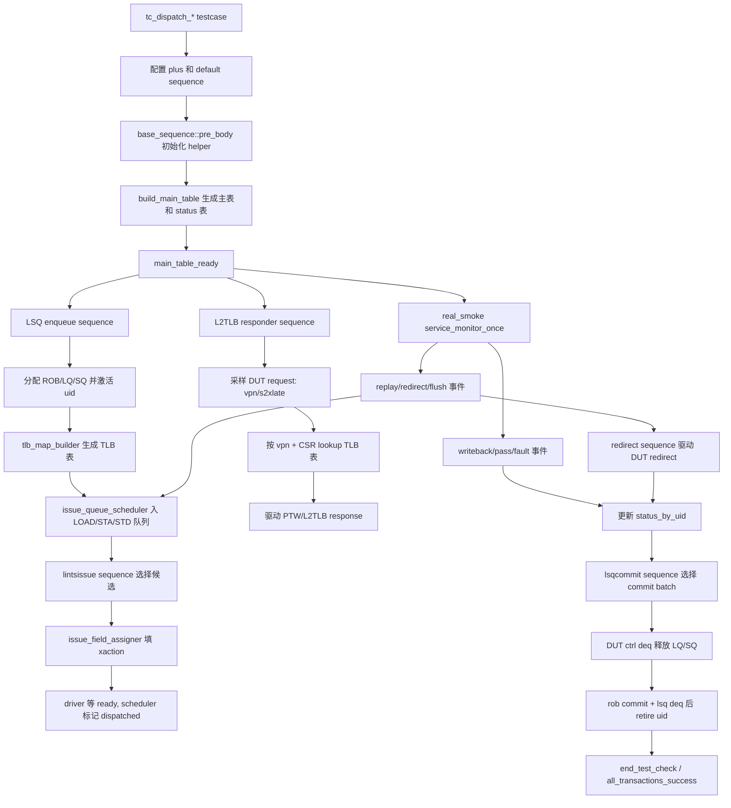

# dispatch_plan_v2 测试框架设计文档

本文基于以下输入文档和当前源码整理：

- `AI_DOC/plan/test_framework/plan/do/dispatch_plan_v2_development_detail_20260614.md`
- `AI_DOC/plan/test_framework/review_doc/undo/dispatch_plan_v2_review_annotated.md`
- `mem_ut/ver/ut/memblock` 下 dispatch 公共测试框架实现

若文档与源码不一致，本文以当前源码为准，并在“差异、坑点与边界”中说明。

## 1. 测试框架总体设计

当前 dispatch v2 框架是一套面向 MemBlock UT 的“访存操作生成、发送、观察、回收”公共测试框架。可以把它理解成一个小型软件调度器：先生成一批 load/store/AMO/prefetch 操作，给每条操作分配 `uid`，再按 DUT 真实接口节奏完成 LSQ 入队、TLB 映射、发射、writeback/replay/redirect、commit/deq。框架最终检查每个 `uid` 是否完成预期生命周期。

这个框架的中心不是某个单独 agent，而是 `common_data_transaction` 这个公共数据 owner。它保存主表、状态表、TLB 表、issue queue、redirect drive queue、active ROB/LQ/SQ 映射和 monitor 原始事件。其他 sequence/helper 只负责一段明确工作：LSQ 入队 sequence 把主表条目送进 DUT，L2TLB sequence 按 TLB 表回复 DUT 的 request，lintsissue sequence 从 issue queue 取候选并驱动发射，redirect sequence 把恢复路径选出的 redirect 送到 DUT redirect 口，monitor adapter/writeback handler/commit handler 把 DUT 返回事件写回状态表。

框架解决的问题：

- 统一生成 load/store/AMO/prefetch 等访存操作的主控制表，并保证 `uid`、ROB/LQ/SQ、地址、fuType/fuOpType 的一致性。
- 将 LSQ admission、TLB 映射、issue 发射、writeback/pass/fault/replay/redirect、commit/deq 的状态放在同一张 per-uid 状态表中，避免每个 agent 私有维护状态。
- 真实 DUT smoke 中，让多个默认 sequence 并行工作：`memblock_dispatch_real_smoke_sequence` 只建表和服务 monitor，实际接口驱动由 `tc_base.sv` 已经挂到五个 dispatch agent 上的 `memblock_lsqenq_dispatch_sequence`、`memblock_lintsissue_dispatch_sequence`、`memblock_lsqcommit_dispatch_sequence`、`memblock_redirect_dispatch_sequence`、`memblock_l2tlb_base_sequence` 完成。real smoke testcase 主要通过 plus 开关控制这些 sequence 是否真正工作。
- 软件 smoke 中，不依赖 DUT 接口，直接调用 helper API 做端到端状态闭环，验证公共表、队列、replay 和 commit/deq 基础语义。

后续读代码时建议区分两类字段：

- 控制逻辑字段：决定框架下一步行为，例如 `active/enq/tlb_mapped/replay_pending/flush_in_progress/send_pri/ready_cycle`。
- 随 transaction 携带的 DUT payload 字段：主要被转发到接口或 monitor 回填，例如 `fuType/fuOpType/src_0/imm/robIdx/lqIdx/sqIdx/pdest/pc/PTE bit`。

主要数据流：

1. `tc_base` 默认挂接 dispatch agent sequence；具体 testcase 在 build/main phase 中配置 plus、必要时覆盖 default sequence，并启动顶层 smoke sequence。
2. `memblock_dispatch_base_sequence::pre_body()` 调用 `seq_csr_common::init()`，创建或绑定 `common_data_transaction`、`lsq_ctrl_model`、`issue_queue_scheduler`、`issue_field_assigner`、`writeback_status_handler`、`exception_redirect_replay_handler`、`lsq_commit_handler`、`dispatch_monitor_event_adapter`。TLB entry 生成由 `common_data_transaction` 在 miss 时按需调用 `tlb_map_builder`，base sequence 不再长期持有 builder 句柄。
3. `build_main_table()` 生成或导入 `main_control_transaction`，按连续 `uid` 写入 `main_table_by_uid[]`，并初始化 `status_by_uid[]`。
4. LSQ 入队后，`lsq_ctrl_model` 更新 LQ/SQ 资源模型，`common_data_transaction::activate_uid()` 建立 active ROB/LQ/SQ 映射。
5. LSQ admission 后只标记 uid 可进入 issue queue；uid 发射时预登记 `uid_tlb_record_by_uid[]`，L2TLB request 到来时按 `vpn/s2xlate` 和 runtime CSR 建/查 `tlb_entry_by_key[]`。
6. `issue_queue_scheduler` 根据状态表和 op behavior 把 uid 路由到 `load_issue_q`、`sta_issue_q`、`std_issue_q`，发射时按 send priority 或 ROB 年龄选择候选。
7. `issue_field_assigner` 将主表字段和第二/第三类字段填入 `lintsissue_agent_agent_xaction`。
8. monitor 将 DUT writeback、IQ feedback、redirect、ctrl deq、CSR 事件推入 `memblock_sync_pkg` 原始队列，`dispatch_monitor_event_adapter` 转换为 `memblock_wb_event_t` 或直接调用 commit/deq handler。
9. `writeback_status_handler` 处理正常 pass/fault/replay/redirect 事件；复杂事件进入 `exception_event_q`，由 `exception_redirect_replay_handler` 做 replay/redirect/flush 状态更新。
10. `lsq_commit_handler` 选择可 commit 的 uid，驱动 `lsqcommit_agent_agent_xaction`，并根据 DUT ctrl deq 释放 LQ/SQ active 映射。ROB commit 且 LQ/SQ 都释放后，`try_retire_committed_uid()` 置 `success` 并 retire active uid。

主要控制流分两类：

- 软件 smoke：`soft_test_memblock_dispatch_smoke_sequence`/`soft_test_memblock_dispatch_replay_smoke_sequence` 串行调用 helper，构造 pass/replay event，并直接调用 commit/deq helper。
- 真实 smoke：`memblock_dispatch_real_smoke_sequence` 建主表后循环 `service_monitor_once()` 和 `route_all_issue_queues()`；五个 dispatch agent sequence 由 `tc_base` 默认挂接，通过 `main_table_ready` 或公共 redirect 队列等待可处理数据，然后各自按 plus 开关驱动真实接口。

sequence 挂接关系：

- `tc_base.sv` 负责 dispatch agent 的默认 sequence 挂接：`u_lsqcommit_agent_agent -> memblock_lsqcommit_dispatch_sequence`、`u_lsqenq_agent_agent -> memblock_lsqenq_dispatch_sequence`、`u_lintsissue_agent_agent -> memblock_lintsissue_dispatch_sequence`、`u_redirect_agent_agent -> memblock_redirect_dispatch_sequence`、`u_L2tlb_agent_agent -> memblock_l2tlb_base_sequence`。
- software smoke 在 `soft_test_tc_dispatch_smoke.sv::configure_software_smoke_default_sequences()` 中临时把这些 agent 覆盖成 `tcnt_default_sequence_base#(...)`，避免真实接口驱动干扰纯软件状态机验证。
- real smoke 继承 `tc_base` 的 dispatch sequence 挂接；`tc_dispatch_real_smoke.sv::configure_real_smoke_default_sequences()` 只显式把非 dispatch 关键 agent 覆盖到空闲/default，不在这里重新挂 LSQENQ/LINTSISSUE/LSQCOMMIT/REDIRECT/L2TLB dispatch sequence。

### 1.1 真实接口 sequence 数据流

本节只描述会参与真实 DUT 接口 flow 的 sequence。`soft_test_memblock_dispatch_smoke_sequence` 和 `soft_test_memblock_dispatch_replay_smoke_sequence` 属于纯软件闭环验证，它们会直接构造软件事件，不代表严格真实 DUT 接口流程，因此不放入下表主流程。

| sequence | 调度位置 | 输入数据/参数 | 驱动接口或输出 | 在框架中的作用 | 细节文档 |
|---|---|---|---|---|---|
| `memblock_dispatch_base_sequence` | 顶层 real smoke sequence 的基类，先于各真实 agent sequence 建表 | `plus::MEMBLOCK_*` 经 `seq_csr_common` 快照后的参数、随机或手动主表配置 | 不直接驱动 DUT；输出主表、状态表、TLB 表和 helper 句柄 | 公共数据 owner 的初始化入口，决定后续真实 sequence 能消费哪些 uid 和表项 | [dispatch_framework_sv/memblock_dispatch_base_sequence.md](../../../../analysis/source_sv/dispatch_framework_sv/memblock_dispatch_base_sequence.md) |
| `memblock_dispatch_real_smoke_sequence` | testcase main phase 启动，和 agent default sequence 并行 | 主表规模/op 权重、monitor raw queue、service clock | 不直接驱动单个 DUT agent；在 service clock 下降沿服务 monitor 和 issue queue 路由 | 真实 flow 的服务循环，负责建表、drain monitor、replay/redirect/commit 状态推进和收尾检查 | [dispatch_framework_sv/memblock_dispatch_real_smoke_sequence.md](../../../../analysis/source_sv/dispatch_framework_sv/memblock_dispatch_real_smoke_sequence.md) |
| `memblock_dispatch_real_mixed_smoke_sequence` | directed real smoke 的顶层服务 sequence | 两条 directed load/store 主表模板 | 复用 real smoke 服务循环 | 固定构造 load/store 混合场景，便于调试真实接口链路 | [dispatch_framework_sv/memblock_dispatch_real_mixed_smoke_sequence.md](../../../../analysis/source_sv/dispatch_framework_sv/memblock_dispatch_real_mixed_smoke_sequence.md) |
| `memblock_lsqenq_dispatch_sequence` | `u_lsqenq_agent_agent.sqr.main_phase` 默认 sequence | 主表、`seq_csr_common` 入队宽度、`lsq_ctrl_model` LQ/SQ 资源预览、DUT response | `lsqenq_agent_agent_xaction` | 把 uid 送入 DUT admission/LSQ enqueue，确认 `lqIdx/sqIdx`，激活 uid，建 TLB 并路由 issue queue | [dispatch_framework_sv/memblock_lsqenq_dispatch_sequence.md](../../../../analysis/source_sv/dispatch_framework_sv/memblock_lsqenq_dispatch_sequence.md) |
| `memblock_lintsissue_dispatch_sequence` | `u_lintsissue_agent_agent.sqr.main_phase` 默认 sequence | LOAD/STA/STD issue queue、pipe 数、`send_pri`、`issue_field_assigner` | `lintsissue_agent_agent_xaction` | 将已入队且已路由的 uid 发到 DUT load/STA/STD issue 入口，并更新 dispatched/issue epoch | [dispatch_framework_sv/memblock_lintsissue_dispatch_sequence.md](../../../../analysis/source_sv/dispatch_framework_sv/memblock_lintsissue_dispatch_sequence.md) |
| `memblock_lsqcommit_dispatch_sequence` | `u_lsqcommit_agent_agent.sqr.main_phase` 默认 sequence | status 表中的 pass/commit candidate、ROB 顺序 helper、commit timeout | `lsqcommit_agent_agent_xaction` | 根据框架状态推进 LSQ commit/pendingPtr，标记 ROB commit，等待 DUT ctrl deq 后 retire | [dispatch_framework_sv/memblock_lsqcommit_dispatch_sequence.md](../../../../analysis/source_sv/dispatch_framework_sv/memblock_lsqcommit_dispatch_sequence.md) |
| `memblock_redirect_dispatch_sequence` | `u_redirect_agent_agent.sqr.main_phase` 默认 sequence | `exception_redirect_replay_handler` 选出的 redirect payload、`common_data_transaction` 中的 redirect drive queue、redirect timeout | `redirect_agent_agent_xaction` | 在 memory violation 或 redirect event 后，把 redirect payload 真实驱动到 DUT redirect 接口；驱动完成后通知公共状态表，再允许 flush/recovery 继续推进 | [dispatch_framework_sv/memblock_redirect_dispatch_sequence.md](../../../../analysis/source_sv/dispatch_framework_sv/memblock_redirect_dispatch_sequence.md) |
| `memblock_l2tlb_base_sequence` | `u_L2tlb_agent_agent.sqr.main_phase` 默认 sequence | DUT `vpn/s2xlate` request、runtime CSR snapshot、TLB 表、lookup policy/latency | `L2tlb_agent_agent_xaction` | 代替 L2TLB 对上游 DTLB 的 responder 功能，从 TLB 表查 entry 后回填 response | [dispatch_framework_sv/memblock_l2tlb_base_sequence.md](../../../../analysis/source_sv/dispatch_framework_sv/memblock_l2tlb_base_sequence.md) |
| `dcache_mem__access_base_sequence` / `sbuffer_mem_access_base_sequence` | `u_dcache_agent_agent` / `u_sbuffer_agent_agent` 默认 sequence | DUT A 通道请求、稀疏 memory model、内存地址范围 | D 通道 response xaction | 给真实 DUT 访存路径提供简化 memory responder，不消费 dispatch 主表 | [dispatch_framework_sv/mem_base_sequence.md](../../../../analysis/source_sv/dispatch_framework_sv/mem_base_sequence.md) |

这些 sequence 的调度关系不是串行调用关系，而是 UVM main phase 下的并行服务关系：`real_smoke_sequence` 先建表并置 `main_table_ready`，LSQENQ/LINTSISSUE/LSQCOMMIT 这类直接消费主表或状态表的 sequence 等待 ready 和 plus enable 后驱动自己的 agent；L2TLB responder 不等待主表，只在 DUT 发出 request 时按 request/runtime CSR 查表或建表并回包；REDIRECT sequence 常驻等待 `common_data_transaction` 里的 redirect drive queue。monitor adapter 采集 DUT 事件并写回 `common_data_transaction`，再反向影响 issue queue、commit candidate 和 replay/redirect 处理。

通俗地说，真实接口 flow 里每个 sequence 只负责一段真实 DUT 交互：`memblock_dispatch_real_smoke_sequence` 像总控后台，负责建表、持续收 monitor、调用状态推进 helper，但它自己不直接敲具体 DUT pin；`memblock_lsqenq_dispatch_sequence` 负责把主表里的 transaction 送进 LSQ 入队口，让 DUT 分配或确认 LQ/SQ 资源；`memblock_lintsissue_dispatch_sequence` 负责从 LOAD/STA/STD 三个发射队列里挑可发射项，并填好 issue xaction 发给 DUT；`memblock_lsqcommit_dispatch_sequence` 负责在状态表显示 transaction 已经可以提交后，驱动 ROB/LSQ commit 侧的 pendingPtr；`memblock_redirect_dispatch_sequence` 负责把公共恢复逻辑选出的 redirect 真正发到 DUT redirect 口，避免只在软件状态里 flush 而 DUT 没收到 redirect；`memblock_l2tlb_base_sequence` 负责响应 DUT 的 TLB/PTW 查询；DCache/SBuffer memory responder 负责给 DUT 真实访存请求回包。所有 sequence 都不私自维护第二套 transaction 状态，统一通过 `common_data_transaction` 读写主表、状态表、TLB 表、issue queue、redirect 队列和 active 映射。

## 2. 任务调度依赖

核心任务依赖如下。图里只保留主干调度关系：先建表，随后 LSQ/TLB/issue/monitor/commit 并行推进，所有状态最后回到 `common_data_transaction`。



关键调度关系：

| 阶段 | 入口 | 依赖 | 输出 |
|---|---|---|---|
| 参数初始化 | `seq_csr_common::init()` | Makefile cfg 和用户 `plus_arg` 中的 `plus::MEMBLOCK_*` 已解析 | 小写静态配置字段和 getter |
| 主表生成 | `build_main_table()` | `seq_csr_common` 已初始化 | `main_table_by_uid[]`、`status_by_uid[]`、`main_table_ready` |
| LSQ 入队 | `memblock_lsqenq_dispatch_sequence::send_lsqenq_cycle()` | 主表 ready、无 flush、LSQ 资源足够 | active ROB/LQ/SQ 映射、`enq=1`、TLB 表、issue queue |
| L2TLB 回复 | `memblock_l2tlb_base_sequence::send_l2tlb_cycle()` | L2TLB responder active、主表 ready、TLB 表已注册 | PTW/L2TLB response |
| issue 发射 | `memblock_lintsissue_dispatch_sequence::send_issue_cycle()` | issue queue 有 eligible item | `load/sta/std_dispatched`、issue epoch、可选 STD accept pass |
| 内存 responder | `dcache_mem__access_base_sequence` / `sbuffer_mem_access_base_sequence` | DUT A 通道 valid、reset done | 简化 memory response 和稀疏 memory model 更新 |
| monitor 采集 | `dispatch_monitor_event_adapter::*` | monitor 原始队列有事件 | `memblock_wb_event_t` 或 LSQ deq 更新 |
| writeback/pass | `writeback_status_handler::handle_event()` | active uid 可解析，target 合法 | target pass/fault/replay/redirect 状态 |
| replay/redirect | `exception_redirect_replay_handler::process_pending_events()` | `exception_event_q` 非空 | replay pending 或 flush/retire |
| commit/deq | `lsq_commit_handler::*` | pass 完成，DUT ctrl deq 或 pendingPtr 需要推进 | `rob_commit`、`lsq_deq`、`success`、active retire |

## 3. 分层 class 文件说明

本节按“这个文件为什么存在、接收什么输入、输出给谁、哪些字段会影响控制流、哪些字段只是 payload”的方式说明。函数/task 列表仍保留源码级名称，便于后续开发者按名称搜索和修改。

### 3.1 类型与参数层

#### `mem_ut/ver/ut/memblock/seq/base_seq/memblock_dispatch_types.sv`

该文件定义 dispatch 框架所有层共享的常量、enum 和 struct，是主表、状态表、LSQ/TLB/issue/writeback helper 的公共类型基础。

详细字段含义、约束、阶段使用场景和函数/task 设计原理见：

- [dispatch_framework_sv/memblock_dispatch_types.md](../../../../analysis/source_sv/dispatch_framework_sv/memblock_dispatch_types.md)

#### `mem_ut/ver/ut/memblock/env/plus.sv`

该文件是 memblock UT 命令行 plusarg 解析入口，保存原始 `plus::MEMBLOCK_*` 参数。

详细字段含义、约束、阶段使用场景和函数/task 设计原理见：

- [dispatch_framework_sv/plus.md](../../../../analysis/source_sv/dispatch_framework_sv/plus.md)

#### `mem_ut/ver/ut/memblock/seq/base_seq/seq_csr_common.sv`

该文件是 dispatch 公共参数快照和合法性检查入口，helper 通过 getter 读取已校验配置。

详细字段含义、约束、阶段使用场景和函数/task 设计原理见：

- [dispatch_framework_sv/seq_csr_common.md](../../../../analysis/source_sv/dispatch_framework_sv/seq_csr_common.md)

### 3.2 transaction 层

#### `mem_ut/ver/ut/memblock/seq/base_seq/main_control_transaction.sv`

该文件定义主控制表的一行，保存一条访存 transaction 的静态生成字段。

详细字段含义、约束、阶段使用场景和函数/task 设计原理见：

- [dispatch_framework_sv/main_control_transaction.md](../../../../analysis/source_sv/dispatch_framework_sv/main_control_transaction.md)

#### `mem_ut/ver/ut/memblock/seq/base_seq/status_transaction.sv`

该文件定义每个 uid 的运行时状态，记录入队、发射、writeback、replay、redirect、commit 和 retire 生命周期。

详细字段含义、约束、阶段使用场景和函数/task 设计原理见：

- [dispatch_framework_sv/status_transaction.md](../../../../analysis/source_sv/dispatch_framework_sv/status_transaction.md)

#### `mem_ut/ver/ut/memblock/seq/base_seq/memblock_tlb_entry.sv`

该文件定义 by-key TLB entry 和 per-uid TLB record。entry 是 live TLB cache；uid record 保存发射上下文和 PTE 回填历史。

详细字段含义、约束、阶段使用场景和函数/task 设计原理见：

- [dispatch_framework_sv/memblock_tlb_entry.md](../../../../analysis/source_sv/dispatch_framework_sv/memblock_tlb_entry.md)

### 3.3 公共数据与状态 helper 层

#### `mem_ut/ver/ut/memblock/seq/base_seq/common_data_transaction.sv`

该文件是 dispatch 公共数据单例 owner，集中维护主表、状态表、TLB 表、issue queue、active map 和 feedback event。

详细字段含义、约束、阶段使用场景和函数/task 设计原理见：

- [dispatch_framework_sv/common_data_transaction.md](../../../../analysis/source_sv/dispatch_framework_sv/common_data_transaction.md)

#### `mem_ut/ver/ut/memblock/seq/base_seq/mmu_csr_runtime_state.sv`

该文件维护运行时 MMU CSR 镜像，为 TLB lookup 提供当前 ASID/VMID/权限上下文。

详细字段含义、约束、阶段使用场景和函数/task 设计原理见：

- [dispatch_framework_sv/mmu_csr_runtime_state.md](../../../../analysis/source_sv/dispatch_framework_sv/mmu_csr_runtime_state.md)

#### `mem_ut/ver/ut/memblock/seq/base_seq/rob_order_util.sv`

该文件封装 ROB/LQ/SQ 环形 key 和 ROB 顺序判断，避免裸 value 比较导致回绕错误。

详细字段含义、约束、阶段使用场景和函数/task 设计原理见：

- [dispatch_framework_sv/rob_order_util.md](../../../../analysis/source_sv/dispatch_framework_sv/rob_order_util.md)

#### `mem_ut/ver/ut/memblock/seq/base_seq/lsq_ctrl_model.sv`

该文件是软件 LSQ 分配镜像，负责 op behavior 推导、LQ/SQ 资源预览、分配和释放。

详细字段含义、约束、阶段使用场景和函数/task 设计原理见：

- [dispatch_framework_sv/lsq_ctrl_model.md](../../../../analysis/source_sv/dispatch_framework_sv/lsq_ctrl_model.md)

#### `mem_ut/ver/ut/memblock/seq/base_seq/tlb_map_builder.sv`

该文件负责把 request VPN、PTE 权重和 runtime CSR 上下文转换成 by-key TLB entry。

详细字段含义、约束、阶段使用场景和函数/task 设计原理见：

- [dispatch_framework_sv/tlb_map_builder.md](../../../../analysis/source_sv/dispatch_framework_sv/tlb_map_builder.md)

#### `mem_ut/ver/ut/memblock/seq/base_seq/issue_queue_scheduler.sv`

该文件负责 LOAD/STA/STD 发射队列路由、仲裁和发射后状态更新。

详细字段含义、约束、阶段使用场景和函数/task 设计原理见：

- [dispatch_framework_sv/issue_queue_scheduler.md](../../../../analysis/source_sv/dispatch_framework_sv/issue_queue_scheduler.md)

#### `mem_ut/ver/ut/memblock/seq/base_seq/issue_field_assigner.sv`

该文件负责把 scheduler 选出的 issue item 转换成 lintsissue agent xaction 字段。

详细字段含义、约束、阶段使用场景和函数/task 设计原理见：

- [dispatch_framework_sv/issue_field_assigner.md](../../../../analysis/source_sv/dispatch_framework_sv/issue_field_assigner.md)

### 3.4 writeback、replay、commit 与 monitor adapter

#### `mem_ut/ver/ut/memblock/seq/base_seq/writeback_status_handler.sv`

该文件负责把统一 writeback event 分类并更新 status，复杂事件转交 recovery 队列。

详细字段含义、约束、阶段使用场景和函数/task 设计原理见：

- [dispatch_framework_sv/writeback_status_handler.md](../../../../analysis/source_sv/dispatch_framework_sv/writeback_status_handler.md)

#### `mem_ut/ver/ut/memblock/seq/base_seq/exception_redirect_replay_handler.sv`

该文件集中处理 replay、fault 和 redirect/flush 的简化恢复状态机。

详细字段含义、约束、阶段使用场景和函数/task 设计原理见：

- [dispatch_framework_sv/exception_redirect_replay_handler.md](../../../../analysis/source_sv/dispatch_framework_sv/exception_redirect_replay_handler.md)

#### `mem_ut/ver/ut/memblock/seq/base_seq/lsq_commit_handler.sv`

该文件负责 ROB commit pendingPtr 构造、commit 状态更新和 DUT LQ/SQ deq 资源回收。

详细字段含义、约束、阶段使用场景和函数/task 设计原理见：

- [dispatch_framework_sv/lsq_commit_handler.md](../../../../analysis/source_sv/dispatch_framework_sv/lsq_commit_handler.md)

#### `mem_ut/ver/ut/memblock/seq/base_seq/dispatch_monitor_event_adapter.sv`

该文件把 monitor raw queue 转换成统一 writeback/replay/redirect/deq/CSR 语义。

详细字段含义、约束、阶段使用场景和函数/task 设计原理见：

- [dispatch_framework_sv/dispatch_monitor_event_adapter.md](../../../../analysis/source_sv/dispatch_framework_sv/dispatch_monitor_event_adapter.md)

### 3.5 base sequence 与 virtual sequence 层

#### `mem_ut/ver/ut/memblock/seq/base_seq/mem_base_sequence.sv`

该文件提供 DCache 和 SBuffer 侧的简化 memory responder sequence，给真实 DUT 访存路径回包。

详细字段含义、约束、阶段使用场景和函数/task 设计原理见：

- [dispatch_framework_sv/mem_base_sequence.md](../../../../analysis/source_sv/dispatch_framework_sv/mem_base_sequence.md)

#### `mem_ut/ver/ut/memblock/seq/base_seq/memblock_dispatch_base_sequence.sv`

该文件是 dispatch 公共基类，组装 helper 并提供建表、路由、writeback、recovery、commit 等 wrapper API。

详细字段含义、约束、阶段使用场景和函数/task 设计原理见：

- [dispatch_framework_sv/memblock_dispatch_base_sequence.md](../../../../analysis/source_sv/dispatch_framework_sv/memblock_dispatch_base_sequence.md)

#### `mem_ut/ver/ut/memblock/seq/virtual_sequence/soft_test/soft_test_memblock_dispatch_smoke_sequence.sv`

该文件是纯软件端到端 smoke sequence，用于验证公共状态机闭环。

详细字段含义、约束、阶段使用场景和函数/task 设计原理见：

- [dispatch_framework_sv/soft_test_memblock_dispatch_smoke_sequence.md](../../../../analysis/source_sv/dispatch_framework_sv/soft_test_memblock_dispatch_smoke_sequence.md)

#### `mem_ut/ver/ut/memblock/seq/virtual_sequence/soft_test/soft_test_memblock_dispatch_replay_smoke_sequence.sv`

该文件是纯软件 replay smoke sequence，用于验证 replay 重新入队和 stale feedback 过滤。

详细字段含义、约束、阶段使用场景和函数/task 设计原理见：

- [dispatch_framework_sv/soft_test_memblock_dispatch_replay_smoke_sequence.md](../../../../analysis/source_sv/dispatch_framework_sv/soft_test_memblock_dispatch_replay_smoke_sequence.md)

#### `mem_ut/ver/ut/memblock/seq/virtual_sequence/memblock_dispatch_real_smoke_sequence.sv`

该文件是真实 DUT smoke 的顶层服务 sequence，负责公共状态推进和 monitor event drain。

详细字段含义、约束、阶段使用场景和函数/task 设计原理见：

- [dispatch_framework_sv/memblock_dispatch_real_smoke_sequence.md](../../../../analysis/source_sv/dispatch_framework_sv/memblock_dispatch_real_smoke_sequence.md)

#### `mem_ut/ver/ut/memblock/seq/virtual_sequence/memblock_dispatch_real_mixed_smoke_sequence.sv`

该文件是真实 DUT directed load/store mixed smoke sequence。

详细字段含义、约束、阶段使用场景和函数/task 设计原理见：

- [dispatch_framework_sv/memblock_dispatch_real_mixed_smoke_sequence.md](../../../../analysis/source_sv/dispatch_framework_sv/memblock_dispatch_real_mixed_smoke_sequence.md)

#### `mem_ut/ver/ut/memblock/seq/virtual_sequence/memblock_lsqenq_dispatch_sequence.sv`

该文件是真实 LSQ enqueue 驱动 sequence，负责 admission、DUT response 校验和入队后建表/路由。

详细字段含义、约束、阶段使用场景和函数/task 设计原理见：

- [dispatch_framework_sv/memblock_lsqenq_dispatch_sequence.md](../../../../analysis/source_sv/dispatch_framework_sv/memblock_lsqenq_dispatch_sequence.md)

#### `mem_ut/ver/ut/memblock/seq/virtual_sequence/memblock_lintsissue_dispatch_sequence.sv`

该文件是真实 lintsissue 发射驱动 sequence，负责每拍选择候选、赋值并通知 scheduler fire。

详细字段含义、约束、阶段使用场景和函数/task 设计原理见：

- [dispatch_framework_sv/memblock_lintsissue_dispatch_sequence.md](../../../../analysis/source_sv/dispatch_framework_sv/memblock_lintsissue_dispatch_sequence.md)

#### `mem_ut/ver/ut/memblock/seq/virtual_sequence/memblock_lsqcommit_dispatch_sequence.sv`

该文件是真实 lsqcommit pendingPtr 驱动 sequence，负责推进 ROB commit。

详细字段含义、约束、阶段使用场景和函数/task 设计原理见：

- [dispatch_framework_sv/memblock_lsqcommit_dispatch_sequence.md](../../../../analysis/source_sv/dispatch_framework_sv/memblock_lsqcommit_dispatch_sequence.md)

#### `mem_ut/ver/ut/memblock/seq/virtual_sequence/memblock_l2tlb_base_sequence.sv`

该文件是 L2TLB/PTW responder sequence，语义是响应 DTLB/L2TLB 上游 request，并非 L2TLB 到 cache/memory 的下游模型。

详细字段含义、约束、阶段使用场景和函数/task 设计原理见：

- [dispatch_framework_sv/memblock_l2tlb_base_sequence.md](../../../../analysis/source_sv/dispatch_framework_sv/memblock_l2tlb_base_sequence.md)

### 3.6 testcase 层

#### `mem_ut/ver/ut/memblock/seq/seq_pkg.sv`

sequence package。按依赖顺序 include dispatch 类型、helper、base sequence、virtual sequence 和 soft_test sequence。`memblock_dispatch_types.sv` 在 helper 之前 include，`common_data_transaction.sv` 在 transaction 和 runtime CSR 后 include。

#### `mem_ut/ver/ut/memblock/seq/seq.f`

sequence filelist。维护 `seq_pkg.sv` 需要的 `base_seq`、`virtual_sequence` 和 `virtual_sequence/soft_test` include path，并由 `cfg/tb.f` 在 `tc/tc.f` 之前引入。

#### `mem_ut/ver/ut/memblock/tc/tc_pkg.sv`

testcase package。只 include testcase 层文件，并通过 `import seq_pkg::*` 使用 sequence/helper class；不再直接 include `seq` 目录下的文件。

#### `mem_ut/ver/ut/memblock/tc/src/tc_base.sv`

这是所有 memblock testcase 的基础装配点。它在 `build_phase()` 中创建 `memblock_env`，并给各 agent sequencer 的 `main_phase` 设置默认 sequence。后续 testcase 通常继承它或继承它的派生类，再按场景覆盖 env cfg 或个别 agent sequence；公共框架参数通过 Makefile `cfg=` preset 或用户 `plus_arg` 输入。

dispatch 框架相关的五个默认挂接在这里完成：

- `env.u_lsqcommit_agent_agent.sqr.main_phase` -> `memblock_lsqcommit_dispatch_sequence`
- `env.u_lsqenq_agent_agent.sqr.main_phase` -> `memblock_lsqenq_dispatch_sequence`
- `env.u_lintsissue_agent_agent.sqr.main_phase` -> `memblock_lintsissue_dispatch_sequence`
- `env.u_redirect_agent_agent.sqr.main_phase` -> `memblock_redirect_dispatch_sequence`
- `env.u_L2tlb_agent_agent.sqr.main_phase` -> `memblock_l2tlb_base_sequence`

这意味着 real smoke testcase 不需要再把这五个 sequence 挂一遍。它继承 `tc_base` 的默认挂接，然后通过 `MEMBLOCK_LSQENQ_SEQ_EN`、`MEMBLOCK_DISPATCH_ISSUE_SEQ_EN`、`MEMBLOCK_LSQCOMMIT_SEQ_EN`、`MEMBLOCK_REDIRECT_SEQ_EN`、`MEMBLOCK_L2TLB_SEQ_EN` 等 plus 开关决定这些 sequence 是否真正工作。

software smoke 的目的相反：它只验证公共 helper 和 status 状态机，不希望真实 DUT 接口被 LSQENQ/LINTSISSUE/LSQCOMMIT/REDIRECT/L2TLB sequence 驱动。因此 `soft_test_tc_dispatch_smoke.sv::configure_software_smoke_default_sequences()` 会把这些默认挂接覆盖成 `tcnt_default_sequence_base#(...)`，让 agent 保持空闲。

#### `mem_ut/ver/ut/memblock/tc/src/soft_test/soft_test_tc_dispatch_smoke.sv`

软件 smoke testcase，继承 `tc_smoke`。它用于跑纯软件公共框架，不希望真实 agent 干扰，因此 build phase 会把大多数 agent 配成 default sequence，main phase 只启动软件 smoke sequence。

- `build_phase()` 在 `super.build_phase()` 后调用 `configure_software_smoke_default_sequences()`，把包括 LSQCOMMIT/LSQENQ/LINTSISSUE 在内的 agent main_phase default sequence 覆盖成 `tcnt_default_sequence_base#(...)`，避免 `tc_base` 默认挂接的 dispatch sequence 驱动真实接口。
- `main_phase()` 启动 `soft_test_memblock_dispatch_smoke_sequence`。

#### `mem_ut/ver/ut/memblock/tc/src/soft_test/soft_test_tc_dispatch_replay_smoke.sv`

继承 `soft_test_tc_dispatch_smoke`，覆盖 `run_dispatch_smoke_sequence()` 启动 `soft_test_memblock_dispatch_replay_smoke_sequence`。

#### `mem_ut/ver/ut/memblock/tc/src/tc_dispatch_real_smoke.sv`

真实 DUT smoke testcase。

这个 testcase 是 real smoke 的环境配置和主控 sequence 启动点。参数 preset 不在 testcase
源码中写入，而是由运行命令通过 Makefile `cfg=<cfg_name>` 指定
`seq/plus_cfg/<cfg_name>.cfg`；testcase build phase 只负责刷新 `seq_csr_common`、调整 env cfg、
把非 dispatch 关键 agent 覆盖成空闲/default，然后 main phase 启动 real smoke 服务循环。
真实 LSQENQ/LINTSISSUE/LSQCOMMIT/REDIRECT/L2TLB dispatch sequence 的默认挂接不在这里做，
而是在 `tc_base.sv` 中已经完成。

- `build_phase()` 调用 `seq_csr_common::reload_from_plus()`，创建 `memblock_env_cfg` 并配置
  drv/xz，调用 `super.build_phase()` 让 `tc_base` 完成 env 创建和 dispatch sequence 默认挂接，
  最后调用 `configure_real_smoke_default_sequences()` 覆盖非 dispatch 关键 agent。
- 真实 smoke 的 `LSQENQ/DISPATCH_ISSUE/LSQCOMMIT/REDIRECT/L2TLB` sequence 开关、主表数量、
  op 权重、PTE 权重和 timeout 由对应 `seq/plus_cfg/*.cfg` 提供；用户命令行 `plus_arg`
  可覆盖 cfg 中同名参数。
- `configure_real_smoke_env_cfg()` 将 agent driver mode 置 0，并关闭多个 monitor xz check。
- `configure_real_smoke_default_sequences()` 只给非 dispatch 关键 agent 配 `tcnt_default_sequence_base#(...)`；它没有重新设置 `u_lsqcommit_agent_agent/u_lsqenq_agent_agent/u_lintsissue_agent_agent/u_redirect_agent_agent/u_L2tlb_agent_agent` 的 default sequence。
- `main_phase()` 置 `memblock_sync_pkg::dispatch_real_smoke_active=1`，运行 `memblock_dispatch_real_smoke_sequence`。

#### 真实 smoke 派生 testcase

- `tc_dispatch_real_store_smoke.sv`：将 op 权重改为只生成 store。
- `tc_dispatch_real_store_wb_smoke.sv`：开启 `MEMBLOCK_STD_REAL_WB_PASS_EN`，让 STD pass 依赖真实 writeback/feedback。
- `tc_dispatch_real_store_sta_wb_smoke.sv`：同时开启 STA 和 STD real writeback pass。
- `tc_dispatch_real_multi_store_wb_smoke.sv`：两条 store，`enq_per_cycle/sta/std` 限为 1。
- `tc_dispatch_real_mixed_wb_smoke.sv`：两条 directed load/store，使用 `memblock_dispatch_real_mixed_smoke_sequence`。
- `tc_dispatch_real_mixed_sta_wb_smoke.sv`：mixed 场景同时开启 STA/STD real writeback pass。

### 3.7 agent/connect 相关关键文件

#### `agent/lintsissue_agent_agent/src/lintsissue_agent_agent_xaction.sv`

这是发射接口的 payload 容器。`issue_field_assigner` 写它，`lintsissue_agent_agent_driver` 读它并驱动 DUT。port 0/1/2 对应 load，3/4 对应 STA，5/6 对应 STD。开发时要注意：同一个 xaction 可能同时携带多个 port 的 valid。

关键字段族：

- port 0/1/2：load issue，含 `valid/fuOpType/src_0/imm/robIdx/pdest/rfWen/fpWen/pc/isRVC/ftq/loadWaitBit/waitForRobIdx/storeSetHit/loadWaitStrict/lqIdx/sqIdx`。
- port 3/4：STA issue，含 `valid/fuType/fuOpType/src_0/imm/robIdx/isFirstIssue/pdest/isRVC/ftq/storeSetHit/ssid/sqIdx`。
- port 5/6：STD issue，含 `valid/fuType/fuOpType/src_0/robIdx/sqIdx`。
- `memblock_dispatch_wait_ready`、`memblock_dispatch_ready_timeout`：dispatch sequence 控制 driver 是否等待 ready。

#### `agent/lintsissue_agent_agent/src/lintsissue_agent_agent_driver.sv`

这是 lintsissue xaction 到 DUT pin 的驱动器。dispatch 模式下它不仅发送 payload，还会等待 DUT ready；只有所有 valid port 都 ready 后，sequence 才会继续并在软件侧 mark fire。

关键 task/function：

- `send_pkt(tr)`：驱动所有 intIssue port payload。
- `wait_dispatch_issue_ready(tr)`：循环驱动并检查 ready，先记录本拍已经 `valid && ready` 的端口，再检查 redirect/flush epoch；若随后发现 abort，只清掉未 fire 端口，已 fire 端口通过 `memblock_dispatch_fired_mask` 交给 sequence 补记 dispatch。
- `has_dispatch_issue_pending(tr)`：判断还有未 fire 的 valid。
- `clear_ready_dispatch_issue_ports(tr)`：看到 valid && ready 时清 valid。
- `report_dispatch_issue_fire()`、`report_dispatch_issue_timeout()`：调试信息和关键 HDL path。
- `drive_idle()`：空闲时清 valid/payload。

#### `tb/lintsissue_agent_connect.sv`

这是 interface 和 DUT 内部 intIssue 信号之间的 force 连接。agent xaction 不直接碰 DUT 层级路径，而是先驱动 interface，再由 connect 文件把 interface 信号接到 DUT。

在 `MEMBLOCK_UT` 下 force 连接：

- DUT ready -> interface ready。
- interface valid/payload -> DUT `io_ooo_to_mem_intIssue_*`。

#### `agent/lsqenq_agent_agent/src/lsqenq_agent_agent_xaction.sv`

这是 LSQ enqueue 接口的 payload 容器。dispatch LSQ sequence 写 needAlloc/req，driver 发送给 DUT，并在 `canAccept` 后把 DUT resp LQ/SQ key 采样回同一个 xaction，供 sequence 校验。

关键字段族：

- `memblock_dispatch_wait_can_accept`、`memblock_dispatch_ready_timeout`、`memblock_dispatch_aborted_by_redirect`、`memblock_dispatch_flush_epoch`。
- 8 个 slot 的 `needAlloc`。
- 8 个 req：`valid/fuType/uopIdx/robIdx/lqIdx/sqIdx/numLsElem`。
- 8 个 resp：DUT 返回的 `lqIdx/sqIdx`。

#### `agent/lsqenq_agent_agent/src/lsqenq_agent_agent_driver.sv`

这是 LSQ enqueue valid/canAccept 握手驱动器。它的关键行为是等待 `canAccept`，并在 flush 发生时中止当前 admission，避免把已经被 redirect 冲掉的请求误写入 active 表。

关键 task：

- `send_pkt(tr)`：驱动 needAlloc 和 req。
- `wait_lsq_can_accept(tr)`：循环驱动 req，直到 DUT `canAccept=1`；如果 `dispatch_flush_in_progress` 或 flush epoch 变化，则设置 `memblock_dispatch_aborted_by_redirect` 并退出。
- `sample_lsqenq_resp(tr)`：在 canAccept 后采样 8 个 resp LQ/SQ key。
- `drive_idle()`：空闲清 needAlloc/req。

#### `tb/lsqenq_agent_connect.sv`

这是 LSQ enqueue interface 到 DUT 内部 LSQ 入队端口的 force 连接。它同时把 DUT 的 `canAccept/resp` 回传给 interface，形成 sequence 校验所需的闭环。

在 `MEMBLOCK_UT` 下 force：

- DUT `canAccept/resp` -> interface。
- interface `needAlloc/req` -> DUT。

#### `agent/lsqcommit_agent_agent/src/lsqcommit_agent_agent_xaction.sv`

这是 LSQ commit 接口的 payload 容器。它承载的是 ROB 对 LSQ 的 commit 控制信息，当前字段很少：`io_ooo_to_mem_lsqio_pendingPtr_flag/value` 表示 pendingPtr，`io_ooo_to_mem_flushSb` 表示 store buffer flush 控制。这里没有 valid/ready 握手字段，driver 会按 transaction 内容直接驱动这些信号。

与 `lsq_commit_handler` 的关系是：handler 负责从 status 表选择可 commit batch，并在 `build_lsqcommit_xaction()` 中把最后一条 commit uid 的 ROB key 填成 pendingPtr；xaction 只是把这个结果装起来给 driver。

关键字段：

- `io_ooo_to_mem_lsqio_pendingPtr_flag/value`：发给 DUT 的 commit pending pointer，value 约束在 ROB 容量范围内。
- `io_ooo_to_mem_flushSb`：store buffer flush 控制，当前 dispatch commit handler 默认作为 payload 传递，不承担完整 flush 恢复建模。

#### `agent/lsqcommit_agent_agent/src/lsqcommit_agent_agent_driver.sv`

这是 LSQ commit xaction 到 DUT pin 的驱动器。它不选择 commit batch，也不判断哪些 uid 可提交；这些都由 `lsq_commit_handler` 完成。driver 的工作只是从 sequencer 取 xaction，调用 `send_pkt()` 把 pendingPtr/flushSb 驱动到 interface；没有 item 时按 `drv_mode` 调 `drive_idle()`。

关键 task：

- `reset_phase()`：reset 后等待 `memblock_sync_pkg::reset_backend_done`，期间持续 idle 驱动。
- `main_phase()`：`sqr_sw` 和 `drv_sw` 都打开时循环取 item；没有 item 就 idle。
- `send_pkt(tr)`：驱动 `io_ooo_to_mem_lsqio_pendingPtr_flag/value` 和 `io_ooo_to_mem_flushSb`。
- `drive_idle(drv_mode)`：根据 DRV_0/DRV_1/DRV_X/DRV_RAND/DRV_LST 给 pendingPtr/flushSb 默认值。

#### `tb/lsqcommit_agent_connect.sv`

这是 LSQ commit interface 到 DUT commit 端口的 force 连接。agent driver 只驱动 interface，connect 文件在 `MEMBLOCK_UT` 下把 interface 的 pendingPtr/flushSb force 到 RTL；非 `MEMBLOCK_UT` 分支则把 RTL 信号回采到 interface。

在 `MEMBLOCK_UT` 下 force：

- interface `io_ooo_to_mem_lsqio_pendingPtr_flag/value` -> DUT。
- interface `io_ooo_to_mem_flushSb` -> DUT。

#### `agent/L2tlb_agent_agent/src/L2tlb_agent_agent_xaction.sv`

这是 L2TLB/PTW responder 的 payload 容器。request 侧字段用于采样 DUT request 和控制 ready；response 侧字段用于把软件 TLB 表转换成 DUT 能接收的 S1/S2 PTW response。

关键字段：

- request 侧采样/ready：`io_ptw_req_0_ready`、`io_ptw_req_0_valid`、`io_ptw_req_0_bits_vpn`、`io_ptw_req_0_bits_s2xlate`。
- response：`io_ptw_resp_valid`、`s2xlate`、S1 entry tag/asid/vmid/n/pbmt/perm/level/v/ppn、S1 addr_low/ppn_low/valididx/pteidx/pf/af、S2 tag/vmid/n/pbmt/ppn/perm/level/gpf/gaf。

#### `agent/L2tlb_agent_agent/src/L2tlb_agent_agent_driver.sv`

这是 L2TLB/PTW responder 的驱动器。active 时它由 sequence 控制 ready/resp；inactive 时 idle ready 默认 1，避免未接管时阻塞原有路径。当前环境默认 `MEMBLOCK_L2TLB_CONNECT_TAKEOVER_EN=1`，因此 active 默认成立；若 `MEMBLOCK_L2TLB_SEQ_EN=0`，driver idle 会保持 `ready=0/resp_valid=0`，不主动响应 request。

关键 task：

- `send_pkt(tr)`：驱动 PTW req ready 和 PTW response。
- `drive_idle()`：当 `l2tlb_responder_active=1` 时 idle ready 为 0，避免无 sequence 时乱接管；inactive 时 req ready 默认 1 透传/旁路语义。

#### `tb/L2tlb_agent_connect.sv`

连接语义非常关键。这个 connect 文件决定 L2TLB agent 的真实位置：它采样 DTLB repeater 发出的 PTW request，在 active 时接管 PTW response 返回 DUT。因此后续不要把这个 agent 当成 L2TLB 到 cache/memory 下游模型来扩展。

- 无论 active 与否，interface 采样 request：`_inner_dtlbRepeater_io_ptw_req_0_valid/vpn/s2xlate` -> `U_IF_NAME.io_ptw_req_0_*`。
- active 时，agent 驱动 DUT `_inner_ptw_io_tlb_1_req_0_ready` 和 `_inner_ptw_io_tlb_1_resp_*`。
- inactive 时，interface 只观察 DUT PTW response。
- active 由编译期宏 `MEMBLOCK_L2TLB_CONNECT_TAKEOVER_EN` 决定，默认值为 1，并写入 `memblock_sync_pkg::l2tlb_responder_active`；runtime `MEMBLOCK_L2TLB_SEQ_EN` 只决定 responder sequence 是否主动回包。

这确认当前 L2TLB agent 不是 cache/memory 下游模型，而是接在 DTLB repeater/PTW request-response 处。

#### `common/memblock_common/src/memblock_sync_pkg.sv`

该文件是 monitor raw queue 和全局同步状态包，作为 monitor 到 dispatch 公共框架的轻量邮箱。

详细字段含义、约束、阶段使用场景和函数/task 设计原理见：

- [dispatch_framework_sv/memblock_sync_pkg.md](../../../../analysis/source_sv/dispatch_framework_sv/memblock_sync_pkg.md)


## 4. 场景脉络与接口数据赋值逻辑

### 4.1 主表生成

随机主表：

1. `build_random_main_table(n)` 调 `data.reset_all_tables(n)`。
2. ROB 从 `{flag=0,value=0}` 开始，每条 `alloc_uid()`，创建 `main_control_transaction`。
3. `randomize_main_transaction()` 随机基础字段后强制设置 uid/ROB/LQ/SQ 默认值、异常默认 0、op_class、op 模板、地址模板、send_pri、delay。
4. `apply_minimal_op_template()` 将 op_class 映射为：
   - INT/FP load：`fuType=LDU`、`lsq_flow=LOAD`、load fuOpType。
   - STORE：`fuType=STU`、`lsq_flow=STORE`、store fuOpType。
   - PREFETCH：`fuType=LDU`、`lsq_flow=LOAD`、prefetch fuOpType。
   - AMO：`fuType=MOU`、`lsq_flow=ATOMIC`、AMO fuOpType、`numLsElem=0`。
5. `apply_legal_addr_template()` 在物理地址范围内生成 64B 对齐 `src_0`，`imm=0`。
6. 可按权重执行地址复用：store 复用任一 load 地址，load 复用先前 store 地址。
7. `init_status_for_main_table()` 建状态快照，`check_main_table_complete()` 置 ready。

手动主表：

- testcase 或 sequence 调 `set_manual_main_transaction(rob_key,tr)`。
- `import_manual_main_table()` 按 rob key 排序导入，重新分配连续 uid，调用 `post_manual_config()` 和 `validate_main_table_entry()`。

### 4.2 LSQ 入队

软件 smoke：

- `soft_test_memblock_dispatch_smoke_sequence::admit_lsq_and_route_issue()` 对每条主表：
  - `derive_op_behavior(main_tr)`。
  - `need_alloc==0` 调 `commit_non_lsq_admission()`。
  - 其他调 `commit_allocate()`，使用软件预览 LQ/SQ key。
  - `build_tlb_table_for_active_uid(uid)` 建 TLB 并 route issue。

真实 DUT：

- `memblock_lsqenq_dispatch_sequence` 等主表 ready。
- `collect_lsq_candidates()` 从 `common_data_transaction::get_next_new_admit_uid()` 推导的公共 admission 起点顺序取候选，预览 LQ/SQ key。
- `assign_lsqenq_slot()` 写入 `lsqenq_agent_agent_xaction`：
  - `needAlloc` 来自 `behavior.need_alloc`。
  - `req_valid=1`。
  - `fuType` 来自主表。
  - `uopIdx=uid[6:0]`。
  - `robIdx` 来自主表。
  - `lqIdx/sqIdx` 来自软件预览。
  - `numLsElem` 来自 behavior。
- driver 等 `canAccept`，采样 DUT resp LQ/SQ。
- `commit_allocate_with_resp()` 要求 DUT resp 与软件预期一致，之后设置主表 LQ/SQ、active 映射、`enq=1`。
- `complete_admission()` 建 TLB 并 route。

### 4.3 TLB 映射与 L2TLB 回复

TLB 映射：

- `get_or_create_tlb_entry_by_req()` 用 request `vpn/s2xlate` 和 runtime CSR 生成 lookup key。
- 随机 PTE bit 后 `fixup_pte_legal()`。
- `apply_csr_state(data.mmu_csr_state,s2xlate)` 保存 `asid/vmid/priv_mode/lookup_key`。
- entry 写入 `tlb_entry_by_key[key]`；uid 发射时预登记 record，entry 确定后按 key 回填所有 pending record。

L2TLB 回复：

- `L2tlb_agent_connect.sv` 从 `_inner_dtlbRepeater_io_ptw_req_0_*` 采样 request，并在 active 时 force `_inner_ptw_io_tlb_1_*` response。
- `memblock_l2tlb_base_sequence::sample_request_fields()` 只采样 `vpn/s2xlate`，不使用 paddr。
- `get_or_create_tlb_entry_by_req()` 使用 runtime CSR 生成 lookup key；若 key miss 则自动创建 entry。
- `fill_dtlb_resp_from_entry()` 将 `memblock_tlb_entry` 填成 S1/S2 PTW response。
- response entry 确定后调用 `update_uid_tlb_records_by_entry(key, entry)`，供 PTW-back replay 等待项通过 uid record `pte_valid` 判断 ready。
- miss 时根据 policy fatal/idle/page fault。

### 4.4 发射调度

- `issue_queue_scheduler::route_uid()` 根据 `derive_op_behavior()` 决定 route LOAD/STA/STD。
- queue item 使用：
  - `send_pri`：LOAD/STA 用主表 `send_pri`，STD 用 `send_pri_std`。
  - `ready_cycle`：主表 `delay`。
  - `replay_seq`：当前 status replay seq。
- `select_issue_candidates()`：
  - 若 flush in progress，设置 `issue_freeze_ack` 并不发射。
  - 若 `global_send_pri_en=1`，先跨三队列找全局最大 `send_pri`，各 target 只选等于该 priority 的 eligible item；tie-break 用 ROB 年龄。
  - 若 `global_send_pri_en=0`，每个 target 内按 ROB 年龄选。
- `mark_issue_fire()` 分配全局 issue epoch，更新 target epoch，删除 queue item，置 dispatched，并清 replay target mask。

### 4.5 load/STA/STD agent transaction 赋值

LOAD port 0/1/2：

- 主字段：`valid=1`、`fuOpType/src_0/imm/robIdx/lqIdx/sqIdx`。
- 依赖字段：按 MDP 权重设置 `loadWaitBit`、`waitForRobIdx`、`storeSetHit`、`loadWaitStrict`。
- 后端字段：`pdest/rfWen/fpWen/pc/isRVC/ftqIdx/ftqOffset`。

STA port 3/4：

- 主字段：`valid=1`、`fuType/fuOpType/src_0/imm/robIdx/sqIdx`。
- 依赖字段：`isFirstIssue=(replay_seq==0)`、`storeSetHit`、`ssid=uid[4:0]`。
- 后端字段：`pdest/isRVC/ftqIdx/ftqOffset`。

STD port 5/6：

- 主字段：`valid=1`、`fuType/fuOpType/src_0/robIdx/sqIdx`。
- 当前没有第二类依赖字段和第三类后端 meta 字段赋值。

driver 行为：

- `lintsissue_agent_agent_driver` 在 `memblock_dispatch_wait_ready=1` 时循环驱动，直到所有 valid port 都观察到 ready。
- driver 用 `memblock_dispatch_fired_mask` 记录已经观察到 ready/fire 的端口。若等待 ready 期间发生 redirect/flush epoch 变化，未 fire 端口会清 valid，已 fire 端口仍由 sequence 标记 dispatch，避免同一项被重复发射。
- sequence 在 xaction 完成后按 fire mask 调用发射标记入口；普通无 redirect 情况下仍等所有 valid port ready 后统一更新状态。

### 4.6 写回、pass、replay、redirect

写回来源：

- `io_mem_to_ooo_int_wb_agent` monitor 推 raw int wb，adapter 按 port 映射 LOAD/STA/STD。
- `io_mem_to_ooo_iq_feedback_agent` monitor 推 raw IQ feedback，adapter 映射 STA/STD pass 或 replay。
- `redirect_agent` monitor 推 redirect。
- `io_mem_to_ooo_ctrl_agent` monitor 推 LQ/SQ deq 和 memory violation。

normal pass：

- `writeback_status_handler::handle_event()` 规范化 event，按 target 调 `mark_target_normal_pass()`。
- 对 store，STA 和 STD 都 pass 后才置全局 `writeback/pass`。

replay：

- IQ feedback 按 XiangShan IssueQueue 语义由 `hit` 判定 pass/replay：`hit=1` 为 pass，`hit=0` 会变成 replay event。`flush_state` 对应 TLB/PTW-back 状态元信息，不单独触发 replay。
- `exception_redirect_replay_handler::handle_replay_event()` 调 `mark_replay_pending()`。
- 被 replay 的 target 清 dispatched/writeback/pass，`replay_seq++`，route 时只重新 route 指定 target。
- stale pass 依赖 `issue_epoch/replay_seq` 过滤。

redirect/flush：

- redirect 或 memory violation 被视为 redirect event。
- handler 选最老 redirect，设置 `dispatch_flush_in_progress/dispatch_flush_epoch`，并把 redirect payload 放入 `pending_redirect_drive_q`。
- `memblock_redirect_dispatch_sequence` 从队列取 payload 后真实驱动 `io.redirect`，`robIdx/level` 使用 payload 中从 `memoryViolation` 等 DUT output ctrl 事件采到的值，完成后调用 `mark_redirect_drive_done()`。
- `io_redirect_*` 是 TB 驱动 DUT 的 input 接口，redirect monitor 不再回采后反馈 recovery；旧 Self Redirect Filter 已删除/停用。当前 RTL 没有单独 `flushItself` 端口，memoryViolation adapter 从 `level(0)` 派生 `flush_itself`。
- `MEMBLOCK_REDIRECT_SEQ_EN=0` 只适合不会产生 redirect/memoryViolation 的场景；若 recovery handler 看到 redirect event 会 fatal，避免 freeze 后等待一个不会运行的 redirect sequence。
- recovery handler 等 redirect drive done 后再调用 `apply_redirect_flush()`；等待期间 admission、issue、commit 均通过 `issue_blocked_by_global_flush()` 冻结。
- younger 或 flushItself 命中的 active uid 被清 dispatch 结果、置 flushed 并 retire；flushed uid 是 directed redirect 的合法终态，不要求 `success=1`，但必须 inactive 且无 pending。

flushSb/sbIsEmpty：

- `MEMBLOCK_FLUSHSB_SEQ_EN=0` 时，commit sequence 始终保持 `flushSb=0`。
- `MEMBLOCK_FLUSHSB_SEQ_EN=1` 只表示允许 directed flushSb 机制；真正发起必须由 directed flow 调用 `common_data_transaction::request_flushsb()`，或设置 `MEMBLOCK_FLUSHSB_REQUEST_CYCLE` 非 0 作为最小 directed 入口。
- `MEMBLOCK_FLUSHSB_REQUEST_CYCLE` 会先登记为公共 scheduled pending，real smoke 在 future request 还没触发前不会提前完成。若 due cycle 被 redirect/global flush 阻塞，pending 状态保留，后续非 blocked cycle 继续尝试。
- 发出 flushSb 后进入 `flushsb_waiting_empty`，ctrl monitor 会持续采集 `sbIsEmpty`，看到 `sbIsEmpty=1` 后清等待状态。

PTW-back replay 等待：

- 默认 `MEMBLOCK_REPLAY_WAIT_PTW_EN=0`，IQ feedback `hit=0` 仍立即转 replay。
- 开启后，STA `hit=0 && flush_state=1` 会先进入 `ptw_wait_replay_q`，等待对应 uid 的 L2TLB responder response done 或 timeout warning 后再释放 replay。
- 该机制只节流后端 replay 重新入队，不模拟 MemBlock 内部 LoadQueueReplay。

### 4.7 commit/deq

ROB commit：

- `lsq_commit_handler::uid_is_commit_candidate()` 要求 active、全局 writeback/pass、required target done、无 fault/replay/redirect/flush。
- `select_rob_commit_batch()` 从 `commit_cursor_uid` 顺序最多取 8 条，不跳过第一个未 ready uid。
- `build_lsqcommit_xaction()` 将最后一条 commit uid 的 ROB key 写到 pendingPtr。
- `mark_rob_commit_uid()` 置 `rob_commit`，若没有 LQ/SQ active 映射则置 `lsq_deq`。

LQ/SQ deq：

- DUT ctrl raw event 经 `dispatch_monitor_event_adapter::apply_raw_ctrl_deq()` 转给 commit handler。
- `apply_dut_lq_deq()`/`apply_dut_sq_deq()` 按 deq pointer 和 count 找 active uid，释放软件 free count 和 common data active mapping。
- ROB commit 且 LQ/SQ mapping 都释放后 `try_retire_committed_uid()` 设置 `success` 并 retire active uid。

### 4.8 real smoke 与软件 smoke 对比

软件 smoke 覆盖：

- 主表、状态表、TLB 表、issue queue、pass、replay stale 过滤、commit/deq helper 的纯软件闭环。
- 不依赖 DUT valid/ready、真实 TLB request、真实 writeback/deq monitor。

real smoke 覆盖：

- `tc_base` 默认挂接的 LSQENQ/LINTSISSUE/LSQCOMMIT/REDIRECT/L2TLB dispatch sequence，并由 real smoke plus 开关控制工作。
- LSQ 入队真实 `canAccept/resp`。
- lintsissue 真实 ready 等待。
- L2TLB responder 对 DUT request 进行 response。
- monitor raw event 到 status 的闭环。
- pendingPtr 和 DUT ctrl deq 的基础交互。

real smoke 仍偏 smoke，不是完整随机回归或异常专项。

## 5. 开发疑问、坑点与当前约束

- L2TLB 连接点：当前 `L2TLB_agent` 接在 DTLB repeater/PTW request-response 处，request 方向是 DUT DTLB/PTW request -> agent 采样，response 方向是 agent -> DUT PTW response。不能描述成 L2TLB 到 L2Cache/PTW/memory 下游模型。
- paddr/vpn 查表：L2TLB request 采样的是 `vpn/s2xlate`，lookup key 使用 runtime CSR 的 asid/vmid；不应按 paddr 查表。`paddr` 只由 TLB builder 为 response PPN 生成。
- runtime CSR：`seq_csr_common` 只管 plus 配置；CSR 真值在 `mmu_csr_runtime_state`。CSR `update_seq` 只作 debug 计数，不清 TLB entry 或 uid record。
- send_pri tie-break：`global_send_pri_en=1` 时先找全局最高 priority，三类 queue 都只选这个 priority；priority 相同再按 ROB 年龄。不是各队列各自独立最高。
- 第二/第三类字段：load 和 STA 有依赖/meta 字段；STD 当前只填主字段。这是源码现状，不应写成所有 port 都已完整填充所有字段。
- replay vs loadreplay：当前统一抽象为 `memblock_wb_event_t.replay_valid` 和 per-target replay mask，没有单独实现 loadreplay 专项语义。
- redirect/flush：当前已实现后端接口回灌和阶段化恢复，会先冻结 admission/issue/commit，驱动真实 `io.redirect`，再 apply 软件状态 flush；仍不模拟真实前端 refetch 和复杂取指恢复。
- uid/status/active：uid 是 TB 内部主键，不发 DUT；active 映射只表示当前 DUT 活跃窗口。历史表保留到 end check，active mapping 可释放。
- LQ/SQ active 映射：当前每个 uid 只映射一个 base LQ/SQ key；虽然 `numLsElem` 存在，但 release mapping 没有覆盖多元素范围。vector LS 被 fatal，标量 smoke 合法。
- AMO：`MOU` AMO 不分配 LQ/SQ，但 route STA/STD；AMOCAS 只影响 issue item 的 uop_count，目前真实接口赋值没有展开多 uop payload。
- 特殊访存：CBO/prefetch/AMO 有分类基础，但没有完整异常、cache、memory ordering 专项闭环。
- STA/STD pass：默认 `MEMBLOCK_STA_REAL_WB_PASS_EN=1`、`MEMBLOCK_STD_REAL_WB_PASS_EN=1`，普通 store 的 STA/STD pass 都等待真实 writeback/feedback monitor。若显式设置 `MEMBLOCK_STD_REAL_WB_PASS_EN=0`，普通 store STD 会在 issue accept 时注入兼容 pass；若显式设置 `MEMBLOCK_STA_REAL_WB_PASS_EN=0`，STA IQ feedback hit 可作为兼容 pass。
- LSQ deq mismatch：默认 mismatch fatal；`MEMBLOCK_LSQ_RESYNC_ON_MISMATCH=1` 时 warning 后返回，但不是完整 resync 实现。
- issue fire 回执：lintsissue driver 会等待 valid&&ready 并清 valid，但 sequence 侧在 xaction 完成后批量 mark fire，没有逐 port 返回实际 fire 周期。
- memory violation：当前 adapter 把 memory violation 转 redirect event，并通过 redirect 回灌 sequence 形成后端接口闭环；仍未做 store-load ordering 专项检查和完整前端恢复建模。

## 6. 当前实现边界和未覆盖项

当前已实现：

- 参数解析、合法性检查和 getter。
- 主表随机/手动生成。
- 公共数据单例、状态表、TLB 表、active ROB/LQ/SQ 映射、issue queue。
- 软件 LSQ 分配模型和真实 LSQ enqueue resp 校验。
- TLB 表生成和 L2TLB responder 基础 response。
- LOAD/STA/STD issue queue 路由、send priority、delay、issue field assign。
- writeback/pass/fault/replay/redirect 的基础状态更新。
- ROB commit、LQ/SQ deq 和 retire success。
- 软件 smoke、软件 replay smoke、真实 load/store/mixed smoke testcase。

未完整覆盖，不应描述成已闭环：

- 真实 replay 的多轮 DUT 闭环和所有 replay source。
- 完整 redirect/refetch/flush 恢复时序。
- memory violation 专项和 store-load ordering 精确检查。
- 异常专项，包括 page fault/access fault/PMA/PBMT/exception vector 的完整 DUT 对比。
- vector load/store、多元素 `numLsElem` 的 LQ/SQ 范围映射和 deq。
- AMOCAS 多 uop 的真实接口完整展开。
- cache/TL `corrupt/denied` 返回路径完整验证。
- 多 CSR/SFENCE 下 TLB entry 生命周期和 stale response 专项。
- 大规模随机下 queue 扫描性能优化和辅助索引 profiling。

## 7. 源码与输入文档差异摘要

- 输入方案提出的 `memblock_base_sequence` 实际落点为 `memblock_dispatch_base_sequence.sv`，没有改用已有 `mem_base_sequence.sv`，避免影响 dcache/sbuffer memory responder。
- L2TLB 方案按最新规则实现为 DTLB/PTW request responder，源码没有按 paddr 下游访问模型工作。
- `common_data_transaction` 中 TLB 主表为 `tlb_entry_by_key`，uid 追踪为 `uid_tlb_record_by_uid`，不再有 `key -> uid` lookup map。
- 当前 `apply_redirect_flush()` 会同步 retire flushed uid，真实前端 refetch 和精确恢复未建模。
- 当前 `issue_field_assigner` 的 STD 只有主字段，第二/第三类字段没有赋值。
- 当前 `lsq_ctrl_model` 对 vector LS 直接 fatal，未实现文档中可能暗示的多元素向量资源模型。
- 当前 real smoke 默认通过 Makefile `cfg=<cfg_name>` 选择 `seq/plus_cfg/<cfg_name>.cfg`，testcase 只调用 `seq_csr_common::reload_from_plus()` 刷新快照，不在源码中覆盖 plus。

## 8. 公共测试框架 class 字段与函数/task 设计原理补充

本节重点讲 dispatch 公共测试框架本身，也就是 `seq/base_seq`、dispatch virtual sequence、公共参数入口和 monitor raw sync 包。agent xaction/driver/connect 属于接口承载层，前文已经说明，本节不再按端口重复展开。

### 8.1 公共框架总体设计原则

公共框架的核心设计不是“每个 sequence 自己维护状态”，而是把所有跨任务共享的状态集中到 `common_data_transaction`，其它 class 只通过明确 API 表达意图。这样设计主要解决三个问题：

- 多个 real sequence 并行运行时，LSQ 入队、L2TLB 回复、LOAD/STA/STD 发射、writeback monitor、redirect/replay、ROB commit 都会同时读写同一批 transaction。如果每个 sequence 自己维护局部状态，很容易出现 A sequence 认为 uid 已经发射，B sequence 仍认为 uid 在队列里的问题。
- DUT 侧索引 `robIdx/lqIdx/sqIdx` 都可能回绕，不能直接作为测试框架主键。框架使用单调分配的 `uid` 作为 TB 主键，再用 active ROB/LQ/SQ map 处理 DUT 事件反查。
- replay/redirect 会让同一条 uid 出现多次发射。框架用 `issue_epoch` 和 `replay_seq` 给每次发射打快照，迟到的旧 writeback 只能被丢弃，不能污染新一轮状态。

monitor 到状态表的路径也遵循同样原则：agent monitor 只采集 DUT/interface 上的 raw fact，不直接修改 dispatch 状态表。raw fact 先进入 `memblock_sync_pkg` 中的 raw queue，再由 `dispatch_monitor_event_adapter` 统一解释成 `memblock_wb_event_t`、LSQ deq 或 runtime CSR 更新，最后交给 writeback/replay/redirect/commit/CSR handler 修改公共状态。这样可以保证端口采样、uid 反查、事件分类、stale feedback 过滤和状态更新各有边界。

```text
agent monitor
    -> memblock_sync_pkg raw queue
    -> dispatch_monitor_event_adapter
    -> writeback_status_handler / exception_redirect_replay_handler / lsq_commit_handler / mmu_csr_runtime_state
    -> common_data_transaction status
```

这个 raw-to-event adapter 分层的核心收益是：

- monitor 只记录“端口发生了什么”，不需要理解主表、active map、replay seq 或 commit 条件。
- adapter 集中处理 port 到 LOAD/STA/STD target 的映射，以及 redirect、memory violation、LQ/SQ deq、CSR 更新的分发。
- handler 只消费统一语义，避免多个 monitor 直接散写 `status_transaction`。
- 所有 feedback 都在公共入口进行 active uid 解析和一致性检查，减少旧 event 错配到新 transaction 的风险。

整体分工如下：

| 层级 | 主要 class | 设计目的 |
|---|---|---|
| 参数快照层 | `seq_csr_common` | 把 plus 配置固化成一次 testcase 内统一可读的快照，统一做 clamp/fatal 检查。 |
| 主表/状态/TLB 行 | `main_control_transaction`、`status_transaction`、`memblock_tlb_entry`、`memblock_uid_tlb_record`、`mmu_csr_runtime_state` | 把一条 transaction 的静态信息、运行状态、live TLB cache、uid PTE 追踪和 CSR 上下文分开保存，避免字段语义混在一个大结构里。 |
| 公共数据 owner | `common_data_transaction` | 管理主表、状态表、TLB 表、issue queue、active map、feedback event、flush 全局状态。 |
| raw 事件适配层 | `memblock_sync_pkg`、`dispatch_monitor_event_adapter` | monitor 先把原始端口事实放入 raw queue，adapter 再统一解释成 writeback/replay/redirect/deq/CSR 语义。 |
| 轻量模型/helper | `lsq_ctrl_model`、`tlb_map_builder`、`issue_queue_scheduler`、`issue_field_assigner`、`writeback_status_handler`、`exception_redirect_replay_handler`、`lsq_commit_handler`、`dispatch_monitor_event_adapter` | 每个 helper 只处理一个方向的规则，避免把所有算法堆在 base sequence。 |
| 调度入口 | `memblock_dispatch_base_sequence` 和 real dispatch sequence | 负责调用公共 API，驱动真实 agent 或 software smoke，不私自维护第二套状态。 |

### 8.2 公共框架 SV 源码分析索引

每个公共框架 SV 源码文件的字段含义、约束、阶段使用场景和函数/task 设计原理已拆分到独立文档：

| 源码文件 | 独立分析文档 |
|---|---|
| `memblock_dispatch_types.sv` | [memblock_dispatch_types.md](../../../../analysis/source_sv/dispatch_framework_sv/memblock_dispatch_types.md) |
| `plus.sv` | [plus.md](../../../../analysis/source_sv/dispatch_framework_sv/plus.md) |
| `seq_csr_common.sv` | [seq_csr_common.md](../../../../analysis/source_sv/dispatch_framework_sv/seq_csr_common.md) |
| `main_control_transaction.sv` | [main_control_transaction.md](../../../../analysis/source_sv/dispatch_framework_sv/main_control_transaction.md) |
| `status_transaction.sv` | [status_transaction.md](../../../../analysis/source_sv/dispatch_framework_sv/status_transaction.md) |
| `memblock_tlb_entry.sv` | [memblock_tlb_entry.md](../../../../analysis/source_sv/dispatch_framework_sv/memblock_tlb_entry.md) |
| `mmu_csr_runtime_state.sv` | [mmu_csr_runtime_state.md](../../../../analysis/source_sv/dispatch_framework_sv/mmu_csr_runtime_state.md) |
| `common_data_transaction.sv` | [common_data_transaction.md](../../../../analysis/source_sv/dispatch_framework_sv/common_data_transaction.md) |
| `rob_order_util.sv` | [rob_order_util.md](../../../../analysis/source_sv/dispatch_framework_sv/rob_order_util.md) |
| `lsq_ctrl_model.sv` | [lsq_ctrl_model.md](../../../../analysis/source_sv/dispatch_framework_sv/lsq_ctrl_model.md) |
| `tlb_map_builder.sv` | [tlb_map_builder.md](../../../../analysis/source_sv/dispatch_framework_sv/tlb_map_builder.md) |
| `issue_queue_scheduler.sv` | [issue_queue_scheduler.md](../../../../analysis/source_sv/dispatch_framework_sv/issue_queue_scheduler.md) |
| `issue_field_assigner.sv` | [issue_field_assigner.md](../../../../analysis/source_sv/dispatch_framework_sv/issue_field_assigner.md) |
| `writeback_status_handler.sv` | [writeback_status_handler.md](../../../../analysis/source_sv/dispatch_framework_sv/writeback_status_handler.md) |
| `exception_redirect_replay_handler.sv` | [exception_redirect_replay_handler.md](../../../../analysis/source_sv/dispatch_framework_sv/exception_redirect_replay_handler.md) |
| `lsq_commit_handler.sv` | [lsq_commit_handler.md](../../../../analysis/source_sv/dispatch_framework_sv/lsq_commit_handler.md) |
| `dispatch_monitor_event_adapter.sv` | [dispatch_monitor_event_adapter.md](../../../../analysis/source_sv/dispatch_framework_sv/dispatch_monitor_event_adapter.md) |
| `memblock_dispatch_base_sequence.sv` | [memblock_dispatch_base_sequence.md](../../../../analysis/source_sv/dispatch_framework_sv/memblock_dispatch_base_sequence.md) |
| `soft_test_memblock_dispatch_smoke_sequence.sv` | [soft_test_memblock_dispatch_smoke_sequence.md](../../../../analysis/source_sv/dispatch_framework_sv/soft_test_memblock_dispatch_smoke_sequence.md) |
| `soft_test_memblock_dispatch_replay_smoke_sequence.sv` | [soft_test_memblock_dispatch_replay_smoke_sequence.md](../../../../analysis/source_sv/dispatch_framework_sv/soft_test_memblock_dispatch_replay_smoke_sequence.md) |
| `memblock_dispatch_real_smoke_sequence.sv` | [memblock_dispatch_real_smoke_sequence.md](../../../../analysis/source_sv/dispatch_framework_sv/memblock_dispatch_real_smoke_sequence.md) |
| `memblock_dispatch_real_mixed_smoke_sequence.sv` | [memblock_dispatch_real_mixed_smoke_sequence.md](../../../../analysis/source_sv/dispatch_framework_sv/memblock_dispatch_real_mixed_smoke_sequence.md) |
| `memblock_lsqenq_dispatch_sequence.sv` | [memblock_lsqenq_dispatch_sequence.md](../../../../analysis/source_sv/dispatch_framework_sv/memblock_lsqenq_dispatch_sequence.md) |
| `memblock_lintsissue_dispatch_sequence.sv` | [memblock_lintsissue_dispatch_sequence.md](../../../../analysis/source_sv/dispatch_framework_sv/memblock_lintsissue_dispatch_sequence.md) |
| `memblock_lsqcommit_dispatch_sequence.sv` | [memblock_lsqcommit_dispatch_sequence.md](../../../../analysis/source_sv/dispatch_framework_sv/memblock_lsqcommit_dispatch_sequence.md) |
| `memblock_redirect_dispatch_sequence.sv` | [memblock_redirect_dispatch_sequence.md](../../../../analysis/source_sv/dispatch_framework_sv/memblock_redirect_dispatch_sequence.md) |
| `memblock_l2tlb_base_sequence.sv` | [memblock_l2tlb_base_sequence.md](../../../../analysis/source_sv/dispatch_framework_sv/memblock_l2tlb_base_sequence.md) |
| `memblock_sync_pkg.sv` | [memblock_sync_pkg.md](../../../../analysis/source_sv/dispatch_framework_sv/memblock_sync_pkg.md) |

### 8.3 公共框架设计取舍总结

- `uid` 是测试框架主键，`robIdx/lqIdx/sqIdx` 是 DUT 关联 key。这样既能保留完整追溯记录，又能处理硬件指针回绕。
- 主表和状态表 commit 后不立即删除。发射队列项发射成功后可以删除，因为追溯由主表和状态表承担。
- issue queue 只保存轻量 item。这样删除、重发和扫描开销较小，完整字段通过 uid 读取，避免在队列里复制大 transaction。
- `issue_epoch + replay_seq` 是 replay/redirect 防污染的核心。任何 writeback/pass/fault 更新都必须匹配当前快照。
- helper 按职责拆分。LSQ 资源、TLB 建表、issue 调度、字段赋值、writeback 状态、replay/redirect、commit/deq 各自独立，方便后续专项替换或加强。
- strict 开关用于分阶段收紧验证。smoke 阶段先保证主链路合法，专项阶段再打开 L2TLB strict lookup、真实 STA/STD writeback、LSQ mismatch fatal 等更严格约束。

## 9. soft_test 软件 smoke 文件说明

本章只汇总 software-only smoke 相关文件及作用。带 `real_smoke` 的 testcase/sequence 属于真实 DUT smoke，不归入 `soft_test`。

### 9.1 mem_ut soft_test 文件

| 文件 | 作用 |
|---|---|
| `mem_ut/ver/ut/memblock/seq/virtual_sequence/soft_test/soft_test_memblock_dispatch_smoke_sequence.sv` | 软件端到端 smoke sequence。直接调用 dispatch 公共 helper，构造 pass event，并推进 commit/deq，用于检查公共表、状态表、issue queue 和 LSQ 软件模型是否能闭环。 |
| `mem_ut/ver/ut/memblock/seq/virtual_sequence/soft_test/soft_test_memblock_dispatch_replay_smoke_sequence.sv` | 软件 replay smoke sequence。继承软件 smoke，手工构造 replay/stale pass 场景，用于检查 replay 重新入队和 stale event 过滤。 |
| `mem_ut/ver/ut/memblock/tc/src/soft_test/soft_test_tc_dispatch_smoke.sv` | software smoke testcase。覆盖真实 agent default sequence 为 idle/default，只启动软件 smoke sequence。文件内保留 `tc_dispatch_smoke` 兼容入口。 |
| `mem_ut/ver/ut/memblock/tc/src/soft_test/soft_test_tc_dispatch_replay_smoke.sv` | software replay smoke testcase。启动软件 replay smoke sequence。文件内保留 `tc_dispatch_replay_smoke` 兼容入口。 |

### 9.2 文档文件

| 文件 | 作用 |
|---|---|
| `AI_DOC/analysis/source_sv/dispatch_framework_sv/soft_test_memblock_dispatch_smoke_sequence.md` | `soft_test_memblock_dispatch_smoke_sequence.sv` 的源码分析文档。 |
| `AI_DOC/analysis/source_sv/dispatch_framework_sv/soft_test_memblock_dispatch_replay_smoke_sequence.md` | `soft_test_memblock_dispatch_replay_smoke_sequence.sv` 的源码分析文档。 |

### 9.3 编译接入

`seq_pkg.sv` include soft_test sequence 文件；`seq.f` 增加 `./virtual_sequence/soft_test` include path。`tc_pkg.sv` include soft_test testcase 文件；`tc.f` 增加 `./src/soft_test` include path。`cfg/tb.f` 在 `tc/tc.f` 之前引入 `seq/seq.f`。

为避免已有回归命令失效，`soft_test_tc_dispatch_smoke.sv` 和 `soft_test_tc_dispatch_replay_smoke.sv` 内保留旧 testcase class alias：

- `tc_dispatch_smoke extends soft_test_tc_dispatch_smoke`
- `tc_dispatch_replay_smoke extends soft_test_tc_dispatch_replay_smoke`
