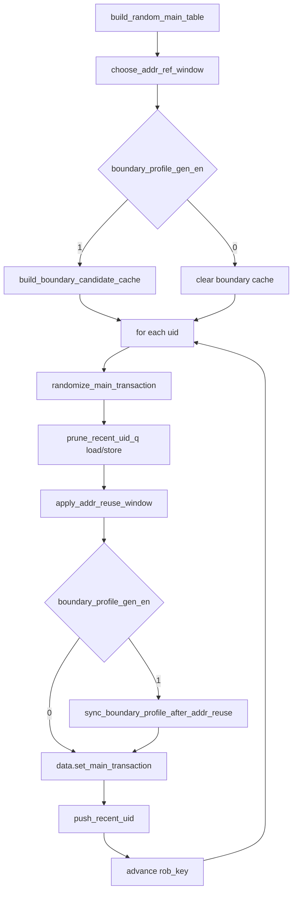

# main table boundary addr reuse integration formal plan

## 1. Plan 定位

本文是 mem_ut 测试框架主表激励生成正式 coding plan，覆盖以下功能：

```text
1. boundary_profile 主表生成模式与既有 apply_addr_reuse_window() 地址复用流程集成。
2. normal 和 boundary 两种主表生成路径统一使用 fuOpType plus 权重。
3. 地址复用后同步最终 boundary_profile 和 boundary_size_bytes 标签。
4. 地址复用命中后新增 keep_ref_size 行为，可按参考 transaction 的 size 在目标 op_class 中选择同 size fuOpType。
```

本文只实现测试框架激励生成、参数控制、标签同步和生成自洽检查。
本文不实现 DUT 正确性 checker、scoreboard、RM 或 covergroup。

涉及源码：

```text
mem_ut/ver/ut/memblock/seq/base_seq/memblock_dispatch_base_sequence.sv
mem_ut/ver/ut/memblock/seq/base_seq/seq_csr_common.sv
mem_ut/ver/ut/memblock/env/plus.sv
mem_ut/ver/ut/memblock/seq/plus_cfg/default.cfg
AI_DOC/mem_ut_flow_doc/main_table_boundary_profile_generation_flow.md
```

关联已完成 plan：

```text
AI_DOC/plan/test_framework/plan/do/main_table_boundary_candidate_addr_generation_plan_20260701.md
```

## 2. 目标功能 Flow 总览



函数调用 Flow 图整体文字伪代码：

```text
build_random_main_table() 先选择地址复用 recent window。
如果打开 boundary_profile 生成模式，先构建 boundary candidate cache；
如果没有打开 boundary_profile 生成模式，清理 boundary cache，保证 normal 路径不读旧候选表。

随后按 uid 顺序生成主表 transaction。
每条 transaction 先进入 randomize_main_transaction()：
  该函数负责生成初始 transaction 模板、初始地址、send_pri/send_pri_std/delay 和基础合法性检查。
  boundary 模式下，初始模板来自 boundary candidate cache，并生成目标 boundary 地址。
  normal 模式下，先按 op_class 权重选大类，再按 fuOpType 权重选具体操作。

初始 transaction 生成后，无论是否打开 boundary 模式，都维护 recent load/store queue。
随后进入 apply_addr_reuse_window()：
  该函数读取 MEMBLOCK_ADDR_REUSE_EN_* 权重决定本条是否尝试地址复用。
  如果未命中复用，函数直接返回，不改变 transaction。
  如果命中复用，函数根据复用 kind 选择参考 uid，可能改写 op_class/fuOpType/src_0/imm/vaddr。

如果 boundary 模式打开，地址复用之后进入 sync_boundary_profile_after_addr_reuse()：
  该函数从最终 op_class/fuOpType 派生最终 size。
  该函数用最终 vaddr/size 重新分类 boundary_profile。
  该函数只同步 boundary_size_bytes 和 boundary_profile，不修复地址、不重选 fuOpType、不恢复地址复用前的 profile。

最后把最终 transaction 写入 main table，再根据最终 op_class 把 uid 放入 recent load/store queue。
```

## 3. 专有名词和字段语义

`boundary_profile`：

```text
主表生成侧的地址边界标签，描述最终 transaction 的 vaddr/size 命中的地址形态。
例如 ALIGNED、MISALIGN_WITHIN_8B、CROSS_CACHELINE_SAME_4K、CROSS_4K。
该字段只服务测试框架激励生成和 debug，不判断 DUT 正确性。
```

`boundary_size_bytes`：

```text
用于 classify boundary_profile 的访问大小。
权威来源是当前 transaction 的 op_class/fuOpType。
地址复用后必须重新 derive，不能沿用复用前保存的旧值。
```

`addr reuse` / `apply_addr_reuse_window()`：

```text
主表生成中已有的地址相关性构造 helper。
它按权重制造 load-after-store、load-after-load、store-after-load、store-after-store 等地址相关激励。
该 helper 可以修改 op_class、fuOpType、src_0、imm 和 vaddr。
```

`keep_ref_size`：

```text
地址复用命中且成功选到 ref_tr 后的可选行为。
启用后，不直接复用 ref_tr.fuOpType。
实现从 ref_tr.op_class/ref_tr.fuOpType 派生 ref_size，
再在当前 target_op_class 的合法 fuOpType 集合中选择 size == ref_size 的 fuOpType。
这样跨 load/store 地址复用时可以保持访问 size，同时保证当前 fuOpType 属于当前 target_op_class。
ref_tr 是 PREFETCH 时不进入 keep_ref_size 路径。
```

`fuOpType 权重`：

```text
主表 op 模板生成时具体 fuOpType 的选择权重。
normal 和 boundary 两条路径都必须通过同一组 plus/cfg 参数控制 fuOpType 选择。
```

## 4. 参数与配置 Flow

### 4.1 地址复用参数

继续使用既有地址复用总开关和 kind 权重：

```text
MEMBLOCK_ADDR_REUSE_EN_1_WT
MEMBLOCK_ADDR_REUSE_EN_0_WT
MEMBLOCK_ADDR_REUSE_LOAD_AFTER_STORE_WT
MEMBLOCK_ADDR_REUSE_LOAD_AFTER_LOAD_WT
MEMBLOCK_ADDR_REUSE_STORE_AFTER_LOAD_WT
MEMBLOCK_ADDR_REUSE_STORE_AFTER_STORE_WT
MEMBLOCK_ADDR_REF_WINDOW_FIXED
MEMBLOCK_ADDR_REF_WINDOW_SMALL_WEIGHT
MEMBLOCK_ADDR_REF_WINDOW_MEDIUM_WEIGHT
MEMBLOCK_ADDR_REF_WINDOW_LARGE_WEIGHT
```

新增 keep_ref_size 行为权重：

```text
MEMBLOCK_ADDR_REUSE_KEEP_REF_SIZE_EN_1_WT
MEMBLOCK_ADDR_REUSE_KEEP_REF_SIZE_EN_0_WT
```

语义：

```text
MEMBLOCK_ADDR_REUSE_EN_* 决定本条 transaction 是否尝试地址复用。
只有地址复用已经命中且成功选择 ref_tr 后，才读取 MEMBLOCK_ADDR_REUSE_KEEP_REF_SIZE_EN_*。

现有 apply_addr_reuse_window() 使用 rand_weighted2(EN_1_WT, EN_0_WT)。
随机结果为 0 时进入地址复用流程。
随机结果非 0 时直接 return。
因此：
  MEMBLOCK_ADDR_REUSE_EN_1_WT=1, MEMBLOCK_ADDR_REUSE_EN_0_WT=0 表示强制尝试地址复用。
  MEMBLOCK_ADDR_REUSE_EN_1_WT=0, MEMBLOCK_ADDR_REUSE_EN_0_WT=1 表示关闭地址复用。

KEEP_REF_SIZE_EN_1_WT 命中：
  进入 keep_ref_size 路径。

KEEP_REF_SIZE_EN_0_WT 命中：
  保持旧地址复用逻辑，target_op_class 内正常按 fuOpType 权重随机。
```

默认值：

```text
MEMBLOCK_ADDR_REUSE_KEEP_REF_SIZE_EN_1_WT = 0
MEMBLOCK_ADDR_REUSE_KEEP_REF_SIZE_EN_0_WT = 1
```

默认关闭 keep_ref_size，保持旧地址复用行为。

参数合法性：

```text
addr_reuse_en weights 不能全 0。
addr_reuse kind weights 不能全 0。
addr_reuse_keep_ref_size_en weights 不能全 0。
addr_ref_window 沿用既有 fixed/random 检查规则。
```

### 4.2 fuOpType 权重参数

新增公共 fuOpType 权重参数，并同步维护：

```text
mem_ut/ver/ut/memblock/env/plus.sv
mem_ut/ver/ut/memblock/seq/base_seq/seq_csr_common.sv
mem_ut/ver/ut/memblock/seq/plus_cfg/default.cfg
```

新增参数：

```text
MEMBLOCK_LOAD_FUOP_LB_WT
MEMBLOCK_LOAD_FUOP_LH_WT
MEMBLOCK_LOAD_FUOP_LW_WT
MEMBLOCK_LOAD_FUOP_LD_WT
MEMBLOCK_LOAD_FUOP_LBU_WT
MEMBLOCK_LOAD_FUOP_LHU_WT
MEMBLOCK_LOAD_FUOP_LWU_WT

MEMBLOCK_STORE_FUOP_SB_WT
MEMBLOCK_STORE_FUOP_SH_WT
MEMBLOCK_STORE_FUOP_SW_WT
MEMBLOCK_STORE_FUOP_SD_WT

MEMBLOCK_PREFETCH_FUOP_I_WT
MEMBLOCK_PREFETCH_FUOP_R_WT
MEMBLOCK_PREFETCH_FUOP_W_WT

MEMBLOCK_CBO_FUOP_ZERO_WT
MEMBLOCK_CBO_FUOP_CLEAN_WT
MEMBLOCK_CBO_FUOP_FLUSH_WT
MEMBLOCK_CBO_FUOP_INVAL_WT

MEMBLOCK_AMO_FUOP_LR_W_WT
MEMBLOCK_AMO_FUOP_SC_W_WT
MEMBLOCK_AMO_FUOP_AMOSWAP_W_WT
MEMBLOCK_AMO_FUOP_AMOADD_W_WT
MEMBLOCK_AMO_FUOP_AMOXOR_W_WT
MEMBLOCK_AMO_FUOP_AMOAND_W_WT
MEMBLOCK_AMO_FUOP_AMOOR_W_WT
MEMBLOCK_AMO_FUOP_AMOMIN_W_WT
MEMBLOCK_AMO_FUOP_AMOMAX_W_WT
MEMBLOCK_AMO_FUOP_AMOMINU_W_WT
MEMBLOCK_AMO_FUOP_AMOMAXU_W_WT
MEMBLOCK_AMO_FUOP_LR_D_WT
MEMBLOCK_AMO_FUOP_SC_D_WT
MEMBLOCK_AMO_FUOP_AMOSWAP_D_WT
MEMBLOCK_AMO_FUOP_AMOADD_D_WT
MEMBLOCK_AMO_FUOP_AMOXOR_D_WT
MEMBLOCK_AMO_FUOP_AMOAND_D_WT
MEMBLOCK_AMO_FUOP_AMOOR_D_WT
MEMBLOCK_AMO_FUOP_AMOMIN_D_WT
MEMBLOCK_AMO_FUOP_AMOMAX_D_WT
MEMBLOCK_AMO_FUOP_AMOMINU_D_WT
MEMBLOCK_AMO_FUOP_AMOMAXU_D_WT
```

默认值：

```text
所有新增 fuOpType 权重默认值为 1。
```

本 plan 不把 `AMOCAS.W/D/Q` 放入 normal AMO 随机池。
后续如需打开 AMOCAS，需要单独确认 dispatch、issue、commit、RM 语义后扩展参数和验证。

fuOpType 权重合法性：

```text
如果某个 op_class 权重为 0：
  不要求该 op_class 的 fuOpType 权重非 0。

如果 MEMBLOCK_BOUNDARY_PROFILE_GEN_EN 为 0，且某个 op_class 权重非 0：
  该 op_class 对应 fuOpType 权重组至少一个非 0；
  否则 seq_csr_common::validate_and_clamp() UVM_FATAL。

如果 MEMBLOCK_BOUNDARY_PROFILE_GEN_EN 为 1：
  seq_csr_common::validate_and_clamp() 不因某个 op_class 的 fuOpType 权重组全 0 提前 fatal。
  boundary candidate cache 在 op_class/profile 维度处理全 0 情况。
  如果某个 op_class/profile 下存在合法 fuOpType 但权重全 0：
    build_boundary_candidate_cache() 打印 UVM_ERROR。
    使用 default_fuop_by_op_profile() 继续生成。
  如果 default 不合法：
    UVM_FATAL。

  上述 UVM_ERROR + default 只覆盖初始 boundary candidate 生成。
  如果后续地址复用非 keep_ref_size 路径重新调用 apply_minimal_op_template()，
  该路径没有 boundary_profile 上下文。
  若 target/fallback op_class 的 fuOpType 权重全 0，pick_fuop_by_weight() 仍 UVM_FATAL。
```

## 5. 主流程实现 Flow

### 5.1 `build_random_main_table()`

```systemverilog
task build_random_main_table(input int unsigned main_trans_num_i);
    if (data == null) begin
        data = common_data_transaction::get();
    end
    data.reset_all_tables(main_trans_num_i);
    rob_key = choose_rob_start_key();
    addr_ref_window = choose_addr_ref_window();
    if (seq_csr_common::get_boundary_profile_gen_en()) begin
        build_boundary_candidate_cache();
    end else begin
        boundary_candidate_cache_built = 1'b0;
        boundary_profile_cache.delete();
    end

    for (...) begin
        uid = data.alloc_uid();
        tr = main_control_transaction::type_id::create($sformatf("main_uid_%0d", uid));
        randomize_main_transaction(tr, uid, rob_key);

        prune_recent_uid_q(recent_load_uid_q, uid, addr_ref_window);
        prune_recent_uid_q(recent_store_uid_q, uid, addr_ref_window);
        apply_addr_reuse_window(tr, uid, recent_load_uid_q, recent_store_uid_q);

        if (seq_csr_common::get_boundary_profile_gen_en()) begin
            sync_boundary_profile_after_addr_reuse(tr,
                $sformatf("random uid=%0d boundary after addr reuse", uid));
        end

        data.set_main_transaction(uid, tr);
        push_recent_uid(tr, uid, recent_load_uid_q, recent_store_uid_q);
        rob_key = rob_order_util::rob_advance(rob_key, 1);
    end

    init_status_for_main_table();
    data.check_main_table_complete();
endtask
```

文字伪代码：

```text
进入 build_random_main_table() 后先保留现有 data 生命周期初始化。
如果 data 为空，从 common_data_transaction::get() 取得共享 data 句柄。
随后用 main_trans_num_i 清空并重建 main/status 等主表容量，避免复用上一轮残留表项。

选择 ROB 起点 rob_key。
choose_rob_start_key() 按当前已有 ROB 起点策略返回第一条 transaction 的 ROB key。
后续每生成一条 transaction 都从该 key 递增，保持原主表 ROB 顺序行为。

选择 addr_ref_window。
choose_addr_ref_window() 根据现有地址复用窗口配置返回本轮 recent queue 保留窗口。

如果打开 boundary_profile 生成模式，构建 boundary candidate cache；
否则清理 boundary cache，避免 normal 路径误用旧候选。

每一轮循环先分配 uid 并创建 transaction 对象。
data.alloc_uid() 从 common data 中分配新的 main table uid。
main_control_transaction::type_id::create() 创建该 uid 对应的 transaction 对象。

每个 uid 随后进入 randomize_main_transaction() 生成初始 transaction。
randomize_main_transaction() 负责根据 boundary 开关选择 boundary 初始模板或 normal 初始模板，
并在初始模板完成后更新 vaddr、检查 transaction 字段自洽。

随后调用 prune_recent_uid_q() 维护 recent load/store queue 的窗口大小：
  prune_recent_uid_q() 从队列头删除超过 addr_ref_window 的旧 uid，避免地址复用从过远历史 transaction 取参考地址。
  该函数只修改 recent uid queue，不修改当前 transaction。

无论 boundary_profile 生成是否打开，都进入 apply_addr_reuse_window()：
  apply_addr_reuse_window() 根据 MEMBLOCK_ADDR_REUSE_EN_* 决定是否复用地址。
  如果复用命中，该函数根据复用 kind 选择参考 uid，并可能改写当前 transaction 的 op_class、fuOpType、src_0、imm 和 vaddr。
  如果复用未命中，该函数直接返回，当前 transaction 保持 randomize_main_transaction() 的初始结果。

如果 boundary_profile 生成打开，地址复用后进入 sync_boundary_profile_after_addr_reuse()：
  该函数根据地址复用后的最终 op_class/fuOpType/vaddr 重新同步 boundary_size_bytes 和 boundary_profile。
  该同步只记录最终实际 size/profile，不恢复地址复用前的目标 profile。

最后把最终 transaction 写入 main table。
随后 push_recent_uid() 根据最终 transaction 的 op_class 判断是否进入 recent_load_uid_q 或 recent_store_uid_q：
  is_load_main_tr() 负责识别 INT_LOAD、FP_LOAD、PREFETCH。
  is_store_main_tr() 负责识别 STORE。
  AMO 和 CBO/CMO 不进入地址复用 recent queue。
rob_order_util::rob_advance() 推进 rob_key，供下一条 transaction 使用。

循环结束后保留现有收尾流程。
init_status_for_main_table() 根据最终 main table 初始化状态表。
data.check_main_table_complete() 检查 main table 条目数量和完整性，发现缺失或未写入条目时按现有机制报错。
```

### 5.2 `randomize_main_transaction()`

文字伪代码：

```text
先完成 main_control_transaction 基础 randomize 和 uid/ROB/默认异常属性初始化。

如果 MEMBLOCK_BOUNDARY_PROFILE_GEN_EN 为 1：
  如果 boundary candidate cache 尚未构建，进入 build_boundary_candidate_cache()。
    build_boundary_candidate_cache() 负责枚举 profile/op_class/fuOpType，按支持矩阵和权重构造可随机选择的候选表。
    该函数会在 op_class/profile 合法 fuOpType 权重全 0 时执行 UVM_ERROR + default 处理。
  进入 generate_boundary_op_from_cache()。
    generate_boundary_op_from_cache() 从候选表按 profile/op_class/fuOpType 权重选出本条 transaction 的初始 profile、op_class、fuOpType 和 size。
    该函数会写入 tr.boundary_profile、tr.boundary_size_bytes、tr.op_class 和 tr.fuOpType 相关模板字段。
  进入 apply_boundary_addr_template()。
    apply_boundary_addr_template() 根据目标 boundary_profile 和 size 生成最终 effective vaddr，再反推 src_0/imm，并调用 update_vaddr() 让 tr.vaddr 等于目标地址。
  进入 check_boundary_profile()。
    check_boundary_profile() 使用当前 tr.vaddr 和 boundary_size_bytes 重新分类地址形态，确认初始生成结果仍命中目标 profile；不命中则 UVM_FATAL。

如果 MEMBLOCK_BOUNDARY_PROFILE_GEN_EN 为 0：
  进入 select_op_class_by_weight()。
    select_op_class_by_weight() 读取 op_class 权重并返回本条 normal transaction 的操作大类。
  进入 apply_minimal_op_template()。
    apply_minimal_op_template() 根据 op_class 设置 fuType、lsq_flow、numLsElem，并通过 weighted fuOpType helper 选择具体 fuOpType。
  进入 apply_legal_addr_template()。
    apply_legal_addr_template() 使用 normal 地址生成规则设置 src_0/imm，并更新出初始 vaddr。

随后生成 send_pri、send_pri_std 和 delay。
进入 update_vaddr()，根据 src_0 和 sign-extend imm 重新计算 tr.vaddr。
进入 validate_main_table_entry()，检查初始 transaction 的 op_class/fuOpType/fuType/lsq_flow/address 等字段组合合法。
```

## 6. 关键 Helper 细节

### 6.1 `seq_csr_common::get_fuop_weight()`

职责：

```text
根据 op_class/fuOpType 返回 plus/cfg 解析后的 fuOpType 权重。
这是参数层正式读取入口。
sequence 侧不能长期直接读取 plus::MEMBLOCK_*。
```

文字伪代码：

```text
输入 op_class 和 fuOpType。
如果 op_class 是 INT_LOAD 或 FP_LOAD：
  根据 fuOpType 返回 LOAD_FUOP_*_WT。
如果 op_class 是 STORE：
  根据 fuOpType 返回 STORE_FUOP_*_WT。
如果 op_class 是 PREFETCH：
  根据 fuOpType 返回 PREFETCH_FUOP_*_WT。
如果 op_class 是 CBO：
  根据 fuOpType 返回 CBO_FUOP_*_WT。
如果 op_class 是 AMO：
  根据 fuOpType 返回 AMO_FUOP_*_WT。
如果 op_class/fuOpType 组合不属于支持集合：
  返回 0。
```

### 6.2 `get_fuop_weight()` 与 `pick_fuop_by_weight()`

新增或改造 sequence helper：

```systemverilog
extern virtual function int unsigned get_fuop_weight(input memblock_op_class_e op_class,
                                                     input bit [8:0] fuOpType);

extern virtual function bit [8:0] pick_fuop_by_weight(input memblock_op_class_e op_class,
                                                      input string caller);
```

`get_fuop_weight()` 文字伪代码：

```text
get_fuop_weight() 是 sequence 侧权重读取 wrapper。
它把 op_class/fuOpType 作为输入传给 seq_csr_common::get_fuop_weight()。
seq_csr_common::get_fuop_weight() 在参数层根据 op_class/fuOpType 查找对应 plus/cfg 权重，并对不支持组合返回 0。
sequence 侧 wrapper 直接返回该权重。
该函数不做随机选择，不修改 transaction、queue、cache 或全局状态。
```

`pick_fuop_by_weight()` 文字伪代码：

```text
pick_fuop_by_weight() 负责在一个 op_class 内按 plus 权重选择具体 fuOpType。
它先调用 enumerate_fuoptypes(op_class, fuops)。
  enumerate_fuoptypes() 根据 op_class 返回该类操作支持的固定 fuOpType 集合，不读取权重、不做随机。

随后逐个处理 fuops 中的 fuOpType。
对每个 fuOpType 调用 get_fuop_weight(op_class, fuOpType)。
  get_fuop_weight() 从参数层读取该 fuOpType 的权重；权重为 0 表示该 fuOpType 在当前配置下禁用。
如果权重非 0：
  把该 fuOpType 加入 legal_fuops。
  把该权重加入 weights，weights 的下标和 legal_fuops 的下标保持一致。

如果 legal_fuops 为空：
  UVM_FATAL，说明该 op_class 已被选择但没有任何可生成 fuOpType。

如果 legal_fuops 非空：
  调用 weighted_pick_index(weights)。
  weighted_pick_index() 只根据 weights 的分布返回候选下标，不修改候选数组。
返回 legal_fuops[idx]。
```

normal 模式改造：

```text
random_load_fuoptype()      改为调用 pick_fuop_by_weight(INT_LOAD, "random_load_fuoptype")。
random_store_fuoptype()     改为调用 pick_fuop_by_weight(STORE, "random_store_fuoptype")。
random_prefetch_fuoptype()  改为调用 pick_fuop_by_weight(PREFETCH, "random_prefetch_fuoptype")。
random_cbo_fuoptype()       改为调用 pick_fuop_by_weight(CBO, "random_cbo_fuoptype")。
random_amo_fuoptype()       改为调用 pick_fuop_by_weight(AMO, "random_amo_fuoptype")。
```

旧 `$urandom_range()` 均匀随机逻辑必须删除或改成 weighted wrapper。

### 6.3 boundary candidate cache 中 fuOpType 权重

`build_boundary_candidate_cache()` 保持候选表生成模式：

```text
枚举 boundary_profile。
过滤 profile 权重为 0 的项。
枚举 op_class。
过滤 op_class 权重为 0 的项。
调用 boundary_profile_supported_for_op(op_class, profile)。
  boundary_profile_supported_for_op() 判断该 op_class 是否允许生成目标 profile；不支持则跳过该 op_class/profile 组合。
枚举 op_class 下所有 fuOpType。
调用 derive_size_bytes(op_class, fuOpType)。
  derive_size_bytes() 根据 op_class/fuOpType 推导访问大小；返回 0 表示该操作不参与普通 size 分类。
调用 boundary_profile_supported_for_fuop(op_class, fuOpType, profile, size)。
  boundary_profile_supported_for_fuop() 判断该具体 fuOpType/size 是否能生成目标 profile；不支持则跳过。
对支持的 fuOpType 调用 get_fuop_weight(op_class, fuOpType)。
  get_fuop_weight() 读取该 fuOpType 的配置权重。
权重非 0 的 fuOpType 加入该 op_class/profile 的 fuop_cache。
```

boundary 模式权重全 0 策略：

```text
如果某个 op_class/profile 下存在合法 fuOpType，但所有合法 fuOpType 权重都是 0：
  打印 UVM_ERROR。
  调用 default_fuop_by_op_profile(op_class, profile)。
    default_fuop_by_op_profile() 根据 op_class/profile 返回该组合的默认 fuOpType，用于配置错误后的继续生成。
  检查 default fuOpType 属于 op_class。
  检查 default fuOpType 支持该 profile。
  default 不合法则 UVM_FATAL。
  default 候选 effective_weight = 1。
```

### 6.4 `sync_boundary_profile_after_addr_reuse()`

新增函数：

```systemverilog
extern virtual function void sync_boundary_profile_after_addr_reuse(input main_control_transaction tr,
                                                                    input string caller);
```

职责：

```text
只在 boundary_profile 生成模式下同步最终标签。
该函数不重新生成地址，不重新选择 op_class/fuOpType，不修改 src_0/imm/fuType/lsq_flow/fuOpType。
```

文字伪代码：

```text
如果 MEMBLOCK_BOUNDARY_PROFILE_GEN_EN 为 0：
  直接返回。

如果 tr 为空：
  UVM_FATAL。

进入 derive_size_bytes(tr.op_class, tr.fuOpType)。
derive_size_bytes() 根据最终 op_class/fuOpType 推导最终访问大小，作为重新分类 boundary_profile 的权威 size 来源。
如果 size_bytes == 0：
  UVM_FATAL，说明地址复用后的 op_class/fuOpType 不是本框架可分类的访存模板。

进入 tr.update_vaddr()。
update_vaddr() 根据最终 src_0 和 sign-extend imm 重新计算 tr.vaddr，保证 vaddr 与地址字段一致。
用 classify_boundary_profile(tr.vaddr, size_bytes) 得到 actual_profile。
classify_boundary_profile() 根据最终 vaddr 和 size_bytes 判断地址是否 aligned、within-bank misalign、跨 cacheline 或跨 4K。
如果 actual_profile 是 UNKNOWN：
  UVM_FATAL，说明最终 vaddr/size 无法形成合法 boundary 标签。

写回：
  tr.boundary_size_bytes = size_bytes。
  tr.boundary_profile = actual_profile。

进入 validate_main_table_entry(tr, caller)。
validate_main_table_entry() 检查最终 transaction 的 op_class/fuOpType/fuType/lsq_flow/地址等字段组合是否合法。
```

语义约束：

```text
地址复用后 size 从 8 变 4 是合法的。
地址复用后 profile 从 CROSS_4K 变 ALIGNED 是合法的。
sync 的目标是记录最终实际形态，不是保持原 profile。
如果用户需要 directed boundary profile 完全不被地址复用改变，应通过 MEMBLOCK_ADDR_REUSE_EN_* 关闭地址复用。
```

### 6.5 复用 `apply_op_class_template()`

本 plan 不新增 `apply_op_template_with_fuop()`。
现有 `apply_op_class_template(tr, fuOpType)` 已经承担“按当前 tr.op_class 和给定 fuOpType 设置模板”的职责，应直接复用。

职责：

```text
按 tr.op_class 和已确定的 fuOpType 设置 fuType、lsq_flow、fuOpType、numLsElem。
该 helper 不随机 fuOpType。
```

keep_ref_size 路径使用约束：

```text
调用前先设置 tr.op_class = target_op_class。
target_op_class 只允许 INT_LOAD 或 STORE。
调用前先用 fuop_belongs_to_op_class(target_op_class, target_fuOpType) 检查 membership。
membership 检查失败则 UVM_FATAL。
然后调用 apply_op_class_template(tr, target_fuOpType)。
```

文字伪代码：

```text
keep_ref_size 选出 target_fuOpType 后：
  设置 tr.op_class = target_op_class。
  检查 target_fuOpType 属于 target_op_class。
  如果不属于，UVM_FATAL。
  调用 apply_op_class_template(tr, target_fuOpType)。
  apply_op_class_template() 根据 tr.op_class 设置 fuType、lsq_flow、fuOpType 和 numLsElem。
```

### 6.6 `default_fuop_by_op_class_and_size()`

新增 helper：

```systemverilog
extern virtual function bit [8:0] default_fuop_by_op_class_and_size(input memblock_op_class_e op_class,
                                                                    input int unsigned size_bytes);
```

文字伪代码：

```text
如果 op_class 是 INT_LOAD 或 FP_LOAD：
  size 1 返回 LB。
  size 2 返回 LH。
  size 4 返回 LW。
  size 8 返回 LD。

如果 op_class 是 STORE：
  size 1 返回 SB。
  size 2 返回 SH。
  size 4 返回 SW。
  size 8 返回 SD。

其它 op_class 或其它 size：
  UVM_FATAL。
```

### 6.7 `choose_fuop_by_op_class_and_size()`

新增 helper：

```systemverilog
extern virtual function bit [8:0] choose_fuop_by_op_class_and_size(input memblock_op_class_e op_class,
                                                                   input int unsigned size_bytes,
                                                                   input string caller);
```

职责：

```text
在 target op_class 内选择访问大小等于 size_bytes 的合法 fuOpType。
用于 keep_ref_size 路径。
```

文字伪代码：

```text
choose_fuop_by_op_class_and_size() 负责在 target op_class 内选择 size 等于输入 size_bytes 的 fuOpType。
先调用 enumerate_fuoptypes(op_class, fuops)。
  enumerate_fuoptypes() 返回 target op_class 的固定 fuOpType 集合，不读取权重、不随机。
清空候选数组 candidate_fuops 和 weights。

逐个处理 fuops：
  如果 fuOpType 不属于 op_class，跳过。
  调用 derive_size_bytes(op_class, fuOpType)。
    derive_size_bytes() 返回该 fuOpType 的访问大小。
  如果派生 size 不等于输入 size_bytes，跳过。
  调用 get_fuop_weight(op_class, fuOpType)。
    get_fuop_weight() 读取该 fuOpType 的配置权重。
  把该 fuOpType 和权重记录到候选集合。

如果候选集合为空：
  UVM_FATAL，说明 target op_class 没有该 size 的合法 fuOpType。

如果候选集合非空，但所有权重都是 0：
  UVM_ERROR，说明用户把该 target op_class/size 下所有可选 fuOpType 权重清 0。
  调用 default_fuop_by_op_class_and_size(op_class, size_bytes)。
    default_fuop_by_op_class_and_size() 根据 target op_class 和 size 选择默认 fuOpType，例如 LOAD size=8 选择 LD、STORE size=4 选择 SW。
  检查 default 属于 op_class。
  检查 default 派生 size 等于 size_bytes。
  检查失败则 UVM_FATAL。
  返回 default。

如果存在权重非 0 的候选：
  只在权重非 0 的候选中调用 weighted_pick_index(weights)。
  weighted_pick_index() 根据权重数组返回候选下标，不改变候选内容。
  返回选中的 fuOpType。
```

### 6.8 `apply_addr_reuse_window()` keep_ref_size Flow

`apply_addr_reuse_window()` 保留既有入口和 recent queue 规则：

```text
recent_load_uid_q:
  INT_LOAD
  FP_LOAD
  PREFETCH

recent_store_uid_q:
  STORE

不进入 recent queue:
  AMO
  CBO/CMO
```

不新增 `is_addr_reuse_load_candidate()` 或 `is_addr_reuse_store_candidate()`。
继续使用既有 `is_load_main_tr()` / `is_store_main_tr()`。

文字伪代码：

```text
函数 apply_addr_reuse_window(tr, cur_uid, recent_load_uid_q, recent_store_uid_q)

第一步，判断是否启用地址复用。
  用 MEMBLOCK_ADDR_REUSE_EN_1_WT / MEMBLOCK_ADDR_REUSE_EN_0_WT 随机。
  如果本条不启用地址复用：
    return。

第二步，选择地址复用类型。
  调用 select_addr_reuse_kind()。
    select_addr_reuse_kind() 读取 LOAD_AFTER_STORE、LOAD_AFTER_LOAD、STORE_AFTER_LOAD、STORE_AFTER_STORE 四类权重，
    按权重返回本条地址复用关系类型。
  kind 只能是 LOAD_AFTER_STORE、LOAD_AFTER_LOAD、STORE_AFTER_LOAD、STORE_AFTER_STORE。

第三步，根据 kind 确定目标和参考队列。
  LOAD_AFTER_STORE：
    target_op_class = INT_LOAD。
    ref_queue = recent_store_uid_q。
    delete_after_pick = 0。
    fallback_op_class = STORE。

  LOAD_AFTER_LOAD：
    target_op_class = INT_LOAD。
    ref_queue = recent_load_uid_q。
    delete_after_pick = 1。
    fallback_op_class = INT_LOAD。

  STORE_AFTER_LOAD：
    target_op_class = STORE。
    ref_queue = recent_load_uid_q。
    delete_after_pick = 0。
    fallback_op_class = INT_LOAD。

  STORE_AFTER_STORE：
    target_op_class = STORE。
    ref_queue = recent_store_uid_q。
    delete_after_pick = 1。
    fallback_op_class = STORE。

  同时根据 kind 形成 caller_prefix：
    LOAD_AFTER_STORE 使用 "load_after_store"。
    LOAD_AFTER_LOAD 使用 "load_after_load"。
    STORE_AFTER_LOAD 使用 "store_after_load"。
    STORE_AFTER_STORE 使用 "store_after_store"。
  caller_prefix 只用于后续 UVM 报错上下文，不改变 transaction 内容。

第四步，选择 ref_tr。
  调用 random_pick_recent_uid(ref_queue, ref_uid, delete_after_pick)。
    random_pick_recent_uid() 从 ref_queue 中随机选择一个参考 uid。
    如果 delete_after_pick 为 1，该函数会从 queue 中删除被选中的 uid，避免同类复用关系重复消费同一个参考项。
    如果 queue 为空，该函数返回失败，不修改当前 transaction。
  如果选择失败：
    fallback_caller = $sformatf("%s fallback uid=%0d", caller_prefix, cur_uid)。
    fallback_caller 用于说明当前 transaction 没有找到可复用参考项，后续 fatal/error 日志会携带该 uid。
    设置 tr.op_class = fallback_op_class。
    调用 apply_minimal_op_template(tr)。
      apply_minimal_op_template() 根据 fallback op_class 设置 fuType、lsq_flow、numLsElem，并按 fuOpType 权重选择具体 fuOpType。
    如果 fallback op_class 下所有 fuOpType 权重为 0，pick_fuop_by_weight() UVM_FATAL。
    调用 fixup_after_addr_reuse(tr, null, copy_addr=0, fallback_caller)。
      fixup_after_addr_reuse() 在 copy_addr 为 0 时不复制参考地址，只更新 vaddr 并执行 validate_main_table_entry()。
    return。

  如果选择成功：
    reuse_caller = $sformatf("%s uid=%0d ref_uid=%0d", caller_prefix, cur_uid, ref_uid)。
    reuse_caller 用于说明当前 transaction 使用了哪个参考 uid，后续 fatal/error 日志会携带当前 uid 和 ref_uid。
    ref_tr = data.get_main_transaction(ref_uid)。
    data.get_main_transaction() 从 common data 主表中读取参考 uid 对应的已生成 transaction，用于后续复制地址或派生 ref_size。

第五步，判断 keep_ref_size。
  用 MEMBLOCK_ADDR_REUSE_KEEP_REF_SIZE_EN_1_WT /
     MEMBLOCK_ADDR_REUSE_KEEP_REF_SIZE_EN_0_WT 随机。

  如果 keep_ref_size 未命中：
    设置 tr.op_class = target_op_class。
    调用 apply_minimal_op_template(tr)。
      apply_minimal_op_template() 根据 target op_class 设置模板，并按 target op_class 的 fuOpType 权重重新选择具体操作。
    如果 target op_class 下所有 fuOpType 权重为 0，pick_fuop_by_weight() UVM_FATAL。
    调用 fixup_after_addr_reuse(tr, ref_tr, copy_addr=1, reuse_caller)。
      fixup_after_addr_reuse() 在 copy_addr 为 1 时复制 ref_tr.src_0/ref_tr.imm 到当前 transaction，
      然后更新 vaddr 并执行 validate_main_table_entry()。
    return。

第六步，keep_ref_size 命中后检查 ref_tr。
  如果 ref_tr.op_class 是 PREFETCH：
    不进入 keep_ref_size。
    设置 tr.op_class = target_op_class。
    调用 apply_minimal_op_template(tr)。
      apply_minimal_op_template() 在 target op_class 内按权重选择普通 load/store fuOpType，
      避免把 PREFETCH whole-line 语义强行映射到普通 load/store size。
    如果 target op_class 下所有 fuOpType 权重为 0，pick_fuop_by_weight() UVM_FATAL。
    调用 fixup_after_addr_reuse(tr, ref_tr, copy_addr=1, reuse_caller)。
      fixup_after_addr_reuse() 复制 PREFETCH ref_tr 的地址字段，但当前 transaction 的 op 模板仍由 target op_class 决定。
    return。

  如果 ref_tr 不是 PREFETCH：
    调用 derive_size_bytes(ref_tr.op_class, ref_tr.fuOpType) 得到 ref_size。
      derive_size_bytes() 从参考 transaction 的最终 op_class/fuOpType 派生访问大小，作为 keep_ref_size 的 size 来源。

  如果 ref_size == 0：
    UVM_FATAL，说明 recent queue 中出现无法作为 keep_ref_size 来源的 transaction。

第七步，按 target_op_class + ref_size 选择 target_fuOpType。
  调用 choose_fuop_by_op_class_and_size(target_op_class, ref_size, reuse_caller)。
    choose_fuop_by_op_class_and_size() 只在 target_op_class 的合法 fuOpType 中筛选 size == ref_size 的候选，
    并按 fuOpType 权重选择 target_fuOpType；如果该 size 下权重全 0，则 UVM_ERROR 后使用 op_class/size 默认 fuOpType。

第八步，设置模板并复制地址。
  设置 tr.op_class = target_op_class。
  检查 target_fuOpType 属于 target_op_class。
  调用 apply_op_class_template(tr, target_fuOpType)。
    apply_op_class_template() 根据当前 tr.op_class 和 target_fuOpType 设置 fuType、lsq_flow、fuOpType 和 numLsElem，不再随机 fuOpType。
  调用 fixup_after_addr_reuse(tr, ref_tr, copy_addr=1, reuse_caller)。
    fixup_after_addr_reuse() 复制 ref_tr 地址字段，更新 vaddr，并检查最终 transaction 模板合法。
  return。
```

行为示例：

```text
ref_tr = STORE SD
ref_size = 8
kind = LOAD_AFTER_STORE
target_op_class = INT_LOAD
target_fuOpType 从 LOAD size=8 候选中选择，例如 LD
最终 transaction = LOAD LD + ref 地址

ref_tr = LOAD LW
ref_size = 4
kind = STORE_AFTER_LOAD
target_op_class = STORE
target_fuOpType 从 STORE size=4 候选中选择，例如 SW
最终 transaction = STORE SW + ref 地址
```

## 7. 失败策略与非法激励处理

```text
addr_reuse_en 权重全 0：
  UVM_FATAL。

addr_reuse kind 权重全 0：
  UVM_FATAL。

addr_reuse_keep_ref_size_en 权重全 0：
  UVM_FATAL。

normal 模式中，op_class 权重非 0 但该 op_class 下所有 fuOpType 权重全 0：
  UVM_FATAL。

boundary 初始 candidate 生成中，op_class/profile 下合法 fuOpType 权重全 0：
  UVM_ERROR。
  使用 default_fuop_by_op_profile()。
  default 不属于 op_class 或不支持 profile：
    UVM_FATAL。

boundary 模式地址复用非 keep_ref_size 路径中，target/fallback op_class 下所有 fuOpType 权重全 0：
  UVM_FATAL。
  该路径没有 boundary_profile 上下文，不使用 default_fuop_by_op_profile()。

keep_ref_size 中，ref_tr 是 PREFETCH：
  不进入 keep_ref_size。
  走旧地址复用路径。

keep_ref_size 中，ref_size == 0：
  UVM_FATAL。

keep_ref_size 中，target_op_class 没有 ref_size 对应合法 fuOpType：
  UVM_FATAL。

keep_ref_size 中，target_op_class/ref_size 下合法 fuOpType 权重全 0：
  UVM_ERROR。
  使用 default_fuop_by_op_class_and_size()。
  default 不属于 target_op_class 或 size 不匹配：
    UVM_FATAL。

sync_boundary_profile_after_addr_reuse() 中，最终 size 无法 derive：
  UVM_FATAL。

sync_boundary_profile_after_addr_reuse() 中，最终 profile 分类为 UNKNOWN：
  UVM_FATAL。
```

合法性说明：

```text
地址复用沿用旧测试框架已有 load/store 地址相关激励，不新增 DUT 输入层非法激励。
AMO/CBO(CMO) 不进入地址复用 recent queue。
PREFETCH 作为 load reference 的现有行为保持不变；但 PREFETCH ref_tr 不进入 keep_ref_size。
地址复用后 size/profile 变化不是非法激励，只要最终 transaction 模板合法，就按最终实际形态记录。
```

## 8. 验证与 smoke 方案

静态检查：

```bash
git diff --check -- \
  mem_ut/ver/ut/memblock/env/plus.sv \
  mem_ut/ver/ut/memblock/seq/base_seq/seq_csr_common.sv \
  mem_ut/ver/ut/memblock/seq/base_seq/memblock_dispatch_base_sequence.sv \
  mem_ut/ver/ut/memblock/seq/plus_cfg/default.cfg \
  AI_DOC/mem_ut_flow_doc/main_table_boundary_profile_generation_flow.md
```

参数 key 检查：

```bash
sed 's/[#].*$//; s,//.*$,,; s/^+//; /^[[:space:]]*$/d; s/=.*//' \
  mem_ut/ver/ut/memblock/seq/plus_cfg/default.cfg \
  | rg '^MEMBLOCK_' | sort -u > /tmp/memblock_cfg_keys.txt

rg -n '`MEMBLOCK_PLUS_ARGS_DEFINE\(MEMBLOCK_|load_(bit|hex64|int|string)\("MEMBLOCK_' \
  mem_ut/ver/ut/memblock/env/plus.sv \
  | sed -n 's/.*MEMBLOCK_/MEMBLOCK_/p' \
  | sed 's/[^A-Za-z0-9_].*$//' | sort -u > /tmp/memblock_plus_keys.txt

comm -23 /tmp/memblock_cfg_keys.txt /tmp/memblock_plus_keys.txt
```

输出必须为空。

基础仿真：

```bash
cd mem_ut/ver/ut/memblock/sim
make eda_compile tc=tc_sanity mode=base_fun
make eda_run tc=tc_sanity mode=base_fun
```

smoke 1：boundary 关闭，地址复用强制开启。

```text
MEMBLOCK_BOUNDARY_PROFILE_GEN_EN=0
MEMBLOCK_ADDR_REUSE_EN_1_WT=1
MEMBLOCK_ADDR_REUSE_EN_0_WT=0
```

期望：normal 主表仍能生成并走地址复用路径。

smoke 2：boundary 关闭，fuOpType directed。

```text
MEMBLOCK_BOUNDARY_PROFILE_GEN_EN=0
MEMBLOCK_OP_CLASS_INT_LOAD_WT=1
MEMBLOCK_OP_CLASS_FP_LOAD_WT=0
MEMBLOCK_OP_CLASS_STORE_WT=0
MEMBLOCK_OP_CLASS_PREFETCH_WT=0
MEMBLOCK_OP_CLASS_AMO_WT=0
MEMBLOCK_OP_CLASS_CBO_WT=0
MEMBLOCK_LOAD_FUOP_LW_WT=1
其它 LOAD_FUOP_*_WT=0
```

期望：INT_LOAD 只生成 LW。

smoke 3：boundary 打开，地址复用关闭。

```text
MEMBLOCK_BOUNDARY_PROFILE_GEN_EN=1
MEMBLOCK_BOUNDARY_CROSS_CACHELINE_SAME_4K_WT=1
MEMBLOCK_ADDR_REUSE_EN_1_WT=0
MEMBLOCK_ADDR_REUSE_EN_0_WT=1
```

期望：directed boundary profile 不被地址复用改写。

smoke 4：boundary 打开，候选表读取 fuOpType 权重。

```text
MEMBLOCK_BOUNDARY_PROFILE_GEN_EN=1
MEMBLOCK_BOUNDARY_CROSS_CACHELINE_SAME_4K_WT=1
MEMBLOCK_ADDR_REUSE_EN_1_WT=0
MEMBLOCK_ADDR_REUSE_EN_0_WT=1
MEMBLOCK_OP_CLASS_INT_LOAD_WT=1
MEMBLOCK_OP_CLASS_FP_LOAD_WT=0
MEMBLOCK_OP_CLASS_STORE_WT=0
MEMBLOCK_OP_CLASS_PREFETCH_WT=0
MEMBLOCK_OP_CLASS_AMO_WT=0
MEMBLOCK_OP_CLASS_CBO_WT=0
MEMBLOCK_LOAD_FUOP_LD_WT=1
其它 LOAD_FUOP_*_WT=0
```

期望：INT_LOAD x CROSS_CACHELINE_SAME_4K 候选只保留合法且权重非 0 的 LD。

smoke 5：boundary 打开，合法 fuOpType 权重全 0。

```text
MEMBLOCK_BOUNDARY_PROFILE_GEN_EN=1
MEMBLOCK_BOUNDARY_CROSS_CACHELINE_SAME_4K_WT=1
MEMBLOCK_ADDR_REUSE_EN_1_WT=0
MEMBLOCK_ADDR_REUSE_EN_0_WT=1
MEMBLOCK_OP_CLASS_INT_LOAD_WT=1
MEMBLOCK_OP_CLASS_FP_LOAD_WT=0
MEMBLOCK_OP_CLASS_STORE_WT=0
MEMBLOCK_OP_CLASS_PREFETCH_WT=0
MEMBLOCK_OP_CLASS_AMO_WT=0
MEMBLOCK_OP_CLASS_CBO_WT=0
所有 LOAD_FUOP_*_WT=0
```

期望：地址复用关闭；build_boundary_candidate_cache() 打印 UVM_ERROR，并使用 default_fuop_by_op_profile() 继续生成。

smoke 6：boundary 打开，地址复用和 keep_ref_size 强制开启。

```text
MEMBLOCK_BOUNDARY_PROFILE_GEN_EN=1
MEMBLOCK_ADDR_REUSE_EN_1_WT=1
MEMBLOCK_ADDR_REUSE_EN_0_WT=0
MEMBLOCK_ADDR_REUSE_KEEP_REF_SIZE_EN_1_WT=1
MEMBLOCK_ADDR_REUSE_KEEP_REF_SIZE_EN_0_WT=0
```

期望：

```text
LOAD_AFTER_STORE 中，ref_tr=STORE SD 时，target_fuOpType 从 LOAD size=8 候选中选择，例如 LD。
STORE_AFTER_LOAD 中，ref_tr=LOAD LW 时，target_fuOpType 从 STORE size=4 候选中选择，例如 SW。
不直接 copy ref_tr.fuOpType 到不同 op_class。
ref_tr 是 PREFETCH 时，不进入 keep_ref_size。
如果 ref_tr 是普通 load/store CROSS_4K 且 ref_size 被保持，sync 后最终 profile 应保持对应跨界形态。
```

Flow 文档同步：

```text
更新 AI_DOC/mem_ut_flow_doc/main_table_boundary_profile_generation_flow.md。
删除或改写“boundary 模式下 build_random_main_table() 跳过 apply_addr_reuse_window()”。
补充 fuOpType 权重、boundary 后地址复用同步、keep_ref_size 同 size fuOpType 选择流程。
```

参数管理文档同步检查：

```text
检查 AI_DOC/project_management/mem_ut_parameter_management.md。
检查 mem_ut/ver/ut/memblock/rule/plus_demo_migration_plan.md。
检查 mem_ut/ver/ut/memblock/rule/memblock_parameter_management_rule.md。
如果需要更新，随实现一起更新。
如果无需更新，在 review 文档中说明“已检查，无需修改”。
```

## 9. 完成标准

```text
1. 不新增替代 MEMBLOCK_ADDR_REUSE_EN_* 的地址复用总开关。
2. 新增 keep_ref_size 行为权重 plus，并同步 plus.sv、seq_csr_common.sv、default.cfg。
3. 新增 fuOpType 权重 plus，并同步 plus.sv、seq_csr_common.sv、default.cfg。
4. normal 模式不再使用 $urandom_range() 均匀随机 fuOpType。
5. boundary candidate cache 的 get_fuop_weight() 读取真实 plus 权重，不再固定返回 1。
6. boundary 初始 candidate 生成中，op_class/profile 下合法 fuOpType 权重全 0 时 UVM_ERROR + default，并校验 default 合法性。
7. boundary 模式和 normal 模式都调用 apply_addr_reuse_window()。
8. 是否实际复用仍由 MEMBLOCK_ADDR_REUSE_EN_1_WT/MEMBLOCK_ADDR_REUSE_EN_0_WT 控制。
9. keep_ref_size 命中时，target_fuOpType 从 target_op_class 的同 size 候选中选择，不直接 copy ref_tr.fuOpType。
10. PREFETCH ref_tr 不进入 keep_ref_size 路径。
11. boundary 模式下地址复用后，boundary_profile/boundary_size_bytes 与最终 transaction 一致。
12. directed boundary profile 如需完全保持不变，可通过关闭地址复用权重实现；如需复用时尽量保持跨界形态，可打开 keep_ref_size。
13. flow 文档同步完成。
14. 参数管理文档同步检查完成；如无需修改，在 review 文档中说明已检查无需修改。
15. 基础仿真、fuOpType directed smoke、boundary+addr_reuse smoke 和 keep_ref_size smoke 通过，或在 review 文档中说明未运行原因和风险。
```

## 与初步 plan 差异说明

本章只服务审稿 review，不作为 coding 实现依据。
本章只描述功能实现、代码实现逻辑、函数/helper 和参数配置差异，不描述文档组织形式差异。

```text
差异 1：boundary 模式下地址复用调用行为

修改原因：
  初步方案要求 boundary_profile 生成模式也能组合既有地址复用激励。
  当前旧逻辑在 boundary_profile 生成打开时跳过 apply_addr_reuse_window()，
  导致 MEMBLOCK_ADDR_REUSE_EN_* 在 boundary 模式下失效。

修改前逻辑行为：
  build_random_main_table() 先取得 common data 句柄。
  使用 main_trans_num_i reset 主表容量。
  选择 rob_key 起点和 addr_ref_window。
  每轮分配 uid，创建 transaction，生成初始 transaction。
  如果 MEMBLOCK_BOUNDARY_PROFILE_GEN_EN 为 0：
    prune recent load/store queue。
    调用 apply_addr_reuse_window()。
  如果 MEMBLOCK_BOUNDARY_PROFILE_GEN_EN 为 1：
    不 prune recent queue。
    不调用 apply_addr_reuse_window()。
    初始 boundary_profile 等于最终 boundary_profile。
  每轮写入 data.set_main_transaction()，按最终 transaction 更新 recent queue，并推进 rob_key。
  循环结束后调用 init_status_for_main_table() 和 data.check_main_table_complete()。

修改后逻辑行为：
  build_random_main_table() 保留现有 data 生命周期和状态收尾：
    取得 common data 句柄。
    使用 main_trans_num_i reset 主表容量。
    选择 rob_key 起点和 addr_ref_window。
    每轮分配 uid，创建 transaction，生成初始 transaction。
  无论 MEMBLOCK_BOUNDARY_PROFILE_GEN_EN 是 0 还是 1：
    都 prune recent load/store queue。
    都调用 apply_addr_reuse_window()。
  如果 MEMBLOCK_BOUNDARY_PROFILE_GEN_EN 为 1：
    地址复用后调用 sync_boundary_profile_after_addr_reuse()。
    最终 boundary_profile 表示写入 main table 前的最终实际 vaddr/size 形态。
  每轮写入 data.set_main_transaction()，按最终 transaction 更新 recent queue，并推进 rob_key。
  循环结束后仍调用 init_status_for_main_table() 和 data.check_main_table_complete()。

差异影响：
  boundary 模式开始支持“boundary 初始地址 + 地址复用关系”组合激励。
  data/reset/uid/ROB/status/check 的现有生命周期不改变。
  directed boundary profile 如需完全保持不变，必须通过 MEMBLOCK_ADDR_REUSE_EN_* 关闭地址复用。
```

```text
差异 2：地址复用后 boundary 标签同步

修改原因：
  地址复用可能修改 op_class、fuOpType、src_0、imm 和 vaddr。
  如果继续保留地址复用前的 boundary_profile/boundary_size_bytes，debug 标签会表达错误激励形态。

修改前逻辑行为：
  boundary 模式跳过地址复用，因此没有复用后标签同步逻辑。
  boundary_profile 只表示初始生成时的目标 profile。
  boundary_size_bytes 只表示初始生成时的访问大小。

修改后逻辑行为：
  新增 sync_boundary_profile_after_addr_reuse(tr, caller)。
  该函数在 boundary 模式下执行：
    从最终 tr.op_class/tr.fuOpType 派生 size_bytes。
    调用 tr.update_vaddr() 刷新最终 vaddr。
    用最终 vaddr/size_bytes 重新 classify boundary_profile。
    写回 tr.boundary_size_bytes 和 tr.boundary_profile。
    调用 validate_main_table_entry() 检查最终 transaction 自洽。
  该函数不重新生成地址，不重选 op_class/fuOpType，不恢复旧 profile。

差异影响：
  地址复用后 size 从 8 变 4 是合法结果。
  地址复用后 profile 从 CROSS_4K 变 ALIGNED 是合法结果。
  最终标签始终描述真实写入 main table 的 transaction。
```

```text
差异 3：fuOpType 从均匀随机改为 plus 权重控制

修改原因：
  初步方案要求 normal 和 boundary 两条主表生成路径都支持 fuOpType directed 控制。
  旧实现只通过 plus 控制 op_class，op_class 内部 fuOpType 仍由 $urandom_range() 均匀随机，无法精确控制 LB/LH/LW/LD、SB/SH/SW/SD、AMO 子类等比例。

修改前逻辑行为：
  normal 路径：
    select_op_class_by_weight() 按 op_class 权重选择大类。
    apply_minimal_op_template() 调用 random_load_fuoptype()/random_store_fuoptype()/random_amo_fuoptype()。
    random_*_fuoptype() 在 op_class 内部均匀随机。
  boundary 路径：
    candidate cache 中 get_fuop_weight() 不能读取真实 fuOpType plus 权重。

修改后逻辑行为：
  新增 fuOpType plus 权重参数。
  新增 seq_csr_common::get_fuop_weight(op_class, fuOpType) 作为参数层正式读取入口。
  sequence 侧 get_fuop_weight() 委托 seq_csr_common getter。
  pick_fuop_by_weight(op_class, caller)：
    枚举当前 op_class 支持的 fuOpType。
    读取每个 fuOpType 权重。
    只保留权重非 0 的候选。
    按权重选择具体 fuOpType。
  random_load_fuoptype()/random_store_fuoptype()/random_prefetch_fuoptype()/random_cbo_fuoptype()/random_amo_fuoptype()
  改为 weighted wrapper，不再使用 $urandom_range() 均匀随机。

差异影响：
  normal 主表生成和 boundary candidate cache 共用同一套 fuOpType 权重。
  用户可以通过单一非 0 权重 directed 到指定 fuOpType。
  normal 模式下 op_class 可被选中但该类 fuOpType 权重全 0 时 UVM_FATAL。
```

```text
差异 4：boundary candidate cache 的 fuOpType 全 0 恢复策略

修改原因：
  boundary 模式存在 op_class/profile 二维上下文，可以为某个 profile 选择明确 default fuOpType。
  如果用户把某个 op_class/profile 下合法 fuOpType 权重全清 0，属于配置问题，但仍可以用 default 继续构造合法 boundary 激励并暴露 UVM_ERROR。

修改前逻辑行为：
  boundary candidate cache 不能基于真实 fuOpType 权重过滤候选。
  无法区分“无合法候选”和“有合法候选但权重全 0”。

修改后逻辑行为：
  build_boundary_candidate_cache() 枚举 profile/op_class/fuOpType。
  先用 boundary_profile_supported_for_op() 和 boundary_profile_supported_for_fuop() 过滤合法集合。
  再读取 get_fuop_weight(op_class, fuOpType)。
  如果某个 op_class/profile 下存在合法 fuOpType 但权重全 0：
    打印 UVM_ERROR。
    调用 default_fuop_by_op_profile(op_class, profile)。
    校验 default 属于 op_class。
    校验 default 支持 profile。
    default 不合法则 UVM_FATAL。
    default 以 effective_weight=1 加入候选。

差异影响：
  boundary 初始 candidate 生成能在报告配置错误后继续产生合法激励。
  该 UVM_ERROR + default 只覆盖初始 boundary candidate 生成。
  地址复用非 keep_ref_size 路径没有 boundary_profile 上下文，target/fallback op_class 下 fuOpType 权重全 0 仍 UVM_FATAL。
```

```text
差异 5：新增 keep_ref_size 地址复用行为

修改原因：
  旧地址复用只复制 ref_tr 的 src_0/imm，目标 op_class 的 fuOpType 会重新随机。
  如果 ref_tr 依赖 size 才形成 CROSS_4K 或 CROSS_CACHELINE，复用地址但随机出更小 size 会改变最终 boundary_profile。
  需要提供一种可选模式，在地址复用时保持 ref_tr 的访问 size。

修改前逻辑行为：
  apply_addr_reuse_window() 选到 ref_tr 后：
    根据 reuse kind 设置 target op_class。
    调用 set_transaction_ls_kind()。
    set_transaction_ls_kind() 调用 apply_minimal_op_template() 重新随机 fuOpType。
    fixup_after_addr_reuse() 复制 ref_tr.src_0/ref_tr.imm。
  最终 vaddr 与 ref_tr 相同，但 size 可能不同。

修改后逻辑行为：
  新增 MEMBLOCK_ADDR_REUSE_KEEP_REF_SIZE_EN_1_WT 和 MEMBLOCK_ADDR_REUSE_KEEP_REF_SIZE_EN_0_WT。
  只有地址复用命中且成功选到 ref_tr 后才随机 keep_ref_size。
  keep_ref_size 未命中：
    保持旧地址复用行为，target op_class 内按 fuOpType 权重正常随机。
  keep_ref_size 命中且 ref_tr 是 PREFETCH：
    不进入 keep_ref_size，保持旧地址复用行为。
  keep_ref_size 命中且 ref_tr 不是 PREFETCH：
    从 ref_tr.op_class/ref_tr.fuOpType 派生 ref_size。
    在 target_op_class 的合法 fuOpType 集合中筛选 size == ref_size 的候选。
    按 fuOpType 权重选择 target_fuOpType。
    设置 tr.op_class = target_op_class。
    调用 apply_op_class_template(tr, target_fuOpType)。
    复制 ref_tr.src_0/ref_tr.imm。

差异影响：
  keep_ref_size=1 时只保持 ref_size，不直接 copy ref_tr.fuOpType。
  LOAD_AFTER_STORE 中 ref_tr=STORE SD 会选择 LOAD size=8 的 LD。
  STORE_AFTER_LOAD 中 ref_tr=LOAD LW 会选择 STORE size=4 的 SW。
  PREFETCH whole-line 语义不会被强行映射到普通 load/store size。
```

```text
差异 6：新增和复用的函数/helper 落点

修改原因：
  keep_ref_size 和 fuOpType 权重需要明确 helper 边界，避免在 apply_addr_reuse_window() 中散落重复枚举和模板设置逻辑。
  同时应优先复用已有 helper，避免新增重复功能函数。

修改前逻辑行为：
  apply_minimal_op_template() 负责按 op_class 设置模板并随机 fuOpType。
  apply_op_class_template(tr, fuOpType) 已存在，负责按当前 tr.op_class 和给定 fuOpType 设置模板。
  没有按 op_class + size 选择 fuOpType 的 helper。
  没有地址复用后同步 boundary 标签的 helper。

修改后逻辑行为：
  新增 seq_csr_common::get_fuop_weight()。
  新增或改造 sequence 侧 get_fuop_weight() 和 pick_fuop_by_weight()。
  新增 default_fuop_by_op_class_and_size(op_class, size_bytes)。
  新增 choose_fuop_by_op_class_and_size(op_class, size_bytes, caller)。
  新增 sync_boundary_profile_after_addr_reuse(tr, caller)。
  不新增 apply_op_template_with_fuop()。
  keep_ref_size 模板设置直接复用现有 apply_op_class_template(tr, target_fuOpType)。

差异影响：
  新 helper 只承载新增语义：权重读取、按 size 选 fuOpType、default 选择、最终标签同步。
  已有 apply_op_class_template() 继续作为模板设置权威入口，避免重复实现 fuType/lsq_flow/numLsElem 设置规则。
```

```text
差异 7：参数合法性和失败策略分层

修改原因：
  normal 路径没有 boundary profile 上下文，fuOpType 权重全 0 无法恢复。
  boundary 初始 candidate 有 profile 上下文，可以 UVM_ERROR + default。
  地址复用非 keep_ref_size 路径虽然可能发生在 boundary 模式中，但它重新调用 apply_minimal_op_template()，没有 profile 上下文，也不能使用 boundary default。

修改前逻辑行为：
  op_class 权重和 fuOpType 权重之间没有完整分层策略。
  boundary candidate 全 0、normal pick 全 0、addr reuse 重选模板全 0 容易混在一起。

修改后逻辑行为：
  MEMBLOCK_BOUNDARY_PROFILE_GEN_EN=0：
    op_class 权重非 0 且该 op_class fuOpType 权重全 0 时，seq_csr_common::validate_and_clamp() UVM_FATAL。
  MEMBLOCK_BOUNDARY_PROFILE_GEN_EN=1：
    seq_csr_common::validate_and_clamp() 不因某个 op_class fuOpType 权重全 0 提前 fatal。
    boundary initial candidate 在 op_class/profile 维度执行 UVM_ERROR + default。
  boundary 模式地址复用非 keep_ref_size 路径：
    target/fallback op_class 下 fuOpType 权重全 0 时，pick_fuop_by_weight() UVM_FATAL。
  keep_ref_size 路径：
    target_op_class/ref_size 候选权重全 0 时，UVM_ERROR + default_fuop_by_op_class_and_size()。

差异影响：
  每条生成路径都有明确失败策略。
  smoke 5 关闭地址复用，只验证 boundary initial candidate 的 UVM_ERROR + default。
  地址复用路径不会误用 boundary profile default。
```

### 新增函数/helper 详细文字伪代码

```text
函数名：
  seq_csr_common::get_fuop_weight(op_class, fuOpType)

添加原因：
  normal 主表生成、boundary candidate cache 和 keep_ref_size 都需要同一套 fuOpType 权重读取入口。
  参数层必须作为 plus/cfg 解析后的权威来源，避免 sequence 长期直接读取 plus::MEMBLOCK_*。

功能说明：
  输入是 op_class 和 fuOpType。
  输出是该 op_class/fuOpType 对应的配置权重。
  该函数只读取 seq_csr_common 中已解析的参数值，不修改 transaction、queue、cache 或状态表。

详细文字伪代码：
  函数进入后先判断 op_class。
  如果 op_class 是 INT_LOAD 或 FP_LOAD：
    按 fuOpType 匹配 LB、LH、LW、LD、LBU、LHU、LWU，并返回对应 MEMBLOCK_LOAD_FUOP_*_WT。
  如果 op_class 是 STORE：
    按 fuOpType 匹配 SB、SH、SW、SD，并返回对应 MEMBLOCK_STORE_FUOP_*_WT。
  如果 op_class 是 PREFETCH：
    按 fuOpType 匹配 PREFETCH I/R/W，并返回对应 MEMBLOCK_PREFETCH_FUOP_*_WT。
  如果 op_class 是 CBO：
    按 fuOpType 匹配 ZERO、CLEAN、FLUSH、INVAL，并返回对应 MEMBLOCK_CBO_FUOP_*_WT。
  如果 op_class 是 AMO：
    按 fuOpType 匹配 LR/SC/AMO W/D 支持集合，并返回对应 MEMBLOCK_AMO_FUOP_*_WT。
  如果 op_class/fuOpType 组合不属于支持集合：
    返回 0，表示该组合不能进入随机候选。
  返回值由 sequence 侧 helper 使用，决定候选是否可选和权重分布。
```

```text
函数名：
  memblock_dispatch_base_sequence::get_fuop_weight(op_class, fuOpType)

添加原因：
  sequence 侧需要统一读取 fuOpType 权重，但不应直接访问 plus::MEMBLOCK_*。
  该 wrapper 让 normal、boundary 和 keep_ref_size 路径复用同一个 sequence 接口。

功能说明：
  输入是 op_class 和 fuOpType。
  输出是 seq_csr_common::get_fuop_weight() 返回的权重。
  该函数不修改 transaction、queue、cache 或状态表。

详细文字伪代码：
  函数进入后把 op_class 和 fuOpType 传给 seq_csr_common::get_fuop_weight()。
  seq_csr_common::get_fuop_weight() 负责在参数层按 op_class/fuOpType 查找权重。
  sequence wrapper 直接返回该权重。
  如果参数层返回 0，调用方把该 fuOpType 当作禁用或不支持候选处理。
```

```text
函数名：
  pick_fuop_by_weight(op_class, fixed_caller)

添加原因：
  旧 random_*_fuoptype() 在 op_class 内均匀随机，不能被 plus 权重 directed。
  normal 主表生成需要一个统一 helper，在当前 op_class 内按权重选择具体 fuOpType。

功能说明：
  输入是 op_class 和 caller 字符串。
  输出是选中的 fuOpType。
  该函数读取 fuOpType 权重，不修改 transaction 本体；失败时通过 UVM_FATAL 报告配置错误。

详细文字伪代码：
  函数进入后调用 enumerate_fuoptypes(op_class, fuops)。
    enumerate_fuoptypes() 返回该 op_class 支持的固定 fuOpType 列表，不读取权重、不修改状态。
  清空 legal_fuops 和 weights。
  逐个处理 fuops：
    调用 get_fuop_weight(op_class, fuOpType) 读取该候选权重。
      get_fuop_weight() 从参数层返回配置权重，0 表示该候选禁用。
    如果权重大于 0：
      将 fuOpType 加入 legal_fuops。
      将权重加入 weights，保持两个数组下标一一对应。
  如果 legal_fuops 为空：
    说明当前 op_class 可被选中但没有任何可生成 fuOpType，UVM_FATAL。
  如果 legal_fuops 非空：
    调用 weighted_pick_index(weights)。
      weighted_pick_index() 根据 weights 分布返回候选下标，不修改候选数组。
    返回 legal_fuops[idx]。
  返回值交给 random_*_fuoptype() wrapper 或 apply_minimal_op_template()，用于设置 transaction 的 fuOpType。
```

```text
函数名：
  default_fuop_by_op_class_and_size(op_class, size_bytes)

添加原因：
  keep_ref_size 路径中，如果 target_op_class/ref_size 下合法 fuOpType 都被配置为权重 0，
  框架需要在报告 UVM_ERROR 后选择一个默认同 size fuOpType 继续生成。

功能说明：
  输入是 target op_class 和目标 size_bytes。
  输出是该 op_class/size 对应的默认 fuOpType。
  该函数不读取权重，不修改 transaction 或状态；不支持组合时 UVM_FATAL。

详细文字伪代码：
  如果 op_class 是 INT_LOAD 或 FP_LOAD：
    size 1 返回 LB。
    size 2 返回 LH。
    size 4 返回 LW。
    size 8 返回 LD。
  如果 op_class 是 STORE：
    size 1 返回 SB。
    size 2 返回 SH。
    size 4 返回 SW。
    size 8 返回 SD。
  如果 op_class 是其它类型，或 size 不是 1/2/4/8：
    UVM_FATAL，说明 keep_ref_size 请求了当前计划不支持的 target op_class/size。
  返回值由 choose_fuop_by_op_class_and_size() 在权重全 0 的错误恢复路径使用。
```

```text
函数名：
  choose_fuop_by_op_class_and_size(op_class, size_bytes, caller)

添加原因：
  keep_ref_size 需要保持 ref_tr 的访问 size，但不能直接复用 ref_tr.fuOpType。
  跨 load/store 复用时，必须在 target op_class 中选择同 size 的合法 fuOpType。

功能说明：
  输入是 target op_class、目标 size_bytes 和 caller 字符串。
  输出是 target op_class 中 size 等于 size_bytes 的 fuOpType。
  该函数读取 fuOpType 权重，不修改 transaction；权重全 0 时 UVM_ERROR + default，无法生成时 UVM_FATAL。

详细文字伪代码：
  函数进入后调用 enumerate_fuoptypes(op_class, fuops)。
    enumerate_fuoptypes() 返回 target op_class 固定支持的 fuOpType 集合。
  清空 candidate_fuops 和 weights。
  逐个处理 fuops：
    先确认 fuOpType 属于 op_class；不属于则跳过。
    调用 derive_size_bytes(op_class, fuOpType)。
      derive_size_bytes() 根据 op_class/fuOpType 推导访问大小。
    如果派生 size 不等于输入 size_bytes，跳过。
    调用 get_fuop_weight(op_class, fuOpType)。
      get_fuop_weight() 返回该 fuOpType 的配置权重。
    把 fuOpType 和权重加入候选集合。
  如果候选集合为空：
    UVM_FATAL，说明 target op_class 没有 ref_size 对应的合法 fuOpType。
  如果候选集合非空但所有权重为 0：
    打印 UVM_ERROR，暴露用户配置问题。
    调用 default_fuop_by_op_class_and_size(op_class, size_bytes)。
      default helper 返回 target op_class/size 的默认 fuOpType。
    检查 default 属于 op_class，且 derive_size_bytes(default) 等于 size_bytes。
    检查失败则 UVM_FATAL；检查通过则返回 default。
  如果存在权重非 0 的候选：
    只保留权重非 0 的候选和对应权重。
    调用 weighted_pick_index(weights) 按权重选择下标。
    返回对应 candidate_fuop。
  返回值交给 apply_addr_reuse_window()，用于 keep_ref_size 路径设置当前 transaction 模板。
```

```text
函数名：
  sync_boundary_profile_after_addr_reuse(tr, caller)

添加原因：
  boundary 模式下地址复用可能改写 op_class、fuOpType、src_0、imm 和 vaddr。
  需要在写入 main table 前重新同步 boundary_size_bytes 和 boundary_profile，避免标签表达旧激励。

功能说明：
  输入是地址复用后的 transaction 和 caller 字符串。
  输出/副作用是更新 tr.boundary_size_bytes、tr.boundary_profile 和 tr.vaddr。
  该函数不重新生成地址，不重新选择 op_class/fuOpType，不修改 src_0/imm/fuType/lsq_flow/fuOpType。

详细文字伪代码：
  如果 MEMBLOCK_BOUNDARY_PROFILE_GEN_EN 为 0：
    直接返回，不修改 transaction。
  如果 tr 为空：
    UVM_FATAL，说明调用方传入非法 transaction。
  调用 derive_size_bytes(tr.op_class, tr.fuOpType)。
    derive_size_bytes() 从最终 op_class/fuOpType 派生最终访问大小。
  如果 size_bytes 为 0：
    UVM_FATAL，说明最终 transaction 不是本框架可分类的普通访问模板。
  调用 tr.update_vaddr()。
    update_vaddr() 根据最终 src_0/imm 重新计算 vaddr，保证地址字段自洽。
  调用 classify_boundary_profile(tr.vaddr, size_bytes)。
    classify_boundary_profile() 根据最终 vaddr/size 判断实际 boundary_profile。
  如果分类结果是 UNKNOWN：
    UVM_FATAL，说明最终地址和 size 无法形成合法 boundary 标签。
  写回 tr.boundary_size_bytes = size_bytes。
  写回 tr.boundary_profile = actual_profile。
  调用 validate_main_table_entry(tr, caller)。
    validate_main_table_entry() 检查最终 transaction 模板字段组合合法。
  返回后，上层 build_random_main_table() 将带最终标签的 transaction 写入 main table。
```

### 修改函数/helper 修改前后文字伪代码

```text
函数名：
  build_random_main_table()

修改原因：
  boundary 模式必须支持地址复用，并在复用后同步最终 boundary 标签。

修改前文字伪代码：
  函数先检查 data 句柄。
  如果 data 为空，从 common_data_transaction::get() 获取共享 data。
  使用 main_trans_num_i 调用 data.reset_all_tables() 清空并重建主表容量。
  调用 choose_rob_start_key() 选择第一条 transaction 的 ROB 起点。
  调用 choose_addr_ref_window() 选择 recent queue 保留窗口。
  每轮循环先调用 data.alloc_uid() 分配 uid。
  使用 main_control_transaction::type_id::create() 创建 uid 对应 transaction。
  调用 randomize_main_transaction() 生成初始 transaction。
  如果 boundary_profile 生成关闭：
    调用 prune_recent_uid_q() 清理 recent queue 过期 uid。
      prune_recent_uid_q() 删除超过 addr_ref_window 的旧参考 uid。
    调用 apply_addr_reuse_window() 尝试地址复用。
      apply_addr_reuse_window() 可能改写 op_class/fuOpType/src_0/imm/vaddr。
  如果 boundary_profile 生成打开：
    不清理 recent queue。
    不调用 apply_addr_reuse_window()。
  调用 data.set_main_transaction() 写入 main table。
  调用 push_recent_uid() 按最终 transaction 更新 recent queue。
  调用 rob_order_util::rob_advance() 推进下一条 transaction 的 ROB key。
  循环结束后调用 init_status_for_main_table() 初始化状态表。
  调用 data.check_main_table_complete() 检查主表完整性。

修改后文字伪代码：
  函数先检查 data 句柄。
  如果 data 为空，从 common_data_transaction::get() 获取共享 data。
  使用 main_trans_num_i 调用 data.reset_all_tables() 清空并重建主表容量。
  调用 choose_rob_start_key() 选择第一条 transaction 的 ROB 起点。
  调用 choose_addr_ref_window() 选择 recent queue 保留窗口。
  根据 boundary 开关构建或清理 boundary candidate cache。
  每轮循环先调用 data.alloc_uid() 分配 uid。
  使用 main_control_transaction::type_id::create() 创建 uid 对应 transaction。
  每个 uid 调用 randomize_main_transaction() 生成初始 transaction。
    randomize_main_transaction() 负责初始模板、初始地址和基础合法性检查。
  调用 prune_recent_uid_q() 清理 load/store recent queue。
    prune_recent_uid_q() 只删除过期 uid，不修改当前 transaction。
  调用 apply_addr_reuse_window()。
    apply_addr_reuse_window() 根据地址复用权重决定是否复用，并可能改写当前 transaction。
  如果 boundary_profile 生成打开：
    调用 sync_boundary_profile_after_addr_reuse()。
      sync helper 根据最终 op_class/fuOpType/vaddr 同步 boundary_size_bytes 和 boundary_profile。
  写入 main table。
  调用 push_recent_uid()。
    push_recent_uid() 根据最终 op_class 把 uid 放入 load 或 store recent queue，AMO/CBO 不入队。
  调用 rob_order_util::rob_advance() 推进下一条 transaction 的 ROB key。
  循环结束后调用 init_status_for_main_table() 初始化状态表。
  调用 data.check_main_table_complete() 检查主表完整性。

差异影响：
  boundary 模式与 normal 模式都能进入地址复用流程。
  boundary 模式最终标签以地址复用后的 transaction 为准。
  data/reset/uid/ROB/status/check 的原有生命周期保持不变。
```

```text
函数名：
  randomize_main_transaction()

修改原因：
  normal 路径需要按 fuOpType 权重选择具体操作。
  boundary 路径生成的是初始 boundary transaction，后续可能被地址复用改写，因此最终标签同步移到 build_random_main_table() 后段。

修改前文字伪代码：
  函数先随机化基础 transaction 字段。
  如果 boundary_profile 生成打开：
    构造或读取 boundary candidate cache。
    生成目标 boundary op 和 boundary 地址。
    检查初始 boundary profile。
  如果 boundary_profile 生成关闭：
    按 op_class 权重选择 op_class。
    调用 apply_minimal_op_template() 设置模板。
      apply_minimal_op_template() 内部通过旧 random_*_fuoptype() 均匀随机具体 fuOpType。
    生成 normal 地址。
  更新 vaddr 并 validate 初始 transaction。

修改后文字伪代码：
  函数先随机化基础 transaction 字段。
  如果 boundary_profile 生成打开：
    构造或读取 boundary candidate cache。
    从 cache 按 profile/op_class/fuOpType 权重选择初始 boundary op。
    生成目标 boundary 地址。
    检查初始 boundary profile。
  如果 boundary_profile 生成关闭：
    按 op_class 权重选择 op_class。
    调用 apply_minimal_op_template() 设置模板。
      apply_minimal_op_template() 内部通过 weighted random_*_fuoptype() 选择具体 fuOpType。
      weighted random_*_fuoptype() 最终调用 pick_fuop_by_weight()。
    生成 normal 地址。
  更新 vaddr 并 validate 初始 transaction。
  函数不负责地址复用后的最终 boundary 标签同步；最终同步由 build_random_main_table() 调用 sync helper 完成。

差异影响：
  normal 初始模板支持 fuOpType directed。
  boundary 初始模板仍保证命中目标 profile，但最终 profile 允许被后续地址复用改变。
```

```text
函数名：
  random_load_fuoptype()/random_store_fuoptype()/random_prefetch_fuoptype()/random_cbo_fuoptype()/random_amo_fuoptype()

修改原因：
  旧函数在 op_class 内均匀随机，不能受 plus 权重控制。

修改前文字伪代码：
  函数进入后根据 op_class 支持集合用 $urandom_range() 选择一个下标。
  根据下标返回对应 fuOpType。
  函数不读取 fuOpType plus 权重。
  用户无法通过配置禁用某个具体 fuOpType。

修改后文字伪代码：
  函数签名保持不变，不新增 caller 入参。
  函数进入后根据自身函数名选择固定 caller 字符串：
    random_load_fuoptype() 使用 "random_load_fuoptype"。
    random_store_fuoptype() 使用 "random_store_fuoptype"。
    random_prefetch_fuoptype() 使用 "random_prefetch_fuoptype"。
    random_cbo_fuoptype() 使用 "random_cbo_fuoptype"。
    random_amo_fuoptype() 使用 "random_amo_fuoptype"。
  然后调用 pick_fuop_by_weight(op_class, fixed_caller)。
    pick_fuop_by_weight() 枚举该 op_class 支持的 fuOpType。
    pick_fuop_by_weight() 读取每个 fuOpType 权重，只保留权重非 0 候选。
    pick_fuop_by_weight() 按权重返回具体 fuOpType。
  函数返回 pick_fuop_by_weight() 的结果。

差异影响：
  具体 fuOpType 选择变成 plus 可控。
  random_*_fuoptype() 的函数签名保持不变，apply_minimal_op_template() 不需要额外传 caller。
  权重全 0 时按 pick_fuop_by_weight() 的 UVM_FATAL 策略处理。
```

```text
函数名：
  seq_csr_common::validate_and_clamp()

修改原因：
  新增 fuOpType 权重参数和 keep_ref_size 权重参数后，参数合法性检查必须覆盖这些新参数。
  同时 normal 模式和 boundary 模式对 fuOpType 权重全 0 的处理策略不同，需要在 validate_and_clamp() 中分层。

修改前文字伪代码：
  函数进入后检查 main_trans_num、paddr_range、enq width、pipe 数量等基础参数。
  对 real_enq_width、real_lsq_enq_max、send_pri、addr_ref_window 等参数执行 clamp。
  调用 fatal_if_all_zero2() 检查 addr_reuse_en 权重。
    fatal_if_all_zero2() 判断两个权重是否全 0，全 0 时 UVM_FATAL。
  调用 fatal_if_all_zero4() 检查 addr_reuse kind 权重。
    fatal_if_all_zero4() 判断四类地址复用 kind 权重是否全 0，全 0 时 UVM_FATAL。
  旧逻辑不检查 keep_ref_size 权重。
  旧逻辑不检查各 op_class 的 fuOpType 权重组。

修改后文字伪代码：
  函数保留旧有基础参数检查和 clamp 逻辑。
  继续调用 fatal_if_all_zero2() 检查 addr_reuse_en 权重，保证地址复用 enable 随机有合法分布。
  继续调用 fatal_if_all_zero4() 检查 addr_reuse kind 权重，保证地址复用 kind 随机有合法分布。
  新增检查 MEMBLOCK_ADDR_REUSE_KEEP_REF_SIZE_EN_1_WT 和 MEMBLOCK_ADDR_REUSE_KEEP_REF_SIZE_EN_0_WT：
    两个权重全 0 时 UVM_FATAL。
  如果 MEMBLOCK_BOUNDARY_PROFILE_GEN_EN 为 0：
    遍历 op_class 权重。
    对每个权重非 0 的 op_class，检查该 op_class 对应 fuOpType 权重组至少一个非 0。
    如果某个可选 op_class 的 fuOpType 权重组全 0，UVM_FATAL。
  如果 MEMBLOCK_BOUNDARY_PROFILE_GEN_EN 为 1：
    不因为某个 op_class 的 fuOpType 权重组全 0 提前 fatal。
    boundary 初始 candidate 后续在 op_class/profile 维度执行 UVM_ERROR + default。
    地址复用非 keep_ref_size 路径若重新选择模板且 target/fallback op_class 权重全 0，则由 pick_fuop_by_weight() UVM_FATAL。

差异影响：
  参数合法性覆盖新增 keep_ref_size 权重。
  normal 模式提前阻止 op_class 可选但 fuOpType 不可生成的配置。
  boundary 模式允许初始 candidate 执行 UVM_ERROR + default，不被 validate_and_clamp() 提前截断。
```

```text
函数名：
  build_boundary_candidate_cache()

修改原因：
  boundary candidate cache 必须读取真实 fuOpType 权重，并支持 op_class/profile 维度的全 0 权重恢复策略。

修改前文字伪代码：
  函数枚举 profile、op_class 和 fuOpType。
  使用 boundary 支持矩阵过滤合法组合。
  get_fuop_weight() 不能表达真实 plus 权重时，候选选择无法按用户配置 directed。
  无法稳定区分合法候选权重全 0 与没有合法候选。

修改后文字伪代码：
  函数枚举 profile。
  如果 profile 权重为 0，跳过该 profile。
  函数枚举 op_class。
  如果 op_class 权重为 0，跳过该 op_class。
  调用 boundary_profile_supported_for_op() 判断 op_class 是否支持 profile。
    不支持则跳过该 op_class/profile 组合。
  函数枚举该 op_class 支持的 fuOpType。
  调用 derive_size_bytes() 推导 size。
    size 用于判断该 fuOpType 是否能形成目标 profile。
  调用 boundary_profile_supported_for_fuop() 过滤不支持目标 profile 的 fuOpType。
  调用 get_fuop_weight() 读取合法 fuOpType 的真实权重。
  权重非 0 的 fuOpType 加入候选。
  如果存在合法 fuOpType 但权重全 0：
    打印 UVM_ERROR。
    调用 default_fuop_by_op_profile() 选择该 op_class/profile 的默认 fuOpType。
    检查 default 属于 op_class 且支持 profile。
    检查通过后以 effective_weight=1 加入候选；检查失败则 UVM_FATAL。

差异影响：
  boundary 初始 candidate 支持 fuOpType directed。
  配置错误可被 UVM_ERROR 暴露，同时仍能生成合法 default 激励。
```

```text
函数名：
  apply_addr_reuse_window()

修改原因：
  地址复用需要可选 keep_ref_size 行为，保持 ref_tr 的访问 size。
  同时 boundary 模式下地址复用路径需要明确与 fuOpType 权重全 0 策略的关系。

修改前文字伪代码：
  函数读取地址复用 enable 权重。
  如果未命中复用，直接返回。
  函数选择 reuse kind。
  根据 kind 从 recent load/store queue 选择 ref_tr。
  如果没有 ref_tr：
    调用 set_transaction_ls_kind() 设置 fallback load/store 模板。
      set_transaction_ls_kind() 会调用 apply_minimal_op_template() 重新随机 fuOpType。
    调用 fixup_after_addr_reuse(copy_addr=0) 更新 vaddr 并 validate。
  如果有 ref_tr：
    调用 set_transaction_ls_kind() 设置 target load/store 模板。
      set_transaction_ls_kind() 会调用 apply_minimal_op_template() 重新随机 fuOpType。
    调用 fixup_after_addr_reuse(copy_addr=1) 复制 ref_tr.src_0/ref_tr.imm，更新 vaddr 并 validate。
  旧逻辑只复用地址，不保持 ref_tr size。

修改后文字伪代码：
  函数读取地址复用 enable 权重。
  如果未命中复用，直接返回。
  函数选择 reuse kind，并确定 target_op_class、ref_queue、delete_after_pick 和 fallback_op_class。
  根据 reuse kind 形成 caller_prefix。
    caller_prefix 只用于 UVM 日志上下文，不作为函数入参传入 apply_addr_reuse_window()。
  调用 random_pick_recent_uid() 从 ref_queue 选择 ref_uid。
    该 helper 负责从 recent queue 中随机取 uid，并在 delete_after_pick 为 1 时删除该 uid。
  如果没有 ref_tr：
    fallback_caller = $sformatf("%s fallback uid=%0d", caller_prefix, cur_uid)。
    设置 fallback_op_class。
    调用 apply_minimal_op_template() 按 fallback op_class 和 fuOpType 权重选择模板。
    调用 fixup_after_addr_reuse(copy_addr=0, fallback_caller) 更新 vaddr 并 validate。
    返回。
  如果有 ref_tr：
    reuse_caller = $sformatf("%s uid=%0d ref_uid=%0d", caller_prefix, cur_uid, ref_uid)。
    随机 keep_ref_size。
  如果 keep_ref_size 未命中：
    设置 target_op_class。
    调用 apply_minimal_op_template() 按 target op_class 和 fuOpType 权重选择模板。
    调用 fixup_after_addr_reuse(copy_addr=1, reuse_caller) 复制 ref_tr 地址，更新 vaddr 并 validate。
    返回。
  如果 keep_ref_size 命中且 ref_tr 是 PREFETCH：
    不进入 keep_ref_size。
    按 target op_class 调用 apply_minimal_op_template()。
    调用 fixup_after_addr_reuse(copy_addr=1, reuse_caller) 复制地址并 validate。
    返回。
  如果 keep_ref_size 命中且 ref_tr 不是 PREFETCH：
    调用 derive_size_bytes(ref_tr.op_class, ref_tr.fuOpType) 得到 ref_size。
    调用 choose_fuop_by_op_class_and_size(target_op_class, ref_size, reuse_caller) 选择同 size target_fuOpType。
    设置 tr.op_class = target_op_class。
    调用 apply_op_class_template(tr, target_fuOpType) 设置模板且不随机 fuOpType。
    调用 fixup_after_addr_reuse(copy_addr=1, reuse_caller) 复制 ref_tr 地址，更新 vaddr 并 validate。

差异影响：
  地址复用可以选择保持 ref_tr size。
  跨 load/store 复用时不会直接 copy ref_tr.fuOpType。
  PREFETCH ref 仍保持旧地址复用行为，不进入 keep_ref_size。
```
