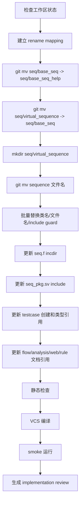

# memblock sequence rename and directory relayout plan

## 1. Plan 定位

本文是 mem_ut sequence 命名和目录结构整理方案，只做重命名和路径重排，不改变测试激励行为、DUT 驱动行为、RM/checker/covergroup 行为。

目标是把当前名称中容易误解的 `real_smoke`、`mixed_smoke`、`lintsissue/lsqenq/lsqcommit/redirect dispatch sequence` 统一改成更明确的 base/main-table 语义，并重新整理 `seq` 目录职责。

本 plan 不实现功能逻辑变更：

```text
1. 不修改主表生成算法。
2. 不修改 issue、LSQ enqueue、LSQ commit、redirect、L2TLB、flushSb 的驱动时序。
3. 不新增旧类名兼容 typedef。
4. 不保留旧文件名兼容 include。
5. 不修改 testcase 行为，除非只是更新类名引用。
```

## 2. 当前结构

当前 sequence 目录：

```text
mem_ut/ver/ut/memblock/seq/
  base_seq/
    common_data_transaction.sv
    dispatch_monitor_batch_handler.sv
    dispatch_monitor_event_adapter.sv
    exception_redirect_replay_handler.sv
    issue_field_assigner.sv
    issue_queue_scheduler.sv
    lsq_commit_handler.sv
    lsq_ctrl_model.sv
    main_control_transaction.sv
    mem_base_sequence.sv
    memblock_dispatch_base_sequence.sv
    memblock_dispatch_types.sv
    memblock_tlb_entry.sv
    mmu_csr_runtime_state.sv
    rob_order_util.sv
    seq_csr_common.sv
    status_transaction.sv
    tlb_map_builder.sv
    writeback_status_handler.sv
  virtual_sequence/
    memblock_lsqenq_dispatch_sequence.sv
    memblock_lintsissue_dispatch_sequence.sv
    memblock_lsqcommit_dispatch_sequence.sv
    memblock_flushsb_base_sequence.sv
    memblock_redirect_dispatch_sequence.sv
    memblock_l2tlb_base_sequence.sv
    memblock_dispatch_real_smoke_sequence.sv
    memblock_dispatch_real_mixed_smoke_sequence.sv
    soft_test/
      soft_test_memblock_dispatch_smoke_sequence.sv
      soft_test_memblock_dispatch_fault_smoke_sequence.sv
      soft_test_memblock_dispatch_replay_smoke_sequence.sv
```

当前编译入口：

```text
mem_ut/ver/ut/memblock/seq/seq.f:
  +incdir+./base_seq
  +incdir+./virtual_sequence
  +incdir+./virtual_sequence/soft_test

mem_ut/ver/ut/memblock/seq/seq_pkg.sv:
  裸 include 各 sv 文件名，依赖 seq.f 中的 incdir 搜索路径。
```

## 3. 目标命名

### 3.1 类名和文件名重命名

以下类名和文件名同步改名。文件名必须和主类名保持一致。

| 当前类名/文件名 | 目标类名/文件名 | 命名意图 |
|---|---|---|
| `memblock_lintsissue_dispatch_sequence` | `memblock_issue_dispatch_base_sequence` | 表示 issue dispatch 基础驱动 sequence，不绑定 lintsissue 缩写命名 |
| `memblock_lsqcommit_dispatch_sequence` | `memblock_lsqcommit_dispatch_base_sequence` | 表示 LSQ commit 基础驱动 sequence |
| `memblock_lsqenq_dispatch_sequence` | `memblock_lsqenq_dispatch_base_sequence` | 表示 LSQ enqueue 基础驱动 sequence |
| `memblock_redirect_dispatch_sequence` | `memblock_redirect_dispatch_base_sequence` | 表示 redirect 基础驱动 sequence |
| `memblock_dispatch_real_smoke_sequence` | `memblock_main_dispatch_auto_build_main_table_base_sequence` | 表示主表自动构建并驱动真实 dispatch flow 的基础 sequence |
| `memblock_dispatch_real_mixed_smoke_sequence` | `memblock_main_dispatch_manual_main_table_sequence` | 表示手工构造 main table 后复用真实 dispatch flow 的 sequence |

对应文件名：

```text
memblock_lintsissue_dispatch_sequence.sv
  -> memblock_issue_dispatch_base_sequence.sv

memblock_lsqcommit_dispatch_sequence.sv
  -> memblock_lsqcommit_dispatch_base_sequence.sv

memblock_lsqenq_dispatch_sequence.sv
  -> memblock_lsqenq_dispatch_base_sequence.sv

memblock_redirect_dispatch_sequence.sv
  -> memblock_redirect_dispatch_base_sequence.sv

memblock_dispatch_real_smoke_sequence.sv
  -> memblock_main_dispatch_auto_build_main_table_base_sequence.sv

memblock_dispatch_real_mixed_smoke_sequence.sv
  -> memblock_main_dispatch_manual_main_table_sequence.sv
```

### 3.2 目录重排

本文将用户要求解释为目录重命名：

```text
seq/base_seq
  -> seq/base_seq_help

seq/virtual_sequence
  -> seq/base_seq

新建空目录：
  seq/virtual_sequence
```

目标结构：

```text
mem_ut/ver/ut/memblock/seq/
  base_seq_help/
    common data、transaction、handler、scheduler、builder、工具类等 helper
  base_seq/
    memblock_lsqenq_dispatch_base_sequence.sv
    memblock_issue_dispatch_base_sequence.sv
    memblock_lsqcommit_dispatch_base_sequence.sv
    memblock_flushsb_base_sequence.sv
    memblock_redirect_dispatch_base_sequence.sv
    memblock_l2tlb_base_sequence.sv
    memblock_main_dispatch_auto_build_main_table_base_sequence.sv
    memblock_main_dispatch_manual_main_table_sequence.sv
    soft_test/
      soft_test_memblock_dispatch_smoke_sequence.sv
      soft_test_memblock_dispatch_fault_smoke_sequence.sv
      soft_test_memblock_dispatch_replay_smoke_sequence.sv
  virtual_sequence/
    预留给后续真正 top-level virtual sequence 编排层
```

目录语义：

```text
base_seq_help:
  放 transaction、common data、handler、scheduler、adapter、builder、工具函数和公共参数读取类。
  这些文件通常不直接作为 agent default sequence 启动。

base_seq:
  放可被 testcase 或 agent default sequence 启动/复用的基础 sequence。
  包括 LSQ enqueue、issue、LSQ commit、redirect、L2TLB、flushSb、main dispatch flow。

virtual_sequence:
  保留为空目录，后续只放跨多个 base sequence 的顶层编排 sequence。
  本轮不把已有文件迁入该目录。
```

## 4. 修改范围

源码和编译入口：

```text
mem_ut/ver/ut/memblock/seq/seq.f
mem_ut/ver/ut/memblock/seq/seq_pkg.sv
mem_ut/ver/ut/memblock/seq/base_seq/*
mem_ut/ver/ut/memblock/seq/virtual_sequence/*
mem_ut/ver/ut/memblock/tc/src/*.sv
mem_ut/ver/ut/memblock/tc/tc_pkg.sv
```

需要同步检查的文档：

```text
AI_DOC/mem_ut_flow_doc/*.md
AI_DOC/analysis/**/*.md
AI_DOC/web/**/*.js
AI_DOC/project_management/*.md
mem_ut/ver/ut/memblock/rule/*.md
```

文档同步策略：

```text
1. 当前有效 flow 文档必须更新到新路径和新类名。
2. 历史 review/plan 可以保留旧名，但如被当前规则或 flow 引用，需要加注“旧名历史文档，以新 plan/review 为准”。
3. Web 展示入口如果显示函数名/路径，也必须同步更新。
```

## 5. 执行 Flow



函数调用 Flow 图整体文字伪代码：

```text
先检查工作区是否有无关脏改动：
  如果有无关改动，只记录并避免修改无关文件；
  本轮不回滚用户改动。

建立旧名到新名的映射表：
  类名、文件名、include guard、UVM factory 名称必须同一张表驱动；
  防止文件改名后类名仍保留旧名。

先做目录级 git mv：
  将 seq/base_seq 移到 seq/base_seq_help；
  将 seq/virtual_sequence 移到 seq/base_seq；
  新建 seq/virtual_sequence 作为空的顶层 virtual sequence 目录。

再做文件级 git mv：
  对 6 个目标 sequence 文件逐一改名；
  soft_test 子目录和未改名 sequence 文件保持原名。

替换源码内容：
  修改 class 名、endclass 标签、function/task 作用域限定名、constructor 默认 name、UVM object utils 注册名；
  修改 include guard 宏名，避免旧宏名导致 include 被错误跳过。

更新编译入口：
  seq.f 的 incdir 从旧目录改成 base_seq_help、base_seq、base_seq/soft_test、virtual_sequence；
  seq_pkg.sv 的 include 文件名改为新文件名；
  include 顺序保持 helper 在前、sequence 在后，避免依赖倒置。

更新 testcase：
  所有 type declaration、type_id::create() 和 fatal 文本中的旧类名替换为新类名；
  不改变 testcase cfg 或 run flow。

更新文档：
  当前 flow 文档和 web 函数展示替换为新类名/路径；
  历史 plan/review 如不属于当前有效入口，可不批量改旧正文，但需要避免规则文档继续指向旧名。

最后执行静态检查、编译和 smoke。
```

## 6. 关键实现细节

### 6.1 类名替换规则

每个文件内部必须同步替换以下位置：

```text
class <old> extends ...
`uvm_object_utils(<old>)
function <old>::new(...)
task/function <old>::...
endclass:<old>
默认 name 字符串
UVM fatal/info 文本中的旧类名
include guard 宏名
```

文字伪代码：

```text
对每个 rename item：
  读取旧文件；
  按 token 级别替换类名，不只替换文件名；
  检查旧类名不再出现在 mem_ut/ver/ut/memblock 源码中；
  如果旧类名只出现在历史文档，记录为文档遗留，不影响编译。
```

### 6.2 目录 incdir 规则

目标 `seq.f`：

```text
+incdir+./base_seq_help
+incdir+./base_seq
+incdir+./base_seq/soft_test
+incdir+./virtual_sequence
seq_pkg.sv
```

说明：

```text
seq_pkg.sv 使用裸 include 文件名；
因此每个 include 文件所在目录必须出现在 seq.f incdir 中。
base_seq_help 必须排在 base_seq 前，因为 sequence 文件依赖 helper 类型。
virtual_sequence 保留为空目录时仍可加入 incdir，便于后续新增顶层 virtual sequence。
```

### 6.3 `seq_pkg.sv` include 顺序

目标顺序：

```text
先 include base_seq_help 中的类型、transaction、handler、scheduler、adapter、base sequence helper。
再 include base_seq 中的 soft_test sequence 和各基础驱动 sequence。
最后 include mem_base_sequence.sv。
```

注意：

```text
memblock_main_dispatch_manual_main_table_sequence 继承 memblock_main_dispatch_auto_build_main_table_base_sequence；
因此 auto build sequence 必须先 include。
```

### 6.4 空 `virtual_sequence` 目录处理

Git 默认不跟踪空目录。

方案：

```text
在新建 seq/virtual_sequence/ 下添加 .gitkeep。
```

`.gitkeep` 内容：

```text
This directory is reserved for top-level virtual sequence orchestration.
```

如果项目不希望提交 `.gitkeep`：

```text
可在 review 中说明 Git 不跟踪空目录；
但 coding 后本地目录必须存在。
```

本 plan 推荐提交 `.gitkeep`，避免目录重排在其他环境中丢失。

## 7. 需要更新的引用点

### 7.1 源码引用

必须替换：

```text
mem_ut/ver/ut/memblock/tc/src/tc_dispatch_real_smoke.sv
mem_ut/ver/ut/memblock/tc/src/tc_dispatch_real_mixed_wb_smoke.sv
mem_ut/ver/ut/memblock/tc/src/tc_dispatch_real_store_smoke.sv
mem_ut/ver/ut/memblock/tc/src/tc_dispatch_real_store_wb_smoke.sv
mem_ut/ver/ut/memblock/tc/src/tc_dispatch_real_store_sta_wb_smoke.sv
mem_ut/ver/ut/memblock/tc/src/tc_dispatch_real_multi_store_wb_smoke.sv
mem_ut/ver/ut/memblock/tc/src/tc_dispatch_real_mixed_sta_wb_smoke.sv
mem_ut/ver/ut/memblock/seq/seq_pkg.sv
mem_ut/ver/ut/memblock/seq/seq.f
```

实际执行时用 `rg` 确认完整列表，不以上述列表为唯一来源。

### 7.2 文档引用

高优先级更新：

```text
AI_DOC/mem_ut_flow_doc/load_sta_std_issue_flow.md
AI_DOC/mem_ut_flow_doc/lsq_admission_flow.md
AI_DOC/mem_ut_flow_doc/rob_commit_lq_sq_deq_flow.md
AI_DOC/mem_ut_flow_doc/redirect_flow.md
AI_DOC/mem_ut_flow_doc/tlb_l2tlb_responder_flow.md
AI_DOC/mem_ut_flow_doc/main_table_build_and_stimulus_flow.md
AI_DOC/mem_ut_flow_doc/normal_pass_flow.md
AI_DOC/mem_ut_flow_doc/writeback_function_call_flow.md
AI_DOC/mem_ut_flow_doc/soft_test_and_mixed_directed_flow.md
AI_DOC/mem_ut_flow_doc/main_table_boundary_profile_generation_flow.md
AI_DOC/web/web_assets/memblock_dispatch_doc.js
```

中低优先级检查：

```text
AI_DOC/analysis/source_sv/common_data_transaction_function_analysis.md
AI_DOC/plan/test_framework/**/*.md
AI_DOC/project_management/**/*.md
mem_ut/ver/ut/memblock/rule/**/*.md
```

## 8. 不兼容旧名策略

本轮不兼容旧类名。

不添加：

```systemverilog
typedef memblock_issue_dispatch_base_sequence memblock_lintsissue_dispatch_sequence;
```

原因：

```text
1. 用户要求是改名和目录重排，不是新增别名。
2. 保留旧 typedef 会让 rg 继续命中旧名，后续维护者无法判断旧名是否仍是有效入口。
3. UVM factory 名称应只保留新类，避免旧/新两个名字同时可 create。
```

失败策略：

```text
如果编译发现旧类名引用残留，直接修引用；
不通过 typedef 兜底。
```

## 9. 验证方案

### 9.1 静态检查

```bash
git diff --check -- \
  mem_ut/ver/ut/memblock/seq \
  mem_ut/ver/ut/memblock/tc \
  AI_DOC

rg -n "memblock_lintsissue_dispatch_sequence|memblock_lsqcommit_dispatch_sequence|memblock_lsqenq_dispatch_sequence|memblock_redirect_dispatch_sequence|memblock_dispatch_real_smoke_sequence|memblock_dispatch_real_mixed_smoke_sequence" \
  mem_ut/ver/ut/memblock

rg -n "seq/base_seq/|seq/virtual_sequence/" \
  mem_ut/ver/ut/memblock/seq \
  mem_ut/ver/ut/memblock/tc
```

期望：

```text
源码和编译入口不再出现旧类名、旧文件名、旧目录引用。
历史 AI_DOC 文档可以存在旧名，但当前 flow/web/rule 必须更新。
```

### 9.2 编译

```bash
cd mem_ut/ver/ut/memblock/sim
make eda_compile tc=tc_sanity mode=base_fun
```

期望：

```text
seq_pkg.sv include 全部成功；
UVM factory 注册新类名成功；
testcase 中新类名 create 成功通过编译。
```

### 9.3 Smoke

至少运行：

```bash
make eda_batch_run tc=tc_dispatch_real_smoke mode=base_fun cfg=tc_dispatch_real_smoke
make eda_batch_run tc=tc_dispatch_real_mixed_wb_smoke mode=base_fun cfg=tc_dispatch_real_mixed_wb_smoke
```

检查点：

```text
tc_dispatch_real_smoke:
  日志出现新类名 memblock_main_dispatch_auto_build_main_table_base_sequence；
  main table ready；
  不出现旧类名 create/fatal。

tc_dispatch_real_mixed_wb_smoke:
  日志出现新类名 memblock_main_dispatch_manual_main_table_sequence；
  manual main table 导入两条 transaction；
  后续 service_real_dispatch_flow 正常启动。
```

如果 smoke 后段因现有 DUT/sequence 进展 timeout：

```text
必须区分是否已经 main table ready；
如果失败发生在 include/factory/create 阶段，视为改名失败；
如果已进入后端真实执行阶段，按对应 sequence flow 单独分析。
```

## 10. 风险与规避

风险 1：include guard 未改导致新文件被旧宏跳过。

规避：

```text
每个改名文件的 `ifndef/`define 宏同步改成新类名大写版本。
编译后用 rg 检查旧宏名。
```

风险 2：裸 include 文件名与 incdir 顺序冲突。

规避：

```text
保持 helper 目录和 sequence 目录中文件名唯一；
seq.f 中 base_seq_help 放在 base_seq 前；
执行 VCS compile 验证。
```

风险 3：文档引用面很大。

规避：

```text
先保证源码和当前 flow/web 文档更新；
历史 plan/review 只做必要注记，不强行大面积改历史正文；
implementation review 明确列出仍保留旧名的历史文档范围。
```

风险 4：目录名语义反转导致后续误用。

规避：

```text
在 seq/base_seq_help/README.md、seq/base_seq/README.md、seq/virtual_sequence/.gitkeep 或 README 中写明目录职责；
如果不希望新增 README，本 plan 至少要求 review 文档记录目录职责。
```

## 11. 完成标准

```text
1. 6 个 sequence 类名、文件名、include guard、constructor 默认 name、UVM factory 注册全部改为目标名。
2. seq/base_seq 已改为 seq/base_seq_help。
3. seq/virtual_sequence 已改为 seq/base_seq。
4. 新 seq/virtual_sequence 已创建，并通过 .gitkeep 或 README 保留。
5. seq.f incdir 更新为 base_seq_help、base_seq、base_seq/soft_test、virtual_sequence。
6. seq_pkg.sv include 文件名和顺序正确。
7. testcase 中不再引用旧 sequence 类名。
8. mem_ut/ver/ut/memblock 源码中 rg 旧类名无结果。
9. 当前 flow/web/rule 文档引用更新到新类名和新路径。
10. VCS compile 通过。
11. real smoke 和 mixed smoke 至少到 main table ready；如完整 smoke 未通过，review 中说明失败阶段和原因。
12. 生成 implementation review，并将本 plan 从 undo 归档到 do。
```

## 12. 预期差异说明

本 plan 是纯 rename/re-layout plan。实现后允许出现的差异只有：

```text
1. 日志中的 sequence type/name 字符串从旧名变为新名。
2. VCS 编译文件路径从 seq/base_seq、seq/virtual_sequence 变为 seq/base_seq_help、seq/base_seq。
3. UVM factory create 的类名从旧类变为新类。
```

不允许出现：

```text
1. main table 内容变化。
2. transaction 字段默认值变化。
3. plus/cfg 参数语义变化。
4. issue/commit/redirect/L2TLB/flushSb 驱动时序变化。
5. 为兼容旧名新增 typedef 或 wrapper class。
```
