# MemBlock Dispatch 测试框架职责清晰化优化审查

本文基于当前 mem_ut/memblock dispatch 测试框架源码和已有 flow 文档，审查函数职责是否清晰、调用链是否绕、状态真源是否明确，以及是否存在重复处理或支持边界不清的问题。

审查准则：

- 测试框架逻辑清晰明了。
- 函数职责简单分明。
- 状态更新有明确 owner。
- 功能支持边界明确，不让“看似支持”掩盖未完成能力。
- 优先低风险收敛，不建议一次性大重构。

重点源码：

- `mem_ut/ver/ut/memblock/seq/virtual_sequence/memblock_dispatch_real_smoke_sequence.sv`
- `mem_ut/ver/ut/memblock/seq/base_seq/memblock_dispatch_base_sequence.sv`
- `mem_ut/ver/ut/memblock/seq/base_seq/dispatch_monitor_event_adapter.sv`
- `mem_ut/ver/ut/memblock/seq/base_seq/writeback_status_handler.sv`
- `mem_ut/ver/ut/memblock/seq/base_seq/exception_redirect_replay_handler.sv`
- `mem_ut/ver/ut/memblock/seq/base_seq/common_data_transaction.sv`
- `mem_ut/ver/ut/memblock/seq/base_seq/issue_queue_scheduler.sv`
- `mem_ut/ver/ut/memblock/seq/base_seq/lsq_commit_handler.sv`
- `mem_ut/ver/ut/memblock/seq/virtual_sequence/memblock_lsqenq_dispatch_sequence.sv`
- `mem_ut/ver/ut/memblock/seq/virtual_sequence/memblock_lintsissue_dispatch_sequence.sv`
- `mem_ut/ver/ut/memblock/seq/virtual_sequence/memblock_redirect_dispatch_sequence.sv`

## 1. 总体结论

当前框架的主流程已经能覆盖 real DUT dispatch 闭环：主表生成、LSQ admission、issue route/drive、monitor feedback、writeback/replay/redirect/fault、ROB commit、LSQ deq 和状态收敛。

主要问题不是功能缺失，而是“状态机行为分散在多个类里”，导致读代码时需要跨多个文件拼接完整语义：

- `common_data_transaction` 同时承担数据表、issue queue、feedback queue、redirect 控制、completion 收敛、TLB/CSR、flushSb 等职责。
- feedback event 的分类函数在多个类中重复存在。
- redirect 生命周期跨 handler、data、redirect sequence 三处推进。
- LSQ deq 处理放在 monitor adapter 内部，名字和职责不完全一致。
- atomic multi-uop 当前只生成 `uop_count`，未真正展开，属于支持边界不清。

推荐最优策略：

1. 短期先做“语义收敛”：统一事件分类入口、补 contract 文档、明确 unsupported boundary。
2. 中期做“轻量 facade”：不搬数据结构，只把 `common_data_transaction` 的大 API 分成 focused facade。
3. 长期再考虑 controller 化：redirect、completion、admission/issue 分别有明确 owner。

## 2. 优化项总表

| ID | 优先级 | 分类 | 问题 | 推荐处理 |
| --- | --- | --- | --- | --- |
| OPT-01 | high | monitor/event | feedback event 分类逻辑重复 | 增加统一分类入口 |
| OPT-02 | medium | monitor/event | CSR/raw event drain 顺序绕 | 封装单周期 drain 入口 |
| OPT-03 | medium | monitor/event | STD software pass 直接调 writeback handler | 显式软件 feedback adapter |
| OPT-04 | medium | redirect/replay/fault | fault recovery 消费函数名易误解 | 重命名为 consume fault event |
| OPT-05 | high | redirect/replay/fault | redirect 生命周期分散 | 封装 redirect controller facade |
| OPT-06 | medium | redirect/replay/fault | replay pending 到 route 边界隐含 | 增加 route hint 或统计日志 |
| OPT-07 | medium | admission | LSQ cancel 由 redirect 写、admission 消费 | 明确 deferred rollback 或提前消费 |
| OPT-08 | low | admission | non-LSQ admission 名字不直观 | admission 命名分层 |
| OPT-09 | high | route/issue | atomic multi-uop 看似支持但未展开 | fatal/disable 或真实展开 |
| OPT-10 | medium | route/issue | issue fire 两个函数重复 | 合并为 accept mode |
| OPT-11 | medium | commit/deq | ROB commit 和 LSQ deq completion 交错 | completion controller facade |
| OPT-12 | high | 公共状态 | common_data_transaction 职责过大 | focused facade 分层 |
| OPT-13 | low | 文档/命名 | 缺事件 contract 总表 | 新增 dispatch_event_contract.md |

## 3. OPT-01：统一 feedback event 分类入口

优先级：high

相关函数：

- `writeback_status_handler::event_has_fault()`
- `writeback_status_handler::event_is_redirect()`
- `writeback_status_handler::event_is_replay()`
- `exception_redirect_replay_handler::event_is_redirect()`
- `exception_redirect_replay_handler::event_is_replay()`
- `exception_redirect_replay_handler::event_is_fault()`
- `common_data_transaction::feedback_event_is_redirect()`
- `common_data_transaction::feedback_event_is_replay()`
- `common_data_transaction::feedback_event_has_fault()`
- `common_data_transaction::feedback_event_has_action()`

现有职责：

- writeback handler 用这些 helper 决定 normal pass/fault/replay/redirect。
- recovery handler 再次分类，决定 redirect 优先、replay 处理、fault 消费。
- common_data 用这些 helper 做 normalize 和 queue 接收判断。

不清晰点：

- 同一事件语义散在三个类中。
- redirect valid 一致性检查也重复。
- 当前优先级靠调用顺序隐含，而不是由一个统一 policy 表达。

风险：

- 后续新增 atomic/vector/fault source 时可能只改某一个 handler，导致状态分叉。
- 某个 event 同时带 replay/fault 时的优先级不够直观，需要读多个函数才能知道 replay 优先。

推荐优化：

新增统一分类入口，例如：

```systemverilog
typedef enum int unsigned {
    MEMBLOCK_FEEDBACK_DROP,
    MEMBLOCK_FEEDBACK_PASS,
    MEMBLOCK_FEEDBACK_FAULT,
    MEMBLOCK_FEEDBACK_REPLAY,
    MEMBLOCK_FEEDBACK_REDIRECT
} memblock_feedback_kind_e;

function automatic memblock_feedback_kind_e classify_feedback_event(memblock_wb_event_t event);
```

第一版可以放在 `common_data_transaction` 或新建轻量 `memblock_feedback_event_policy.sv`。短期不要求搬所有逻辑，只要求 writeback handler 和 recovery handler 共用一个分类函数。

原逻辑调用图：

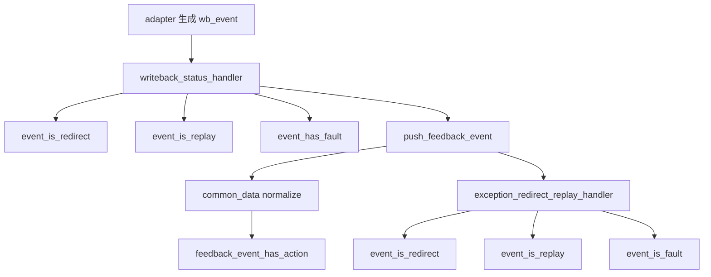
```mermaid
flowchart TD
    A[adapter 生成 wb_event] --> B[writeback_status_handler]
    B --> C1[event_is_redirect]
    B --> C2[event_is_replay]
    B --> C3[event_has_fault]
    B --> D[push_feedback_event]
    D --> E[common_data normalize]
    E --> E1[feedback_event_has_action]
    D --> F[exception_redirect_replay_handler]
    F --> G1[event_is_redirect]
    F --> G2[event_is_replay]
    F --> G3[event_is_fault]
```

优化逻辑图：

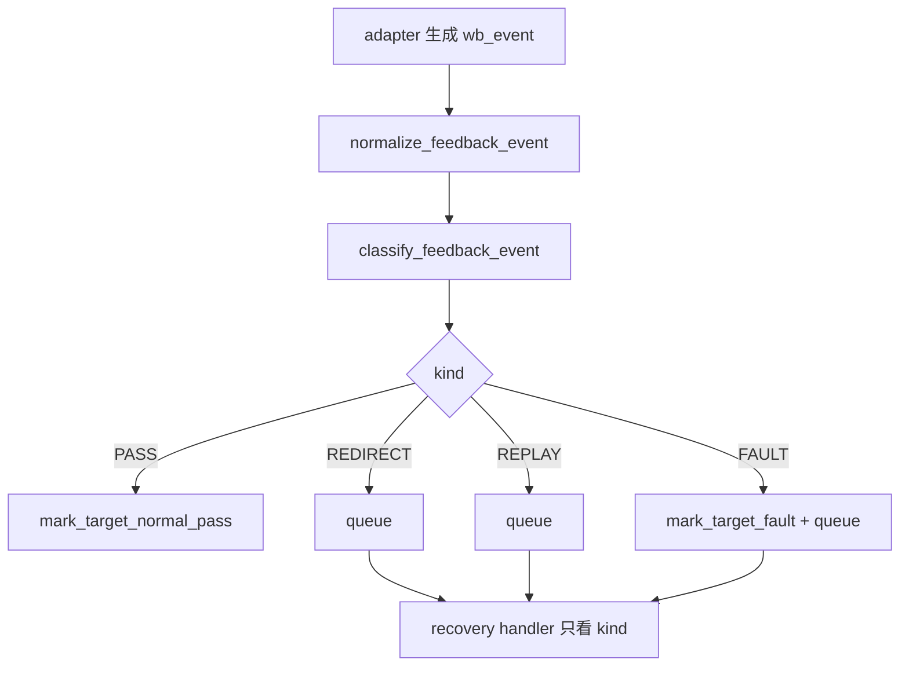
```mermaid
flowchart TD
    A[adapter 生成 wb_event] --> B[normalize_feedback_event]
    B --> C[classify_feedback_event]
    C --> D{kind}
    D -->|PASS| E[mark_target_normal_pass]
    D -->|FAULT| F[mark_target_fault + queue]
    D -->|REPLAY| G[queue]
    D -->|REDIRECT| H[queue]
    H --> I[recovery handler 只看 kind]
    G --> I
    F --> I
```

实施建议：

- 第一阶段只新增函数并替换分类判断，不改状态机。
- 第二阶段把事件优先级写成注释或小表：`REDIRECT > REPLAY > FAULT > PASS`。

## 4. OPT-02：封装单周期 monitor drain 入口

优先级：medium

相关函数：

- `memblock_dispatch_real_smoke_sequence::service_monitor_once()`
- `memblock_dispatch_base_sequence::collect_csr_runtime_events()`
- `memblock_dispatch_base_sequence::collect_writeback_events()`
- `memblock_dispatch_base_sequence::collect_exception_and_redirect_events()`
- `dispatch_monitor_event_adapter::drain_writeback_events()`
- `dispatch_monitor_event_adapter::drain_exception_and_redirect_events()`
- `dispatch_monitor_event_adapter::drain_csr_events()`

现有职责：

- service loop 显式调用 CSR、writeback、exception/redirect 三段收集。
- adapter 的 `drain_writeback_events()` 和 `drain_exception_and_redirect_events()` 内部又各自调用 `drain_csr_events()`。
- `collect_runtime_context_events()` 已把 CSR runtime 与 sfence/hfence 的统一上下文 drain 显式化为 `drain_csr_events()` -> `drain_sfence_events()`。

不清晰点：

- 同一 service cycle 中 CSR drain 入口不止一处。
- 读者需要追踪多个 wrapper 才知道当前拍 raw event 的处理顺序。

风险：

- CSR runtime、sfence、PTW replay、fault、redirect 同拍时，状态快照先后不直观。
- 如果后续调整顺序，容易漏改某个 wrapper 中的 `drain_csr_events()`。

推荐优化：

新增单一入口：

```systemverilog
task dispatch_monitor_event_adapter::drain_monitor_cycle(writeback_status_handler wb_handler);
    drain_csr_events();
    drain_writeback_events_no_csr(wb_handler);
    drain_ctrl_events_no_csr(wb_handler);
endtask
```

原逻辑调用图：

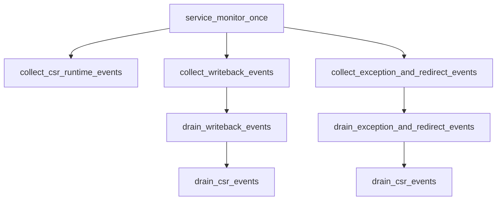
```mermaid
flowchart TD
    A[service_monitor_once] --> B[collect_csr_runtime_events]
    A --> C[collect_writeback_events]
    C --> C1[drain_writeback_events]
    C1 --> C2[drain_csr_events]
    A --> D[collect_exception_and_redirect_events]
    D --> D1[drain_exception_and_redirect_events]
    D1 --> D2[drain_csr_events]
```

优化逻辑图：

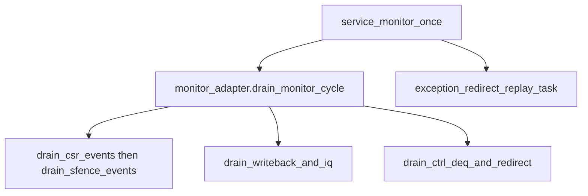
```mermaid
flowchart TD
    A[service_monitor_once] --> B[monitor_adapter.drain_monitor_cycle]
    B --> C[drain_csr_events then drain_sfence_events]
    B --> D[drain_writeback_and_iq]
    B --> E[drain_ctrl_deq_and_redirect]
    A --> F[exception_redirect_replay_task]
```

实施建议：

- 先保留旧函数，新增 `drain_monitor_cycle()`。
- `service_monitor_once()` 改用新入口。
- 旧函数作为低层 helper，命名加 `_no_csr` 或注释说明。

## 5. OPT-03：显式化 STD software pass 伪反馈来源

优先级：medium

相关函数：

- `memblock_lintsissue_dispatch_sequence::item_needs_issue_accept_pass()`
- `memblock_lintsissue_dispatch_sequence::make_issue_accept_pass_event()`
- `memblock_lintsissue_dispatch_sequence::submit_issue_accept_pass()`
- `writeback_status_handler::handle_event()`

现有职责：

- 普通 feedback 由 monitor adapter 采 DUT raw event 后进入 writeback handler。
- 当 `MEMBLOCK_STD_REAL_WB_PASS_EN=0` 时，STD fire 后由 issue sequence 构造一个 `STD_FEEDBACK` event，直接调用 writeback handler。

不清晰点：

- 大部分 producer 是 monitor，只有 STD software pass 从 issue sequence 直接注入。
- 从函数名看不出这是“非严格 DUT flow”的软件闭环。

风险：

- `MEMBLOCK_STD_REAL_WB_PASS_EN` 切换时，可能出现真实 STD pass 和软件 pass 双源竞争。
- 新人可能误以为 STD feedback 一定来自 monitor。

推荐优化：

新增显式适配层：

```systemverilog
class software_feedback_adapter;
    function void submit_std_accept_pass(memblock_issue_q_item_t item);
endclass
```

或者至少重命名当前函数：

- `submit_issue_accept_pass()` -> `submit_software_std_accept_pass()`
- `make_issue_accept_pass_event()` -> `make_software_std_pass_event()`

原逻辑调用图：

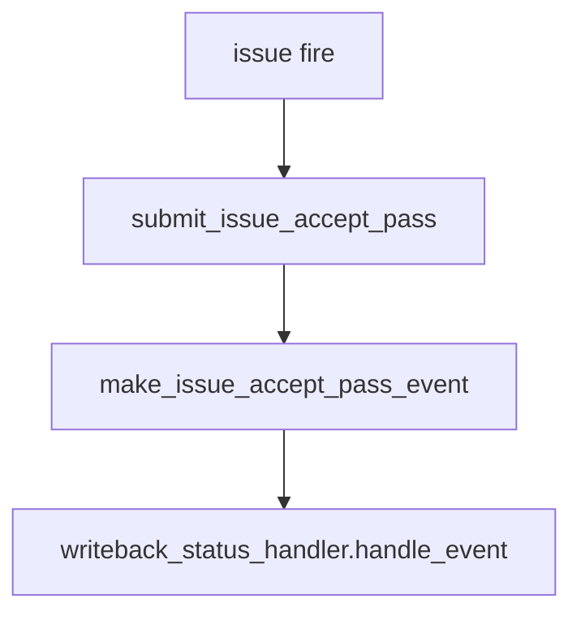
```mermaid
flowchart TD
    A[issue fire] --> B[submit_issue_accept_pass]
    B --> C[make_issue_accept_pass_event]
    C --> D[writeback_status_handler.handle_event]
```

优化逻辑图：

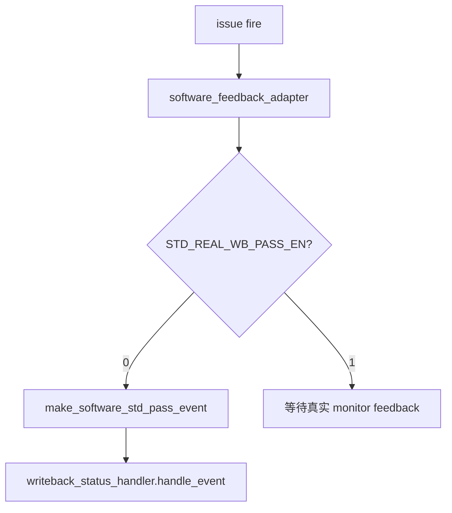
```mermaid
flowchart TD
    A[issue fire] --> B[software_feedback_adapter]
    B --> C{STD_REAL_WB_PASS_EN?}
    C -->|0| D[make_software_std_pass_event]
    C -->|1| E[等待真实 monitor feedback]
    D --> F[writeback_status_handler.handle_event]
```

实施建议：

- 第一版只改名和文档，不急着新增 class。
- 在 plus 参数分组中继续把 `MEMBLOCK_STD_REAL_WB_PASS_EN` 标为“非严格 DUT flow 控制参数”。

## 6. OPT-04：fault recovery 消费函数重命名

优先级：medium

相关函数：

- `writeback_status_handler::handle_event()`
- `common_data_transaction::mark_target_fault()`
- `exception_redirect_replay_handler::handle_fault_event()`

现有职责：

- writeback handler 是 fault 状态唯一落表点。
- recovery handler 的 `handle_fault_event()` 当前只解析 uid/epoch/replay_seq 并打印日志，不重复写 fault 状态。

不清晰点：

- `handle_fault_event()` 这个名字容易被理解成“真正处理 fault 状态”。
- 历史方案曾经有二次 `mark_target_fault()`，后续维护者可能误恢复。

风险：

- fault 状态双写会让 redirect/replay 边界上的 stale event 更难判断。
- 文档和代码如果不同步，会误导后续实现。

推荐优化：

重命名：

- `handle_fault_event()` -> `consume_fault_recovery_event()`

并在函数注释中写明：

- fault 状态已经由 writeback handler 落表。
- recovery 阶段只负责队列优先级后的消费确认。

原逻辑调用图：

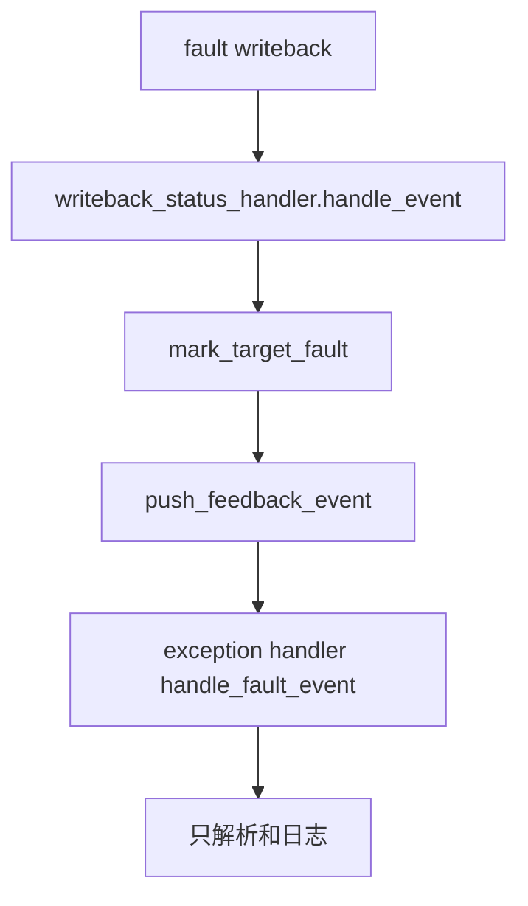
```mermaid
flowchart TD
    A[fault writeback] --> B[writeback_status_handler.handle_event]
    B --> C[mark_target_fault]
    C --> D[push_feedback_event]
    D --> E[exception handler handle_fault_event]
    E --> F[只解析和日志]
```

优化逻辑图：

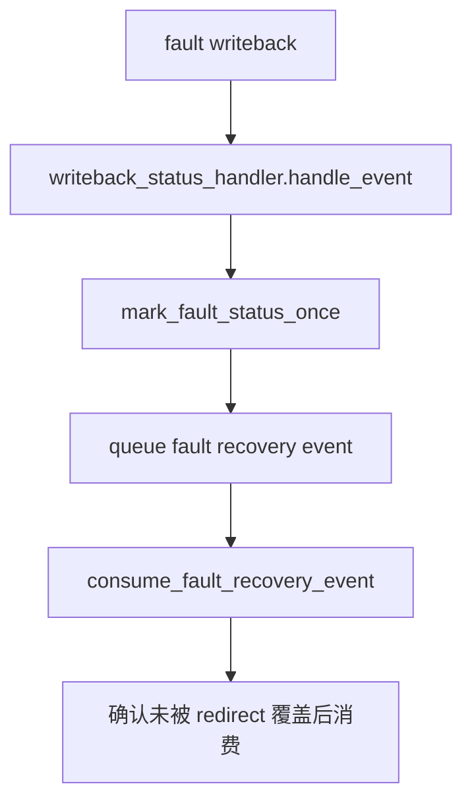
```mermaid
flowchart TD
    A[fault writeback] --> B[writeback_status_handler.handle_event]
    B --> C[mark_fault_status_once]
    C --> D[queue fault recovery event]
    D --> E[consume_fault_recovery_event]
    E --> F[确认未被 redirect 覆盖后消费]
```

实施建议：

- 低风险重命名即可，不改变行为。
- 同步更新 `fault_exception_flow.md`。

## 7. OPT-05：封装 redirect 生命周期控制

优先级：high

相关函数：

- `exception_redirect_replay_handler::select_oldest_redirect()`
- `exception_redirect_replay_handler::advance_active_redirect()`
- `common_data_transaction::request_redirect_flush()`
- `common_data_transaction::push_redirect_drive()`
- `common_data_transaction::try_pop_redirect_drive()`
- `common_data_transaction::mark_redirect_drive_done()`
- `common_data_transaction::redirect_drive_done_for()`
- `common_data_transaction::apply_redirect_flush()`
- `memblock_redirect_dispatch_sequence::drive_redirect_payload()`

现有职责：

- recovery handler 选择 redirect 并轮询 active redirect。
- common data 保存 redirect phase、pending drive queue、done epoch、active redirect、flush 状态。
- redirect sequence 从 queue 取 payload 并驱动接口，完成后通知 common data。

不清晰点：

- 一个 redirect 生命周期横跨三个类。
- phase 更新、queue 状态、done 判断、apply flush 分散。
- `common_data_transaction` 既是数据 owner 又像 redirect controller。

风险：

- timeout、inflight、done epoch、phase 任一处被误改，可能造成永久 freeze。
- 后续新增多 redirect、嵌套 redirect、flushSb 协同时会更难维护。

推荐优化：

新增轻量 `redirect_controller` facade，不急着搬走数据，只收敛 API：

```systemverilog
class redirect_controller;
    function void start_redirect(memblock_redirect_payload_t redirect);
    function bit try_pop_drive(output memblock_redirect_payload_t redirect);
    function void on_drive_done(memblock_redirect_payload_t redirect);
    function void tick();
endclass
```

原逻辑调用图：

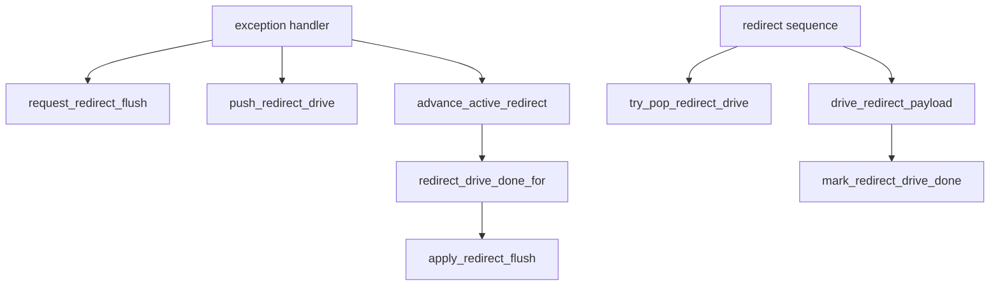
```mermaid
flowchart TD
    A[exception handler] --> B[request_redirect_flush]
    A --> C[push_redirect_drive]
    D[redirect sequence] --> E[try_pop_redirect_drive]
    D --> F[drive_redirect_payload]
    F --> G[mark_redirect_drive_done]
    A --> H[advance_active_redirect]
    H --> I[redirect_drive_done_for]
    I --> J[apply_redirect_flush]
```

优化逻辑图：

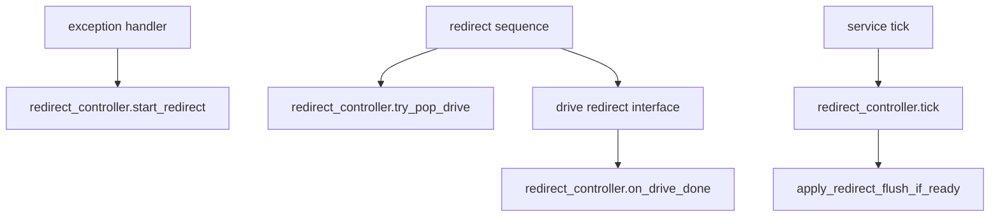
```mermaid
flowchart TD
    A[exception handler] --> B[redirect_controller.start_redirect]
    C[redirect sequence] --> D[redirect_controller.try_pop_drive]
    C --> E[drive redirect interface]
    E --> F[redirect_controller.on_drive_done]
    G[service tick] --> H[redirect_controller.tick]
    H --> I[apply_redirect_flush_if_ready]
```

实施建议：

- 第一阶段只创建 facade，内部仍调用 `common_data_transaction` 原函数。
- 第二阶段再把 phase/done/queue 字段逐步迁到 controller。

## 8. OPT-06：显式化 replay pending 到 route 的边界

优先级：medium

相关函数：

- `exception_redirect_replay_handler::handle_replay_event()`
- `common_data_transaction::mark_replay_pending()`
- `issue_queue_scheduler::is_uid_route_ready()`
- `issue_queue_scheduler::route_all_ready_uids()`
- `issue_queue_scheduler::route_target()`

现有职责：

- replay handler 只把 uid 标记为 `replay_pending` 并设置 `replay_target_*`。
- issue scheduler 后续每拍扫描 active window，把 replay uid 重新入队。

不清晰点：

- `mark_replay_pending()` 不直接触发 route。
- replay 能否重新进 issue queue，依赖后续循环扫描和 scan limit。

风险：

- 如果 `idle_stop`、扫描窗口、`MEMBLOCK_REAL_LSQ_ENQ_MAX` 配置不合适，replay 延迟难定位。
- debug 时看不到“replay pending 已经等待 route 多久”。

推荐优化：

保留当前低风险扫描模型，但补轻量 route hint 或统计字段：

```systemverilog
data.mark_uid_needs_route(uid);
```

第一版可只做计数/日志，不改变调度。

原逻辑调用图：

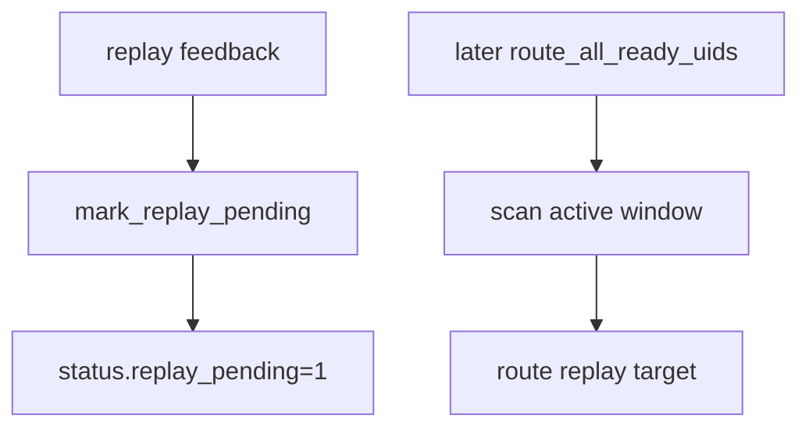
```mermaid
flowchart TD
    A[replay feedback] --> B[mark_replay_pending]
    B --> C[status.replay_pending=1]
    D[later route_all_ready_uids] --> E[scan active window]
    E --> F[route replay target]
```

优化逻辑图：

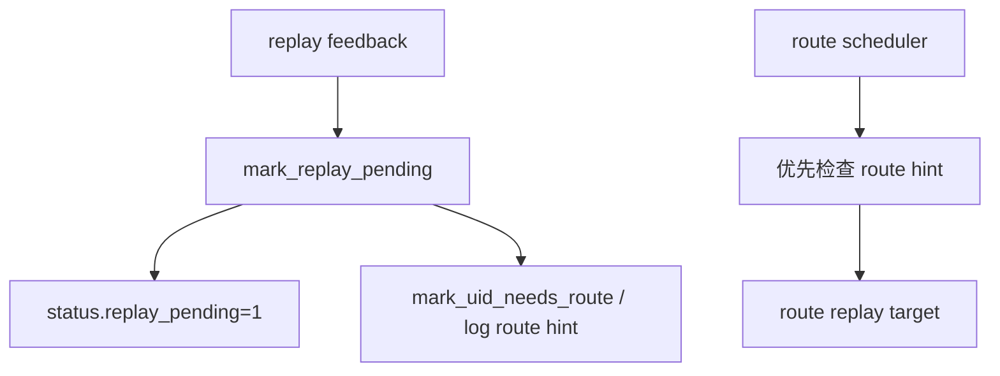
```mermaid
flowchart TD
    A[replay feedback] --> B[mark_replay_pending]
    B --> C[status.replay_pending=1]
    B --> D[mark_uid_needs_route / log route hint]
    E[route scheduler] --> F[优先检查 route hint]
    F --> G[route replay target]
```

实施建议：

- 不建议马上改成纯 worklist，以免引入漏清理问题。
- 可先在 timeout/report 中打印 pending replay uid 和 pending cycles。

## 9. OPT-07：LSQ cancel/rollback 的 owner 更明确

优先级：medium

相关函数：

- `common_data_transaction::prepare_uid_for_redirect_reissue()`
- `memblock_lsqenq_dispatch_sequence::apply_pending_lsq_cancels()`
- `lsq_ctrl_model::cancel_lq()`
- `lsq_ctrl_model::cancel_sq()`

现有职责：

- redirect flush 命中 uid 时，`prepare_uid_for_redirect_reissue()` 累加 `pending_lq_cancel_count/pending_sq_cancel_count`。
- admission sequence 下一轮调用 `apply_pending_lsq_cancels()` 消费这些 cancel，并回退软件 LSQ mirror。

不清晰点：

- redirect apply 阶段已经知道要回退多少，但真正回退软件 LSQ mirror 在 admission sequence 中发生。
- 如果 admission sequence 没开或长时间 idle，pending cancel 会挂着。

风险：

- redirect 后到 admission sequence 消费 cancel 之前，软件 LSQ mirror 与状态表短暂不一致。
- debug 时容易误以为 redirect apply 已经完成全部恢复。

推荐优化：

两种方案：

- 方案 A：保持 deferred 设计，但重命名字段为 `deferred_lq_cancel_count/deferred_sq_cancel_count`，并在 end check 检查必须为 0。
- 方案 B：把 `lsq_ctrl.cancel_lq/cancel_sq` 放到 redirect apply 阶段，由 redirect controller 或 completion facade 统一调用。

当前更推荐方案 A，风险小。

原逻辑调用图：

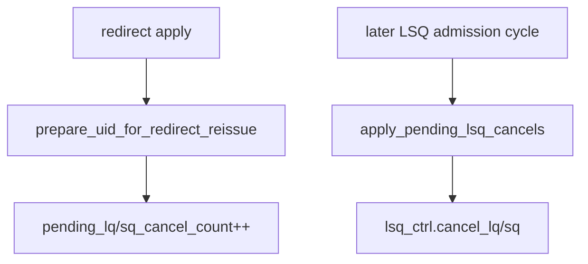
```mermaid
flowchart TD
    A[redirect apply] --> B[prepare_uid_for_redirect_reissue]
    B --> C[pending_lq/sq_cancel_count++]
    D[later LSQ admission cycle] --> E[apply_pending_lsq_cancels]
    E --> F[lsq_ctrl.cancel_lq/sq]
```

优化逻辑图：

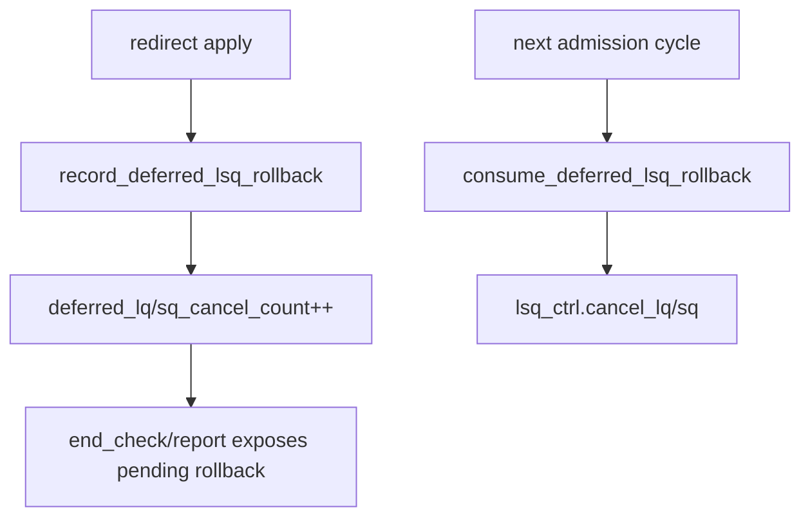
```mermaid
flowchart TD
    A[redirect apply] --> B[record_deferred_lsq_rollback]
    B --> C[deferred_lq/sq_cancel_count++]
    C --> D[end_check/report exposes pending rollback]
    E[next admission cycle] --> F[consume_deferred_lsq_rollback]
    F --> G[lsq_ctrl.cancel_lq/sq]
```

实施建议：

- 先改命名和文档，不强行搬执行时机。
- `end_test_check()` 补 pending cancel 检查。

## 10. OPT-08：admission 命名分层

优先级：low

相关函数：

- `memblock_lsqenq_dispatch_sequence::admit_non_lsq_if_ready()`
- `memblock_lsqenq_dispatch_sequence::collect_lsq_candidates()`
- `lsq_ctrl_model::derive_op_behavior()`

现有职责：

- `memblock_lsqenq_dispatch_sequence` 既处理需要 LQ/SQ 分配的 load/store，也处理 `need_alloc==0` 的 MOU/atomic non-LSQ admission。

不清晰点：

- sequence 名字叫 LSQ enqueue，但实际承担更宽的 admission owner。
- atomic/MOU 的 admission gate 容易被误解为“不经过 admission”。

风险：

- 后续修改 atomic 时可能绕过 `complete_admission()` 或 `issue_ready` 设置。

推荐优化：

命名层面收敛：

- 类名长期可改为 `memblock_admission_dispatch_sequence`。
- 短期把函数改名：
  - `admit_non_lsq_if_ready()` -> `complete_non_lsq_admission_if_ready()`
  - `collect_lsq_candidates()` -> `collect_lsq_alloc_admission_candidates()`

原逻辑调用图：

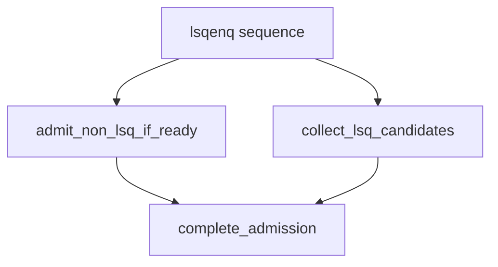
```mermaid
flowchart TD
    A[lsqenq sequence] --> B[admit_non_lsq_if_ready]
    A --> C[collect_lsq_candidates]
    B --> D[complete_admission]
    C --> D
```

优化逻辑图：

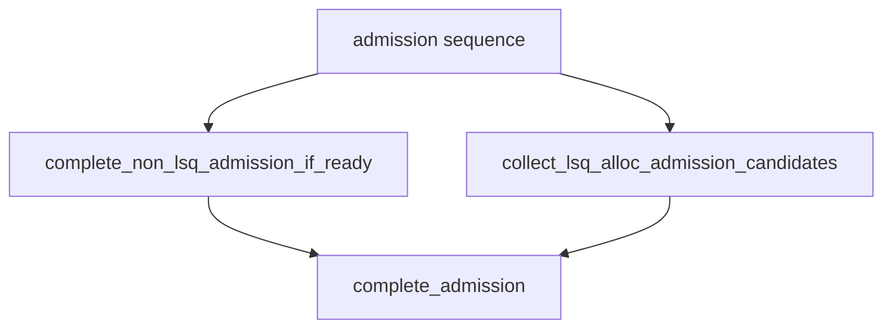
```mermaid
flowchart TD
    A[admission sequence] --> B[complete_non_lsq_admission_if_ready]
    A --> C[collect_lsq_alloc_admission_candidates]
    B --> D[complete_admission]
    C --> D
```

实施建议：

- 低优先级，等待其他优化稳定后再改名。

## 11. OPT-09：明确 atomic multi-uop 支持边界

优先级：high

相关函数：

- `lsq_ctrl_model::derive_op_behavior()`
- `issue_queue_scheduler::make_issue_item()`
- `memblock_lintsissue_dispatch_sequence::assign_issue_items()`

现有职责：

- `derive_op_behavior()` 会为 atomic 设置 `atomic_sta_uop_count/atomic_data_uop_count`。
- `make_issue_item()` 把 `uop_count` 写入 queue item。
- `assign_issue_items()` 当前每个 queue item 只分配一个 pipe slot，没有按 `uop_count` 展开。

不清晰点：

- 从 `atomic_sta_uop_count/atomic_data_uop_count` 看似支持 AMOCAS 多 uop。
- 实际 issue 侧没有展开多个 micro-op。

风险：

- AMOCAS_Q/W/D 等多 uop atomic 覆盖不真实。
- 回归结果可能误以为 atomic 多 uop flow 已支持。

推荐优化：

二选一：

方案 A，保守明确不支持：

- 如果 `uop_count > 1`，直接 `uvm_fatal` 或默认禁止生成该类 atomic。
- 文档写明当前只支持 single-uop atomic 抽象。

方案 B，真实展开：

- route 阶段把 atomic STA/STD 展开成多个 `memblock_issue_q_item_t`。
- 每个 item 写 `uop_index` 和统一 `uop_count`。
- issue fire 和 writeback/replay 匹配都按 uop_index 处理。

当前更推荐先做方案 A，因为 vector/atomic 多 uop 的状态收敛边界更复杂。

原逻辑调用图：

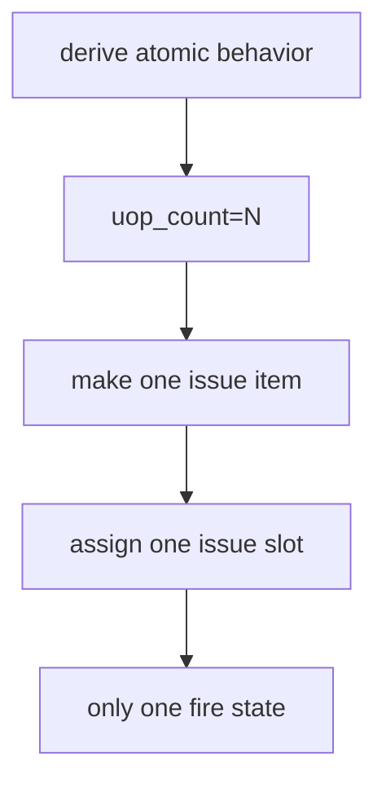
```mermaid
flowchart TD
    A[derive atomic behavior] --> B[uop_count=N]
    B --> C[make one issue item]
    C --> D[assign one issue slot]
    D --> E[only one fire state]
```

优化逻辑图，方案 A：

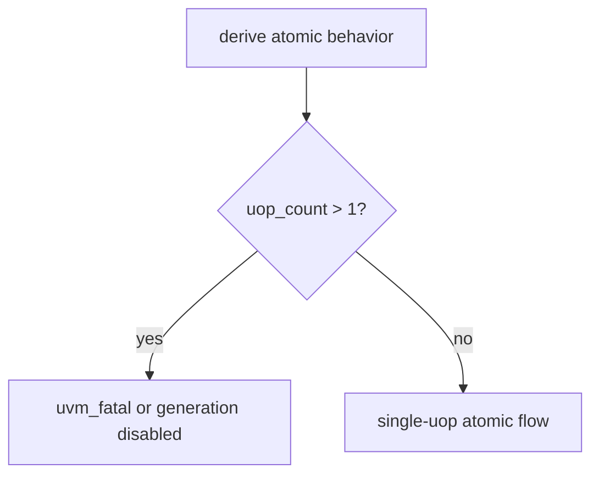
```mermaid
flowchart TD
    A[derive atomic behavior] --> B{uop_count > 1?}
    B -->|yes| C[uvm_fatal or generation disabled]
    B -->|no| D[single-uop atomic flow]
```

优化逻辑图，方案 B：

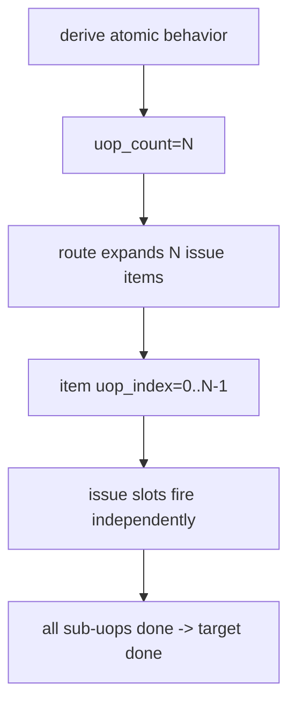
```mermaid
flowchart TD
    A[derive atomic behavior] --> B[uop_count=N]
    B --> C[route expands N issue items]
    C --> D[item uop_index=0..N-1]
    D --> E[issue slots fire independently]
    E --> F[all sub-uops done -> target done]
```

实施建议：

- 短期先文档化并加 fatal 保护。
- 中期结合 `atomic_multi_uop_todo.md` 设计真实展开。

## 12. OPT-10：合并 issue fire 两个重复函数

优先级：medium

相关函数：

- `issue_queue_scheduler::mark_issue_fire()`
- `issue_queue_scheduler::mark_issue_fire_already_accepted()`
- `memblock_lintsissue_dispatch_sequence::mark_fired_items()`

现有职责：

- `mark_issue_fire()`：正常 fire，先检查 global flush gate。
- `mark_issue_fire_already_accepted()`：redirect abort partial fire 场景，绕过 global flush gate，但仍检查 item 状态。

不清晰点：

- 两个函数主体基本重复。
- 差异点是“是否允许 partial accepted after redirect”，但函数名没有表达完整状态机语义。

风险：

- 后续修改 issue fire 状态字段时需要同步改两处。
- redirect 边界 partial fire 规则容易被误改。

推荐优化：

合并为：

```systemverilog
typedef enum int unsigned {
    MEMBLOCK_ISSUE_ACCEPT_NORMAL,
    MEMBLOCK_ISSUE_ACCEPT_PARTIAL_AFTER_REDIRECT
} memblock_issue_accept_mode_e;

function bit accept_issue_fire(memblock_issue_q_item_t item,
                               memblock_issue_accept_mode_e mode);
```

原逻辑调用图：

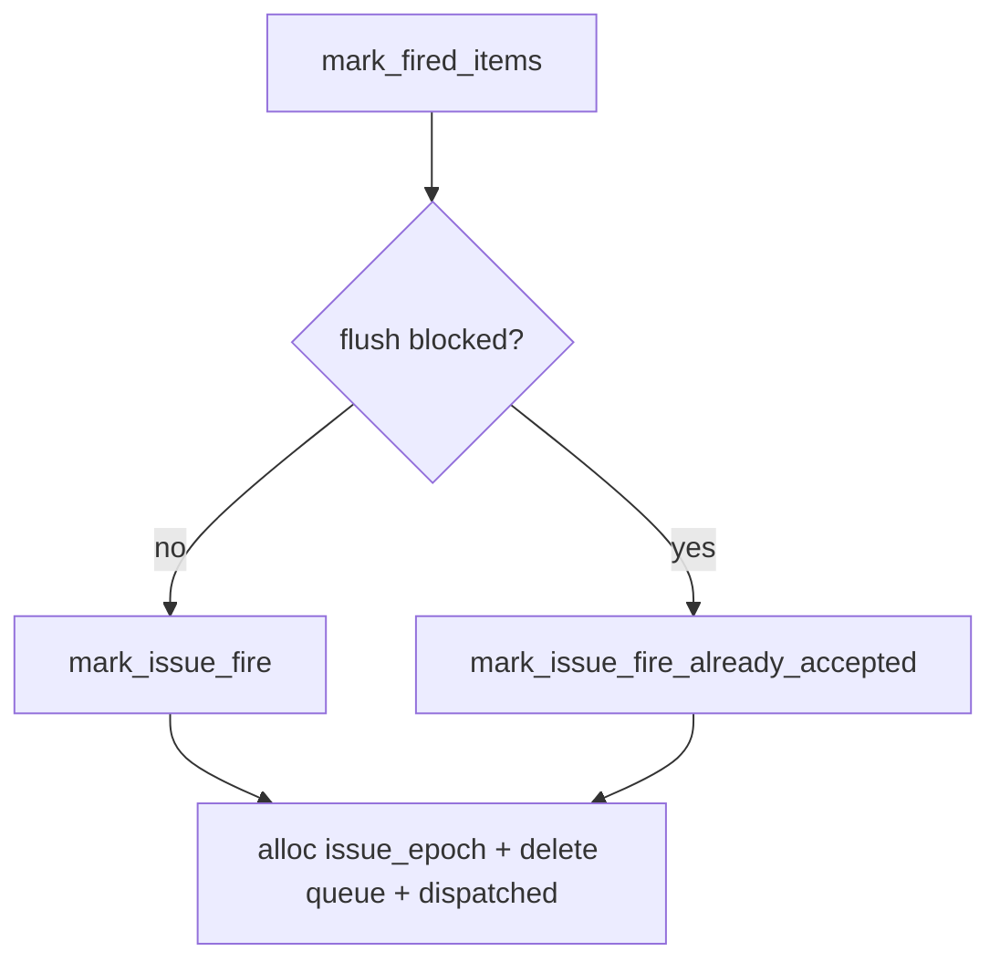
```mermaid
flowchart TD
    A[mark_fired_items] --> B{flush blocked?}
    B -->|no| C[mark_issue_fire]
    B -->|yes| D[mark_issue_fire_already_accepted]
    C --> E[alloc issue_epoch + delete queue + dispatched]
    D --> E
```

优化逻辑图：

```mermaid
flowchart TD
    A[mark_fired_items] --> B{partial after redirect?}
    B -->|no| C[accept_issue_fire NORMAL]
    B -->|yes| D[accept_issue_fire PARTIAL_AFTER_REDIRECT]
    C --> E[common accept implementation]
    D --> E
```

实施建议：

- 低风险代码优化。
- 合并时保留中文注释说明 partial-after-redirect 是唯一允许绕过 global flush gate 的入口。

## 13. OPT-11：ROB commit 和 LSQ deq completion 收敛到 facade

优先级：medium

相关函数：

- `lsq_commit_handler::mark_rob_commit_uid()`
- `lsq_commit_handler::apply_dut_lq_deq()`
- `lsq_commit_handler::apply_dut_sq_deq()`
- `common_data_transaction::try_retire_committed_uid()`

现有职责：

- ROB commit sequence 设置 `rob_commit=1`，然后尝试 retire。
- ctrl monitor deq 释放 LQ/SQ map，然后也尝试 retire。
- `try_retire_committed_uid()` 根据 ROB commit 和 active map 是否释放决定 success/retire。

不清晰点：

- completion 的两个输入源分散在不同调用路径。
- success 由“ROB commit 已到 + LQ/SQ deq 已到”合成，但没有一个名字明确的 completion owner。

风险：

- redirect、flushSb、deq 同拍时排查顺序困难。
- 后续加入 fault/exception commit 语义时容易分散处理。

推荐优化：

新增 `completion_controller` facade：

```systemverilog
function void on_rob_commit(uid);
function void on_lq_deq(uid);
function void on_sq_deq(uid);
function void try_complete(uid);
```

原逻辑调用图：

```mermaid
flowchart TD
    A[ROB commit seq] --> B[mark_rob_commit_uid]
    B --> C[try_retire_committed_uid]
    D[ctrl monitor lq/sq deq] --> E[apply_dut_lq/sq_deq]
    E --> F[release uid mapping]
    F --> C
```

优化逻辑图：

```mermaid
flowchart TD
    A[ROB commit seq] --> B[completion_controller.on_rob_commit]
    C[ctrl monitor deq] --> D[completion_controller.on_lsq_deq]
    B --> E[completion_controller.try_complete]
    D --> E
    E --> F[retire active uid / success]
```

实施建议：

- 第一阶段只封装调用，不改状态字段。
- 第二阶段把 report/deq mismatch 和 success 推进文档化到 completion flow。

## 14. OPT-12：common_data_transaction 做 focused facade 分层

优先级：high

相关文件：

- `common_data_transaction.sv`

现有职责：

`common_data_transaction` 当前同时负责：

- 主表、状态表、TLB 表、CSR runtime。
- active ROB/LQ/SQ map。
- issue queue。
- feedback event queue。
- replay/redirect/fault 状态更新。
- redirect drive queue 和 redirect phase。
- flushSb 状态。
- LSQ cancel pending。
- completion/success/end check。

不清晰点：

- 它既是数据容器，又是多个流程控制器。
- 调用者很难看出某个状态迁移应该归谁维护。

风险：

- 新增 vector/admission/fault 时文件持续膨胀。
- 状态更新分散在越来越多 helper 中，测试框架会越来越难维护。

推荐优化：

不要立刻搬数据结构。先增加 focused facade，让调用关系更清楚：

- `feedback_state`：normalize、push/pop feedback event、event lookup。
- `redirect_state`：redirect phase、drive queue、apply flush。
- `issue_queue_state`：load/sta/std queue push/delete/select 基础操作。
- `completion_state`：ROB commit、LQ/SQ deq、retire/success。
- `admission_state`：max_enqueued_uid、success_prefix_uid、redirect reissue admission 边界。

原逻辑调用图：

```mermaid
flowchart TD
    A[all sequences/handlers] --> B[common_data_transaction]
    B --> C[状态表]
    B --> D[queues]
    B --> E[redirect]
    B --> F[completion]
    B --> G[TLB/CSR]
```

优化逻辑图：

```mermaid
flowchart TD
    A[writeback/recovery] --> B[feedback_state facade]
    C[redirect sequence/handler] --> D[redirect_state facade]
    E[issue scheduler] --> F[issue_queue_state facade]
    G[commit/deq handler] --> H[completion_state facade]
    I[LSQ admission] --> J[admission_state facade]
    B --> K[common_data storage]
    D --> K
    F --> K
    H --> K
    J --> K
```

实施建议：

- 第一阶段只新增 wrapper class 或函数分组，不搬字段。
- 不建议一次性拆文件，避免影响大量 include/package/filelist。

## 15. OPT-13：新增 dispatch event contract 文档

优先级：low

相关文档：

- `AI_DOC/mem_ut_flow_doc/replay_flow.md`
- `AI_DOC/mem_ut_flow_doc/redirect_flow.md`
- `AI_DOC/mem_ut_flow_doc/fault_exception_flow.md`
- `AI_DOC/web/memblock_dispatch_control_flow_callgraph_enhanced`

现有职责：

- 各 flow 文档分别解释 replay、redirect、fault。

不清晰点：

- 缺一张总表解释“事件来源 -> handler -> 状态落点 -> 是否入队”。
- atomic/vector/STD software pass/non-LSQ admission 的边界没有集中呈现。

风险：

- 新人会按文件名理解职责，忽略 software pass、atomic multi-uop 未完成、vector unsupported。

推荐优化：

待新增文档 `AI_DOC/mem_ut_flow_doc/dispatch_event_contract.md`，至少包含：

| Producer | Event | Handler | State owner | Queue | 支持边界 |
| --- | --- | --- | --- | --- | --- |
| int wb monitor | load/store writeback pass | writeback_status_handler | common_data status | no | scalar only |
| int wb monitor | fault exception_vec | writeback_status_handler | mark_target_fault | yes | fault 不自动 replay |
| iq feedback monitor | STA replay/pass | writeback_status_handler + recovery handler | replay state | yes | STD replay 当前忽略 |
| ctrl monitor | memoryViolation redirect | recovery handler + redirect sequence | redirect state | yes | 需要 redirect seq enable |
| issue sequence | software STD pass | writeback_status_handler | pass state | no/handler path | 非严格 DUT flow |
| LSQ admission | non-LSQ atomic admission | admission sequence | status active/issue_ready | no | multi-uop atomic 未完整支持 |

原逻辑图：

```mermaid
flowchart TD
    A[多个 flow 文档] --> B[读者自行拼事件 contract]
```

优化逻辑图：

```mermaid
flowchart TD
    A[dispatch_event_contract.md] --> B[Producer]
    A --> C[Event kind]
    A --> D[State owner]
    A --> E[Queue policy]
    A --> F[Unsupported boundary]
```

实施建议：

- 文档优先级不高，但能显著降低沟通成本。
- 后续每次新增 event source 必须同步更新 contract。

## 16. 推荐实施顺序

第一阶段：低风险清晰化

1. `OPT-01` 统一 event 分类入口。
2. `OPT-04` 重命名 fault recovery 消费函数。
3. `OPT-09` 明确 atomic multi-uop 当前支持边界，先 fatal/disable 未完整支持模式。
4. `OPT-13` 新增 event contract 文档。

第二阶段：调用链收敛

1. `OPT-02` 封装单周期 monitor drain。
2. `OPT-10` 合并 issue fire 两个重复函数。
3. `OPT-03` 显式化 STD software pass adapter。
4. `OPT-07` 明确 LSQ deferred cancel 命名和 end check。

第三阶段：结构性 facade

1. `OPT-05` redirect controller facade。
2. `OPT-11` completion controller facade。
3. `OPT-12` common_data focused facade。
4. `OPT-08` admission 命名层调整。

## 17. 不建议立即做的事情

不建议一次性把 `common_data_transaction` 拆成多个大文件。当前框架调用点多，直接拆文件会带来 filelist/package/include 风险，而且容易把行为变更和结构调整混在一起。

不建议立即把 route 从扫描模式改成纯 worklist。当前扫描模式虽然不够高效，但状态表是真源，不容易漏 replay/redirect reissue。可以先加 route hint 和日志，再评估是否需要 worklist。

不建议在未补齐状态收敛前声称支持 vector LS 或 atomic multi-uop。当前 vector 已显式 fatal；atomic multi-uop 需要在 issue item 展开、uop_index、writeback/replay 匹配、required done 判断上形成闭环。

## 18. 当前最关键的清晰化目标

后续代码修改时建议围绕下面三句话保持一致：

1. monitor/adapter 只生产事实，不直接决定复杂恢复顺序。
2. writeback handler 是普通 pass/fault 的状态落表 owner；redirect/replay/fault recovery queue 的优先级由 recovery handler 决定。
3. `common_data_transaction` 当前是存储真源，但长期不应继续承载所有流程控制职责，应通过 focused facade 逐步收敛调用关系。
