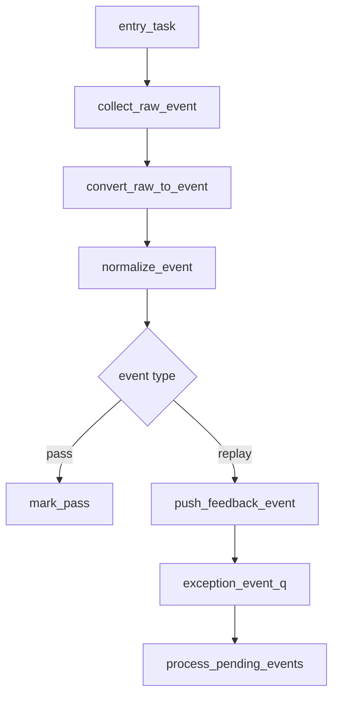

# mem_ut Flow 文档编写规则

本文记录 mem_ut flow 文档的通用编写规则。后续新增、重写或 review `AI_DOC/mem_ut_flow_doc` 下的 flow 文档时，必须按本文执行。

## 1. 适用范围

本规则适用于所有 mem_ut 测试框架 flow 文档，包括但不限于：

- monitor event flow
- writeback / feedback flow
- redirect / replay / fault flow
- sfence / hfence / TLB lookup flow
- LSQ admission / commit / deq flow
- sequence 调度 flow

本文不是某个专项 flow 的规则，而是所有 flow 文档的统一结构和质量要求。

## 2. 总体原则

- Flow 文档必须从真实源码函数调用链出发，不能只写概念说明。
- 文档中的函数名、字段名、队列名、类名必须和源码一致，不允许写不存在的 helper。
- 文档必须体现真实分层，例如 sequence、adapter、batch handler、status handler、common data、recovery handler、driver/monitor 等。
- 如果源码有 batch、queue、状态表、handler 分发，文档必须讲清事件如何进入、如何转换、如何被消费、如何更新状态。
- 文档应按函数调用顺序组织，读者应能沿着文档从入口函数一路追到终点函数。

## 3. 必须包含函数调用 Flow 图

每个 flow 文档必须包含函数调用 flow 图，优先使用 Mermaid。

Flow 图要求：

- 从真实入口函数开始画，例如 sequence task、monitor callback、adapter drain task、driver loop 等。
- 图中节点使用真实函数名或真实队列/状态名。
- 图中必须体现关键分支，例如 pass/fault、redirect/replay、hit/miss、valid/drop。
- 如果某函数内部调用关键 helper，flow 图需要画出子调用节点，不能只画到外层函数。
- 如果事件进入队列，图中要画出入队函数、队列名、出队函数和消费者。

示例格式：



### 3.1 Flow 图整体文字伪代码要求

每个函数调用 flow 图下面必须紧跟一个“函数调用 Flow 图整体文字伪代码”小节，用 `text` 代码块把图中的完整主链路翻译成可顺序阅读的伪代码。

该整体伪代码的目的不是替代后续每个函数章节的源码分析，而是让读者先从图下面快速理解：

- 这个 flow 从哪个真实入口开始。
- 主链路按什么阶段推进，例如采集、转换、仲裁、入队、出队、驱动、状态更新。
- 每个阶段调用哪些关键函数。
- 关键分支如何选择后续路径，例如 valid/drop、pass/fault、redirect/replay、flush/no flush、target 类型。
- 如果涉及队列，需要说明谁入队、谁出队、何时删除、何时重发。
- 如果涉及状态表，需要说明关键状态字段何时置位、清零，以及后续如何影响过滤或仲裁。
- 如果 flow 图中有兼容路径、soft-test 路径或异常路径，需要在整体伪代码中明确说明它不是普通主路径或说明触发条件。

推荐结构：

```text
Flow 名称主流程：

1. 阶段 A：说明本阶段目标
入口函数：
  做入口检查；
  调用 helper_a：说明 helper_a 做什么；
  如果条件 X：
    进入路径 X；
  否则：
    进入路径 Y。

2. 阶段 B：说明本阶段目标
关键函数：
  写入 queue/status/driver；
  说明后续由哪个函数消费；
  说明 drop/requeue/fatal/warning 的条件。
```

要求：

- 必须按 Flow 图和源码调用顺序写，不能为了叙述方便重排真实执行顺序。
- 必须描述 helper 的功能，不能只罗列裸函数名。
- 必须写清关键分支的原因和后果。
- 必须写清队列和状态变化。
- 不需要贴源码；源码片段仍放在后续函数章节中。

## 4. 函数章节组织规则

函数分析必须按调用顺序展开。每个重要函数单独成节，推荐结构如下：

````markdown
## N. `function_or_task_name()`

源码位置：`path/to/file.sv`

真实逻辑摘要：

```systemverilog
// 摘录关键代码，不需要贴完整函数
```

功能解释：

说明该函数在整个 flow 中承担什么职责。

输入/输出：

- 输入：关键参数、队列、状态表或 raw event。
- 输出：返回值、队列入队、状态字段变化、driver 行为等。

文字伪代码：

```text
按源码顺序描述该函数逻辑；
如果调用 helper，需要说明 helper 做什么；
如果有分支，需要说明每个分支后续进入哪个函数或状态；
```

内部子调用：

- `helper_a()`：说明 helper 功能。
- `helper_b()`：说明 helper 功能。
````

要求：

- “真实逻辑摘要”必须贴源码关键片段，不能只有自然语言。
- 源码片段只贴关键逻辑，避免整段大函数无重点复制。
- “文字伪代码”必须按源码执行顺序写，不要按自己的理解重新排序。
- “文字伪代码”必须先说明该函数或逻辑块在当前 flow 中承担的功能，再逐行描述源码控制流，最后解释本段调用到的子函数在当前 flow 中的职责、输入来源、输出或状态副作用。
- “文字伪代码”不能只写“调用 A、调用 B”。凡调用子函数，必须说明 A/B 在本流程中做什么、返回值如何影响母函数后续分支、是否改变 queue/status/map/counter/driver 信号。
- “文字伪代码”可以引用函数名或 API 名称，但不能停留在代码动作本身；每个关键函数/API 都必须说明“它做什么、为什么做、对 queue/status/map/counter/driver 有什么影响”。例如 `commit_uids.delete()` 不能只写成代码动作，必须说明它是在清空本拍 commit uid 列表，避免上一拍残留 uid 被重复提交。
- 如果一个函数内部有多段关键分支，应分别按源码顺序描述每个分支的触发条件和结果，不能只写最终结论。
- “内部子调用”必须和伪代码一致，不能列了 helper 但伪代码不体现。

## 5. 子函数展开规则

如果函数内部调用了子函数/helper，必须在该函数后面展开说明。

展开方式：

- 简单 helper：在当前函数的“文字伪代码”中用一句话说明。
- 关键 helper：在当前函数后单独新增小节或“内部子调用”段落。
- 影响状态、队列、优先级或时序的 helper：必须单独展开。

### 5.1 母函数文字伪代码中的子函数描述模式

当分析母函数逻辑时，如果源码中调用了子函数，母函数的文字伪代码必须采用“调用子函数 + 描述子函数在当前 flow 中承担的功能”的方式。母函数伪代码不需要展开子函数内部每个判断细节，但必须讲清：

- 子函数在当前 flow 中负责什么检查、转换、仲裁、入队、出队或状态更新。
- 子函数返回值如何影响母函数后续分支。
- 子函数成功后会把 flow 推到哪个阶段或哪个队列/状态。
- 子函数失败后母函数会 return、drop、requeue、fatal、warning 还是走其它路径。

推荐写法：

```text
调用 is_uid_route_ready：
  判断当前 uid 是否满足进入 issue route 的基本条件，包括全局 flush/redirect 是否阻塞、uid 是否 active/enq/issue_ready、是否处于异常或 redirect 等不能 route 的状态。
如果 is_uid_route_ready 返回 false：
  直接返回，不读取主表 transaction，也不向任何 issue queue 入队。

读取 uid 对应的 main transaction：
  获取该 transaction 的 fuType、fuOpType、lsq_flow、load/store/atomic 等主表字段。

调用 lsq_ctrl_model::derive_op_behavior：
  根据 main transaction 推导这条 transaction 应该拆成哪些 issue target，例如 LOAD、STA、STD，以及对应的 LSQ/atomic 行为信息。

如果 behavior.route_load 为 1：
  调用 route_target(uid, LOAD, behavior)：
    尝试把该 uid 的 LOAD target 写入 load issue queue。
```

禁止写法：

```text
调用 is_uid_route_ready；
调用 derive_op_behavior；
调用 route_target；
```

如果子函数本身在当前文档后续有独立章节，母函数伪代码仍需简要说明该子函数功能；详细条件、字段和内部状态变化放到子函数自己的章节中展开。

禁止写法：

```text
调用 normalize_feedback_event；
调用 process_pending_events；
调用 apply_redirect_flush；
```

推荐写法：

```text
调用 normalize_feedback_event：解析 active uid，补齐 ROB/issue_epoch/replay_seq，并过滤无法定位或 replay snapshot 缺失的旧 event；
调用 process_pending_events：从 exception_event_q 出队，先处理 active redirect 和同批 redirect，再处理 replay/fault；
调用 apply_redirect_flush：扫描 active uid 窗口，flush 被 redirect 覆盖的 uid，清 redirect drive 状态并解除 freeze。
```

## 6. 队列和状态表规则

只要 flow 涉及队列或状态表，必须写清：

- 谁写入队列。
- 队列元素是什么。
- 谁从队列出队。
- 出队后进入哪个函数。
- 队列项什么时候丢弃、requeue 或消费完成。
- 哪些状态字段会被置位、清零或用于过滤旧事件。

对于状态字段，必须说明：

- 字段含义。
- 字段由哪个函数更新。
- 字段在后续哪个判断中生效。
- 字段是否是终态、临时态、冻结态、pending 态或版本过滤字段。

## 7. 分支和优先级规则

Flow 文档必须写清关键分支和优先级。

常见分支包括：

- valid / invalid
- hit / miss
- pass / fault
- redirect / replay / normal event
- active redirect 存在 / 不存在
- target 是 LOAD / STA / STD
- timeout / ready
- covered by redirect / not covered

如果源码中某个分支会 drop event、requeue event、fatal、warning 或直接 return，文档必须说明原因和后果。

## 8. 文字伪代码规则

文字伪代码是 flow 文档的核心，必须满足：

- 按源码顺序描述。
- 每行尽量只描述一个动作。
- 调用函数时必须说明该函数功能。
- 分支条件必须写清。
- 状态变化必须写清。
- 队列入队、出队、requeue、drop 必须写清。
- 如果函数返回值影响后续 flow，必须写清返回值含义。

伪代码中不得只写裸函数名，例如：

```text
调用 helper_a；
调用 helper_b；
```

必须写成：

```text
调用 helper_a：完成什么检查/转换/状态更新；
调用 helper_b：根据什么条件决定下一步；
```

## 9. 源码一致性规则

Flow 文档必须和当前源码一致：

- 不允许使用源码中不存在的函数名。
- 不允许把 A 文件中的 helper 写成 B 文件中调用。
- 不允许把概念上的“same event”误写成实际调用了 `same_xxx()` helper。
- 不允许把旧版本逻辑残留在新 flow 文档中。
- 如果源码中某函数只是兼容入口或 soft-test 入口，文档必须明确说明，不能写成真实 DUT 主路径。

## 10. 端到端行为总结规则

每个 flow 文档最后必须提供“端到端行为总结”。总结形式参考 `AI_DOC/mem_ut_flow_doc/writeback_function_call_flow.md` 的“端到端行为总结”章节。

行为总结要求：

- 用简短链路列出关键场景从入口到终点的完整路径。
- 每条链路应包含事件来源、关键转换函数、关键仲裁/分支、最终状态更新或队列消费。
- 如果一个 flow 有多个典型场景，应分别列出，例如 pass、fault、replay、redirect、hit、miss、timeout 等。
- 总结可以使用 `text` 代码块，用 `->` 表示执行路径。
- 总结必须能让读者快速确认“这个事件最终去了哪里、状态如何变化、是否入队/出队/丢弃/重发”。
- 路径总结后必须补充“端到端文字伪代码描述”，用自然语言伪代码解释每个典型场景为什么这样走、哪些状态被更新、哪些队列被写入或消费、哪些事件被 drop/requeue。
- 端到端文字伪代码不能只重复函数名，必须解释关键函数在该场景中的作用，例如“`process_monitor_event_batch` 先做 redirect-first 仲裁，覆盖事件不允许落状态”。

推荐格式：

```text
场景 A：
  raw_event
  -> convert_raw_event
  -> normalize / arbitration
  -> target_handler
  -> status 更新或 queue 入队

场景 B：
  raw_event(condition)
  -> convert_raw_event
  -> push_feedback_event
  -> event_queue
  -> process_pending_events
  -> final_handler
  -> 最终状态变化
```

端到端文字伪代码：

```text
场景 A：
  当 raw_event 满足某条件时，adapter 先转换成统一 event；
  batch/recovery handler 根据优先级判断该 event 是否仍有效；
  如果有效，调用 target_handler 更新状态或入队；
  如果被覆盖或过期，直接 drop，并说明不会更新哪些状态。
```

## 11. Review 规则

Flow 文档修改后必须 review：

- 执行方先按源码修改文档。
- 本 agent 必须对照源码检查函数调用链、伪代码、状态变化、队列消费和 helper 名称。
- 如果使用 subagent，subagent 可以负责初稿或独立 review，但本 agent 仍需最终复核。
- 如果 review 发现遗漏、不准确或源码不存在的 helper，必须继续修改，直到 review 通过。
- 文档修改不需要跑仿真；只有源码或测试框架逻辑修改才需要按仿真规则验证。

## 12. 最终检查清单

提交或同步 flow 文档前，至少检查：

- 是否有函数调用 flow 图。
- Flow 图下面是否有整体文字伪代码，并按图和源码顺序解释主链路、关键分支、队列和状态变化。
- 是否按函数调用顺序展开。
- 每个关键函数是否有源码位置。
- 每个关键函数是否有源码摘要。
- 每个关键函数是否有文字伪代码。
- 伪代码中每个 helper 调用是否说明了功能。
- 队列入队、出队、requeue、drop 是否写清。
- 状态字段更新和后续使用是否写清。
- 分支优先级是否写清。
- 是否有端到端行为总结，且覆盖主要典型场景。
- 函数名、字段名、队列名是否和源码一致。
