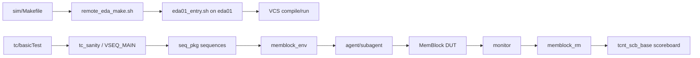

# mem_ut 测试框架网页说明

## 1. 页面定位

本文用于在飞书中展示 `mem_ut` 测试框架的整体结构、运行入口、核心模块关系和扩展规则。

当前说明面向的是传统 SystemVerilog/UVM 验证环境：

- 工程根目录：`/nfs/home/lixiangrui/work/memblock_ut/XiangShan`
- `mem_ut` 根目录：`mem_ut`
- memblock UVM 环境：`mem_ut/ver/ut/memblock`
- 主仿真目录：`mem_ut/ver/ut/memblock/sim`

## 2. 框架总览

`mem_ut` 当前采用 UVM 分层验证结构，并通过本地触发、远端 `eda01` 执行的方式完成 VCS/Verdi 编译仿真。

核心链路如下：



## 3. 目录地图

| 路径 | 作用 |
| --- | --- |
| `mem_ut/scr/verif` | 回归脚本、工程公共 make 配置、VCS/Xrun 工具配置 |
| `mem_ut/ver/common/tcnt_base` | 通用 UVM 基类、时钟复位、公共 testcase/env/scoreboard 基础设施 |
| `mem_ut/ver/ut/memblock/cfg` | 编译 filelist、用户配置、编译参数、波形配置 |
| `mem_ut/ver/ut/memblock/env` | `memblock_env`、`memblock_env_cfg`、reference model、plus 参数 |
| `mem_ut/ver/ut/memblock/seq` | memblock virtual sequence、场景 sequence、调度和事务辅助逻辑 |
| `mem_ut/ver/ut/memblock/agent` | 顶层端口相关 UVM agent |
| `mem_ut/ver/ut/memblock/subagent` | 内部模块接口相关 UVM agent 或子环境 |
| `mem_ut/ver/ut/memblock/common` | memblock 公共事务、同步包、功能覆盖率等 |
| `mem_ut/ver/ut/memblock/tb` | `top_tb`、DUT 例化、interface connect、波形和 SDF 入口 |
| `mem_ut/ver/ut/memblock/tc` | testcase 包、`basicTest`、testcase 生成入口 |
| `mem_ut/ver/ut/memblock/regress` | 回归配置 `regress.ini`、formal 配置 |
| `mem_ut/ver/ut/memblock/sim` | 编译仿真主入口、远端执行脚本 |
| `mem_ut/ver/ut/memblock/rule` | 新增 agent/cfg/sequence/参数/DUT 适配等操作规则 |

## 4. 编译 filelist 入口

主 filelist 为：

- `mem_ut/ver/ut/memblock/cfg/tb.f`

当前 `tb.f` 的主要包含顺序：

1. 公共基础库：`../../../common/tcnt_base/tcnt_base.f`
2. memblock plus 和同步包
3. 各类顶层 agent filelist
4. memblock common filelist
5. `memblock_env.f`
6. `seq.f`
7. `tc.f`
8. `tb/top_tb.sv`

这个顺序决定了 package、transaction、agent、env、sequence、testcase 和 TB 顶层的编译依赖。

## 5. Testbench 顶层

主入口为：

- `mem_ut/ver/ut/memblock/tb/top_tb.sv`

核心职责：

- 生成 `clk` 和 `tc_if.rst_n`
- include `dut_inst.sv` 完成 DUT 例化
- include `tc_if_connect.sv`
- include `memblock_connect.sv`
- 使用 `MEMBLOCK_CONNECT(env, top_tb.U_MEMBLOCK)` 宏连接环境和 DUT
- reset 完成后设置 `memblock_sync_pkg::reset_backend_done`
- 调用 `run_test()` 启动 UVM

## 6. UVM 环境

主环境文件：

- `mem_ut/ver/ut/memblock/env/memblock_env_pkg.sv`
- `mem_ut/ver/ut/memblock/env/src/memblock_env.sv`
- `mem_ut/ver/ut/memblock/env/src/memblock_env_cfg.sv`
- `mem_ut/ver/ut/memblock/env/src/memblock_rm.sv`

`memblock_env_pkg.sv` 统一 import：

- UVM 和 `tcnt_base`
- 所有 agent 的 `*_dec` 和 `*_pkg`
- `memblock_common_pkg`
- `plus_pkg`
- `memblock_env_cfg`
- `memblock_rm`
- `memblock_env`

`memblock_env.sv` 当前承担：

- 创建 `memblock_env_cfg`
- 调用 `cfg.apply_user_cfg()`
- 创建各 agent 实例
- 为各 agent 设置对应 cfg
- 创建 monitor 到 reference model 的 analysis fifo
- 创建 `memblock_rm`
- 创建 `tcnt_scb_base #(memblock_common_xaction)` scoreboard
- 在 `connect_phase` 中连接 agent monitor、RM 和 scoreboard

## 7. Agent 结构

典型 agent 目录结构如下：

```text
agent/<name>_agent/
  <name>_agent.f
  <name>_agent_pkg.sv
  src/
    <name>_agent_interface.sv
    <name>_agent_dec.sv
    <name>_agent_cfg.sv
    <name>_agent_xaction.sv
    <name>_agent_driver.sv
    <name>_agent_monitor.sv
    <name>_agent_sequencer.sv
    <name>_agent_default_sequence.sv
    <name>_agent.sv
```

当前 `memblock_env` 已集成的主要 agent 包括：

- `backendToTopBypass_agent`
- `fence_agent`
- `csr_ctrl_agent`
- `lsqcommit_agent`
- `lsqenq_agent`
- `lintsissue_agent`
- `vecissue_agent`
- `redirect_agent`
- `sbuffer_agent`
- `dcache_agent`
- `int_sink_agent`
- `L2tlb_agent`
- `itlb_agent`
- `prefetch_agent`
- `io_mem_to_ooo_ctrl_agent`
- `io_mem_to_ooo_int_wb_agent`
- `io_mem_to_ooo_vec_wb_agent`
- `io_mem_to_ooo_wakeup_agent`
- `io_mem_to_ooo_iq_feedback_agent`
- `other_ctrl_agent`

## 8. Sequence 和 Testcase

Sequence package：

- `mem_ut/ver/ut/memblock/seq/seq_pkg.sv`

当前 `seq_pkg` 集成了：

- CSR 公共访问辅助
- MMU/CSR runtime state
- dispatch transaction 和 status transaction
- TLB transaction、common data transaction
- LSQ control model
- TLB map builder
- issue queue scheduler
- issue field assigner
- writeback status handler
- exception/redirect/replay handler
- LSQ commit handler
- dispatch monitor event adapter
- memblock dispatch base sequence
- real smoke、mixed smoke、replay smoke 等场景 sequence
- L2TLB base sequence
- `mem_base_sequence`

Testcase 入口：

- `mem_ut/ver/ut/memblock/tc/src/basicTest.sv`

`basicTest` 的关键行为：

- 默认 virtual sequence 名为 `tc_sanity`
- 支持通过 `+VSEQ_MAIN=<sequence_name>` 替换主 sequence
- 设置 `env.vsqr.main_phase.default_sequence`
- 从 `uvm_config_db` 获取 `tc_if`
- 在 `report_phase` 根据 UVM fatal/error 数量打印 PASS/FAIL

## 9. 远端编译仿真流程

当前采用“本地控制，远端执行”的双节点 flow：

| 节点 | 职责 |
| --- | --- |
| 当前节点 | 编辑代码、分析日志、触发 make 命令 |
| `eda01` | 加载 VCS/Verdi，真实执行 compile/run |

推荐从主仿真目录执行：

```bash
cd /nfs/home/lixiangrui/work/memblock_ut/XiangShan/mem_ut/ver/ut/memblock/sim
```

常用命令：

```bash
make eda_compile tc=tc_sanity mode=base_fun
make eda_run tc=tc_sanity mode=base_fun
make eda_run_bg tc=tc_sanity mode=base_fun
make eda_status tc=tc_sanity mode=base_fun
make eda_tail tc=tc_sanity mode=base_fun
make eda_kill tc=tc_sanity mode=base_fun
```

远端执行链路：

1. 本地执行 `make eda_compile` 或 `make eda_run`
2. `sim/Makefile` 调用 `remote_eda_make.sh`
3. `remote_eda_make.sh` 通过 ssh 连接 `eda01`
4. `eda01` 执行 `eda01_entry.sh`
5. `eda01_entry.sh` 初始化 module 环境
6. 加载 `synopsys/vcs/Q-2020.03-SP2` 和 `synopsys/verdi/R-2020.12-SP1`
7. 自动设置 `MEMBLOCK_PROJECT`
8. 在远端实际执行 `make compile` 或 `make run`

## 10. 回归入口

回归配置：

- `mem_ut/ver/ut/memblock/regress/regress.ini`
- `mem_ut/ver/ut/memblock/regress/formal.ini`

回归脚本：

- `mem_ut/scr/verif/DoRegress.py`
- `mem_ut/scr/verif/DoRegress.sh`
- `mem_ut/scr/verif/DoFormal.pl`

`regress.ini` 支持配置：

- 仿真工具：`vcs` / `xrun`
- 并行数
- 是否编译
- 功能覆盖率和代码覆盖率开关
- 编译/仿真选项
- log fatal/error/warning 扫描规则
- testcase 列表、seed、mode、运行次数
- 错误重跑策略
- daily regression 配置

## 11. 扩展规则入口

后续修改 `mem_ut` 时，应先阅读对应规则文档。

| 修改目标 | 优先阅读规则 |
| --- | --- |
| 新增或刷新 agent、driver、monitor、sequencer、interface、transaction | `mem_ut/ver/ut/memblock/rule/memblock_agent_add_rule.md` |
| 新增或调整 env cfg、user_ctrl、本地用户配置 | `mem_ut/ver/ut/memblock/rule/memblock_cfg_add_rule.md` |
| 新增或修改 sequence、virtual sequence、scenario sequence | `mem_ut/ver/ut/memblock/rule/memblock_sequence_add_rule.md` |
| 修改 L2TLB 相关 agent、connect、base sequence 或查表逻辑 | `mem_ut/ver/ut/memblock/rule/memblock_l2tlb_agent_rule.md` |
| 新增、迁移、重命名或调整参数 | `mem_ut/ver/ut/memblock/rule/memblock_parameter_management_rule.md` |
| 同步最新代码或更新到最新 `kunminghu-v3` | `mem_ut/ver/ut/memblock/rule/memblock_update_code_rule.md` |
| 适配最新 DUT 或同步 RTL 接口 | `mem_ut/ver/ut/memblock/rule/memblock_latest_dut_adapt_rule.md` |
| 使用或扩展 `user_ctrl` | `mem_ut/ver/ut/memblock/rule/memblock_user_ctrl_usage.md` |

## 12. 新增 Agent 的标准检查点

新增 agent 时至少需要确认：

1. 判断接口属于 DUT 顶层端口还是 memblock 内部模块接口。
2. 顶层端口 agent 放在 `agent/`。
3. 内部模块接口 agent 或子环境放在 `subagent/` 或对应规则要求的位置。
4. 补齐完整 agent 结构，不只补单个 driver 或 monitor。
5. 更新 `cfg/tb.f`。
6. 更新 `env/memblock_env_pkg.sv` import。
7. 更新 `env/src/memblock_env_cfg.sv` cfg 字段。
8. 更新 `env/src/memblock_env.sv` 声明、创建、配置、连接。
9. 更新 `tb/*_connect.sv` 和 `memblock_connect.sv`。
10. 用 `make eda_compile tc=tc_sanity mode=base_fun` 验证编译路径。

## 13. 新增 Sequence 的标准检查点

新增 sequence 时至少需要确认：

1. 放入 `mem_ut/ver/ut/memblock/seq/src` 或规则要求目录。
2. 在 `seq_pkg.sv` 中 include。
3. 如果需要替换主场景，支持通过 `+VSEQ_MAIN=<sequence_name>` 选择。
4. 复用已有 base sequence、transaction、scheduler、handler，不绕过框架层。
5. 如果引入新参数，同步参数管理规则和 cfg/user_ctrl。
6. 用 smoke testcase 做最小验证。

## 14. 参数和用户配置

当前配置入口包括：

- `mem_ut/ver/ut/memblock/env/plus.sv`
- `mem_ut/ver/ut/memblock/env/plus_pkg.sv`
- `mem_ut/ver/ut/memblock/env/src/memblock_env_cfg.sv`
- `mem_ut/ver/ut/memblock/cfg/user_cfg.local.default.sv`
- `mem_ut/ver/ut/memblock/cfg/user_cfg.local.sv`
- `mem_ut/ver/ut/memblock/seq/src/seq_csr_common.sv`
- `mem_ut/ver/ut/memblock/seq/plus_cfg/*.cfg`

`sim/Makefile` 会在本地不存在 `user_cfg.local.sv` 时，从 `user_cfg.local.default.sv` 自动生成。

## 15. 当前已知状态

根据现有文档记录，远端编译链路已经打通：

- 本地 `make eda_compile tc=tc_sanity mode=base_fun` 可以触发 `eda01`
- `eda01` 可以加载 VCS/Verdi
- VCS 编译可以真实启动
- 共享目录可以生成编译日志

已知历史阻塞点记录在：

- `AI_DOC/mem_ut远端编译仿真方案与流程.md`

当前文档不重新跑编译，只整理框架结构和操作入口。

## 16. 日常使用建议

- 处理 memblock UVM 环境时，优先在 `mem_ut/ver/ut/memblock/sim` 下运行命令。
- 不要默认在本地直接运行 `make compile`，真实 EDA 编译应走 `eda_*` 远端目标。
- 修改 agent、cfg、sequence、DUT 接口、参数前，先阅读 `rule/` 下对应规则。
- 涉及 RTL 重新生成时，先阅读 `AI_DOC/memblock_rtl生成规则.md`。
- 涉及同步最新代码时，先检查 `git status`，工作区不干净时不要直接 rebase。
- 编译环境异常时，优先检查 `eda01` module bootstrap，不要先改验证代码。
