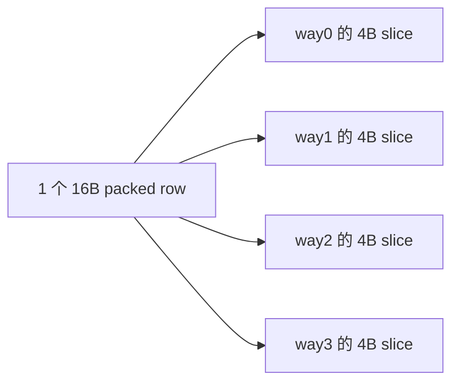
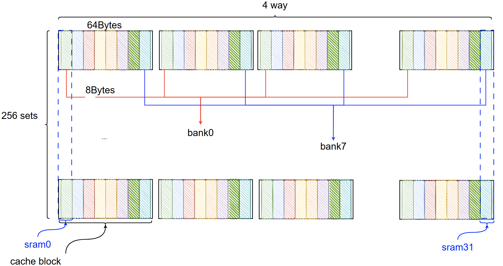
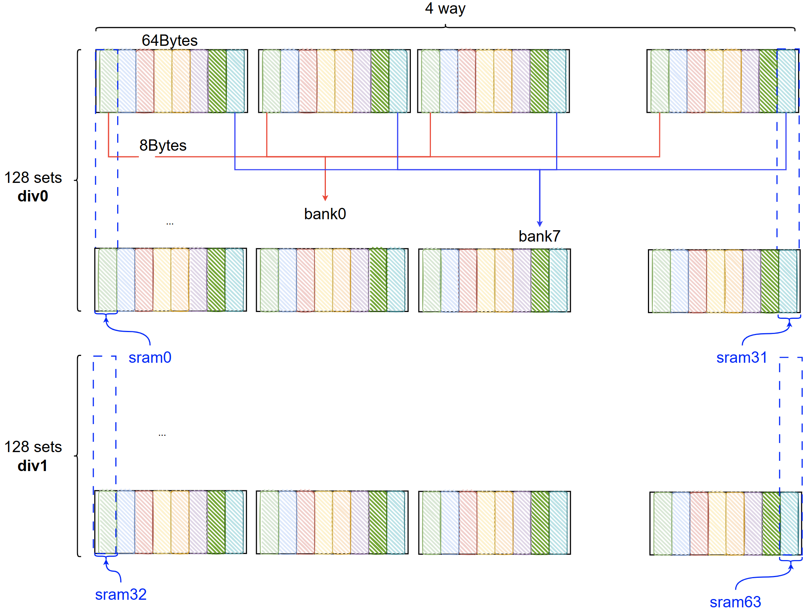
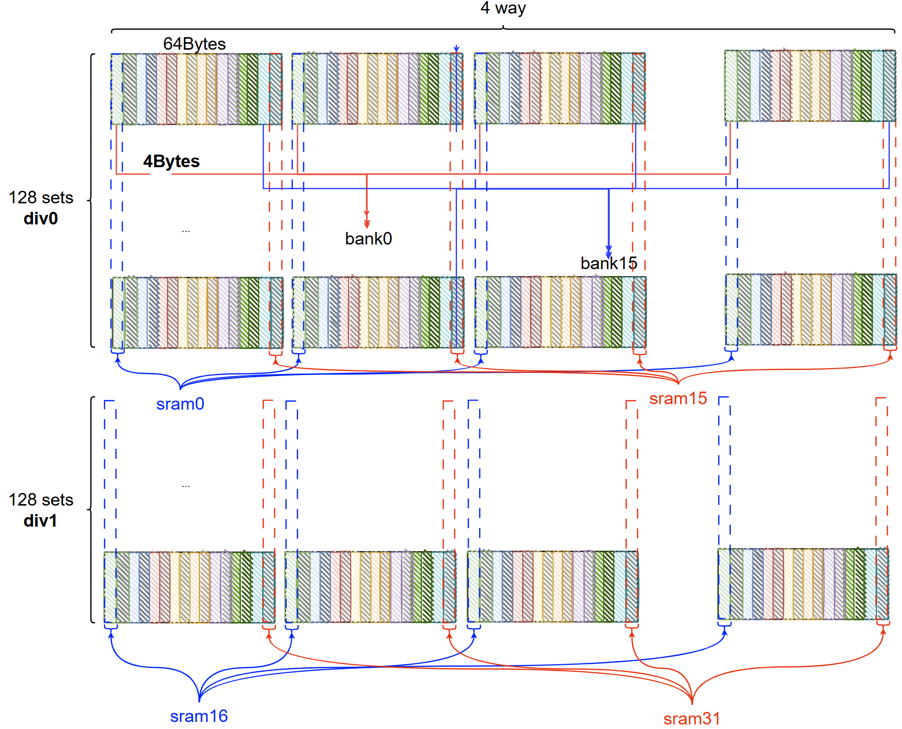
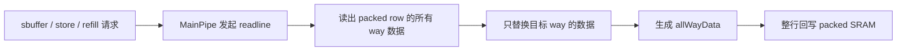
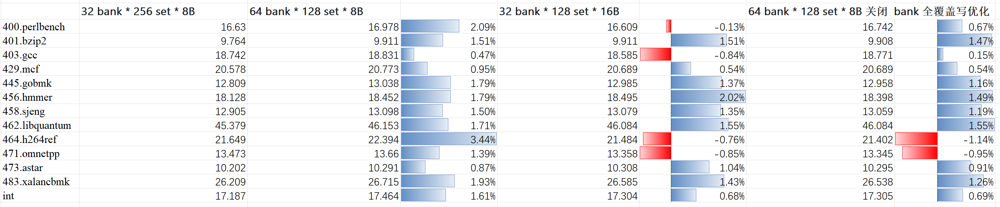

# DCache 4B Sub-bank / 16B Packed SRAM 改动实验报告

## 1. 实验目的

本文分析 commit `618d6f8c76543ee345b83e0903f2fde9a7c9bcbc` 的设计意图、RTL 实现方式以及性能结果，回答两个问题：

1. 在不增加 SRAM 总数的前提下，把 DCache 改成按 `set` 维度分 bank，是否仍然能降低 bank conflict。
2. 为什么 `32 bank * 128 set * 16B` 方案的收益明显低于理想的 `64 bank * 128 set * 8B` 方案。

本文的结论是：

- 该改动本身是有效的，`set` 维度分 bank 和更细的 `4B` bank 粒度，确实降低了 load 的 bank conflict。
- 收益打折的根因不是 `set` 维度分 bank 这个思路本身，而是新的 `16B packed SRAM row` 组织方式破坏了原先的全覆盖写优化，导致 sbuffer 写 DCache 时需要额外执行一次 `readline`，从而重新引入 load/readline、load/write 冲突。

## 2. 背景与方案

### 2.1 初始目标

原始 DCache data bank 组织方式可以概括为：

- 逻辑 bank 粒度：`8B`
- set 组织：`256 set`
- 物理 SRAM：`32 块`
- 每块 SRAM 存放：`1 way` 的所有 set，row 宽度 `8B`

因此 baseline 可以写成：

| 方案 | 物理组织 | 说明 |
| --- | --- | --- |
| baseline | `32 bank * 256 set * 8B` | 1 块 SRAM 只存 1 way 的 8B 数据 |

为了减少 load 的 bank conflict，最直接的办法是按 `set` 维度把每个 bank 再切成两半：

| 方案 | 物理组织 | 预期 |
| --- | --- | --- |
| 64 bank 分法 | `64 bank * 128 set * 8B` | bank 更细、set 也分 bank，冲突最少 |

但这样会把 SRAM 数量从 `32` 块增加到 `64` 块，物理实现认为不合理。因此本次改动的目标变成：

- 仍然按 `set` 维度分 bank。
- 仍然保持 `32` 块 SRAM。
- 每块 SRAM 改成 `128 set * 16B`。

问题的关键不再是“要不要分 bank”，而是“这 `16B` 里放什么”。

### 2.2 本次改动采用的 16B 数据组织

本次改动的核心思路是：

- 对外部 `LoadPipe` / `MainPipe` 来说，DCache 按 `4B` 粒度分 bank。
- 对内部 SRAM 来说，一块 `16B` row 存放的是“4 way cacheline 在相同 offset 下的 4B 数据”。

也就是：



在这个组织下，新的方案可以写成：

| 方案 | 物理组织 | 实际含义 |
| --- | --- | --- |
| 本修改 | `32 bank * 128 set * 16B` | 1 块 SRAM row 打包了 4 way 在同一 offset 的 `4B` 数据 |

### 2.3 三种方案的示意图

#### 2.3.1 4-way / 256-set / 64B line 的逻辑视图

```text
                         256 sets
        +-------------------------------------------------------------------+
way0    | [set0:64B] [set1:64B] [set2:64B] ... [set255:64B]                 |
way1    | [set0:64B] [set1:64B] [set2:64B] ... [set255:64B]                 |
way2    | [set0:64B] [set1:64B] [set2:64B] ... [set255:64B]                 |
way3    | [set0:64B] [set1:64B] [set2:64B] ... [set255:64B]                 |
        +-------------------------------------------------------------------+

1 个 64B cache line:
  +-----------------------------------------------------------------------+
  | bank0 8B | bank1 8B | bank2 8B | bank3 8B | bank4 8B | bank5 8B | ... |
  | bank6 8B | bank7 8B                                                    |
  +-----------------------------------------------------------------------+
```

#### 2.3.2 baseline: `32 bank * 256 set * 8B`



```text
逻辑切分:
  64B line -> 8 个 8B bank

                    256 sets
        +-------------------------------------------------------------+
way0    | [bank0][bank1][bank2][bank3][bank4][bank5][bank6][bank7]    |
way1    | [bank0][bank1][bank2][bank3][bank4][bank5][bank6][bank7]    |
way2    | [bank0][bank1][bank2][bank3][bank4][bank5][bank6][bank7]    |
way3    | [bank0][bank1][bank2][bank3][bank4][bank5][bank6][bank7]    |
        +-------------------------------------------------------------+

SRAM 映射:
  每个 (way, bank) 对应 1 块 SRAM
  每块 SRAM 存 1 个 way 的 8B slice，覆盖全部 256 sets

  例如:
    SRAM[way0][bank0] = set0..255 的 bank0 8B
    SRAM[way0][bank1] = set0..255 的 bank1 8B
    ...
    SRAM[way3][bank7] = set0..255 的 bank7 8B

总计:
  4 way x 8 bank = 32 块 SRAM
```

#### 2.3.3 `64 bank * 128 set * 8B`



```text
逻辑切分:
  64B line -> 8 个 8B bank
  set 再切一半 -> 256 sets = div0(128) + div1(128)

                 div0 (set0..127)                      div1 (set128..255)
        +----------------------------------+    +----------------------------------+
way0    | [b0][b1][b2][b3][b4][b5][b6][b7] |    | [b0][b1][b2][b3][b4][b5][b6][b7] |
way1    | [b0][b1][b2][b3][b4][b5][b6][b7] |    | [b0][b1][b2][b3][b4][b5][b6][b7] |
way2    | [b0][b1][b2][b3][b4][b5][b6][b7] |    | [b0][b1][b2][b3][b4][b5][b6][b7] |
way3    | [b0][b1][b2][b3][b4][b5][b6][b7] |    | [b0][b1][b2][b3][b4][b5][b6][b7] |
        +----------------------------------+    +----------------------------------+

SRAM 映射:
  每个 (div, way, bank) 对应 1 块 SRAM
  div0 + way0..3 -> 32 块 SRAM 的一半
  div1 + way0..3 -> 32 块 SRAM 的另一半

每块 SRAM 存什么:
  SRAM[div d][way w][bank i]
    = 128 个 set 的第 i 个 8B slice
    = 1 个 way 的完整 bank 数据

总计:
  2 div x 4 way x 8 bank = 64 块 SRAM
```

#### 2.3.4 本修改: `32 bank * 128 set * 16B`



```text
逻辑切分:
  64B line -> 16 个 4B sub-bank
  set 再切一半 -> 256 sets = div0(128) + div1(128)
  1 个 16B row = 同一 4B offset 上的 4 个 way 数据打包

                 div0 (set0..127)                      div1 (set128..255)
        +----------------------------------+    +----------------------------------+
way0    | [sb0][sb1][sb2]...[sb15]         |    | [sb0][sb1][sb2]...[sb15]         |
way1    | [sb0][sb1][sb2]...[sb15]         |    | [sb0][sb1][sb2]...[sb15]         |
way2    | [sb0][sb1][sb2]...[sb15]         |    | [sb0][sb1][sb2]...[sb15]         |
way3    | [sb0][sb1][sb2]...[sb15]         |    | [sb0][sb1][sb2]...[sb15]         |
        +----------------------------------+    +----------------------------------+

SRAM 映射:
  每个 (div, subbank) 对应 1 块 SRAM
  SRAM[div d][subbank j]
    = set 0..127 或 128..255 的第 j 个 4B slice
    = 同一 offset 上 4 个 way 的 packed 数据
    = 16B row = [way0 4B][way1 4B][way2 4B][way3 4B]

总计:
  2 div x 16 subbank = 32 块 SRAM
```

#### 2.3.5 三种方案对比表

| 方案 | 逻辑切分 | 每块 SRAM 存储内容 | 总 SRAM 数 |
| --- | --- | --- | --- |
| baseline | `8 x 8B` | 1 way 的 8B slice，覆盖 256 set | 32 |
| `64 bank` | `8 x 8B + set/2` | 1 way 的 8B slice，覆盖 128 set | 64 |
| 本修改 | `16 x 4B + set/2` | 4 way 的同 offset 4B slice，packed 成 16B row | 32 |

## 3. Commit `618d6f8...` 的实现解析

这次提交不仅改了 data array，本质上是一次“数据组织重构 + 读写路径联动修改”。提交里还附带了两份内部说明文档：

- `.codex/docs/dcache-bank-reorg-4b-16b-implementation-plan.md`
- `.codex/docs/dcache-banked-sramed-array-primer.md`

RTL 主改动点如下。

### 3.1 参数与接口

`src/main/scala/xiangshan/cache/dcache/DCacheWrapper.scala`

- 把 `DCacheSetDiv` 从 `1` 改成 `2`，实现 `set` 维度分 bank。
- 引入 `DCacheSubBankBytes = 4`、`DCacheSubBanks = 16`，把逻辑 bank 粒度从 `8B` 细化到 `4B`。
- 引入 `DCachePackedBankRowBits`，为 packed SRAM row 定义新的宽度。
- data write / ready duplication 也从 `DCacheBanks` 扩展到 `DCacheSubBanks`。

`src/main/scala/xiangshan/cache/dcache/data/BankedDataArray.scala`

- `L1BankedDataReadReqWithMask.bankMask`、`L1BankedDataReadLineReq.rmask`、`L1BankedDataWriteReq.wmask` 全部扩成 `DCacheSubBanks`。
- `L1BankedDataWriteReq` 新增 `allWayData`，用于把 packed row 所需的所有 way 数据一次性带到写口。
- `DataSRAMBank` 从“每个 bank 下多个 per-way SRAM”改成“每个 sub-bank 只有 1 个 packed SRAM，row 内部打包所有 way 的 4B slice”。

### 3.2 Load 侧如何看到新的 bank 组织

`src/main/scala/xiangshan/cache/dcache/loadpipe/LoadPipe.scala`

- bank mask 不再只区分 `64b/128b`，而是按访问大小生成：
  - `B/H/W` 占用 `1` 个 `4B` bank
  - `D` 占用 `2` 个 `4B` bank
  - `Q` 占用 `4` 个 `4B` bank
- `NewLoadUnit` 在 `src/main/scala/xiangshan/mem/pipeline/NewLoadUnit.scala` 中补传了 `size`，让 bank mask 可以按访问粒度生成。

因此对 load 来说，本次改动等价于：

- bank 更细了。
- `set` 也被拆成两个 div。
- 所以同样的访问分布下，load bank conflict 理论上应该减少。

### 3.3 MainPipe / 写回路径如何适配 packed row

`src/main/scala/xiangshan/cache/dcache/mainpipe/MainPipe.scala`

- store/readline 的 `rmask` / `wmask` 全部改成 `DCacheSubBanks`。
- store merge mask 从 “按 8B bank” 改成 “按 8B word 对应的两个 4B sub-bank”。
- `data_resp_all_way` 与 `allWayData` 一起被引入写路径。

这意味着 MainPipe 写 packed row 时，不再是“只写命中的那一个 way”，而是：

1. 读出 packed row 当前包含的所有 way 数据。
2. 只替换目标 way 的对应 lane。
3. 把整行 `allWayData` 回写给 SRAM。

### 3.4 当前实现的关键代价：整行 read-modify-write

从 RTL 形态上看，本次实现的写路径已经变成：



而 baseline / 64 bank 分法在“full overwrite store”场景下可以走更短的路径：


这就是后续性能差距的根因。

### 3.5 和 ECC 的关系

这次提交在 `src/main/scala/top/Configs.scala` 里临时把 `WithNKBL1D` 的 `enableDataEcc` 从 `true` 改成了 `false`，说明这一版 RTL 以功能打通为第一优先。

但从结构上看，问题并没有消失：

- 当前 packed row 的写口仍然是“整行视角”。
- `MainPipe` 仍然需要构造 `allWayData` 才能回写。
- 只要未来重新启用 data ECC，packed row 的 partial write / ECC 编码边界问题就必须正面解决，否则 full overwrite fast path 仍然回不来。

## 4. 实验设置

### 4.1 四组实验

| 组别 | 目录 | 含义 |
| --- | --- | --- |
| baseline | `/nfs/home/cirunner/perf-report-custom/cr260430-4bfb226bf-CHIConfig` | `32 bank * 256 set * 8B` |
| 64 bank 分法 | `/nfs/home/cirunner/perf-report-custom/cr260508-ba6184847-CHIConfig` | `64 bank * 128 set * 8B` |
| 本修改 | `/nfs/home/cirunner/perf-report-custom/cr260508-618d6f8c7-CHIConfig` | `32 bank * 128 set * 16B` |
| 64 bank + 关闭全覆盖写优化 | `/nfs/home/cirunner/perf-report-custom/cr260511-8df401df7-CHIConfig` | 用于验证 root cause |

### 4.2 计数器口径

计数器部分只用于解释原因，不作为性能评分口径。计数器统一取各目录 `simulator_err.txt` 中 warmup reset 之后最后一次统计值；如果做整体趋势对比，则只把图中同一组 SPECint benchmark 的公共切片做 simpoint 合并，用来辅助说明 `readline`、`bank conflict` 的变化趋势。

### 4.3 关键计数器

| 计数器 | 含义 |
| --- | --- |
| `bankedDataArray: data_array_read_line` | MainPipe 发起的 readline 次数 |
| `inner.sbuffer: dcache_req_fire` | sbuffer 向 DCache 发起写请求的次数 |
| `dcache.dcache.ldu_[0-2]: dcache_read_bank_conflict` | 各个 load pipe 观测到的 data bank conflict |
| `bankedDataArray: data_array_rrl_bank_conflict_[0-2]` | load 与 readline 的冲突 |
| `bankedDataArray: data_array_rw_bank_conflict_[0-2]` | load 与 write 的冲突 |
| `loadQueueReplay: replay_bank_conflict` | 最终表现为 load replay 的 bank conflict |

## 5. 实验结果

### 5.1 性能结果



按上图，12 个 SPECint benchmark 以及整体 `int` 分数如下。

| benchmark | baseline | 64 bank 分法 | 相对 baseline | 本修改 | 相对 baseline | 64 bank + 关闭全覆盖写优化 | 相对 baseline |
| --- | --- | --- | --- | --- | --- | --- | --- |
| 400.perlbench | `16.630` | `16.978` | `+2.09%` | `16.609` | `-0.13%` | `16.742` | `+0.67%` |
| 401.bzip2 | `9.764` | `9.911` | `+1.51%` | `9.911` | `+1.51%` | `9.908` | `+1.47%` |
| 403.gcc | `18.742` | `18.831` | `+0.47%` | `18.585` | `-0.84%` | `18.771` | `+0.15%` |
| 429.mcf | `20.578` | `20.773` | `+0.95%` | `20.689` | `+0.54%` | `20.689` | `+0.54%` |
| 445.gobmk | `12.809` | `13.038` | `+1.79%` | `12.985` | `+1.37%` | `12.958` | `+1.16%` |
| 456.hmmer | `18.128` | `18.452` | `+1.79%` | `18.495` | `+2.02%` | `18.398` | `+1.49%` |
| 458.sjeng | `12.905` | `13.098` | `+1.50%` | `13.079` | `+1.35%` | `13.059` | `+1.19%` |
| 462.libquantum | `45.379` | `46.153` | `+1.71%` | `46.084` | `+1.55%` | `46.084` | `+1.55%` |
| 464.h264ref | `21.649` | `22.394` | `+3.44%` | `21.484` | `-0.76%` | `21.402` | `-1.14%` |
| 471.omnetpp | `13.473` | `13.660` | `+1.39%` | `13.358` | `-0.85%` | `13.345` | `-0.95%` |
| 473.astar | `10.202` | `10.291` | `+0.87%` | `10.308` | `+1.04%` | `10.295` | `+0.91%` |
| 483.xalancbmk | `26.209` | `26.715` | `+1.93%` | `26.585` | `+1.43%` | `26.538` | `+1.26%` |
| int | `17.187` | `17.464` | `+1.61%` | `17.304` | `+0.68%` | `17.305` | `+0.69%` |

从这张表可以直接得到本文后续分析要用到的三个结论：

- `64 bank` 的整体收益最高，`int` 从 `17.187` 提升到 `17.464`，提升 `1.61%`。
- 本修改的 `int` 从 `17.187` 提升到 `17.304`，提升 `0.68%`。
- 因此本修改获得的 `64 bank` 收益比例为 `0.68 / 1.61 = 42.2%`。

把 `64 bank` 的全覆盖写优化关闭以后：

- `int` 分数为 `17.305`
- 相对 baseline 提升 `0.69%`
- 相对 `64 bank` 的收益比例为 `0.69 / 1.61 = 42.9%`

这个结果和本修改的 `17.304` / `0.68%` 已经几乎完全重合。

### 5.2 整体计数器趋势

下表不是性能评分，只是把图中同一组 SPECint benchmark 的计数器做趋势汇总，用来辅助说明原因。

| 指标 | baseline | 64 bank 分法 | 本修改 | 64 bank + 关闭全覆盖写优化 |
| --- | --- | --- | --- | --- |
| `data_array_read_line` | `17.06M` | `15.44M` | `26.38M` | `26.37M` |
| `sbuffer: dcache_req_fire` | `14.52M` | `14.53M` | `14.54M` | `14.54M` |
| `ldu_*: dcache_read_bank_conflict` 求和 | `34.81M` | `18.33M` | `22.72M` | `23.97M` |
| `data_array_rrl_bank_conflict_*` 求和 | `21.64M` | `11.95M` | `17.18M` | `17.20M` |
| `data_array_rw_bank_conflict_*` 求和 | `5.03M` | `2.59M` | `3.18M` | `3.36M` |
| `loadQueueReplay: replay_bank_conflict` | `4.25M` | `1.44M` | `2.77M` | `2.98M` |

从这张表可以直接读出三件事：

1. `64 bank` 和本修改都显著降低了 load bank conflict，因此都能相对 baseline 提升性能。
2. 本修改的 `readline` 数量远高于 `64 bank`，而 sbuffer 写请求数量几乎没变，说明额外开销来自写路径实现方式，而不是 workload 变化。
3. `64 bank + 关闭全覆盖写优化` 和本修改在 `readline`、`rrl conflict` 上几乎重合，证明 root cause 就是全覆盖写优化失效。

### 5.3 一个代表性 case：`mcf`

下面把 `mcf` 作为代表性 benchmark 单独展开。性能分数按你给的图填写，计数器则对 `mcf` 的各个切片做 simpoint 合并。

| 指标 | baseline | 64 bank 分法 | 本修改 | 64 bank + 关闭全覆盖写优化 |
| --- | --- | --- | --- | --- |
| benchmark score | `20.578` | `20.773` | `20.689` | `20.689` |
| 相对 baseline | `0.00%` | `+0.95%` | `+0.54%` | `+0.54%` |
| `data_array_read_line` | `1.860M` | `1.838M` | `2.488M` | `2.488M` |
| `sbuffer: dcache_req_fire` | `0.559M` | `0.555M` | `0.563M` | `0.563M` |
| `ldu_*: dcache_read_bank_conflict` 求和 | `3.685M` | `2.789M` | `3.164M` | `3.164M` |
| `data_array_rrl_bank_conflict_*` 求和 | `3.159M` | `2.594M` | `2.952M` | `2.952M` |
| `data_array_rw_bank_conflict_*` 求和 | `0.242M` | `0.105M` | `0.169M` | `0.169M` |

`mcf` 这个 case 的特征非常清楚：

- `64 bank` 相比 baseline 减少了 bank conflict，因此性能提升最好。
- 本修改比 `64 bank` 多出了约 `0.65M` 次 `readline`，同时 load bank conflict 也回升。
- 把 `64 bank` 的全覆盖写优化关掉以后，`mcf` 上的分数和计数器都几乎与本修改完全重合。

## 6. 分析

### 6.1 为什么两种“分 bank”方案都能提升性能

无论是 `64 bank` 还是本修改，本质上都做了两件事：

- 把 `set` 维度拆成两个 div。
- 把对外可见的 bank 粒度细化。

因此 load 访问在地址空间上的分布更细，冲突概率下降。计数器也支持这一点：

- `64 bank` 的 `ldu_*: dcache_read_bank_conflict` 总数从 `34.81M` 降到 `18.33M`，下降约 `47.4%`。
- 本修改也从 `34.81M` 降到 `22.72M`，下降约 `34.7%`。
- `loadQueueReplay: replay_bank_conflict` 也分别下降了约 `66.1%` 和 `34.7%`。

因此，“按 set 维度分 bank”这个方向本身没有问题，收益确实来自 bank conflict 的减少。

### 6.2 为什么本修改达不到 64 bank 的收益

关键区别不在“bank 分法”，而在 “SRAM row 内放的是什么”。

baseline / `64 bank`：

- 一块 SRAM row 只属于 `1 way`。
- sbuffer 全覆盖写时，如果只更新 1 way，可以直接把新数据写进 SRAM。
- 因此 full overwrite store 不需要额外读旧数据。

本修改：

- 一块 `16B` packed row 同时包含多个 way 的数据。
- sbuffer 即使只想更新其中 1 way，也必须先把旧 row 读出来，再做局部替换，最后整行写回。
- 所以会额外产生 `readline`。

这条链路可以直接用计数器证明：


对应到整体数据：

- `sbuffer: dcache_req_fire` 四组基本不变，说明写流量需求相同。
- 但 `data_array_read_line` 从 `64 bank` 的 `15.44M` 直接跳到本修改的 `26.38M`，增加约 `70.8%`。
- 随之而来：
  - `data_array_rrl_bank_conflict_*` 求和从 `11.95M` 增加到 `17.18M`，增加约 `43.8%`
  - `data_array_rw_bank_conflict_*` 求和从 `2.59M` 增加到 `3.18M`，增加约 `22.5%`
  - `ldu_*: dcache_read_bank_conflict` 求和从 `18.33M` 增加到 `22.72M`，增加约 `24.0%`
  - `loadQueueReplay: replay_bank_conflict` 从 `1.44M` 增加到 `2.77M`，几乎翻倍

因此，本修改收益打折的根因已经足够明确：不是“4B bank”无效，而是 packed row 使得 sbuffer 写 DCache 时多出了一次 `readline`，这次 `readline` 重新制造了 bank conflict。

### 6.3 为什么 `64 bank + 关闭全覆盖写优化` 能验证这个结论

这个对照实验最关键，因为它只改一件事：保留 `64 bank` 的 bank 分法，但取消原先的全覆盖写优化。

如果 root cause 真的是“packed row 破坏了 full overwrite fast path”，那么应该观察到：

- `64 bank + no full-cover-write-opt` 的 `readline` 显著上升。
- 它的 conflict 计数器会向本修改靠近。
- 它的性能也会向本修改靠近。

实际结果完全符合这个预期：

- 整体 `data_array_read_line`
  - 本修改：`26.3806M`
  - `64 bank + no full-cover-write-opt`：`26.3726M`
  - 二者只差约 `0.03%`
- 整体 `data_array_rrl_bank_conflict_*`
  - 本修改：`17.1787M`
  - `64 bank + no full-cover-write-opt`：`17.2010M`
  - 二者只差约 `0.13%`
- 整体 `int` 分数
  - 本修改：`17.304`
  - `64 bank + no full-cover-write-opt`：`17.305`
  - 二者只差 `0.001`

在 `mcf` 上，这个结论更强：

- `data_array_read_line` 完全相同：`2.488M`
- `ldu_*: dcache_read_bank_conflict` 基本相同：`3.164M`
- benchmark score 也完全相同：`20.689`

所以可以把结论写得很直接：

- 本修改与 `64 bank` 的差距，主要不是来自 bank 方案本身。
- 主要来自“当前 SRAM 数据组织下，全覆盖写优化失效”。
- 一旦把 `64 bank` 也拉回到同样的写路径约束下，它和本修改的效果就会明显趋近，甚至在 `mcf` 上完全重合。

## 7. 后续优化方向

### 7.1 先解决 packed row 的部分写 / ECC 问题

最优先的方向是恢复 full overwrite fast path。

可以考虑：

- 重新设计 packed row 的 ECC 编码边界，让 ECC 能跟随更小粒度更新，而不是强制整行编码。
- 如果工艺允许，评估 SRAM 宏是否支持更细粒度 write mask。
- 在 `MainPipe` / `BankedDataArray` 之间补一条“full overwrite 直写”的专门 fast path，避免所有写都走 `readline + merge + whole-row writeback`。

### 7.2 重新评估 16B row 的数据组织方式

当前组织方式的问题不在 `16B` 本身，而在“这 `16B` 同时跨了多个 way”。

后续可以继续探索：

- 是否存在另一种 `16B` row 组织，既能保持 `32` 块 SRAM，又不把一个 store 的更新范围扩展到多个 way。
- 是否可以把“减少 SRAM 数量”和“保留 per-way 直写能力”同时满足。

### 7.3 保留当前 4B bank / set-div 方案的读侧收益

从这次实验可以确认：

- `4B` bank 粒度是有效的。
- `set` 维度分 bank 也是有效的。

因此后续优化不应该回退到 baseline，而应该尽量保留：

- `set` 维度分 bank
- 对外 `4B` 粒度 bank
- 读侧更低的 bank conflict

真正需要修复的是写侧的 packed-row 代价。

## 8. 总结

commit `618d6f8c76543ee345b83e0903f2fde9a7c9bcbc` 的核心价值，是在不增加 SRAM 总数的前提下，把 DCache 改造成了“对外按 `4B` 粒度分 bank、对内按 `set` 维度分 bank”的结构。这个方向是成立的，因为它显著减少了 load bank conflict。

但这次实现为了把 `64` 块 SRAM 压回 `32` 块，引入了 `16B packed row`，把多个 way 打包在同一块 SRAM row 里。结果是 sbuffer 的 full overwrite store 不再能直接写 SRAM，而必须先 `readline` 再整行回写。额外的 `readline` 重新引入了 load/readline 与 load/write 冲突，最终让本修改整体只拿到了 `64 bank` 方案约 `42%` 的收益。

因此，本次实验最重要的结论不是“这个方向没收益”，而是：

- 方向本身有效。
- 当前收益打折的根因已经定位清楚。
- 后续应该围绕 “packed row 的 partial write / ECC / full overwrite fast path” 继续优化，而不是回退 `set` 维度分 bank 这个设计思路。
