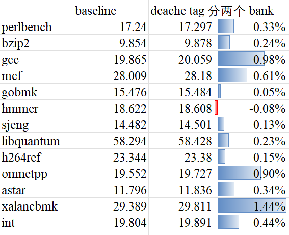

# DCache Tag 按 Set 分 Bank 改动实验报告

## 1. 实验目的

本文评估 commit `b4e904e2789c0806be4fdffe09de0010812fdb0d` 的效果。

该 commit 的核心改动是把 DCache tag array 按 `set` 维度切成 `2` 个 bank，使 tag write 不再全局阻塞 tag read；当 refill 正在写某个 tag bank，而 load unit `s0` 需要读取另一个 tag bank 时，两者可以并行，从而减少 `s0` 因 tag read ready 被阻塞的场景。

本次实验重点回答两个问题：

1. 这个优化是否确实降低了目标场景对应的 `stall_dcache`。
2. `stall_dcache` 的下降是否进一步转化为了 SPECint 收益。

## 2. 改动机制回顾

从 RTL 看，这个 commit 的关键点有两处。

1. 在 [src/main/scala/xiangshan/cache/dcache/DCacheWrapper.scala](/nfs/home/lixin/kmhv3-rtl/perf/XiangShan/src/main/scala/xiangshan/cache/dcache/DCacheWrapper.scala) 中引入了 `tagBanks = 2`，并增加了 `set_to_tag_bank()` / `set_to_tag_bank_set()`，把 tag array 的 bank 选择和 bank 内 set 索引拆开。
2. 在 [src/main/scala/xiangshan/cache/dcache/meta/TagArray.scala](/nfs/home/lixin/kmhv3-rtl/perf/XiangShan/src/main/scala/xiangshan/cache/dcache/meta/TagArray.scala) 中把原来的单组 tag SRAM 改成按 `set bank` 实例化。写请求只占用命中的 bank，读请求也只在命中的 bank 上判断 ready，因此“写 bank A 时，读 bank B”不再互相阻塞。

因此，这个优化直接针对的就是：

- refill 同 cycle 写 tag
- load unit `s0` 同 cycle 读 tag
- 两者落在不同 tag bank
- 原本会被 `tag_write_intend` 全局挡住，现在可以并行

这正对应 `stall_dcache` 的定义：`load s0` 因 `dcache ready`，也就是 tag read ready，无法继续发送请求的次数。

## 3. 实验设置

### 3.1 对比对象

| 版本 | 目录 |
| --- | --- |
| baseline | `/nfs/home/cirunner/perf-report-custom/cr260612-f08ee6caa-DefaultConfig` |
| tag bank 优化后 | `/nfs/home/cirunner/perf-report-custom/cr260615-b4e904e27-DefaultConfig` |

两组结果都覆盖完整 SPECint2006，`score-gcc15-spec06-1.0c.txt` 中 coverage 均为 `1.000`，共 `678/678` 个 checkpoints。

### 3.2 计数器口径

本文使用每个 workload 目录下 `simulator_err.txt` 中 warmup reset 之后最后一次 dump 的值，并按目录名末尾的 simpoint 权重加权汇总到 benchmark 级别。

关注的计数器如下：

| 计数器 | 含义 |
| --- | --- |
| `stall_dcache` | `s0` 因 `dcache ready` 低而阻塞的次数 |
| `stall_out` | `s0` 不能继续接收请求的总次数 |
| `s0_in_fire` | `s0` 实际接受请求的次数 |

其中前两个计数器在 `LoadUnit_[0-2].s0` 的 `XSPerfAccumulate` 中直接导出。

`s0_in_fire` 在当前 perf dump 中没有直接打印，因此本文按 `pipeIn.fire` 的定义，用下式近似重建：

```text
s0_in_fire ~= first_issue + replay_fire + fast_replay_fire + hardware_prefetch_fire
```

这一定义只漏掉极少量 `unalignTail` 流量。两组实验中，按 simpoint 权重汇总后的 `unalignTail` 总量分别约为 `1180` 和 `1152`，而 `s0_in_fire` 总量约为 `2.46e8`，占比低于 `0.001%`，可以忽略，不影响结论。

## 4. 关键结论

先给出整体结论：

1. `stall_dcache` 确实显著下降，说明这个优化命中了目标场景。
2. 本批 workload 中 `stall_dcache/stall_out = 100%`，说明 `s0` 的出口阻塞几乎完全由 dcache tag ready 引起。
3. `s0_in_fire` 总量几乎不变，因此 `stall_dcache` 的下降不是因为 load 压力变小，而是在相同请求规模下，tag 读写并行度更高了。
4. 性能结果上，12 个 SPECint benchmark 中 11 个提升，整体 `SPECint2006/GHz` 从 `19.804` 提升到 `19.891`，提升 `0.44%`。

## 5. 整体结果

### 5.1 SPECInt测试结果



### 5.2 总体指标

| 指标 | baseline | 优化后 | 变化 |
| --- | ---: | ---: | ---: |
| `SPECint2006/GHz` | `19.804` | `19.891` | `+0.44%` |
| 加权 `stall_dcache` | `12.423M` | `7.037M` | `-43.4%` |
| 加权 `stall_out` | `12.423M` | `7.037M` | `-43.4%` |
| 加权 `s0_in_fire` | `245.716M` | `246.023M` | `+0.13%` |
| `stall_dcache / stall_out` | `100.0%` | `100.0%` | `0` |
| `stall_dcache / s0_in_fire` | `5.06%` | `2.86%` | `-2.20pct` |
| `stall_out / s0_in_fire` | `5.06%` | `2.86%` | `-2.20pct` |

这张表说明三件事。

第一，`stall_dcache` 下降非常直接，从 `12.423M` 降到 `7.037M`，相对下降 `43.4%`。这已经足以证明“load `s0` 读 tag 被 refill 写 tag 挡住”的目标场景得到了明显缓解。

第二，`stall_dcache / stall_out` 在两边都是 `100%`。也就是说，在这批 SPECint workload 上，`s0` 的阻塞几乎完全就是 dcache tag ready 阻塞；换句话说，这次优化打到的是 `stall_out` 的主因，而不是一个边缘原因。

第三，`s0_in_fire` 总量基本不变，说明优化前后 `s0` 接收到的请求规模相当；因此 `stall_dcache / s0_in_fire` 从 `5.06%` 降到 `2.86%`，反映的就是同样的 load 压力下，真正因为 dcache tag ready 被卡住的比例显著下降了。

### 5.3 分 benchmark 结果

由于本批数据里 `stall_dcache == stall_out`，所以 `stall_out / s0_in_fire` 与 `stall_dcache / s0_in_fire` 完全一致。下表只列后一项。

| benchmark | baseline score | 优化后 score | score 变化 | baseline `stall_dcache/s0_in_fire` | 优化后 `stall_dcache/s0_in_fire` |
| --- | ---: | ---: | ---: | ---: | ---: |
| perlbench | `17.240` | `17.297` | `+0.33%` | `1.48%` | `0.87%` |
| bzip2 | `9.854` | `9.878` | `+0.24%` | `3.35%` | `1.81%` |
| gcc | `19.865` | `20.059` | `+0.98%` | `5.51%` | `3.24%` |
| mcf | `28.009` | `28.180` | `+0.61%` | `18.74%` | `10.72%` |
| gobmk | `15.476` | `15.484` | `+0.05%` | `1.47%` | `0.75%` |
| hmmer | `18.622` | `18.608` | `-0.08%` | `2.74%` | `1.72%` |
| sjeng | `14.482` | `14.501` | `+0.13%` | `0.21%` | `0.11%` |
| libquantum | `58.294` | `58.428` | `+0.23%` | `17.94%` | `8.28%` |
| h264ref | `23.344` | `23.380` | `+0.15%` | `1.42%` | `0.92%` |
| omnetpp | `19.552` | `19.727` | `+0.90%` | `8.17%` | `4.52%` |
| astar | `11.796` | `11.836` | `+0.34%` | `4.25%` | `2.49%` |
| xalancbmk | `29.389` | `29.811` | `+1.44%` | `8.68%` | `4.59%` |

这个表有两个明显特征。

一是所有 benchmark 的 `stall_dcache/s0_in_fire` 都下降了，而且降幅不小，基本都在 `35%` 到 `54%` 之间。这说明这个优化不是只对个别 benchmark 生效，而是在整组 SPECint 上都稳定降低了 `s0` 的 tag-ready 阻塞占比。

二是收益更明显的 benchmark，通常 baseline 下 `stall_dcache/s0_in_fire` 也更高。例如：

- `mcf`：`18.74% -> 10.72%`，score `+0.61%`
- `libquantum`：`17.94% -> 8.28%`，score `+0.23%`
- `omnetpp`：`8.17% -> 4.52%`，score `+0.90%`
- `xalancbmk`：`8.68% -> 4.59%`，score `+1.44%`
- `gcc`：`5.51% -> 3.24%`，score `+0.98%`

这些 workload 在 baseline 下本来就更容易出现 `s0` 被 dcache ready 卡住的情况，因此 tag bank 化后也更容易获益。

## 6. 结果分析

### 6.1 为什么可以证明优化命中了目标场景

这个实验里最关键的不是 score，而是 `stall_dcache` 的定义本身已经直接对准了优化目标。

本次改动解决的是：

- refill 写 tag
- load `s0` 读 tag
- 两者不同 bank 时仍被全局互斥挡住

而 `stall_dcache` 统计的正是：

- `s0` 发请求时
- 因 `dcacheReq.ready` 低
- 也就是 tag read ready 不满足
- 导致请求不能发出的次数

因此，只要看到 `stall_dcache` 大幅下降，就可以直接说明这个优化缓解了目标场景。这里的整体下降幅度达到 `43.4%`，已经是非常明确的证据。

### 6.2 为什么 `stall_dcache/stall_out` 特别关键

如果 `stall_out` 里混了很多别的原因，那么即使 `stall_dcache` 下降，也很难说明优化抓住了主矛盾。

但这次实验不是这样。对这批 SPECint workload：

```text
stall_dcache == stall_out
```

也就是：

```text
stall_dcache / stall_out = 100%
```

这说明 `s0` 的出口阻塞几乎全部就是 dcache tag ready 阻塞，没有被别的原因稀释。于是本次优化不仅“降低了某个计数器”，而是直接降低了 `s0` 的主要阻塞源。

这也是为什么 `stall_out/s0_in_fire` 和 `stall_dcache/s0_in_fire` 完全重合。

### 6.3 为什么可以认为性能收益来自这次优化

要把计数器变化和性能收益联系起来，至少要满足两个条件：

1. 目标阻塞确实下降。
2. 请求规模没有同步下降。

这两个条件在本次实验里都成立。

首先，`stall_dcache` 从 `12.423M` 降到 `7.037M`，下降 `43.4%`。

其次，`s0_in_fire` 从 `245.716M` 到 `246.023M`，几乎不变，甚至略增 `0.13%`。所以 `stall_dcache/s0_in_fire` 的改善不是 workload 本身“变轻了”，而是相同量级的 load 请求更少被 tag ready 卡住了。

在这个前提下，再看最终 score：

- 12 个 benchmark 中 11 个提升
- 只有 `hmmer` 有 `-0.08%` 的轻微回退
- 整体 `SPECint2006/GHz` 提升 `0.44%`

因此更合理的结论是：

- 这次优化稳定降低了 `s0` 的 dcache tag-ready 阻塞
- 这部分阻塞本来就是 `s0` 的主要阻塞来源
- 阻塞下降最终转化为了整体正收益

`hmmer` 的单点轻微回退并不构成反证，因为它的目标计数器同样明显改善了，更像是其它路径主导下的小幅扰动，而不是该优化本身无效。

## 7. 结论

commit `b4e904e2789c0806be4fdffe09de0010812fdb0d` 的效果可以概括为三句话。

1. 它确实优化了目标场景。`stall_dcache` 在完整 SPECint 上从 `12.423M` 降到 `7.037M`，下降 `43.4%`。
2. 它抓住了主要矛盾。在这批 workload 中，`stall_dcache/stall_out = 100%`，说明 `s0` 的阻塞几乎全部来自 dcache tag ready。
3. 它带来了稳定的性能收益。12 个 benchmark 中 11 个提升，整体 `SPECint2006/GHz` 从 `19.804` 提升到 `19.891`，提升 `0.44%`。

因此，这次 “dcache tag 按 set 维度分 2 个 bank” 的优化，不只是改善了局部计数器，而是明确降低了 load `s0` 在 refill 写 tag 场景下的阻塞，并最终转化成了可观测的 SPECint 收益。
