# VAGQ 设计方案

> **状态**: Draft v2
> **创建日期**: 2026-06-04
> **目标**: 取代非连续向量访存旧拆分/合并模块 (VLSplit + VSSplit + VLMergeBuffer + VSMergeBuffer + VSegmentUnit)，建立向量访存微操作拆分与合并的统一通路

---

## 1. 背景与动机

### 1.1 现有 VLSU 架构回顾

当前香山向量访存通路分为 Load/Store 两条独立路径：

```
Vector Load 通路:
  VecIQ → VLSplit (VLSplitPipeline + VLSplitBuffer) → VLMergeBuffer → LoadUnit → LDU Pipeline → 写回

Vector Store 通路:
  VecIQ → VSSplit (VSSplitPipeline + VSSplitBuffer) → VSMergeBuffer → StoreUnit → STA/STD Pipeline → 写回
```

各模块职责：

| 模块 | 职责 | 限制 |
|---|---|---|
| **VLSplitPipeline** (2级) | 二次译码、Mask 计算、偏移计算、申请 MergeBuffer 表项 | 只处理 Load |
| **VLSplitBuffer** (1项) | 将 uop 按元素拆分为标量访存请求，逐拍发送至 LoadUnit | **单条目，无并行** |
| **VSSplitPipeline** (2级) | 同上，Store 版本 | 只处理 Store |
| **VSSplitBuffer** (1项) | 同上，Store 版本 | **单条目，无并行** |
| **VLMergeBuffer** (16项) | 收集 Load Pipeline 返回的数据，按 uop 合并后写回 | 只处理 Load |
| **VSMergeBuffer** (16项) | 同上，Store 版本 | 只处理 Store |
| **VSegmentUnit** (8项) | Segment 指令的顺序拆分与合并 | **设计失误**：Segment 是与访存类型正交的维度，不应独立 |
| **VfofBuffer** (1项) | Fault-Only-First 的 VL 写回 | 仅 unit-stride FOF，不进 VAGQ |

### 1.2 现有架构的核心问题

1. **拆分无并行**：VLSplitBuffer / VSSplitBuffer 仅有 1 项，同一时刻只能拆分一条 uop。对于 `LMUL=8` 的大向量指令，拆分为多个 uop 后只能串行处理，无法利用 ILP。

2. **Load/Store 割裂**：VLSplit 和 VSSplit 是两套独立但高度相似的设计，Mask 计算、地址偏移计算、FlowNum 管理等逻辑重复。维护成本高，且 Load/Store 间的协调（如 ordering）需要额外处理。

3. **Segment 正交性被破坏**：Segment (nf=2~8) 是与 unit-stride/stride/indexed 正交的访存维度，但被错误地独立为 VSegmentUnit 模块，导致逻辑重复和交互复杂。

4. **MergeBuffer 与 Split 耦合松散**：Split 和 Merge 分离为两个模块，通过 handshake 通信。MergeBuffer 需要为每个 uop 预分配表项（16 项），且反压逻辑（threshold=6）粗粒度。

5. **Issue Queue 复用不统一**：constant-stride 走 StaIQ/StdIQ、indexed 走 StaIQ/VStdIQ，与 unit-stride 的 VecIQ 通路不对称，dispatch 逻辑复杂。

### 1.3 VAGQ 的设计目标

| 目标 | 描述 |
|---|---|
| **专注非连续访存** | 处理 constant-stride 和 indexed（含 segment 变体）；连续访存指令走标量通路 (LduIQ→LDU, StaIQ→STA) |
| **统一 Load/Store/Segment** | 一套表项结构 + 拆分合并逻辑覆盖所有组合，Segment 作为正交维度融入 |
| **并行拆分** | 多条目（可配置），每条目 bitmap 追踪至多 16 个访存微操作 |
| **配对发射** | 复用 StaIQ + StdIQ/VStdIQ，地址侧与数据侧微指令在 VAGQ 内配对，开销相对访存延迟可忽略 |
| **不处理非对齐/跨页** | 非对齐和跨 4K 页由 StoreQueue / StoreUnit (STA) 负责，VAGQ 只按虚拟地址拆分 |

---

## 2. VAGQ 定位与拓扑

### 2.1 模块位置

```
Dispatch ──→ VecOrderQueue (预分配 entryIdx) ──→ IntIQ (StaIQ / StdIQ) ──→ VAGQ ──→ LDU (via arbiter)
                                               VecIQ (VStdIQ)       ──→       └─→ STA (via arbiter)
                                                                                     └─→ Vec Regfile

Unit-Stride / Whole-Register / Mask 指令 (不进 VAGQ，走标量通路):
  Load:  Dispatch ──→ LduIQ ──→ LDU
  Store: Dispatch ──→ StaIQ ──→ STA
```

VAGQ 位于 Issue Queue 与 LSU Pipeline 之间，仅处理**非连续**向量访存：
- **上游**：VecOrderQueue (entry 预分配) → StaIQ (地址侧) + StdIQ (stride 侧) / VStdIQ (index 侧)
- **下游**：LDU (load) / STA (store) 流水线，Vec Regfile (merge 读写)
- **旁路**：VRF → VAGQ 读通路（vs3 用于合并/存储数据，vs2 用于 indexed 索引数据）

{#fig:VAGQ-Topology}

### 2.2 取代范围

| 旧模块 | 取代方式 |
|---|---|
| VLSplit (仅 stride/indexed/segment 部分) | VAGQ 内部地址生成 + 拆分逻辑 |
| VSSplit (仅 stride/indexed/segment 部分) | 同上，统一处理 |
| VLMergeBuffer | VAGQ 内部合并 Buffer（复用表项） |
| VSMergeBuffer | 同上 |
| VSegmentUnit | **合并到 VAGQ**，Segment 作为正交维度融入拆分逻辑 |

**VAGQ 一期取代**：以下旧模块中与非连续访存拆分/合并相关的职责迁移到 VAGQ：
- **VLSplit / VSSplit** (含 Pipeline + Buffer)：全部向量访存拆分逻辑迁移至 VAGQ
- **VLMergeBuffer / VSMergeBuffer**：合并逻辑内化到 VAGQ 表项
- **VSegmentUnit**：Segment 作为正交维度融入 VAGQ

**不进入 VAGQ 的旧职责**：
- **VfofBuffer / FOF**：FOF 仅存在于 unit-stride load，继续走 LduIQ→LDU 通路
- **LoadMisalignBuffer / StoreMisalignBuffer**：非对齐与跨页仍由 LSU/LSQ 侧处理，VAGQ 只生成完整虚拟地址和 byte mask

VAGQ 是向量非连续访存的拆分、追踪、合并模块，覆盖 constant-stride、indexed unordered、indexed ordered 以及 segment 变体。连续访存、mask/whole-register/FOF 不进入 VAGQ，继续走既有 LduIQ/StaIQ 路径。

**设计原则**
- 表项定位使用 `entryIdx` 直接索引，不做 CAM 匹配。
- 地址侧和数据侧微指令分开发射、分开等待操作数，进入同一个 VAGQ entry 后合流。
- 每个 entry 用 `reqSent + reqAck` 双 bitmap 管理最多 16 个字节级 req。
- Active 数据由 LSU 或 STA 真实访存处理；非 active 元素只消费 LSQ 预留表项，load 再由 VAGQ merge 旧 `vd`。
- Segment 对 VAGQ 透明，VAGQ 不按 `nf` 展开。

### 2.3 参数定义

| 参数 | 值 | 说明 |
|---|---|---|
| `VLEN` | 128 | 向量寄存器位宽 |
| `VLENB` | 16 | 向量寄存器字节宽 ($VLEN/8$) |
| `uvlWidth` | 4 | $\log_2(VLENB)$，uvlByte/uvstartByte 公式位切片用 |
| `VAGQSize` | 4 或 8 | VAGQ 表项数，可配置参数 |

---

## 3. 总体架构

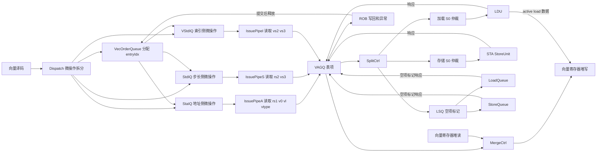
---

## 4. 支持的指令类型

VAGQ 处理 **constant-stride** 和 **indexed**（含 ordered/unordered），以及它们的 **Segment** 变体 (nf=2~8)。

| 类别 | 指令 | uop 数 | 每 uop 元素数 | 地址公式 | Segment 变体 |
|---|---|---|---|---|---|
| Constant-Stride Load | `vlse.v` | `emul` | `VLEN/SEW` | `base + elem × stride` | `vlseg[e].v` |
| Constant-Stride Store | `vsse.v` | `emul` | `VLEN/SEW` | 同上 | `vsseg[e].v` |
| Indexed Unordered Load | `vluxei.v` | `max(emul, lmul)` | `VLEN/SEW` | `base + vs2[elem]` | `vluxseg[e]i.v` |
| Indexed Ordered Load | `vloxei.v` | 同上 | `VLEN/SEW` | 同上 | `vloxseg[e]i.v` |
| Indexed Unordered Store | `vsuxei.v` | 同上 | `VLEN/SEW` | 同上 | `vsuxseg[e]i.v` |
| Indexed Ordered Store | `vsoxei.v` | 同上 | `VLEN/SEW` | 同上 | `vsoxseg[e]i.v` |

> **不进 VAGQ 的指令**：`vle.v`, `vse.v`, `vlm.v`, `vsm.v`, `vlr.v`, `vsr.v`, `vleff.v` — 这些连续向量访存指令走标量发射队列和通路 (Load: LduIQ→LDU, Store: StaIQ→STA)，无需中间拆分模块。


### 4.1 准入流程

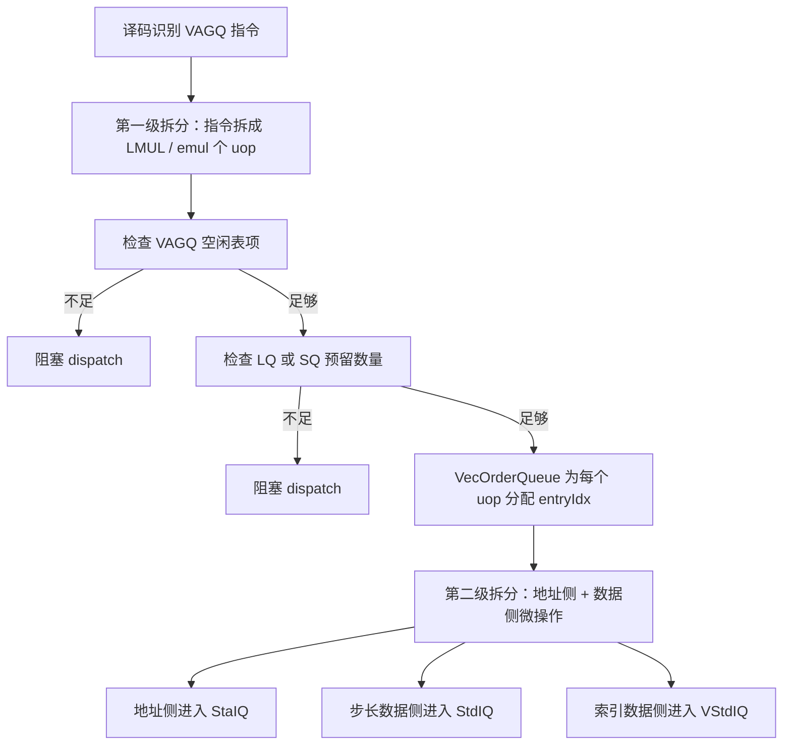

### 4.2 关键约束

- 每条原始向量访存指令拆成若干 VAGQ uop，每个 uop 分配一个 entry。
- 同一个 VAGQ uop 派生出的地址侧和数据侧微指令必须携带相同 `entryIdx`。
- VecOrderQueue 负责 entry 生命周期的顺序化分配和 ROB commit 后回收。
- LSQ 预留在 dispatch 完成，避免 SplitCtrl 中途因为 LSQ 表项不足而死锁或泄漏。

### 4.3 Constant-stride 指令端到端流程

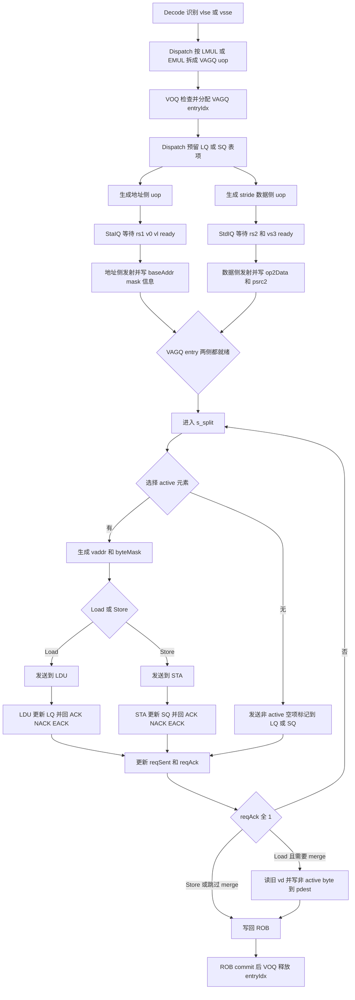

---

## 5. 微架构设计

### 5.1 顶层子模块

```
VAGQ
├── VAGQEntry     (×VAGQSize, 可配置) — 每条微指令一个表项，由 VecOrderQueue 预分配
├── AddrGen       (组合逻辑)      — 地址计算: base + elem×stride / base + vs2[idx]
├── MaskGen       (组合逻辑)      — 字节掩码生成 (16b for VLEN=128)
├── SplitCtrl     (独立于表项)    — 控制拆分节奏，每拍选 1~2 个 entry 发射 req 至 LSU/LSQ
├── MergeCtrl     (独立于表项)    — 收集 req ACK，处理合并写回
├── VRFReadIF                    — 读 vs3 (合并/存储数据) / vs2 (indexed 索引数据)
└── VRFWriteIF                   — 写合并结果至 Vec Regfile
```

> VAGQ 表项由 VecOrderQueue 在 dispatch 时预分配并分配 `entryIdx`。uop 发射时携带 `entryIdx` 直接写入对应表项。Arbiter 在 VAGQ 外部。

### 5.2 表项结构 (VAGQEntry)

每条向量访存微指令在 VAGQ 中分配一个表项。表项数 `VAGQSize` 为**可配置参数**（建议 4 或 8）。

核心设计：使用 **bitmap** 追踪至多 16 个访存微操作的状态。
$$16 = \frac{VLEN}{SEW_{min}} = \frac{128}{8}$$

| 字段 | 位宽 | 描述 |
|---|---|---|
| **基础标识** |||
| `valid` | 1 | 表项有效 |
| `meta` | - | 指令元信息，例如 `lqIdx` / `sqIdx` / `lsqToken`、trigger、调试字段等 |
| `uopType` | 3 | 指令类型: stride-ld / stride-st / idx-unord-ld / idx-unord-st / idx-ord-ld / idx-ord-st |
| `robIdx` | 8 | ROB 项序号，用于仲裁和提交 |
| **目的寄存器** |||
| `pdest` | 7 | 目的 Vec Regfile 物理寄存器编号 (Load)；Store 时 dontCare |
| `psrc2` | 7 | 对应 vs3 物理寄存器编号：Load 时为旧 vd (合并 prestart/inactive/tail)，Store 时为待存储数据源 |
| **地址与步长** |||
| `baseAddr` | 64 | 基地址 (rs1)，XLEN 位宽，高位不可舍弃 |
| `op2Data` | 128 | 第二操作数数据：stride 指令存 rs2 步长值 (低 64b)，indexed 指令存 vs2 索引向量数据 |
| `storeData` | 128 | Store 专用，数据侧微指令读出的 vs3 数据；Load 时 dontCare |
| **元素配置** |||
| `ieew` | 2 | 索引元素宽度编码，00/01/10/11 对应 8/16/32/64；stride 指令时 dontCare |
| `deew` | 2 | 数据元素宽度编码，00/01/10/11 对应 8/16/32/64；`elemBytes = 1 << deew` |
| `uvlByte` | 5 | 本 uop 内 `[0, vl)` 覆盖的有效字节数 (0~16)：完整覆盖时取 16，跨 vl 边界时取 `vlByte % VLENB` |
| `useVstart` | 1 | context restore 标志：=1 时 MaskGen 使用 CSR.vstart，=0 时 vstart 视为 0；CSR.vstart 本身不存 entry |
| `vma` | 1 | mask agnostic 策略：masked-off byte 在 vma=1 时可写 agnostic 值 |
| `vta` | 1 | tail agnostic 策略：tail byte 在 vta=1 时可写 agnostic 值 |
| `uopIdx` | 3 | 本条 uop 在指令中的序号 (0~7) |
| `elemActiveMask` | 16 | **预计算字节掩码**：由 vm + v0 + vstart + vl 一次性生成，每 bit 表示该 byte 需要真实访存 |
| `elemAgnosticMask` | 16 | 非 active byte 中可写 agnostic 值的集合；prestart 永远不置位 |
| **Segment 维度** |||
| `nf` | 3 | Segment 字段数 (1~8; 1 表示非 segment) |
| **拆分追踪** |||
| `reqSent` | 16 | **已发送 bitmap**：bit=1 表示对应字节的 req 已发射至 LSU 或 LSQ |
| `reqAck` | 16 | **已确认 bitmap**：bit=1 表示对应字节的 req 已收到 ACK（LSU 或 LSQ） |
| **异常** |||
| `exceptionNumber` | 6 | 异常编号 (0~63; 0 表示无异常) |
| `faultElemIdx` | 4 | 异常元素在本 uop 内的元素序号，由 `byteOffset >> deew` 得到 |
| `faultVstart` | vstartWidth | 写回异常时使用的架构元素序号，等于 `uopIdx * elementsPerUop + faultElemIdx` |
| **状态** |||
| `state` | 3 | 表项状态 (见 §5.4) |

### 5.3 写入策略

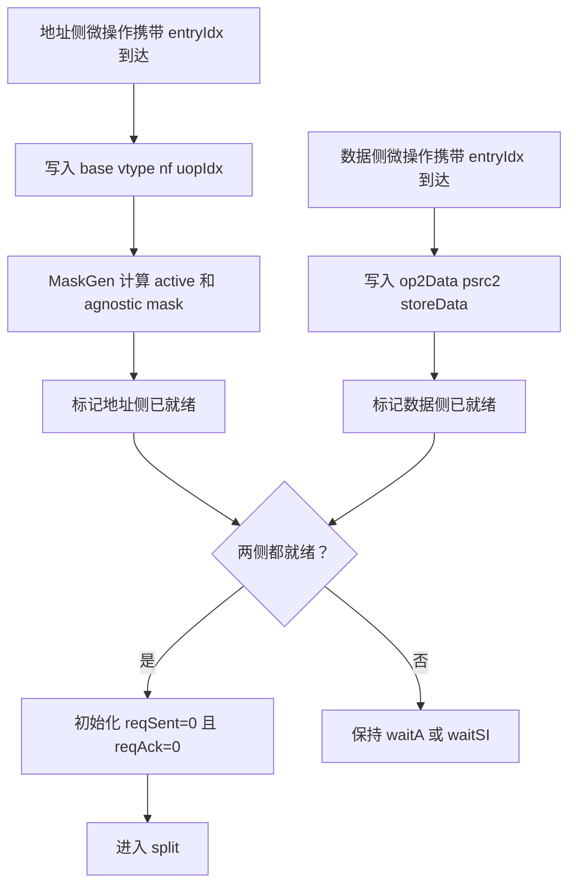

**命名约束**
- `op2Data` 统一承载 stride 和 index，不引入 `stride` 专用字段
- `ieew` 只表示 index element width
- `deew` 只表示 data element width，不与 CSR `sew` 混用
- `v0`、`vm`、`vl` 和 CSR `vstart` 不长期存表项，只在 MaskGen 生成 `elemActiveMask` / `elemAgnosticMask` 时使用。

### 5.4 表项状态机

`valid=0` 表示表项空闲，`state` 仅在 `valid=1` 时有效。

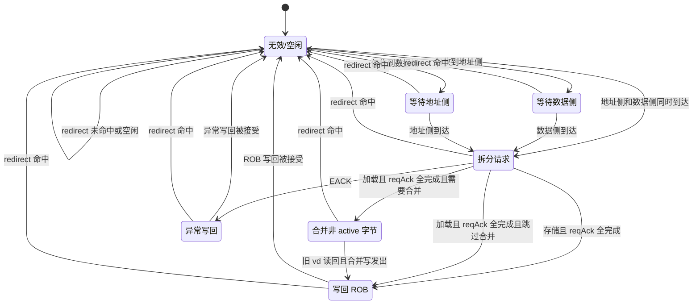

#### 状态定义

| 状态 | valid | state | 描述 |
| --- | --- | --- | --- |
| `s_invalid` | 0 | (don't care) | 表项空闲，state 编码无效 |
| `s_waitA` | 1 | 3'b001 | 等地址微指令 (vlsa/vssa/vlxa/vsxa) |
| `s_waitSI` | 1 | 3'b010 | 等 Stride/Index 微指令 (vlss/vsss/vlxi/vsxi) |
| `s_split` | 1 | 3'b011 | 收齐两条微指令，按元素拆分并逐拍发送 req 至 LSU；收集 ACK/NACK 响应 |
| `s_merge` | 1 | 3'b100 | 全部 `reqAck` 置 1，向 VRF 发送读请求 (仅 Load) |
| `s_wb` | 1 | 3'b101 | 收到 VRF 数据后写回合并结果 (Load) 或标记 ROB 完成 (Store)，完成后置 `valid=0` |
| `s_excp` | 1 | 3'b110 | 收到 LSU 的 EACK（异常回应），停止拆分，等 `faultElemIdx` 前的 req 标记 ACK 后向 ROB 写回异常，完成后置 `valid=0` |

#### 状态转移

| 状态 | 下一状态 | 条件 |
|---|---|---|
| `s_invalid` | `s_waitA` | 收到数据侧uop & 未收到地址侧uop |
| `s_invalid` | `s_waitSI` | 收到地址侧uop & 未收到数据侧uop |
| `s_invalid` | `s_split` | 收到地址侧uop & 收到数据侧uop |
| `s_waitA` | `s_split` | 收到地址侧uop |
| `s_waitSI` | `s_split` | 收到数据侧uop |
| `s_split` | `s_merge` | Load 指令，`reqAck == 16'hFFFF` |
| `s_split` | `s_wb` | Store 指令，`reqAck == 16'hFFFF` |
| `s_split` | `s_excp` | LSU 返回 EACK |
| `s_merge` | `s_wb` | VRF 读数据返回 |
| `s_wb` | `s_invalid` | 写回完成 |
| `s_excp` | `s_invalid` | 异常写回完成 |
| 任意 | `s_invalid` | redirect (robIdx 匹配，不在图中画出) |

### 5.5 微操作状态机

#### 状态定义

每个字节的 req 有三种状态，由双 bitmap 编码：

| 状态 | `reqSent` | `reqAck` | 含义 |
|---|---|---|---|
| IDLE | 0 | 0 | 尚未发送 |
| SENT | 1 | 0 | 已发送，等待 ACK/NACK |
| DONE | X | 1 | 已完成（active 或非 active，`reqAck=1`） |

#### 状态流
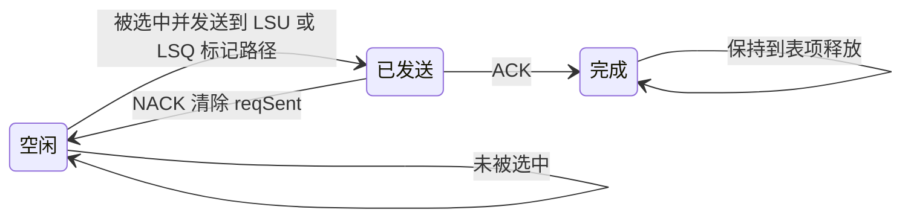

#### 状态转移

| 状态 | 下一状态 | 条件 |
|---|---|---|
| `IDLE` | `SENT` | 对应字节的 `elemActiveMask=1` 且被选出发送给 LSU |
| `IDLE` | `SENT` | 对应字节的 `elemActiveMask=0` 且被选出发送给 LSQ（LoadQueue 或 StoreQueue） |
| `SENT` | `IDLE` | 收到 NACK（LSU 或 LSQ） |
| `SENT` | `DONE` | 收到 ACK（LSU 或 LSQ） |
| 任意 | `IDLE` | entry进入`s_split`状态时初始化 |

**进入 `s_split` 时初始化**：
```
// 所有字节初始化为 IDLE；tail 也需经 LSQ 消费预留表项
reqSent = 16'b0
reqAck  = 16'b0
exceptionNumber = 6'b0
faultElemIdx = 4'b0
```

**非 active 元素的 LSQ 交互**：
- 非 active 字节虽然不产生真实访存 req，但仍需向 LSQ（LoadQueue 或 StoreQueue）发送**空项标记请求**
- 目的：保证 LSQ 中为该 uop 预留的表项全部被消费，避免表项泄漏
- 实现：SplitCtrl 遍历 bitmap 时，对 `elemActiveMask=0 & ~reqSent & ~reqAck` 的字节选中发送至 LSQ，置 `reqSent=1`（IDLE→SENT）。LSQ 返回 ACK 后置 `reqAck=1`（SENT→DONE）；LSQ 返回 NACK 后清 `reqSent`（SENT→IDLE），触发重发。

**LSU/LSQ 响应处理**：
```
// ACK: reqAck=1 → DONE（LSU和LSQ统一处理）
reqAck[byteOffset +: elemBytes] = 1

// NACK: 清除reqSent → IDLE（LSU和LSQ统一处理）
reqSent[byteOffset +: elemBytes] = 0
```

**下一个待发送到 LSU 的 REQ**：优先编码 `~reqSent & elemActiveMask`，找到第一个需要发送的字节。

> `~reqAck` 必须参与 pending 判定：`reqAck=1` 的 byte 已经完成，即使后续 NACK 或 replay 修改其他 byte，也不能再次发起同一个完成 byte 的真实访存。

> **Ordered-Index 约束**：`vloxei` / `vsoxei` 在 `(reqSent & ~reqAck & elemActiveMask) != 0` 时阻塞本 entry 向 LSU 发射，确保 active 元素严格按顺序发送。

**下一个待发送到 LSQ 的 REQ**：优先编码 `~elemActiveMask & ~reqSent & ~reqAck`，找到第一个需要发送的字节（仅 IDLE 中的非 active 字节）。

**完成判定**：`reqAck == 16'hFFFF`，active 和非 active 的字节都以 `reqAck=1` 为完成标志

**重发 (Replay)**：
- LSU 和 LSQ 均可通过 NACK 触发重发
- LSU NACK：清除对应字节的 `reqSent`，SENT→IDLE。下一拍 `~reqSent & ~reqAck & elemActiveMask` 检测到后自动重新发送
- LSQ NACK：清除对应字节的 `reqSent`，SENT→IDLE。下一拍 `~elemActiveMask & ~reqSent & ~reqAck` 检测到后自动重新发送

**SplitCtrl 仲裁优先级**
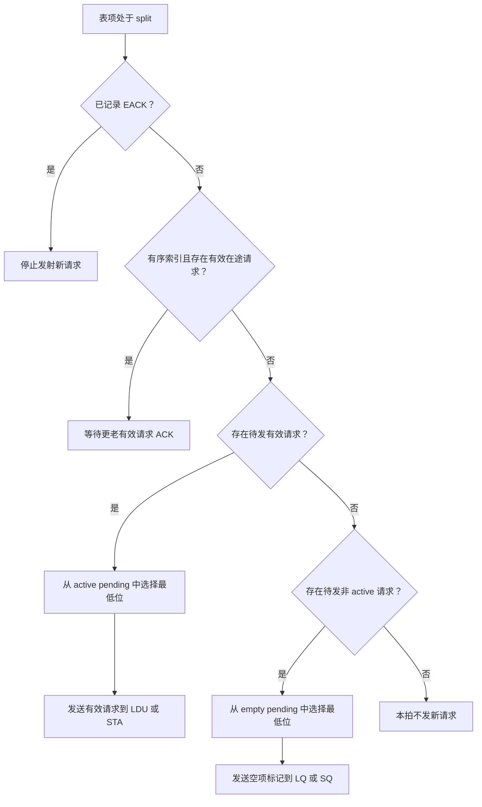

**ACK/NACK 更新**

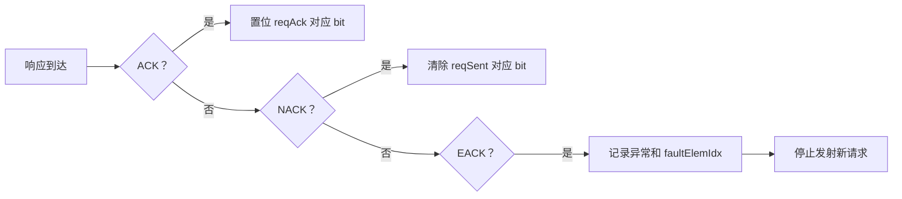


### 5.6 地址生成 (AddrGen)

#### 5.6.1 Constant-Stride

方案一存储`x[rs1]`作为`baseAddr`，生成`addr`完成 $64b\times7b+64b$ 运算

$$
\begin{align}
\mathrm{offset} &= \mathrm{op2Data} \times (\mathrm{uopIdx} \times \mathrm{elemNum}\ | \ \mathrm{elemIdx}) \\
\mathrm{addr} &= \mathrm{baseAddr} + \mathrm{offset} \\
\end{align}\\

\begin{cases}
\mathrm{baseAddr}&= x[rs1] \\
\mathrm{op2Data}&= x[rs2] \\
\mathrm{elemNum}&= \frac{\mathrm{VLEN}}{\mathrm{SEW}} \\
\mathrm{op2Data}&\in[-2^{63}, 2^{63})\cap\Z, \\
\mathrm{uopIdx}&\in[0,2^3)\cap\Z,\\
\mathrm{elemIdx}&\in [0,\mathrm{elemNum})\cap\Z \\

\end{cases}
$$

方案二存储`baseAddr`时做 $64b+\mathrm{mux4to1}\{64b\times3b\}$ 运算，生成`addr`完成 $64b+64b\times3b$ 运算

$$

\begin{align}
\mathrm{offset} &= \mathrm{op2Data} \times \ \mathrm{elemIdx} \\
\mathrm{addr} &= \mathrm{baseAddr} + \mathrm{offset} \\
\end{align}\\

\begin{cases}
\mathrm{baseAddr}&= x[rs1] + x[rs2] \times \mathrm{uopIdx} \times \mathrm{elemNum} \\
\mathrm{op2Data}&= x[rs2] \\
\mathrm{elemNum}&= \frac{\mathrm{VLEN}}{\mathrm{SEW}} \\
\mathrm{op2Data}&\in[-2^{63}, 2^{63})\cap\Z, \\
\mathrm{uopIdx}&\in[0,2^3)\cap\Z,\\
\mathrm{elemIdx}&\in [0,\mathrm{elemNum})\cap\Z \\
\end{cases}

$$

#### 5.6.2 Index

生成`addr`完成 $64b + \mathrm{mux64to1}(64b)$

$$
\begin{align}
\mathrm{offset} &= \mathrm{mux4to1}(\mathrm{mux16to1}(\mathrm{op2Data[elemIdx]})) \\
\mathrm{addr} &= \mathrm{baseAddr} + \mathrm{offset} \\
\end{align}\\

\begin{cases}
\mathrm{baseAddr}&= x[rs1] \\
\mathrm{op2Data}&= v[vs2] \\
\mathrm{elemIdx}&\in [0,\mathrm{elemNum})\cap\Z \\

\end{cases}
$$

**操作数扩展**：加法器做 64b + 64b 加法。
- **stride**：`op2Data[63:0]` 来自 x 寄存器，已是 64b，直接使用。
- **index**：当 ieew < 64 时从 `op2Data` 中取出后 **zero-extend** 到 64b。ieew=64 时直接使用。

**Indexed**
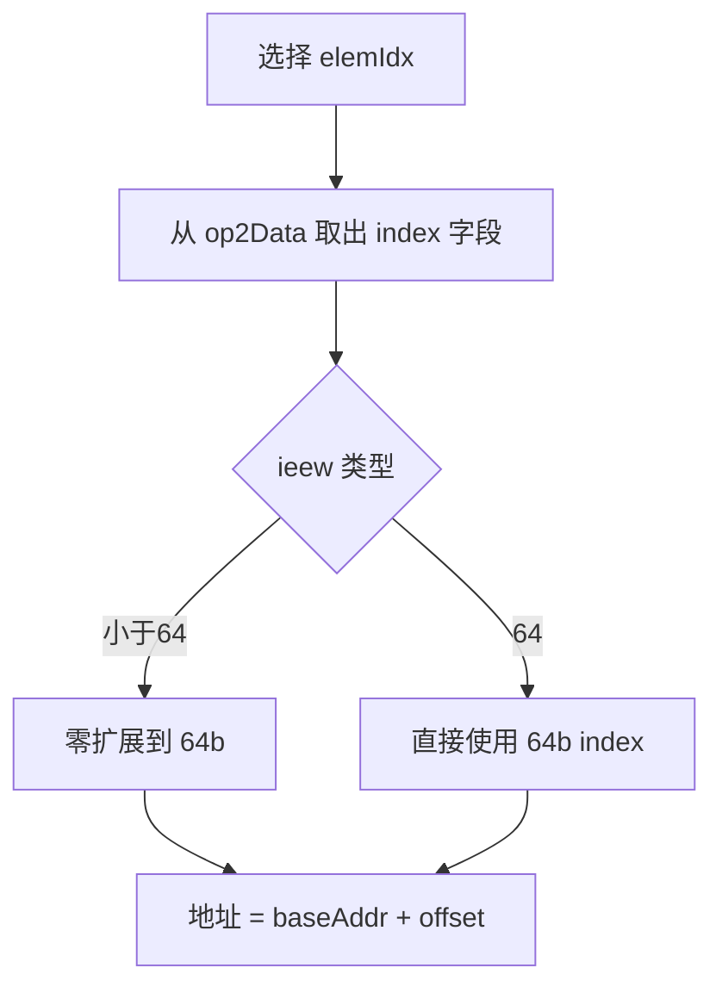

**统一约束**
- 地址输出必须是完整虚拟地址
- Req 必须携带 byte mask
- 非对齐和跨页不在 VAGQ 内展开处理

### 5.7 掩码生成 (MaskGen)

对于 VLEN=128，生成 16-bit 字节掩码并存入表项。拆分时由 `vm`、`v0`、`vstart`、`uvlByte`、`vma`、`vta` 一次性计算，后续不再依赖这些输入。

MaskGen 输出两类 mask：
- `elemActiveMask`：byte 需要真实访存，active load/store req 只看这个 mask。
- `elemAgnosticMask`：byte 不做真实访存，但 merge 时允许写成 agnostic 值。它只覆盖 masked-off 或 tail byte，prestart byte 必须保持旧 `vd`，不能置 agnostic。

- `vstart`：`useVstart=1` 时从 CSR 读取，否则默认为 0。
- `uvlByte`：本 uop 内的字节粒度有效长度 (0~16)，VAGQ 接收地址微指令时计算。

$$
uvlByte =
\begin{cases}
VLENB,&uopIdx<vlByte[msb:uvlWidth]\\
vlByte \mod \mathrm{VLENB},&uopIdx=vlByte[msb:uvlWidth]\\
0,&uopIdx>vlByte[msb:uvlWidth]\\
\end{cases}
\\
vlByte = vl << deew
\\
uvlWidth = \log_2{VLENB}

$$

`uvlByte` 是 `vl` 对应的总字节数与本 uop 的字节区间的交集长度。

`uvstartByte` 同理，是 `vstart` 对应字节位置与本 uop 字节区间的交集长度：

$$
vstartByte = useVstart\ ?\ CSR.vstart << deew\ :\ 0
\\
uvstartByte =
\begin{cases}
VLENB,&uopIdx<vstartByte[msb:uvlWidth]\\
vstartByte \mod \mathrm{VLENB},&uopIdx=vstartByte[msb:uvlWidth]\\
0,&uopIdx>vstartByte[msb:uvlWidth]\\
\end{cases}
$$

**元素活性与 agnostic 判定**：以字节为粒度生成 16b 掩码，避免 per-element 运算。

```
// prestart: uvstartByte 之前的所有字节为 inactive，且必须保留旧 vd
// tail:     uvlByte 之后的所有字节为 inactive，vta=1 时可写 agnostic
// mask:     vm=1 时全部 active；否则取 v0 对应 bit，vma=1 时 masked-off byte 可写 agnostic

for byteIdx in 0..VLENB-1:
  inPrestart = (byteIdx < uvstartByte)
  inTail     = (byteIdx >= uvlByte)
  maskOff    = (vm == 0) AND (v0Mask[byteIdx / (1 << deew)] == 0)

  if inPrestart OR inTail:
    active[byteIdx] = 0
  elif vm == 1:
    active[byteIdx] = 1
  else:
    active[byteIdx] = NOT maskOff

  agnostic[byteIdx] =
    (inTail AND vta == 1) OR
    ((NOT inPrestart) AND (NOT inTail) AND maskOff AND vma == 1)

  elemActiveMask[byteIdx]   = active[byteIdx]
  elemAgnosticMask[byteIdx] = agnostic[byteIdx]
```

**Store 指令**：只对 `elemActiveMask[byteIdx]==1` 的字节发起 store req。

> **关于 `vm` 和 `v0`**：两者仅在 MaskGen 阶段使用，不存入表项。v0 随地址侧微指令传入后锁存一拍参与计算，`elemActiveMask` 和 `elemAgnosticMask` 生成后即可释放。

**输入与输出**

| 输入 | 来源 | 生命周期 |
|---|---|---|
| `vm` | 地址侧 uop | 只用于 MaskGen |
| `v0` | 地址侧 uop 读 V0 RF | 锁存一拍后释放 |
| `vl` | 地址侧 uop / VL RF | 只用于 MaskGen |
| `vstart` | CSR，受 `useVstart` 控制 | 只用于 MaskGen |
| `deew` | vtype / decode | 存 entry；`elemBytes = 1 << deew` |
| `vma` / `vta` | vtype / decode | 只用于 MaskGen；若后续需要调试也可保留在 entry |
| `uopIdx` | uop 元数据 | 存 entry |

输出：`elemActiveMask[15:0]` 和 `elemAgnosticMask[15:0]`，每 bit 对应一个 byte lane。

**流程图**

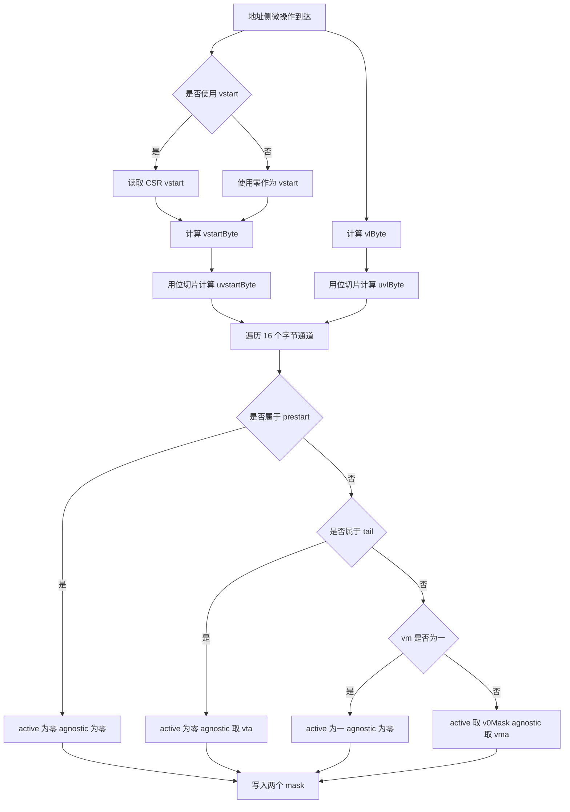

**时序建议**
- MaskGen 放在地址侧 uop 写 VAGQ entry 的同拍或下一拍组合计算
- `v0` 不进入长期表项，只需保证 MaskGen 计算前已经读到并稳定
- `uvlByte` / `uvstartByte` 使用移位和切片，不引入除法器

### 5.8 合并逻辑 (Merge) — 仅 Load

**数据写入分工**：
- **Active 元素**：LDU pipeline 完成访存后**直接写入 Vec Regfile**（按 `pdest` + 对应 byte mask），不经过 VAGQ buffer
- **非 active 元素**（prestart / inactive / tail）：由 VAGQ 在 merge 阶段处理，读取旧 vd 后合并写入

**合并时机**：`reqAck` 全 1（所有 req ACK 已收到）

**合并数据来源**：
- **旧 vd 数据**：从 Vec Regfile 读取 `psrc2`，用于 prestart 或 undisturbed 的 inactive/tail byte。segment 时 Gather 模块负责多寄存器 zip/unzip，VAGQ 只处理单一寄存器粒度。
- **agnostic 数据**：`elemAgnosticMask` 置位的 byte 可写固定全 1（或实现定义的 agnostic 值），不需要读取旧 vd。

**合并操作** (per-byte，仅处理非 active 字节)：

```
// LDU 已将 active 字节直接写入 VRF
// VAGQ merge 阶段只负责非 active 字节的 VRF 写入
for byteIdx in 0..15:
  if elemActiveMask[byteIdx] == 0:
    vrfWriteMask[byteIdx] = 1
    if elemAgnosticMask[byteIdx] == 1:
      vrfWriteData[byteIdx] = 0xFF
    else:
      vrfWriteData[byteIdx] = oldVdData[byteIdx]
  else:
    // active 字节：LDU 已写入，VAGQ 不触碰
    vrfWriteMask[byteIdx] = 0

// 若 vrfWriteMask 全 0，则跳过 merge 阶段
```

- VAGQ 写入 `pdest` 时仅非 active byte lane 有效（与 LDU 的 active 写入互补）
- `elemAgnosticMask` 只影响 `vrfWriteData` 选择，不影响是否消费 LSQ 预留表项
- segment 的 zip/unzip 由 Gather 模块后续处理

**优化**：若非 active byte 全部属于 agnostic，可以不读旧 vd；若没有非 active byte，则跳过 `s_merge` 直接进入 `s_wb`。

**Store 不需要合并**：Store 只等 STA ACK 后标记完成，全部 req 完成后写回 ROB。

### 5.9 表项分配与数据写入

VAGQ 表项由 **VecOrderQueue** 在 dispatch 阶段预分配。VecOrderQueue 维护 `VAGQSize` 位的 bitmap，为每条需要 VAGQ 的指令分配空闲表项，并将 `entryIdx` 写入其全部 uop。

所有 VAGQ 处理的指令在 dispatch 阶段拆分为**地址侧** + **数据侧**两条微指令：

| 指令 | 地址侧微指令 (→ StaIQ) | 数据侧微指令 | 进入队列 |
|---|---|---|---|
| Constant-Stride Load (`vlse`) | **vlsa** | **vlss** (stride) | StdIQ |
| Constant-Stride Store (`vsse`) | **vssa** | **vsss** (stride) | StdIQ |
| Indexed Load (`vluxei`/`vloxei`) | **vlxa** | **vlxi** (index) | VStdIQ |
| Indexed Store (`vsuxei`/`vsoxei`) | **vsxa** | **vsxi** (index) | VStdIQ |

命名规则：`v{l|s}{s|x}{a|s|i}` = `v`+ {load\|store} + {stride\|index} + {address\|stride\|index}

**地址侧微指令** (→ StaIQ) 携带：`rs1` (base)、`v0` (mask)、`vl`、vtype (vsew/vma/vta)、`nf`、`uopIdx`、`entryIdx`
- 发射条件：rs1、v0、vl 三者均就绪（3 源操作数）
- 发射后从 Int Regfile、V0 Regfile、Vl Regfile 读取操作数，按 `entryIdx` 直接写入 VAGQ 表项

**数据侧微指令** 携带：
- stride 类 (→ StdIQ)：`rs2` (stride)、`vs3`、`entryIdx`
- index 类 (→ VStdIQ)：`vs2` (index reg)、`vs3`、`entryIdx`
- `vs3`：Load 时为旧 vd，Store 时为待存储数据
- 发射条件：stride 类等 rs2 + vs3 就绪（2 源）；index 类等 vs2 + vs3 就绪（2 源）
- 发射后从 Int Regfile（stride）或 Vec Regfile（index）读取操作数，按 `entryIdx` 直接写入 VAGQ 表项

**表项写入流程**：
- 两条 uop 携带相同的 `entryIdx`，各自独立发射
- 先到达的 uop 写入操作数，表项进入 `s_waitA` 或 `s_waitSI`
- 后到达的 uop 写入操作数，表项检测到两侧操作数均就绪，进入 `s_split`
- 通过 `entryIdx` 直接索引表项，单拍定位

**为什么用 StdIQ / VStdIQ**：
- stride 类的 `rs2` 是标量寄存器 → StdIQ 天然支持
- index 类的 `vs2` 是向量寄存器 → 走 VecIQ 体系下的 **VStdIQ**（向量 Store Data IQ）
- 两条微指令分别追踪独立的操作数依赖（地址侧 vs 数据侧），自然解耦

### 5.10 Segment 处理

Segment (nf=2~8) 在 VAGQ 中的处理与**非 segment 指令完全相同**。内存布局是连续的，VAGQ 按元素粒度拆分 req 即可，无需按 nf 展开或双层迭代。

zip/unzip（内存交错布局 ↔ 寄存器分散布局）由 **Gather 阵列模块**完成，不是 VAGQ 的职责。

## 6. 与 MemBlock 的交互

### 6.1 Load 通路

```
VAGQ (split) ──→ Arbiter ──→ LoadUnit (S0~S3) ──→ VAGQ (ACK + data)
                    ↑
              LduIQ (标量 load + 连续向量 load)
```

- **LoadQueue 预留**：每条 vlse/vluxei/vloxei uop 在 dispatch 阶段需预留 `VLENB / elemBytes` 个 LoadQueue 表项。预留失败则 stall dispatch。
- **仲裁**：VAGQ load req 与 LduIQ 的请求在 LoadUnit S0 前按 robIdx 仲裁
- **ACK/NACK**：LoadUnit 完成 req 后返回 `{entryIdx, byteOffset, isNACK, data[127:0], exception}`
  - ACK：LDU **直接按 pdest + mask 将 active 数据写入 Vec Regfile**；同时通知 VAGQ 置 `reqAck[byteOffset +: elemBytes] = 1`
  - NACK：VAGQ 清 `reqSent[byteOffset +: elemBytes] = 0`，触发重发
- **非 active 数据写入 VRF**：VAGQ 在 `s_merge` 阶段读取 vs3，合并 prestart/inactive/tail 后写入 VRF（与 LDU 的 active 写入互补不同 byte lane）
- LoadQueue 交互见 §6.3

**Load 路径**
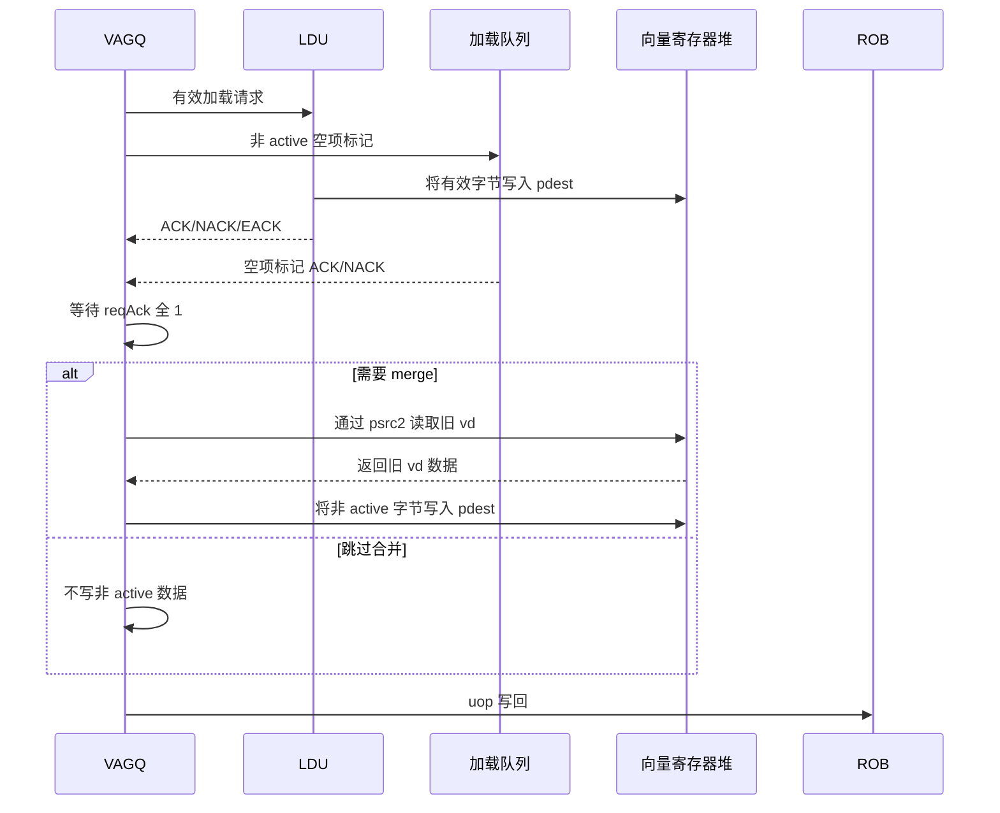

### 6.2 Store 通路

```
VAGQ (split) ──→ Arbiter ──→ StoreUnit (S0~S4) ──→ VAGQ (ACK)
                    ↑
              StdIQ (标量 store + 连续向量 store)

VAGQ ──→ Vec Regfile (读 vs3 store 数据) ──→ 拆分后随 req 发送至 StoreUnit
```

- **仲裁**：VAGQ store req 与 StdIQ 的标量 store 在 StoreUnit S0 前按 robIdx 仲裁
- **Store 数据来源**：VAGQ 在拆分阶段从 Vec Regfile 读取 vs3（待存储数据），按元素拆分后随每个 req 发送。segment 时 Gather 模块提前完成 zip，VAGQ 按统一方式处理
- **ACK/NACK**：StoreUnit 完成 req 后返回 `{entryIdx, byteOffset, isNACK}`
  - ACK：VAGQ 置 `reqAck[byteOffset +: elemBytes] = 1`
  - NACK：VAGQ 清 `reqSent[byteOffset +: elemBytes] = 0`，触发重发
- **Store 无 Merge**：全部 req 完成 → 标记 uop 完成 → 写回 ROB
- StoreQueue 交互见 §6.3


**Store 路径**

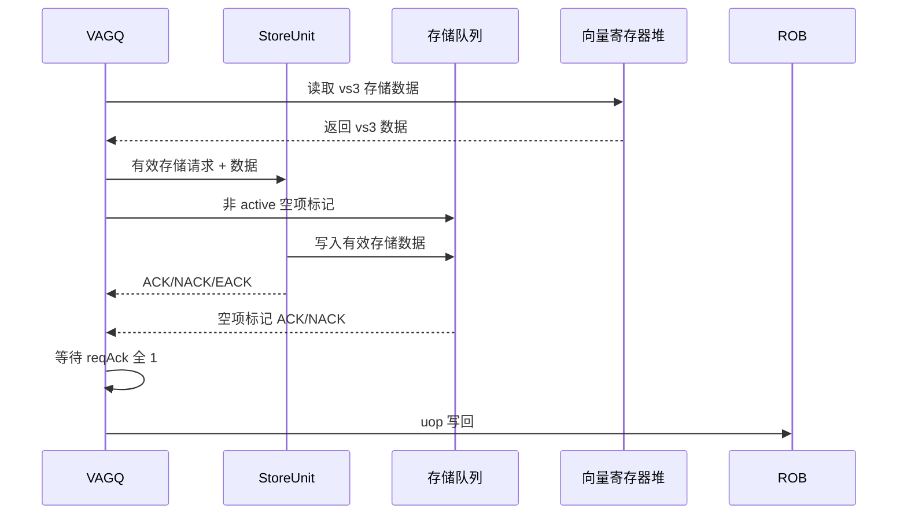

### 6.3 LSQ 交互

VAGQ 与 LSQ（LoadQueue 和 StoreQueue）有两类交互：dispatch 时表项预留、拆分时非 active 元素空项标记。

#### 6.3.1 请求与响应接口

##### VAGQ -> LSU active req

active req 是会进入 LDU/STA 的真实访存请求。它必须携带完整微指令上下文，不能只带地址和 `robIdx`，因为 LDU/STA、LSQ、异常、trigger/debug、VRF 写回都需要复用原 uop 元信息。

| 信号 | 方向 | 描述 |
|---|---|---|
| `valid` / `ready` | VAGQ -> LSU | Decoupled 握手 |
| `uop` | VAGQ -> LSU | 原始或改写后的微指令元信息，至少包含 `robIdx`、LSQ 指针、异常/trigger/debug 字段、`pdest` |
| `uopType` | VAGQ -> LSU | load/store 与 stride/indexed/ordered 类型 |
| `entryIdx` | VAGQ -> LSU | VAGQ 表项索引，响应返回时直接定位 entry |
| `robIdx` | VAGQ -> LSU | 用于 age 仲裁、redirect 过滤、响应匹配 |
| `lsqIdx` / `lsqToken` | VAGQ -> LSU | dispatch 预留的 LQ/SQ 表项标识；active req 用它更新对应 LSQ 表项 |
| `byteOffset` | VAGQ -> LSU | 本 uop 内 byte lane 起点，范围 0~15 |
| `elemIdx` | VAGQ -> LSU | 本 uop 内元素序号，等于 `byteOffset >> deew` |
| `vaddr` | VAGQ -> LSU | 完整虚拟地址 |
| `byteMask` | VAGQ -> LSU | 本元素覆盖的 byte mask，通常为 `((1 << elemBytes) - 1) << byteOffset`；active req 必须满足 `byteMask & elemActiveMask != 0` |
| `deew` | VAGQ -> LSU | 数据元素宽度编码，LSU 用于 mask、异常元素和数据选择 |
| `pdest` | VAGQ -> LDU | Load 目的物理向量寄存器，LDU 用于 active 数据写回 |
| `storeData` | VAGQ -> STA | Store 元素数据，由 `storeData` 按 `byteOffset`/`deew` 选出 |
| `nf` | VAGQ -> LSU | Segment 元信息，VAGQ 透传 |

##### VAGQ -> LSQ empty req

empty req 不进入数据 cache 访问，只消费 dispatch 预留的 LQ/SQ 表项，用于 prestart、masked-off、tail 等非 active byte。

| 信号 | 方向 | 描述 |
|---|---|---|
| `valid` / `ready` | VAGQ -> LSQ | Decoupled 握手 |
| `isLoad` / `isStore` | VAGQ -> LSQ | 选择 LoadQueue 或 StoreQueue |
| `entryIdx` | VAGQ -> LSQ | 响应返回时定位 entry |
| `robIdx` | VAGQ -> LSQ | redirect 过滤与响应匹配 |
| `lsqIdx` / `lsqToken` | VAGQ -> LSQ | 被消费的预留 LQ/SQ 表项 |
| `byteOffset` | VAGQ -> LSQ | 对应非 active 元素的 byte lane 起点 |
| `byteMask` | VAGQ -> LSQ | 本次消费的 byte mask |
| `deew` | VAGQ -> LSQ | 数据元素宽度编码 |

##### LSU/LSQ -> VAGQ resp

| 信号 | 方向 | 描述 |
|---|---|---|
| `valid` | LSU/LSQ -> VAGQ | 响应有效 |
| `entryIdx` | LSU/LSQ -> VAGQ | 定位 VAGQ entry |
| `robIdx` | LSU/LSQ -> VAGQ | 必须和 entry 内 `robIdx` 匹配，否则忽略响应 |
| `byteOffset` | LSU/LSQ -> VAGQ | 更新 `reqSent` / `reqAck` 的 byte lane 起点 |
| `deew` | LSU/LSQ -> VAGQ | 计算 `elemBytes` |
| `isNACK` | LSU/LSQ -> VAGQ | replay，清 `reqSent[byteOffset +: elemBytes]` |
| `isEACK` | LSU/LSQ -> VAGQ | 异常，记录异常元信息并进入 `s_excp` |
| `exceptionNumber` | LSU/LSQ -> VAGQ | 异常编号 |
| `faultElemIdx` | LSU/LSQ -> VAGQ | 本 uop 内故障元素序号 |
| `faultVstart` | LSU/LSQ -> VAGQ | 架构 vstart 写回值 |
| `data` | LDU -> VRF/VAGQ | active load 数据；本方案中 LDU 直接写 VRF，VAGQ 只需要 ACK 和异常信息 |

#### 6.3.2 LoadQueue

- **表项预留**：每条 vlse/vluxei/vloxei uop 在 dispatch 阶段需预留 `VLENB / elemBytes` 个 LoadQueue 表项。预留失败则 stall dispatch
- **空项标记**：非 active 字节由 SplitCtrl 选中发送至 LoadQueue，LoadQueue 消费对应预留表项后不发起真实访存
- **ACK 标记**：LDU 完成 active 元素的真实访存后，LoadQueue 对应表项标记完成；VAGQ 收到 ACK 后置 `reqAck` 对应位
- **反压**：若 LoadQueue 空闲项不足，stall dispatch

#### 6.3.3 StoreQueue

- **表项预留**：每条 vsse/vsuxei/vsoxei uop 在 dispatch 阶段需预留 `VLENB / elemBytes` 个 StoreQueue 表项。预留失败则 stall dispatch
- **空项标记**：非 active 字节由 SplitCtrl 选中发送至 StoreQueue，StoreQueue 消费对应预留表项后不发起真实访存
- **ACK 标记**：STA 完成 active 元素的真实访存后，StoreQueue 对应表项标记完成；VAGQ 收到 ACK 后置 `reqAck` 对应位
- **反压**：若 StoreQueue 空闲项不足，stall dispatch

### 6.4 非对齐与跨页 — VAGQ 不处理

- **非对齐**：由 LoadUnit/StoreUnit 检测并路由到 LoadMisalignBuffer/StoreMisalignBuffer 处理，对 VAGQ 透明
- **跨 4K 页 Store**：由 StoreUnit (STA) + StoreQueue 负责，VAGQ 只按虚拟地址拆分并发送 req
- VAGQ 生成的每个 req 携带完整的虚拟地址和 byte mask，LSU 自行判断是否触发非对齐/跨页

### 6.5 流控 (Flow Control)

- VAGQ 表项数 `VAGQSize` 可配置（建议 4 或 8）
- 表项满 → 反压 StaIQ/StdIQ/VStdIQ
- LSQ 反压见 §6.3
- 下游 LDU/STA busy → SplitCtrl 暂停发射新 req
- **Credit 机制**：限制每种 LSU pipeline 中同时在飞的 VAGQ req 总数，防止饥饿标量访存

### 6.6 ROB 指令级提交

- 一条向量访存指令（如 `vlse.v`）被拆分为 `LMUL` 条 uop
- ROB 记录该指令需要 `LMUL` 次 uop 写回后才可提交
- VAGQ 每条 uop 在 `s_wb` 状态向 ROB 发送写回信号
- ROB 收齐全部 `LMUL` 个写回信号后标记指令完成，允许 commit

---

## 7. 异常与重定向

### 7.1 异常处理

VAGQ 负责**单条微指令内的异常汇集**：收到 LSU 返回的异常 req 后，记录 `exceptionNumber`、`faultElemIdx` 和 `faultVstart`，停止拆分新 req，等待已发射 req 完成。

多条微指令间选出最早异常由 **ExceptionGen** 处理，VAGQ 不参与。

| 异常类型 | 处理方式 |
|---|---|
| Page Fault (Load) | LDU 返回异常 req，VAGQ 记录后停止拆分，写回时设置 CSR `vstart = faultVstart`，写回异常信息 |
| Page Fault (Store) | StoreUnit 返回异常，同理处理 |
| Access Fault | 同上 |
| Address Misalign | VAGQ **不处理**，由 LSU MisalignBuffer 处理（RVV 支持非对齐） |
| TLB Miss / Replay | LSU 返回 NACK，VAGQ 清 `reqSent` 触发重发 |

**异常流程**

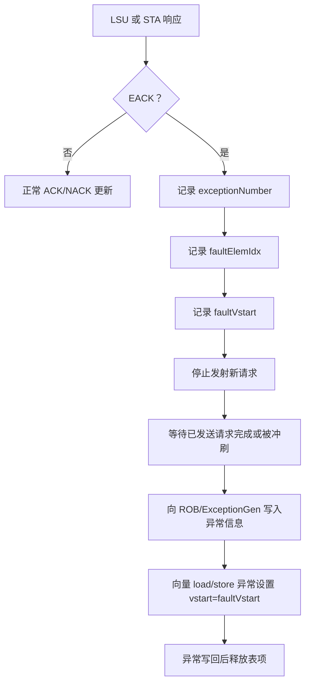

### 7.2 重定向 (Redirect)

- 重定向信号 (branch mispredict / flush) 到达时：
  - 冲刷所有 `robIdx >= redirectRobIdx` 的表项 → `valid=0`
  - 已发射到 LSU 的 req 由 LSU 侧通过 robIdx 匹配冲刷
- **部分冲刷**：若冲刷只影响部分 uop（同一指令的某些 uop 未被冲刷），VAGQ 只清除对应表项

**Redirect 流程**

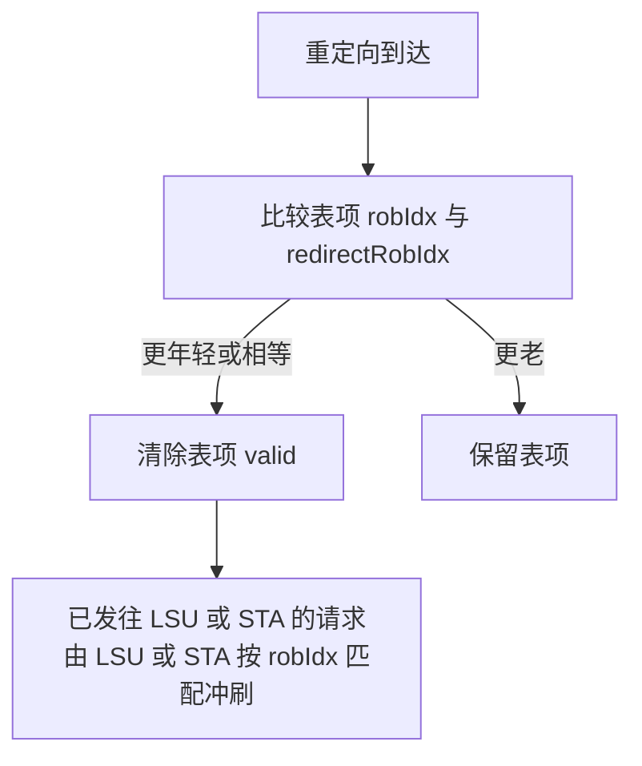

### 7.3 Fault-Only-First (FOF)

- FOF 仅存在于 unit-stride load (`vleff.v`)，**不进 VAGQ**，走标量 LduIQ→LDU 通路

---

## 8. ROB 与 commit

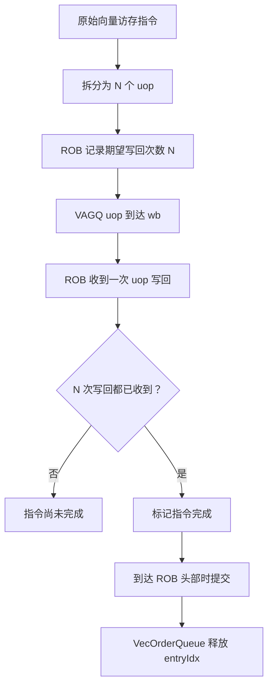

---

## 9. 设计决策记录

| # | 问题 | 决策 | 理由 |
|---|---|---|---|
| 1 | uop 拆分与 IQ 路由 | vlse/vsse 拆分为 vlsa+vlss 两条 uop，分别进入 StaIQ/StdIQ；vlxi/vsxi 拆分为 vlxa+vlxi/vsxa+vsxi，分别进入 StaIQ/VStdIQ | 地址侧与数据侧操作数依赖不同，拆分后各自追踪依赖，自然解耦 |
| 2 | VAGQ 表项分配 | VecOrderQueue 在 dispatch 时预分配 `entryIdx`，uop 携带索引直接写入 VAGQ 表项 | 表项定位从 CAM 匹配变为直接索引 |
| 3 | 表项数与 req 追踪 | `VAGQSize` 可配置；双 bitmap (`reqSent` + `reqAck`) 编码三态 (IDLE/SENT/DONE)，支持重发 | 双 16b bitmap 精确追踪每个字节的 req 状态；NACK 时清 `reqSent` 触发重发 |
| 4 | 连续访存指令 | **不进 VAGQ**，走标量发射队列和通路 | unit-stride/whole-register/mask 等连续访存只需 rs1，LduIQ→LDU / StaIQ→STA 无需中间拆分 |
| 5 | Segment | segment 与非 segment 在 VAGQ 中处理完全相同，zip/unzip 由 Gather 模块负责 | 内存连续，VAGQ 按元素拆分即可 |
| 6 | 非对齐 / 跨页 | **VAGQ 不处理** | 由 StoreQueue + StoreUnit (STA) 负责，VAGQ 只按虚拟地址拆分 |
| 7 | 数据写回策略 | LDU 直接写 active 数据到 VRF（按 pdest + byte mask），VAGQ 在 merge 阶段处理非 active 数据（prestart/inactive/tail）的 VRF 写入 | 两条写入路径互补（不同 byte lane），避免 VAGQ 缓冲全部 load 数据；LDU 逐元素写回减少延迟 |
| 8 | Mask 计算 | 拆分时一次性生成字节掩码 `elemActiveMask` | 避免重复计算，保证一致性 |
| 9 | LoadQueue 预留 | dispatch 时预留 `VLENB / elemBytes` 个 LoadQueue 表项 | 保证向量 load uop 的全部元素 req 都有 LQ 表项可用，避免拆分中途阻塞 |
| 10 | 非 active 元素 LSQ 交互 | 非 active 元素发 LSQ 空项标记请求 | 保证预留的 LSQ 表项全部被消费，防止表项泄漏 |

---

## 10. 与旧架构的对比

| 维度 | 旧 VLSU | VAGQ |
|---|---|---|
| 处理范围 | 全部向量访存经 VLSplit/VSSplit | 连续访存走标量通路；非连续 (stride + indexed + segment) 走 VAGQ |
| Load/Store 统一 | ✗ VLSplit / VSSplit 两套 | ✓ 统一表项 + 拆分合并逻辑 |
| Segment | ✗ VSegmentUnit 独立模块 | ✓ VAGQ 透明处理，Gather 负责 zip/unzip |
| 拆分并行度 | 1 (单条目 Buffer) | `VAGQSize` (可配置，建议 4~8) |
| Req 追踪 | 计数器 (flowDone) | 双 bitmap: reqSent + reqAck (至多 16 req，支持重发) |
| 合并时机 | 独立 MergeBuffer (16项) | 同表项内完成 |
| 反压粒度 | MergeBuffer threshold=6 | 表项级 + 下游流水线反压 |
| 配对 | StaIQ/StdIQ (仅 stride) | VecOrderQueue 预分配 entryIdx，直接索引 |
| 非对齐 | MisalignBuffer 往返 | **不处理**，由 LSU 自行处理 |

---

## 11. 实施计划

- [x] 完成 VAGQ 设计文档 (plan.md)
- [x] 确定全部关键设计决策 (§9)
- [x] 细化子模块接口定义 (AddrGen, MaskGen, SplitCtrl, MergeCtrl)
- [x] VAGQ 核心 Chisel 框架已落地 `src/main/scala/xiangshan/backend/vector/vagq/`
- [x] 已添加 VAGQ-IO 文档
- [x] 已添加独立生成入口 `xiangshan.backend.vector.vagq.VAGQMain`
- [x] store data 通路接入
- [ ] VAGQ 到 MemBlock/LSQ/STA/VRF/ROB 的下游接入
- [ ] 后端 issue/dispatch 到 VAGQ 的上游接入
- [ ] segment 访存完整语义验证
- [ ] 仿真验证

---

## 12. 参考资料

- RISC-V V Extension Spec v1.0
- [VAGQ 拓扑图](/nfs/home/youzhaoyang/test/XiangShan-Design-Doc-Internal/docs/zh/vector/VAGQ.d2) / [VAGQ 原始草稿](/nfs/home/youzhaoyang/test/XiangShan-Design-Doc-Internal/docs/zh/vector/VAGQ.md)
- [VLSplit 设计文档](/nfs/home/youzhaoyang/test/XiangShan-Design-Doc-Internal/docs/docs/zh/memblock/LSU/VLSU/VLSplit.md)
- [VSSplit 设计文档](/nfs/home/youzhaoyang/test/XiangShan-Design-Doc-Internal/docs/docs/zh/memblock/LSU/VLSU/VSSplit.md)
- [VLMergeBuffer 设计文档](/nfs/home/youzhaoyang/test/XiangShan-Design-Doc-Internal/docs/docs/zh/memblock/LSU/VLSU/VLMergeBuffer.md)
- [VSMergeBuffer 设计文档](/nfs/home/youzhaoyang/test/XiangShan-Design-Doc-Internal/docs/docs/zh/memblock/LSU/VLSU/VSMergeBuffer.md)
- [VSegmentUnit 设计文档](/nfs/home/youzhaoyang/test/XiangShan-Design-Doc-Internal/docs/docs/zh/memblock/LSU/VLSU/VSegmentUnit.md)
- [LoadUnit 设计文档](/nfs/home/youzhaoyang/test/XiangShan-Design-Doc-Internal/docs/docs/zh/memblock/LSU/LoadUnit.md)
- [StoreUnit 设计文档](/nfs/home/youzhaoyang/test/XiangShan-Design-Doc-Internal/docs/docs/zh/memblock/LSU/StoreUnit.md)
- [VAGQ IO文档](vagq-io.md)
