# VAGQ Technical Plan

来源需求：`docs/requirements/vagq-requirements.md`

## 1. 目标与边界

VAGQ 是向量非连续访存的拆分、追踪、合并模块，覆盖 constant-stride、indexed unordered、indexed ordered 以及 segment 变体。连续访存、mask/whole-register/FOF 不进入 VAGQ，继续走既有 LduIQ/StaIQ 路径。

对应需求：REQ-001 至 REQ-013。

### 设计原则

- 表项定位使用 `entryIdx` 直接索引，不做 CAM 匹配。
- 地址侧和数据侧微指令分开发射、分开等待操作数，进入同一个 VAGQ entry 后合流。
- 每个 entry 用 `reqSent + reqAck` 双 bitmap 管理最多 16 个字节级 req。
- Active 数据由 LSU/STA 真实访存处理；非 active 元素只消费 LSQ 预留表项，load 再由 VAGQ merge 旧 `vd`。
- Segment 对 VAGQ 透明，VAGQ 不按 `nf` 展开。

## 2. 总体架构

对应需求：REQ-014 至 REQ-019、REQ-263 至 REQ-284。

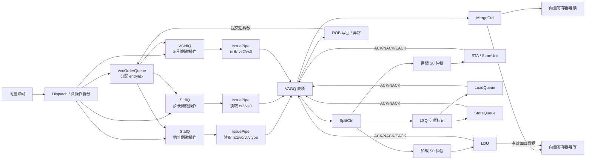

## 3. 指令准入与拆分方案

对应需求：REQ-020 至 REQ-050。

### 指令分类

| 指令类型 | 地址侧 uop | 数据侧 uop | 数据侧队列 | VAGQ entry |
|---|---|---|---|---|
| `vlse.v` / `vlseg*.v` | `vlsa` | `vlss` | StdIQ | 需要 |
| `vsse.v` / `vsseg*.v` | `vssa` | `vsss` | StdIQ | 需要 |
| `vluxei.v` / `vloxei.v` | `vlxa` | `vlxi` | VStdIQ | 需要 |
| `vsuxei.v` / `vsoxei.v` | `vsxa` | `vsxi` | VStdIQ | 需要 |

### 准入流程

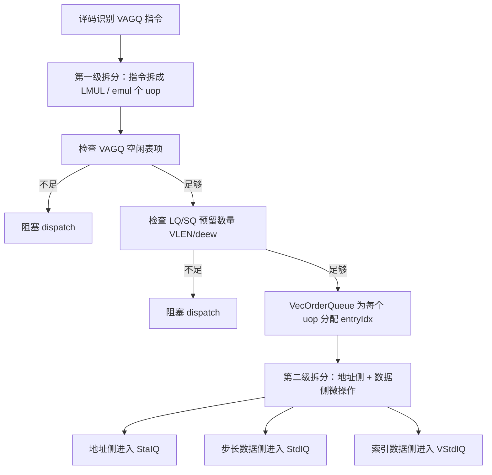

### 关键约束

- 每条原始向量访存指令拆成若干 VAGQ uop，每个 uop 分配一个 entry。
- 同一个 VAGQ uop 派生出的地址侧和数据侧微指令必须携带相同 `entryIdx`。
- VecOrderQueue 负责 entry 生命周期的顺序化分配和 ROB commit 后回收。
- LSQ 预留在 dispatch 完成，避免 SplitCtrl 中途因为 LSQ 表项不足而死锁或泄漏。

## 4. VAGQ entry 组织

对应需求：REQ-051 至 REQ-086。

### 字段分组

| 分组 | 字段 | 用途 |
|---|---|---|
| 标识 | `valid`, `uopType`, `robIdx`, `state` | entry 有效性、类型、年龄、状态 |
| 寄存器 | `pdest`, `psrc2` | load 目的寄存器、旧 `vd` / store `vs3` |
| 地址 | `baseAddr`, `op2Data` | rs1 base、stride 或 index 向量 |
| 元素配置 | `ieew`, `deew`, `uvlByte`, `useVstart`, `vma`, `vta`, `uopIdx`, `elemActiveMask` | 地址、mask、merge 控制 |
| Segment | `nf` | 只存储和透传 |
| 请求追踪 | `reqSent`, `reqAck` | 字节级 req 三态 |
| 异常 | `exceptionNumber`, `faultElemIdx` | 单 uop 内异常汇集 |

### 写入策略

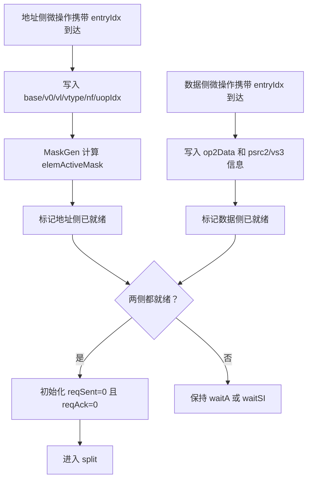

### 命名约束

- `op2Data` 统一承载 stride 和 index，不引入 `stride` 专用字段。
- `ieew` 只表示 index element width。
- `deew` 只表示 data element width，不与 CSR `sew` 混用。
- `v0` 和 `vm` 不存表项，只在 MaskGen 使用。

## 5. 表项状态机方案

对应需求：REQ-087 至 REQ-114。

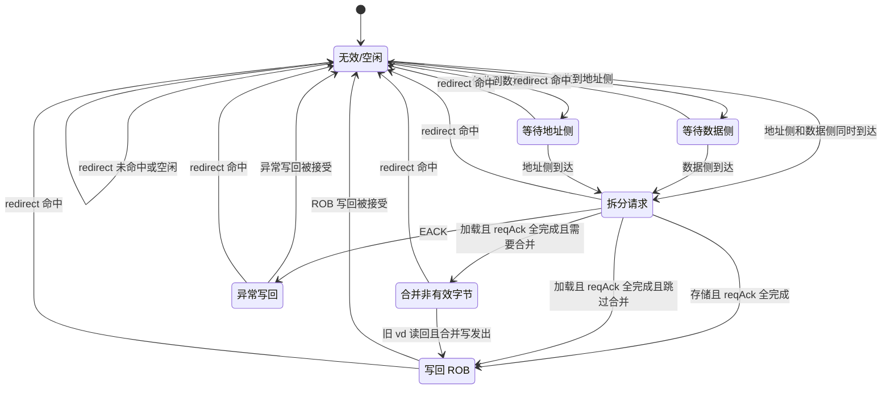

### 状态含义

| 状态 | 含义 |
|---|---|
| `invalid` | `valid=0`，entry 空闲 |
| `waitA` | 已收到数据侧，等待地址侧 |
| `waitSI` | 已收到地址侧，等待 stride/index 数据侧 |
| `split` | 两侧已收齐，正在拆分 active req 和 LSQ empty marker |
| `merge` | load 全部 req done，处理非 active 字节 |
| `wb` | 向 ROB 写回完成 |
| `excp` | 异常路径，等待异常写回 |

### 说明

需求文档中 `s_waitA` / `s_waitSI` 的命名存在两种描述角度。技术方案采用状态名表达“正在等待什么”：

- `waitA` 表示等待地址侧。
- `waitSI` 表示等待 stride/index 数据侧。

实现或后续文档应保持这一语义一致，避免“收到地址侧后进入 waitA”这种反向命名造成波形误读。

## 6. 字节级 req 状态与 SplitCtrl

对应需求：REQ-115 至 REQ-139。

### 三态编码

| 状态 | `reqSent` | `reqAck` | 语义 |
|---|---|---|---|
| IDLE | 0 | 0 | 尚未发送 |
| SENT | 1 | 0 | 已发送，等待 ACK/NACK |
| DONE | X | 1 | 已完成 |

### 状态流

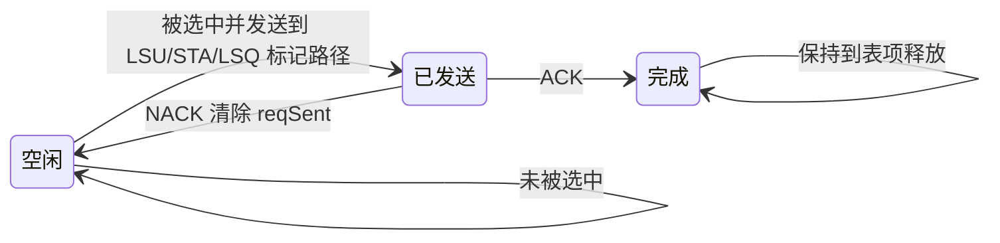

### SplitCtrl 仲裁优先级

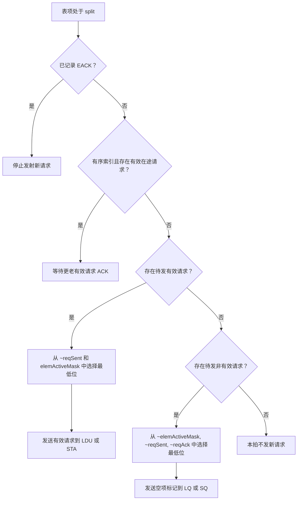

### ACK/NACK 更新

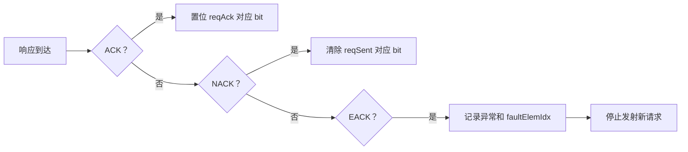

### 关键约束

- Active req 和 LSQ empty marker 共用同一套 `reqSent/reqAck` 状态。
- NACK 只回退对应字节，不影响其它 in-flight 字节。
- `reqAck == 16'hFFFF` 是 uop 完成的统一判定。
- Ordered indexed 只允许一个 active req outstanding，从而保证元素顺序。

## 7. MaskGen 方案

对应需求：REQ-145 至 REQ-174。

### 输入与输出

| 输入 | 来源 | 生命周期 |
|---|---|---|
| `vm` | 地址侧 uop | 只用于 MaskGen |
| `v0` | 地址侧 uop 读 V0 RF | 锁存一拍后释放 |
| `vl` | 地址侧 uop / VL RF | 只用于 MaskGen |
| `vstart` | CSR，受 `useVstart` 控制 | 只用于 MaskGen |
| `deew` | vtype / decode | 存 entry |
| `uopIdx` | uop 元数据 | 存 entry |

输出：`elemActiveMask[15:0]`，每 bit 对应一个 byte lane。

### 流程图

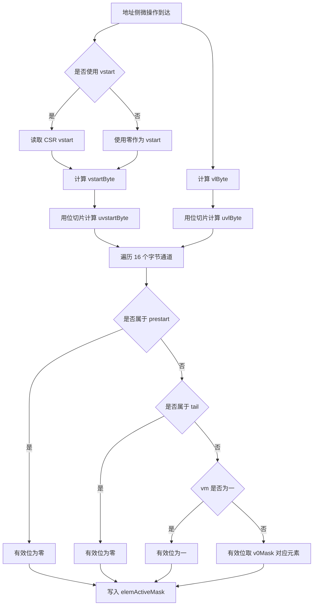

### 时序建议

- MaskGen 放在地址侧 uop 写 VAGQ entry 的同拍或下一拍组合计算。
- `v0` 不进入长期表项，只需保证 MaskGen 计算前已经读到并稳定。
- `uvlByte` / `uvstartByte` 使用移位和切片，不引入除法器。

## 8. AddrGen 方案

对应需求：REQ-175 至 REQ-190。

### Constant-stride

建议采用“预计算 base”方案作为默认实现方向：

- 地址侧写入 entry 时生成 uop 内 base：`x[rs1] + x[rs2] * uopIdx * elemNum`。
- Split 阶段只计算 `op2Data * elemIdx + baseAddr`。
- 好处是 SplitCtrl 周期内乘法器位宽较小，利于发射侧时序。

保留“原始 base”方案作为功能等价备选：

- entry 存 `x[rs1]`。
- Split 阶段计算 `op2Data * (uopIdx * elemNum + elemIdx) + baseAddr`。
- 逻辑更直接，但 Split 阶段乘法器更大。

### Indexed

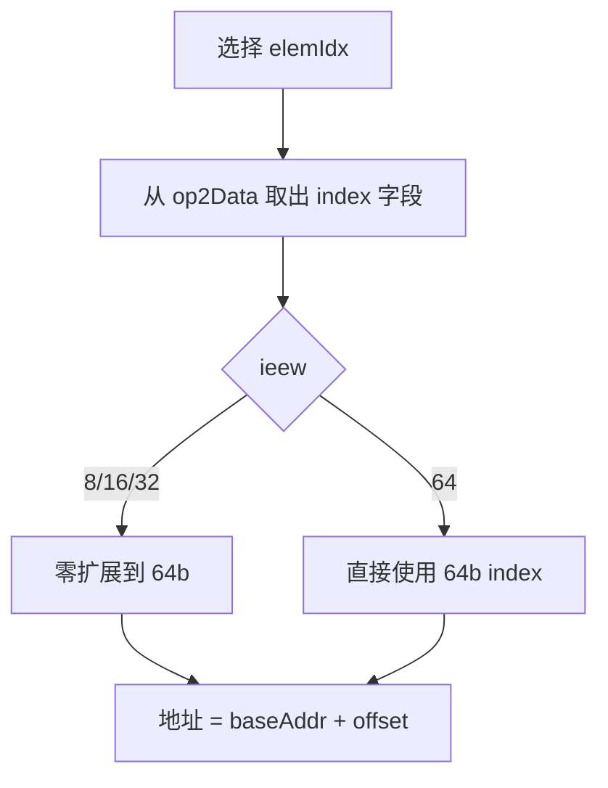

### 统一约束

- 地址输出必须是完整虚拟地址。
- Req 必须携带 byte mask。
- 非对齐和跨页不在 VAGQ 内展开处理。

## 9. Load/Store 数据路径

对应需求：REQ-199 至 REQ-237。

### Load 路径

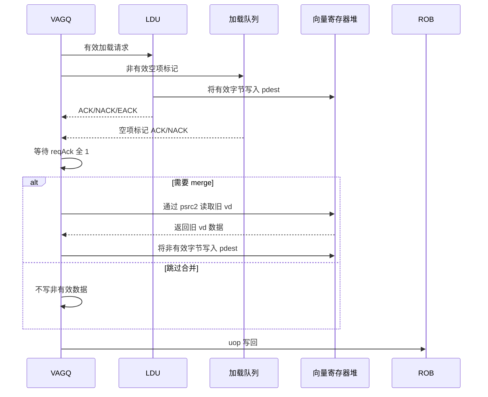

### Store 路径

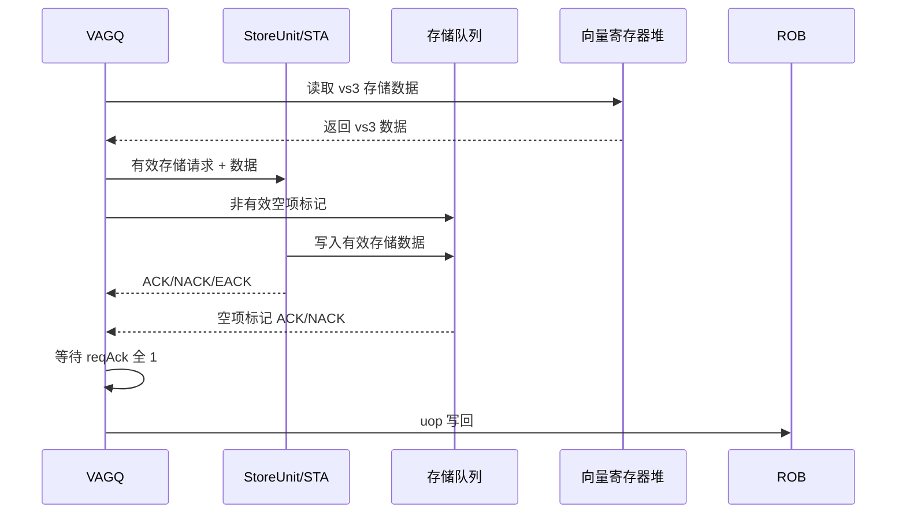

### Merge skip 条件

Load 可跳过合并 的条件：

- `vma=0`
- `vta=0`
- 当前 uop 无 prestart 字节

该条件成立时，非 active 数据无需由 VAGQ 写回；否则必须读取旧 `vd` 并对非 active byte lane 写回。

## 10. Segment 处理方案

对应需求：REQ-191 至 REQ-198。

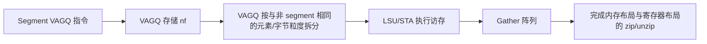

VAGQ 对 segment 不增加控制维度：

- 不按 `nf` 扩展请求循环。
- 不维护 segment 子状态。
- `nf` 只作为下游 Gather 的元数据。

## 11. 异常、NACK、redirect 方案

对应需求：REQ-238 至 REQ-256。

### 异常流程

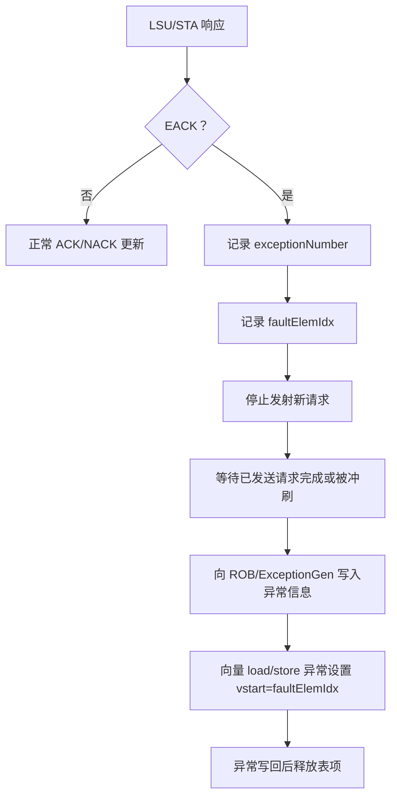

### Redirect 流程

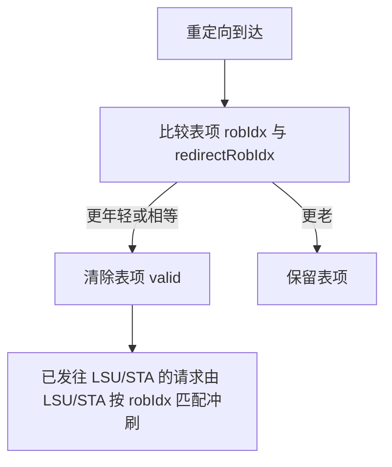

### 非对齐与跨页

- VAGQ 不处理非对齐拆分。
- VAGQ 不处理跨 4KB 页拆分。
- MisalignBuffer、StoreUnit、StoreQueue、LDU/LSQ 负责这些情况。

## 12. ROB 与 commit

对应需求：REQ-257 至 REQ-262。

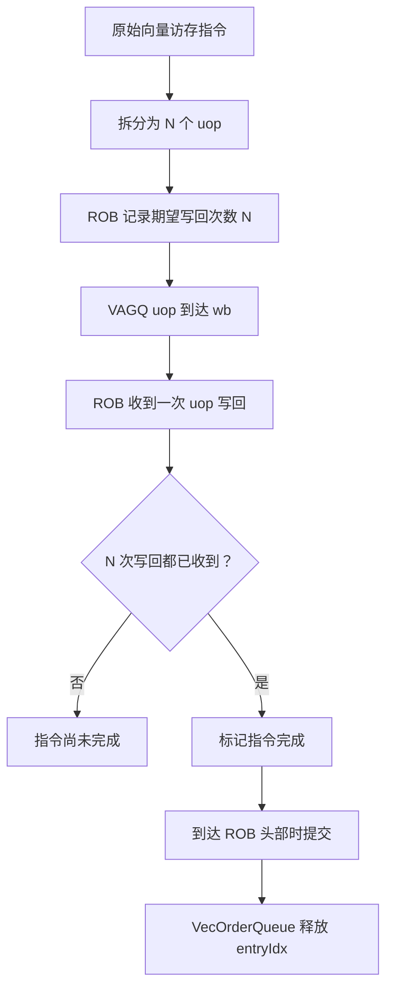

## 13. 集成阶段建议

### 阶段 1：Decode/Dispatch/VOQ 准入

覆盖 REQ-020 至 REQ-050、REQ-227 至 REQ-230。

- 识别 VAGQ 指令集合。
- 完成两级 uop 拆分策略。
- VecOrderQueue 分配 `entryIdx`。
- Dispatch 检查 VAGQ entry 和 LQ/SQ 预留资源。

### 阶段 2：VAGQ entry 与配对写入

覆盖 REQ-051 至 REQ-139。

- 定义 entry 字段与状态机。
- 地址侧和数据侧按 `entryIdx` 写入同一表项。
- 双 bitmap 管理 req 三态。

### 阶段 3：MaskGen/AddrGen/SplitCtrl

覆盖 REQ-140 至 REQ-198。

- 完成 active mask 预计算。
- 完成 stride/index 地址生成。
- 实现 active req 与 inactive empty marker 发射。
- 实现 ordered indexed 保序。

### 阶段 4：MemBlock/LSQ/VRF/ROB 集成

覆盖 REQ-199 至 REQ-284。

- 接入 LDU/STA 仲裁。
- 接入 LQ/SQ empty marker。
- 接入 VRF merge read/write。
- 接入 ROB writeback、异常和 commit release。

## 14. 验证计划

### 单元级

- MaskGen：覆盖 `vm=0/1`、`vstart=0/nonzero`、`vl` 跨 uop 边界、`deew=8/16/32/64`。
- Req bitmap：覆盖 IDLE/SENT/DONE、ACK、NACK、重复 NACK、DONE 稳定。
- AddrGen：覆盖正负 stride、index `ieew=8/16/32/64`、segment 元数据透传。
- Ordered indexed：验证 outstanding active req 阻塞下一 active req。

### 集成级

- `vlse/vsse` 无异常、带 mask、带 tail、带 vstart。
- `vluxei/vsuxei` unordered 多 outstanding。
- `vloxei/vsoxei` ordered 顺序访问。
- Segment load/store，验证 VAGQ 不按 `nf` 多展开。
- LQ/SQ 空项标记消费完整性。
- LDU/STA NACK 后重发。
- Page fault/access fault 后 `faultElemIdx` 和 `vstart`。
- Redirect 命中 entry 和 outstanding req。

### 关键断言

- `reqAck` 置位后不得回退，除非 entry 被释放或 redirect flush。
- `reqSent=0 && reqAck=1` 必须仍视为 DONE。
- `reqAck == 16'hFFFF` 前不得进入正常 writeback。
- Ordered indexed active outstanding 非空时不得发射新的 active req。
- VAGQ active load 写 mask 与 merge 写 mask 不得重叠。
- 非 active 字节必须最终消费 LSQ 预留表项。

