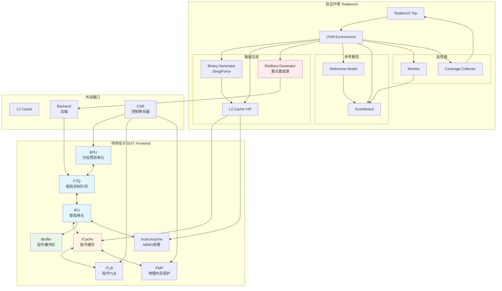

# 香山昆明湖处理器前端模块Block Test验证方案

> 迁移说明
>
> 本文件是从旧文档体系迁入的 V3 策略基线，保留模块拆解、测试场景矩阵和验证范围规划。
> 当前真实执行环境已演进为 `src/test/python/Frontend/` 下的 Python / toffee 黑盒验证环境。
> 因此：
> - 本文中的模块划分和测试场景仍可继续使用
> - 本文中的 UVM 资源/排期表述只保留为历史规划基线，不作为当前执行口径

**文档版本**: V1.0 基线迁入版  
**创建日期**: 2026-03-13  
**适用对象**: 香山昆明湖处理器前端模块  
**验证层级**: Block Test (BT)  
**当前执行方法学**: Python / toffee 黑盒验证  

---

## 一、前端功能概述

香山昆明湖处理器前端模块负责指令获取和预处理，采用解耦的前端架构设计。核心流程为：BPU进行分支预测生成取指请求，通过FTQ缓存预测信息和协调取指流程；IFU从ICache/ITLB获取指令并进行预译码、分支预测检查；最终通过IBuffer将有效指令分发到后端。前端支持多级流水线、跨页指令处理、MMIO取指、指令压缩扩展等功能，实现高性能的指令供给，与后端通过重定向信号维持正确的指令流执行路径。

---

## 二、测试场景分析

### 2.1 模块拆解与测试场景矩阵

#### 2.1.1 BPU (Branch Prediction Unit) 分支预测单元

**模块功能**：
- 实现多级分支预测，包含uBTB、aBTB、uTage、mBTB、Tage、ITTage、SC、RAS等预测器
- 管理全局历史寄存器GHR和路径历史寄存器PHR
- 生成预测块信息并传递给FTQ

**测试场景**：

| 场景编号 | 场景名称 | 场景描述 | 关键信号 |
|---------|---------|---------|---------|
| BPU-001 | 基本分支预测 | 顺序执行、无条件跳转、条件分支预测 | toFtq.pred.valid, pred.bits.taken |
| BPU-002 | 多预测器协同 | uBTB、Tage、SC等多预测器预测结果融合 | predBits.pred_source |
| BPU-003 | RAS返回地址栈 | 函数调用/返回的地址预测 | ras.io.out.target |
| BPU-004 | 历史寄存器管理 | GHR/PHR的更新和恢复 | ghr.io.update, phr.io.update |
| BPU-005 | BPU训练更新 | 后端重定向后的预测器训练 | fromFtq.commit, fromFtq.redirect |
| BPU-006 | 预测器使能控制 | CSR控制各预测器的开关 | io.ctrl.ubtbEnable等 |
| BPU-007 | 流水线冲刷 | BPU内部S1/S2/S3级的flush处理 | s1_flush, s2_flush, s3_flush |
| BPU-008 | 预测错误恢复 | 分支预测错误后的状态恢复 | redirect.valid, redirect.bits |

**接口交互**：
- 与FTQ：发送预测结果(BpuToFtqIO)、接收训练信息(FtqToBpuIO)
- 与后端：间接通过FTQ接收重定向信号
- 与CSR：接收控制信号(io.ctrl)

---

#### 2.1.2 FTQ (Fetch Target Queue) 取指目标队列

**模块功能**：
- 缓存BPU的预测信息，协调前端流水线
- 管理多个指针(bpuPtr、pfPtr、ifuPtr、ifuWbPtr、commitPtr)
- 处理IFU预测错误重定向和后端重定向
- 维护分支解析队列和提交队列

**测试场景**：

| 场景编号 | 场景名称 | 场景描述 | 关键信号 |
|---------|---------|---------|---------|
| FTQ-001 | 预测块入队 | BPU预测结果写入FTQ | io.fromBpu.enq |
| FTQ-002 | 预测块出队 | IFU从FTQ获取取指请求 | io.toIfu.req |
| FTQ-003 | 指针管理 | bpuPtr、ifuPtr、commitPtr的正确移动 | bpuPtr, ifuPtr, commitPtr |
| FTQ-004 | IFU重定向处理 | IFU预测错误导致的流水线冲刷 | io.fromIfu.wbRedirect |
| FTQ-005 | 后端重定向处理 | 后端分支解析导致的重定向 | io.fromBackend.redirect |
| FTQ-006 | 队列满/空 | FTQ满导致BPU暂停、空导致IFU暂停 | isFull, isEmpty |
| FTQ-007 | 分支提交 | 后端提交分支信息用于BPU训练 | io.fromBackend.commitInfo |
| FTQ-008 | 异常处理 | 指令缺页、访问异常的处理 | backendException |

**接口交互**：
- 与BPU：接收预测(BpuToFtqIO)、发送训练(FtqToBpuIO)
- 与IFU：发送取指请求(FtqToIfuIO)、接收写回(IfuToFtqIO)
- 与ICache：发送预取请求(FtqToICacheIO)
- 与后端：接收重定向/提交(CtrlToFtqIO)、发送性能信息(FtqToCtrlIO)

---

#### 2.1.3 IFU (Instruction Fetch Unit) 取指单元

**模块功能**：
- 从ICache/InstrUncache获取指令数据
- 进行指令边界检测(InstrBoundary)、预译码(PreDecode)
- 分支预测检查(PredChecker)、RVC指令扩展(RvcExpander)
- MMIO取指处理、Trigger检查

**测试场景**：

| 场景编号 | 场景名称 | 场景描述 | 关键信号 |
|---------|---------|---------|---------|
| IFU-001 | ICache取指 | 正常的ICache取指流程 | io.fromICache.fetchResp |
| IFU-002 | MMIO取指 | MMIO地址空间的指令获取 | io.toUncache.req |
| IFU-003 | 跨页指令处理 | 指令跨越页边界的处理 | crossPage信号 |
| IFU-004 | 预测错误检测 | 预译码发现的分支预测错误 | io.toFtq.wbRedirect |
| IFU-005 | 指令边界检测 | RVC/RVI混合指令的边界识别 | instrBoundary.io |
| IFU-006 | RVC指令扩展 | 16位压缩指令扩展为32位 | rvcExpanders |
| IFU-007 | Trigger触发 | 前端Trigger匹配触发 | frontendTrigger.io |
| IFU-008 | 异常处理 | ICache异常(缺页、访问错误)的处理 | exceptionType |

**接口交互**：
- 与FTQ：接收取指请求(FtqToIfuIO)、发送写回(IfuToFtqIO)
- 与ICache：发送请求(IfuToICacheIO)、接收响应(ICacheToIfuIO)
- 与InstrUncache：发送MMIO请求(IfuToInstrUncacheIO)
- 与IBuffer：发送指令(DecoupledIO[FetchToIBuffer])

---

#### 2.1.4 ICache (Instruction Cache) 指令缓存

**模块功能**：
- 缓存指令数据，提供低延迟的指令访问
- 支持预取、缺失处理、替换策略
- 与L2 Cache通过TileLink协议交互
- ITLB地址翻译、PMP权限检查

**测试场景**：

| 场景编号 | 场景名称 | 场景描述 | 关键信号 |
|---------|---------|---------|---------|
| ICACHE-001 | Cache命中 | ICache命中的取指流程 | io.toIfu.fetchResp.valid |
| ICACHE-002 | Cache缺失 | ICache缺失的处理流程 | missUnit.io |
| ICACHE-003 | 预取 | 指令预取机制 | prefetchPipe.io |
| ICACHE-004 | 替换 | Cache替换策略 | replacer.io |
| ICACHE-005 | TileLink交互 | 与L2 Cache的协议交互 | clientNode |
| ICACHE-006 | ITLB翻译 | 指令地址翻译 | io.itlb |
| ICACHE-007 | PMP检查 | 物理内存保护检查 | io.pmp |
| ICACHE-008 | 异常处理 | 访问异常、缺页异常 | exceptionType |
| ICACHE-009 | Fence.i | 指令缓存刷新 | io.fencei |

**接口交互**：
- 与FTQ：接收预取请求(FtqToICacheIO)
- 与IFU：发送指令数据(ICacheToIfuIO)
- 与ITLB：地址翻译请求(TlbRequestIO)
- 与PMP：权限检查请求(PmpCheckBundle)
- 与L2 Cache：TileLink协议交互(clientNode)

---

#### 2.1.5 ITLB (Instruction TLB) 指令地址翻译

**模块功能**：
- 指令虚拟地址到物理地址的翻译
- 支持多端口翻译请求
- 页表遍历(PTW)与L2 TLB交互
- TLB刷新、权限检查

**测试场景**：

| 场景编号 | 场景名称 | 场景描述 | 关键信号 |
|---------|---------|---------|---------|
| ITLB-001 | TLB命中 | 地址翻译命中 | io.requestor(0).resp.bits.hit |
| ITLB-002 | TLB缺失 | 地址翻译缺失，触发PTW | io.ptw.req |
| ITLB-003 | 多端口翻译 | 多个翻译请求的并发处理 | io.requestor |
| ITLB-004 | 权限检查 | 页面权限检查(读、执行) | io.requestor(0).resp.bits.excp |
| ITLB-005 | TLB刷新 | SFENCE.VMA指令刷新TLB | io.sfence |
| ITLB-006 | CSR控制 | SATP、PRIV等CSR的影响 | io.csr |

**接口交互**：
- 与ICache：接收翻译请求(TlbRequestIO)
- 与PTW：发送页表遍历请求(VectorTlbPtwIO)
- 与CSR：接收CSR配置(TlbCsrBundle)

---

#### 2.1.6 PMP (Physical Memory Protection) 物理内存保护

**模块功能**：
- 物理地址范围的访问权限检查
- 支持多个PMP配置
- 与CSR交互更新配置

**测试场景**：

| 场景编号 | 场景名称 | 场景描述 | 关键信号 |
|---------|---------|---------|---------|
| PMP-001 | 权限检查 | 读/写/执行权限检查 | pmpChecker.io.resp |
| PMP-002 | 多端口检查 | 多个检查请求的并发处理 | pmpRequestor |
| PMP-003 | CSR配置更新 | PMP配置CSR的更新 | pmp.io.distribute_csr |
| PMP-004 | 地址范围匹配 | PMP地址范围的匹配 | pmp.io.pmp |

**接口交互**：
- 与ICache：接收权限检查请求(PmpCheckBundle)
- 与CSR：接收PMP配置更新(distribute_csr)

---

#### 2.1.7 IBuffer (Instruction Buffer) 指令缓冲区

**模块功能**：
- 缓存从IFU接收的指令
- 提供多端口读出接口给后端解码
- 支持flush、反压、bypass等操作
- 指令分发与暂停原因跟踪

**测试场景**：

| 场景编号 | 场景名称 | 场景描述 | 关键信号 |
|---------|---------|---------|---------|
| IBUF-001 | 指令入队 | IFU指令写入IBuffer | io.in |
| IBUF-002 | 指令出队 | 后端从IBuffer读取指令 | io.out |
| IBUF-003 | 队列满/空 | IBuffer满/空的处理 | io.full, empty |
| IBUF-004 | Flush | 流水线冲刷IBuffer清空 | io.flush |
| IBUF-005 | 多端口读 | DecodeWidth端口并发读 | io.out(i) |
| IBUF-006 | 暂停跟踪 | 暂停原因跟踪(stallReason) | io.stallReason |

**接口交互**：
- 与IFU：接收指令(DecoupledIO[FetchToIBuffer])
- 与后端：发送指令(Vec[DecoupledIO[CtrlFlow]])
- 与Frontend：接收flush信号

---

### 2.2 模块间交互测试场景

#### 2.2.1 完整取指流程

| 场景编号 | 场景名称 | 涉及模块 | 场景描述 |
|---------|---------|---------|---------|
| INT-001 | 正常取指流程 | BPU→FTQ→IFU→ICache→ITLB→PMP→IBuffer | 完整的顺序取指流程 |
| INT-002 | 分支预测正确 | BPU→FTQ→IFU→IBuffer→Backend | 分支预测正确，无重定向 |
| INT-003 | 分支预测错误(IFU检测) | IFU→FTQ→BPU | IFU预译码检测到预测错误 |
| INT-004 | 分支预测错误(后端检测) | Backend→FTQ→BPU→IFU | 后端解析分支发现预测错误 |
| INT-005 | ICache缺失处理 | ICache→L2 Cache→ICache→IFU | Cache缺失到填充的完整流程 |
| INT-006 | MMIO取指流程 | IFU→InstrUncache→MMIO | MMIO地址空间的取指 |
| INT-007 | TLB缺失处理 | ICache→ITLB→PTW→ITLB | 地址翻译缺失的处理 |

#### 2.2.2 重定向场景

**重定向是验证的重点场景**，需要详细分析：

| 重定向类型 | 来源 | 触发条件 | 影响范围 | 关键信号 |
|-----------|------|---------|---------|---------|
| IFU预测错误重定向 | IFU | 预译码发现预测错误 | 冲刷IFU流水线、FTQ指针回退 | io.toFtq.wbRedirect |
| 后端分支解析重定向 | Backend | 分支执行结果与预测不符 | 冲刷整个前端流水线 | io.backend.toFtq.redirect |
| 异常重定向 | Backend | 指令异常(缺页、访问错误) | 冲刷前端，跳转到异常处理 | io.backend.toFtq.redirect.bits.interrupt |
| 中断重定向 | Backend | 外部中断 | 冲刷前端，跳转到中断处理 | io.backend.toFtq.redirect.bits.interrupt |

**重定向信号详细分析**：

```scala
// 来自后端的重定向信号
io.backend.toFtq.redirect: Valid[Redirect]
  .valid: Bool                          // 重定向有效
  .bits.ftqIdx: FtqPtr                  // 重定向的FTQ索引
  .bits.ftqOffset: UInt                 // 重定向的FTQ偏移
  .bits.cfiUpdate.isMisPred: Bool       // 是否为预测错误
  .bits.interrupt: Bool                 // 是否为中断
  .bits.hasBackendFault: Bool           // 是否有后端异常
  .bits.debugIsCtrl: Bool               // 是否为控制流重定向
  .bits.debugIsMemVio: Bool             // 是否为内存违例重定向
```

---

## 三、验证策略

### 3.1 验证架构框图



### 3.2 验证方法

#### 3.2.1 激励策略

**指令激励生成**：
1. **Binary Generator (Sting/Force)**：
   - 生成bin/elf格式的测试用例
   - 包含各种分支模式、函数调用序列
   - 覆盖不同的控制流场景

2. **L2 Cache VIP**：
   - 模拟L2 Cache的行为
   - 存储指令数据
   - 支持可配置的延迟、命中率
   - 支持TileLink协议

**重定向激励生成（重点）**：
```verilog
// 重定向激励关键要点
1. 重定向时机：
   - 与前端流水线状态同步
   - 在不同流水级触发重定向
   - 支持连续重定向、嵌套重定向

2. 重定向类型：
   - IFU预测错误重定向（预译码检测）
   - 后端分支解析重定向（执行结果检测）
   - 异常重定向（缺页、访问错误）
   - 中断重定向

3. 重定向参数：
   - ftqIdx: 随机选择已分配的FTQ条目
   - ftqOffset: 随机选择条目内的指令位置
   - isMisPred: 随机设置预测错误标志
   - 其他随机参数：确保覆盖率

4. 重定向频率：
   - 低频重定向（0-10%）：模拟正常执行
   - 中频重定向（10-50%）：测试重定向处理能力
   - 高频重定向（50-100%）：压力测试
```

**其他信号激励**：
- CSR控制信号：随机配置，确保功能覆盖
- PMP配置：随机更新，测试权限检查
- TLB配置：支持刷新、更新等操作

#### 3.2.2 参考模型设计

**参考模型架构**：
```
Reference Model
├── BPU Model
│   ├── Branch Predictor Models
│   └── History Register Models
├── FTQ Model
│   ├── Entry Queue
│   ├── Pointer Management
│   └── Redirect Handler
├── IFU Model
│   ├── Instruction Fetch Logic
│   ├── Pre-decoder
│   └── Branch Checker
├── ICache Model
│   ├── Cache Array
│   ├── Replacement Policy
│   └── Miss Handler
├── ITLB Model
│   ├── TLB Entries
│   └── Page Table Walker
├── PMP Model
│   └── Permission Checker
└── IBuffer Model
    ├── Buffer Array
    └── Read/Write Logic
```

#### 3.2.3 检查策略

**自动检查**：
1. **指令流检查**：IBuffer输出的指令序列与参考模型一致
2. **预测正确性检查**：分支预测结果与实际执行结果对比
3. **指针一致性检查**：FTQ各指针的正确移动
4. **重定向正确性检查**：重定向后的状态恢复

**断言检查**：
```systemverilog
// 示例断言
assert property (@(posedge clk) disable iff (!rst_n)
    (ftq.full |-> !bpu.req.ready))
    else $error("FTQ full but BPU still sending");

assert property (@(posedge clk) disable iff (!rst_n)
    (redirect.valid |-> ##1 (bpu.flush && ftq.flush))
    else $error("Redirect not flushed properly");
```

#### 3.2.4 覆盖率策略

**功能覆盖率**：
- 分支预测覆盖：各种分支类型、预测器组合
- 重定向覆盖：不同类型、频率、时机的重定向
- 流水线状态覆盖：满、空、各级流水状态
- 异常覆盖：各种异常类型

**代码覆盖率**：
- 行覆盖率：目标100%
- 条件覆盖率：目标100%
- 状态机覆盖率：目标100%
- 翻转覆盖率：目标95%以上

---

## 四、验证计划

### 4.1 验证阶段规划

| 阶段 | 任务 | 预期结果 | 依赖文档 | 参与人员 | 时间周期 |
|-----|------|---------|---------|---------|---------|
| **阶段1：环境搭建** | | | | | |
| 1.1 | UVM框架搭建 | 完整的UVM验证环境框架 | UVM方法学文档 | 负责人A | 2周 |
| 1.2 | DUT集成与接口连接 | DUT正确集成到验证环境 | Frontend RTL文档 | 负责人A | 1周 |
| 1.3 | L2 Cache VIP集成与配置 | VIP正确工作，支持TileLink | L2 VIP手册 | 负责人B | 1周 |
| 1.4 | 基础测试用例编写 | 能够运行简单的取指流程 | 子模块UT用例 | 负责人C | 1周 |
| **阶段2：参考模型开发** | | | | | |
| 2.1 | BPU参考模型 | 能够正确预测分支 | BPU设计文档 | 负责人D | 3周 |
| 2.2 | FTQ参考模型 | 能够正确管理预测队列 | FTQ设计文档 | 负责人A | 2周 |
| 2.3 | IFU参考模型 | 能够正确处理指令获取 | IFU设计文档 | 负责人C | 2周 |
| 2.4 | ICache/ITLB/PMP参考模型 | 能够正确模拟缓存和翻译 | 各模块设计文档 | 负责人B | 2周 |
| 2.5 | IBuffer参考模型 | 能够正确缓存和分发指令 | IBuffer设计文档 | 负责人C | 1周 |
| **阶段3：测试场景梳理** | | | | | |
| 3.1 | 测试点分解文档 | 详细的测试点列表 | 验证方案文档 | 全员参与 | 2周 |
| 3.2 | 测试场景优先级划分 | P0/P1/P2级测试场景 | 测试点文档 | 负责人A | 1周 |
| **阶段4：用例开发** | | | | | |
| 4.1 | P0级测试用例开发 | 核心功能验证通过 | 测试点文档 | 全员参与 | 4周 |
| 4.2 | P1级测试用例开发 | 重要功能验证通过 | 测试点文档 | 全员参与 | 3周 |
| 4.3 | P2级测试用例开发 | 边界条件验证通过 | 测试点文档 | 全员参与 | 2周 |
| **阶段5：功能覆盖率开发** | | | | | |
| 5.1 | 功能覆盖点定义 | 覆盖率模型定义完成 | 验证方案文档 | 负责人D | 1周 |
| 5.2 | 覆盖率收集实现 | 能够收集功能覆盖率 | 覆盖点定义文档 | 负责人D | 2周 |
| 5.3 | 覆盖率分析与改进 | 达到100%功能覆盖率 | 覆盖率报告 | 全员参与 | 持续 |
| **阶段6：仿真调试** | | | | | |
| 6.1 | 用例调试与修复 | 所有测试用例通过 | 测试报告 | 全员参与 | 4周 |
| 6.2 | 回归测试 | 建立持续回归机制 | 回归脚本 | 负责人B | 1周 |
| **阶段7：子模块整合调试** | | | | | |
| 7.1 | BPU-FTQ-IFU整合 | 三模块协同验证通过 | 整合测试文档 | 负责人A | 2周 |
| 7.2 | ICache-ITLB-PMP整合 | 缓存子系统验证通过 | 整合测试文档 | 负责人B | 2周 |
| 7.3 | 完整前端整合 | 所有子模块协同验证通过 | 整合测试文档 | 全员参与 | 2周 |
| **阶段8：环境参数化设计** | | | | | |
| 8.1 | 参数化配置设计 | 支持不同配置的验证 | 参数化需求文档 | 负责人A | 2周 |
| 8.2 | 多配置回归验证 | 所有配置验证通过 | 参数化设计文档 | 全员参与 | 2周 |
| **阶段9：持续回归与覆盖率** | | | | | |
| 9.1 | 自动化回归平台 | 建立自动化回归流程 | 回归平台文档 | 负责人B | 1周 |
| 9.2 | 覆盖率分析与报告 | 定期生成覆盖率报告 | 覆盖率报告 | 负责人D | 持续 |
| 9.3 | 问题追踪与修复 | 所有问题得到解决 | 缺陷追踪系统 | 全员参与 | 持续 |

### 4.2 里程碑与交付物

| 里程碑 | 时间点 | 交付物 | 验收标准 |
|-------|--------|--------|---------|
| M1: 环境搭建完成 | 第5周 | UVM验证环境、基础测试用例 | 能够运行简单取指流程 |
| M2: 参考模型完成 | 第15周 | 完整的参考模型 | 能够与DUT对比检查 |
| M3: P0用例完成 | 第23周 | P0级测试用例、测试报告 | P0级功能验证通过 |
| M4: 覆盖率达标 | 第30周 | 覆盖率报告 | 功能覆盖率100%、代码覆盖率>95% |
| M5: 验证完成 | 第35周 | 验证报告、回归测试报告 | 所有测试用例通过、覆盖率达标 |

---

## 五、验证人员安排

### 5.1 人员需求

| 角色 | 人数 | 主要职责 | 技能要求 | 工作量占比 |
|-----|------|---------|---------|-----------|
| 验证负责人 | 1 | 项目管理、架构设计、技术决策 | UVM专家、前端架构理解 | 100% |
| 高级验证工程师 | 2 | 参考模型开发、复杂场景验证 | UVM熟练、系统级验证经验 | 100% |
| 中级验证工程师 | 2 | 用例开发、调试、覆盖率分析 | UVM基础、调试能力 | 100% |
| 协调支持 | 1 | 环境维护、工具支持、资源协调 | 工具熟练、沟通能力 | 50% |

**总人力**: 6人（全职5人，兼职1人）

### 5.2 时间估算

| 阶段 | 时间周期 | 累计时间 | 备注 |
|-----|---------|---------|------|
| 环境搭建 | 5周 | 5周 | 包括VIP集成 |
| 参考模型开发 | 10周 | 15周 | 并行开发，需协调 |
| 测试场景梳理 | 3周 | 18周 | 与参考模型并行 |
| 用例开发 | 9周 | 27周 | 分优先级开发 |
| 覆盖率开发 | 3周 | 30周 | 与用例开发并行 |
| 仿真调试 | 4周 | 34周 | 问题修复时间 |
| 整合调试 | 6周 | 40周 | 子模块整合 |
| 参数化设计 | 4周 | 44周 | 多配置支持 |
| 回归与报告 | 持续 | - | 直至覆盖率达标 |

**总验证周期**: 约11个月（44周）

### 5.3 人员分工

#### 验证负责人（负责人A）
- 验证环境架构设计
- FTQ参考模型开发
- 测试点分解与优先级划分
- BPU-FTQ-IFU整合调试
- 参数化配置设计
- 技术决策与问题解决

#### 高级验证工程师1（负责人B）
- L2 Cache VIP集成与配置
- ICache/ITLB/PMP参考模型开发
- 回归测试平台搭建
- ICache-ITLB-PMP整合调试
- 自动化回归流程建立

#### 高级验证工程师2（负责人D）
- BPU参考模型开发
- 功能覆盖点定义与实现
- 覆盖率分析与改进
- 覆盖率报告生成

#### 中级验证工程师1（负责人C）
- 基础测试用例编写
- IFU参考模型开发
- IBuffer参考模型开发
- P0/P1/P2级测试用例开发

#### 中级验证工程师2（负责人E）
- 测试用例开发
- 仿真调试与问题修复
- 代码覆盖率分析

#### 协调支持（负责人F，兼职）
- 验证环境维护
- 工具支持（EDA工具、服务器资源）
- 跨部门协调（与RTL团队、后端团队）

### 5.4 协作机制

1. **周例会**：每周一次，同步进度、讨论问题
2. **技术评审**：关键节点进行技术评审（参考模型、测试点、覆盖率）
3. **文档管理**：统一文档管理平台，版本控制
4. **问题追踪**：使用缺陷追踪系统，记录和跟踪所有问题
5. **代码评审**：所有代码变更需经过代码评审

---

## 六、风险管理

### 6.1 风险识别

| 风险项 | 风险等级 | 影响 | 概率 | 缓解措施 |
|-------|---------|------|------|---------|
| 参考模型复杂度高 | 高 | 延长开发周期 | 中 | 分阶段开发，优先完成核心功能 |
| BPU预测逻辑复杂 | 高 | 验证难度大 | 高 | 与RTL团队密切合作，详细文档 |
| 重定向场景复杂 | 高 | 状态空间大 | 高 | 重点设计重定向激励，充分测试 |
| 子模块UT各自为战 | 中 | 整合问题多 | 高 | 统一接口规范，提前整合测试 |
| L2 VIP功能限制 | 中 | 激励能力受限 | 中 | 提前评估VIP能力，准备备选方案 |
| 人力不足 | 中 | 进度延迟 | 中 | 合理分工，提前培训 |

### 6.2 应对策略

1. **技术风险应对**：
   - 提前进行技术预研
   - 与RTL团队建立定期沟通机制
   - 准备技术备选方案

2. **进度风险应对**：
   - 建立缓冲时间
   - 优先完成P0级功能验证
   - 并行开展不依赖的任务

3. **质量风险应对**：
   - 建立严格的代码评审机制
   - 定期进行覆盖率分析
   - 引入第三方验证（如形式验证）

---

## 七、附录

### 7.1 参考文档

1. 香山昆明湖处理器设计文档
2. Frontend模块设计规格文档
3. 子模块设计文档（BPU/FTQ/IFU/ICache/ITLB/PMP/IBuffer）
4. UVM验证方法学文档
5. TileLink协议规范
6. L2 Cache VIP使用手册
7. 子模块UT测试点文档

### 7.2 术语表

| 术语 | 英文全称 | 中文含义 |
|-----|---------|---------|
| BPU | Branch Prediction Unit | 分支预测单元 |
| FTQ | Fetch Target Queue | 取指目标队列 |
| IFU | Instruction Fetch Unit | 取指单元 |
| ICache | Instruction Cache | 指令缓存 |
| ITLB | Instruction TLB | 指令地址翻译缓冲 |
| PMP | Physical Memory Protection | 物理内存保护 |
| IBuffer | Instruction Buffer | 指令缓冲区 |
| BTB | Branch Target Buffer | 分支目标缓冲 |
| RAS | Return Address Stack | 返回地址栈 |
| GHR | Global History Register | 全局历史寄存器 |
| PHR | Path History Register | 路径历史寄存器 |
| RVC | RISC-V Compressed | RISC-V压缩指令 |
| MMIO | Memory-Mapped I/O | 内存映射I/O |
| PTW | Page Table Walker | 页表遍历器 |
| VIP | Verification IP | 验证知识产权核 |

### 7.3 修订历史

| 版本 | 日期 | 修订人 | 修订内容 |
|-----|------|--------|---------|
| V1.0 | 2026-03-13 | 验证团队 | 初始版本 |

---

**文档结束**
