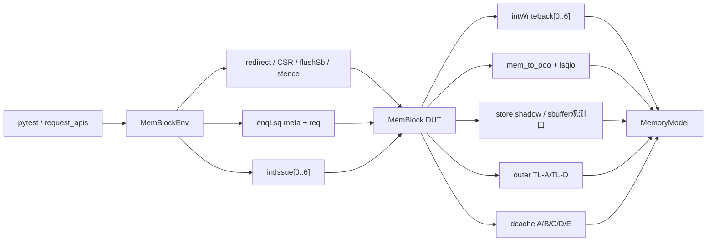
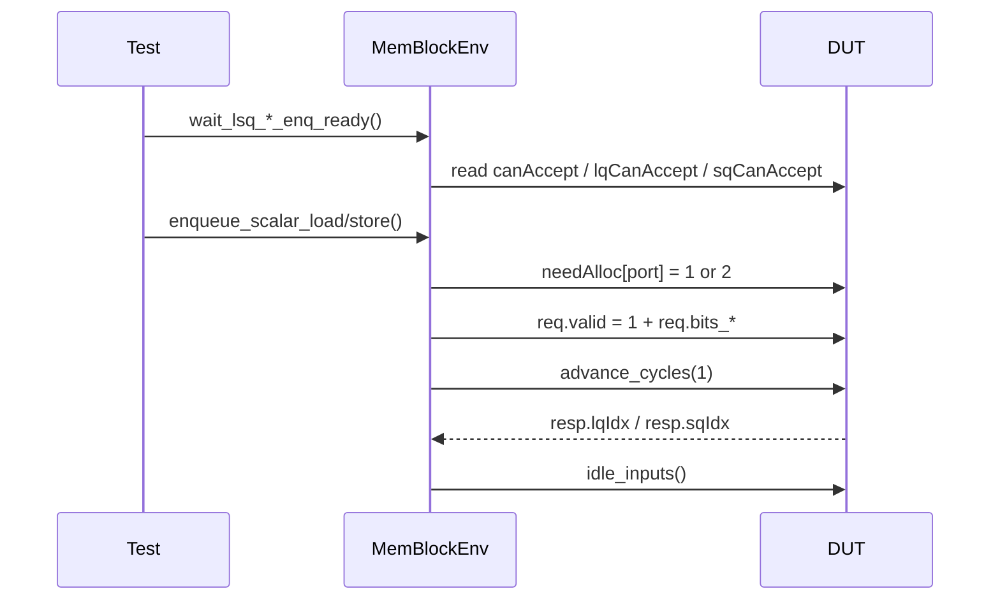
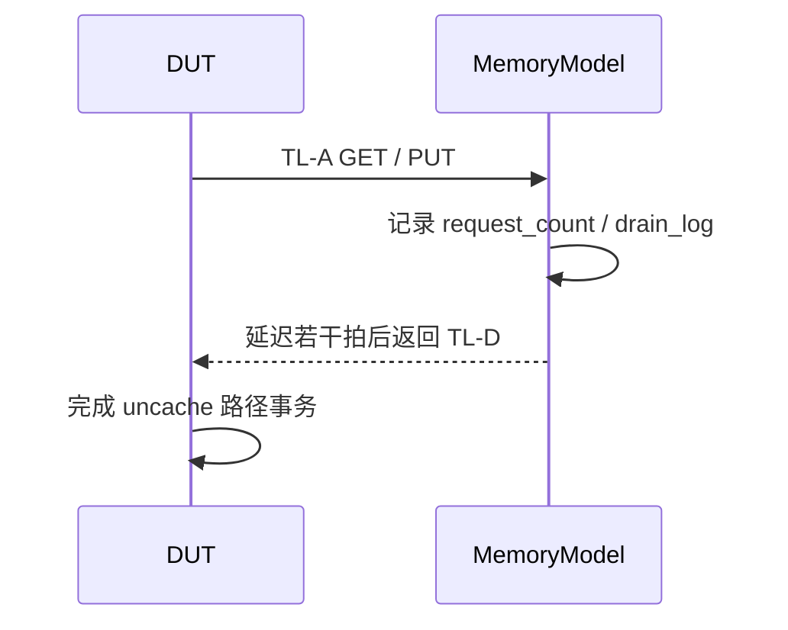
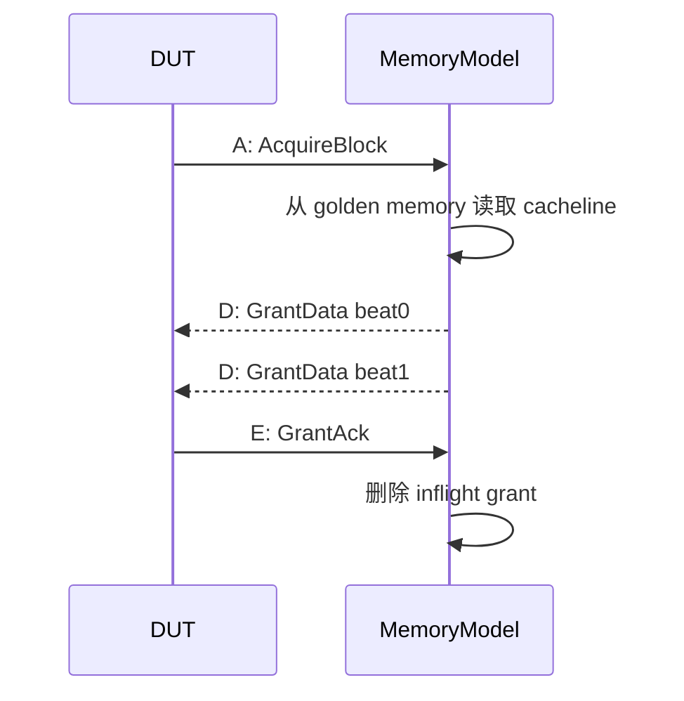

# MemBlock DUT 端口行为解读

## 1. 文档目的

本文件专门从 DUT 端口视角解读 `src/test/python/MemBlock/` 验证环境。

它回答的不是“测试脚本怎么写”这一类问题，而是以下问题：

1. 环境到底绑定了哪些 DUT 端口。
2. 这些端口在测试语义中分别扮演什么角色。
3. 哪些端口是测试侧主动驱动。
4. 哪些端口是环境持续观测。
5. 哪些端口与 `MemoryModel` 的判定逻辑直接相关。
6. 一个事务经过这些端口时，验证环境是如何解读其行为的。

## 2. 端口视角下的总览

从环境代码看，MemBlock DUT 在验证环境中被分成六类接口：

1. 前端控制类输入。
2. LSQ 分配类输入输出。
3. issue / writeback 执行类输入输出。
4. store 内部观测口。
5. LSU 对 OOO 的状态输出。
6. 对外存储系统的 TileLink 端口。

对应关系可以用下图概括：

## 3. 端口分组总表

下表按环境中的 Bundle 分组列出关键接口。

| 分组 | 绑定类 | 方向 | 主要作用 |
| --- | --- | --- | --- |
| redirect | `RedirectBundle` | Test -> DUT | 向 MemBlock 注入 pipeline redirect |
| CSR | `TlbCsrBundle` / `CsrCtrlBundle` | Test -> DUT | 提供地址翻译和 CSR 控制默认值 |
| LSQ enqueue meta | `LsqEnqMetaBundle` | Test -> DUT / DUT -> Test | 提供 `needAlloc`，读取 `canAccept` |
| LSQ enqueue req | `LsqEnqReqBundle` | Test -> DUT | 向 LSQ 送入分配请求元数据 |
| LSQ enqueue resp | `LsqEnqRespBundle` | DUT -> Test | 读取分配得到的 `lqIdx/sqIdx` |
| int issue | `IntIssueBundle` | Test -> DUT | 向 LSU 送入 load/store 执行请求 |
| int writeback | `IntWritebackBundle` | DUT -> Test | 观测 load 写回结果 |
| mem status | `MemStatusBundle` | DUT -> Test | 观测 dequeue、违例、sbuffer 空状态 |
| lsq status | `LsqStatusBundle` | DUT -> Test | 观测 LQ/SQ 是否可接收、MMIO 判定 |
| store addr/data/mask | `Store*InputBundle` | DUT -> Test | 拼装 store 的地址、数据、mask |
| SQ shadow | `StoreQueueShadowEntry` | DUT -> Test | 观测每个 store 槽位分配和提交状态 |
| sbuffer write | `SbufferWriteBundle` | DUT -> Test | 观测 store drain |
| outer TL | `OuterTLABundle` / `OuterTLDBundle` | DUT <-> Model | 建模 uncache / outer memory |
| dcache TL-C | `DcacheClient*Bundle` | DUT <-> Model | 建模 cacheable 路径和一致性流量 |

## 4. 前端控制类输入

### 4.1 redirect

`RedirectBundle` 绑定了：

- `valid`
- `bits_level`
- `bits_robIdx_flag`
- `bits_robIdx_value`

环境默认将其清零。

当前测试环境中，redirect 主要承担“保持稳定默认态”的职责，而不是广泛驱动复杂恢复场景。

这意味着：

1. 大多数现有用例不会主动发 redirect。
2. `idle_inputs()` 每拍都会把 redirect 归零。
3. 如果后续要增加异常恢复、乱序回滚类测试，应优先从这里扩展。

### 4.2 CSR / TLB 相关输入

`MockCSRInterface` 将 CSR 类输入分为两束：

- `io_ooo_to_mem_tlbCsr_*`
- `io_ooo_to_mem_csrCtrl_*`

当前默认行为是：

1. 所有 CSR 位先清零。
2. 再设置为非虚拟化 M-mode。
3. `priv_virt = 0`
4. `priv_virt_changed = 0`
5. `priv_imode = 3`
6. `priv_dmode = 3`

从验证语义看，这个默认值意味着：

- 地址翻译相关行为尽量被约束在最简单背景中。
- 测试环境不主动引入虚拟化、复杂权限变化、触发器等干扰因素。
- 若 load/store 行为异常，优先看 LSU 主路径，而不是先怀疑 CSR 背景。

从 2026-04-08 开始，`MemBlockEnv` 额外提供 `env.mmu` facade，用来在“默认 M-mode 空闲态”之外，显式建立可复用的 MMU 背景。它主要承担三类职责：

1. 重放 `satp/priv_*` 这类每拍输入，避免 `idle_inputs()` 把活跃 testcase 意外切回 M-mode。
2. 通过 `csrCtrl.distribute_csr_w_*` 对 DUT 内部 PMP CSR 进行编程，补齐 S-mode translation smoke 所需的权限背景。
3. 通过 PTW TileLink responder 为 page-table walk 返回完整 multi-beat D 响应。

也就是说，translation 专题 testcase 应优先依赖 `env.mmu`，而不是在 testcase 本地零散改 `tlb_csr` 或私自拼 PTW D 通道。

### 4.3 flushSb 与 sfence

`MemBlockEnv.idle_inputs()` 对以下控制口有显式管理：

- `io_ooo_to_mem_flushSb`
- `io_ooo_to_mem_sfence_valid`
- `io_ooo_to_mem_sfence_bits_rs1`
- `io_ooo_to_mem_sfence_bits_rs2`
- `io_ooo_to_mem_sfence_bits_addr`
- `io_ooo_to_mem_sfence_bits_id`
- `io_ooo_to_mem_sfence_bits_hv`
- `io_ooo_to_mem_sfence_bits_hg`

环境对这组端口的解读是：

- `flushSb` 用来驱动 store buffer 结束态收敛。
- `sfence_valid` 作为同步配套脉冲，与 `flushSb` 同拍送出。
- 默认所有 bits 置零，表示“全局且最保守”的 fence/flush 请求。

## 5. LSQ enqueue 端口行为

### 5.1 `LsqEnqMetaBundle`

该组端口中最重要的成员是：

- `canAccept`
- `needAlloc[#]`

验证环境对它的解读如下：

1. `canAccept` 是 DUT 返回的总入口是否可接收信息。
2. `needAlloc[#]` 是测试侧对某个 port 的资源申请类型编码。
3. load 用例通常把 `needAlloc[port] = 1`。
4. store 用例通常把 `needAlloc[port] = 2`。

现有 API 的语义不是“随便打一拍”，而是：

1. 先等到 `canAccept=1`。
2. 同时等 `lqCanAccept` 或 `sqCanAccept=1`。
3. 再驱动 `needAlloc` 和 `req.valid`。

这说明环境把 enqueue 视为两级准入：

- 一级是总入口资源准入。
- 二级是 LQ/SQ 自身容量准入。

### 5.2 `LsqEnqReqBundle`

该 Bundle 中包含：

- `valid`
- `bits_fuType`
- `bits_fuOpType`
- `bits_rfWen`
- `bits_vpu_vstart`
- `bits_vpu_vl`
- `bits_lastUop`
- `bits_pdest`
- `bits_robIdx_flag`
- `bits_robIdx_value`
- `bits_lqIdx_flag`
- `bits_lqIdx_value`
- `bits_sqIdx_flag`
- `bits_sqIdx_value`
- `bits_numLsElem`
- `bits_exception_vec[#]`

验证环境对这些字段的理解偏“最小闭环”：

1. `fuType` 区分 load 与 store。
2. `fuOpType` 目前按标量 load/store 最小值驱动。
3. `rfWen` 对 load 为 1，对 store 为 0。
4. `pdest` 只在 load 路径中用于后续 writeback compare。
5. `robIdx` 是测试侧最核心的时序键。
6. `lqIdx/sqIdx` 用于明确指定或回读队列位置。
7. `numLsElem` 当前固定为 1，表示标量单元素请求。
8. 向量相关字段默认清零。
9. `exception_vec` 默认清零。

### 5.3 `LsqEnqRespBundle`

响应侧只关心：

- `lqIdx_flag`
- `lqIdx_value`
- `sqIdx_flag`
- `sqIdx_value`

环境对响应的解读是：

1. load 测试通常更关注 LQ 分配是否成功。
2. store 测试会显式读取返回的 `sqIdx`，因为后续 `STD` 和 `STA` 必须指向真实分配槽位。
3. 这不是可选读回，而是 store 测试流程的一部分。

### 5.4 enqueue 行为序列图

## 6. intIssue 输入端口行为

### 6.1 issue 端口组

环境绑定了 7 路 issue 口：

- `io_ooo_to_mem_intIssue_0_0_*`
- `io_ooo_to_mem_intIssue_1_0_*`
- `io_ooo_to_mem_intIssue_2_0_*`
- `io_ooo_to_mem_intIssue_3_0_*`
- `io_ooo_to_mem_intIssue_4_0_*`
- `io_ooo_to_mem_intIssue_5_0_*`
- `io_ooo_to_mem_intIssue_6_0_*`

当前公共 Bundle 暴露的基础字段是：

- `ready`
- `valid`
- `bits_fuType`
- `bits_fuOpType`
- `bits_src_0`
- `bits_robIdx_flag`
- `bits_robIdx_value`
- `bits_sqIdx_flag`
- `bits_sqIdx_value`

而 `request_apis.py` 在发不同类型 issue 时，还会通过 `getattr` 继续驱动更多细节字段。

### 6.2 load issue 的语义

`issue_scalar_load()` 会驱动：

- `valid = 1`
- `fuType = FU_TYPE_LDU`
- `fuOpType = LSU_OP_LD`
- `src_0 = addr`
- `robIdx = prepare/send/execute 后绑定的 runtime rob_idx`
- `sqIdx = 当前 store 边界`
- `imm = 0`
- `pdest = prepare/send/execute 后绑定的 runtime pdest`
- `rfWen = 1`
- `pc = prepare/send/execute 后绑定的 runtime pc`
- `ftqIdx_flag = 0`
- `ftqIdx_value = prepare/send/execute 后绑定的 runtime ftqIdx`
- `ftqOffset = 0`
- `loadWaitBit = 0`
- `waitForRobIdx_flag = 0`
- `waitForRobIdx_value = 0`
- `storeSetHit = 0`
- `loadWaitStrict = 0`
- `ssid = 0`
- `lqIdx = 当前 load 槽位`

环境对这些值的解读：

1. 地址通过 `src_0` 传入。
2. `robIdx` 是后续提交和 compare 的主索引。
3. `pdest` 会在 writeback compare 时使用。
4. `sqIdx` 提供当前 load 可见的 store 边界。
5. `lqIdx` 绑定 enqueue 阶段获得的负载队列位置。
6. `req_id` 只保留为 testcase 标签；这些 runtime 字段若未先 prepare/bind，不应再由 helper 静默推导。

### 6.3 STD issue 的语义

`issue_scalar_std()` 只驱动少量关键字段：

- `valid`
- `fuType = STU`
- `fuOpType = 由 store mask 解码出的 SB/SH/SW/SD`
- `src_0 = data`
- `robIdx`
- `sqIdx`

这意味着环境把 STD 看成“把 store data 填入指定 SQ 槽位”的动作。

当前公共请求模型里，标量 store mask 支持以下连续字节宽度：

- `0x01 -> SB`
- `0x03 -> SH`
- `0x0F -> SW`
- `0xFF -> SD`

模型不会期待 STD 本身立即导致外存行为。

它只会在后续的 store shadow 观测中检查：

- 该槽位是否出现 data。
- `data_valid` 是否成立。

### 6.4 STA issue 的语义

`issue_scalar_sta()` 驱动：

- `valid`
- `fuType = STU`
- `fuOpType = 由 store mask 解码出的 SB/SH/SW/SD`
- `src_0 = addr`
- `robIdx`
- `sqIdx`
- `imm = 0`
- `isFirstIssue = 1`
- `pdest = 0`
- `rfWen = 0`
- `isRVC = 0`
- `ftqIdx_flag = 0`
- `ftqIdx_value = prepare/send/execute 后绑定的 runtime ftqIdx`
- `ftqOffset = 0`
- `storeSetHit = 0`
- `ssid = 0`

环境对 STA 的理解是：

1. 它负责把物理地址和相关元数据送入 store 地址生成路径。
2. STA 是否成功 materialize，将通过后续的 store shadow 和 `store_addr_inputs` 被动观测。
3. 即使 STD 先到，也不会立刻形成 ready-for-retire store。
4. 一个 store 要进入可退休状态，地址、数据、mask、commit 等条件都要齐。

### 6.5 issue 握手规则

`_issue_until_fire()` 的行为等价于：

1. 每拍先驱动输入。
2. 读取 `issue.ready`。
3. 若 ready 为 1，则本拍 handshake 成功。
4. 立即推进 1 拍，让请求被 DUT 吃进去。
5. 随后 `idle_inputs()` 清空输入。

因此，测试环境对 issue 口的解释是标准 ready/valid。

## 7. intWriteback 输出端口行为

### 7.1 为什么是可选绑定

`IntWritebackBundle` 采用 `OPTIONAL_SIGNAL_MAP` 的方式绑定字段。

这说明环境明确接受一个事实：

- 某些 DUT 构建可能不会导出所有 debug 信号。

环境真正强依赖的字段是：

- `valid`
- `ready`
- `bits_data_0`
- `bits_pdest`
- `bits_intWen`
- `bits_robIdx_flag`
- `bits_robIdx_value`
- `bits_isFromLoadUnit`

如果这些字段缺失，`MemoryModel` 会跳过严格 compare 或直接无法形成有效校验。

### 7.2 环境对 writeback 的过滤规则

`check_writebacks()` 只处理满足以下条件的写回：

1. 该 lane 连接了 `valid`。
2. `valid = 1`。
3. `ready = 1`。
4. 若存在 `isFromLoadUnit`，则它必须为 1。
5. 连接了 `data_0/pdest/intWen/robIdx_flag/robIdx_value`。
6. `intWen = 1`。

也就是说，环境把很多 writeback 事件当成“非本次 compare 的对象”并跳过。

这不是遗漏，而是刻意聚焦：

- 当前环境主要比较“整数 load 写回”。

### 7.3 ROB 对应关系

对一个 writeback，环境最关心的是：

- 这是哪个 `robIdx`
- 它应当对应哪个 `pdest`
- 写回数据是什么
- 在 commit 边界上它应当看到的值是什么

所以从端口行为上看，`robIdx` 不是单纯调试信息，而是验证环境的主键。

## 8. `mem_to_ooo` 状态口行为

### 8.1 `lqDeq`

环境将 `lqDeq` 解释为：

- 当前周期有多少笔 load 可以被视为已提交。

然后调用：

- `MemoryModel.note_load_commits(int(self.mem_status.lqDeq.value))`

这一步非常关键。

因为环境不是在看到 writeback 时立刻 compare，而是要等 `lqDeq` 给出提交预算。

### 8.2 `sqDeq`

当前环境有绑定 `sqDeq`，但并没有像 `lqDeq` 那样把它作为主要状态推进源。

store 的提交时序目前主要依赖：

- `PendingPtrDriver.queue_store_commit()`
- store shadow 中的 `committed`
- 最后 flush/drain 收敛

所以 `sqDeq` 现在更多是观测口而不是核心时钟源。

### 8.3 `sbIsEmpty`

`flush_store_buffers_and_wait()` 会循环等待：

- `mem_status.sbIsEmpty == 1`

环境对它的解读非常直接：

- store buffer 及其后续可观测 drain 已经进入空闲态。

一旦该位为 1，环境还会额外推进若干 `settle_cycles`，再进行 drain 与 goldenmem 的最终比对。

### 8.4 `memoryViolation_*`

当前环境已绑定：

- `memoryViolation_valid`
- `memoryViolation_bits_level`
- `memoryViolation_bits_robIdx_flag`
- `memoryViolation_bits_robIdx_value`
- `memoryViolation_bits_target`

现有主路径测试并未深入使用这些信号。

但从接口布局看，它们适合支撑后续场景：

1. load-store 违例恢复。
2. replay 原因可观测。
3. 指定 ROB 目标的异常/回滚路径检查。

## 9. `lsqio` 状态口行为

`LsqStatusBundle` 绑定：

- `vaddr`
- `gpaddr`
- `isForVSnonLeafPTE`
- `lqCanAccept`
- `sqCanAccept`
- `mmio[#]`

环境当前直接依赖的主要是：

- `lqCanAccept`
- `sqCanAccept`

### 9.1 `lqCanAccept`

被 `wait_lsq_load_enq_ready()` 用作 load 分配门控。

只要它为 0，测试就不会强行送 load enqueue。

### 9.2 `sqCanAccept`

被 `wait_lsq_store_enq_ready()` 用作 store 分配门控。

### 9.3 `mmio[#]`

虽然环境没有直接据此下断言路径，但从测试观察看：

- `< 0x80000000` 地址通常被视为 MMIO / uncache 路径。
- `> 0x80000000` 地址通常被视为 cacheable 路径。

这与 `random_load` 和 `random_store` 用例中的地址域划分一致。

## 10. store 内部观测口行为

### 10.1 为什么要绑定内部观测口

对 store 来说，外部可见现象通常滞后于内部状态变化。

如果只看最终 TL 请求，很难回答下面这些问题：

1. store 是否已经进入 SQ。
2. 地址是否已经 materialize。
3. 数据是否已经 materialize。
4. 这个 store 是 MMIO 还是 cacheable。
5. 它是否已经 committed。
6. 它是否因为异常而不应进入最终内存视图。

因此环境专门绑定了 store 内部观测口。

### 10.2 `StoreDataInputBundle`

该组信号包括：

- `valid`
- `sqIdx_value`
- `fuType`
- `fuOpType`
- `data`

环境对它的解释是：

- 当 `valid=1` 时，某个 SQ 槽位收到一份 store data。

### 10.3 `StoreAddrInputBundle`

该组信号包括：

- `valid`
- `sqIdx_value`
- `paddr`
- `miss`
- `nc`

环境对它的解释是：

1. `paddr` 给出最终地址。
2. `miss=1` 时不认为地址已有效。
3. `nc` 记录 non-cacheable 属性。

### 10.4 `StoreMaskInputBundle`

该组信号包括：

- `valid`
- `sqIdx_value`
- `mask`

环境对它的解释是：

- 该 store 本次写哪些字节有效。

### 10.5 `StoreAddrReInputBundle`

该组信号包括：

- `updateAddrValid`
- `sqIdx_value`
- `mmio`
- `memBackTypeMM`
- `hasException`

环境对它的解释更偏“属性修正”：

1. `mmio` 用来区分是否应该走外部写路径。
2. `hasException` 为 1 的 store 不进入黄金内存退休。
3. `memBackTypeMM` 为后续扩展留出了语义位置。

### 10.6 `StoreQueueShadowEntry`

每个 SQ 槽位都绑定以下关键状态：

- `allocated`
- `addrvalid`
- `datavalid`
- `committed`
- `completed`
- `nc`
- `robIdx_flag`
- `robIdx_value`

环境用它回答两个核心问题：

1. 这个槽位当前是否属于一笔真实存在的 store。
2. 这笔 store 的提交进度到了哪里。

### 10.7 `SbufferWriteBundle`

该组信号包括：

- `ready`
- `valid`
- `addr`
- `data`
- `mask`
- `wline`
- `vecValid`

环境只在以下条件同时成立时记一条 drain 事件：

1. `valid = 1`
2. `ready = 1`
3. `vecValid != 0`
4. `wline = 0`

这说明当前环境明确不支持 line write drain 的校验。

## 11. outer TileLink 端口行为

### 11.1 A 通道

`OuterTLABundle` 中最关键的字段是：

- `ready`
- `valid`
- `bits_opcode`
- `bits_size`
- `bits_source`
- `bits_address`
- `bits_mask`
- `bits_data`

环境会持续驱动：

- `outer_a.ready = 1`

这相当于对 DUT 表达：

- 外部 uncache / outer memory 始终可接收请求。

### 11.2 A 通道请求解释

`MemoryModel` 当前识别的行为：

- `TL_A_GET`
- `TL_A_PUT_FULL`
- `TL_A_PUT_PARTIAL`

含义分别是：

1. `GET` 代表读取外部内存。
2. `PUT_FULL` 代表全宽写。
3. `PUT_PARTIAL` 代表部分字节写。

### 11.3 D 通道

`OuterTLDBundle` 中最关键的字段是：

- `valid`
- `ready`
- `bits_opcode`
- `bits_source`
- `bits_sink`
- `bits_denied`
- `bits_data`

环境对 D 通道有两个要求：

1. 响应必须在达到延迟后发出。
2. `source` 必须匹配发起请求的 `source`。

### 11.4 outer 路径时序图

## 12. dcache TileLink-C 端口行为

### 12.1 A 通道

环境会持续驱动：

- `dcache_a.ready = 1`

当前模型只接受：

- `TL_A_ACQUIRE_BLOCK`

环境对这一点的理解很明确：

- 现有 cacheable load 测试只覆盖最小 cacheline 获取路径。

### 12.2 B 通道

`DcacheClientBBundle` 主要由模型驱动响应。

现有主路径测试不会主动构造复杂 Probe，但保留了注入口：

- `inject_dcache_b_response()`

### 12.3 C 通道

环境会持续驱动：

- `dcache_c.ready = 1`

模型支持：

- `TL_C_PROBE_ACK`
- `TL_C_PROBE_ACK_DATA`
- `TL_C_RELEASE`
- `TL_C_RELEASE_DATA`

其中 `Release` 类请求会在 D 通道得到 `ReleaseAck`。

### 12.4 D 通道

`DcacheClientDBundle` 由模型返回：

- `GrantData`
- `ReleaseAck`

关键字段包括：

- `bits_opcode`
- `bits_source`
- `bits_sink`
- `bits_echo_isKeyword`
- `bits_data`

### 12.5 E 通道

环境会持续驱动：

- `dcache_e.ready = 1`

模型要求：

- DUT 对每个 inflight grant 发出合法的 GrantAck。

### 12.6 dcache 路径时序图

## 13. 端口空闲值与默认行为

当前环境对大部分端口有明确的空闲值策略。

### 13.1 测试侧主动驱动输入的默认值

- `redirect.valid = 0`
- `enqLsq.needAlloc[*] = 0`
- `enqLsq.req[*].valid = 0`
- `issue[*].valid = 0`
- `flushSb = 0`
- `sfence_valid = 0`
- CSR 大多为 0，配合默认 M-mode 字段

### 13.2 模型驱动接口的默认值

- `outer_d.valid = 0`
- `dcache_b.valid = 0`
- `dcache_d.valid = 0`
- writeback `ready = 1`
- `outer_a.ready = 1`
- `dcache_a.ready = 1`
- `dcache_c.ready = 1`
- `dcache_e.ready = 1`

这种默认值策略的意义是：

1. 让模型尽可能像一个“随时可收、按延迟返回”的外设。
2. 让测试用例不用处理大量无关 backpressure。
3. 把失败原因集中到 MemBlock 主功能，而不是环境外设拥塞。

## 14. 端口行为与测试用例之间的对应

### 14.1 `test_MemBlock_env_fixture.py`

该文件主要覆盖：

- Bundle 是否绑定成功。
- ready 是否被正确驱动。
- idle/reset 后输入是否回到默认值。

它对应的是“端口存在性”和“最小握手环境稳定性”。

### 14.2 `test_MemBlock_random_load.py`

该文件主要验证：

- load enqueue / issue 所需端口是否协同工作。
- outer 与 dcache 端口是否按地址域走不同路径。
- writeback 是否能被 `MemoryModel` 正确 compare。

### 14.3 `test_MemBlock_random_store.py`

该文件主要验证：

- store enqueue / STD / STA / commit / flush 相关端口的连贯性。
- MMIO store 是否经 outer 写口流出。
- cacheable store 是否经 sbuffer drain。

## 15. 端口行为上的设计取舍

从代码可以看出，这个环境有几项明确取舍。

### 15.1 优先稳定而不是完整

例如：

- outer / dcache ready 默认常高。
- CSR 默认固定简单模式。
- issue 附带字段多数固定为安全默认值。

这种取舍的好处是：

- 更容易构造稳定的回归环境。

代价是：

- 对复杂 backpressure、复杂特权态和复杂一致性场景的覆盖还不充分。

### 15.2 优先观测 store 内部状态，而不是仅看最终写出

这体现在：

- 绑定了 `store_addr_inputs`
- 绑定了 `store_mask_inputs`
- 绑定了 `store_data_inputs`
- 绑定了 `store_addr_re_inputs`
- 绑定了 `sq_shadow_entries`

因此当前环境不是“只用最终结果判对错”，而是能够追踪 store 生命周期。

### 15.3 优先按 ROB 驱动验证时序

这体现在：

- enqueue 带 `robIdx`
- issue 带 `robIdx`
- writeback compare 以 `robIdx` 建桶
- pendingPtr 也按 ROB 顺序推进

所以如果未来要扩展新的端口场景，首先要确认它和现有 ROB 驱动假设是否兼容。

## 16. 对新增测试的端口使用建议

1. 不要绕过 `request_apis.py` 直接手工打一串 issue，除非是在写底层环境测试。
2. 如果新增字段确实决定功能路径，应先补 Bundle，再补 API，再写用例。
3. 若新场景依赖可选调试信号，先确认 DUT 构建版本是否导出了该信号。
4. 若路径涉及 store 可见性，请同时考虑 `robIdx`、`pendingPtr`、`lqDeq` 和 `committed` 的关系。
5. 若路径涉及外部事务，请明确它应走 outer 还是 dcache 端口，不要混用统计计数下断言。

## 17. 小结

从 DUT 端口行为角度看，这套验证环境的核心思想是：

1. 用较薄的 Bundle 层把海量零散信号重组为可编程接口。
2. 用 `request_apis.py` 把关键端口组合成最小事务。
3. 用 `MemoryModel` 解读 writeback、TileLink 和 store shadow 端口。
4. 用 `robIdx`、`lqDeq` 和 `pendingPtr` 建立统一的提交视图。

因此，阅读端口行为时不要只看单个信号，而要看它在“enqueue -> issue -> status -> compare -> drain”整条链路中的位置。
