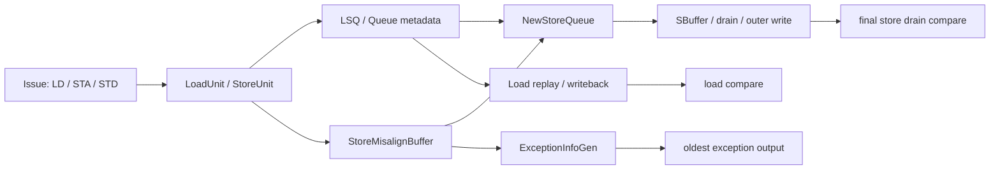
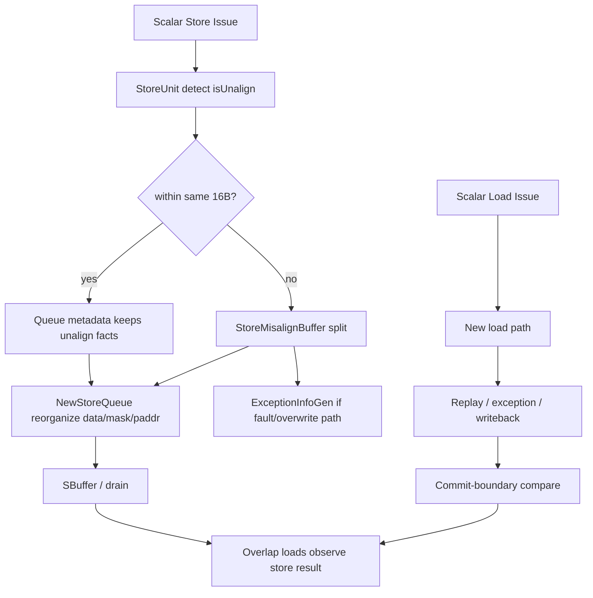
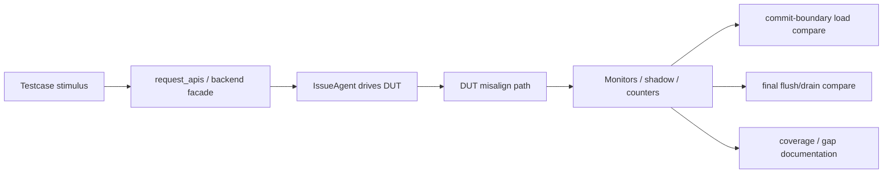

# MemBlock misalign 专题分析与验证状态

## 1. 文档目标与范围

本文档专门讨论 XiangShan `MemBlock` 中与 **misalign / unalign（非对齐访存）** 相关的设计现状、验证功能点、验证方案，以及当前 Python 验证环境与已有用例的满足情况。

本文档的主线刻意收敛为 **标量 scalar load/store misalign**，原因有三点：

1. 当前 MemBlock Python 验证环境的主交付物仍然是标量 load/store 的真实 DUT 回归，已有 testcase、scoreboard、drain 收口、coverage 文档都以 scalar LSU 为核心。
2. 当前 DUT 中 store misalign 与 load misalign 的实现形态并不对称：**store misalign 仍有明确的 buffer / split / sbuffer 路径**，而 **load misalign 已经脱离旧 `LoadMisalignBuffer` 语义**，被吸收到新的 replay / exception / writeback 体系中。若不先把标量主线讲清楚，就会把不同层次的问题混在一起。
3. 向量、AMO、cross-page exception overwrite、oldest exception 排序等路径确实与 misalign 有关，但它们更多属于“边界与扩展问题”。如果正文同时把 scalar、vector、AMO、异常 oldest 都平铺展开，文档会迅速失去工程上的可执行性。

因此，本文档采用如下范围约束：

- **正文重点覆盖**：scalar store misalign、scalar load misalign、misalign 与 replay / split / drain / overlap load 的关系、misalign 的验证矩阵与当前环境结论。
- **正文次重点覆盖**：misalign 与异常汇聚、cross-16B、cross-4K page、commit-boundary 语义之间的关系。
- **附录或风险提示中带过**：vector misalign、AMO、`uopIdx` 深层语义、多微操作 oldest exception 选择。

为了避免误解，本文先给出一个结论性判断：**当前版本 MemBlock 不能再按“旧 `LoadMisalignBuffer` + 旧 load exception buffer + 旧 store queue”那套历史实现来理解 misalign。** 对验证者来说，这意味着“misalign 还在，但暴露它的结构已经换了”。若沿用旧测试脚本的观测假设，很容易出现“不是 DUT 功能错，而是验证口径已经过时”的问题。

## 2. 阅读地图与关键对象

### 2.1 设计分析涉及的主要 RTL 文件

| 文件 | 角色 | 与 misalign 的关系 |
| --- | --- | --- |
| `src/main/scala/xiangshan/mem/MemBlock.scala` | MemBlock 顶层连接 | 实例化并连接 `StoreMisalignBuffer` 与 `ExceptionInfoGen`，把 store unit、LSQ、misalign buffer 串起来 |
| `src/main/scala/xiangshan/mem/lsqueue/LSQBundle.scala` | LSQ 共享 bundle | 定义 `isUnalign`、`unalignWithin16Byte`、`cross4KPage`、`isLastRequest`、`unalignQueueReq` 等 misalign 元信息 |
| `src/main/scala/xiangshan/mem/lsqueue/StoreMisalignBuffer.scala` | store misalign 主体 | 负责接收 misaligned store、判断是否跨 16B / 跨页、切分为对齐子请求、处理相关异常覆盖 |
| `src/main/scala/xiangshan/mem/lsqueue/NewStoreQueue.scala` | store queue / sbuffer 发射 | 负责把 misalign split 后的请求对齐到 16B 窗口，写入 sbuffer，并处理跨 16B 占口与跨页辅助地址 |
| `src/main/scala/xiangshan/mem/lsqueue/ExceptionInfoGen.scala` | 异常汇聚 | 不再让 misalign 异常散落在旧 buffer 内部，而是统一收口到 exception info 生成逻辑 |
| `src/main/scala/xiangshan/mem/lsqueue/LoadQueueReplay.scala` | load replay cause | 保留与 unalign tail split fail、misalign buffer full 相关的 replay cause 枚举，说明 load misalign 仍然与 replay 体系耦合 |

### 2.2 验证环境涉及的主要 Python 文件

| 文件 | 角色 | 与 misalign 的关系 |
| --- | --- | --- |
| `src/test/python/MemBlock/tests/test_MemBlock_scalar_store_pipeline.py` | 真实 DUT directed case | 当前唯一明确落地的 store misalign directed testcase 所在处 |
| `src/test/python/MemBlock/transactions.py` | 事务对象 | 当前已能通过 `StoreTxn.mask` 精确表达标量 store 宽度，为 partial / misalign store testcase 提供基础刺激能力 |
| `src/test/python/MemBlock/agents/backend_facade.py` | backend facade | 把 `StoreTxn.mask` 下沉到 `STA/STD` issue 脚本中 |
| `src/test/python/MemBlock/agents/issue_agent.py` | 主动驱动 | 根据 `mask` 驱动真实 store `fuOpType`，让 partial-store / size-aware store 请求进入 DUT |
| `src/test/python/MemBlock/docs/coverage_summary.md` | 当前覆盖率状态源 | 记录 `StoreMisalignBuffer.sv`、`ExceptionInfoGen.sv` 等模块的覆盖率现状 |
| `src/test/python/MemBlock/docs/coverage_todo.md` | 后续补强源 | 明确把 misaligned scalar store/load directed 视为仍在推进中的高优先级缺口 |
| `src/test/python/MemBlock/docs/rob_model.md` | ROB 建模状态分析 | 指出 `pendingPtrNext` 尚未建模，这会直接影响 misalign / split store / next-boundary 类路径的覆盖解释 |

### 2.3 当前需要统一的术语

| 术语 | 含义 | 在本文中的使用方式 |
| --- | --- | --- |
| misalign / unalign | 非对齐访问 | 本文将两者视为同一大类语义，若需要强调与源码命名一致，会保留 `unalign` 原词 |
| within 16B | 有偏移但仍落在同一 16B 窗口 | 通常意味着不需要切成两个 16B 对齐写口 |
| cross 16B | 有效字节跨过 16B 窗口边界 | 是当前 store misalign 最关键的 split 触发条件 |
| cross 4K page | 有效字节跨页 | 会引入第二个物理地址来源与异常覆盖逻辑 |
| overlap load | 与 store 写入窗口有重叠的 younger load | 是验证 commit-boundary 视图与 store 可见性的重要手段 |
| split request | 由一个 misaligned 请求切分出来的多个对齐子请求 | 对 store 来说尤其关键，因为最终会影响 sbuffer 写入口数与 mask 组织 |
| drain | store 最终对外写出与模型收口 | misalign store 不能只看 committed，还要看最终 drain 是否正确 |

## 3. 为什么 misalign 必须单独成章

从验证视角看，misalign 不是“aligned 访存外加一个地址偏移”这么简单。它之所以值得单列专题，至少有以下六个原因。

### 3.1 misalign 改变了请求的微结构形态

对 aligned scalar load/store 而言，很多场景可以近似理解为“一个事务，经由一条主路径，最后得到一个结果”。misalign 不同，它会让“一个架构请求”在微结构内部表现为：

- 需要额外判断是否跨 16B；
- 需要根据访问大小和地址偏移重新生成 mask；
- 可能切分为多个对齐子请求；
- 可能需要第二个物理地址或 unalign queue 协助；
- 可能不再走普通 hit/miss 的单一路径，而是与 replay、exception、sbuffer 占口耦合。

也就是说，misalign 改变的不只是数据内容，还改变了“请求是以几段、在哪些队列、按什么时机被处理”。

### 3.2 misalign 与最终正确值之间不是一一对应关系

一个 misaligned store 即便最终把内存写对了，也不代表它的 split、mask、drain、异常覆盖都对了；一个 misaligned load 即便最终没出错，也不代表它经历的 replay cause、tail split、oldest exception 选择都正确。

因此，misalign 既不能只靠黑盒值比较，也不能只靠某一个内部信号。它天然需要“**白盒观测 + 黑盒收口**”的组合方案。

### 3.3 store misalign 与 load misalign 在当前 DUT 中已不对称

当前版本的一个重要事实是：**store misalign 仍然有明确的结构中心 `StoreMisalignBuffer`，但 load misalign 的旧结构中心 `LoadMisalignBuffer` 已被删除。**

这意味着：

- 对 store misalign，可以在文档和 testcase 中较明确地说“哪一类路径经过什么模块”；
- 对 load misalign，当前更适合按“replay / exception / writeback 现象 + 现有观测边界”来组织验证，而不应假定存在一个与旧版相同的、稳定可观测的 load misalign buffer。

### 3.4 misalign 与 commit-boundary / drain 语义强耦合

在当前 MemBlock Python 环境中：

- load 以 commit-boundary 语义做在线 compare；
- store 采用 deferred visibility，并在 testcase 结束或显式 flush 后统一 drain 收口。

misalign 会把这两种收口方式同时拉进来。典型场景是“misaligned store 提交后，younger overlap load 先在 commit-boundary 视图上看到结果，最终 flush/drain 再把 split 后的数据真正推到外部可见状态”。如果只验证其中一边，就会遗漏另一半语义。

### 3.5 misalign 是当前覆盖率的真实短板，而不是抽象概念

`coverage_summary.md` 已明确记录：

- `StoreMisalignBuffer.sv` line 覆盖约 `58.8%`；
- `StoreMisalignBuffer.sv` branch 覆盖约 `36.8%`；
- 当前虽然已经补入一条 misaligned store + dual overlap load 的 directed case，但该模块覆盖率几乎横盘。

这说明 misalign 不只是“理论上复杂”，而是“当前回归体系确实还没有打透的一块真实空白”。

### 3.6 misalign 是判断验证环境成熟度的试金石

如果一个验证环境连 aligned、same-addr、basic flush 都能过，并不说明它足以支撑未来维护；只有当 misalign、partial overlap、cross-16B、cross-page、异常覆盖等边界都能被清晰表达并稳定定位时，环境才算真正具备“跟随 RTL 演进继续工作”的能力。

## 4. DUT 中 misalign 的当前设计形态

本章先给整体图，再分别讨论 store misalign 与 load misalign。

### 4.1 顶层关系总览

这张图故意把 load 与 store 都画在一张图里，但需要强调：**只有 store 一侧有稳定、明确、可命名的 `StoreMisalignBuffer` 中心节点。** load misalign 虽然仍然存在于系统语义中，但其实现已经分散到 replay、异常与写回体系中，不能简单按旧版模块边界来讲。

### 4.2 store misalign：当前最清晰、也最值得深挖的主线

#### 4.2.1 顶层接线关系

在 `MemBlock.scala` 中，顶层明确实例化了 `StoreMisalignBuffer` 和 `ExceptionInfoGen`，而且 store unit 与 misalign buffer 的连接关系是显式的：

- `MemBlock.scala` 实例化 `storeMisalignBuffer`；
- store unit 的 `misalign_enq` 进入 `storeMisalignBuffer.io.enq(i)`；
- 对于 `i == 0` 的 port，`stu.io.misalign_stin` / `misalign_stout` 与 `splitStoreReq` / `splitStoreResp` 连接；
- LSQ 侧还通过 `sta.unalignQueueReq` 与 store 地址后半段 / 第二物理地址等信息配合。

这意味着：**misaligned scalar store 并不是在 NewStoreQueue 内部被“静默修补”，而是先由 StoreUnit 检出，再经过明确的 misalign buffer / queue / split 体系。**

#### 4.2.2 store 地址元信息已经把 misalign 视为一等公民

`LSQBundle.scala` 中 store 地址输入包含以下字段：

- `isUnalign`
- `unalignWithin16Byte`
- `isLastRequest`
- `cross4KPage`
- `unalignQueueReq`

这组信号很关键，因为它告诉我们当前 DUT 对 store misalign 的理解至少分成三层：

1. 这是不是一个非对齐请求；
2. 它是不是仍然局限在同一个 16B 窗口内；
3. 它是不是跨页，需要额外的第二物理地址、额外的排队或特殊处理。

也就是说，store misalign 不是“一个 bool 说它 misalign 就完了”，而是一整组与 split、queue、地址、异常相关的元信息。

#### 4.2.3 StoreMisalignBuffer 的核心语义：按宽度与偏移切分成对齐子请求

`StoreMisalignBuffer.scala` 的核心设计意图非常清晰：当 buffer 处于 split 状态时，它会检查请求是否跨 16B，如果不是却进入了 misalign split 分支，会直接 `assert(false)`；如果是跨 16B，则把一个 misaligned store 切成多个对齐子请求。

从实现上看，这个模块并不是简单把 mask 硬截成两半，而是结合：

- 原始 `fuOpType`（例如 `SH` / `SW` / `SD`）；
- 访问起始地址偏移；
- 低地址部分应消费多少字节；
- 高地址部分应消费多少字节；
- 每个子请求应该对应什么新的 `fuOpType` 与 mask；

逐种情况生成 `lowAddrStore` 与 `highAddrStore`。

例如：

- 对 `SH`，可能会生成 `SH + SB` 的组合；
- 对 `SW`，根据低两位地址偏移，可能生成 `SW + SB`、`SW + SH` 或 `SW + SW`；
- 对 `SD`，根据低三位地址偏移，可能生成 `SD + SB`、`SD + SH`、`SD + SW`、`SD + SD` 等不同组合。

这说明一个重要事实：**在 store misalign 语义中，“访问宽度”与“最终 split 后子请求宽度”并不总相同。** 一个原始 `SD` 请求可以被拆成一个低地址 `SD` 子请求和一个高地址 `SB/SH/SW/SD` 子请求；一个原始 `SW` 请求也可能拆成 `SW + SH` 而不是机械地“两个 2B”。

这一点对验证非常重要，因为它意味着：

- 不能只看原始 `StoreTxn.mask`；
- 还要关心 DUT 最终对外暴露或写入 shadow 的 mask 形态；
- 更不能把 misalign case 简化成“地址不对齐但最后还是 8B 写”。

#### 4.2.4 NewStoreQueue 对 misalign 的处理不是被动接受，而是主动重组写口与 mask

进入 `NewStoreQueue.scala` 后，misalign 的重点从“如何切分请求”转为“如何把切分后的请求真正写入 sbuffer / dataQueue / 对外路径”。

当前实现明确写道：

- 所有 aligned request 会写到 sbuffer；
- 所有 unaligned request 会先 split，再写到 sbuffer；
- cross-16B 会占用两个 write port；
- cross-page 需要从 `UnalignQueue` 获取第二个物理地址；
- 写入 sbuffer 前会根据 `unalignMask`、`outMask`、`vaddr/paddr` 重算 `writeSbufferMask`、`writeSbufferPaddr`、`writeSbufferVaddr`。

这意味着 store misalign 的最终效果由三层共同决定：

1. `StoreMisalignBuffer` 负责架构请求拆分；
2. `NewStoreQueue` 负责把 split 结果与 16B 对齐窗口、sbuffer 写口组织在一起；
3. 最终 drain / outer path 再把这些内容写出。

因此，一个真实的 store misalign 验证不能只停在 committed store shadow，还应该覆盖：

- overlap load 在提交边界看到什么；
- flush 后 drain 出去的结果是否与初始内存 + stimulus 一致；
- cross-16B 请求是否真的占到了两个写口 / 至少表现出 split 后的两段写出事实。

#### 4.2.5 ExceptionInfoGen 表明 misalign 异常已并入统一异常框架

`ExceptionInfoGen.scala` 中关于 `misalignBufExceptionOverwrite` 的注释，以及 `DUT_CHANGELOG-20260331.md` 对“旧 `LoadExceptionBuffer` / `LoadMisalignBuffer` 被删除，新异常汇聚逻辑改由 `ExceptionInfoGen` 统一管理”的描述，指向同一个结论：

**misalign 相关异常不应再按旧 buffer 本地判定来理解，而应纳入统一的 oldest exception 生成与覆盖逻辑。**

这对 store misalign 尤其重要，因为：

- 正常 split 与异常 split 不能混为一谈；
- cross-page misalign 遇到第二页 fault 时，行为并不等价于“简单拆两段再写”；
- 需要区分“正常 misalign 路径”和“misalign + exception overwrite”路径。

### 4.3 load misalign：语义仍在，但已不再有旧式单点中心

#### 4.3.1 最关键的事实：旧 `LoadMisalignBuffer` 已删除

`DUT_CHANGELOG-20260331.md` 已明确记录：

- `LoadMisalignBuffer.scala` 被删除；
- `LoadExceptionBuffer.scala` 被删除；
- load 的 replay、misalign、uncache、wakeup、异常信息拼装路径都已经换了一遍。

这直接决定了当前验证策略：**不能再用“我去找一个 load misalign buffer 的白盒信号”作为默认入口。** 如果现有环境仍假设某个旧 bundle 或旧 enable 信号是稳定语义源，结论会非常危险。

#### 4.3.2 load misalign 仍与 replay 体系有耦合证据

虽然旧模块删除了，但 `LoadQueueReplay.scala` 仍保留了与 misalign 强相关的 cause：

- `C_BC` 注释中包含 `unalign tail split fail`；
- `C_MF` 注释中明确是 `misalignBuffer Full`。

这说明当前 load misalign 至少在“失败 / 重试 / 资源不足”这一层，依旧与 replay cause 编码发生关系。也就是说，load misalign 并没有消失，而是被吸收到新的 replay / writeback / exception 框架中。

但对于验证者来说，这里必须谨慎：**有 replay cause 不等于我们已经具备了稳定的 load misalign testcase 与对应观测。** 当前环境至多能说明“load misalign 仍是 replay/异常框架的一部分”，还不能说明“我们已经完整建模并验证了 load misalign 微结构”。

#### 4.3.3 当前环境中与 load misalign 相关的可见事实仍较弱

在 Python 侧，`lsq_webui_backend.py` 里可以读到 `load_misalign_full` 这样的状态字段，说明 DUT 顶层或内部仍然暴露了一些与 load misalign 资源状态相关的汇总信号。但当前真实 DUT testcase 并没有围绕这些状态形成稳定回归；更重要的是，**现有回归也没有把这些状态纳入通过/失败判定的主线。**

因此，当前可以给出的稳妥判断是：

- load misalign 的功能路径在 DUT 内部仍然存在；
- 它已经不再对应旧的单体 buffer；
- 它与 replay / exception / writeback 有耦合；
- 当前验证环境还没有形成与 store misalign 对等的、成体系的 load misalign directed case 与白盒判定口径。

### 4.4 store 与 load misalign 的关系图

这张图强调两点：

1. store misalign 的结构链路更完整，适合做“设计分析 + testcase matrix + 覆盖率闭环”；
2. load misalign 当前更像是“挂在 replay / exception / writeback 体系上的一类现象”，需要以阶段性验证方案来处理，而不是假装我们已经掌握了全部内部细节。

## 5. 需要验证的功能点

下面给出 misalign 专题下最关键的功能点矩阵。这里的“功能点”不是按 testcase 名称列，而是按 **DUT 行为意图** 列，便于后续扩 testcase 时不被文件组织方式绑死。

| 功能点 | DUT 设计意图 | 推荐主观测 | 推荐最终收口 | 当前状态 |
| --- | --- | --- | --- | --- |
| store within-16B misalign | 非对齐但仍在同一 16B 窗口内，形成非 `0xFF` mask 或特殊 merge | committed store shadow、mask、younger overlap load | flush/drain 后最终内存一致 | 已有基础 case，但仍弱 |
| store cross-16B misalign | 一个 store 拆成两个对齐子请求，占用两段写路径 | split 后 shadow / mask / 地址窗口变化、drain 事件 | 最终两段窗口都正确 | 基本缺失 |
| store cross-page misalign | misalign 且跨页，第二物理地址来自 unalign queue | cross4KPage 相关行为、异常覆盖、最终是否部分写出 | 正常/异常路径分开收口 | 缺失 |
| misalign store + overlap load | younger load 在 commit-boundary 上看到正确 merge 视图 | load compare、store shadow、load 完成次序 | flush 后结果与中途视图一致 | 已有 1 条基础 case |
| misalign store + aligned load | overlap 不是必须，aligned full load 也应看到正确窗口结果 | load compare、memory readback | drain 后仍一致 | 部分已有，仍不足 |
| misalign store 的 split/drain 一致性 | split 后对外写出不丢字节、不重字节、不乱序覆盖 | drain log、touched bytes、final memory | 与 stimulus 独立计算的 gold 一致 | 仍偏弱 |
| misalign store + exception overwrite | 正常 split 与 fault/overwrite 路径必须分开验证 | exception info、是否写出、是否部分保留 | 正常 case 与异常 case 分开判断 | 缺失 |
| load misalign replay cause | misalign 或 tail split 相关失败进入 replay 框架 | replay cause / 状态位 / load 完成行为 | 最终 load 成功或明确异常 | 缺失 |
| load misalign exception path | load misalign 遇到异常时走统一 exception info 路径 | exception info、load writeback / timeout 行为 | 不应被当作普通 load 成功 compare | 缺失 |
| load/store mixed misalign ordering | misalign store 与 misalign/overlap load 之间 ordering 仍正确 | queue ptr、load completion、shadow 更新 | commit-boundary 与 final drain 两端一致 | 缺失 |

从当前仓库状态出发，可以把这些功能点再分为三档：

### 5.1 已有最小真实 DUT 证明点的功能点

- store within-16B misalign；
- misalign store + overlap load；
- partial / narrow store 与 load merge（虽然不等价于所有 misalign，但为建立更复杂 misalign case 提供了请求模型与 merge 基础）。

### 5.2 环境已经能表达，但还没形成足够 testcase 的功能点

- store cross-16B misalign；
- misalign store + aligned load；
- misalign store split/drain 一致性；
- 更复杂的 store burst + misalign 混合场景；
- 正常 misalign 与异常 misalign 分离。

### 5.3 当前环境尚不能给出强结论的功能点

- load misalign replay cause 细分；
- load misalign exception path；
- 依赖 `pendingPtrNext`、next-boundary 推导的 misalign / split store 路径；
- 多微操作 / `uopIdx` 显著参与的复杂 misalign 路径。

## 6. 推荐验证方案

本章讨论“怎样验证”，而不是“理想上应该有什么模块”。核心原则仍然是：**白盒观测，黑盒收口；正常路径与异常路径分开；store/load 两端都要考虑。**

### 6.1 验证闭环总览

### 6.2 store misalign 推荐方案

#### 6.2.1 Stimulus 层

当前环境已经具备以下基础能力：

- 可以用 `StoreTxn.mask` 表达不同宽度的标量 store；
- `BackendFacade` / `IssueAgent` 会把 mask 下沉到真实 `STA/STD` issue `fuOpType`；
- testcase 可以通过 preload 初始内存、显式 flush、读取 `env.memory`、观察 `drain_summary` 来完成完整闭环。

因此，store misalign testcase 的推荐刺激方式是：

1. preload 一段明确的初始 16B 或 32B 窗口；
2. 发出一个带偏移的 store 请求；
3. 在必要时插入 overlap load 或 aligned full load；
4. 在 testcase 末尾统一 `FlushStoreBuffersSequence`；
5. 对 commit-boundary 视图与 final drain 视图都做检查。

#### 6.2.2 Observation 层

对 store misalign，至少要同时观察三类事实：

- **中间事实**：committed store shadow 的 `addr / mask / data / mmio`；
- **消费事实**：younger load 是否按预期完成、看到的值是否正确；
- **最终事实**：drain event 数量、覆盖字节数、最终 memory readback。

只看 committed store 不够，因为 committed 只证明“请求到达了提交边界”，不证明 split 后的最终写出正确；只看 final memory 也不够，因为会漏掉 overlap load 看到的中间视图与程序序语义。

#### 6.2.3 Check 层

当前环境里曾使用一个局部 helper `_apply_store_to_window()`，它根据 `committed_store_view` 的 `addr/mask/data` 还原窗口内的期望值。这个做法在早期有工程价值，因为它可以快速把 directed case 跑通；但从证明力度看，它更像“基于 DUT 观测结果反推预期”，而不是完全独立的 golden 计算。当前更推荐的做法，是直接基于 `RefMemory` fork 出来的 golden view，对 stimulus 做 masked write 预测。

因此，推荐把 check 分成两个层次：

- **当前阶段可接受**：基于 committed shadow 计算 overlap 窗口，确认 testcase 稳定、路径被击中；
- **下一阶段应升级**：基于原始 stimulus（初始内存 + 请求地址 + 请求数据 + 请求 mask）独立计算 gold，再对照 shadow、load compare、final drain 一起看。

这样做的意义在于：

- 当前能快速补 coverage；
- 后续能逐步降低“自洽但不独立”的风险。

### 6.3 load misalign 推荐方案

对 load misalign，当前不宜直接复制 store misalign 的写法，因为其内部结构中心已变化。更稳妥的方案是按“现象驱动”组织：

1. 先构造能够稳定触发 load misalign 的请求；
2. 再观察它是正常完成、进入 replay 还是进入异常；
3. 最后用 commit-boundary compare / writeback / exception info 进行收口。

换句话说，load misalign 验证的第一步不是“写一个巨大的模型”，而是“先搞清楚当前 DUT 和现有 monitor 能稳定给出哪些事实”。

在当前阶段，推荐的 load misalign 方案是：

- 尽量优先构造 **正常 misalign load** 与 **会进入 replay 的 misalign load** 两类 smoke；
- 如果需要引入 fault / exception，单独做 case，不要与普通 misalign load 混合；
- 不依赖已删除的 `LoadMisalignBuffer` 旧信号；
- 如使用 `load_misalign_full` 之类状态位，也只把它当辅助观察，不把它当唯一通过标准。

### 6.4 功能点到验证动作的映射表

| 功能点 | Stimulus | 主观测 | 通过标准 | 当前建议 |
| --- | --- | --- | --- | --- |
| store within-16B misalign | 单条偏移 store，预置 16B 窗口 | committed shadow、overlap load、drain | overlap 视图正确，flush 后 memory 正确 | 继续保留 |
| store cross-16B misalign | 末尾偏移 store，如 `+0xD/+0xE/+0xF` 窗口 | shadow mask、两个窗口 readback、drain touched bytes | 两个 8B/16B 窗口都正确 | 优先新增 |
| store cross-page misalign | 接近页尾的 store | exception info、unalign queue 相关行为、final writeout | 正常/异常路径明确分离 | 后续高优先级 |
| misalign store + overlap load | store 后发两个 overlap load | load compare、LQ 指针、memory readback | younger load 在 flush 前能看到正确结果 | 已有基础 case，继续扩矩阵 |
| load misalign replay | 偏移 load + 制造 replay 窗口 | replay cause、load 完成时序、最终 compare | replay 可归因，最终行为可解释 | 先做 smoke |
| load misalign exception | 偏移 load + fault 场景 | exception info、load 不应被当普通成功 | exception 路径独立可判定 | 单独补 |

## 7. 当前验证环境与用例状态

这一章不是讨论“理想上应该如何”，而是明确回答：**截至当前工作区状态，环境和现有 testcase 到底已经覆盖了什么。**

### 7.1 已有 testcase 状态总表

| 类别 | 现有 testcase / 事实 | 当前能证明什么 | 仍不能证明什么 | 结论 |
| --- | --- | --- | --- | --- |
| store misalign 基础路径 | `test_api_MemBlock_misaligned_store_dual_overlap_loads_directed` | misaligned store 能进入 committed；两个 overlap load 能在提交边界视图上看到更新；flush 后最终内存匹配 | 还不能证明 cross-16B / cross-page / 异常 overwrite / 深层 split 矩阵 | **部分满足** |
| partial-store 请求模型 | `transactions.py`、`backend_facade.py`、`issue_agent.py` 已打通 mask -> `fuOpType`；多条 partial-store directed case 已落地 | 说明环境已能精确表达 `SB/SH/SW/SD` 宽度，为 misalign store 进一步扩展提供基础 | 不等价于 misalign store 已完整覆盖 | **满足基础能力** |
| store burst + flush | `test_api_MemBlock_store_burst_then_interleaved_load_before_flush` | 证明多条 committed store 可在 flush 前共存，最终统一 drain | 不特指 misalign split | **间接支持** |
| load misalign | 当前无专门真实 DUT directed case | 只能说明系统里存在 load misalign 相关状态与 replay cause 枚举 | 不能说明 load misalign 已被稳定验证 | **不满足** |
| misalign exception | 当前无正常/异常分离 testcase | 暂无 | 无法判定 exception overwrite 与 normal split 边界 | **不满足** |
| mixed misalign ordering | 当前无系统化 testcase | 暂无 | 无法判定多 misalign 请求或 misalign load/store 混合下的 ordering | **不满足** |

### 7.2 store misalign 当前已有用例的满足程度

当前唯一明确的 store misalign directed case 位于 `test_MemBlock_scalar_store_pipeline.py`：

- 预置两段 8B 窗口初始值；
- 发一条地址为 `MISALIGNED_WINDOW_BASE + 0x4` 的 cacheable store；
- 检查 committed store 的地址与 mask；
- 再发两个 overlap load，分别覆盖低 8B 与高 8B 视图；
- 最后 flush，并检查最终 memory readback 与 drain summary。

这个用例的价值很高，因为它至少证明了：

1. 环境可以稳定构造真实 DUT misaligned store；
2. misaligned store 不只是“最终能写出去”，还会在 overlap load 语义上影响 younger load；
3. 现有 scoreboard / memory model / final drain 收口没有因为引入 misalign case 而直接失效。

但它的边界也必须诚实写清：

- 这是 **同一 16B 窗口内偏移 +4** 的基础型场景，不是 cross-16B 全矩阵；
- 当前版本里，这条 case 的 expected window 已升级为 stimulus-derived golden fork；它的主要限制已不再是 expected 来源，而是场景仍只覆盖 within-16B 的基础型 misalign；
- 它尚不足以解释 `StoreMisalignBuffer.sv` 为何覆盖几乎不涨，因此更可能是“只摸到了入口”，还没打到深层状态组合。

### 7.3 load misalign 当前状态

目前仓库中没有以 `load misalign` 为主题的真实 DUT directed case，这件事必须明确写入文档，而不是绕过去。当前能找到的相关事实包括：

- 旧 `LoadMisalignBuffer` 已删除；
- `LoadQueueReplay.scala` 中仍存在 `unalign tail split fail` 与 `misalignBuffer Full` 相关 replay cause；
- `lsq_webui_backend.py` 中仍可读到 `load_misalign_full` 这样的状态字段；
- 但这些事实尚未被组织成“可稳定回归、可清晰定位、可与 coverage 绑定”的 testcase 体系。

因此，当前对 load misalign 最稳妥的结论是：

- **DUT 设计层面：仍然存在 load misalign 相关语义。**
- **验证环境层面：还没有足够成熟的 testcase 和白盒判定口径。**
- **项目状态层面：应把 load misalign 视为仍未收口的功能点，而不是默认认为“没有问题”。**

### 7.4 当前覆盖率与状态文档给出的结论

`coverage_summary.md` 与 `coverage_todo.md` 对 misalign 的结论是高度一致的：

- `StoreMisalignBuffer.sv` 仍是当前短板区；
- misaligned store 已有基础 directed case，但只到“证明路径能构造”的程度；
- 下一步重点应从“同 16B 窗口 misalign”推进到“跨 16B / 跨 beat / 跨页”；
- 必要时要把会触发异常的 misalign case 单独列出，而不是和正常 case 混在一起。

从工程角度说，这些文档已经给出了很明确的信号：**当前 misalign 状态不是“完全空白”，也不是“已经验证完成”，而是“已经有入口、有第一条 case、有真实覆盖短板、下一步方向也很清楚”。**

### 7.5 当前未提交 testcase 的 assert 审查方法

本轮除了总结 DUT 设计与覆盖状态，还需要额外回答一个更工程化的问题：**当前未提交的 testcase assert，是否存在“用 DUT 观测结果反推期望值”的问题？如果有，这些用例还是否有效？**

这里把“当前未提交 testcase”范围限定为本工作区当前已修改的测试文件中，和 misalign / partial-store / mixed-path / backend contract 直接相关的新增或增强 case，即：

- `test_MemBlock_scalar_store_pipeline.py` 中新增的 misalign / partial / burst 类 directed case；
- `test_MemBlock_random_store.py` 中 cacheable flush、mixed-path、mixed flush 相关 case；
- `test_MemBlock_scalar_ordering.py` 中 same-addr overwrite / unrelated load / mixed ld-st 相关 case；
- `test_request_apis_backend_facade.py` 中新增或增强的 request/backend facade 单测。

审查时统一使用以下分级准则：

| 分级 | 判定标准 | 对用例价值的含义 |
| --- | --- | --- |
| `A` | 期望值仅来自 testcase 输入、初始内存、独立公式或接口契约，不依赖 DUT 中间观测 | 强断言，可作为较独立的正确性证明 |
| `B` | 不存在明显“观测反推 expected”，但断言主要证明路径打通、事件发生或局部约束 | 中等强度断言，有价值，但证明面不完整 |
| `C` | expected 直接或迭代地由 `committed_store_view`、shadow、monitor 观测结果反推出 | 主要证明链路自洽，不足以单独构成强正确性证明 |
| `D` | 用例目标本身是 fake-env / facade / API 契约，不属于真实 DUT 语义证明 | 有效，但价值在接口契约而非 DUT 行为 |

本文把“用 DUT 观测结果反推期望值”定义得比较严格：如果 testcase 先读取 `committed_store_view`、store shadow、monitor 导出字段，再拿这些值计算最终 `expected_word/expected_window`，然后再去比 `env.memory.read(...)` 或后续 load 结果，就视为存在该问题。原因不是说这类用例完全无效，而是它们更像在证明：

- DUT 中间观测与最终 memory / drain 没有互相打架；
- testcase 构造的路径是稳定可复现的；
- 环境 compare / shadow / drain 收口没有明显自相矛盾；

而不是在用一个完全独立于 DUT 的 golden 标准证明 DUT 必然正确。

### 7.6 当前未提交 testcase 的逐类审查结论

下表给出当前这批未提交 case 的审查结论。和本文前面记录的早期状态相比，这里最重要的变化是：**旧 `_apply_store_to_window()` 主导的 `C` 级 case 已基本迁出主断言路径，当前主代表 case 的 expected 来源已经升级为 stimulus-derived golden fork。**

| 用例 | 是否存在“观测反推期望值” | 主要原因 | 有效性评价 | 结论分级 |
| --- | --- | --- | --- | --- |
| `test_api_MemBlock_misaligned_store_dual_overlap_loads_directed` | 没有该问题（已整改） | 最终窗口值来自 `env.memory.predict_store(...)` 派生的 `expected_refmem`，只依赖 preload + stimulus | 已能独立约束 misalign 后两个 8B 窗口的最终值，同时保留 committed mask、overlap load、flush/drain 约束；仍可继续补更显式的 overlap load 数据断言 | `A` |
| `test_api_MemBlock_partial_word_store_then_aligned_load_directed` | 没有该问题（已整改） | `expected_refmem` 由 `predict_store(..., mask=0x0F)` 生成，不再读取 `committed_store_view` 反推结果 | 对 4B partial-store 的请求下沉、最终 merge 结果与 flush 收口已形成较独立证明 | `A` |
| `test_api_MemBlock_partial_byte_store_high_offset_directed` | 没有该问题（已整改） | 高偏移 byte store 的 expected 由 stimulus-derived golden fork 给出 | 已能独立证明单字节高偏移 merge，不再依赖 DUT 中间观测计算最终 8B readback | `A` |
| `test_api_MemBlock_partial_byte_merge_same_dword_directed` | 没有该问题（已整改） | 循环中的 expected 改为对 forked golden memory 连续 `apply_store()`，不再用 `committed_store_view` 迭代滚动 expected | 多次 byte merge 现在既能证明流程稳定，也能较独立地约束最终 dword 结果 | `A` |
| `test_api_MemBlock_full_store_then_partial_overwrite_directed` | 没有该问题（已整改） | full-store 与 overwrite 都直接作用于 forked golden memory，再与最终 readback 比较 | 对 full->partial overwrite 组合已具备较独立 golden 证明 | `A` |
| `test_api_MemBlock_interleaved_partial_stores_two_addresses_directed` | 没有该问题（已整改） | 两个窗口的 expected 都来自 `fork_ref_memory()` 后按 stimulus 顺序独立更新 | 已能较独立证明双地址交织 partial-store 不串扰，风险点不再是“观测反推 expected” | `A` |
| `test_api_MemBlock_store_burst_then_interleaved_load_before_flush` | 没有明显该问题 | 对每条 committed store 的 `addr/data` 都直接与 stimulus 比较，未用 DUT 观测反推 final expected | 比前述 partial/misalign merge case 更强；但它只验证 younger load 能完成，没有独立校验 load 看到的值 | `B` |
| `test_api_MemBlock_mmio_then_cacheable_store_mixed_paths` | 没有明显该问题 | 断言主要基于输入地址/数据、mmio 分类、计数器增量、drain channel 分类 | 适合作为 mixed-path 路径 smoke；它的目标是路径命中而非 final closure，因此仍应视为 `B` 级路径型用例 | `B` |
| `test_api_MemBlock_mmio_then_cacheable_store_flush_excludes_mmio_from_final_compare` | 没有该问题 | cacheable 结果来自 `predict_store()` 派生的 golden；同时显式 flush 验证 mixed 场景下 outer/sbuffer drain 共存且 final compare 不再误纳入 MMIO 字节 | 这条 case 现在已经不仅是路径 smoke，而是对 mixed flush exclusion 语义的正常回归证明点 | `A` |
| `test_api_MemBlock_two_cacheable_stores_then_load_same_addr` | 没有该问题 | 最终结果来自 `predict_store(...).with_store(...)`，完全由 stimulus 推导 | same-addr overwrite 路径与最终 flush 结果已具备较独立 golden 证明 | `A` |
| `test_api_MemBlock_cacheable_store_then_unrelated_load` | 没有该问题 | 通过 `predict_store()` 同时约束 store 地址的最终值与 unrelated 地址不被污染 | 对“无关地址不串扰”这一 ordering 语义已形成独立 golden 约束 | `A` |
| `test_api_MemBlock_small_directed_mixed_ld_st_sequence` | 没有该问题 | 结尾使用 `fork_ref_memory()` + `apply_store()` 逐条回放 stimulus 生成 golden 终态 | 对 mixed ld/st 的最终内存收口已具备独立 golden 基础；弱项更多在场景规模，而不是 expected 来源 | `A` |
| `test_request_apis_backend_facade.py` 中新增 facade / mask / plan 单测 | 没有该问题 | 这些 case 使用 fake backend/facade，断言对象是 mask 透传、计划形状、接口报错 | 有效，但证明对象是请求模型和 API 契约，不是 DUT store/load 正确性 | `D` |

### 7.7 这些用例是否仍然有效

答案现在可以更进一步：**不仅有效，而且主代表 case 的证明强度已经明显提升；真正仍偏弱的主要是那些目标本来就是“路径 smoke”的 case。**

当前最容易被误判的一点，已经从“是不是一概都在观测反推 expected”转变成了另一个问题：**哪些 case 已经升级成独立 golden 证明，哪些 case 仍然只是路径型证明。** 更准确的评价可以分三层。

第一层，已经迁移到 stimulus-derived golden 的 case，确实可以承担“**较独立的正确性证明**”。  
例如 `misaligned_store_dual_overlap_loads`、`partial_byte_merge_same_dword_directed`、`interleaved_partial_stores_two_addresses_directed`、`two_cacheable_stores_then_load_same_addr` 这类 case，现在都满足：

- expected 只依赖 preload、请求地址/数据/mask、golden memory helper；
- 最终 readback 不再跟 DUT committed shadow 共用同一份事实来源；
- 因而它们已经不只是“链路自洽证明”，而是能对最终 merge / overwrite / no-corruption 结果给出更独立的约束。

第二层，这些用例对“**路径是否可稳定构造**”仍然同样有价值。  
例如 `misaligned_store_dual_overlap_loads` 现在依然能证明：

- 当前环境确实能稳定构造真实 DUT misaligned store；
- overlap load 的 LQ 推进与 final drain 收口不会立刻失配；
- misalign / partial-store 相关 case 不是“一触即炸”的脆弱脚本。

第三层，路径型 case 对“**中间观测、最终收口是否自相矛盾**”仍然保留工程价值。  
当一个 case 同时检查：

- committed store shadow 的地址或 mask；
- overlap / aligned load 的完成；
- final `env.memory.read(...)`；
- `drain_summary` 的事件数和 touched bytes；

它其实在证明一件事：**当前 DUT 观测链、scoreboard/drain 链和 testcase 驱动链至少没有明显互相打架。** 这对于回归维护是有实际工程意义的。

真正仍然明显较弱的，是那些目标本来就不是独立 golden compare 的路径型 case。  
例如 `store_burst_then_interleaved_load_before_flush` 与 `mmio_then_cacheable_store_mixed_paths`，它们现在的问题已经不是“expected 来源被 DUT 污染”，而是证明面故意收敛在：

- younger load 是否完成；
- outer / sbuffer 两类路径是否被命中；
- 计数器与分类观测是否稳定；

因此，这批 testcase 最恰当的结论是：

- **已经不应再把这批 misalign/partial 主代表 case 统一视作 `C` 级弱证明；**
- **当前主体已经升级为 `A` 级或 `B` 级；**
- **真正需要继续补强的，是少数路径型 case 的证明面，而不是 expected 来源的独立性。**

### 7.8 当前问题最集中的位置

在当前版本里，“用 DUT 观测结果反推期望值”已经不再是这批 case 的主矛盾。旧 `_apply_store_to_window()` 的核心风险点已经随着 golden helper 迁移基本消除。

当前更集中的问题，转而变成两类：

1. **路径型 case 的证明面仍偏窄**  
   例如 `store_burst_then_interleaved_load_before_flush`。它的问题不再是 expected 来源，而是：
   - 主要证明 younger load 能完成；
   - 证明一批 committed store 最终能 drain；
   - 但没有显式拉出独立 load 数据断言。

2. **路径 smoke 与 final closure 的职责需要继续分层**  
   例如 `mmio_then_cacheable_store_mixed_paths` 与 `mmio_then_cacheable_store_flush_excludes_mmio_from_final_compare` 现在已经形成了更合理的分工：
   - 前者负责证明 outer/sbuffer 两条路径都能稳定命中；
   - 后者负责证明 mixed flush 下 MMIO outer drain 不再污染 final non-MMIO golden compare。

换句话说，当前 remaining gap 已经从“expected 被 DUT 污染”转成了“哪些 case 负责路径，哪些 case 负责最终语义”的边界管理问题。

### 7.9 如何把这批用例升级为更强证明

对当前这批 case，最值得做的不是重写 testcase 结构，而是升级 expected 的来源。建议分两步走：

| 优先级 | 改进方向 | 预期收益 |
| --- | --- | --- |
| `P0` | 已完成：基于 `RefMemory.apply_store()/with_store()`、`MemoryModel.fork_ref_memory()/predict_store()` 计算 stimulus-derived expected | golden merge helper 已与 golden mem 共用同一字节写语义，代表性 `C` 级 case 已升级 |
| `P0` | 已完成：退役 `_apply_store_to_window()` 作为主 golden 计算路径 | 不再维护第二套 testcase 内联 merge 规则 |
| `P1` | 对 `store_burst_then_interleaved_load_before_flush` 补一条独立 load 数据断言，而不只是 `next_lq_ptr` 前进 | 把当前 `B` 级路径用例提升到更接近 `A` 级 |
| `P1` | 继续明确 `mixed_paths` 与 `mixed_flush_exclusion` 两条 case 的职责边界 | 保持“路径命中”和“最终语义”分层，而不是把所有目标塞进一条 testcase |
| `P1` | 将 `small_mixed_load_store_random` 这类随机 smoke 逐步补上更显式的 final golden compare | 让随机回归不只证明“能跑通”，还能对最终状态给出更强约束 |
| `P1` | 在文档和 testcase 注释中显式标注哪些 case 是“路径稳定性证明点”，哪些是“独立 golden 证明点” | 降低后续评审时误读用例强度的风险 |

如果要给这批 case 一个工程上的后续补强顺序，建议先看：

1. `test_api_MemBlock_store_burst_then_interleaved_load_before_flush`
2. `test_api_MemBlock_small_mixed_load_store_random`
3. `test_api_MemBlock_mmio_then_cacheable_store_mixed_paths`

原因也很明确：前两条的主要弱点已经不再是 expected 来源，而是缺少更显式的数据级 closure；第三条则应继续保持为 path smoke，而不是重新退化成一条“什么都想证明”的混合用例。

## 8. 当前验证环境的限制与风险

### 8.1 `pendingPtrNext` 未建模会削弱某些 misalign 结论的可信度

`rob_model.md` 已明确指出：真实接口里的 `pendingPtrNext` 是正式输入，而且 `StoreMisalignBuffer`、`LSQWrapper` 等路径会接收它；当前环境没有驱动它，意味着依赖“下一拍或下一提交边界推导”的逻辑没有被覆盖。

这对 misalign 的影响不是抽象的，而是直接的：

- 某些 split store / cross-page / special walk 路径可能需要同时参考当前边界和下一边界；
- 如果环境长期不驱动 `pendingPtrNext`，那么 testcase 即便跑通，也未必真正触到这些逻辑的真实边界；
- 因此，对“基础 misalign case 已通过”与“misalign 深层语义已完整覆盖”之间，必须保留清晰区分。

### 8.2 当前 store misalign case 的 expected 来源已升级，但证明面仍有分层

如前面 7.5 ~ 7.9 的用例审查所示，当前主代表 testcase 已经把 expected 从旧 shadow-derived 路径升级为 stimulus-derived golden fork：

- `misaligned_store_dual_overlap_loads_directed`
- `partial_word_store_then_aligned_load_directed`
- `partial_byte_store_high_offset_directed`
- `partial_byte_merge_same_dword_directed`
- `full_store_then_partial_overwrite_directed`
- `interleaved_partial_stores_two_addresses_directed`

这意味着此前最核心的风险——“DUT committed shadow 与 testcase helper 共用同一套事实来源”——已经明显下降。

但仍需保留两个层次上的谨慎：

- **已经升级为 `A` 级的 case**，现在可以更有底气地承担最终 merge / overwrite / no-corruption 的独立 golden 证明；
- **仍保留为 `B` 级的 case**，问题已不再是 expected 来源，而是它们本来就主要服务于路径打通、分类观测或事件可见性，而不是完整数据闭环。

因此，后续 misalign 文档与 testcase 仍应推动的方向，不再是“先把 expected 从 shadow-derived 升级出来”，而是：**在已经 stimulus-derived 的基础上，继续补 load 数据断言、mixed random final compare 和更复杂的 cross-16B / cross-page 场景。**

### 8.3 load misalign 缺少稳定观测锚点

对 store misalign 而言，我们至少有 committed store shadow、drain log、final memory、overlap load 这些相互独立程度较高的观测。对 load misalign，目前没有同等级的完整锚点组合：

- 旧专门 buffer 已删除；
- replay cause 虽然存在，但不等于已经能稳定采到并纳入判定；
- `load_misalign_full` 这类状态位更像调试辅助，而非完整功能模型。

这意味着当前做 load misalign testcase 时，要更强调“先建立可重复、可解释的事实”，再谈 coverage 拓展。

### 8.4 misalign 与异常必须强制分层

无论 store 还是 load，misalign 都不应被视为一个单纯的“宽度/偏移问题”。一旦与 cross-page、page fault、异常覆盖、oldest exception 选择耦合，它就变成了另一个层次的问题。

如果把“正常 misalign split”与“misalign + exception overwrite”混在一条 testcase 里，会产生两个问题：

1. case 很难定位，到底失败在 split 还是失败在异常覆盖；
2. 即便通过，也无法说明两个语义都被独立证明。

因此，本文把“正常 misalign 路径”和“异常 misalign 路径”明确列为两类功能点。

## 9. 后续验证优先级与建议矩阵

### 9.1 优先级表

| 优先级 | 建议项 | 主要目标 | 说明 |
| --- | --- | --- | --- |
| P0 | store cross-16B misalign 矩阵 | 真正提升 `StoreMisalignBuffer` 覆盖 | 至少补 `+0xD/+0xE/+0xF` 类末尾偏移、不同宽度 `SH/SW/SD` |
| P0 | misalign store + aligned / overlap load 组合 | 完善 commit-boundary 与 final drain 双闭环 | 不同窗口、不同 load 对齐方式都要覆盖 |
| P0 | cross-16B / cross-page misalign 矩阵 | 真正提升 `StoreMisalignBuffer` 深层覆盖 | 当前 stimulus-derived gold 基础已具备，下一步重点应转向更深场景 |
| P1 | load misalign smoke | 建立可重复的 load misalign 触发与观测事实 | 先做正常完成与 replay 两类，不急于一口气做全矩阵 |
| P1 | misalign exception 独立 testcase | 把正常路径与异常路径分层 | store/load 都应分别考虑 |
| P1 | `pendingPtrNext` 相关环境增强 | 提升 next-boundary 类 misalign 结论可信度 | 属于环境能力补强，不只是补 testcase |
| P2 | vector / AMO misalign | 扩展到非标量主线 | 当前不应抢占 scalar misalign 主线优先级 |

### 9.2 推荐最小新增 testcase 集合

如果只从工程收益最大化的角度选一批新增 case，建议优先补以下 6 类：

1. **cross-16B `SD` misalign + overlap loads**  
   目标：真正触发 split、覆盖两段窗口、观察 overlap 视图。

2. **cross-16B `SW` misalign + aligned full load**  
   目标：覆盖不同原始宽度下的 split 组合，而不仅是 `SD`。

3. **页尾 misalign store（正常 / 异常分开）**  
   目标：把 cross-page 与 exception overwrite 边界拆开看。

4. **misalign store burst + final flush**  
   目标：覆盖多条 committed misalign store 共存时的 drain 收口。

5. **load misalign 正常 smoke**  
   目标：建立最小、稳定、可重复的 load misalign 功能证明点。

6. **load misalign replay smoke**  
   目标：把 replay cause 与 misalign 结合起来，至少有一条能归因的基础 case。

## 10. 结论

截至当前工作区状态，可以对 MemBlock 的 misalign 验证现状给出如下结论：

1. **store misalign 已经进入“有真实入口、有基础 directed case、有明确 DUT 主路径、但远未打透”的阶段。**
   当前最重要的正面进展是：
   - `StoreMisalignBuffer` / `NewStoreQueue` / `ExceptionInfoGen` 这条设计主线已经在文档和测试中有了可讨论的事实基础；
   - Python 环境已具备表达不同标量 store 宽度的请求模型；
   - 至少有一条 misaligned store + overlap load 的真实 DUT 用例证明路径可构造。

2. **load misalign 仍然是“DUT 语义存在、验证体系未成形”的状态。**
   当前不能再按旧 `LoadMisalignBuffer` 组织验证，也不能因为找不到旧模块就误判为“load misalign 已不重要”。更准确的说法是：它仍在 replay / exception / writeback 体系里，但我们还没有把它稳定地抓住。

3. **misalign 不是单独一条功能，而是一组与 split、replay、exception、drain、ordering 强耦合的边界语义。**
   如果只写“地址不对齐也能读写正确”的黑盒用例，不足以支撑后续维护；必须把中间事实、最终收口和 coverage 关联起来。

4. **当前环境已经足以继续推进 misalign，但也必须诚实面对它的边界。**
   - 当前已有的 store misalign 主代表 case 已完成 stimulus-derived golden 升级，不应再笼统归类为“依赖 committed shadow 反推 expected”；
   - 剩余弱项主要集中在部分路径型 case 的证明面偏窄，以及 cross-16B / cross-page / load misalign 仍未系统化；
   - `pendingPtrNext` 未建模会限制某些结论；
   - load misalign 的观测口径还需要先建立，再谈大面积补测。

5. **接下来最值得投入的，不是再写一段泛泛而谈的 misalign 说明，而是围绕这份文档把 testcase 与环境能力逐步补齐。**
   如果后续能按本文建议把 cross-16B、cross-page、load replay、异常分层几类 case 落地，那么 `misalign.md` 就不只是一份总结，而会变成实际驱动回归演进的工作基线。

## 11. 附录：与向量 / AMO 相关的边界提醒

虽然本文正文不展开 vector / AMO misalign，但仍需记录两个事实，防止后续读者误把本文结论外推过度：

1. `DUT_CHANGELOG-20260331.md` 已指出，新版 MemBlock 在向量相关路径与 `uopIdx` 语义上有明显强化；而 misalign split、oldest exception 选择、多微操作事务区分都可能与此相关。因此，**scalar misalign 文档不能直接等价为 vector misalign 文档。**
2. `ExceptionInfoGen` 对 oldest exception 的统一收口，意味着一旦 testcase 进入 vector / multi-uop / AMO 语义，单靠 `robIdx` 做唯一标识会越来越不稳。后续若扩到这些方向，应把 `uopIdx` 当作一等主键，而不是沿用当前 scalar testcase 的简化前提。

## 12. 参考索引

| 主题 | 推荐继续阅读 |
| --- | --- |
| 当前整体验证环境分层 | `src/test/python/MemBlock/docs/verification_env_design.md` |
| backend 主动控制请求模型 | `src/test/python/MemBlock/docs/backend_request_model_design.md` |
| pipeline 白盒验证总体方案 | `src/test/python/MemBlock/docs/vp_pipeline_plan.md` |
| 当前覆盖率状态 | `src/test/python/MemBlock/docs/coverage_summary.md` |
| 后续覆盖率补强方向 | `src/test/python/MemBlock/docs/coverage_todo.md` |
| ROB 建模限制与 `pendingPtrNext` | `src/test/python/MemBlock/docs/rob_model.md` |
| DUT 版本变化与 misalign 路径重构 | `src/test/python/MemBlock/docs/DUT_CHANGELOG-20260331.md` |
