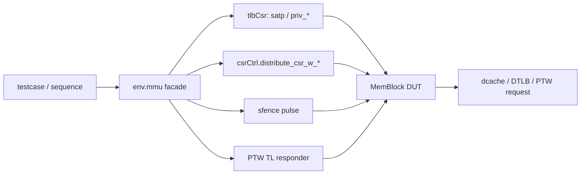

# MemBlock MMU Env 设计与使用说明

## 1. 文档目的

本文档面向 `src/test/python/MemBlock/` 中需要复用 MMU/PTW/DTLB 环境的测试开发者，回答三个问题：

1. 当前 MemBlock Python env 中的 MMU 支撑到底由哪些组件组成。
2. 为什么这些能力收敛到 `env.mmu` facade，而不是继续由 testcase 自己拼装。
3. 编写 translation/replay 相关 testcase 时，推荐的使用顺序和调试方法是什么。

本文档聚焦“环境如何搭起来并稳定复用”，具体的 `matchInvalid + nuke` 场景原理见：

- `src/test/python/MemBlock/docs/dtlb_fill_and_replacement_cases.md`
- `src/test/python/MemBlock/docs/mmu_h_extension_cases.md`
- `src/test/python/MemBlock/docs/mmu_fault_directed_cases.md`
- `src/test/python/MemBlock/docs/sq_matchinvalid_nuke_case_analysis.md`

## 2. 设计背景

在本轮补强之前，MemBlock Python env 对 MMU 路径的支持存在三个主要问题：

1. `satp/priv_*` 这类 `tlbCsr` 输入会被 `idle_inputs()` 清掉，testcase 很容易在中途被动切回 M-mode。
2. PTW responder 只返回单个 D beat，无法覆盖 `size=6` 的 64B page-table walk。
3. S-mode translation 即使 page table 正确，仍会因为 PMP 默认 deny 而卡在权限背景上。

这些问题的共同特点是：它们都不是单个 testcase 的业务逻辑，而是所有 MMU 场景共享的“外围控制面稳定性问题”。因此这轮设计选择不是继续在 testcase 里堆 local helper，而是把通用能力收敛到 `env.mmu`。

## 3. 总体设计

当前 MMU 环境由四部分组成：

1. `env.mmu` facade
2. `tlbCsr/csrCtrl` 输入重放机制
3. PTW TileLink responder
4. PMP 分布式 CSR 编程 helper

对应关系如下：



这套设计的核心原则是：

- testcase 只表达“我要切换到哪套 MMU 背景”
- env 负责把输入保活、把 PTW 响应补全、把 PMP 权限打通
- 观测仍通过现有 env facade 和 replay helper 收口，不在 testcase 中直接散落内部端口轮询

## 4. `env.mmu` facade 的职责边界

当前 `env.mmu` 主要提供以下 public helper：

- `enable_sv39(root_pt_addr=..., asid=..., settle_cycles=...)`
- `configure_smode_access(sum=..., mxr=..., persistent=..., vsum=..., vmxr=...)`
- `enable_vs_sv39(root_pt_addr=..., asid=..., settle_cycles=...)`
- `enable_two_stage_sv39(vs_root_pt_addr=..., g_root_pt_addr=..., vs_asid=..., vmid=..., settle_cycles=...)`
- `disable_translation()`
- `enable_svpbmt(pmm_menvcfg=..., pmm_henvcfg=...)`
- `disable_svpbmt()`
- `install_sv39_mapping(root_pt_addr=..., va=..., pa_base=..., page_size="4k", pbmt=..., page_table_page_addrs=(...))`
- `install_vs_sv39_mapping(...)`
- `install_g_sv39_mapping(...)`
- `pulse_sfence(...)`
- `pulse_hfence_vvma(...)`
- `pulse_hfence_gvma(...)`
- `write_distributed_csr(addr=..., data=..., persistent=...)`
- `program_pmp_entry(index=..., cfg=..., addr=..., persistent=...)`
- `program_pmp_deny_region(base_addr=..., size=..., index=..., persistent=...)`
- `allow_all_smode_access(index=..., persistent=...)`
- `ptw_responder(response_delay_cycles=...)`

职责边界如下：

### 4.1 由 `env.mmu` 负责的事情

1. 驱动 `satp_mode/satp_ppn/priv_imode/priv_dmode` 等 translation 输入。
2. 为 testcase 显式暴露 `SUM/MXR` 这类权限相关 CSR 背景，而不是让权限场景依赖隐式默认值。
3. 在 `idle_inputs()` 之后重新施加活跃的 Sv39 状态。
4. 在 DUT reset 之后重放持久化的 PMP CSR 写入。
5. 为 PTW TileLink A 请求返回完整的多拍 D 响应。
6. 提供 testcase 可直接复用的 page-table helper。
7. 为 Svpbmt/uncache testcase 提供稳定的 PBMT 控制面。
7. 为 VS-only / two-stage translation 提供统一 active-mode、H fence 与 fault 观测契约。

### 4.2 不由 `env.mmu` 负责的事情

1. 不替 testcase 决定虚拟地址如何布局。
2. 不替 testcase 自动登记 load/store compare expectation。
3. 不替 testcase 推断 replay 是否“应该发生”。
4. 不在 env 层内置某个 testcase 专用的断言语义。

换句话说，`env.mmu` 负责把“MMU 外围”变成稳定基础设施，但 testcase 自己仍然负责“这个场景到底要证明什么行为”。

## 5. Sv39/PTW/PMP 的实现要点

### 5.1 Sv39 输入保活

`enable_sv39()` 做的不是一次性写寄存器，而是：

1. 更新 env 内部的活跃 Sv39 状态。
2. 驱动 `satp_changed=1`。
3. 下一拍重新施加稳定值。
4. 发送一次 `sfence`。
5. 等待若干拍让 DUT 状态收敛。

这使得 testcase 后续即使执行了普通 `env.advance_cycles()` 或触发了 `idle_inputs()`，translation 背景也不会被意外清空。

### 5.2 PTW responder 必须返回 multi-beat D

MemBlock 当前 PTW TL 端口的 beat 宽度是 256 bit，即 32B。Sv39 根表项访问可能发出 `size=6` 的 64B 请求，因此 responder 不能只返回一个 D beat。

当前 env 中的 PTW responder 会：

1. 读取 TL-A `opcode/size/source/address`
2. 依据 `size` 计算总字节数
3. 从黄金内存中按 32B 切分请求范围
4. 按顺序逐拍在 D 通道返回 `AccessAckData`

这一步是 MMU smoke 和后续 replay 场景能稳定跑通的关键前提。

### 5.3 PMP 必须显式放开 S-mode

仅有 `satp + page table` 仍不足以让 S-mode translation 成功，因为 DUT 内部还会走 PMP 检查。

当前推荐最小做法是：

```python
env.mmu.allow_all_smode_access()
```

它会通过 `csrCtrl.distribute_csr_w_*` 编程一个覆盖全物理地址空间的 RWX NAPOT PMP entry。默认建议把这类 CSR 写入设为 `persistent=True`，这样 reset 后也会自动重放。

如果 testcase 需要验证“同一 translated 背景下，某个物理 region 被 PMP deny，而 region 外继续允许”，当前推荐直接使用：

```python
env.mmu.program_pmp_deny_region(
    base_addr=deny_region_base,
    size=0x1000,
    index=0,
    persistent=False,
)
env.mmu.allow_all_smode_access(index=1, persistent=False)
```

这组 helper 的推荐分工是：

1. `index=0` 放更高优先级的 deny-region；
2. `index=1` 保留全空间 allow-all fallback；
3. testcase 只表达“哪一段地址该 fault，哪一段地址该继续成功”，不在测试文件里手写 PMP NAPOT 地址编码。

### 5.4 Svpbmt / PBMT 分类控制

当前 env 已新增最小 Svpbmt 控制面，便于 testcase 显式安装：

- `pbmt="cacheable"`
- `pbmt="ncio"` / `pbmt="nc"`
- `pbmt="mmio"` / `pbmt="io"`

推荐写法：

```python
env.mmu.enable_svpbmt()
env.mmu.install_sv39_mapping(
    root_pt_addr=root_pt,
    va=uncache_va,
    pa_base=uncache_pa_base,
    page_table_page_addrs=page_table_page_addrs,
    pbmt="ncio",
)
```

需要注意：

1. `enable_svpbmt()` 先解决的是 env 侧控制面稳定性，而不是直接宣告 real DUT 已经把所有 translated NCIO/MMIO 细节都完整导出到现有 debug/monitor。
2. 因此当前相关 testcase 采用“helper + capability probe”双轨：
   - helper 已固定，可重复复用；
   - 若 real DUT 仍未稳定给出预期分类或提交语义，testcase 会用精确条件 `xfail` 记录 gap，而不是 silently 降级成普通 smoke。
3. 当前 `install_sv39_mapping()` 只支持 `page_size="4k"`，并要求调用方显式提供 `page_table_page_addrs` 作为中间页表页地址池，env 不会隐式分配页表页。

### 5.5 H extension / two-stage 控制面

当前 env 已把 H 扩展最小控制面收口为公开契约：

1. `enable_vs_sv39()`
   - 驱动 `vsatp_*`
   - 驱动 `priv_virt=1`
   - 在 `idle_inputs()` / `reset()` 后继续重放 VS-only 背景
2. `enable_two_stage_sv39()`
   - 同时驱动 `vsatp_*`、`hgatp_*`、`priv_virt`
   - 当前 `hgatp.mode` 固定为 `Sv39x4`
   - `g_root_pt_addr` 需要按 16KB 对齐
3. `disable_translation()`
   - 会同时清空 `satp` / `vsatp` / `hgatp` / `priv_virt`

### 5.5.1 两阶段页表安装口径

当前两阶段 helper 保持 `Sv39 + 4KB-only`：

- VS-stage：`install_vs_sv39_mapping()`
- G-stage：`install_g_sv39_mapping()`
- sequence：`TwoStageSv39AddressSpaceInstallSequence`

使用时要注意：

1. `vs_root_pt_addr` 与 VS-stage 中间页表页在 two-stage 背景下按 guest-physical 语义理解。
2. 如果 VS 页表实际驻留在 host memory，testcase 需要通过 G-stage mapping 把这些 guest-physical 页表页映射到可访问的 HPA。
3. `translated_preloads` 默认预置到最终 HPA，不要求 testcase 手算两阶段合成地址。

### 5.5.2 H fence 与 fault 观测

当前 env 已提供：

- `pulse_hfence_vvma(rs1=..., rs2=..., addr=..., asid=...)`
- `pulse_hfence_gvma(rs1=..., rs2=..., addr=..., vmid=...)`
- `env.wait_load_fault_observed(...)`
- `env.sample_mmu_fault_state()`

这里的 helper 参数按“是否做筛选”表达，而不是直接透传 DUT bundle：

1. `rs1=False`
   - 语义是 `all addr`
   - env 会把 DUT bundle 的 `bits_rs1` 编成 `1`
2. `rs1=True`
   - 语义是 `specific addr`
   - env 会把 DUT bundle 的 `bits_rs1` 编成 `0`
3. `rs2=False`
   - 语义是 `all asid/vmid`
   - env 会把 DUT bundle 的 `bits_rs2` 编成 `1`
4. `rs2=True`
   - 语义是 `specific asid/vmid`
   - env 会把 DUT bundle 的 `bits_rs2` 编成 `0`

另外 `hfence.gvma` 只驱动 `hg=1`，不会把 `hv` 误置高。

首批稳定口径：

1. `hfence.vvma`
   - `all addr / all asid`
   - `all addr / specific asid`
2. `hfence.gvma`
   - `all addr / all vmid`
   - `all addr / specific vmid`
3. load fault 摘要返回：
   - `exception_bits`
   - `vaddr`
   - `gpaddr`
   - `is_guest_page_fault`
   - `is_page_fault`
   - `is_access_fault`

当前不把 `hfence.vvma` 的按地址精确 flush 作为 must-pass 主线；已知 DUT 限制与当前 xfail 口径见 `mmu_h_extension_cases.md`。

## 6. 推荐使用流程

对于一个最小 Sv39 cacheable load smoke，推荐流程是：

```python
state = ResetEnvSequence(
    require_issue_lanes=(0,),
    require_lq_ready=True,
).run(env)

env.mmu.install_sv39_mapping(
    root_pt_addr=root_pt,
    va=main_va,
    pa_base=pa_base,
    page_table_page_addrs=page_table_page_addrs,
)
env.preload_u64(main_pa, expected_data)
env.mmu.allow_all_smode_access()

with env.mmu.ptw_responder():
    env.mmu.enable_sv39(root_pt_addr=root_pt)
    txn = LoadTxn(
        req_id=0,
        addr=main_va,
        lq_ptr=state.next_lq_ptr,
        sq_ptr=state.sq_ptr,
    )
    env.backend.prepare(txn)
    env.expect_scalar_load(rob_idx=txn.rob_idx, pdest=txn.resolved_pdest, addr=main_pa)
    send_load(env, txn)
    env.wait_load_writeback_observed(
        rob_idx=txn.rob_idx,
        data=expected_data,
    )
```

这套流程中最重要的顺序约束是：

1. 先装 page table，再开 Sv39。
2. 先开 PTW responder，再发 translation load。
3. 先放开 PMP，再期待 S-mode 请求成功。
4. 结束场景后，如果后续步骤需要回到 bare 模式，应显式调用 `env.mmu.disable_translation()`。

## 6.1 推荐的 sequence 组织方式

在当前版本里，推荐把 MMU 相关 testcase 拆成“地址空间配置”和“行为触发”两层：

1. `MmuSv39AddressSpaceInstallSequence`
   - 单次只配置一套 root page table 和相关 preload。
   - 如果 testcase 需要 root-A/root-B，直接多次调用 install sequence。

2. `MmuSv39ActivateSequence`
   - 用于“切 root + 可选 prime loads”的通用场景。

3. `MmuDtlbReplacementSequence`
   - 用于“跨大范围虚拟页填满 DTLB，并通过 overflow + reprobe 证明替换发生”的定向场景。
   - 对外直接返回每次 translated load 的 PTW trace 增量、可选 TLB 调试摘要，以及首个有效 `io_l2_tlb_req_*` 摘要，testcase 不必自己散落 callback。

4. H extension reusable sequence
   - `MmuVsStageLoadSequence`
   - `MmuTwoStageLoadSequence`
   - `MmuTwoStageFenceSequence`
   - `MmuTwoStageFaultSequence`
   - 统一返回两阶段地址解析、PTW trace 与 fault 摘要

5. 专题 trigger sequence
   - 例如 `ScalarSqDataInvalidMatchInvalidTriggerSequence`。
   - 当某个 testcase 对时序顺序特别敏感时，可以把 `enable_sv39()` / `TLB prime` 放进 trigger 内部，这样可以保住“bare older store 必须发生在 activation 之前”这类真实 DUT 依赖。

也就是说，`env.mmu` 负责稳定控制面，sequence 负责把这些控制面按场景顺序拼起来。

## 7. 推荐的调试入口

当 MMU 场景失败时，建议按下面顺序排查：

### 7.1 先看 translation 是否真的活着

可优先看：

- `env.mmu.enable_sv39(...)` 是否在发请求前调用
- `env.mmu.disable_translation()` 是否被过早调用
- `idle_inputs()` 后 Sv39 状态是否仍在

### 7.2 再看 PTW 是否闭环

可优先看：

- `ptw_responder.trace`
- `env.sample_replay_state()`
- `io_l2_tlb_req_*`
- `env.fetch_to_mem`

其中当前三类观测口径分别用于回答不同问题：

1. `ptw_responder.trace`
   - 证明 PTW TileLink A/D 是否真的发出和返回。
2. `io_l2_tlb_req_*`
   - 作为 load/store-side TLB miss/refill 的辅助证据。
   - 当前已在 `MmuDtlbProbeEvent.l2_tlb_port` 中统一收口，`MmuDtlbAccessResult.first_l2_tlb_req` 进一步保留首个有效摘要。
   - 它仍是“辅助判据”，不是唯一真源；`miss_observed` 仍按 `first_miss/l2_tlb_req/PTW trace` 的并集口径计算。
3. `env.fetch_to_mem`
   - 用于 frontend ITLB request/response 的顶层调试。
   - 它与 `io_l2_tlb_req_*` 不是同一条链路：前者是 `fetch_to_mem.itlb`，后者是 LSU 对 `l2_tlb_req` 的 debug/probe 口。

如果看到长时间 `TM` / TLB replay，通常优先怀疑：

1. page table 没装对
2. responder 没挂上
3. responder 仍只回了一个 beat

### 7.3 再看 PMP/权限背景

如果 page table 看起来正常，但 load 迟迟不回写，且 replay 现象像权限失败，优先确认：

- `env.mmu.allow_all_smode_access()` 是否已经执行
- reset 后是否仍然保留了 PMP 编程结果

### 7.4 最后再看 cache / replay 行为

当 translation 已闭环后，再去区分：

- 是 dcache hit 还是 miss
- 是否走 outer/NC 路径
- 是否触发了 `memoryViolation`
- 是否出现 `matchInvalid/dataInvalid`

这样能避免把“外围没搭起来”误判成“业务逻辑没打通”。

## 8. 当前已验证的能力边界

截至当前版本，env.mmu 及其配套 sequence 已经被真实 DUT 验证过的能力包括：

1. Sv39 4KB 页表映射安装
2. PTW 多拍 D 响应
3. PMP 放开后的 S-mode cacheable load
4. `idle_inputs()` 与 reset 后的 MMU 状态重放
5. 基于 4KB translated load 的 DTLB fill / re-hit / replacement 定向场景
6. 基于新 MMU 环境的 `sq dataInvalid + matchInvalid + nuke` replay 场景
7. H extension 下的 VS-only state/fault facade、two-stage guest fault 与 PMP access-fault directed case
8. 基于 `env.fetch_to_mem` 的 frontend ITLB top-level request handshake smoke，以及可选的 PTW/顶层 response 观测

当前仍保留两条明确限制：

1. `hfence.vvma` 的按地址精确 flush 不作为首批硬断言。
2. 当前真实 DUT 在 two-stage success path 上尚未稳定产生正常 writeback，因此 `basic/rehit/hfence` 组被精确标记为 `xfail`；fault 组仍保持硬断言。

但仍要注意，`env.mmu` 并不意味着“所有 store translation 组合都已经稳定抽象好了”。当前 `matchInvalid_nuke` 场景之所以采用“install address spaces in test + bare older store + translated younger load”的组织方式，正是因为这个组合最符合当前 DUT 的稳定可观测行为。

## 9. 相关文件

- `src/test/python/MemBlock/MemBlock_env.py`
- `src/test/python/MemBlock/tests/test_MemBlock_env_mmu_smoke.py`
- `src/test/python/MemBlock/tests/test_MemBlock_mmu_h_extension.py`
- `src/test/python/MemBlock/sequences/memblock_sequences.py`
- `src/test/python/MemBlock/docs/dtlb_fill_and_replacement_cases.md`
- `src/test/python/MemBlock/docs/mmu_h_extension_cases.md`
- `src/test/python/MemBlock/tests/test_MemBlock_replay.py`
- `src/test/python/MemBlock/docs/sq_matchinvalid_nuke_case_analysis.md`
