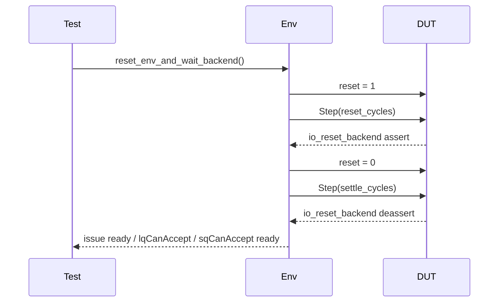
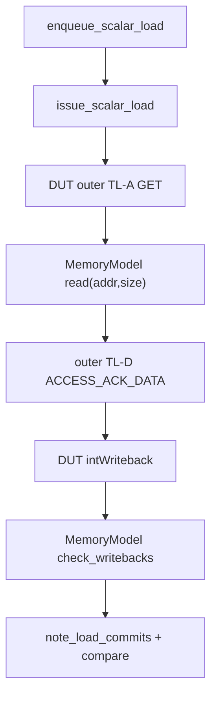
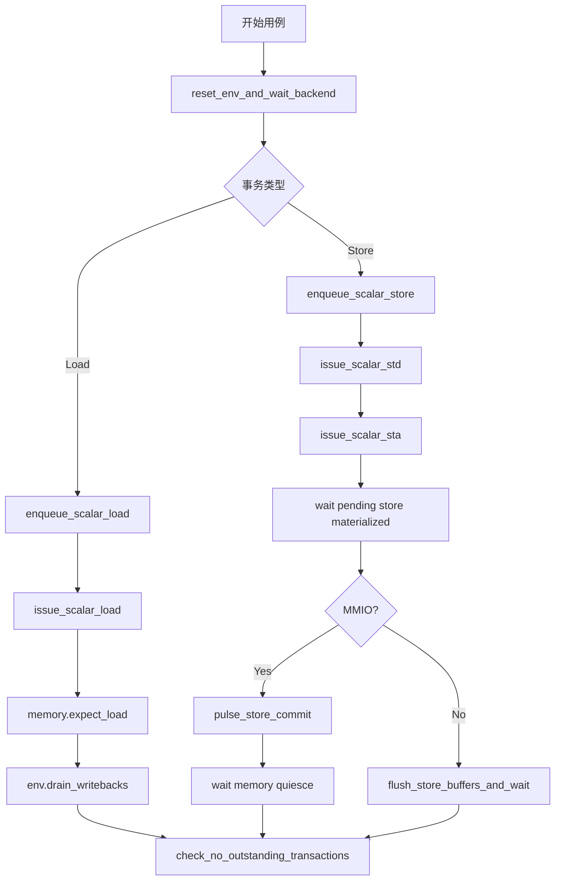

# MemBlock 测试时序与扩展指南

## 1. 文档目的

本文件从“如何按现有环境规则编写和扩展测试”的角度整理流程。

相比 `verification_env_design.md`，本文件更强调：

1. 用例写作顺序。
2. 时序上的隐含约束。
3. 常见失败原因定位。
4. 扩展新场景时应该修改哪一层。

## 2. 推荐的分层思维

面对一个新场景，建议先回答四个问题：

1. 它只是新的测试序列，还是需要新的端口绑定。
2. 它是否需要新的 MemoryModel 语义。
3. 它的正确性应该在运行中在线检查，还是在结尾统一检查。
4. 它属于 outer 路径、dcache 路径，还是 store 内部状态路径。

推荐的分层是：

1. `MemBlock_api.py`
2. `MemBlock_env.py`
3. `memory_model.py`
4. `request_apis.py`
5. `tests/*.py`

一般不要跳层。

## 3. 标准测试初始化流程

几乎所有真实 DUT 用例都应从一次完整复位开始。

标准过程是：

1. 申请 `env` fixture。
2. 调用 `reset_env_and_wait_backend()`。
3. 检查 `dut.reset == 0`。
4. 检查 `io_reset_backend == 0`。
5. 检查需要的 ready 口已恢复。

对应时序图如下：



## 4. Load 测试的标准骨架

一个最小 load 用例建议按以下顺序组织：

1. 复位环境。
2. 预置黄金内存。
3. enqueue load。
4. issue load。
5. 登记期望值。
6. 等待写回收敛。
7. 断言计数和无残留事务。

伪代码如下：

```python
stream_state = _reset_env_and_state(env)
env.memory.preload_u64(addr, data)
enqueue_scalar_load(env, req_id, stream_state.next_lq_ptr, stream_state.sq_ptr)
issue_scalar_load(env, req_id, addr, stream_state.next_lq_ptr, stream_state.sq_ptr)
env.memory.expect_load(...)
env.drain_writebacks()
env.check_no_outstanding_transactions()
```

### 4.1 为什么 `expect_load()` 放在 issue 后

现有用例通常先 issue，再登记期望。

这在当前环境中是可行的，原因是：

1. 请求真正完成写回还需要经过 DUT 执行和 MemoryModel 事务延迟。
2. 在 issue 之后立即登记期望，时序上足够早。

如果后续引入零延迟路径或更激进的 mock，则可以考虑在 issue 前登记期望，以减少竞态风险。

### 4.2 为什么最后要 `check_no_outstanding_transactions()`

因为一次数据 compare 成功，并不代表环境已经完全收敛。

仍可能残留：

- outer D 响应未发送完。
- dcache D/E 事务未清空。
- 期望队列未清空。

这个检查是为了避免“主断言已过，但后台还有未完成事务”的假阳性。

## 5. IO 地址 load 路径

当地址位于 `< 0x80000000` 的区间时，现有测试假设它走 IO / uncache 路径。

典型行为链：

1. 测试通过 `enqueue_scalar_load()` 分配条目。
2. 测试通过 `issue_scalar_load()` 发地址。
3. DUT 在 outer TL-A 发出 `GET`。
4. `MemoryModel` 从 `golden memory` 取数据并排队返回 outer TL-D。
5. DUT 最终在 `intWriteback` 上写回数据。
6. `MemoryModel` 在 commit 边界 compare。

示意图如下：



这个路径下，测试通常应断言：

1. `outer_request_count` 增长。
2. `dcache_a_request_count` 不增长。
3. `dcache_d_response_count` 不增长。
4. `dcache_e_request_count` 不增长。

## 6. Cacheable 地址 load 路径

当地址位于 `> 0x80000000` 的区间时，现有测试假设它走 cacheable 路径。

典型行为链：

1. 测试 enqueue load。
2. 测试 issue load。
3. DUT 在 dcache A 通道发出 `AcquireBlock`。
4. `MemoryModel` 从黄金内存读出 cacheline。
5. `MemoryModel` 在 dcache D 通道返回一个或多个 `GrantData` beat。
6. DUT 通过 E 通道返回 `GrantAck`。
7. DUT 最终完成 writeback。
8. `MemoryModel` 在 commit 边界 compare。

这个路径下，测试通常应断言：

1. `outer_request_count` 不增长。
2. `dcache_a_request_count` 增长。
3. `dcache_d_response_count` 增长。
4. `dcache_e_request_count` 增长。

## 7. MMIO store 路径

MMIO store 的关键点不在 load compare，而在“是否走对了外设路径”。

标准流程是：

1. 复位。
2. enqueue store。
3. issue STD。
4. issue STA。
5. 等待 `pending_store` materialize。
6. 触发一次 `pulse_store_commit(1)`。
7. 等待 memory quiesce。
8. 断言 outer 写请求增长，且没有 sbuffer drain。

### 7.1 为什么要等待 materialize

因为 store 的地址、数据、mask、属性来自多个来源。

如果只做 enqueue 和 issue，然后立即断言，往往拿不到稳定状态。

等待 materialize 本质上是在等下面这些信息收敛到同一个 SQ entry：

- `allocated`
- `addr`
- `data`
- `mask`
- `mmio`

### 7.2 MMIO store 的关键判断

现有环境下，MMIO store 的主要验证信号是：

1. `store.mmio == True`
2. `outer_write_request_count` 增长
3. `sbuffer_drain_count` 不增长

## 8. Cacheable store 路径

cacheable store 的关键点在于：

1. 是否完成地址和数据 materialize。
2. 是否进入 committed。
3. 是否在最终 flush 后以 drain 形式写出。
4. drain 结果是否与黄金内存一致。

标准流程是：

1. enqueue store
2. issue STD
3. issue STA
4. 等 committed store materialize
5. 等 `sbuffer_drain_count` 增长
6. 调用 `flush_store_buffers_and_wait()`
7. 检查 `drain_summary`

### 8.1 为什么不是每拍在线 compare

因为 store 的可见性比 load 更复杂。

store 可能经历：

1. 进入 SQ
2. 地址后到
3. 数据后到
4. committed
5. sbuffer drain
6. outer 写出

现有环境选择的是：

- 过程上观测 shadow。
- 结果上检查最终 drain 与 goldenmem。

这比逐拍严格 compare 更稳妥，也更适合当前主路径回归。

## 9. Store 后接同地址 load 的场景

`test_api_MemBlock_single_cacheable_store_then_load_same_addr` 是当前最重要的时序案例之一。

它验证的是：

- younger load 在 commit 视图上是否能看到 older store 的值。

核心机制不是 store-forwarding 的内部瞬时细节，而是：

1. store 先进入 ready-for-retire 状态。
2. load 发起并最终写回。
3. `MemoryModel` 在 `_try_complete_loads()` 中，先退休 boundary 之前的 store。
4. 然后再读取 golden memory 来 compare 当前 load。

这意味着：

- 即使 DUT 内部具体是转发还是从缓存命中拿到数据，只要最终提交视图一致，测试就会通过。

## 10. `PendingPtrDriver` 对测试的影响

写新用例时，经常容易忽略 `PendingPtrDriver` 的存在。

它的影响有三点：

1. 只有已 issue 的 load 才会进入 pending 顺序。
2. 只有已完成的 load 才能推动 pending 指针前移。
3. younger load 不会无条件越过 older incomplete load。

因此，如果你构造了多个 load 并发现后面的 load 没有按预期退休，要先检查：

1. older load 是否已经 `note_load_issued()`。
2. older load 是否已经有 writeback。
3. `lqDeq` 是否真的给出了提交预算。

## 11. `lqDeq` 对 compare 的影响

当前 compare 的必要条件之一是：

- 有可用的 `committed_load_budget`

而这个预算来自：

- `mem_status.lqDeq`

所以即使你已经看到：

- `intWriteback.valid = 1`
- 数据看起来也对

也不要立刻断言 compare 已完成。

必须等：

- `MemoryModel.note_load_commits(...)`

把提交预算送进去。

## 12. `drain_writebacks()` 的正确用法

`env.drain_writebacks(max_cycles)` 的退出条件是：

1. `outstanding_expected_count == 0`
2. `outstanding_transaction_count == 0`

因此它适合用于：

- load-only 场景
- 发完一个 load 后等待整体收敛
- mixed 场景中每个 load 发完后做局部收敛

不适合把它当成 store 最终结束条件。

store 最终结束应优先用：

- `flush_store_buffers_and_wait()`

## 13. `flush_store_buffers_and_wait()` 的正确用法

这个 API 做了三件事：

1. 拉起 `sfence_valid`
2. 拉起 `flushSb`
3. 等待 `sbIsEmpty`

随后它还会：

1. 再推进 `settle_cycles`
2. 调用 `memory.finalize_and_check_drain()`

因此它的语义不是“只发一个 flush 脉冲”，而是“发 flush 并等待 store 视图收敛”。

## 14. 常见失败模式

### 14.1 等待 enqueue ready 超时

常见原因：

1. 复位后 backend 还未真正退出 reset。
2. `lqCanAccept` 或 `sqCanAccept` 未恢复。
3. 用例前一阶段残留事务未收敛。

优先检查：

1. 是否调用了 `reset_env_and_wait_backend()`。
2. 当前是否还在 reset。
3. 上一个事务是否在预期周期内结束。

### 14.2 等待 issue 握手超时

常见原因：

1. lane 选错。
2. DUT 当前条件下该 lane 不 ready。
3. 输入组合缺字段，DUT 不接受该请求。

优先检查：

1. 是否使用了默认 lane。
2. `issue[lane].ready` 是否曾经拉高。
3. `sqIdx/lqIdx/robIdx` 是否匹配。

### 14.3 观测到未登记的 load writeback

这是 `MemoryModel` 的典型保护性断言。

常见原因：

1. 发了 load，但忘了 `expect_load()`。
2. 一个用例重用了 `req_id` / `robIdx`，但没有同步状态。
3. 有额外 load 被 DUT 自发触发，而测试没有意识到。

### 14.4 `drain_writebacks()` 超时

常见原因：

1. 期望 load 未完成。
2. 还有未完成的 outer/dcache 事务。
3. `lqDeq` 没有给到预算。

### 14.5 `flush_store_buffers_and_wait()` 超时

常见原因：

1. store 根本没进入可 drain 状态。
2. `sbIsEmpty` 一直不为 1。
3. flush 之前 store shadow 本身就不完整。

### 14.6 drain 数据与 goldenmem 不一致

常见原因：

1. store 地址或 mask 被错误解释。
2. 一笔 store 该退役时没有退役，或不该退役时被退役。
3. sbuffer drain 的地址低位归一化理解错误。

## 15. 扩展新测试时优先改哪里

### 15.1 只是新组合序列

如果只是把现有 enqueue/issue/flush API 换一种组合方式，优先只改：

- `tests/*.py`

### 15.2 需要新的驱动动作

如果要新增一种标准驱动动作，例如新的 issue 变体，优先改：

- `request_apis.py`

### 15.3 需要新的端口绑定

如果 DUT 新导出了调试口或控制口，优先改：

- `MemBlock_env.py`

### 15.4 需要新的在线比对规则

如果要增加新的 compare 或新的事务解释，优先改：

- `memory_model.py`

## 16. 扩展新场景的建议流程

1. 先写一个最小失败用例。
2. 再判断是环境缺端口、缺驱动还是缺模型语义。
3. 先补 Bundle 或 API。
4. 再补 `MemoryModel`。
5. 最后把新场景整理成可复用 helper。

不要一开始就在测试文件里堆一长串裸信号赋值。

## 17. 调试顺序建议

当一个真实 DUT 用例失败时，建议按下面顺序看：

1. 复位是否完成。
2. ready 信号是否恢复。
3. enqueue 是否真的成功。
4. issue 是否真的 handshake。
5. outer / dcache 事务计数是否增长。
6. writeback 是否出现。
7. `lqDeq` 是否出现。
8. `pending_stores` 或 `drain_log` 是否符合预期。

这个顺序的优点是：

- 从输入到输出逐层缩小问题范围。

## 18. 建议保留的断言风格

现有测试代码的断言风格值得保留：

1. 每个阶段有局部断言。
2. 每个路径有 transport 计数断言。
3. 收尾阶段统一调用无残留事务检查。
4. 出错信息尽量包含 `req_id`、`sqIdx`、`addr` 等关键索引。

这种风格在回归失败时定位速度更快。

## 19. 对未来场景的具体建议

### 19.1 replay / violation

如果要增加 replay 或 violation 场景，建议优先利用：

- `memoryViolation_*`
- `redirect`
- `pendingPtr`

先构造最小单条或双条事务，不要直接上随机流。

### 19.2 异常 store

如果要增加异常 store 场景，重点要看：

- `store_addr_re_inputs.hasException`
- `PendingStore.ready_for_retire`

预期是异常 store 不应污染黄金内存。

### 19.3 backpressure

当前环境很少主动制造外部 backpressure。

如果要覆盖该类场景，建议先明确：

1. 是对 outer A ready 做 backpressure。
2. 还是对 dcache D/B 返回节奏做 backpressure。
3. 还是对 writeback ready 做 backpressure。

然后只在一个方向上加压，避免把失败根因混在一起。

## 20. Mermaid 总览图

下面这张图总结了当前真实 DUT 测试推荐流程：



## 21. 小结

如果把这套环境的使用规则压缩成几句话，可以概括为：

1. 先复位，再发事务。
2. load 用 `expect_load + drain_writebacks` 收敛。
3. store 用 shadow 观测过程，用 `flush_store_buffers_and_wait` 收尾。
4. 看到 writeback 不等于 compare 已完成，必须等提交预算。
5. 扩展能力时优先补环境和模型，不要把复杂逻辑塞进单个测试里。
