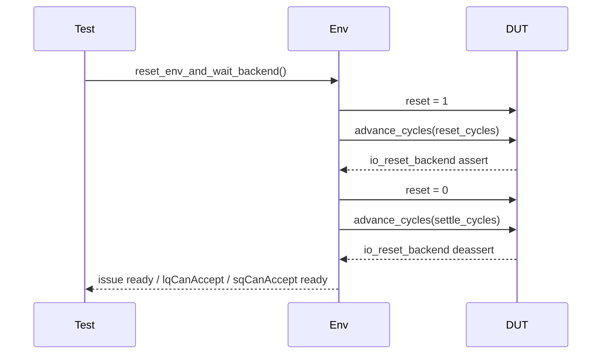
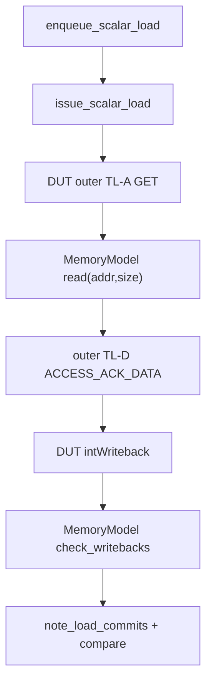
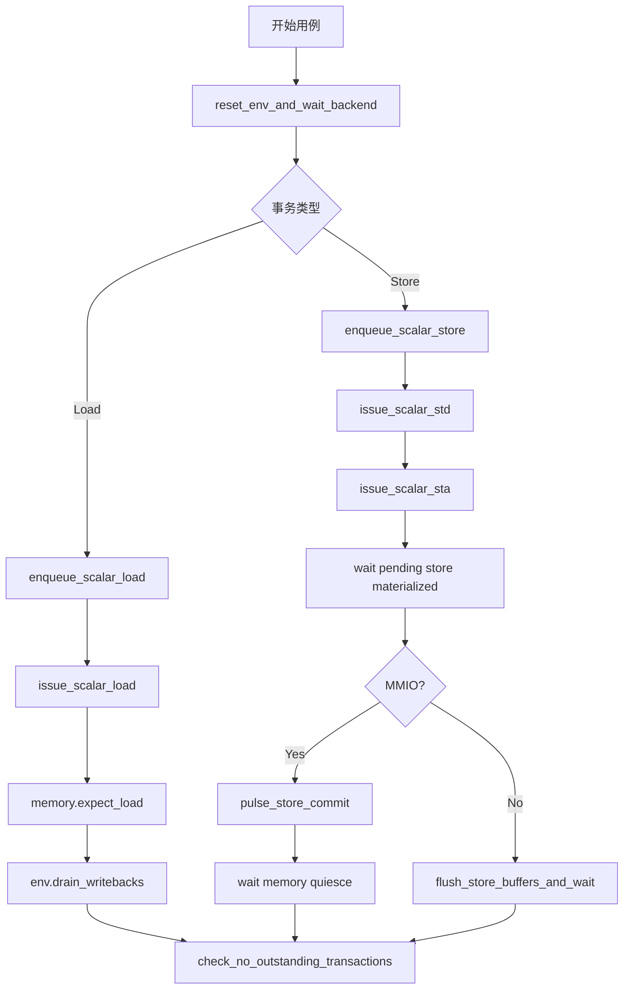

# MemBlock 测试时序与扩展指南

## 1. 文档目的

本文件从“如何按现有环境规则编写和扩展测试”的角度整理流程。

相比 `verification_env_design.md`，本文件更强调：

1. 用例写作顺序。
2. 时序上的隐含约束。
3. 常见失败原因定位。
4. 扩展新场景时应该修改哪一层。

## 2. 推荐的分层思维

面对一个新场景，建议先回答四个问题：

1. 它只是新的测试序列，还是需要新的端口绑定。
2. 它是否需要新的 MemoryModel 语义。
3. 它的正确性应该在运行中在线检查，还是在结尾统一检查。
4. 它属于 outer 路径、dcache 路径，还是 store 内部状态路径。

推荐的分层是：

1. `MemBlock_api.py`
2. `MemBlock_env.py`
3. `sequences/`
4. `transactions.py`
5. `request_apis.py`
6. `monitors/` / `model/`
7. `tests/*.py`

一般不要跳层。

其中建议明确区分两类职责：

- `transactions.py`
  - 负责公共事务对象、队列指针工具和拍级计划对象，例如 `LoadTxn` / `StoreTxn` / `ptr_inc()` / `BackendSendPlan` / `IssueOp`
- `request_apis.py`
  - 只保留 backend primitive helper 和兼容包装，例如 `send_load()` / `send_store()`
- `sequences/`
  - 负责 testcase 作者真正复用的场景模板

## 3. 标准测试初始化流程

几乎所有真实 DUT 用例都应从一次完整复位开始。当前更推荐通过 `ResetEnvSequence` 完成，而不是在 testcase 中直接拼 `reset_env_and_wait_backend()`。

当前 `ResetEnvSequence` 默认会在 reset 完成后，把 backend allocator 和 ROB commit frontier 一起 seed 到 wrap 边界前一项。这样大多数真实 DUT 回归都会自然跨过一次 `(0, rob_size-1) -> (1, 0)`，避免为每条 testcase 额外复制一份“wrap 版本”。

如果某类 env/unit test 需要明确保留 `(0,0)` 起点，应：

1. 直接使用 `env.reset(...)`；
2. 或显式构造 `ResetEnvSequence(seed_wrap_boundary=False)`。

标准过程是：

1. 申请 `env` fixture。
2. 调用 `reset_env_and_wait_backend()`。
3. 检查 `dut.reset == 0`。
4. 检查 `io_reset_backend == 0`。
5. 检查需要的 ready 口已恢复。
6. 若未显式关闭 boundary profile，则 allocator/frontier 已定位到 wrap 边界前一项。

对应时序图如下：



## 4. Load 测试的标准骨架

一个最小 load 用例建议按以下顺序组织：

1. 复位环境。
2. 预置黄金内存。
3. enqueue load。
4. issue load。
5. 登记期望值。
6. 等待写回收敛。
7. 断言计数和无残留事务。

伪代码如下：

```python
state = ResetEnvSequence(require_issue_lanes=(0,), require_lq_ready=True).run(env)
env.preload_u64(addr, data)
txn = LoadTxn(req_id=req_id, addr=addr, lq_ptr=state.next_lq_ptr, sq_ptr=state.sq_ptr)
ScalarLoadSequence(txn, expected_completed_loads=1, assert_no_outstanding=True).run(env)
```

如果当前场景还没抽成高层 sequence，而你又需要在 primitive 层直接驱动，推荐的最小骨架是：

```python
from transactions import LoadTxn

txn = LoadTxn(req_id=req_id, addr=addr, lq_ptr=lq_ptr, sq_ptr=sq_ptr)
env.backend.send(txn)
env.expect_scalar_load(rob_idx=txn.rob_idx, pdest=txn.resolved_pdest, addr=txn.addr)
env.drain_writebacks()
```

这里的关键约束是：

1. 主动控制统一走 `env.backend`。
2. `req_id` 只作为请求标签，不再隐式推导 `rob_idx/pdest/ftq/pc`。
3. load compare 仍通过 `env.expect_scalar_load()` 登记，但需要使用已经 prepare/send 绑定好的 runtime 字段。
4. primitive 场景结束后仍要显式调用 `drain_writebacks()` 或更强的收敛检查。

如果你需要表达“多条 load 同拍 issue”或“load 与 sta/std 混合同拍 issue”，先问自己这是不是一个稳定业务场景，以及你真正想证明的是“同拍组合”还是“在 backpressure 下持续打满”。

如果答案是“是”，优先抽成 sequence，例如：

```python
from sequences import ScalarLoadBatchSameCycleSequence

ScalarLoadBatchSameCycleSequence((load0, load1, load2)).run(env)
```

如果答案是“不是，而是我正在验证某个拍级组合是否可达”，再直接构造 `BackendSendPlan` / `IssueCyclePlan`：

```python
from transactions import BackendSendPlan, EnqueueLoadCyclePlan, IssueCyclePlan, IssueOp

env.backend.execute(
    BackendSendPlan.from_steps(
        EnqueueLoadCyclePlan.from_txns(load0, load1),
        IssueCyclePlan.from_ops(
            IssueOp.load_from_txn(load0),
            IssueOp.sta(req_id=sta_req_id, sq_ptr=sta_sq_ptr, addr=sta_addr, lane=3),
        ),
    )
)
```

如果你关心的是 `ready` 反压下的持续吞吐，而不是“所有 lane 必须同拍一起 fire”，请显式切到 elastic 模式：

```python
IssueCyclePlan.from_ops(
    IssueOp.load_from_txn(load0),
    IssueOp.load_from_txn(load1),
    handshake_mode="elastic",
)
```

这里的 `elastic` 表示 lane 级握手，但接受结果是在 post-step 相位观察的：env 会先保持这条 lane 的 drive 过一个周期，再根据 step 之后可见的接受结果决定是否 retire 该 lane；还没被接受的 lane 会继续保留原请求直到成功。

旧的 `send_load_batch_same_cycle()` / `send_load_batch_with_sta_same_cycle()` 仍保留作兼容包装，但不再作为后续扩接口的方向；新的 testcase 应避免再从 `request_apis.py` 导入这类场景级 helper。

如果你要写的是向量访存场景，而不是标量 load/store，请不要直接把这一节的标量骨架硬改成 `vecIssue` 脚本；应优先改用：

- `VectorMemTxn`
- `env.vector_backend`
- `VectorLoadSequence` / `VectorStoreSequence`

更完整的设计背景、当前 smoke 口径和使用示例见：

- `src/test/python/MemBlock/docs/vmem_design_and_usage.md`

### 4.1 什么时候写 plan，什么时候写 sequence

可以用一个很实用的判断标准：

1. 如果你关心的是“这一拍 backend/issue 到底发了哪些 lane、这些 lane如何同拍组合”，优先写 strict `IssueCyclePlan`。
2. 如果你关心的是“在 lane 级 `ready` 反压下能否持续把请求压进去”，优先写 elastic `IssueCyclePlan` 或封装好的 saturation sequence。
   其中 `ScalarLoadSaturationSequence` 会自动把 drain 预算提升到 replay 场景同等级，避免满载 replay/backpressure 下 compare 预算过短。
3. 如果你关心的是“这个测试场景从 reset 到收敛应该怎么组织”，优先写 sequence。
4. 如果某个 primitive 脚本已经在多个 testcase 中重复出现，就不要继续把它散落在测试里，应该上提成 sequence。

也就是说：

- `plan` 更偏底层发送结构，适合探路、debug、验证某个新组合是否可达；
- `sequence` 更偏 testcase 模板，适合沉淀稳定场景、统一 reset/expect/drain/materialize/commit 等固定流程。

推荐工作流通常是：

1. 先用 `env.backend.execute(...)` 写出最短可运行脚本；
2. 确认路径可达后，把外层固定流程收敛成 sequence；
3. 最终让 testcase 尽量消费 sequence result，而不是长期手拼 backend 细节。

### 4.2 backend / ROB 场景下，什么时候继续写 plan

随着当前 ROB 半模型已经支持：

- `non_mem` blocker
- store `token + readiness`
- `BackendSendPlan` 中的 ROB 语义步骤

现在的一个常见问题是：**这类场景到底还算“backend plan”，还是应该直接上提成 sequence？**

推荐判断方式如下：

1. 如果你关心的是“ROB 连续前缀怎么被卡住/放开”，优先继续写 plan。
2. 如果你关心的是“这个业务场景从 reset 到 compare/drain 应该怎么组织”，优先写 sequence。
3. 如果一个 `NonMemBlockerStep` / `StoreCommitReadyStep` 脚本已经在多个 testcase 中重复出现，就应该把它外层收敛成 sequence，而不是长期散落在 tests 里。

也就是说：

- `plan`
  - 更适合表达：
    - `NonMemBlockerStep.insert(...)`
    - `StoreCommitReadyStep(...)`
    - `StoreCommitStep(...)`
    - 与 `IssueCyclePlan` 交织的拍级顺序
- `sequence`
  - 更适合表达：
    - “older non-mem 挡住 younger store，再 release 后恢复提交”的完整 testcase 模板
    - “older unready store 阻塞 younger mem，再切 ready 后恢复”的稳定验证场景

一个经验规则是：

> 如果你还在调“哪一拍插 blocker / 哪一拍 release / 哪一拍给 token”，就先写 plan；  
> 如果你已经清楚这个脚本就是某类 ROB 场景的固定模板，就该开始抽 sequence。

### 4.3 一个应继续保留为 plan 的例子

下面这种脚本更适合继续停留在 primitive plan 层，因为它的重点是拍级结构本身：

```python
from transactions import (
    BackendSendPlan,
    EnqueueStoreStep,
    IssueCyclePlan,
    IssueOp,
    NonMemBlockerStep,
    RobIndex,
    StoreCommitStep,
    StoreRef,
)

store_ref = StoreRef("younger_store")

env.backend.execute(
    BackendSendPlan.from_steps(
        NonMemBlockerStep.insert(rob_idx=RobIndex(flag=0, value=0x40)),
        EnqueueStoreStep.from_txn(store_txn, ref=store_ref),
        IssueCyclePlan.from_ops(
            IssueOp.std(req_id=store_txn.req_id, sq_ptr=store_ref, data=store_txn.data, mask=store_txn.mask)
        ),
        IssueCyclePlan.from_ops(
            IssueOp.sta(req_id=store_txn.req_id, sq_ptr=store_ref, addr=store_txn.addr, mask=store_txn.mask)
        ),
        StoreCommitStep(count=1),
        NonMemBlockerStep.release(rob_idx=RobIndex(flag=0, value=0x40)),
        StoreCommitStep(count=1),
    )
)
```

这个例子里，测试者真正关心的是：

- blocker 插入的位置对 younger store 的影响；
- first commit pulse 为什么还不能放行；
- release 后哪一拍 frontier 恢复。

这些问题本质上都是“拍级脚本问题”，因此 plan 最合适。

### 4.4 一个应该上提成 sequence 的例子

如果多个 testcase 都在重复这样的业务套路：

1. reset 环境
2. 发 older load/store
3. 插入一个 non-mem blocker
4. 发 younger mem
5. 验证 blocker 期间 younger 不提交/不 compare
6. release blocker
7. 再验证恢复提交和最终无 outstanding

那就不要继续让每个 testcase 都手拼 `BackendSendPlan` + `expect/drain/assert`。更推荐的做法是：

- 保留底层 plan 作为 sequence 内部实现；
- 对外提供一个语义更清楚的 sequence，例如：
  - `ScalarNonMemBlockerOrderingSequence`
  - `ScalarStoreReadinessBlockingSequence`

这样 testcase 最终关心的就不再是：

- 第几拍插 `NonMemBlockerStep`
- 第几拍写 `StoreCommitReadyStep`

而是：

- 这个 ROB 顺序场景是否符合预期

### 4.5 与 cookbook 的关系

如果你已经知道自己要写的是 backend / ROB 类 testcase，推荐按下面顺序使用文档：

1. `backend_rob_cookbook.md`
   - 快速找模板，先把脚本写出来
2. 当前文件
   - 判断这个模板应继续保留为 plan，还是该上提成 sequence
3. `backend_request_model_design.md`
   - 看对象设计与接口边界
4. `rob_model.md`
   - 看当前 ROB 半模型的长期边界与设计背景

### 4.6 为什么 `expect_load()` 放在 issue 后

当前 `ScalarLoadSequence` 已经把 “send_load + expect_load + drain_writebacks” 这一标准骨架封装起来。保留这一节，是为了说明 sequence 内部仍沿用了先 issue、再登记期望的顺序。

这在当前环境中是可行的，原因是：

1. 请求真正完成写回还需要经过 DUT 执行和 MemoryModel 事务延迟。
2. 在 issue 之后立即登记期望，时序上足够早。

如果后续引入零延迟路径或更激进的 mock，则可以考虑在 issue 前登记期望，以减少竞态风险。

### 4.7 为什么最后要 `check_no_outstanding_transactions()`

因为一次数据 compare 成功，并不代表环境已经完全收敛。

仍可能残留：

- outer D 响应未发送完。
- dcache D/E 事务未清空。
- 期望队列未清空。

这个检查是为了避免“主断言已过，但后台还有未完成事务”的假阳性。

### 4.8 推荐优先复用的高层 sequence

当 testcase 不再是“单笔 primitive”而是“一个完整场景”时，更推荐直接使用高层 sequence，而不是在测试文件里手工拼循环和指针推进。

当前建议优先复用：

1. `ScalarLoadBurstSequence`
   - 顺序执行一组 `(req_id, addr)` 标量 load。
   - 自动维护 `next_lq_ptr`、完成数和 transport stats 快照。

2. `ScalarStoreCommitSequence`
   - 在 `ScalarStoreSequence` 之后追加 `env.backend.pulse_store_commit()`、settle 和可选 quiesce。

3. `ScalarStoreThenLoadSequence`
   - 封装 `older store -> younger load` 的标准时序，适合 same-addr / unrelated-addr 两类场景。

4. `ScalarStoreFlushSequence`
   - 封装 `store -> sbuffer drain growth -> flushSb -> drain summary check`。

5. `ScalarMixedTrafficSequence`
   - 顺序执行一组 `("store", addr, data)` / `("load", addr, None)` 操作，并可在结尾自动 flush。

6. `ScalarForwardFailReplaySequence`
   - 封装 `STA -> younger same-addr load -> replay -> STD -> commit -> load complete`。
   - 用于真实 DUT 下的 `FF` replay 冒烟。

7. `ScalarCacheMissReplaySequence`
   - 封装单条 cold cacheable load 的 `DM` replay 观测与最终收敛。

8. `ScalarNcReplaySequence`
   - 封装单条 IO/uncache load 的 `NC` replay / `nc_out` 观测与最终收敛。

9. `ScalarRawReplaySequence`
   - 封装 `older store 只分配不补全地址/数据 -> 多条 younger load -> RAW backpressure/replay -> store release -> load 收敛`。
   - 用于真实 DUT 下的 `RAW` replay 冒烟。

10. `ScalarRarViolationSequence`
   - 封装 `older load 因精确 load-wait 暂停 -> younger same-addr load 先完成 -> probe/release -> RAR nuke -> older load 重新写回`。
   - 用于真实 DUT 下的 `RAR` ld-ld violation 冒烟。
   - `probe_after_younger_writeback_cycles` 用来显式区分 `release early/late`；不要再把 probe 注入时机隐式绑在默认 transport delay 上。

11. `MmuSv39AddressSpaceInstallSequence`
   - 单次只安装一套地址空间的 Sv39 4KB mappings / preload，不隐式切换 active root。
   - 调用方需要显式提供 `page_table_page_addrs`，用于中间页表页分配。
   - 适合在 testcase 中多次调用，分别配置 root-A / root-B。

12. `MmuSv39ActivateSequence`
   - 封装 `enable_sv39()` 加可选的 prime loads。
   - 适合只需要“切 root + 打热 translation”的普通 MMU testcase。

13. `ScalarSqDataInvalidMatchInvalidTriggerSequence`
   - 封装 `bare older store(仅 STA) -> 可选切到 Sv39 root-B -> 可选 TLB prime -> younger translated load -> 观测 dataInvalid + matchInvalid + memoryViolation -> 补 STD/commit 收尾`。
   - 用于真实 DUT 下的 `sq dataInvalid + matchInvalid + nuke` 冒烟。
   - 当前推荐由 testcase 先组织 `MmuSv39AddressSpaceInstallSequence`，再调用该 trigger sequence。

14. `MmuFaultingScalarLoadSequence`
   - 封装 `prime load(optional) -> TLB-hit 背景下的主 faulting load -> 异常写回/transport 统计收口`。
   - 用于 `MMU/TLB/PMP fault matrix` 这类 load-side fault directed。

15. `ScalarBankConflictLoadClusterSequence`
   - 封装 `cache warmup -> 多条 load 同拍发射 -> bank-conflict/debugLsInfo 采样 -> final writeback/wakeup 收尾`。
   - 用于 `BC` 基线与更复杂 probe 场景的公共前置。
   - warmup 只完成 writeback/compare 还不够；进入主场景前必须显式等 memory quiesce，并再留出少量 settle cycles，避免命中场景退化成 cold miss。

16. `ScalarFastReplayCancelledByReplayHiPrioSequence`
   - 封装 `bank-conflict fast replay` 被更高优先级 replay 请求抢占、改落 replay queue，且最终 compare/writeback 仍全部收敛。
   - 用于 `forward_dchannel` / `nc_replay` 抢占下的 probe 型 testcase。

17. `ScalarLateStaStoreLoadViolationSequence`
   - 封装 `older store 晚到 STA -> younger bank-conflict load 先走 fast replay -> 之后触发 st-ld violation -> store commit/drain 收尾`。
   - 用于 `late-STA` 相关的 load pipeline probe。

### 4.9 replay 观测辅助 API

当前 env 已经把真实 DUT replay 观测收口成公共 helper，testcase 不需要自己逐拍扫内部信号：

1. `env.sample_replay_state()`
   - 返回当前拍的 replay 相关快照。
   - 包含 `replay_queue_entries`、`replay_lanes`、`ldu_lanes`、`nc_out_lanes` 和 `memory_violation`。

2. `env.wait_replay_event(...)`
   - 在限定周期内等待一条匹配条件的 replay 事件。
   - 支持按 `cause/source/rob_idx/sq_idx` 过滤。

3. `env.wait_nc_replay_or_nc_out(...)`
   - 针对 NC/uncache load 的快捷等待接口。
   - 接受 replay queue、replay lane、`ldu` replay 或 `nc_out` 任一可见来源。

4. `env.collect_replay_window(cycles, ...)`
   - 在一个窗口里收集 replay 事件列表，适合做小范围 trace 断言。

5. `env.wait_nuke_query_backpressure(kind=..., ...)`
   - 等待 `RAW/RAR` nuke query 出现 `valid && !ready`。
   - 适合 `RAW` 或后续 `RAR full` 场景。

6. `env.wait_release_event(...)`
   - 等待 `MemBlock_inner_lsq_io_release_*` 导出的 cacheline release 事件。
   - 适合 `RAR` ld-ld violation 场景。

7. `env.wait_rar_nuke_response(...)`
   - 等待 `rarNukeQuery.resp.valid && bits.nuke`。
   - 返回时会回填最近一次同 lane 的 req 元信息，方便 testcase 直接按 `rob/lq` 断言。

8. `env.wait_load_writeback_observed(...)`
   - 直接在 `intWriteback` 口等待某条 load 的写回，而不要求它已经进入 commit compare。
   - 适合像 `RAR` 这样需要区分“younger 已先写回，但 commit compare 仍被 older 阻塞”的场景。

对于 translation 相关 testcase，还应优先复用：

9. `env.mmu`
   - 统一提供 `enable_sv39()`、`disable_translation()`、`install_sv39_mapping()`、`allow_all_smode_access()` 和 `ptw_responder()`。
   - 这样 testcase 不需要自己 monkey-patch `idle_inputs()`、也不需要再本地复制 PTW/PMP helper。

10. `MmuSv39AddressSpaceInstallSequence`
   - 用 sequence 形式复用“单地址空间配置”。
   - 如果一个 testcase 同时需要 root-A/root-B，两次调用 install sequence 即可，不必再把 A/B 配置耦合进一个大 config。

更完整的 MMU 使用说明见：

- `src/test/python/MemBlock/docs/dtlb_fill_and_replacement_cases.md`
- `src/test/python/MemBlock/docs/mmu_env_design_and_usage.md`
- `src/test/python/MemBlock/docs/mmu_fault_directed_cases.md`
- `src/test/python/MemBlock/docs/sq_matchinvalid_nuke_case_analysis.md`
- `src/test/python/MemBlock/docs/scalar_load_pipeline_probe_cases.md`

这些 helper 的判定真值固定来自真实 DUT 导出的 replay 相关端口，而不是 Python 侧 mock tracker。

## 4.10 容易犯的时序错误

这类错误在默认 transport delay 变短时最容易暴露。后续新增 directed case 时，默认按下面几条规则写：

1. 不要把关键事件窗口隐式绑在默认 transport delay 上。
   - 反例：`wait_load_writeback_observed()` 一返回就立刻 `inject_dcache_probe()`，希望“自然形成 late release”。
   - 正例：把窗口写成 sequence 参数，例如 `probe_after_younger_writeback_cycles`、`raw_window_settle_cycles`。

2. 不要把 “warmup load 已 writeback/compare” 当成 “dcache hit-path 已稳定”。
   - 对需要 hot-cache 命中的场景，warmup 后还要显式 `wait_memory_quiesce()`，必要时再 `advance_cycles()` 若干拍。
   - 尤其是 `bank conflict`、`NK`、`dataInvalid + hit-path` 这类 probe case，否则主场景很容易退化成 `dcache first miss` 或错过瞬时 replay cause。

3. 对瞬时 debug/query/release 事件，优先用 “capture trace + trace-first + wait fallback” 模式。
   - 反例：刺激已经发完，再单独调用 `_wait_load_debug_event()` / `wait_nuke_query_backpressure()` / `wait_release_event()`，默认假设目标事件还没消失。
   - 正例：在主刺激窗口外层先挂 `_capture_load_debug_trace()` / `_capture_nuke_query_trace()` / `_capture_release_trace()`，先从 trace 里找目标事件，找不到再 fallback 到 wait helper。

## 5. IO 地址 load 路径

当地址位于 `< 0x80000000` 的区间时，现有测试假设它走 IO / uncache 路径。

典型行为链：

1. 测试通过 `enqueue_scalar_load()` 分配条目。
2. 测试通过 `issue_scalar_load()` 发地址。
3. DUT 在 outer TL-A 发出 `GET`。
4. `MemoryModel` 从 `golden memory` 取数据并排队返回 outer TL-D。
5. DUT 最终在 `intWriteback` 上写回数据。
6. `MemoryModel` 在 commit 边界 compare。

示意图如下：



这个路径下，测试通常应断言：

1. `outer_request_count` 增长。
2. `dcache_a_request_count` 不增长。
3. `dcache_d_response_count` 不增长。
4. `dcache_e_request_count` 不增长。

## 6. Cacheable 地址 load 路径

当地址位于 `> 0x80000000` 的区间时，现有测试假设它走 cacheable 路径。

典型行为链：

1. 测试 enqueue load。
2. 测试 issue load。
3. DUT 在 dcache A 通道发出 `AcquireBlock`。
4. `MemoryModel` 从黄金内存读出 cacheline。
5. `MemoryModel` 在 dcache D 通道返回一个或多个 `GrantData` beat。
6. DUT 通过 E 通道返回 `GrantAck`。
7. DUT 最终完成 writeback。
8. `MemoryModel` 在 commit 边界 compare。

这个路径下，测试通常应断言：

1. `outer_request_count` 不增长。
2. `dcache_a_request_count` 增长。
3. `dcache_d_response_count` 增长。
4. `dcache_e_request_count` 增长。

## 7. MMIO store 路径

MMIO store 的关键点不在 load compare，而在“是否走对了外设路径”。

标准流程是：

1. 复位。
2. enqueue store。
3. issue STD。
4. issue STA。
5. 等待 `pending_store` materialize。
6. 触发一次 `env.backend.pulse_store_commit(1)`。
7. 等待 memory quiesce。
8. 断言 outer 写请求增长，且没有 sbuffer drain。

### 7.1 为什么要等待 materialize

因为 store 的地址、数据、mask、属性来自多个来源。

如果只做 enqueue 和 issue，然后立即断言，往往拿不到稳定状态。

等待 materialize 本质上是在等下面这些信息收敛到同一个 SQ entry：

- `allocated`
- `addr`
- `data`
- `mask`
- `mmio`

### 7.2 MMIO store 的关键判断

现有环境下，MMIO store 的主要验证信号是：

1. `store.mmio == True`
2. `outer_write_request_count` 增长
3. `sbuffer_drain_count` 不增长

## 8. Cacheable store 路径

cacheable store 的关键点在于：

1. 是否完成地址和数据 materialize。
2. 是否进入 committed。
3. 是否在最终 flush 后以 drain 形式写出。
4. drain 结果是否与黄金内存一致。

标准流程是：

1. 运行 `ScalarStoreSequence` 或 `ScalarStoreFlushSequence`
2. 等 committed store materialize
3. 等 `sbuffer_drain_count` 增长
4. 运行 `FlushStoreBuffersSequence`，或直接读取 `ScalarStoreFlushSequenceResult.drain_summary`
5. 检查 `drain_summary`

### 8.1 为什么不是每拍在线 compare

因为 store 的可见性比 load 更复杂。

store 可能经历：

1. 进入 SQ
2. 地址后到
3. 数据后到
4. committed
5. sbuffer drain
6. outer 写出

现有环境选择的是：

- 过程上观测 shadow。
- 结果上检查最终 drain 与 goldenmem。

这比逐拍严格 compare 更稳妥，也更适合当前主路径回归。

## 9. Store 后接同地址 load 的场景

`test_api_MemBlock_single_cacheable_store_then_load_same_addr` 是当前最重要的时序案例之一。

现在更推荐直接通过 `ScalarStoreThenLoadSequence` 表达这个场景，而不是在 testcase 中手工维护：

- `sq_ptr`
- `lq_ptr`
- store materialize / committed 等待
- load 发起后的 completed_load 断言

它验证的是：

- younger load 在 commit 视图上是否能看到 older store 的值。

核心机制不是 store-forwarding 的内部瞬时细节，而是：

1. store 先进入 ready-for-retire 状态。
2. load 发起并最终写回。
3. `MemoryModel` 在 `_try_complete_loads()` 中，先退休 boundary 之前的 store。
4. 然后再读取 golden memory 来 compare 当前 load。

这意味着：

- 即使 DUT 内部具体是转发还是从缓存命中拿到数据，只要最终提交视图一致，测试就会通过。

## 10. `PendingPtrDriver` 对测试的影响

写新用例时，经常容易忽略 `PendingPtrDriver` 的存在。

它的影响有三点：

1. 只有已 issue 的 load 才会进入 pending 顺序。
2. 只有已完成的 load 才能推动 pending 指针前移。
3. younger load 不会无条件越过 older incomplete load。

因此，如果你构造了多个 load 并发现后面的 load 没有按预期退休，要先检查：

1. older load 是否已经通过 `env.backend` 驱动过 load issue，并因此登记到 ROB/scoreboard。
2. older load 是否已经有 writeback。
3. `lqDeq` 是否真的给出了提交预算。

## 11. `lqDeq` 对 compare 的影响

当前 compare 的必要条件之一是：

- 有可用的 `committed_load_budget`

而这个预算来自：

- `mem_status.lqDeq`

所以即使你已经看到：

- `intWriteback.valid = 1`
- 数据看起来也对

也不要立刻断言 compare 已完成。

必须等：

- `MemoryModel.note_load_commits(...)`

把提交预算送进去。

## 12. `drain_writebacks()` 的正确用法

`env.drain_writebacks(max_cycles)` 的退出条件是：

1. `outstanding_expected_count == 0`
2. `outstanding_transaction_count == 0`

因此它适合用于：

- load-only 场景
- 发完一个 load 后等待整体收敛
- mixed 场景中每个 load 发完后做局部收敛

不适合把它当成 store 最终结束条件。

store 最终结束应优先用：

- `flush_store_buffers_and_wait()`

## 13. `flush_store_buffers_and_wait()` 的正确用法

这个 API 做了三件事：

1. 拉起 `sfence_valid`
2. 拉起 `flushSb`
3. 等待 `sbIsEmpty`

随后它还会：

1. 再推进 `settle_cycles`
2. 调用 `memory.finalize_and_check_drain()`

因此它的语义不是“只发一个 flush 脉冲”，而是“发 flush 并等待 store 视图收敛”。

## 14. 常见失败模式

### 14.1 等待 enqueue ready 超时

常见原因：

1. 复位后 backend 还未真正退出 reset。
2. `lqCanAccept` 或 `sqCanAccept` 未恢复。
3. 用例前一阶段残留事务未收敛。

优先检查：

1. 是否调用了 `reset_env_and_wait_backend()`。
2. 当前是否还在 reset。
3. 上一个事务是否在预期周期内结束。

### 14.2 等待 issue 握手超时

常见原因：

1. lane 选错。
2. DUT 当前条件下该 lane 不 ready。
3. 输入组合缺字段，DUT 不接受该请求。

优先检查：

1. 是否使用了默认 lane。
2. `issue[lane].ready` 是否曾经拉高。
3. `sqIdx/lqIdx/robIdx` 是否匹配。

### 14.3 观测到未登记的 load writeback

这是 `MemoryModel` 的典型保护性断言。

常见原因：

1. 发了 load，但忘了 `expect_load()`。
2. 一个用例重用了 `req_id` / `robIdx`，但没有同步状态。
3. 有额外 load 被 DUT 自发触发，而测试没有意识到。

### 14.4 `drain_writebacks()` 超时

常见原因：

1. 期望 load 未完成。
2. 还有未完成的 outer/dcache 事务。
3. `lqDeq` 没有给到预算。

### 14.5 `flush_store_buffers_and_wait()` 超时

常见原因：

1. store 根本没进入可 drain 状态。
2. `sbIsEmpty` 一直不为 1。
3. flush 之前 store shadow 本身就不完整。

### 14.6 drain 数据与 goldenmem 不一致

常见原因：

1. store 地址或 mask 被错误解释。
2. 一笔 store 该退役时没有退役，或不该退役时被退役。
3. sbuffer drain 的地址低位归一化理解错误。

## 15. 扩展新测试时优先改哪里

### 15.1 只是新组合序列

如果只是把现有 enqueue/issue/flush API 换一种组合方式，优先只改：

- `tests/*.py`

### 15.2 需要新的驱动动作

如果要新增一种标准驱动动作，例如新的 issue 变体，优先改：

- `request_apis.py`

### 15.3 需要新的端口绑定

如果 DUT 新导出了调试口或控制口，优先改：

- `MemBlock_env.py`

### 15.4 需要新的在线比对规则

如果要增加新的 compare 或新的事务解释，优先改：

- `memory_model.py`

## 16. 扩展新场景的建议流程

1. 先写一个最小失败用例。
2. 再判断是环境缺端口、缺驱动还是缺模型语义。
3. 先补 Bundle 或 API。
4. 再补 `MemoryModel`。
5. 最后把新场景整理成可复用 helper。

不要一开始就在测试文件里堆一长串裸信号赋值。

## 17. 调试顺序建议

当一个真实 DUT 用例失败时，建议按下面顺序看：

1. 复位是否完成。
2. ready 信号是否恢复。
3. enqueue 是否真的成功。
4. issue 是否真的 handshake。
5. outer / dcache 事务计数是否增长。
6. writeback 是否出现。
7. `lqDeq` 是否出现。
8. `pending_stores` 或 `drain_log` 是否符合预期。

这个顺序的优点是：

- 从输入到输出逐层缩小问题范围。

## 18. 建议保留的断言风格

现有测试代码的断言风格值得保留：

1. 每个阶段有局部断言。
2. 每个路径有 transport 计数断言。
3. 收尾阶段统一调用无残留事务检查。
4. 出错信息尽量包含 `req_id`、`sqIdx`、`addr` 等关键索引。

这种风格在回归失败时定位速度更快。

## 19. 对未来场景的具体建议

### 19.1 replay / violation

当前真实 DUT 环境已经内建了一批可直接复用的 replay 能力：

- replay sequence
  - `ScalarForwardFailReplaySequence`
  - `ScalarCacheMissReplaySequence`
  - `ScalarNcReplaySequence`
  - `ScalarRawReplaySequence`
  - `ScalarRarViolationSequence`
- replay helper
  - `sample_replay_state()`
  - `wait_replay_event()`
  - `wait_nc_replay_or_nc_out()`
  - `collect_replay_window()`
  - `wait_nuke_query_backpressure()`
  - `wait_release_event()`
  - `wait_rar_nuke_response()`
  - `wait_load_writeback_observed()`

当前版本最稳定的 replay 覆盖对象是：

1. `FF`
   - older store 地址已知、数据未就绪时的 forward-fail replay。
2. `DM`
   - cold cacheable load 的 dcache miss replay。
3. `NC`
   - IO/uncache load 的 replay / `nc_out` 可见路径。
4. `RAW`
   - older store 长时间不补全地址时的 raw backpressure / replay。
5. `RAR`
   - older load 被精确 load-wait 挂住、younger same-addr load 先完成并在 probe/release 下触发的 ld-ld violation。

继续扩 replay 或 violation 场景时，仍建议遵循以下顺序：

1. 先构造最小单条或双条事务。
2. 先断言 replay 事件出现，再断言最终 writeback compare 通过。
3. 若涉及 redirect / violation，再额外结合：
   - `memoryViolation_*`
   - `redirect`
   - `pendingPtr`

`ScalarRarViolationSequence` 的推荐使用方式固定为：

1. 先分配一条 fake older store，但只发 `STD`，故意不发 `STA`。
2. 让 older load 带 `loadWaitBit/storeSetHit/waitForRobIdx`，精确等待这条 fake store。
3. 发 younger same-addr load，并直接用 `wait_load_writeback_observed()` 证明它先拿到旧值。
4. 通过 `inject_dcache_probe()` 和 `wait_release_event()` 构造真实 release。
5. 再补 fake store 的 `STA` 释放 older load。
6. 用 `wait_rar_nuke_response()` 断言真实的 `RAR nuke` 命中。
7. 最后等待 older load 写回新值，并在 commit-boundary compare 完成后收尾。

不要一开始就把 replay、redirect、backpressure 和随机流混在同一个 testcase 里。

### 19.2 异常 store

如果要增加异常 store 场景，重点要看：

- `store_addr_re_inputs.hasException`
- `PendingStore.ready_for_retire`

预期是异常 store 不应污染黄金内存。

### 19.3 backpressure

当前环境很少主动制造外部 backpressure。

如果要覆盖该类场景，建议先明确：

1. 是对 outer A ready 做 backpressure。
2. 还是对 dcache D/B 返回节奏做 backpressure。
3. 还是对 writeback ready 做 backpressure。

然后只在一个方向上加压，避免把失败根因混在一起。

## 20. Mermaid 总览图

下面这张图总结了当前真实 DUT 测试推荐流程：



## 21. 小结

如果把这套环境的使用规则压缩成几句话，可以概括为：

1. 先复位，再发事务。
2. load 用 `expect_load + drain_writebacks` 收敛。
3. store 用 shadow 观测过程，用 `flush_store_buffers_and_wait` 收尾。
4. 看到 writeback 不等于 compare 已完成，必须等提交预算。
5. 扩展能力时优先补环境和模型，不要把复杂逻辑塞进单个测试里。
