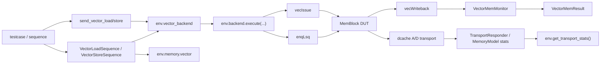

# MemBlock 向量访存环境设计与使用说明

## 1. 文档目的

本文档面向 `src/test/python/MemBlock/` 中需要编写或扩展向量访存 testcase / sequence 的开发者，回答四个问题：

1. 当前 MemBlock Python env 里的向量访存支持到底由哪些层组成。
2. 为什么当前设计选择把向量控制面收敛到 `enqLsq + vecIssue + env.vector_backend`，而不是让 testcase 直接写 pin-level 时序。
3. 编写 unit-stride / stride 场景时，推荐使用哪些 public helper。
4. 当前已经被真实 DUT 证明的能力边界是什么，哪些点仍然是显式 known gap。

本文档聚焦“环境如何设计、当前如何使用”，更细的 Phase 1 规划和专题设计见：

- `src/test/python/MemBlock/docs/vector_mem_plan.md`
- `src/test/python/MemBlock/docs/vector_mem_phase1_plan.md`
- `src/test/python/MemBlock/docs/vector_mem_phase1_plan_vec_model.md`
- `src/test/python/MemBlock/docs/vector_mem_phase1_plan_backend_api.md`

## 2. 当前能力快照

截至当前版本，向量访存环境已经具备以下能力：

- 已接入真实 DUT 的 `enqLsq` 与 `vecIssue` front-door。
- 已提供 `VectorMemTxn`、`VectorEnqueueStep`、`VectorIssueStep`、`VectorWaitStep`，并复用统一的 `BackendSendPlan` runtime。
- 已提供 `env.vector_backend` facade，以及 `send_vector_load()` / `send_vector_store()` 兼容 helper。
- 已提供 `VectorLoadSequence` / `VectorStoreSequence` 作为 testcase 侧的最小 sequence 壳层。
- 已提供 `env.memory.vector`，可对 unit-stride / stride、`mask_bits`、`vstart` 做 element-level 展开。
- 已提供 `VectorMemMonitor`，可观测 vector writeback / completion / trap 事实。
- 已在真实 DUT 上跑通并收紧数据面断言的 load regression：
  - unit-stride load
  - positive stride load
  - non-zero `vstart` 的 unit-stride load（保留 prestart 空洞）
- 已有一条 real-DUT vector store regression，可稳定复现当前已知 DUT 缺口。

同时也要明确当前边界：

- 当前 real-DUT 已明确证明：
  - load front-door 已打通
  - load dcache transport 已发生
  - vector completion / writeback metadata 可稳定观测
  - unit-stride / stride / non-zero `vstart` 三条 load 数据面可做严格 compare
- 当前尚未在 smoke 中收紧：
  - merge / oldVd / partial-write 相关更复杂 load 数据面语义
  - vector store 的真实 DUT 最终 memory-effect 回归
  - vector coverage collector

换句话说，当前环境已经从 scalar-only 推进到 vector-capable；其中 load 已不再只是“请求面/完成面闭环”，而是已经证明了第一批真实数据面 compare。尚未闭环的主要缺口集中在 vector store 最终 drain / memory effect，以及更复杂的 RVV merge 类语义。

## 3. 总体设计

当前向量访存支持由 6 层组成：

1. `VectorMemTxn`
2. `env.vector_backend`
3. 统一 `env.backend.execute(BackendSendPlan(...))`
4. `LsqAgent.enqueue_vector_mem()` + `VectorIssueAgent.issue()`
5. `VectorMemMonitor`
6. `env.memory.vector`

关系如下：



这套设计有三个核心原则：

### 3.1 不另起第二套 plan runtime

向量访存虽然 front-door 与标量不同，但仍然继续复用 `BackendSendPlan`。这样可以避免：

- testcase 同时维护两套主动控制语法
- vector/scalar 混合场景未来难以编排
- 为向量访存再造一套平行 runtime

因此当前 `env.vector_backend.send(txn)` 的本质，是生成：

1. `VectorEnqueueStep`
2. `VectorIssueStep`
3. `VectorWaitStep`

然后交给现有 `env.backend.execute(...)`。

### 3.2 front-door 固定为 `enqLsq + vecIssue`

当前向量访存请求不是只打一拍 `vecIssue` 就结束，而是必须同时经过：

- `enqLsq` 负责 LSQ 侧条目分配
- `vecIssue` 负责真正把向量访存语义送入后端

因此 testcase 不应只盯住某一侧端口，也不应在本地复制“先 enq 再 issue”的时序脚本。这个顺序应由 facade / plan runtime 统一承担。

### 3.3 monitor 与 model 分工保持清晰

- `VectorMemMonitor`
  - 负责采集“DUT 实际上发生了什么”
  - 包括 completion、trap、writeback metadata、调试字段
- `VectorMemoryModel`
  - 负责给出“按当前参考语义应当是什么”
  - 包括 element-level address 展开、`mask_bits` / `vstart` 分类、load/store 参考结果

testcase 应把这两类事实分开使用，而不是把 monitor 直接当 model，也不要把 model 假设伪装成 DUT 观测。

## 4. 关键公共接口

## 4.1 `VectorMemTxn`

`VectorMemTxn` 是当前向量访存场景的统一事务对象，定义于：

- `src/test/python/MemBlock/transactions.py`

最常用字段如下：

- `req_id`
  - 同时决定 `robIdx_flag/value` 与默认 `pdest`
- `is_load`
  - `True` 表示 vector load，`False` 表示 vector store
- `opcode_class`
  - 当前只支持 `unit_stride` 与 `stride`
- `base_addr`
  - 向量访存基地址
- `stride`
  - 仅 stride 类事务使用
- `lq_ptr` / `sq_ptr`
  - 事务所绑定的 LSQ 指针
- `vl`
  - 当前向量长度
- `element_count`
  - Python 参考模型需要展开的元素数量
- `sew_bits`
  - 当前支持 `8/16/32/64`
- `vstart`
  - 用于 prestart / active 分类
- `mask_bits`
  - 可选；长度至少覆盖 `element_count`
  - 当 `vm=False` 且未显式覆盖 `src_3` / `vmask` 时，env 会按 `mask_bits` 自动派生真实 DUT 使用的 mask 源
- `store_data`
  - store 事务使用；长度至少覆盖 `element_count`
- `enq_port` / `issue_port`
  - 允许 testcase 指定期望前门端口
- `num_ls_elem`
  - 显式覆盖 `enqLsq.bits_numLsElem` 时使用

当前实现还提供若干默认派生行为：

- `fu_type` / `fu_op_type` 会根据 `is_load + opcode_class` 自动推导
- `issue_src_0` 默认取 `base_addr`
- `issue_src_1` 在 stride 场景下默认取 `stride`
- `resolved_num_ls_elem` 默认回落到 `element_count`

## 4.2 `env.vector_backend`

`env.vector_backend` 定义于：

- `src/test/python/MemBlock/agents/vector_backend_facade.py`

当前 public helper 包括：

- `send(txn)`
  - 发送一条向量事务，并等待 `complete_or_trap`
- `execute(request)`
  - 既可接受 `VectorMemTxn`，也可接受显式 `BackendSendPlan`
- `wait_complete(req_id, max_cycles=...)`
- `wait_trap(req_id, max_cycles=...)`

默认 `send(txn)` 会执行：

```python
BackendSendPlan.from_steps(
    VectorEnqueueStep.from_txn(txn),
    VectorIssueStep.from_txn(txn),
    VectorWaitStep(req_id=txn.req_id, event="complete_or_trap"),
)
```

这使 testcase 不必自己管理 `enqLsq` 和 `vecIssue` 的先后关系。

## 4.3 `request_apis.py` 兼容 helper

如果你的 testcase 仍在沿用 `request_apis.py` 风格的 helper，可以直接使用：

- `send_vector_load(env, txn)`
- `send_vector_store(env, txn)`

它们只是薄封装，内部仍直接委托给 `env.vector_backend.send(...)`。因此：

- 想要保持旧 helper 风格时可以继续用
- 想写新 sequence 或复杂组合场景时，优先直接用 `env.vector_backend`

## 4.4 `VectorLoadSequence` / `VectorStoreSequence`

当前最小 sequence 定义于：

- `src/test/python/MemBlock/sequences/vector_mem_sequences.py`

行为如下：

- `VectorLoadSequence.run(env)`
  1. 调用 `env.memory.vector.expect_load(txn)`
  2. 发送事务
  3. 读取 `BackendSendResult.get_vector_result(req_id)`
  4. 调用 `env.memory.vector.mark_completed(req_id)`
  5. 返回 `VectorSequenceResult`

- `VectorStoreSequence.run(env)`
  1. 调用 `env.memory.vector.predict_store(txn)`
  2. 发送事务
  3. 读取 `BackendSendResult.get_vector_result(req_id)`
  4. 调用 `env.memory.vector.mark_completed(req_id)`
  5. 返回 `VectorSequenceResult`

`VectorSequenceResult` 当前包含：

- `txn`
- `expected`
- `backend_result`
- `vector_result`

## 4.5 `env.memory.vector`

向量参考模型定义于：

- `src/test/python/MemBlock/model/vector_memory_model.py`

当前公开职责有三项：

- `expand(txn)`
  - 把一条向量事务展开为 `VectorElementAccess` 列表
- `expect_load(txn)`
  - 对 vector load 生成参考访问计划，并登记 outstanding
- `predict_store(txn)`
  - 对 vector store 生成预测后的 `RefMemory` 视图，并登记 outstanding

展开后的 `VectorElementAccess` 会显式给出：

- `element_idx`
- `active`
- `is_tail`
- `is_prestart`
- `addr`
- `size_bytes`
- `expected_load_data`
- `store_data`
- `should_access_memory`

当前分类规则是：

- `idx < vstart` -> prestart
- `vstart <= idx < vl && mask=1` -> active
- `vstart <= idx < vl && mask=0` -> inactive
- `idx >= vl` -> tail

## 4.6 `VectorMemMonitor` 与 env 调试入口

向量完成监控定义于：

- `src/test/python/MemBlock/monitors/vector_mem_monitor.py`

当前每条 writeback 事件会采到：

- `data`
- `pdest`
- `pdest_vl`
- `vec_wen`
- `v0_wen`
- `vl_wen`
- `observed_vstart`
- `observed_vl`
- `last_uop`
- `is_strided`
- `is_vec_load`
- `debug_is_mmio`
- `debug_is_ncio`
- `debug_paddr`
- `debug_vaddr`
- `exception_bits`

`MemBlockEnv` 对外额外暴露了以下 helper：

- `env.wait_vector_event(req_id=..., event=...)`
- `env.get_vector_result(req_id)`
- `env.get_transport_stats()`

其中 `env.get_transport_stats()` 很适合当前 Phase 1 smoke 使用，因为它已经能导出：

- `dcache_a_request_count`
- `dcache_d_response_count`
- `last_dcache_a_address`
- `last_dcache_a_block_address`
- `last_dcache_a_source`

## 5. 推荐使用流程

## 5.1 推荐的最小 load smoke 写法

对当前 Phase 1 场景，推荐流程是：

1. `ResetEnvSequence(...).run(env)`
2. preload memory
3. 构造 `VectorMemTxn`
4. 用 `VectorLoadSequence(txn).run(env)` 发送
5. 检查 `vector_result` 和 `transport_stats`
6. 调用 `env.assert_no_outstanding()`

示例：

```python
from sequences import ResetEnvSequence, VectorLoadSequence
from transactions import VectorMemTxn

state = ResetEnvSequence(require_lq_ready=True).run(env)

env.memory.preload_bytes(0x80004000, (0x11223344).to_bytes(4, "little"))
env.memory.preload_bytes(0x80004004, (0x55667788).to_bytes(4, "little"))

result = VectorLoadSequence(
    VectorMemTxn(
        req_id=0x101,
        is_load=True,
        opcode_class="unit_stride",
        base_addr=0x80004000,
        lq_ptr=state.next_lq_ptr,
        sq_ptr=state.sq_ptr,
        vl=2,
        element_count=2,
        sew_bits=32,
        enq_port=0,
        issue_port=0,
    )
).run(env)

vector_result = result.vector_result
transport_stats = env.get_transport_stats()

assert vector_result.completed and not vector_result.trapped
assert vector_result.observed_vl == 2
assert transport_stats["dcache_a_request_count"] >= 1
assert transport_stats["dcache_d_response_count"] >= 2
env.assert_no_outstanding()
```

## 5.2 直接使用 facade / helper 的写法

如果你暂时不想引入 sequence，也可以直接调用 facade：

```python
from request_apis import send_vector_load
from transactions import VectorMemTxn

txn = VectorMemTxn(
    req_id=0x120,
    is_load=True,
    opcode_class="stride",
    base_addr=0x80004100,
    stride=8,
    lq_ptr=state.next_lq_ptr,
    sq_ptr=state.sq_ptr,
    vl=2,
    element_count=2,
    sew_bits=32,
)

backend_result = send_vector_load(env, txn)
vector_result = backend_result.get_vector_result(txn.req_id)
stats = env.get_transport_stats()
```

这种写法适合：

- 临时 smoke
- debug 最小路径
- 还没必要抽成正式 sequence 的专题验证

## 5.3 需要显式编排步骤时，继续用 `BackendSendPlan`

如果你想把向量 enqueue / issue / wait 与其他 backend 语义放在一个顺序脚本中，继续使用统一 plan：

```python
from transactions import BackendSendPlan, VectorEnqueueStep, VectorIssueStep, VectorWaitStep

plan = BackendSendPlan.from_steps(
    VectorEnqueueStep.from_txn(txn),
    VectorIssueStep.from_txn(txn, max_cycles=80),
    VectorWaitStep(req_id=txn.req_id, event="complete_or_trap", max_cycles=200),
)

result = env.vector_backend.execute(plan)
vector_result = result.get_vector_result(txn.req_id)
```

这样做的价值是：

- 向量场景仍与统一 backend 控制面同构
- 后续若要编排 vector/scalar 混合顺序，不需要重写控制框架
- testcase 不会退回 pin-level 脚本

## 6. 当前推荐的断言口径

对于已经真实 DUT 验证过的 Phase 1 smoke，当前推荐优先断言：

- `vector_result.completed`
- `not vector_result.trapped`
- 至少一条 writeback 满足 `vec_wen == 1`
- `is_vec_load` / `is_strided` 与事务语义一致
- `observed_vl` / `observed_vstart` 合理
- `dcache_a_request_count` / `dcache_d_response_count` 非零
- `last_dcache_a_address` 或 `last_dcache_a_block_address` 落在预期范围
- `env.assert_no_outstanding()`

对于已经有专题证明点的 load 场景，允许直接收紧：

- writeback `data` 精确值 compare
- non-zero `vstart` 的 element-slot 图像 compare

当前仍不建议在通用 smoke 中默认收紧：

- vector store 最终 memory effect compare
- request split / merge 的精确顺序 compare

如果某个 testcase 要开始证明这些更细粒度数据面语义，应把它视为新的专题验证，而不是默认把当前 smoke 断言悄悄收紧。

## 7. 常见调试入口

## 7.1 vector issue 握手超时

当前 `VectorIssueAgent` 已经做了两件兼容性处理：

- 优先使用 `txn.issue_port`
- 若首选端口没握手成功，会继续扫描其它 `vecIssue` 端口

因此如果仍然超时，优先排查：

1. `io_reset_backend` 是否仍在 reset
2. 事务给出的 `lq_ptr` / `sq_ptr` 是否与 enqueue 时序匹配
3. DUT 当前是否因为前序状态未清理而没有开放 vector issue ready

## 7.2 `vtype` 相关字段不全导致 DUT 不接单

当前 `VectorIssueAgent` 已主动驱动一批 optional 字段，包括：

- `bits_vpu_vill/vma/vta`
- `bits_vpu_specVill/specVma/specVta/specVsew/specVlmul`
- `bits_vpu_frm`
- 一组 `bits_vpu_fpu_*`
- `bits_vpu_vxrm`
- `bits_vpu_isReverse/isExt/isNarrow/isDstMask/isOpMask/isMove/isDependOldVd/isWritePartVd`
- `bits_vpu_maskVecGen`
- `bits_vpu_sew8/16/32/64`

同时还做了两个关键兼容：

- 当 `txn.veew == 0` 且 `sew_bits != 8` 时，`veew` 会回落到 `vsew`
- `maskVecGen` 会按 `vl/vstart/mask_bits/element_count/size_bytes` 自动生成 16-byte active-byte mask

因此 testcase 一般不需要自己再去 patch 这些细节。

## 7.3 vector load writeback `data` 异常

当前 unit-stride / stride / non-zero `vstart` load 已经有真实 DUT 的严格 data compare regression，因此如果又看到 load writeback `data` 异常，优先排查：

1. `txn.vuop_idx` 是否被错误覆盖；当前默认值应为 `0`
2. `vstart` / `mask_bits` / `element_count` 是否与期望图像一致
3. testcase 读的是不是 `vec_wen=1` 的那条 writeback

也就是说，load 数据面现在已经不是“默认不比对”的探索态；出现 `data=0` 更应该先怀疑 front-door 参数或新的环境/RTL 回归。

## 7.4 vector store completion 已到，但 flush/drain 一直不结束

这属于当前已确认的 DUT 缺口。典型观测签名是：

- vector completion metadata 已到；
- `env.get_store_view(...)` 可看到地址正确的 SQ 条目；
- 但 `store_view.data == 0`；
- `env.get_transport_stats()` 里的 `dcache_a_request_count` / `dcache_d_response_count` 仍为 0；
- `env.flush_store_buffers_and_wait()` 最终超时，且 `env.memory.drain_log` 为空。

如果看到了这一组组合，不要去放宽 testcase 断言；应直接参考：

- `src/test/python/MemBlock/tests/test_MemBlock_vector_store.py`
- `src/test/python/MemBlock/docs/BUGS.md`

## 7.5 如何看当前请求是否真的打到了 cacheable 路径

优先看：

- `env.get_transport_stats()["dcache_a_request_count"]`
- `env.get_transport_stats()["dcache_d_response_count"]`
- `env.get_transport_stats()["last_dcache_a_address"]`
- `env.get_transport_stats()["last_dcache_a_block_address"]`
- `vector_result.observed_writebacks[*]["debug_paddr"]`
- `vector_result.observed_writebacks[*]["debug_vaddr"]`

如果这些量一直不变化，先不要急着查 compare；应先确认 front-door 是否真的闭环到 transport。

## 8. 当前已验证与未验证项

## 8.1 已验证

- `VectorMemTxn` / `VectorMemResult` / `VectorElementAccess` 基础 schema
- `env.vector_backend` 的默认 send 路径
- `send_vector_load()` / `send_vector_store()` helper 的基本接线
- `VectorLoadSequence` / `VectorStoreSequence` 基础壳层
- `VectorMemoryModel.expand()` 对 unit-stride / stride / mask / `vstart` 的纯 Python 展开
- real-DUT:
  - unit-stride load strict data compare
  - positive stride load strict data compare
  - non-zero `vstart` unit-stride load strict slot-image compare
  - unit-stride vector store known-gap regression（当前用于稳定复现 DUT bug 签名）

## 8.2 尚未验证或尚未收紧

- vector store real-DUT 最终 memory effect compare
- zero-stride / negative-stride real-DUT directed case
- masked store / masked load real-DUT directed case
- vector coverage collector
- indexed / FOF / segment / MMIO / NC / mixed-path

因此，当前文档中的“已支持”与“已被真实 DUT 回归证明”并不完全等价；编写新 testcase 时应明确自己在消费哪一层能力。

## 9. 推荐的文件落点

新增向量访存场景时，建议按分层落文件：

- 新 sequence:
  - `src/test/python/MemBlock/sequences/vector_mem_sequences.py`
- 新 testcase:
  - `src/test/python/MemBlock/tests/test_MemBlock_vector_*.py`
- 新模型语义:
  - `src/test/python/MemBlock/model/vector_memory_model.py`
- 新控制面或观测面:
  - `src/test/python/MemBlock/agents/`
  - `src/test/python/MemBlock/monitors/`
- 新边界或口径说明:
  - 当前文档
  - `src/test/python/MemBlock/docs/vector_mem_phase1_plan.md`

## 10. 相关文件

- `src/test/python/MemBlock/MemBlock_env.py`
- `src/test/python/MemBlock/request_apis.py`
- `src/test/python/MemBlock/transactions.py`
- `src/test/python/MemBlock/agents/backend_facade.py`
- `src/test/python/MemBlock/agents/vector_backend_facade.py`
- `src/test/python/MemBlock/agents/vector_issue_agent.py`
- `src/test/python/MemBlock/agents/lsq_agent.py`
- `src/test/python/MemBlock/model/vector_memory_model.py`
- `src/test/python/MemBlock/monitors/vector_mem_monitor.py`
- `src/test/python/MemBlock/sequences/vector_mem_sequences.py`
- `src/test/python/MemBlock/tests/test_MemBlock_vector_unit_stride.py`
- `src/test/python/MemBlock/tests/test_MemBlock_vector_stride.py`
- `src/test/python/MemBlock/tests/test_MemBlock_vector_store.py`

## 11. 结论

当前 MemBlock 向量访存环境的设计重点，不是再造一套“只给 vector 用”的平行验证系统，而是：

- 继续复用统一 backend plan runtime
- 把 `enqLsq + vecIssue` 收敛成稳定 facade
- 用 monitor 先拿到真实 DUT completion / transport 事实
- 用 model 提供 element-level 参考展开
- 让 testcase 能用 sequence 或 facade 写出可维护的真实 DUT 场景

只要继续沿着这条路线扩展，后续补 `vstart`、mask、stride 变体乃至更复杂向量访存语义时，就不需要再推翻当前架构。
